# Fleet — AI 智能群体控制全流程与原理详解

> 这份文档**彻底、详细**地讲清楚 `g1_brain/g1_brain/fleet/` 这套舰队系统的**全部执行过程**：
> 从浏览器里的一句中文，到 LLM 规划，到确定性调度，到每台机器人的快慢脑与安全门，到一个 MuJoCo 物理
> 世界里两台 G1 真实自平衡协同动作——每一层、每一条数据流、每一个反直觉的工程细节都画清楚。
>
> 核心问题：**AI 是如何实现"智能群体控制"的？通过什么机制？这个机制又是怎么和机器人自己的快慢脑交互的？**
> 一句话先给答案：**群体控制不是把智能堆在中心，而是把"快/慢脑"这套结构递归地套了两层——舰队级一套快慢脑、
> 单机级一套快慢脑——再用"能力合约 (Capability Contract)"和"本地准入门 (Admission Gate)"把两层焊在一起，
> 让 LLM 只负责提议、确定性引擎负责裁决、每台机器人保留最终拒绝权。** 下面把这句话彻底展开。
>
> 配套文档（本文是总入口，三者互相引用，不重复推导）：
> - `docs/multi-architecture.md` —— Live Command Center 的运行细节（线程/物理/抢占执行器）的深入版。
> - `docs/coordinator-design.md` —— 分布式 coordinator 的**设计意图与原则**（12 条铁律、四时间尺度、安全门、合约）。
> - `docs/command-center-arena-how-to-use.md` —— 怎么把它跑起来。
>
> 代码位置：`g1_brain/g1_brain/fleet/`。所有图均为 Mermaid，可直接渲染。

---

## 目录

- [0. 30 秒心智模型](#0-30-秒心智模型)
- [1. 大局观：群体控制是"分形的快慢脑"](#1-大局观群体控制是分形的快慢脑)
- [2. 两套并存的架构 + 一套共享规划脑](#2-两套并存的架构--一套共享规划脑)
- [3. 机制一：能力合约——群体控制的"通用语"](#3-机制一能力合约群体控制的通用语)
- [4. 机制二：规划脑——自然语言 → 计划](#4-机制二规划脑自然语言--计划)
- [5. 机制三：调度与执行——计划 → 机器人动作](#5-机制三调度与执行计划--机器人动作)
- [6. 机制四：每台机器人的快慢脑 + 安全门（与单机脑交互的关键）](#6-机制四每台机器人的快慢脑--安全门与单机脑交互的关键)
- [7. 机制五：共享物理世界 + RL 控制——动作 → 物理](#7-机制五共享物理世界--rl-控制动作--物理)
- [8. 端到端全流程（the money shot）](#8-端到端全流程the-money-shot)
- [9. 闭环：异常驱动的自治重分配](#9-闭环异常驱动的自治重分配)
- [10. 进程 / 线程 / 时序模型](#10-进程--线程--时序模型)
- [11. 事件溯源与可观测](#11-事件溯源与可观测)
- [12. 原理总结：AI 智能群体控制究竟是如何实现的](#12-原理总结ai-智能群体控制究竟是如何实现的)
- [13. 关键常量速查表](#13-关键常量速查表)
- [14. 文件地图](#14-文件地图)

---

## 0. 30 秒心智模型

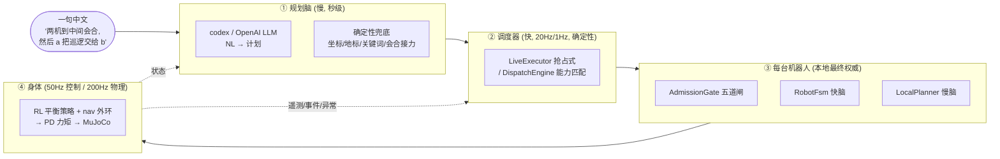
```mermaid
flowchart LR
    NL(["一句中文<br/>'两机到中间会合,<br/>然后 a 把巡逻交给 b'"])
    subgraph BRAIN["① 规划脑 (慢, 秒级)"]
        LLM["codex / OpenAI LLM<br/>NL → 计划"]
        DET["确定性兜底<br/>坐标/地标/关键词/会合接力"]
    end
    subgraph SCHED["② 调度器 (快, 20Hz/1Hz, 确定性)"]
        EX["LiveExecutor 抢占式<br/>/ DispatchEngine 能力匹配"]
    end
    subgraph ROBOT["③ 每台机器人 (本地最终权威)"]
        GATE["AdmissionGate 五道闸"]
        FSM["RobotFsm 快脑"]
        LP["LocalPlanner 慢脑"]
    end
    subgraph BODY["④ 身体 (50Hz 控制 / 200Hz 物理)"]
        RL["RL 平衡策略 + nav 外环<br/>→ PD 力矩 → MuJoCo"]
    end
    NL --> BRAIN --> SCHED --> ROBOT --> BODY
    BODY -.遥测/事件/异常.-> SCHED
    BODY -.状态.-> BRAIN
```

四个机制，从左到右：**规划脑提议 → 确定性调度裁决 → 本地安全门把关 → 身体自平衡执行**，再由遥测/异常闭环回去。
"智能"集中在 ①（LLM），但①**永远不能直接驱动身体**——它必须穿过②的确定性裁决和③的本地准入门。这就是整套
群体控制最重要的设计哲学：**Center proposes, edge disposes, robot refuses（中心提议，边缘裁决，机器人可拒）。**

---

## 1. 大局观：群体控制是"分形的快慢脑"

你已经熟悉**单机** G1 的三层脑（见 `g1_brain/README.md`）：

- **快脑 (fast brain)** —— `brain/realtime_agent.py`，~100 ms 的 OpenAI Realtime 语音环 + FSM 反射。
- **慢脑 (slow brain)** —— `memory/daemon.py` 的 `CodexDaemon`，常驻 `codex mcp-server`，做记忆/推理/工具调用。
- **安全技能层 (safe skill layer)** —— `safety/supervisor.py` + `safety/estop_client.py`，每个工具调用都过安全门，独立进程 E-stop。

**Fleet 做的事，本质上就是把同一套"快/慢脑 + 安全门"结构，在舰队这一级再套一层，然后用合约把两层连起来。**
这不是比喻——它在代码上是**字面复用**：

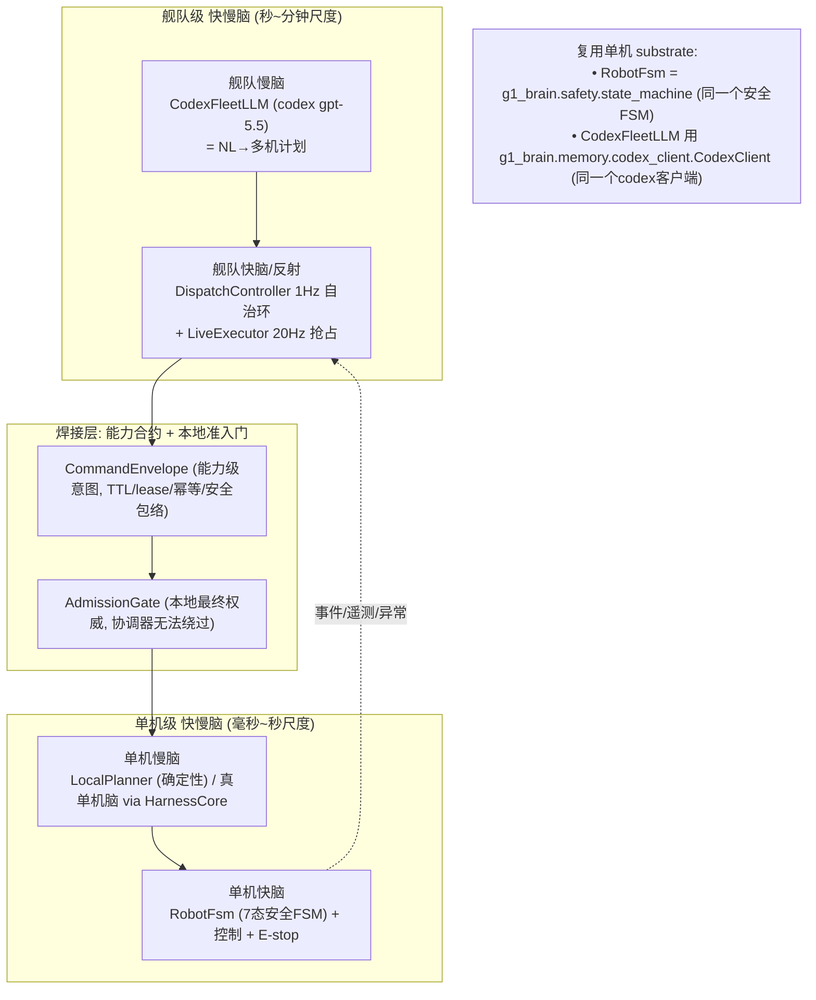
```mermaid
flowchart TB
    subgraph FLEETB["舰队级 快慢脑 (秒~分钟尺度)"]
        FSLOW["舰队慢脑<br/>CodexFleetLLM (codex gpt-5.5)<br/>= NL→多机计划"]
        FFAST["舰队快脑/反射<br/>DispatchController 1Hz 自治环<br/>+ LiveExecutor 20Hz 抢占"]
    end
    subgraph CONTRACT["焊接层: 能力合约 + 本地准入门"]
        CE["CommandEnvelope (能力级意图, TTL/lease/幂等/安全包络)"]
        AG["AdmissionGate (本地最终权威, 协调器无法绕过)"]
    end
    subgraph ROBOTB["单机级 快慢脑 (毫秒~秒尺度)"]
        RSLOW["单机慢脑<br/>LocalPlanner (确定性) / 真单机脑 via HarnessCore"]
        RFAST["单机快脑<br/>RobotFsm (7态安全FSM) + 控制 + E-stop"]
    end
    FSLOW --> FFAST --> CE --> AG --> RSLOW --> RFAST
    RFAST -.事件/遥测/异常.-> FFAST

    note["复用单机 substrate:<br/>• RobotFsm = g1_brain.safety.state_machine (同一个安全FSM)<br/>• CodexFleetLLM 用 g1_brain.memory.codex_client.CodexClient (同一个codex客户端)"]
```

两个"字面复用"的铁证（grep 可验证）：

| 舰队组件 | 复用的单机组件 | 含义 |
|---|---|---|
| `coordinator/codex_fleet_llm.py` | `from g1_brain.memory.codex_client import CodexClient` | **舰队慢脑和单机慢脑跑在同一个 codex 客户端上**，只是系统提示词和输出契约不同 |
| `harness_core/core.py`、`agent/sim_harness.py`、`agent/admission_gate.py`、`agent/local_planner.py` | `from g1_brain.safety.state_machine import RobotFsm, RobotFsmState` | **舰队里每台机器人的"快脑反射"用的就是单机那套 7 态安全状态机**，不是另写一套 |

所以"AI 群体控制是如何实现的"第一层答案是：**它没有发明新的智能，而是把已经验证过的单机快慢脑结构，递归地、
分形地往上套了一层，并用"能力合约 + 准入门"做联邦化（federation），让每台机器人保留自己的脑和最终拒绝权。**

### 1.1 四个时间尺度（来自 `coordinator-design.md` §4.2）

群体控制的"快慢"是分层的，每一层有自己的闭环和"是否允许 AI 独裁"的边界：

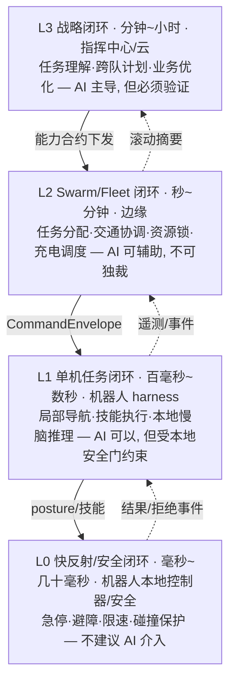
```mermaid
flowchart TB
    L3["L3 战略闭环 · 分钟~小时 · 指挥中心/云<br/>任务理解·跨队计划·业务优化 — AI 主导, 但必须验证"]
    L2["L2 Swarm/Fleet 闭环 · 秒~分钟 · 边缘<br/>任务分配·交通协调·资源锁·充电调度 — AI 可辅助, 不可独裁"]
    L1["L1 单机任务闭环 · 百毫秒~数秒 · 机器人 harness<br/>局部导航·技能执行·本地慢脑推理 — AI 可以, 但受本地安全门约束"]
    L0["L0 快反射/安全闭环 · 毫秒~几十毫秒 · 机器人本地控制器/安全<br/>急停·避障·限速·碰撞保护 — 不建议 AI 介入"]
    L3 -->|"能力合约下发"| L2 -->|"CommandEnvelope"| L1 -->|"posture/技能"| L0
    L0 -.结果/拒绝事件.-> L1 -.遥测/事件.-> L2 -.滚动摘要.-> L3
```

**铁律：越往下，AI 越不该碰；安全实时逻辑（L0）必须独立于 coordinator。** 这条原则贯穿整套代码——
比如 Live 路的 nav 速度限幅、Distributed 路的 AdmissionGate、单机的 E-stop，都是把"安全"钉死在边缘/本地。

---

## 2. 两套并存的架构 + 一套共享规划脑

代码库里其实有**两个** "coordinator"。它们**共享同一套规划数据契约和规划逻辑**，但运行形态完全不同。
搞清楚这一点是读懂 fleet 的前提。

| | **A · Live Command Center**（你日常跑的演示） | **B · Distributed Coordinator**（production-shaped 控制平面） |
|---|---|---|
| 入口 | `sim/command_center.py` | `coordinator/app.py` / `coordinator/__main__.py` |
| 机器人在哪 | **同一进程、同一个 MjModel**（两台 G1 真实物理） | 各自独立进程，WebSocket 接入 |
| 传输 | 无（同进程内存调用，线程安全方法） | WS 总线（`bus/ws_*`）或进程内 `loopback` |
| 舰队 AI 大脑 | **codex**（`CodexFleetLLM`，gpt-5.5/xhigh/fast） | **OpenAI**（`OpenAIFleetLLM`/`OpenAIChatLLM`）或确定性 |
| 调度器 | `LiveExecutor`（抢占式单任务，20Hz） | `DispatchEngine`（能力/健康匹配 + 异常重分配，1Hz） |
| 每机安全门 | **无**（信任内部规划 + nav 限幅） | **每机 `AdmissionGate`**（TTL/幂等/能力/FSM） |
| 每机"脑" | RL 平衡控制器（`RlSharedBackend`） | `SimRobotHarness` = FSM + LocalPlanner + Gate + Thermal + Backend |
| 你看到的 | MuJoCo 3D 窗口 + 网页俯视图 (:8787) | HTML 仪表盘（SVG 小人 + 事件流，:8090） |
| 物理 | RL 速度策略真实自平衡，两机一世界 | 弹力带悬挂单机物理 / DDS 双进程 / mock |
| 演示重点 | "看 AI 指挥两台机器人实时协同动作" | "看异常→自治重分配→全程审计的控制平面" |

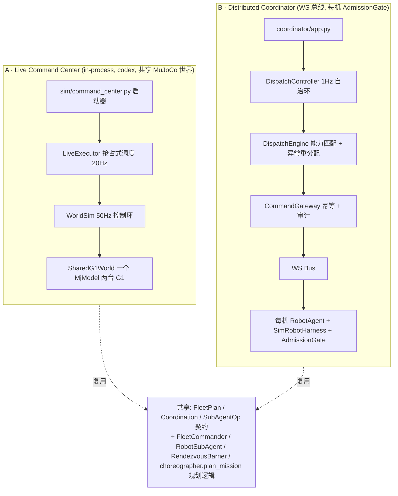
```mermaid
flowchart TB
    subgraph A["A · Live Command Center (in-process, codex, 共享 MuJoCo 世界)"]
        direction TB
        A1["sim/command_center.py 启动器"]
        A2["LiveExecutor 抢占式调度 20Hz"]
        A3["WorldSim 50Hz 控制环"]
        A4["SharedG1World 一个 MjModel 两台 G1"]
        A1 --> A2 --> A3 --> A4
    end
    subgraph B["B · Distributed Coordinator (WS 总线, 每机 AdmissionGate)"]
        direction TB
        B1["coordinator/app.py"]
        B2["DispatchController 1Hz 自治环"]
        B3["DispatchEngine 能力匹配 + 异常重分配"]
        B4["CommandGateway 幂等 + 审计"]
        B5["WS Bus"]
        B6["每机 RobotAgent + SimRobotHarness + AdmissionGate"]
        B1 --> B2 --> B3 --> B4 --> B5 --> B6
    end
    SHARED["共享: FleetPlan / Coordination / SubAgentOp 契约<br/>+ FleetCommander / RobotSubAgent / RendezvousBarrier / choreographer.plan_mission 规划逻辑"]
    A -.复用.-> SHARED
    B -.复用.-> SHARED
```

**为什么有两套？** A 是"边看边指挥"的真实物理演示（强调 AI→协同动作的视觉冲击力）；B 是"如果上真机/上规模该
怎么搭"的工程蓝图（强调合约、安全门、审计、异常自治）。**二者共享同一颗规划脑**，所以 A 里 codex 编排不出来时
会落到 B 的 `FleetCommander`+`RobotSubAgent`+`RendezvousBarrier`（见 §4、§11）。下面分机制讲透。

---

## 3. 机制一：能力合约——群体控制的"通用语"

> 这是整套群体控制最核心的抽象。**没有它，就没有"群体控制"，只有"遥控一堆机器人"。**

### 3.1 思想：从"控制机器人"变成"发布能力合约"

`coordinator-design.md` §5.1 的定型句：

> Coordinator 不应该说"调用某品牌 API 让机器人去 x,y"，而应该说：
> **在某个时间窗口内，请一个满足能力约束的执行体，在安全策略 S 和资源锁 R 下，完成任务 T；
> 执行体可以接受、拒绝、降级或请求澄清。**

为什么这个抽象是群体控制的关键？因为它把**"想要什么 (intent)"和"怎么做到 (embodiment)"解耦**：

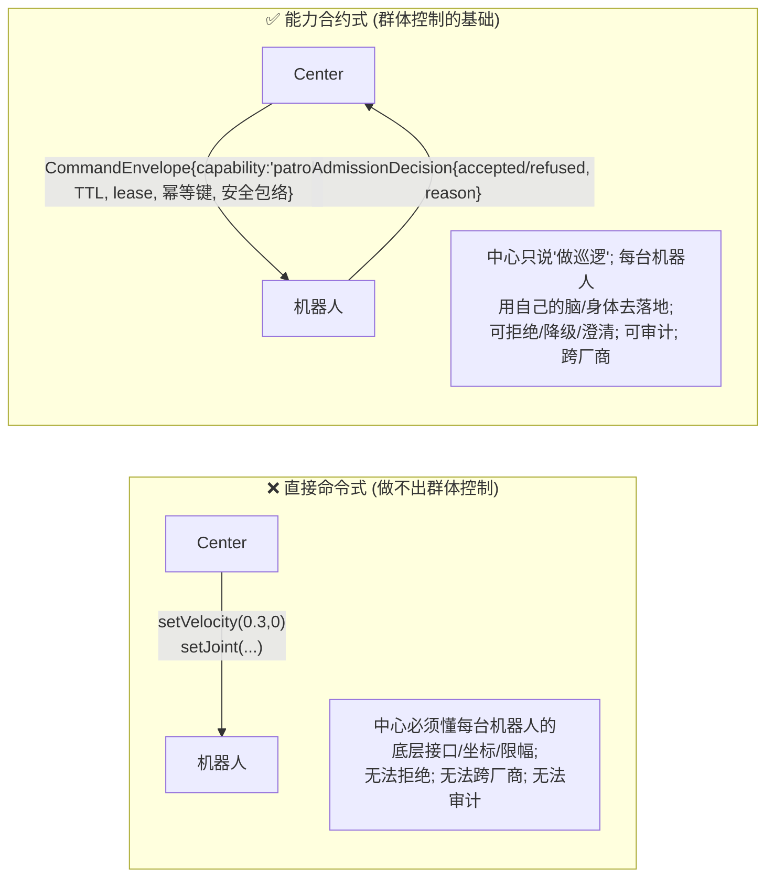
```mermaid
flowchart LR
    subgraph BAD["❌ 直接命令式 (做不出群体控制)"]
        C1["Center"] -->|"setVelocity(0.3,0)<br/>setJoint(...)"| R1["机器人"]
        note1["中心必须懂每台机器人的<br/>底层接口/坐标/限幅;<br/>无法拒绝; 无法跨厂商; 无法审计"]
    end
    subgraph GOOD["✅ 能力合约式 (群体控制的基础)"]
        C2["Center"] -->|"CommandEnvelope{capability:'patrol',<br/>TTL, lease, 幂等键, 安全包络}"| R2["机器人"]
        R2 -->|"AdmissionDecision{accepted/refused, reason}"| C2
        note2["中心只说'做巡逻'; 每台机器人<br/>用自己的脑/身体去落地;<br/>可拒绝/降级/澄清; 可审计; 跨厂商"]
    end
```

**这就是群体可以"智能"的根本原因**：中心不需要懂每台机器人的关节、步态、坐标系；它只在**能力层**说话。
每台机器人用自己的快慢脑把"能力意图"翻译成具体动作。中心因此能同时指挥异构的一群机器人，而不被任何一台的
底层细节绑死。

### 3.2 五个契约消息（`contracts/models.py`，pydantic v1 风格 schema_version 化）

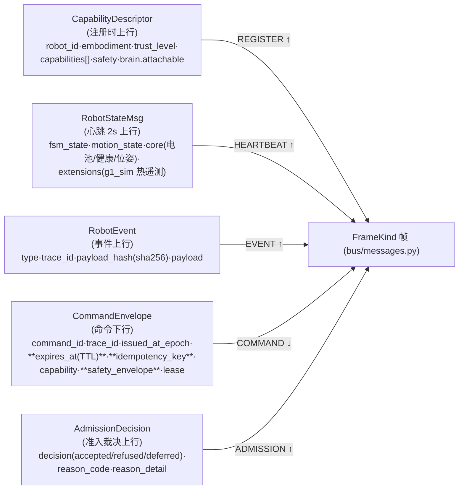
```mermaid
flowchart LR
    CD["CapabilityDescriptor<br/>(注册时上行)<br/>robot_id·embodiment·trust_level·<br/>capabilities[]·safety·brain.attachable"]
    RS["RobotStateMsg<br/>(心跳 2s 上行)<br/>fsm_state·motion_state·core(电池/健康/位姿)·<br/>extensions(g1_sim 热遥测)"]
    RE["RobotEvent<br/>(事件上行)<br/>type·trace_id·payload_hash(sha256)·payload"]
    CE["CommandEnvelope<br/>(命令下行)<br/>command_id·trace_id·issued_at_epoch·<br/>**expires_at(TTL)**·**idempotency_key**·<br/>capability·**safety_envelope**·lease"]
    AD["AdmissionDecision<br/>(准入裁决上行)<br/>decision(accepted/refused/deferred)·<br/>reason_code·reason_detail"]
    CD -->|REGISTER ↑| BUS["FrameKind 帧 (bus/messages.py)"]
    RS -->|HEARTBEAT ↑| BUS
    RE -->|EVENT ↑| BUS
    CE -->|COMMAND ↓| BUS
    AD -->|ADMISSION ↑| BUS
```

**每个字段都不是装饰**，而是某条群体控制不变式的载体：

| 字段 | 解决的问题 | 不变式 |
|---|---|---|
| `expires_at` (TTL) | 旧命令在网络延迟后被错误执行 | 过期命令本地直接拒绝（`AdmissionGate` 第 1 道闸） |
| `idempotency_key` | 重试/重连导致命令被执行两次 | 同一键只处理一次（`AdmissionGate` 第 2 道闸 + `CommandGateway` 幂等） |
| `trace_id` | 一条意图散成几十条事件后无法追因 | 所有相关事件可按 trace_id `replay`（§11） |
| `safety_envelope` | 中心下发超出安全范围的动作 | max_speed/approval_id 等本地兜底 |
| `lease` | 网络分区后中心还以为自己拥有机器人 | 授权有时限，过期自动 sleep（§9） |
| `payload_hash` | 命令/事件在总线上被篡改 | sha256 完整性校验 |

> 这五个消息 + `FrameKind`（`REGISTER/HEARTBEAT/EVENT/COMMAND/ADMISSION/PING/PONG`）就是 B 路总线上流动的
> **全部**协议。注意：**下行永远是"能力 + payload"，绝不是关节/速度命令**——这条线是安全的，因为身体永远由
> 本地脑驱动（对应 `coordinator-design.md` §19.2 的红线"Center 能直接发布底层速度/关节命令 = 不应上线"）。

---

## 4. 机制二：规划脑——自然语言 → 计划

> 这是"智能"真正发生的地方。但请记住贯穿全文的原则：**LLM 只是提议者 (proposer)，确定性引擎才是处置者
> (disposer)。** 规划脑的输出永远要过校验、过调度引擎、过本地准入门。

### 4.1 路由：`plan_mission()` 的三层决策（`coordinator/choreographer.py`）

Live 路的"大脑路由器"是 `plan_mission(nl, snapshot, llm, sub_llm)`。它按优先级尝试，**确定性优先、LLM 兜底**
（在 Live 路反过来：codex 优先、确定性兜底，因为演示要丰富动作）：

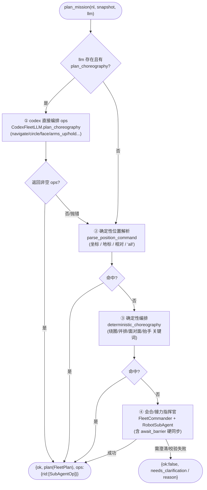
```mermaid
flowchart TD
    START(["plan_mission(nl, snapshot, llm)"])
    Q1{"llm 存在且有<br/>plan_choreography?"}
    C1["① codex 直接编排 ops<br/>CodexFleetLLM.plan_choreography<br/>(navigate/circle/face/arms_up/hold...)"]
    Q1OK{"返回非空 ops?"}
    POS["② 确定性位置解析<br/>parse_position_command<br/>(坐标 / 地标 / 相对 / 'all')"]
    Q2{"命中?"}
    DET["③ 确定性编排<br/>deterministic_choreography<br/>(绕圈/并排/面对面/抬手 关键词)"]
    Q3{"命中?"}
    CMD["④ 会合/接力指挥官<br/>FleetCommander + RobotSubAgent<br/>(含 await_barrier 硬同步)"]
    OUT(["{ok, plan(FleetPlan), ops:{rid:[SubAgentOp]}}"])
    FAIL(["{ok:false, needs_clarification / reason}"])
    START --> Q1
    Q1 -->|是| C1 --> Q1OK
    Q1OK -->|是| OUT
    Q1OK -->|否/抛错| POS
    Q1 -->|否| POS
    POS --> Q2
    Q2 -->|是| OUT
    Q2 -->|否| DET --> Q3
    Q3 -->|是| OUT
    Q3 -->|否| CMD
    CMD -->|需澄清/校验失败| FAIL
    CMD -->|成功| OUT
```

四条路的分工：

| 路 | 何时走 | 谁来做 | 典型指令 |
|---|---|---|---|
| ① codex 编排 | codex 可用且能解析出 ops | `CodexFleetLLM.plan_choreography`（LLM） | "两机表演:先绕圈,再并排面对面,然后一起抬手" |
| ② 位置解析 | ①失败 + 命中坐标/地标/相对/all | `nl_position.parse_position_command`（**纯确定性、离线**） | "g1_a 走到 2,1"、"两机都去集合点"、"前进 3 米" |
| ③ 关键词编排 | ①②失败 + 命中编排关键词 | `deterministic_choreography`（**纯确定性、离线**） | "顺时针绕圈"、"面对面"、"抬手" |
| ④ 会合/接力指挥官 | 前三条都不命中 | `FleetCommander`+`RobotSubAgent`+`Barrier` | "到中间会合,a 把巡逻交给 b"（**唯一带硬屏障同步的路**） |

> ⚠️ **关键细节**：codex 的编排词汇里**没有 `await_barrier`**。所以真正"到点后同步等待对方"的硬会合屏障，
> 只来自 ④（或 B 路 `/chat`）。codex 编排出的"会合"是各自 navigate 到质心附近、并发推进、无硬同步——
> 对演示足够，要硬屏障同步就走 ④。

### 4.2 舰队慢脑 = codex（`coordinator/codex_fleet_llm.py`）

**这就是"舰队级慢脑"，和单机慢脑跑在同一个 `CodexClient` 上**（§1.1 的铁证之一）：

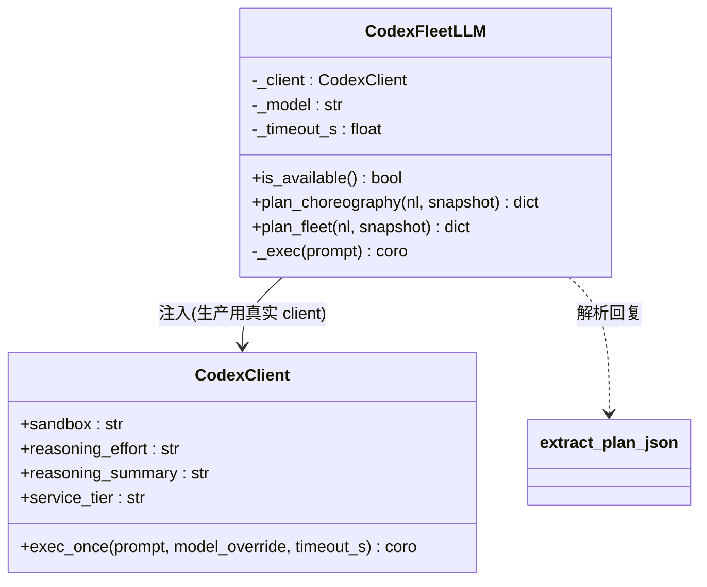
```mermaid
classDiagram
    class CodexFleetLLM {
        -_client : CodexClient
        -_model : str
        -_timeout_s : float
        +is_available() bool
        +plan_choreography(nl, snapshot) dict
        +plan_fleet(nl, snapshot) dict
        -_exec(prompt) coro
    }
    class CodexClient {
        +sandbox : str
        +reasoning_effort : str
        +reasoning_summary : str
        +service_tier : str
        +exec_once(prompt, model_override, timeout_s) coro
    }
    CodexFleetLLM --> CodexClient : 注入(生产用真实 client)
    CodexFleetLLM ..> extract_plan_json : 解析回复
```

- `plan_choreography` 用 `_CHOREO_SYS` 系统提示 → codex 输出 `{summary, ops:{rid:[{op,args}]}}`（①路用）。
- `plan_fleet` 用 `_SYS` 系统提示 → codex 输出一个 `FleetPlan`（④路里 `FleetCommander` 用）。
- 实时回路调优：`gpt-5.5` / `reasoning_effort=xhigh` / `service_tier=fast`（1.5× 优先级）/ `sandbox=read-only` /
  90s 超时。承自操作员标准 codex 配置，但为低延迟加了 fast tier。
- **桥接**：codex 调用是 async，而 `plan_*` 跑在线程池线程（无 running loop），所以内部用 `asyncio.run(self._exec(...))`。
- **永不硬阻塞操作员**：codex 出错或无可解析 JSON → 抛异常 → 上层回退到确定性规划。

> 为什么模型是 `gpt-5.5` 而不是默认的 `gpt-5.3-codex`？因为该 ChatGPT 账户拒绝默认模型；`CodexClient` 强制
> `--ignore-user-config`，所以模型必须经 `-m`/`model_override` 传。这是踩过的坑（见仓库 memory）。

### 4.3 从 codex 的"推理 + 散文"里抠出纯 JSON（`extract_plan_json`）

codex（尤其 xhigh）会把答案裹在推理摘要、散文、```json 围栏里，而 plan 本身又是嵌套对象数组，**正则搞不定**。
解法是**括号配平扫描**（处理字符串字面量与转义），找出第一个平衡的顶层 `{...}`：

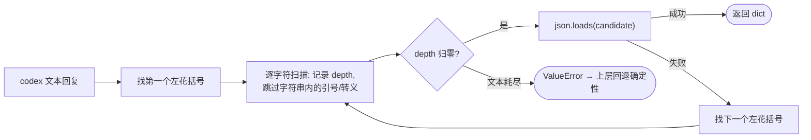
```mermaid
flowchart LR
    T["codex 文本回复"] --> F["找第一个左花括号"]
    F --> SCAN["逐字符扫描: 记录 depth,<br/>跳过字符串内的引号/转义"]
    SCAN --> Z{"depth 归零?"}
    Z -->|是| TRY["json.loads(candidate)"]
    TRY -->|成功| OK(["返回 dict"])
    TRY -->|失败| NEXT["找下一个左花括号"] --> SCAN
    Z -->|文本耗尽| ERR(["ValueError → 上层回退确定性"])
```

### 4.4 "LLM 提议，确定性裁决"——系统提示是契约，`parse_ops` 是裁决

两套系统提示词强制 codex 只回原始 JSON、只能用 snapshot 里存在的 `robot_id`、只能用合法 op。**但 codex 说什么
不算数**——`parse_ops(raw, known_ids)` 才是裁决者：

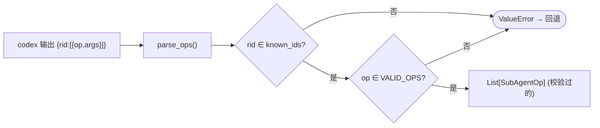
```mermaid
flowchart LR
    LLM["codex 输出 {rid:[{op,args}]}"] --> PO["parse_ops()"]
    PO --> V1{"rid ∈ known_ids?"}
    V1 -->|否| RAISE(["ValueError → 回退"])
    V1 -->|是| V2{"op ∈ VALID_OPS?"}
    V2 -->|否| RAISE
    V2 -->|是| EMIT["List[SubAgentOp] (校验过的)"]
```

`VALID_OPS`（`choreographer.VALID_OPS`）= 群体动作的**封闭词汇表**：

```
navigate · await_barrier · patrol · idle · sleep · wake · circle · face · arms_up · hold
```

> 这是防 LLM 幻觉/越权的关键护栏：LLM 再怎么"自由发挥"，也只能从这 10 个动作里选，目标点只能引用已知机器人。
> 它**不可能**让机器人执行词汇表外的任意动作。对应 `coordinator-design.md` §19.2 红线"AI 可以输出并执行任意脚本"。

### 4.5 确定性兜底（离线也能可靠跑 demo）

两条纯关键词路，让系统**没有 codex、没有 API key 也能跑**：

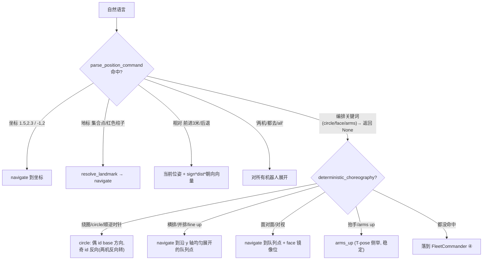
```mermaid
flowchart TD
    NL["自然语言"] --> P{"parse_position_command<br/>命中?"}
    P -->|"坐标 1.5,2.3 / -1,2"| COORD["navigate 到坐标"]
    P -->|"地标 集合点/红色柱子"| LM["resolve_landmark → navigate"]
    P -->|"相对 前进3米/后退"| REL["当前位姿 + sign*dist*朝向向量"]
    P -->|"'两机/都去/all'"| ALL["对所有机器人展开"]
    P -->|"编排关键词(circle/face/arms)→ 返回 None"| C{"deterministic_choreography?"}
    C -->|"绕圈/circle/顺逆时针"| CIR["circle: 偶 id base 方向,<br/>奇 id 反向(两机反向转)"]
    C -->|"横排/并排/line up"| ROW["navigate 到沿 y 轴均匀展开的队列点"]
    C -->|"面对面/对视"| FACE["navigate 到队列点 + face 镜像位"]
    C -->|"抬手/arms up"| ARMS["arms_up (T-pose 侧举, 稳定)"]
    C -->|"都没命中"| CMD["落到 FleetCommander ④"]
```

`parse_position_command` 的关键正则：`_RID_RE=(g1_[a-z])`、`_COORD_RE` 抓 `x,y`（支持中英逗号）、`_DIST_RE` 抓
`5m/3.2米`；`_FWD/_BACK/_ALL` 关键词集；遇到 `_CHOREO`/`_COMMANDER` 关键词**主动返回 None**，让路由继续往下走。

### 4.6 会合/接力指挥官（④路，唯一的硬同步路）—— `fleet_commander.py` + `robot_subagent.py`

这是 A、B 两套架构**共享的规划核心**。分两层：舰队级拆解 + 每机展开。

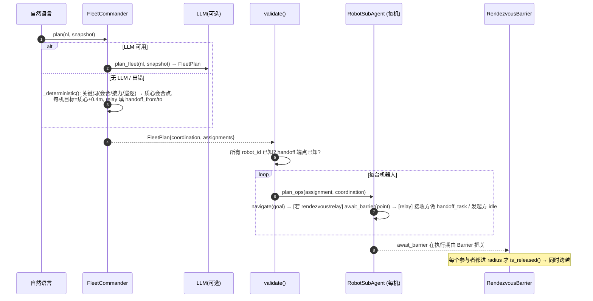
```mermaid
sequenceDiagram
    autonumber
    participant NL as 自然语言
    participant FC as FleetCommander
    participant LLM as LLM(可选)
    participant V as validate()
    participant SA as RobotSubAgent (每机)
    participant B as RendezvousBarrier
    NL->>FC: plan(nl, snapshot)
    alt LLM 可用
        FC->>LLM: plan_fleet(nl, snapshot) → FleetPlan
    else 无 LLM / 出错
        FC->>FC: _deterministic(): 关键词(会合/接力/巡逻) → 质心会合点,<br/>每机目标=质心±0.4m, relay 填 handoff_from/to
    end
    FC-->>V: FleetPlan{coordination, assignments}
    V->>V: 所有 robot_id 已知? handoff 端点已知?
    loop 每台机器人
        V->>SA: plan_ops(assignment, coordination)
        SA->>SA: navigate(goal) → [若 rendezvous/relay] await_barrier(point) → [relay] 接收方做 handoff_task / 发起方 idle
    end
    SA-->>B: await_barrier 在执行期由 Barrier 把关
    Note over B: 每个参与者都进 radius 才 is_released() → 同时跨越
```

- `RobotSubAgent.plan_ops` 的确定性展开：`navigate(goal)` → 若 `coordination.type ∈ {rendezvous, relay}` 加
  `await_barrier(point)` → 若 relay，`handoff_to` 那台执行 `handoff_task`（默认 patrol），`handoff_from` 那台 `idle`。
- **`RendezvousBarrier`（`coordinator/barrier.py`）—— 协同时机绝不交给 LLM**：

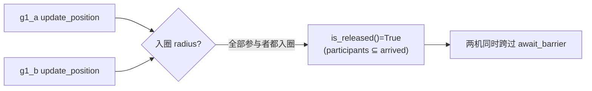
```mermaid
flowchart LR
    A["g1_a update_position"] --> CHK{"入圈 radius?"}
    B["g1_b update_position"] --> CHK
    CHK -->|"全部参与者都入圈"| REL["is_released()=True<br/>(participants ⊆ arrived)"]
    REL --> GO["两机同时跨过 await_barrier"]
```

> 这是"群体协同"和"各干各的"的分水岭：**真正的同步靠确定性屏障，不靠 LLM"算时间"**。LLM 负责"决定要会合"，
> 屏障负责"确保真的同时到齐"。

---

## 5. 机制三：调度与执行——计划 → 机器人动作

规划脑产出 `(plan, ops)` 之后，由**调度器**把它对着活的世界跑。两套架构有两个调度器，对应"舰队快脑/反射"。

### 5.1 A 路：`LiveExecutor` 抢占式调度（`sim/live_executor.py`）—— "最新意图获胜"

执行器**只持有一个当前任务 `Mission`**。新指令来了，`submit()` 自增 `_gen`、**直接换掉** `_mission`——
长生命周期的 `run()` 循环下一回合自然驱动新任务，无需任何 task 编排/取消。这就是抢占。

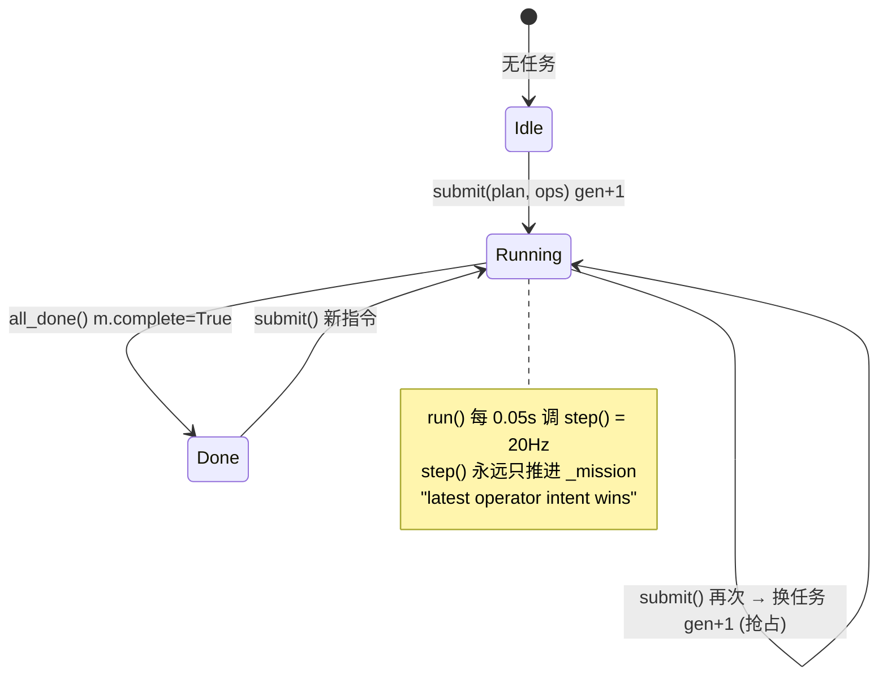
```mermaid
stateDiagram-v2
    [*] --> Idle: 无任务
    Idle --> Running: submit(plan, ops) gen+1
    Running --> Running: submit() 再次 → 换任务 gen+1 (抢占)
    Running --> Done: all_done() m.complete=True
    Done --> Running: submit() 新指令
    note right of Running
        run() 每 0.05s 调 step() = 20Hz
        step() 永远只推进 _mission
        "latest operator intent wins"
    end note
```

`step()` 每 20Hz 对每台机器人取当前 op，发指令给 world 并检查完成条件，完成则指针 `ptr[rid] += 1`：

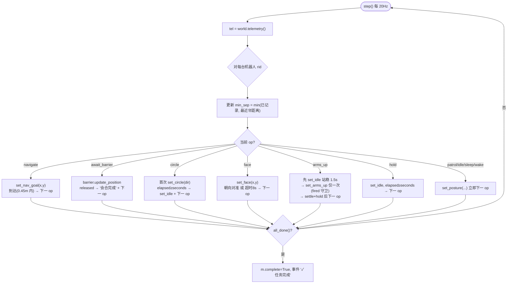
```mermaid
flowchart TD
    STEP(["step() 每 20Hz"]) --> TEL["tel = world.telemetry()"]
    TEL --> EACH{"对每台机器人 rid"}
    EACH --> MINSEP["更新 min_sep = min(已记录, 最近邻距离)"]
    MINSEP --> OP{"当前 op?"}
    OP -->|navigate| NAV["set_nav_goal(x,y)<br/>到达(0.45m 内) → 下一 op"]
    OP -->|await_barrier| BAR["barrier.update_position<br/>released → '会合完成' + 下一 op"]
    OP -->|circle| CIR["首次 set_circle(dir)<br/>elapsed≥seconds → set_idle + 下一 op"]
    OP -->|face| FAC["set_face(x,y)<br/>朝向对准 或 超时8s → 下一 op"]
    OP -->|arms_up| ARM["先 set_idle 站稳 1.5s<br/>→ set_arms_up 仅一次(fired 守卫)<br/>→ settle+hold 后下一 op"]
    OP -->|hold| HLD["set_idle, elapsed≥seconds → 下一 op"]
    OP -->|patrol/idle/sleep/wake| POS["set_posture(...) 立即下一 op"]
    NAV & BAR & CIR & FAC & ARM & HLD & POS --> DONE{"all_done()?"}
    DONE -->|是| FIN["m.complete=True, 事件 '✓ 任务完成'"]
    DONE -->|否| STEP
```

每个 op 的精确完成语义（执行器侧守卫，含工程教训）：

| op | 起始动作 | 完成条件 | 关键常量 / 教训 |
|---|---|---|---|
| `navigate` | `set_nav_goal(x,y)` 持续 | `hypot(pos-goal) < 0.45` | `arrive_radius=0.45` |
| `await_barrier` | 喂位置给 barrier | `barrier.is_released()`（全员入圈 0.7m） | 首次释放发"会合完成" |
| `circle` | `set_circle(dir)` 一次 | `elapsed ≥ seconds`（默认 10） | 结束 `set_idle` |
| `face` | `set_face(x,y)` 持续 | `abs(heading_err) < 0.2 rad` 或 `8s` 超时 | `_FACE_DONE=0.2 / _FACE_TIMEOUT=8` |
| `arms_up` | `set_idle` 站稳 | `elapsed ≥ 1.5(settle)+hold` | **`_ARMS_SETTLE=1.5s`：抬手必须先站稳**，边走边举会让平衡策略发散摔倒；`fired` 集合保证只触发一次 |
| `hold` | `set_idle` | `elapsed ≥ seconds`（默认 2） | |
| `patrol/idle/sleep/wake` | `set_posture(...)` | 立即推进 | 纯姿态切换 |

> **规划与执行解耦**：`POST /command` 只做一件事——把 codex 规划出的 `(plan, ops)` `submit` 给执行器然后立即
> 返回。真正驱动机器人的是后台那条 20Hz 的 `LiveExecutor.run()`。HTTP 永不阻塞在 LLM 上（§10）。

### 5.2 B 路：`DispatchEngine` 能力匹配调度（`coordinator/dispatch.py`）—— "引擎决定，不是 LLM 决定"

B 路没有"抢占式单任务"，而是**确定性的任务-机器人分配引擎**。它是整套群体调度里"裁决"的核心：

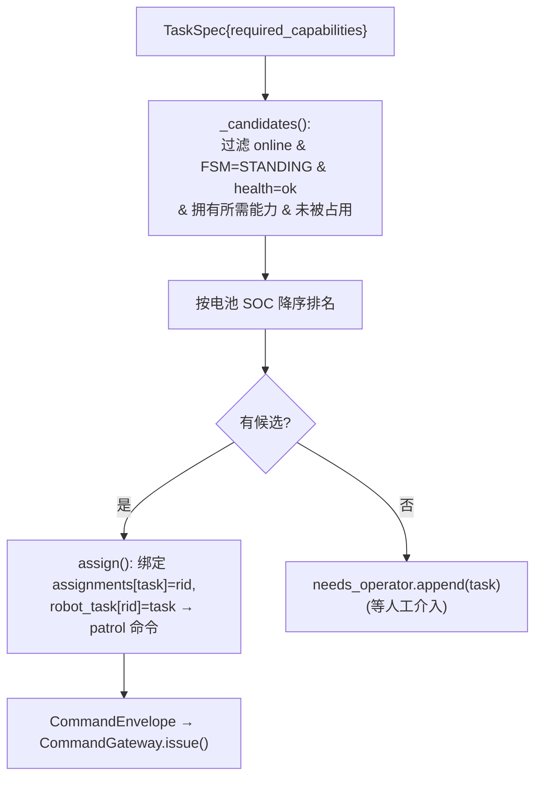
```mermaid
flowchart TD
    TASK["TaskSpec{required_capabilities}"] --> CAND["_candidates():<br/>过滤 online & FSM=STANDING & health=ok<br/>& 拥有所需能力 & 未被占用"]
    CAND --> SORT["按电池 SOC 降序排名"]
    SORT --> PICK{"有候选?"}
    PICK -->|是| BIND["assign(): 绑定 assignments[task]=rid,<br/>robot_task[rid]=task → patrol 命令"]
    PICK -->|否| WAIT["needs_operator.append(task)<br/>(等人工介入)"]
    BIND --> ENV["CommandEnvelope → CommandGateway.issue()"]
```

四个核心动作（都返回 `CommandEnvelope`，绝不直接动机器人）：

| 方法 | 作用 |
|---|---|
| `assign(task)` | 选最佳健康候选，绑定，发 `patrol` |
| `release(rid)` | 解绑机器人，返回它持有的 task |
| `reassign(task, exclude)` | 排除故障机，把 task 重分配给次优候选，发 `resume_task` |
| `handle_anomaly(a)` | 两步计划：① sleep 异常机 ② reassign 它的 task |
| `takeover(from, to)` | release from + idle，把 task 绑到 to，发 `resume_task` |

> **"LLM 提议，引擎决定"在这里最清楚**：`CoordinatorAgent`/`FleetCommander`（LLM）把 NL 变成结构化意图，但
> **最终选哪台机器人干活，永远是 `_candidates()` 这段确定性代码按 SOC 排名决定的**。LLM 不参与分配。

---

## 6. 机制四：每台机器人的快慢脑 + 安全门（与单机脑交互的关键）

> **这一节直接回答用户的核心问题**："群体控制机制是如何和机器人自己的快慢脑交互的？"
> 答案：通过 **B 路每台机器人内部的 `SimRobotHarness`** —— 它就是单机快慢脑结构在舰队语境下的实例化，
> 并通过 `AdmissionGate` 这道**协调器无法绕过的本地最终权威**与中心交互。

### 6.1 `SimRobotHarness` 解剖（`agent/sim_harness.py`）

每台机器人在 B 路里是一个独立进程，进程里跑一个 `SimRobotHarness`。它**就是一套完整的"单机快慢脑 + 安全门"**：

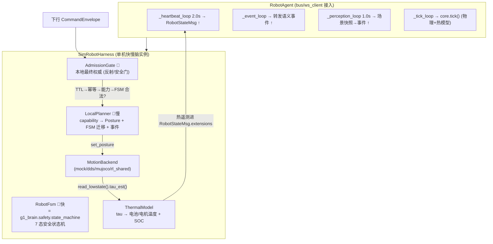
```mermaid
flowchart TB
    subgraph AGENT["RobotAgent (bus/ws_client 接入)"]
        HB["_heartbeat_loop 2.0s → RobotStateMsg ↑"]
        EV["_event_loop → 转发语义事件 ↑"]
        PER["_perception_loop 1.0s → 场景快照→事件 ↑"]
        TK["_tick_loop → core.tick() (物理+热模型)"]
    end
    subgraph CORE["SimRobotHarness (单机快慢脑实例)"]
        GATE["AdmissionGate 🚪<br/>本地最终权威 (反射/安全门)"]
        FSM["RobotFsm 🧠快<br/>= g1_brain.safety.state_machine<br/>7 态安全状态机"]
        LP["LocalPlanner 🧠慢<br/>capability → Posture + FSM 迁移 + 事件"]
        TM["ThermalModel<br/>tau → 电池/电机温度 + SOC"]
        BK["MotionBackend<br/>(mock/dds/mujoco/rl_shared)"]
    end
    DOWN["下行 CommandEnvelope"] --> GATE
    GATE -->|"TTL→幂等→能力→FSM 合法?"| LP
    LP -->|set_posture| BK
    BK -->|"read_lowstate().tau_est()"| TM
    TM -->|"热遥测进 RobotStateMsg.extensions"| HB
    AGENT --> CORE
```

注意三层的对应关系（这就是分形）：

| 单机三层脑 | 舰队里每机的对应物 | 代码 |
|---|---|---|
| 快脑（FSM 反射） | `RobotFsm`（**同一个 7 态安全 FSM**） | `g1_brain.safety.state_machine` |
| 慢脑（推理/规划） | `LocalPlanner`（确定性 cap→posture；可挂 explain_hook/真单机脑） | `agent/local_planner.py` |
| 安全技能层（supervisor + estop） | `AdmissionGate`（本地最终权威，五道闸） | `agent/admission_gate.py` |

### 6.2 `AdmissionGate` —— 协调器无法绕过的本地最终权威

这是**整套群体控制安全性的基石**。中心再"智能"，每条下行命令也必须过这道本地门，机器人随时能拒绝：

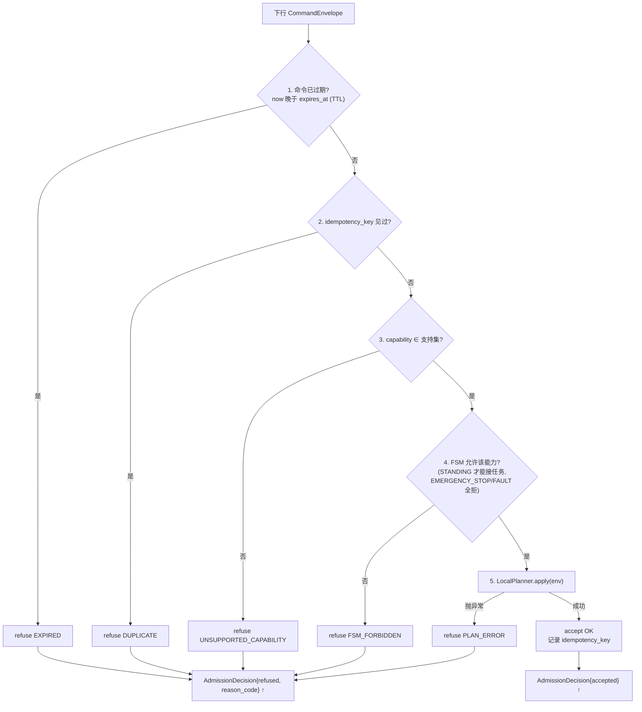
```mermaid
flowchart TD
    ENV["下行 CommandEnvelope"] --> G1{"1. 命令已过期?<br/>now 晚于 expires_at (TTL)"}
    G1 -->|是| R1["refuse EXPIRED"]
    G1 -->|否| G2{"2. idempotency_key 见过?"}
    G2 -->|是| R2["refuse DUPLICATE"]
    G2 -->|否| G3{"3. capability ∈ 支持集?"}
    G3 -->|否| R3["refuse UNSUPPORTED_CAPABILITY"]
    G3 -->|是| G4{"4. FSM 允许该能力?<br/>(STANDING 才能接任务,<br/>EMERGENCY_STOP/FAULT 全拒)"}
    G4 -->|否| R4["refuse FSM_FORBIDDEN"]
    G4 -->|是| G5["5. LocalPlanner.apply(env)"]
    G5 -->|抛异常| R5["refuse PLAN_ERROR"]
    G5 -->|成功| OK["accept OK<br/>记录 idempotency_key"]
    R1 & R2 & R3 & R4 & R5 --> UP["AdmissionDecision{refused, reason_code} ↑"]
    OK --> UP2["AdmissionDecision{accepted} ↑"]
```

`admit()` 的真实顺序（`agent/admission_gate.py`，精简引用）：

```python
def admit(self, env: CommandEnvelope) -> AdmissionDecision:
    now = self._clock()
    self._seen = {k: v for k, v in self._seen.items() if v > now}  # 剪枝, 集合保持有界
    if now > env.expires_at:                          return refuse("EXPIRED")
    if env.idempotency_key in self._seen:             return refuse("DUPLICATE")
    if env.capability not in self._supported:         return refuse("UNSUPPORTED_CAPABILITY")
    if not self._fsm_allows(env.capability):          return refuse("FSM_FORBIDDEN")
    try:    self._planner.apply(env)                  # LocalPlanner 落地
    except Exception as e:                            return refuse("PLAN_ERROR", str(e))
    self._seen[env.idempotency_key] = env.expires_at
    return accepted("OK")
```

> 为什么叫"协调器无法绕过 (cannot bypass)"？因为**这道门在机器人进程里、在 FSM 旁边**，中心唯一能做的是
> 下发 `CommandEnvelope`——它**没有任何接口能直接改 FSM 状态或直接发关节命令**。机器人对中心永远有一票否决。
> 这正是 `coordinator-design.md` §18.3 的铁律：**Coordinator 不能绕过 slow brain / local admission gate 直接调用
> fast brain；slow brain 不能覆盖 fast brain 的安全停止。**

### 6.3 `LocalPlanner` —— 每机慢脑：能力 → 姿态 + FSM 迁移 + 事件

`LocalPlanner.apply(env)` 是"慢脑落地"的确定性实现：它把一个能力翻译成**姿态意图 + FSM 迁移 + 生命周期事件**，
**绝不直接发电机命令**（电机由 `MotionBackend` 选 PD 目标）：

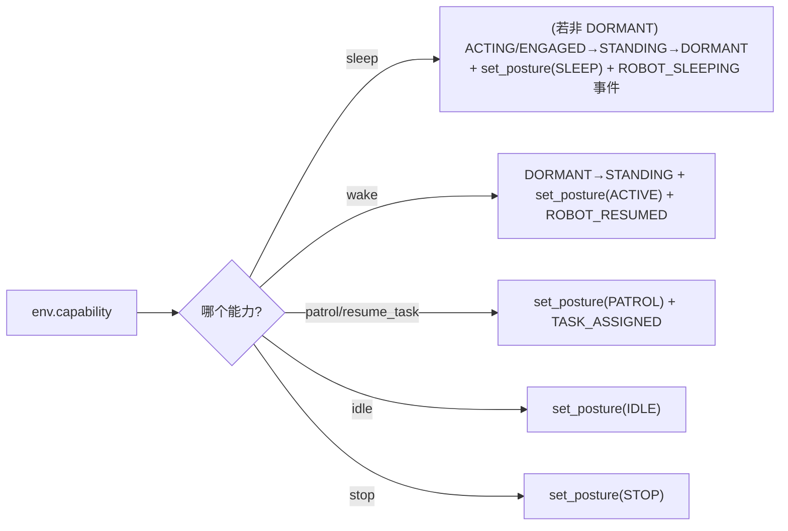
```mermaid
flowchart LR
    CAP["env.capability"] --> S{"哪个能力?"}
    S -->|sleep| SL["(若非 DORMANT) ACTING/ENGAGED→STANDING→DORMANT<br/>+ set_posture(SLEEP) + ROBOT_SLEEPING 事件"]
    S -->|wake| WK["DORMANT→STANDING + set_posture(ACTIVE) + ROBOT_RESUMED"]
    S -->|patrol/resume_task| PT["set_posture(PATROL) + TASK_ASSIGNED"]
    S -->|idle| ID["set_posture(IDLE)"]
    S -->|stop| ST["set_posture(STOP)"]
```

> **这里就是"真单机脑"的接入 seam**：`LocalPlanner` 现在是确定性的（cap→posture 映射 + 可选 `explain_hook`），
> 但它的位置正是单机慢脑/VLA 将来要插进来的地方——把"capability"理解成更复杂的局部任务，调本地工具/MCP，
> 选 behavior tree。`coordinator-design.md` §6.5 明确了分工：**全局任务拆解归 coordinator 慢脑，局部环境理解和
> 任务落地归单机慢脑，安全最终裁决永远归本地。**

### 6.4 `ThermalModel` —— 把"干活"变成"会累"，喂给异常闭环

群体控制要能"发现机器人快不行了并重分配"，就需要一个会随负载升温/掉电的物理量。`ThermalModel` 用每个关节的
**真实力矩 tau**（从 `MotionBackend.read_lowstate().tau_est()` 来）驱动温度和 SOC：

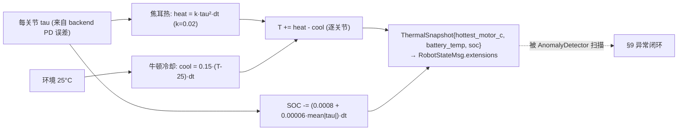
```mermaid
flowchart LR
    TAU["每关节 tau (来自 backend PD 误差)"] --> HEAT["焦耳热: heat = k·tau²·dt (k=0.02)"]
    AMB["环境 25°C"] --> COOL["牛顿冷却: cool = 0.15·(T-25)·dt"]
    HEAT --> T["T += heat - cool (逐关节)"]
    COOL --> T
    TAU --> DRAIN["SOC -= (0.0008 + 0.00006·mean|tau|)·dt"]
    T --> SNAP["ThermalSnapshot{hottest_motor_c, battery_temp, soc}<br/>→ RobotStateMsg.extensions"]
    DRAIN --> SNAP
    SNAP -.被 AnomalyDetector 扫描.-> ANOM["§9 异常闭环"]
```

电池温度 = 电机温度加权（`batt = 25 + 0.6·(mean_motor-25)`）。**力矩越大→越烫→越掉电→越容易触发异常→越容易被
中心 sleep 掉并重分配任务。** 这就把"物理疲劳"接进了"群体自治"。

### 6.5 四种 `MotionBackend` —— 同一套脑，不同的身体

`MotionBackend`（`agent/motion/base.py`）是协议抽象，让上面所有的脑/门逻辑**与具体物理后端解耦**。
`Posture` 枚举：`ACTIVE / PATROL / SLEEP / WAKE / IDLE / STOP / WALK`。四个实现：

```mermaid
flowchart TB
    BASE["MotionBackend 协议<br/>set_posture / step / read_lowstate / close"]
    BASE --> MOCK["MockBackend<br/>CI 测试, 无物理<br/>posture→固定 tau (PATROL=14, IDLE=4...)"]
    BASE --> DDS["DdsMujocoBackend<br/>双进程: 发 rt/lowcmd, 收 rt/lowstate<br/>每机一个 DDS domain"]
    BASE --> MJ["MujocoBackend<br/>单进程弹力带单机物理<br/>tau = kp·(q_target-q) - kd·dq"]
    BASE --> RL["RlSharedBackend ⭐<br/>共享世界多机 RL 策略<br/>(§7 / Live 路用的就是它)"]
```

> 关键：**换身体不换脑**。`SimRobotHarness` 的 FSM/LocalPlanner/AdmissionGate/ThermalModel 一行不改，
> 就能从 mock（CI）切到 DDS 双进程（接近真机）切到 RL 共享世界（Live 演示）。这正是能力合约解耦的红利。

### 6.6 接真单机脑的 seam：`HarnessCore` + `OperatorBrainSession`

B 路的 `SimRobotHarness` 是**自包含的**仿真脑（FSM + 确定性 LocalPlanner），它不直接调用单机的
`BrainRealtimeAgent` 或 `CodexDaemon`。但代码里**预留了把真单机脑接上去的位置**：

```mermaid
flowchart TB
    subgraph SIM["仿真/演示用 (现在跑的)"]
        SH["SimRobotHarness<br/>FSM + 确定性 LocalPlanner + Gate"]
    end
    subgraph REAL["真单机脑接入 (seam, 设计就位)"]
        HC["HarnessCore (harness_core/core.py)<br/>只读 facade: 包真实 RobotFsm /<br/>SceneStateBus / RobotStateBus / EventSink"]
        OBS["OperatorBrainSession (brain_session.py)<br/>protocol: attach(core) / detach()<br/>= 语音快脑 attach 到本地 core 的接口"]
        HC -.attach.- OBS
    end
    BUS["Fleet WS Bus"]
    SIM --> BUS
    REAL --> BUS
    note["两条都经同一总线、同一契约、同一 AdmissionGate;<br/>中心分不出对面是仿真脑还是真单机三层脑——<br/>这正是能力合约的意义"]
```

- `HarnessCore` 是**只读 facade**：默认只暴露状态/事件（给中心看），可选注入 `admission_gate` + `thermal` 后才
  变成"可接命令"。它包的是**真实的单机 `RobotFsm` / `SceneStateBus` / `RobotStateBus` / `EventSink`**——
  也就是单机三层脑用的同一批组件。
- `OperatorBrainSession` 是一个 protocol（`attach(core)/detach()`），**就是给单机语音快脑预留的挂载点**：
  将来一个 `BrainRealtimeAgent` 可以 attach 到某台机器人的本地 `HarnessCore` 上，让"舰队管调度、单机管语音/感知/
  局部脑"。现在是 stub，但 seam 已经焊好。

**所以"群体机制怎么和单机快慢脑交互"的完整答案是：**

1. **复用 substrate**：舰队每机的快脑反射 = 单机的 `RobotFsm`（同一个安全 FSM）；舰队慢脑 = 单机慢脑的同一个
   `CodexClient`。不是两套系统，是一套结构套两层。
2. **解耦交互**：中心只通过**能力合约**（`CommandEnvelope`）和每机交互，永远不碰底层；每机通过 `AdmissionGate`
   保留最终拒绝权。中心的慢脑提议、本地的快慢脑落地，安全永远在本地。
3. **预留接入**：`HarnessCore` + `OperatorBrainSession` 是把"真单机三层脑"插进舰队的 seam——届时 `LocalPlanner`
   的位置就换成真单机慢脑，`OperatorBrainSession` 挂上真单机快脑（语音），中心完全无感。

---

## 7. 机制五：共享物理世界 + RL 控制——动作 → 物理

> 这一节讲 Live 路（A）怎么让两台 G1 在**一个** MuJoCo 世界里真实自平衡走路。这是"看得见的群体动作"的物理底座。

### 7.1 `SharedG1World` —— `MjSpec.attach` 把两台 G1 拼进一个 MjModel

```mermaid
flowchart TB
    SPEC["MjSpec()"] --> PLANE["加地面 plane geom"]
    SPEC --> ATT_A["attach g1_29dof.xml 前缀 g1_a/<br/>frame pos=(-1.5,0,0.78)"]
    SPEC --> ATT_B["attach g1_29dof.xml 前缀 g1_b/<br/>frame pos=(+1.5,0,0.78)"]
    ATT_A & ATT_B --> CMP["spec.compile() → 单一 MjModel m, MjData d<br/>(nq=72, nu=58, nv=70)"]
    CMP --> SL["每机 RobotSlice: qpos_adr/qvel_adr/qj_adr/dqj_adr/act_adr/torso_bid<br/>g1_a 执行器 0..28, g1_b 29..57"]
```

每台机器人按策略关节顺序 seed 到 `default_q`（直接读自 `unitree_rl_mjlab/.../velocity/v0/params/deploy.yaml`，
保证站姿在策略训练分布内），pelvis 抬到 `_STAND_Z=0.78m`。

### 7.2 THE gotcha：**PD 必须每个物理步重算**（200Hz），不是每个控制 tick（50Hz）

这是整个共享世界最关键、最反直觉的一点（仓库 memory `fleet_shared_world_p1`）：

```mermaid
flowchart TB
    subgraph LOOP["WorldSim._control_loop  50Hz (dt=0.02)"]
        BE["两机 backend.step():<br/>① nav/circle/face 决定速度命令<br/>② ComboController.compute() → (q_target,kp,kd)<br/>③ world.set_pd(rid, q_target, kp, kd) // 只是存设定点"]
        WSTEP["world.step(_phys_per_tick=4)"]
        BE --> WSTEP
    end
    subgraph PHYS["SharedG1World.step(4) → 4×mj_step @200Hz"]
        APPLY["_apply_pd(): 对每机用**当前** q,dq 重算<br/>tau = kp·(q_target-q) - kd·dq → d.ctrl[切片]"]
        MJ["mujoco.mj_step(m, d)"]
        APPLY --> MJ
    end
    WSTEP --> APPLY
    MJ -.下一 substep.-> APPLY
```

`_phys_per_tick = round(0.02 / 0.005) = 4`。一个 50Hz 控制 tick 内跑 4 个 200Hz 物理步，**每步都 `_apply_pd()`
用新鲜状态重算力矩**。`set_pd()` 只缓存设定点；力矩在 `step()` 里逐步刷新——和真机 unitree bridge 行为一致。
**只在 50Hz 算 PD 会让力矩相对积分器变陈旧，驱动 Kp 震荡 → RL 机器人摇晃摔倒。**

### 7.3 每台机器人的 RL 控制栈：原样复用 `ComboController`，截获它的 DDS 输出

```mermaid
flowchart TB
    MODE["RlSharedBackend 模式: idle/walk/circle/face"]
    MODE --> DRIVE["_drive(): 模式 → 速度命令 (vx,vy,wz)"]
    DRIVE --> NAVC["walk: nav_command(pose, goal)<br/>circle: (0.15, 0, ±0.6)<br/>face: (0,0, clip(1.5·heading_err))"]
    NAVC --> SETCMD["SharedWorldController.set_command(vx,vy,wz)"]
    SETCMD --> COMBO["ComboController._tick() (g1_sim_rl_combo.py, 原样复用)<br/>BOOT/engage/warm-up/平衡 全在里面"]
    COMBO --> CAP["ctl._publish 被替换为 _capture:<br/>截获本要发 DDS 的 (q_des, kp, kd)"]
    CAP --> SETPD["world.set_pd(rid, q_target, kp, kd)"]
    SETPD --> TAU["物理步里 tau = kp·(q_target-q) - kd·dq"]
```

`sim/rl_adapter.py` 的 `SharedWorldController` 的巧妙处：它构造真正的 `ComboController`，但把 `ctl._publish`
换成一个 `_capture` 闭包——ComboController 以为在发 DDS，实际我们**截获**了它算的 `(q_des, kp, kd)` 喂给共享世界
的 PD。**完全不碰 DDS。** 针对"无弹力带"世界的偏离：`boot_dur` 缩到 `0.3s`（默认 5s 的 default_q-PD 会让无带机器人
在 ~1.5s 内塌掉）；看门狗墙钟每 tick 刷新永不触发；`FakeLowState` 鸭子类型只填 ComboController 读的字段。

### 7.4 nav 外环：位置 → 速度命令，**限幅在策略分布内**（`sim/nav.py`）

```mermaid
flowchart LR
    POSE["pose=(x,y,yaw), goal=(gx,gy)"] --> DIST{"dist 小于 0.25?"}
    DIST -->|是| STOP["返回 (0,0,0) 到达"]
    DIST -->|否| GOAL["目标拉力 + 障碍/同伴排斥(径向+切向逃逸)"]
    GOAL --> HEAD["heading_err → wz = clip(1.5·err, -1, 1)"]
    HEAD --> FACE["facing = max(0, cos(err)); err 超 60° → facing=0 (先转再走)"]
    FACE --> VXY["vx = clip(1.2·e_fwd·facing, -0.5, 1.0)<br/>vy = clip(1.2·e_lat·facing, -0.5, 0.5)"]
```

命令范围 `vx∈[-0.5,1.0] vy∈[-0.5,0.5] wz∈[-1,1]`——**这是 RL 策略训练过的命令空间**，限幅就是"绝不把步态策略
开出分布"。同伴当作 0.45m 碰撞泡，障碍按 `avoid_radius+orad` 径向排斥并加切向滑移逃头对头死锁。

> **手臂手势的工程教训**（写死在代码注释）：抬手用 **T-pose 侧平举**而非过头举（过头会把质心前移，平衡策略漂走
> 摔倒：实测过头漂 9m vs T-pose 0.04m）；手臂只能经 ComboController 的限速混合器（2~2.5s 缓动）移动，直接 snap
> 会让关节速度尖峰摔倒。

---

## 8. 端到端全流程（the money shot）

### 8.1 A 路：一句中文 → 两台机器人协同动作

操作员在网页聊天框打 `两机到中间会合，然后一起抬手`：

```mermaid
sequenceDiagram
    autonumber
    participant U as 操作员
    participant CMD as POST /command (aiohttp 线程)
    participant POOL as 线程池
    participant PM as plan_mission
    participant CX as CodexFleetLLM
    participant CXP as codex 子进程
    participant EX as LiveExecutor (20Hz)
    participant W as WorldSim (50Hz)
    participant PH as SharedG1World (200Hz)
    participant V as Viewer3D (~60Hz)
    U->>CMD: {"nl": "..."}
    CMD->>CMD: snapshot = world.telemetry() (每机 id+x,y)
    CMD->>POOL: run_in_executor(plan_mission)  // 不阻塞事件循环
    POOL->>PM: plan_mission(nl, snapshot, llm)
    PM->>CX: plan_choreography(nl, snapshot)
    CX->>CXP: codex exec --json (_CHOREO_SYS + nl + snapshot)
    CXP-->>CX: 推理+JSON 文本
    CX->>CX: extract_plan_json() → {summary, ops}
    CX-->>PM: ops:{g1_a:[...], g1_b:[...]}
    PM->>PM: parse_ops() 校验 rid + op
    PM-->>CMD: {ok, plan, ops}
    CMD->>EX: executor.submit(plan, ops)  // 抢占当前任务 gen+1
    CMD-->>U: {ok, summary, ops}  // UI 立即显示
    loop 20Hz
        EX->>W: telemetry() 读位姿
        EX->>W: set_nav_goal / set_idle / set_arms_up ...
    end
    loop 50Hz
        W->>W: 两机 backend.step() → ComboController → set_pd
        W->>PH: world.step(4)
    end
    loop 200Hz (×4 per 50Hz)
        PH->>PH: _apply_pd() 重算 tau + mj_step
    end
    PH-->>V: mjData → 3D 窗口里两台机器人真的在走
    U->>U: 网页每 125ms 轮询 /world 更新俯视图
```

### 8.2 B 路：命令生命周期（操作员 → 机器人 → 审计）

```mermaid
sequenceDiagram
    autonumber
    participant U as 操作员
    participant API as POST /commands (or /chat)
    participant AG as CoordinatorAgent / FleetCommander (LLM 可选)
    participant CT as DispatchController (持 asyncio.Lock)
    participant EN as DispatchEngine (确定性裁决)
    participant GW as CommandGateway (幂等+审计)
    participant WS as WS Server
    participant RB as 机器人 AdmissionGate
    participant EL as EventLog
    U->>API: {"nl": "sleep g1_a"}
    API->>AG: parse(nl) → StructuredOp(kind="sleep")
    API->>CT: run_op(op)
    CT->>EN: sleep(rid) → CommandEnvelope
    CT->>GW: issue(env)
    GW->>EL: append COMMAND_ISSUED (trace_id)
    GW->>WS: send_command(rid, env)
    WS->>RB: COMMAND 帧
    RB->>RB: admit(): TTL→幂等→能力→FSM→LocalPlanner
    RB-->>WS: AdmissionDecision (accepted/refused)
    WS-->>GW: record_admission()
    GW->>EL: append COMMAND_ACCEPTED / REFUSED
    CT->>EN: release(rid) + reassign(task)  // 若它持有任务
    CT-->>API: snapshot()
```

> `/chat` 走分层派遣：`FleetCommander.plan(nl, snapshot)` → `validate` → 每机 `RobotSubAgent.plan_ops()`
> （和 Live 路 ④ 完全同源），返回每机 op 序列供 UI 审批。**两套架构在此汇流到同一颗规划脑。**

---

## 9. 闭环：异常驱动的自治重分配

> 这是"群体控制"里"自治"二字的来源：没有人发指令，系统也会自己发现机器人不行了、把它睡掉、把任务交给健康的机器人。

`DispatchController.tick()` 每 **1s** 跑一轮，是把感知变成确定性派遣 + 审计命令的唯一地方：

```mermaid
flowchart TD
    TICK(["tick() 每 1s, 持 asyncio.Lock"]) --> SCAN["AnomalyDetector.scan(registry)<br/>电池/电机过热 · 低SOC · 摔倒 · 状态陈旧<br/>(阈值见 §13)<br/>边沿触发 + 迟滞(margin=3°C) 防抖"]
    SCAN --> EACHA{"每个异常"}
    EACHA --> EMIT["emit ANOMALY_DETECTED 事件"]
    EMIT --> HANDLE["engine.handle_anomaly():<br/>① sleep 受影响机器人<br/>② release 它的任务<br/>③ reassign 给最佳健康候选 (SOC 最高)"]
    HANDLE --> ISSUE["gateway.issue(每条命令) → 审计 + 下发"]
    TICK --> LEASE["lease.tick() 过期租约 (TTL 30s)"]
    LEASE --> EACHL{"每个过期租约"}
    EACHL --> LE["emit LEASE_EXPIRED<br/>sleep + release + reassign"]
```

三个关键设计：

- **边沿触发 + 迟滞**：异常只在条件**变成 true 那一刻**触发一次（`_tripped` 集合），且要回落超过 margin（如电池
  降到 67°C 以下）才重新武装——避免温度在阈值附近抖动时疯狂刷命令。
- **租约 = 网络分区安全阀**：中心对机器人的"所有权"有时限（TTL 30s）。分区导致心跳断了，租约过期，机器人被
  sleep、任务被重分配——**权威是有时限的**，不会出现"中心还以为自己拥有一台失联机器人"。
- **确定性候选**：`DispatchEngine._candidates()` = 在线 + FSM=STANDING + health=ok + 拥有所需能力 + 未被占用，
  按 SOC 降序。**最终调度器是确定性的，LLM 不参与。**

```mermaid
sequenceDiagram
    autonumber
    participant TH as ThermalModel (机器人A)
    participant HB as 心跳 2s
    participant AN as AnomalyDetector
    participant EN as DispatchEngine
    participant A as 机器人A
    participant B as 机器人B (SOC 高)
    TH->>HB: 电机温度爬到 81°C
    HB->>AN: RobotStateMsg.extensions{motor=81}
    AN->>AN: 81 ≥ 80 且未 tripped → 触发 motor_overheat
    AN->>EN: handle_anomaly(A)
    EN->>A: sleep (CommandEnvelope)
    EN->>EN: release(A) → task T 空出
    EN->>B: reassign(T) → resume_task
    Note over A,B: 全程进 EventLog, 可按 trace_id replay
```

---

## 10. 进程 / 线程 / 时序模型

整个 A 路 command center 在**一个进程里跑三条线程 + 一个 codex 子进程**。设计铁律：**50Hz 物理控制不能被 LLM 或
HTTP 饿死**，所以严格分线程。

```mermaid
flowchart TB
    subgraph MAIN["主线程 (run())"]
        V["MuJoCo 被动查看器<br/>while v.is_running(): v.sync(); sleep(1/60) ≈ 60Hz"]
    end
    subgraph SRV["serve 线程 (daemon)"]
        LOOP["独立 asyncio 事件循环"]
        HTTP["HTTP handlers / /world /events /command"]
        LE["LiveExecutor.run() 每 0.05s = 20Hz"]
        LOOP --> HTTP & LE
    end
    subgraph CTL["WorldSim 控制线程 (daemon)"]
        CL["_control_loop() dt=0.02 = 50Hz<br/>每 tick: 两机 backend.step() + world.step(4)"]
    end
    POOL["线程池 (run_in_executor)"]
    CODEXP["codex 子进程 (codex exec --json)"]
    HTTP -->|"/command 把慢规划丢线程池"| POOL
    POOL -->|"plan_mission → CodexFleetLLM"| CODEXP
    LE -->|"set_nav_goal / telemetry (带锁)"| CL
    V -->|"共享 viewer.lock()"| CL
```

四条切线程的理由：

1. **主线程独占查看器**——GLFW/OpenGL 的 `viewer.sync()` 必须在创建它的线程跑，所以 web 服务推到 daemon 线程自带
   事件循环。
2. **物理控制环独立成线程**——恒定 50Hz，不受 HTTP/LLM 影响。
3. **codex 规划丢线程池**——xhigh 推理可能几秒；`run_in_executor` 后绝不阻塞 aiohttp 事件循环，UI 仍 8Hz 刷新。
   （也因为跑在"无 running loop"的线程池线程，`CodexFleetLLM` 内部才能用 `asyncio.run()` 桥接。）
4. **渲染锁**——`_control_loop` 在 `mj_step` 前后持 `viewer.lock()`，避免渲染线程拷贝 `mjData` 时撞上 `mj_step`
   （否则 "mj_copyDataVisual: stack is in use" 崩溃）。

**启动顺序很关键**：`sim.start()`（起 50Hz 控制线程）必须在 `viewer` 存在、`set_render_lock()` 之后调用，保证
控制线程从第一步就在锁保护下 step。

各回路频率速查见 §13。

---

## 11. 事件溯源与可观测

群体控制的可信，靠的是"每个决策都可追、可 replay"。

```mermaid
flowchart LR
    subgraph SRC["事件来源"]
        ANOM["AnomalyDetector → ANOMALY_DETECTED"]
        GW2["CommandGateway → COMMAND_ISSUED/ACCEPTED/REFUSED"]
        LP2["LocalPlanner → ROBOT_SLEEPING/RESUMED/TASK_ASSIGNED"]
        FSM2["RobotFsm → FSM_TRANSITION"]
        PER2["感知 → SCENE_SNAPSHOT/HUMAN_DETECTED"]
    end
    SRC --> EL["EventLog (event_log.py)<br/>SQLite WAL + JSONL 镜像<br/>INSERT OR IGNORE 幂等"]
    EL --> Q["query(robot_id, trace_id, since, ...)"]
    EL --> RP["replay(trace_id)<br/>按 trace 顺序重放一条意图的全部后果"]
    EL --> DB["仪表盘 GET /events /anomalies /dispatch"]
```

- **trace_id 串起一条意图**：从 `COMMAND_ISSUED` 到 `COMMAND_ACCEPTED`/`REFUSED` 到 `TASK_REASSIGNED`，同一
  `trace_id`，`replay(trace_id)` 能完整回放"一句话引发的所有后果"。
- **payload_hash (sha256)**：命令/事件完整性校验。
- **幂等**：`INSERT OR IGNORE` + `idempotency_key`，重试不会污染审计。

A 路的可观测更轻量：`LiveExecutor` 的 `on_event` 回调推一个 `deque(maxlen=300)`，网页 `GET /events` 每 1s 拉一次
（`指挥官: ...`、`g1_a 到位`、`会合完成`、`✓ 任务完成`）。

---

## 12. 原理总结：AI 智能群体控制究竟是如何实现的

把前面所有机制收束成一句话能回答的问题。

### 12.1 "智能群体控制"是哪几个机制叠出来的？

```mermaid
flowchart TB
    M1["机制① 能力合约<br/>中心只发能力意图(CommandEnvelope),<br/>不发关节/速度 → 异构解耦 + 可拒绝 + 可审计"]
    M2["机制② 分层规划脑<br/>舰队慢脑(LLM)拆全局任务 → 每机展开(SubAgent/LocalPlanner)<br/>LLM 只提议, 词汇表封闭, 输出过校验"]
    M3["机制③ 确定性裁决 + 协调原语<br/>DispatchEngine 按 SOC 选机, RendezvousBarrier 硬同步,<br/>LeaseManager 时限授权, AnomalyDetector 边沿+迟滞<br/>→ 时机/分配从不交给 LLM"]
    M4["机制④ 本地最终权威<br/>每机 AdmissionGate + RobotFsm 可拒绝任何命令,<br/>中心无法绕过 → 安全钉死在边缘"]
    M5["机制⑤ 自平衡身体<br/>RL 策略 + nav 限幅 + PD-每步重算<br/>→ 把'能力'真正变成稳定的物理动作"]
    M1 --> M2 --> M3 --> M4 --> M5
    OUT["= 一群机器人在 AI 指挥下安全、可审计、可自治地协同动作"]
    M5 --> OUT
```

**核心论点：群体的"智能"不来自某个更大的模型，而来自"结构"**——把智能（LLM）放在能力层做提议，把确定性
（引擎/屏障/租约/异常）放在裁决层做处置，把安全（FSM/准入门/E-stop）钉死在每台机器人本地。LLM 越界一步，就被
封闭词汇表、校验器、调度引擎、本地准入门四道关卡拦下。**这就是"中心提议，边缘裁决，机器人可拒"。**

### 12.2 这个机制怎么和机器人自己的快慢脑交互？（分形 + 联邦）

```mermaid
flowchart TB
    subgraph FLEET["舰队级快慢脑"]
        FS["慢脑: CodexFleetLLM<br/>(= 单机 CodexClient 同底座)"]
        FF["快脑/反射: DispatchController 1Hz + LiveExecutor 20Hz"]
        FS --> FF
    end
    FF -->|"能力合约 CommandEnvelope"| GATE["AdmissionGate<br/>(本地最终权威, 不可绕过)"]
    subgraph ROBOT["单机级快慢脑"]
        RS["慢脑: LocalPlanner (确定性) / 真单机慢脑 via HarnessCore"]
        RF["快脑: RobotFsm (= 单机 safety.state_machine 同一个) + 控制 + E-stop"]
        RS --> RF
    end
    GATE --> RS
    RF -.事件/遥测/异常.-> FF
    SEAM["接入 seam: HarnessCore + OperatorBrainSession<br/>= 把真单机三层脑插进舰队的位置"]
    ROBOT -.- SEAM
```

三句话讲清交互：

1. **同底座（复用）**：舰队每机的快脑就是单机的 `RobotFsm`（字面同一个安全 FSM）；舰队慢脑就是单机慢脑的同一个
   `CodexClient`。**不是两套系统，是同一套快慢脑结构递归套了两层。**
2. **经合约交互（解耦）**：上层快慢脑（舰队）和下层快慢脑（单机）之间**只用能力合约 + 准入门通信**。中心慢脑提议
   → 本地准入门校验 → 本地慢脑落地 → 本地快脑控制；安全反向流动且不可被覆盖（fast brain 的安全停止，slow brain
   动不了）。
3. **可插真脑（联邦）**：`HarnessCore`/`OperatorBrainSession` 是 seam——把 `LocalPlanner` 换成真单机慢脑/VLA、
   把语音快脑 attach 上去，中心**完全无感**（它只看能力合约）。这让"舰队调度"和"单机自治"能各自独立演进。

### 12.3 一句话总结

> **Fleet 的"AI 智能群体控制" = 用"能力合约 + 本地准入门"把"舰队级快慢脑"和"单机级快慢脑"焊成一个分形的、
> 联邦化的两层结构；LLM 只在能力层提议、确定性引擎在裁决层处置、安全永远钉死在每台机器人本地；于是一句中文，
> 经舰队慢脑规划、确定性调度裁决、本地准入门把关、RL 自平衡身体执行，变成一群 G1 在同一个物理世界里安全、可审计、
> 可自治地协同动作。**

---

## 13. 关键常量速查表

| 回路 / 量 | 值 | 出处 |
|---|---|---|
| 物理积分步 | `timestep=0.005s` → **200Hz** | `SharedG1World` |
| 控制环 | `dt=0.02s` → **50Hz**；每 tick `world.step(4)` | `WorldSim._control_loop` |
| 执行器 tick | `tick_s=0.05s` → **20Hz** | `LiveExecutor.run` |
| 查看器渲染 | `sleep(1/60)` → **~60Hz** | `command_center.run()` 主线程 |
| UI 俯视图轮询 | `125ms` → **8Hz**；事件 `1000ms` | `command_center_ui.py` |
| 到达半径 | `0.45m` | `LiveExecutor._arrive_radius` |
| 屏障入圈半径 | `0.7m` | `Mission._barrier` |
| nav 停止半径 | `0.25m`；命令限幅 vx∈[-0.5,1] vy∈[-0.5,0.5] wz∈[-1,1] | `nav.py` |
| circle | 前进 `0.15m/s` + 偏航 `±0.6rad/s` → ~0.25m 半径 | `rl_shared_backend` |
| arms 站稳 | `_ARMS_SETTLE=1.5s`；举臂缓动 `2.0s`，保持 `30s` | executor + backend |
| face 完成 | `abs(heading_err)<0.2rad` 或 `8s` 超时 | `LiveExecutor` |
| codex | `gpt-5.5` / `xhigh` / `service_tier=fast` / `sandbox=read-only` / 90s 超时 | `CodexFleetLLM` |
| BOOT 缩短 | `boot_dur=0.3s`（无弹力带） | `rl_adapter` |
| Coordinator tick | **1Hz** 自治环 | `DispatchController` |
| 心跳 / 感知 | `2.0s` / `1.0s` | `RobotAgent` |
| Registry 陈旧 / 离线 | `5s` / `15s` | `registry.py` |
| 租约 TTL | `30s`（网络分区安全阀） | `lease.py` |
| 异常阈值 | 电池 70°C / 电机 80°C / SOC 15% / 摔倒 gz>-0.85；迟滞 3°C | `AnomalyDetector`（环境变量可覆盖） |
| 热模型 | `heat=0.02·tau²·dt`；`cool=0.15·(T-25)·dt`；`SOC-=(0.0008+0.00006·mean_abs_tau)·dt` | `ThermalModel` |

启动命令：

```bash
# A · Live Command Center（完整体验：codex 大脑 + 3D 窗口 + 网页控制台）
conda run -n agi python -m g1_brain.fleet.sim.command_center --viewer --scene demo
#   http://127.0.0.1:8787 ; --solo 单机 ; --no-codex 确定性离线版（无 LLM）

# B · Distributed Coordinator（异常自治 + 审计仪表盘）
conda run -n agi python -m g1_brain.fleet.coordinator --host 0.0.0.0 --port 8090
#   http://127.0.0.1:8090
```

---

## 14. 文件地图

```mermaid
flowchart LR
    subgraph LIVEF["A · Live Command Center"]
        L1["sim/command_center.py · 启动器/HTTP/线程编排"]
        L2["sim/command_center_ui.py · 单页控制台"]
        L3["sim/live_executor.py · 抢占式调度 + op 执行"]
        L4["sim/shared_world_node.py · WorldSim 50Hz 线程"]
        L5["sim/shared_world.py · SharedG1World 单 MjModel 双机 + PD"]
        L6["sim/rl_adapter.py · 复用 ComboController 截获 q/kp/kd"]
        L7["sim/nav.py · 位置→速度外环"]
        L8["sim/scene.py · 竞技场几何 + 地标"]
    end
    subgraph BRAINF["共享规划脑 (A/B 共用)"]
        B1["coordinator/choreographer.py · plan_mission 路由 + 确定性编排"]
        B2["coordinator/codex_fleet_llm.py · codex 适配 + JSON 抽取"]
        B3["coordinator/nl_position.py · 确定性位置解析"]
        B4["coordinator/fleet_commander.py · NL→FleetPlan (+OpenAI)"]
        B5["coordinator/robot_subagent.py · assignment→op 序列"]
        B6["coordinator/barrier.py · 会合硬同步"]
        B7["coordinator/fleet_plan.py · 数据契约 FleetPlan/Coordination/SubAgentOp"]
    end
    subgraph DISTF["B · 分布式控制平面"]
        D1["coordinator/app.py + __main__.py · 组装 + 路由 + 1Hz tick"]
        D2["coordinator/controller.py · DispatchController 自治环"]
        D3["coordinator/dispatch.py · DispatchEngine 能力匹配/重分配"]
        D4["coordinator/gateway.py · 幂等 + 命令审计"]
        D5["coordinator/registry.py · lease.py · anomaly.py · perception_agg.py · world_model.py · event_log.py"]
        D6["coordinator/agent_llm.py · CoordinatorAgent NL→StructuredOp"]
        D7["coordinator/dashboard.py · :8090 仪表盘"]
    end
    subgraph ROBOTF["每机快慢脑 + 安全门"]
        R1["agent/robot_agent.py · 心跳/感知/事件/tick 循环 + 总线接入"]
        R2["agent/sim_harness.py · SimRobotHarness 单机脑实例"]
        R3["agent/admission_gate.py · 五道闸本地最终权威"]
        R4["agent/local_planner.py · 慢脑: cap→posture+FSM+事件"]
        R5["agent/thermal_model.py · tau→温度+SOC"]
        R6["agent/motion/* · MotionBackend mock/dds/mujoco/rl_shared"]
        R7["harness_core/core.py · HarnessCore 真单机脑只读 facade"]
        R8["harness_core/brain_session.py · OperatorBrainSession 接入 seam"]
    end
    subgraph BUSF["总线 + 契约"]
        U1["bus/messages.py · FrameKind 帧协议"]
        U2["bus/ws_server.py · ws_client.py · loopback.py"]
        U3["contracts/models.py · 5 个契约消息"]
    end
    LIVEF -.复用.-> BRAINF
    DISTF -.复用.-> BRAINF
    DISTF --> ROBOTF
    ROBOTF --> BUSF
    note["⭐ 复用单机 substrate:<br/>R3/R4/R7 import g1_brain.safety.state_machine.RobotFsm<br/>B2 import g1_brain.memory.codex_client.CodexClient"]
```

---

> **读完这份文档你应该能回答：** 群体控制靠能力合约解耦 + 分层规划 + 确定性裁决 + 本地准入门 + 自平衡身体五个
> 机制叠出来（§3–§7、§12.1）；它和单机快慢脑的交互是"分形复用 + 合约解耦 + 可插真脑"三件事（§6、§12.2）；
> 一句中文怎么变成两台机器人协同动作的每一步（§8）；以及为什么 50Hz 物理永不被 LLM 饿死、PD 为什么必须每物理步
> 重算、屏障为什么不交给 LLM（§5、§7、§10）。
</content>
</invoke>
