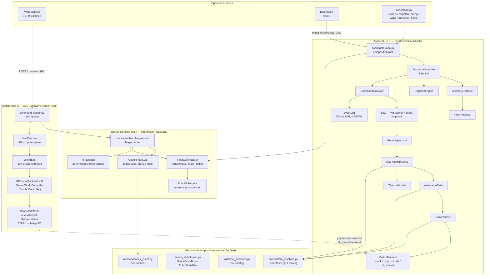
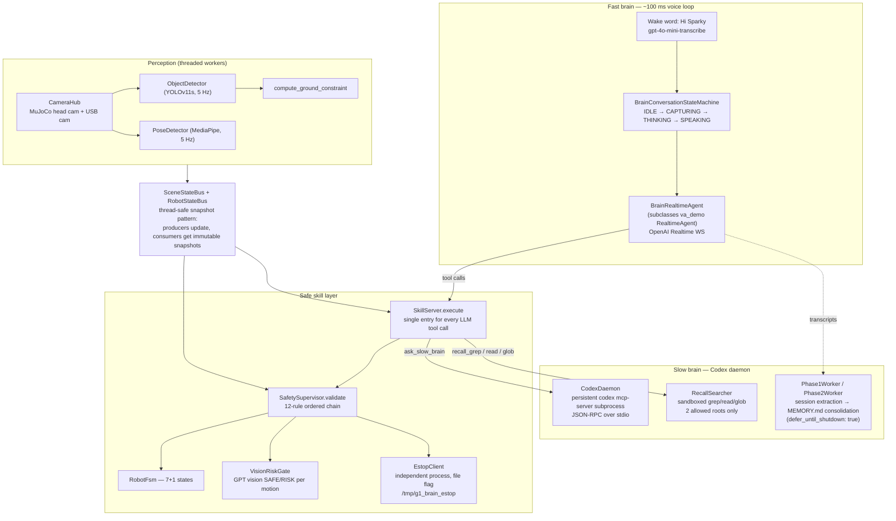
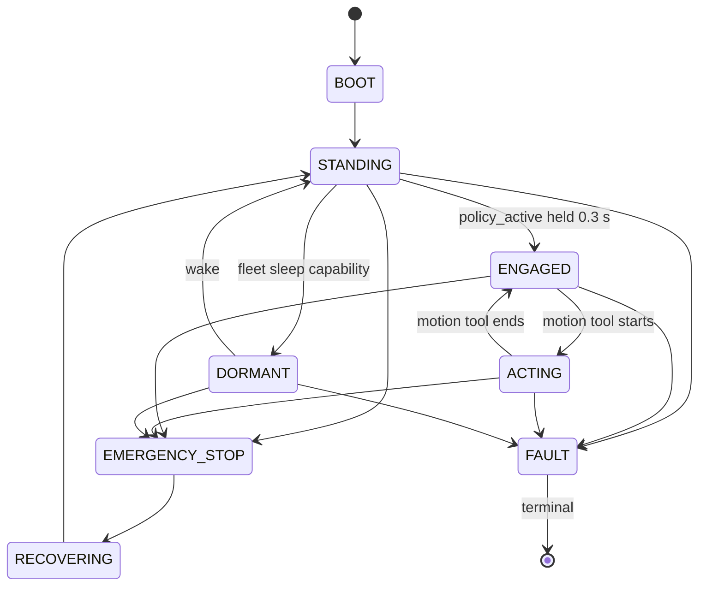
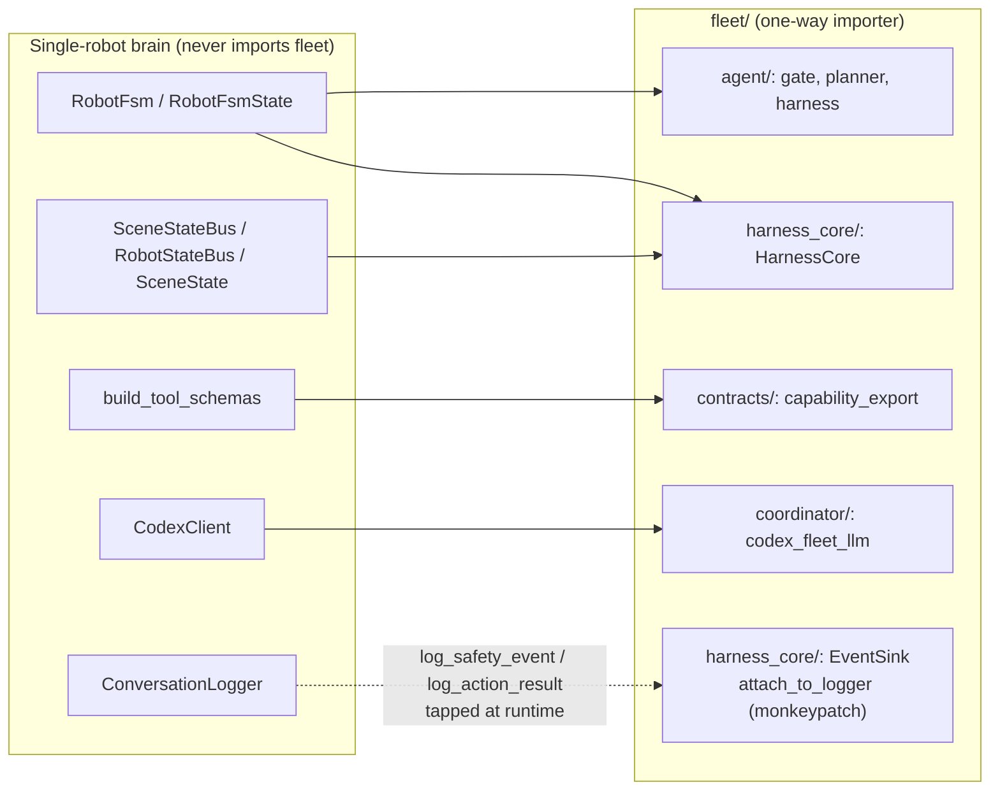
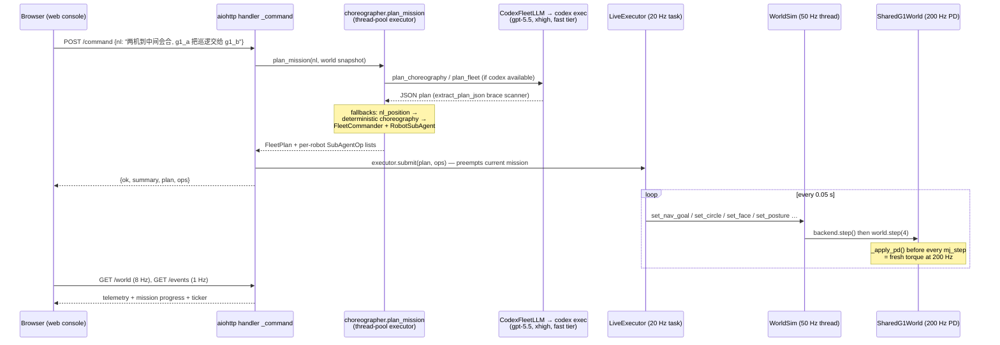
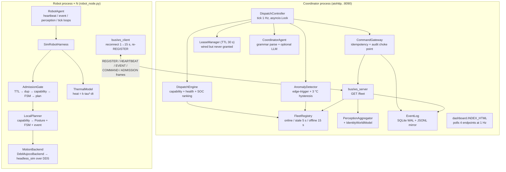
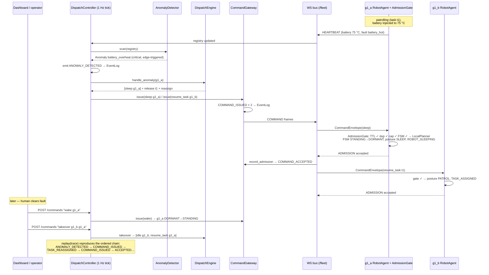
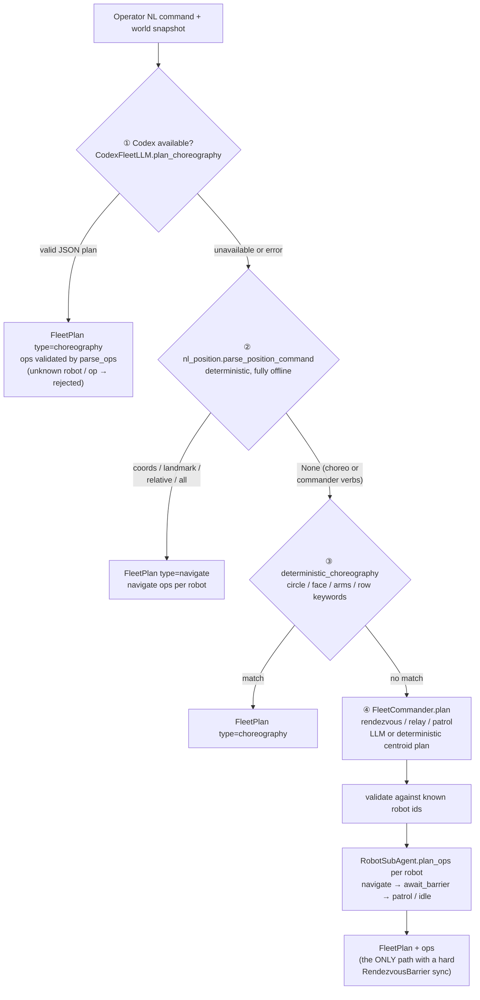

# Fleet Implementation Deep Dive (`fleet_implements.md`)

> Systematic analysis of the whole fleet project — every subsystem of
> `g1_brain/g1_brain/fleet/`, the single-robot brain it is built on, the seam
> between them, and the tests/docs that pin the behavior down.
> Produced 2026-07-24 from a full code + docs sweep (5 parallel deep-read passes).
> Companion docs: `docs/fleet.md` (Chinese master doc), `docs/coordinator-design.md`
> (design rationale), `docs/multi-architecture.md` (live-center runtime),
> `docs/command-center-arena-how-to-use.md` (arena runbook), `docs/fleet_qa1.md`
> (honest boundaries: why nav works without SLAM).

---

## Table of contents

1. [Executive overview](#1-executive-overview)
2. [System map](#2-system-map)
3. [Package layout](#3-package-layout)
4. [The per-robot comprehensive brain (single-robot stack)](#4-the-per-robot-comprehensive-brain-single-robot-stack)
5. [The fleet ↔ brain seam](#5-the-fleet--brain-seam)
6. [Architecture A — Live Command Center (`sim/`, port 8787)](#6-architecture-a--live-command-center-sim-port-8787)
7. [Architecture B — Distributed Coordinator (port 8090)](#7-architecture-b--distributed-coordinator-port-8090)
8. [The shared planning brain (`coordinator/` NL stack)](#8-the-shared-planning-brain-coordinator-nl-stack)
9. [Data contracts and wire protocol](#9-data-contracts-and-wire-protocol)
10. [Scenarios, verification and test suite](#10-scenarios-verification-and-test-suite)
11. [Design principles and evolution phases](#11-design-principles-and-evolution-phases)
12. [Gotchas and non-obvious facts](#12-gotchas-and-non-obvious-facts)
13. [Known gaps and latent seams](#13-known-gaps-and-latent-seams)
14. [Runbook](#14-runbook)

---

## 1. Executive overview

The fleet is a **fractal fast/slow-brain system**: the same "fast reflex +
slow planner + safety gate" structure that makes one G1 a comprehensive robot
(voice fast brain, Codex slow brain, safety supervisor) is nested a second time
at fleet level, welded together by two mechanisms — a **capability contract**
(typed pydantic messages, never joint commands) and a **local admission gate**
(the robot is the final authority and can refuse).

The governing philosophy, repeated across the design docs:

> **Center proposes, edge disposes, robot refuses.**
> The LLM lives only at the capability layer as a *proposer*; it can never
> directly drive the body. Everything it emits passes deterministic
> adjudication and the robot-local admission gate.

Two runtime architectures coexist and deliberately share one planning brain:

| | **A · Live Command Center** (daily demo) | **B · Distributed Coordinator** (production-shaped) |
|---|---|---|
| Entry | `python -m g1_brain.fleet.sim.command_center` | `python -m g1_brain.fleet.coordinator` |
| Port | 8787 (web console) + optional MuJoCo viewer | 8090 (dashboard + WebSocket bus) |
| Robots | same process, **one shared `MjModel`**, two self-balancing RL walkers | separate processes, WebSocket (or in-proc loopback) |
| Fleet LLM | **Codex** (`CodexFleetLLM`, gpt-5.5 / xhigh / fast tier) | OpenAI (`OpenAIFleetLLM`, gpt-4o-mini) or pure deterministic |
| Scheduler | `LiveExecutor` — preemptive single-mission, 20 Hz | `DispatchEngine` — capability/health matching + anomaly reassign, 1 Hz |
| Per-robot gate | none (trusts internal plan + nav clamp) | **`AdmissionGate`** (TTL → idempotency → capability → FSM → plan) |
| Per-robot "brain" | RL balance controller (`RlSharedBackend`) | `SimRobotHarness` = FSM + LocalPlanner + Gate + Thermal + MotionBackend |
| Proves | AI drives two robots in real coordinated motion | contracts, refusal, audit trail, autonomous fault dispatch |

**Why two systems:** A is the visual proof ("watch codex choreograph two
walking G1s"); B is the production shape ("how you would do this on real
robots at scale" — auditable, partition-safe, refusable). They share the
planning contracts (`FleetPlan` / `Coordination` / `SubAgentOp`) and the
commander stack, so a command codex cannot choreograph in A falls through to
B's commander path.

Each individual robot remains a comprehensive agent: the single-robot stack
(fast realtime voice brain, Codex slow brain, 12-rule safety supervisor,
YOLO/MediaPipe perception, skill server, memory pipeline, phone bridge) is
documented in §4, because the fleet reuses its primitives — the safety FSM,
the scene-state buses, the tool catalog, and the Codex client — as the
foundation of every fleet robot.

---

## 2. System map



The bottom row is the load-bearing reuse: the fleet's fast reflex **is** the
single robot's safety FSM, and the fleet's slow brain **is** the single
robot's Codex client. This is grep-verifiable, not a metaphor (§5).

---

## 3. Package layout

`g1_brain/g1_brain/fleet/` — 68 Python files across 7 subpackages:

| Path | Role | Key files |
|---|---|---|
| `sim/` | Both simulation stacks + the live command center | `command_center.py`, `command_center_ui.py`, `shared_world.py`, `shared_world_node.py`, `rl_adapter.py`, `nav.py`, `scene.py`, `live_executor.py`, `scenario_rendezvous.py`, `mujoco_world.py`, `headless_sim.py`, `robot_node.py`, `scenario_two_g1.py`, `verify_dds_fleet.py`, `g1_consts.py` |
| `coordinator/` | Dispatch service + the shared NL planning brain | `app.py`, `__main__.py`, `controller.py`, `dispatch.py`, `registry.py`, `lease.py`, `barrier.py`, `anomaly.py`, `world_model.py`, `perception_agg.py`, `event_log.py`, `gateway.py`, `dashboard.py`, `fleet_commander.py`, `nl_position.py`, `codex_fleet_llm.py`, `agent_llm.py`, `fleet_plan.py`, `robot_subagent.py`, `choreographer.py` |
| `agent/` | Per-robot fleet runtime | `robot_agent.py`, `sim_harness.py`, `admission_gate.py`, `local_planner.py`, `thermal_model.py`, `event_builder.py`, `motion/{base,mock,mujoco_backend,dds_backend,rl_shared_backend}.py` |
| `bus/` | Message transport | `base.py`, `messages.py`, `ws_server.py`, `ws_client.py`, `loopback.py` |
| `contracts/` | Typed data contracts (pydantic v2) | `models.py`, `capability_export.py`, `json_schema_export.py` |
| `harness_core/` | Bridge to the real single-robot brain | `core.py`, `brain_session.py`, `event_fanout.py` |
| `console/` | Operator CLI over the coordinator HTTP API | `cli.py` |
| (top level) | | `clock.py` (`iso_now()` only) |

`sim/` actually contains **two independent stacks** that share only
`g1_consts.py` and the `Posture` vocabulary:

- **Stack A** (Live Command Center): `command_center*`, `shared_world*`,
  `rl_adapter`, `nav`, `scene`, `live_executor`, `scenario_rendezvous` —
  one shared `MjModel`, RL self-balancing walkers, no DDS.
- **Stack B** (dispatch verification): `mujoco_world`, `headless_sim`,
  `robot_node`, `verify_dds_fleet`, `scenario_two_g1` — separate
  elastic-band-suspended worlds per robot (or separate processes over real
  DDS), PD posture holding, real torque feeding the thermal model.

---

## 4. The per-robot comprehensive brain (single-robot stack)

Each robot, standalone, is a three-layer agent wired by
`g1_brain/g1_brain/apps/agent_main.py` — this is what the user runs as
`python -m g1_brain.apps.agent_main --mode observe|confirm|active`.



### 4.1 Fast brain

- `brain/realtime_agent.py::BrainRealtimeAgent` subclasses va-demo's
  `RealtimeAgent` (va-demo is the intentionally unmodified upstream). It
  re-implements `run()` (keepalive `ping_timeout` widened 20 s → 180 s because
  an inline tool dispatch can starve the WS pong; auto-reconnect with 1→15 s
  backoff, 6 attempts), the WS event dispatcher (barge-in aware: drops events
  for cancelled responses), and routes every tool through
  `SkillServer.execute` — deliberately *without* pre-validating, since the
  SkillServer runs the SafetySupervisor internally (a `_PermissiveSafety`
  stub is injected into the va-demo parent so validation happens exactly
  once).
- `brain/conversation_state.py::BrainConversationStateMachine` — four states
  **IDLE → CAPTURING → THINKING → SPEAKING**; wake-word feeds in *all* states
  (barge-in anywhere), VAD only in CAPTURING, echo-aware voice barge-in only
  in SPEAKING. Recovery watchdogs: `plan_watchdog_s` (config: 150 s) forces
  IDLE if stuck; `no_speech_timeout` (4 s) aborts empty captures;
  `force_idle()` runs on reconnect.

### 4.2 Slow brain and memory

- `memory/daemon.py::CodexDaemon` spawns a persistent `codex mcp-server`
  subprocess (`approval_policy=never`, `sandbox=read-only`, reasoning/tier
  knobs) and the fast brain reaches it via the `ask_slow_brain` tool. Crash →
  auto-restart; quota exhaustion → 30 min cool-down; partial text returned on
  timeout/cancel (never raises). Barge-in cancels in-flight asks via cancel
  tokens.
- Memory is a two-phase pipeline: `phase1.py` per-session extraction
  (`codex exec`) → `phase2.py` global consolidation into `MEMORY.md`
  (git-committed baseline). With `memory.defer_until_shutdown: true`
  (the default) all of it runs exactly once at shutdown — no mid-session
  Codex churn.
- `memory/recall.py::RecallSearcher` is the sandbox both brains share:
  grep/read/glob restricted to two roots (`<robot>/memories/`,
  `<repo>/logs/conversations/`), every path resolved and checked against
  escape (`..`, symlinks, absolute paths rejected).

### 4.3 Safety layer

`safety/state_machine.py::RobotFsm` — the documented 7 states plus one
fleet-added state:



**DORMANT** is the single instance of a per-robot primitive extended for the
fleet: it was added for the fleet "safe sleep" capability (low-power
quiescent, no auto-recovery; exits only to STANDING / EMERGENCY_STOP / FAULT).

`safety/supervisor.py::SafetySupervisor.validate(tool, args)` — the ordered
rule chain every tool call passes:

1. tool whitelist (real-robot-only tools rejected in sim)
2. FSM gating (per-state motion / no-motion permission tables)
3. run mode — `observe` blocks all motion, `confirm` prompts y/N, `active` auto-executes
4. lowstate watchdog (age ≤ 0.5 s)
5. head-cam watchdog (age ≤ 2 s for walk/approach)
6. RL policy active check
7. body pose check (`gravity_proj_z > -0.85` → transitions FSM to EMERGENCY_STOP — the only supervisor side effect)
8. parameter clamp (vx/vy/wz/duration/yaw sanitized)
9. scene check for walk (clear path, obstacle ≥ 0.6 m, person ≥ 0.8 m)
10. scene check for gesture (person ≥ 0.5 m)
11. E-stop flag (hoisted early — nothing runs while engaged)
12. vision risk gate (optional GPT review; SAFE short-circuits, RISK forces the confirm prompt)

The E-stop (`safety/estop_client.py`) runs as an independent process watching
ESC and touching `/tmp/g1_brain_estop`; even if the agent deadlocks it
publishes zero-torque lowcmd to DDS. `is_engaged()` fails safe (assumes
engaged on stat error).

### 4.4 Skills — what the voice LLM can call

Single source of truth `skills/tool_schemas.py::build_tool_schemas()`:

| Group | Tools |
|---|---|
| L1 info/compound | `say`, `describe_scene`, `query_scene_state`, `recall_history`, `look_at`, `approach`, `mock_imitate`, `ask_human` |
| Memory | `recall_grep`, `recall_read`, `recall_glob`, `ask_slow_brain` |
| L2 motion | `walk`, `turn`, `gesture`, `static_pose`, `stop`, `release_arms` |
| Real robot only | `loco_high`, `arm_action_high`, `audio_tts_robot` (schema-visible, rejected in sim) |
| Phone (opt-in) | `start_phone_call` (+ `end_call` in phone sessions) |

`skills/skill_server.py::SkillServer.execute` wraps every call: safety
validation → FSM ENGAGED↔ACTING transitions around motion → defensive
`stop` on exception → `scene_after` snapshot attached to results →
conversation-logger events emitted. `_skill_walk` re-polls the scene snapshot
every 0.2 s mid-walk and aborts on path-block or obstacle < 0.5 m.

### 4.5 Perception and the snapshot bus

`perception/runner.py::PerceptionRunner` owns threaded workers (head cam
rendered from the brain's own cloned `MjModel`, USB cam, YOLO, MediaPipe,
depth→ground constraint) which publish into
`scene_state/fusion.py::SceneStateBus`. The bus is the central data-flow
contract: producers call `update_*()`; consumers call `snapshot()` which
rebuilds a fresh immutable `SceneState` each time — safety rules, the skill
server's mid-walk recheck, and the fleet's `HarnessCore` all read through it.
`RobotStateBus` mirrors the latest derived `RobotState` (lowstate age,
`rl_policy_active`, gravity projection).

The phone bridge (`phone/`) reuses the *same* skill server and scene bus:
each Twilio call spins a `PhoneRealtimeSession(BrainRealtimeAgent)` whose
audio transport is the Twilio media stream instead of mic/speaker.

---

## 5. The fleet ↔ brain seam

**Direction is strictly one-way: `fleet/` imports from the brain; no brain
module imports from `fleet/`.** (Verified by grep — the only textual mention
of "fleet" outside `fleet/` is the comment explaining DORMANT in
`safety/state_machine.py`.)

Exact crossing points:

| Fleet consumer | Imported symbol | Brain module |
|---|---|---|
| `fleet/agent/admission_gate.py` | `RobotFsm`, `RobotFsmState` | `safety/state_machine.py` |
| `fleet/agent/local_planner.py` | `RobotFsm`, `RobotFsmState` | `safety/state_machine.py` |
| `fleet/agent/sim_harness.py` | `RobotFsm`, `RobotFsmState` | `safety/state_machine.py` |
| `fleet/harness_core/core.py` | `RobotFsm`; `SceneStateBus`, `RobotStateBus`; `SceneState` | `safety/state_machine.py`, `scene_state/` |
| `fleet/agent/event_builder.py` | `SceneState` | `scene_state/types.py` |
| `fleet/contracts/capability_export.py` | `build_tool_schemas` | `skills/tool_schemas.py` |
| `fleet/coordinator/codex_fleet_llm.py` | `CodexClient` (lazy) | `memory/codex_client.py` |

So the fleet reuses: (a) the **safety FSM** as its robot-state model and
admission/planning gate; (b) the **scene/robot buses** for read-only state
reporting and semantic event building; (c) the **skill catalog** purely to
derive a `CapabilityDescriptor` with risk levels; (d) the **Codex client** as
the fleet-level LLM. It does **not** import `BrainRealtimeAgent`,
`SkillServer`, `SafetySupervisor`, `PerceptionRunner`, or `agent_main`.



### Two "cores", one duck-typed surface

A fleet `RobotAgent` can wrap either of two cores, both satisfying
`get_capabilities / get_state / subscribe_events / on_command / tick /
snapshot_scene`:

- **`agent/sim_harness.py::SimRobotHarness`** — the command-capable,
  thermal-aware per-robot core actually used in the scenarios. Owns
  `RobotFsm` + `AdmissionGate` + `LocalPlanner` + `ThermalModel` +
  `MotionBackend`. Deliberately has no camera / Realtime / Codex so several
  run side by side.
- **`harness_core/core.py::HarnessCore`** — a **read-only facade** over the
  *real* single-robot subsystems (`RobotFsm`, `SceneStateBus`,
  `RobotStateBus`, `EventSink`). By default there is no control path:
  `admit()` raises `NotImplementedError` until an `AdmissionGate` is
  injected. Its `get_capabilities()` is derived from the *real* tool catalog
  via `capability_export`.

The actual mechanism by which the full running brain feeds the fleet is
`harness_core/event_fanout.py`: `attach_to_logger(logger, sink)`
monkeypatches the brain's `ConversationLogger.log_safety_event` and
`log_action_result` so each call also enqueues a `RobotEvent` into a bounded
drop-oldest `EventSink` queue, drained by the RobotAgent's event loop.
(`log_scene_snapshot` is intentionally not tapped — it carries a live
non-JSON `SceneState`; perception events come from the perception loop
instead.)

**Does each fleet robot get its own voice brain?** Not in this slice. The
fleet is a separate headless process assembly over the same safety/scene
primitives; the voice-brain attachment is declared as the
`harness_core/brain_session.py::OperatorBrainSession` Protocol
(`attach(core)` / `detach()`, "multi-robot focus switching is a later
slice") with **no concrete implementation in-tree**. The only "brain-like"
LLM on the fleet side is the coordinator-level `CodexFleetLLM`.

---

## 6. Architecture A — Live Command Center (`sim/`, port 8787)

The AI 指挥调度中心: one launcher wires a live shared MuJoCo world (two RL
G1 walkers), an optional 3D passive viewer, a 2D web console, and the Codex
fleet commander.

### 6.1 SharedG1World — N robots in one `MjModel`

`sim/shared_world.py`:

- Builds via `MjSpec`: ground plane → scene geoms (`scene.py`) → per robot
  `MjSpec.from_file(unitree_mujoco/unitree_robots/g1/g1_29dof.xml)` attached
  with `frame.attach_body(child.worldbody.first_body(), f"{rid}/", "")` at
  spawn height `_STAND_Z = 0.78` — all child names prefixed `g1_a/`, `g1_b/`.
  Compiled shape for two robots: **nq=72, nu=58, nv=70**; actuators 0–28
  belong to g1_a, 29–57 to g1_b, in policy joint order.
- No MuJoCo keyframe: default pose seeded manually from the RL deploy yaml
  (`unitree_rl_mjlab/.../velocity/v0/params/deploy.yaml`) into each robot's
  qpos slice, then `mj_forward`.
- Per-robot accessors: `base_pose` (x, y, yaw), `joint_state`,
  `gravity_proj_z`, `neighbors(rid)` (dx/dy/dist/bearing to peers),
  `obstacles()` / `landmarks()` / `scene_render()` passthroughs.
- **THE gotcha (fleet-shared-world P1):** PD torque is recomputed on **every
  physics substep**. `step(n)` loops `_apply_pd()` (fresh
  `kp*(q_target-q) - kd*dq` from live q/dq) **then** `mj_step`, each
  iteration. Holding a 50 Hz-stale torque vector through 4 substeps makes the
  torque stale versus the integrator → Kp oscillation → the RL robot falls.
  Timestep 0.005 s × `_phys_per_tick=4` = 200 Hz PD under the 50 Hz control
  loop.

### 6.2 RL adapter — reusing the proven ComboController without DDS

`sim/rl_adapter.py::SharedWorldController` drives
`g1_sim_demo/g1_sim_rl_combo.py`'s `ComboController` (BOOT/engage/warm-up
balance logic + ONNX velocity policy) against a shared-model slice:

- Feeds a duck-typed `FakeLowState` (motor q/dq, IMU quat, gyro) from MjData;
  calls the controller's private `_tick()` at 50 Hz.
- **Monkeypatches `ctl._publish` → `_capture`** so the `(q_target, kp, kd)`
  the controller would have published over DDS is captured and handed to
  `SharedG1World.set_pd` instead. Never touches DDS.
- Two deliberate deviations from on-robot deploy: `boot_dur` shortened to
  0.3 s (a band-free robot collapses in ~1.5 s under the default 5 s
  default-pose PD before the policy engages), and the controller's watchdog
  wall-clock is refreshed each tick so it never trips.
- **Arm-gesture lesson:** the overhead `hands_up_pose` shifts the CoM forward
  and the velocity policy diverges (9 m drift vs 0.04 m); sustained raises use
  a **T-pose** (`raise_arms_pose`), and all arm motion goes through the
  controller's rate-limited eased blender (`push_arm_gesture`, 2–2.5 s) —
  snapping arms topples the robot.

### 6.3 Navigation — potential field, deliberately not nav2

`sim/nav.py::nav_command(pose, goal, ...)` is a ~50-line classic artificial
potential field, not a planner (no A*, no costmap, no waypoints):

- Goal attraction (eased inside `slow_radius=0.8`), stop at
  `stop_radius=0.25`.
- Reactive repulsion from scene obstacle circles + the peer robot as a moving
  0.45 m bubble (`avoid_radius=0.9`, gain `k_avoid=0.9`).
- **Tangential escape term** when an obstacle sits within ~72° of the goal
  direction (`ahead > 0.3`) — ~80 % of the radial weight applied tangentially
  to slip past head-on props (breaks the classic local-minimum deadlock).
- Turn-in-place gate: linear velocity zeroed until heading error < 60°.
- Output clamped to the policy's trained command envelope
  `vx ∈ (-0.5, 1.0), vy ∈ (-0.5, 0.5), wz ∈ (-1.0, 1.0)` — never drive the
  gait policy out of distribution.

Honest boundary (from `docs/fleet_qa1.md`): position is read from `qpos`
(simulation ground truth) and obstacles are *declared* in `scene.py`, not
perceived. The two hard real-world problems (localization, perception) are
bypassed, not solved; the single-robot YOLO/MediaPipe stack is not wired into
fleet nav.

### 6.4 RlSharedBackend — motion modes per robot

`agent/motion/rl_shared_backend.py` wraps one robot in the shared world:
modes `idle | walk | circle | face`, plus arm gestures. `set_nav_goal` →
walk via `nav_command` with peer avoidance from `world.neighbors()`;
`set_circle` (v=0.15 m/s, w=0.6 rad/s ≈ 0.25 m radius); `set_face`
(P-control yaw, gain 1.5, tolerance 0.12 rad); `set_arms_up` (T-pose via the
gesture blender, 2 s raise / 30 s hold / 1.5 s lower). SLEEP here keeps
standing balance (a velocity policy cannot crouch) — unlike the
Mujoco/DDS backends which physically crouch at `kp_scale=0.35`.

### 6.5 WorldSim — the 50 Hz control thread

`sim/shared_world_node.py::WorldSim`: one daemon thread at 50 Hz; each tick
(under a lock, and under the viewer's render lock if present) steps every
backend then `world.step(4)`. Thread-safe setters
(`set_nav_goal/set_posture/set_circle/set_face/set_idle/set_arms_up/set_peer_avoid`)
and `telemetry()` → `{rid: {pose, gz, neighbors, posture, activity}}` — the
exact shape the executor and web console consume.

Two hard-won rendering rules:

- `trim_render_cost(m)` must run **before** the GL context exists: the real
  WSL2/llvmpipe win is killing MSAA (`offsamples 4 → 0`); the "obvious"
  `mjVIS_SHADOW` flags don't exist as `mjtVisFlag` (they're `mjtRndFlag`) —
  which is what crashed the viewer historically.
- `set_render_lock(viewer.lock())` **before** `start()`, and start the
  control loop only after the viewer exists — otherwise
  `mj_copyDataVisual: attempting to copy mjData while stack is in use`.

### 6.6 LiveExecutor — preemptive mission execution

`sim/live_executor.py`: a long-lived 20 Hz async loop (`run()`, tick 0.05 s)
that advances the current `Mission` one op per robot at a time.
**Preemption = latest intent wins:** `submit(plan, ops)` bumps a generation
counter and swaps the mission; the running loop just picks up the new one
next tick — no task cancellation choreography.

Per-op completion semantics:

| Op | Action | Advances when |
|---|---|---|
| `navigate {x,y}` | `set_nav_goal` | within `arrive_radius` 0.45 m |
| `await_barrier` | update `RendezvousBarrier` (radius 0.7) | barrier released (all arrived) |
| `circle {dir,seconds}` | `set_circle` | after `seconds` (default 10) |
| `face {x,y}` | `set_face` | heading err < 0.2 rad or 8 s timeout |
| `arms_up {seconds}` | idle 1.5 s settle, then `set_arms_up(True)` once | settle + hold (default 2.5 s) |
| `hold {seconds}` | idle | after `seconds` (default 2) |
| `patrol` / `idle` / `sleep` / `wake` | `set_posture` | immediately |

Peer avoidance is auto-disabled during `await_barrier` and `face` so robots
can actually converge. The executor tracks `min_sep` (collision evidence) and
emits Chinese event-ticker lines (`指挥官: …`, `会合完成`, `✓ 任务完成`).

### 6.7 Command center wiring and threads

`sim/command_center.py::run()`:

1. `WorldSim(robot_ids, scene)` built (loop not yet started); `--solo` → one
   robot; scene `demo` (obstacle arena + landmarks) or `bare`.
2. Codex commander built (`CodexFleetLLM`, model `gpt-5.5`, reasoning
   `xhigh`) unless `--no-codex`; unavailable codex → deterministic fallback.
3. aiohttp app served on a **daemon thread with its own event loop** (main
   thread is reserved for the GLFW viewer); `LiveExecutor.run()` starts as a
   task on that loop.
4. Viewer path: `trim_render_cost` → `launch_passive` → `set_render_lock` →
   `sim.start()` → main thread syncs at 60 Hz. Headless: just `sim.start()`.

Iron law of the process model: **the 50 Hz control loop must never be starved
by LLM or HTTP** — Codex planning runs in a thread-pool executor
(`run_in_executor`), which is also why `CodexFleetLLM` can safely call
`asyncio.run()` internally.

HTTP surface (`:8787`): `GET /` (console), `GET /world` (robots + mission,
polled ~8 Hz), `GET /scene` (static geoms + landmarks, fetched once),
`GET /events` (deque maxlen 300, polled 1 Hz), `POST /command` (`{nl}`).
The web page is a self-contained vanilla HTML/JS SVG top-down map (72 px/m,
robot dots + heading lines + live separation line + landmark labels + mission
chip + event ticker + NL chat); 3D is the separate MuJoCo window.

### 6.8 End-to-end flow (A path)



### 6.9 The arena (`scene.py`)

Declarative single source of truth for static geometry + named landmarks,
consumed by the physics world, the NL parser, the codex snapshot, and the web
map. Demo scene: red/green cylinders and blue/yellow boxes in the corners
(avoid radii 0.45–0.5), an orange barrier, a low wall (`avoid_r=0` — drawn
but walkable), a 10° ramp and bump/step terrain strip along +X. Landmarks:
`集合点 (0,0)`, four corners, prop names, `地形测试区`. Bilingual alias table
(`center/middle/中间/中心 → 集合点`, longest-match-first). All static
primitives — zero added DOFs, no extra render passes on WSL2 llvmpipe.

---

## 7. Architecture B — Distributed Coordinator (port 8090)

The production-shaped control plane: anomaly-driven closed-loop dispatch over
a typed WebSocket bus, with per-robot admission gates and a replayable audit
log.

### 7.1 Component graph



### 7.2 Robot side

**`agent/robot_agent.py::RobotAgent`** — pure-asyncio headless bridge between
a core and a bus. `start()` wires `bus.on_command = core.on_command`,
registers capabilities, then runs: `_heartbeat_loop` (state → HEARTBEAT,
seq-numbered), `_event_loop` (drains the core's event queue → EVENT),
optional `_perception_loop` (scene snapshot →
`build_perception_events`: always `SCENE_SNAPSHOT`, plus `HUMAN_DETECTED`
≤ 0.8 m / `OBSTACLE_DETECTED` ≤ 0.6 m), optional `_tick_loop`
(`core.tick()` = physics step + thermal update). Each loop catches its own
exceptions so one failure never kills the others.

**`agent/sim_harness.py::SimRobotHarness`** — the per-robot fast/slow-brain
core: `RobotFsm` (fast reflex) + `AdmissionGate` + `LocalPlanner` (slow
seam) + `ThermalModel` + `MotionBackend`. Advertises
`DISPATCH_CAPABILITIES = [patrol, idle, stop, sleep, wake, resume_task]`.
`on_command` special-cases `inject` (sim telemetry override — filtered to
battery/SOC/motor-temp/fault keys, **bypasses the gate by design** because it
can never touch motion); everything else goes through the gate. `tick()`
steps the backend and feeds **real joint effort** (`tau_est`) to the thermal
model. State reports put sim internals in `extensions["g1_sim"]`
(hottest motor °C, posture, …).

**`agent/admission_gate.py::AdmissionGate.admit(env)`** — the local final
authority, checks in order:

1. `now > expires_at` → **EXPIRED** (TTL, default 30 s)
2. idempotency key seen → **DUPLICATE** (keys self-prune at expiry)
3. capability ∉ supported → **UNSUPPORTED_CAPABILITY**
4. FSM forbids → **FSM_FORBIDDEN** (EMERGENCY_STOP/FAULT accept nothing;
   task caps require STANDING; sleep from STANDING/DORMANT; wake from
   DORMANT/STANDING)
5. `LocalPlanner.apply()` raises → **PLAN_ERROR**; else → **OK / accepted**

Refusal is a first-class `AdmissionDecision`, not an error. The gate lives in
the robot process next to the FSM — the center has no interface to mutate FSM
state or send joint commands, so it *cannot* be bypassed.

**`agent/local_planner.py::LocalPlanner`** — deterministic capability →
`Posture` + FSM transition + lifecycle event: `sleep` → DORMANT +
`ROBOT_SLEEPING`; `wake` → STANDING + `ROBOT_RESUMED`; `patrol`/`resume_task`
→ PATROL posture + `TASK_ASSIGNED`; `idle`/`stop` → posture only. This is the
seam where a real single-robot slow brain / VLA would plug in
(`explain_hook` exists but is never on the control path).

**`agent/thermal_model.py::ThermalModel`** — synthesizes what MuJoCo doesn't
model, from real `tau_est`: per joint `heat = k·tau²·dt`,
`cool = cooling·(T−ambient)·dt`; SOC drains with time + load; battery temp
tracks mean motor excess. `inject()` forces deterministic overheat for demos.
It only *reports*; classification is the coordinator's job (sensing/policy
separation).

**Motion backends** (`agent/motion/`) — same brain, four bodies:

| Backend | Physics | Use |
|---|---|---|
| `MockBackend` | none — posture→tau lookup table | CI, deterministic thermal signatures |
| `MujocoBackend` | in-process `MujocoG1` (elastic-band-suspended, PD postures, SLEEP = crouch at kp×0.35) | `scenario_two_g1` |
| `DdsMujocoBackend` | separate `unitree_mujoco` process over DDS (`rt/lowstate` / `rt/lowcmd`, one domain per robot) | `verify_dds_fleet` — the faithful transport |
| `RlSharedBackend` | shared RL world (§6.4) | Live Command Center |

### 7.3 Coordinator side

- **`registry.py::FleetRegistry`** — in-memory membership + staleness
  classifier (`online` → `stale` after 5 s → `offline` after 15 s of
  heartbeat silence); ignores heartbeats before REGISTER and out-of-order
  sequence numbers.
- **`anomaly.py::AnomalyDetector`** — deterministic, **edge-triggered with
  hysteresis** (re-arm margin 3 °C) so dispatch never flaps near thresholds.
  Kinds: `battery_overheat` (≥ 70 °C, critical), `motor_overheat` (≥ 80 °C,
  from the `g1_sim` extension), `low_soc` (≤ 0.15, warning), `fall`
  (`gravity_proj_z > −0.85` — rising toward horizontal), `stale`
  (registry status). All thresholds env-overridable
  (`FLEET_BATTERY_HOT_C`, `FLEET_MOTOR_HOT_C`, `FLEET_SOC_MIN`,
  `FLEET_FALL_GZ`).
- **`dispatch.py::DispatchEngine`** — the deterministic final scheduler:
  candidates = untasked ∧ `online` ∧ `fsm_state == STANDING` ∧
  `health == ok` ∧ capability superset, ranked by battery SOC descending.
  `handle_anomaly` → sleep the affected robot, release its task, reassign
  (`resume_task`) to the best healthy candidate or queue for the operator.
  `takeover(from, to)` → `[idle(from), resume_task(to)]`. Emits plans as
  `CommandEnvelope` lists — issuing is the gateway's job.
- **`gateway.py::CommandGateway`** — the single down-bound choke point:
  idempotency-guarded `issue()` writes `COMMAND_ISSUED`, pushes over the WS;
  send failure → rolls back the idempotency key and writes `COMMAND_REFUSED`
  (`NOT_CONNECTED` / `SEND_FAILED`). Returning `AdmissionDecision`s are
  correlated back to the original `trace_id` and logged as
  `COMMAND_ACCEPTED`/`COMMAND_REFUSED` — every dispatch decision is
  replayable.
- **`controller.py::DispatchController`** — the only place perception +
  operator intent become commands; all mutating paths serialized by an
  `asyncio.Lock`. `tick()` (1 Hz background task): anomaly scan → emit
  `ANOMALY_DETECTED` → engine plan → issue; lease expiry → `LEASE_EXPIRED` →
  sleep + release + reassign. `run_op()` handles operator verbs
  (`status/sleep/wake/takeover/dispatch`) after `CoordinatorAgent.validate`
  re-checks robot ids against the live registry.
- **`event_log.py::EventLog`** — append-only: SQLite (WAL,
  `INSERT OR IGNORE` on `event_id` → idempotent re-delivery) + JSONL mirror;
  `replay(trace_id)` reconstructs a full decision chain.
- **`agent_llm.py::CoordinatorAgent`** — operator-NL parser: deterministic
  `shlex` grammar always available; optional `OpenAIChatLLM` in front; either
  way `validate()` gates the result. The LLM never decides dispatch.
- **`dashboard.py`** — self-contained HTML dashboard: SVG humanoid figures
  per robot (posture-aware), 1 Hz polling of `/robots`, `/dispatch`,
  `/anomalies`, `/events`, one-click inject (75 °C battery fault), NL chat.

HTTP/WS surface (`:8090`):

| Route | Purpose |
|---|---|
| `GET /fleet` (WS) | the FleetBus — REGISTER/HEARTBEAT/EVENT/ADMISSION up, COMMAND down |
| `GET /` | dashboard |
| `GET /robots`, `/robots/{rid}` | registry view |
| `GET /events`, `/replay/{trace_id}` | audit log queries |
| `GET /perception` | fleet roll-up (path-blocked / humans-visible counts) |
| `GET /anomalies`, `/dispatch` | controller snapshot |
| `POST /missions` | typed `Mission` → per-task assign |
| `POST /commands` | inject / NL / structured op → `run_op` |
| `POST /chat` | `FleetCommander.plan` → `RobotSubAgent.plan_ops` — **returns the plan, does not execute** |

### 7.4 The closed loop, end to end

The executable story (pinned by `test_e2e_dispatch.py` and
`verify_dds_fleet.py`): overheat → safe sleep → reassign → human wake →
handback.



---

## 8. The shared planning brain (`coordinator/` NL stack)

Both architectures plan through the same contracts. The router is
`choreographer.py::plan_mission()` — a strict priority ladder (used by the
command center; the 8090 service's `/chat` uses only layer ④ directly):



Key components:

- **`nl_position.py`** — the deterministic offline parser (feature/multi-geo).
  Grammar, in order: targeting (`两机/all/both/everyone` → all robots; named
  `g1_x` ids; exactly-one-robot default; otherwise refuse to guess), then
  relative moves (`前进 2米` / `back 1m`, yaw-projected), landmarks
  (`去红色柱子`, `go to center` via `scene.resolve_landmark`), absolute
  coords (`2, 1`, ASCII or CJK comma). Deliberately returns `None` for
  choreography verbs (`绕圈/circle/面对面/抬手/排成…`) and commander verbs
  (`会合/交给/relay/handoff…`) so the ladder's precedence works. Positional
  commands therefore need **no LLM call at all**.
- **`fleet_commander.py::FleetCommander`** — NL → `FleetPlan`. LLM proposal
  (`plan_fleet`) validated by `FleetPlan.model_validate`, with a keyword-based
  deterministic fallback: rendezvous/relay require ≥ 2 robots; hander placed
  at centroid −0.4 m, receiver at +0.4 m; relay fills
  `handoff_task/from/to`. `validate()` re-checks every robot id.
- **`robot_subagent.py::RobotSubAgent`** — per-robot expansion of an
  assignment into a validated op list (`_VALID = {navigate, await_barrier,
  patrol, idle, sleep, wake}`); deterministic: navigate to goal →
  await_barrier (if rendezvous/relay) → handoff receiver gets `patrol`,
  hander gets `idle`.
- **`codex_fleet_llm.py::CodexFleetLLM`** — the fleet slow brain: spawns
  `codex exec --json --ignore-user-config -s read-only -c
  approval_policy=never`, model **gpt-5.5 passed per-call via `-m`** (the
  ChatGPT plan rejects the default `gpt-5.3-codex`), reasoning `xhigh`,
  `service_tier=fast`, timeout 90 s. `extract_plan_json` is a hand-written
  balanced-brace scanner (string/escape aware) because codex at high
  reasoning wraps JSON in prose and ```json fences. `plan_robot()`
  **deliberately returns None** — the LLM only proposes the high-level plan;
  op expansion always stays deterministic. Any error → the caller falls back
  to the deterministic path, so the operator is never hard-blocked.
- **`barrier.py::RendezvousBarrier`** — deterministic all-or-nothing arrival
  gate (participants within radius of a point → released). Cooperation timing
  is *never* left to the LLM. Note: codex's choreography vocabulary has no
  `await_barrier`, so a codex "rendezvous" is concurrent navigate-to-centroid
  without hard sync — true barrier sync only comes from path ④.

Two LLM wirings, one duck type: the command center constructs
`CodexFleetLLM`; the 8090 service constructs `OpenAIFleetLLM`/`OpenAIChatLLM`
(gpt-4o-mini, gated on `OPENAI_API_KEY`); with neither, everything still runs
deterministically.

---

## 9. Data contracts and wire protocol

### 9.1 Contract models (`contracts/models.py`, pydantic v2, all `schema_version`'d)

| Model | Purpose | Invariant-bearing fields |
|---|---|---|
| `CapabilityDescriptor.v1` | robot self-advertisement at REGISTER | `capabilities[{name, risk_level}]`, `trust_level (sim/dev/production_certified)`, `safety{e_stop, watchdogs}`, `brain{attachable, attached}` |
| `RobotStateMsg.v1` | heartbeat state | `seq` (out-of-order guard), `fsm_state`, `motion_state`, `core{pose, safety_state{gravity_proj_z, watchdog_ok}, battery{soc, temperature_c}, health{level, faults}}`, `extensions.g1_sim` |
| `RobotEvent.v1` | north-bound semantic events | `event_id`, `trace_id`, `type` (15-value `EventType` enum), `payload_hash` (sha256 of canonical JSON) |
| `CommandEnvelope.v1` | the **only** down-bound shape — capability + payload, never joint/velocity commands | `expires_at` (TTL → reject stale), `idempotency_key` (process once), `trace_id` (replay), `safety_envelope{max_speed_mps, allowed_capabilities}`, `lease` (time-bounded authority) |
| `AdmissionDecision.v1` | robot's verdict | `decision (accepted/refused/deferred)`, `reason_code (OK/EXPIRED/DUPLICATE/UNSUPPORTED_CAPABILITY/FSM_FORBIDDEN/PLAN_ERROR)` |
| `TaskSpec` / `Mission` / `ReplanProposal` | dispatch-side task graph | mission → tasks → required_capabilities; replan proposals carry evidence + `requires_human_approval` |

`Capability` wire vocabulary (Literal): `sleep, wake, patrol, idle,
resume_task, stop, inject, navigate`. `capability_export.py` derives the
descriptor from the **real** tool catalog (`build_tool_schemas`) with a
per-tool risk map; `json_schema_export.py` dumps all 8 `.v1` models to JSON
Schema as a CI artifact.

### 9.2 Wire frames (`bus/messages.py` — JSON with a `kind` discriminator)

| Frame | Direction | Body | Consumer |
|---|---|---|---|
| `register` | robot → coord | `CapabilityDescriptor` | `FleetRegistry.register` + connection table |
| `heartbeat` | robot → coord | `RobotStateMsg` | `FleetRegistry.on_heartbeat` |
| `event` | robot → coord | `RobotEvent` | `EventLog.append` + `PerceptionAggregator.ingest` |
| `command` | coord → robot | `CommandEnvelope` | `on_command` → `AdmissionGate` |
| `admission` | robot → coord | `AdmissionDecision` | `CommandGateway.record_admission` |
| `ping` / `pong` | keepalive | — | — |

Transports: `ws_server.py` (aiohttp, per-connection coroutine, reconnect-safe
connection table), `ws_client.py` (robot side — reconnect with 1→15 s
backoff, 6 attempts, **re-sends REGISTER on every reconnect** so a
coordinator restart transparently re-learns robots; telemetry sends are
best-effort no-ops while down, local safety unaffected), `loopback.py`
(in-process hub for tests and Tier-1 e2e, spins a temp SQLite EventLog).

---

## 10. Scenarios, verification and test suite

### 10.1 Executable scenarios

| Scenario | Stack | What it proves |
|---|---|---|
| `sim.scenario_rendezvous` | A | **P3 gate.** NL relay sentence → commander plan → both RL robots walk to centroid → barrier (r=0.7) releases → patrol handed off. 9 CI checks: plan ok, `plan_type == relay`, barrier fired, completed, both upright, receiver PATROL and moved > 0.12 m, hander IDLE, `min_sep > 0.3` |
| `sim.scenario_two_g1` | B | Tier-2 in one process: two elastic-band `MujocoG1` worlds over `LoopbackHub` + full coordinator. Autonomous overheat→sleep→reassign, then human wake→takeover handback, with event-audit assertions |
| `sim.verify_dds_fleet` | B | Same fault story across **real processes**: coordinator + 2 × `headless_sim` (DDS domains 1/2) + 2 × `robot_node`. Sets `FLEET_FALL_GZ=2.0` (suspended rigs tilt; not a fall). Success = g1_a DORMANT, patrol reassigned, g1_b PATROL, audit events present, g1_b upright |
| `sim.shared_world_node --viewer` | A | Two G1s walking to center in one window (P1 smoke) |

### 10.2 Test suite (63 files, ~234 tests, `g1_brain/tests/fleet/`)

- `asyncio_mode=auto`; single custom marker **`slow`** (5 marks: the
  wall-clock-paced real-MuJoCo gates — `test_command_center_e2e`,
  `test_scenario_rendezvous`, `test_physical_gates` ×2,
  `test_world_render_lock`). Everything else is fast/deterministic.
- Codex is mocked **at the subprocess boundary only** (a `_FakeCodex` with
  `exec_once` returning canned text); harness tests use `MockBackend` +
  `LoopbackHub`; DDS is stubbed by the parent conftest's `stub_unitree_sdk`.
  The green path burns no LLM subscription.
- Coverage by area: sim/shared-world/nav ~30, coordinator/dispatch ~55,
  per-robot agent/safety ~35, bus ~13, contracts ~20, app/console/e2e ~24,
  NL parsing (`test_nl_position` alone has 12).

The e2e tests are executable architecture documentation:

| Test | Invariants pinned |
|---|---|
| `test_command_center_e2e` (slow) | POST `/command` with the Chinese relay sentence → deterministic plan (`relay`) → LiveExecutor → real 50/200 Hz physics → mission completes; `min_sep > 0.3`; receiver PATROL, hander IDLE — live telemetry, no codex |
| `test_e2e_dispatch` | The full autonomy loop over loopback with mock physics; asserts the **ordered event subsequence** `ANOMALY_DETECTED → COMMAND_ISSUED → TASK_REASSIGNED → COMMAND_ISSUED` via `replay(trace)`, plus DORMANT/SLEEP/PATROL states and the human wake/takeover phase |
| `test_e2e_readonly` | Phase-1 "observe before control": WS register/heartbeat/event uplink, perception roll-up, trace replay, console rendering — no commands |
| `test_harness_core` | The real-brain seam: capabilities from the real tool catalog; FSM+body state → `RobotStateMsg`; logger events fanned out as `SAFETY_EVENT`; **`admit()` raises until a gate is wired** |
| `test_shared_world` | Physics substrate contract: nu=58/nq=72, distinct spawns, upright at default pose (gz < −0.95), symmetric neighbor sense |
| `test_physical_gates` (slow) | Empirical gait gates: stand-then-walk > 0.3 m upright; two-robot rendezvous with no collision |
| `test_ws_command_routing` | Wire protocol lifecycle: REGISTER → connection table; COMMAND down with matching id; ADMISSION up to the sink; disconnect cleanup |

System-wide invariants the suite guarantees: robots never collide
(`min_sep > 0.3`) anywhere they move; robots stay upright through
locomotion; anomaly handling is edge-triggered and fully replayable by
`trace_id`; commands are TTL/idempotency/FSM-gated at the robot; the
read-only facade cannot accept commands until explicitly wired; codex is only
ever a proposer.

---

## 11. Design principles and evolution phases

### 11.1 Four time scales (the iron law: the lower the layer, the less AI)

| Layer | Time scale | Who | AI policy |
|---|---|---|---|
| L3 strategic | min–hr | command center / cloud | AI-led, must be verified |
| L2 swarm/fleet | s–min | coordinator (edge) | AI may assist, may **not** dictate |
| L1 single-robot task | 100 ms–s | robot harness | AI OK, bounded by local safety gate |
| L0 fast reflex / safety | ms | local controller | AI must **not** intervene |

### 11.2 The 12 unbreakable principles (from `coordinator-design.md` §3.1)

(1) AI never directly controls low-level motion; (2) local safety is the
final arbiter — a robot can refuse any center task; (3) tasks are typed
contracts, not free text; (4) leased execution (TTL/heartbeat/cancel);
(5) evidence-based state; (6) all AI output is verified before use;
(7) cross-vendor = capability, not brand; (8) multi-layer safety enforcement;
(9) observe before control (read-only shadow first); (10) every decision
traceable/replayable; (11) network partition is the default assumption;
(12) tools ≠ permissions.

### 11.3 Evolution timeline

| Phase | Landed | Content |
|---|---|---|
| **P1** `fleet-shared-world-p1` (2026-06-07) | ✅ | Two G1s in one shared MuJoCo world + real RL gait; the 200 Hz PD gotcha discovered and fixed |
| **P2** `fleet-coordinator-p2` (2026-06-07) | ✅ | Distributed WS control plane, per-robot AdmissionGate, anomaly autonomy, event audit |
| **P3** rendezvous gate | ✅ | End-to-end rendezvous/relay scenario (`scenario_rendezvous` + `test_command_center_e2e`) |
| **feature/multi-geo** (2026-06-08) | ✅ | `nl_position` deterministic positions, arena scenes (`scene.py`), `--solo`, `--scene demo\|bare`, obstacle avoidance |
| coordinator-design Phases 3–6 | ⏳ design-only | MRTA solver, resource locks, Open-RMF/VDA5050 adapters, RBAC/ABAC, MCP gateway, digital twin — the aspirational blueprint the current code is a verified slice of (implemented ≈ Phase 1 + slice of Phase 2 + Phase 4 LLM-proposer) |

---

## 12. Gotchas and non-obvious facts

These cost real debugging time and are invisible from any single file:

1. **PD torque must be recomputed every 200 Hz physics substep** with fresh
   q/dq, not held per 50 Hz control tick (`SharedG1World.step` and
   `MujocoG1.step` both do this). Stale torque vs the integrator → Kp
   oscillation → the RL robot falls. Called "the watershed from
   flying-around to steady walking" in `instructions.md`.
2. **Codex model override**: this ChatGPT plan rejects the default
   `gpt-5.3-codex`; `CodexClient` forces `--ignore-user-config`, so
   **gpt-5.5 must be passed per call via `-m`/`model_override`**. Fleet
   defaults: reasoning `xhigh`, `service_tier=fast`, sandbox read-only.
3. **Arm raises**: overhead poses make the velocity policy diverge (9 m
   drift); use the T-pose side raise, always via the rate-limited blender,
   and stand still 1.5 s first (`_ARMS_SETTLE`) — raising mid-stride topples.
4. **Render-lock ordering**: `trim_render_cost` before the GL context;
   `set_render_lock(viewer.lock())` before `sim.start()`; control loop only
   after the viewer exists. The historically crash-prone "shadow flag" is a
   `mjtRndFlag`, not `mjtVisFlag`; the real WSL2 win is MSAA 4→0.
5. **50 Hz control must never be starved**: codex planning runs in a
   thread-pool executor; the viewer owns the main thread; aiohttp lives on
   its own daemon-thread loop.
6. **`FLEET_FALL_GZ=2.0`** in the DDS verification: elastic-band-suspended
   rigs tilt, which would otherwise read as a fall. Fall polarity is
   inverted from intuition — the anomaly fires when `gravity_proj_z` *rises
   above* the threshold (toward horizontal).
7. **`inject` bypasses the AdmissionGate by design** — handled before the
   gate in `SimRobotHarness.on_command`, filtered to telemetry-only keys; it
   cannot touch motion, so the bypass is safe by construction.
8. **nav is honest sim-only**: position from `qpos`, obstacles from a
   declared table. On real robots, `base_pose` → SLAM/VIO and `obstacles()`
   → a perception costmap must be swapped in (that package is what nav2
   wraps). Single-robot YOLO/MediaPipe is not wired into fleet nav.
9. **`extract_plan_json`** is a bespoke balanced-brace scanner because codex
   at high reasoning wraps JSON in prose/fences and nested plans defeat
   regex.
10. **Two `Mission` classes**: `live_executor.Mission` (A-path execution
    state) vs `contracts.models.Mission` (B-path task spec). Don't confuse
    them.
11. **The `/chat` route on 8090 plans but never executes**; only the command
    center's `/command` drives robots live. Conversely, `nl_position` is
    reached only from the command center's ladder, never from 8090.
12. **`RlSharedBackend` SLEEP keeps standing balance** (a velocity policy
    can't crouch); the Mujoco/DDS backends physically crouch at kp×0.35.
13. **The event ladder verbs collide with landmark names carefully**:
    the relay keyword `会合` was chosen so it is not a substring of the
    landmark `集合点` — precedence between parser layers depends on it.
14. **ws_client re-sends REGISTER on every reconnect** and the server's
    disconnect cleanup checks connection identity — a coordinator restart or
    a robot's fast reconnect both recover transparently.
15. **Timestamps are wall-clock UTC everywhere** (`clock.iso_now`); there is
    no sim-time abstraction. Deterministic time is injectable only at
    `AdmissionGate(clock=…)` and `CommandEnvelope.make(now=…)`.

---

## 13. Known gaps and latent seams

Recorded so nobody re-derives them:

| Gap | Where | Status |
|---|---|---|
| `OperatorBrainSession` (attach the real voice brain to a `HarnessCore`) | `harness_core/brain_session.py` | Protocol stub only; no implementation, no importer. The designed mount point for per-robot voice brains in the fleet |
| `LeaseManager` never `grant()`ed | `coordinator/lease.py` + `controller.py` | Wired into the tick loop but no caller grants leases, so the partition-safety branch is currently inert |
| `robot_agent.py` docstring describes a `python -m …robot_agent` runner and "reuse agent_main, skip Realtime brain" assembly | `agent/robot_agent.py` | Aspirational; the real runner is `sim/robot_node.py` |
| `RobotEvent.payload_hash` computed but never verified receiver-side | `contracts/models.py` | Deferred slice |
| `navigate` in the `Capability` wire vocabulary but not in the harness `DISPATCH_CAPABILITIES` | contracts vs `sim_harness.py` | The B-path gate refuses navigate; only the A path navigates |
| Coordinator imports from sim (`nl_position` → `sim.scene.resolve_landmark`) | `coordinator/nl_position.py` | Upward layer dependency coupling the parser to the arena's landmark table |
| 8090 `_snapshot` omits yaw (`Pose` has `theta`, commanders read `yaw`) | `coordinator/app.py` | Relative-move yaw math only works with the command-center snapshot |
| `coordination.type` free-string drift | `fleet_plan.py` vs `choreographer.py` | Documented enum is `rendezvous/relay/cover/patrol/none`; runtime also emits `choreography` and `navigate` |
| `SCENES["solo"]` registered but unused (`--solo` only changes robot ids, still loads `demo`) | `sim/scene.py` / `command_center.py` | Cosmetic |
| Codex choreography vocabulary lacks `await_barrier` | `codex_fleet_llm._CHOREO_SYS` | Codex "rendezvous" is concurrent navigation without hard sync; true barrier sync only via the commander path |
| `Posture.WAKE` defined but never emitted (wake writes `ACTIVE`) | `agent/local_planner.py` | `motion_state` reports `idle` after wake |

---

## 14. Runbook

All commands under the `agi` conda env, from the repo root
(`~/unitree/unitree-notes`):

```bash
# ── A · Live Command Center (see + command + real RL drive) ─────────
python -m g1_brain.fleet.sim.command_center --viewer --scene demo
#   web console: http://127.0.0.1:8787   3D: MuJoCo window
#   --solo (one robot) · --no-codex (offline deterministic)
#   --model gpt-5.5 --reasoning xhigh (defaults)

# NL commands that work fully offline (no codex):
#   位置: "g1_a 走到 2,1" · "去红色柱子" · "前进 2米" · "两机都去集合点"
#   队形: "顺时针绕圈" · "面对面" · "抬双手"
# codex-steadier / free-form: "两机到中间会合，然后 g1_a 把巡逻交给 g1_b"

# ── A · P3 rendezvous/relay demo ────────────────────────────────────
python -m g1_brain.fleet.sim.scenario_rendezvous --viewer
MUJOCO_GL=egl python -m g1_brain.fleet.sim.scenario_rendezvous   # headless, 9 checks

# ── A · shared world smoke ──────────────────────────────────────────
python -m g1_brain.fleet.sim.shared_world_node --viewer          # or --seconds 9

# ── B · Distributed coordinator (anomaly closed loop) ───────────────
python -m g1_brain.fleet.coordinator --host 0.0.0.0 --port 8090
#   dashboard: http://127.0.0.1:8090

# B · full DDS verification (coordinator + 2 sims + 2 robot nodes):
python -m g1_brain.fleet.sim.verify_dds_fleet                    # or --keep-alive
# B · in-process Tier-2:
python -m g1_brain.fleet.sim.scenario_two_g1

# B · operator console:
python -m g1_brain.fleet.console.cli status
python -m g1_brain.fleet.console.cli dispatch patrol
python -m g1_brain.fleet.console.cli inject g1_a --temp 75 --fault battery_hot

# ── Tests ───────────────────────────────────────────────────────────
cd g1_brain
pytest tests/fleet                      # fast suite (codex/DDS mocked)
pytest -m slow tests/fleet -q           # real-physics gates
pytest -m slow tests/fleet/test_command_center_e2e.py -q   # A-path acceptance
```
