# Multi‑Robot AI Coordinator — Running Architecture

> 这份文档完整、详细地讲清楚 **AI 指挥调度中心 (live command center)** 是如何用一个
> codex 大脑把自然语言指令变成两台 G1 在同一个 MuJoCo 物理世界里实时协同动作的——
> 从浏览器里的一句话，到 codex 规划，到抢占式执行器，到 50 Hz 物理控制环，每一层都画清楚。
>
> 代码位置：`g1_brain/g1_brain/fleet/`。所有图均为 Mermaid，可直接渲染。

---

## 0. 两套架构，先分清楚

代码库里其实有**两个**“coordinator”，它们共享同一套规划数据契约（`FleetPlan` / `Coordination` /
`SubAgentOp`）和同一套规划逻辑（`FleetCommander` / `RobotSubAgent`），但运行形态完全不同：

| | **A. Live Command Center（你现在跑的）** | **B. Distributed Coordinator（P2 控制平面）** |
|---|---|---|
| 入口 | `sim/command_center.py` | `coordinator/app.py` |
| 机器人在哪 | **同一个进程、同一个 MjModel**（两台 G1） | 各自独立进程，WebSocket 接入 |
| 传输 | 无（直接内存调用，线程安全方法） | WebSocket 总线（`bus/ws_*`）/ 或进程内 loopback |
| AI 大脑 | **codex**（`CodexFleetLLM`，gpt‑5.5 / xhigh / fast） | OpenAI（`OpenAIFleetLLM` / `OpenAIChatLLM`）或确定性 |
| 调度器 | `LiveExecutor`（抢占式单任务） | `DispatchEngine`（能力/健康匹配 + 异常重分配） |
| 安全闸 | 无（信任内部规划 + nav 限幅） | 每机 `AdmissionGate`（TTL/幂等/FSM/能力） |
| 你看到的 | MuJoCo 3D 窗口 + 网页俯视图 | HTML 仪表盘（SVG 小人 + 事件流） |
| 物理 | RL 速度策略真实自平衡 | 弹力带悬挂的单机物理 / mock |

本文 **§1–§9 讲 A（这就是“目前的运行架构”）**，**§10 讲 B（更完整、production‑shaped 的兄弟系统）**，
**§11 讲二者如何衔接**。

下面这张图先建立全局心智模型：

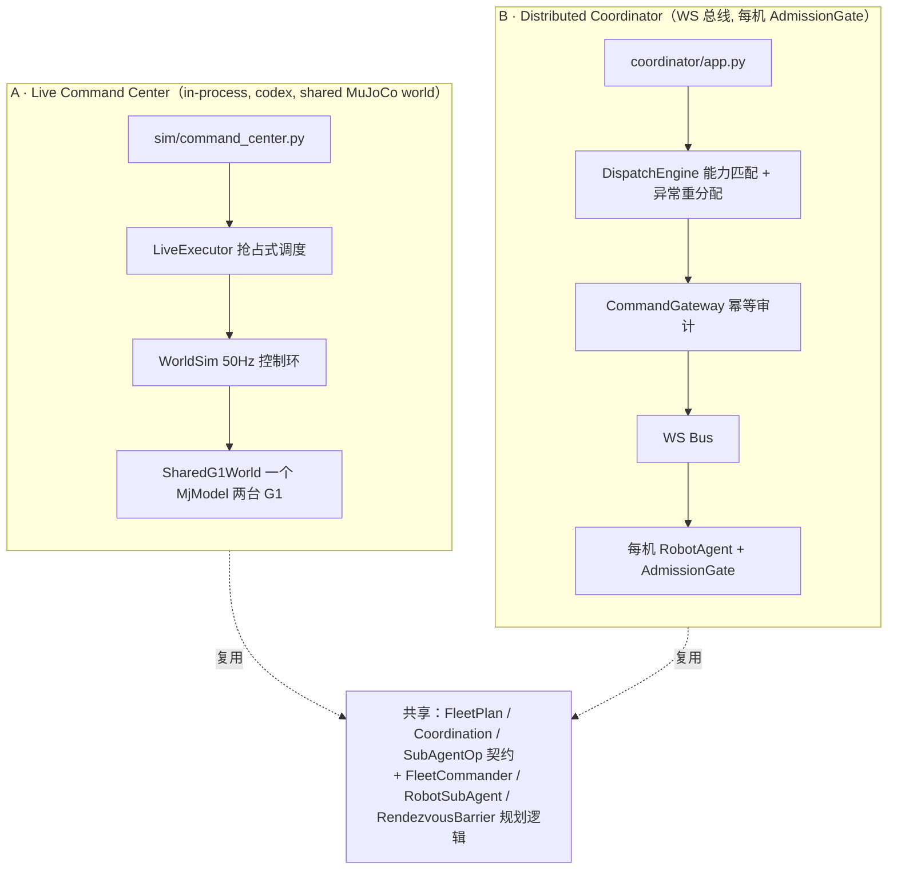

---

## 1. Live Command Center 全景

`sim/command_center.py` 用**一个启动器**把四样东西焊在一起，让你能“边看边指挥”：

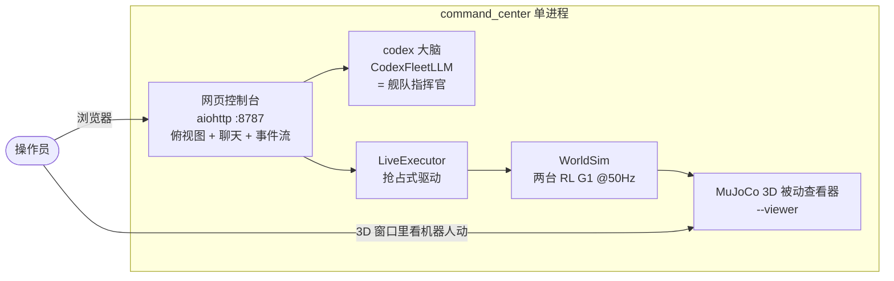

一次操作员请求的流向（文件头注释原话）：

> 浏览器 `POST /command` → `FleetCommander(codex)` 规划 → `RobotSubAgent` 展开 ops →
> `LiveExecutor` **抢占式**驱动 `WorldSim` → 机器人在 3D 窗口里动，俯视图与事件流实时更新。

启动方式：

```bash
# 完整体验：codex 大脑 + 3D 窗口 + 网页控制台
conda run -n agi python -m g1_brain.fleet.sim.command_center --viewer
# 然后打开 http://127.0.0.1:8787/

# 无大脑离线版（确定性规划，无 codex，无窗口）
conda run -n agi python -m g1_brain.fleet.sim.command_center --no-codex
```

`run()` 里的关键默认值：`model=gpt-5.5`、`reasoning=xhigh`、host `127.0.0.1`、port `8787`。
（`gpt-5.3-codex` 在该 ChatGPT 账户上被拒，所以必须 `-m gpt-5.5` 覆盖——见 §4。）

---

## 2. 进程与线程模型（关键：50 Hz 控制环绝不能被阻塞）

这是最容易被忽视但最重要的一层。整个 command center 在**一个进程里跑三条线程 + 一个 codex 子进程**。
设计铁律：**50 Hz 物理控制不能被 LLM 或 HTTP 饿死**，所以它们被严格分线程。

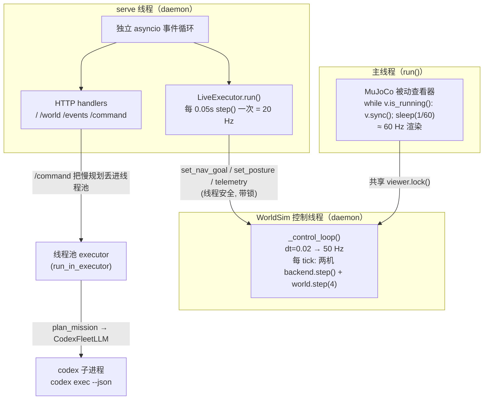

**为什么这样切线程：**

1. **主线程独占查看器** —— GLFW/OpenGL 的 `viewer.sync()` 必须在创建它的线程跑；所以 web 服务被
   推到一条 daemon 线程上自带事件循环（`_serve_in_thread`）。
2. **物理控制环独立成线程**（`WorldSim.start()` 起的 daemon）—— 它以恒定 50 Hz 跑，不受 HTTP/LLM 影响。
3. **codex 规划丢进线程池** —— `_command` handler 里：

   ```python
   loop = asyncio.get_running_loop()
   res = await loop.run_in_executor(
       None, lambda: plan_mission(nl, snapshot, llm=llm, sub_llm=sub_llm))
   ```

   xhigh 推理可能要好几秒；放进线程池后**绝不阻塞 aiohttp 事件循环**，UI 仍以 8 Hz 刷新。
   （也正因为跑在“没有 running loop 的线程池线程”上，`CodexFleetLLM` 内部才能用 `asyncio.run()` 桥接。）

4. **渲染锁** —— `WorldSim._control_loop` 在 `mj_step` 前后持有 `viewer.lock()`，让渲染线程拷贝 `mjData`
   时不会撞上正在跑的 `mj_step`（否则 “mj_copyDataVisual: stack is in use” 崩溃）。这正是 commit
   `562d7fac` 修的 bug。

**启动顺序（很关键，写在 `run()` 里）：**

```mermaid
sequenceDiagram
    autonumber
    participant R as run 启动器
    participant S as WorldSim
    participant Web as serve 线程
    participant Vw as Viewer

    R->>S: sim = WorldSim()  (控制环还没起)
    R->>R: 构建 codex llm (_build_codex_llm)
    R->>Web: _serve_in_thread(app)  (起 aiohttp + LiveExecutor.run)
    Note over Web: app.on_startup → asyncio.create_task(executor.run())
    R->>Vw: trim_render_cost(m) 先砍渲染开销
    R->>Vw: launch_passive(m, d)
    R->>S: set_render_lock(viewer.lock())
    R->>S: sim.start()  (此刻才起 50Hz 控制线程)
    loop 主线程
        R->>Vw: v.sync(); sleep(1/60)
    end
```

注意 `sim.start()` **在 viewer 存在之后**才调用——保证控制线程从第一步就在锁的保护下 step，
渲染线程拷贝 `mjData` 永远不会和 `mj_step` 竞争。

---

## 3. 端到端：一句话如何变成两台机器人协同动作

这是“the money shot”。操作员在聊天框打 `两机到中间会合，然后 g1_a 把巡逻交给 g1_b`，
全链路如下：

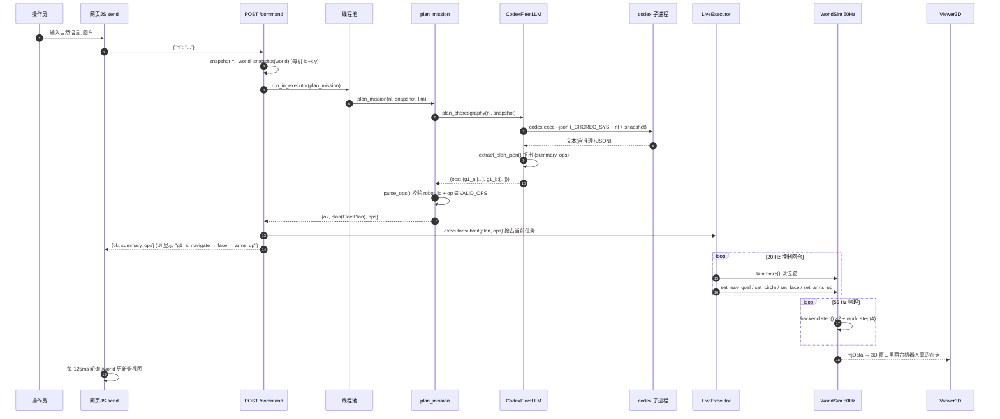

关键点：

- **规划与执行解耦**。`/command` 只做一件事：把 codex 规划出的 `(plan, ops)` `submit` 给执行器，
  然后立即返回。真正驱动机器人的是后台那条 20 Hz 的 `LiveExecutor.run()` 循环。
- **抢占语义**。`submit()` 直接替换“当前任务”并自增 generation id——新指令随时覆盖旧指令，
  “最新操作员意图获胜”（latest intent wins）。详见 §6。

---

## 4. AI 指挥官大脑 —— codex

### 4.1 路由：`plan_mission()` 的三层决策

`coordinator/choreographer.py` 里的 `plan_mission()` 是真正的“大脑路由器”。它按优先级尝试三条路：

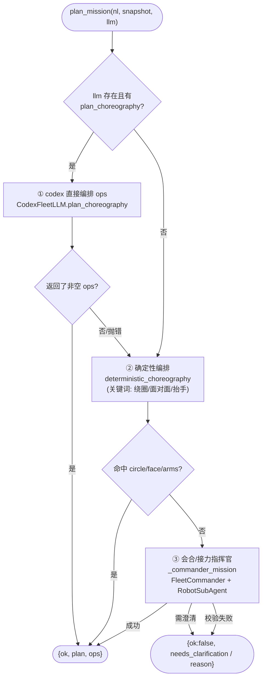

**含义（很重要）：** 当 codex 可用时，几乎所有指令**先走 ① 编排路**——codex 用丰富动作词汇
（navigate / circle / face / arms_up / hold / patrol / idle / sleep / wake）直接生成每机 op 序列。
只有当 codex 失败或返回空时，才落到 ② 关键词编排，再不行才到 ③ 会合/接力（带 barrier）的传统指挥官路。

> ⚠️ 细节：codex 的编排词汇里**没有 `await_barrier`**。所以真正“到点后同步等待对方”的会合屏障，
> 只来自 ③（确定性 `RobotSubAgent` 或 codex 的 `plan_fleet`）。codex 编排出的“会合”是“各自 navigate
> 到质心附近”，并发推进、无硬同步——对演示足够，但若要硬屏障同步，走的是 ③。

### 4.2 `CodexFleetLLM` —— 把 codex 接成舰队 LLM

`coordinator/codex_fleet_llm.py`。它实现两个方法，供两条路调用：

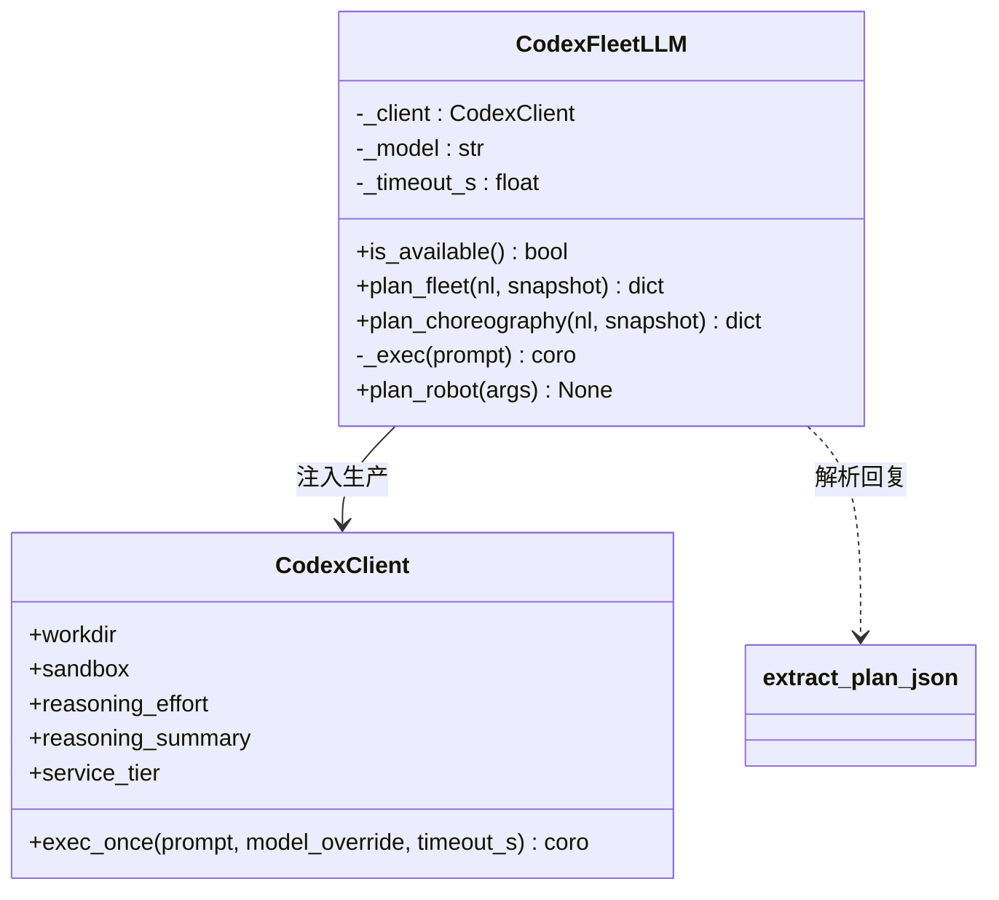

> `CodexClient` 实例值：`sandbox=read-only`、`reasoning_effort=xhigh`、`reasoning_summary=concise`、
> `service_tier=fast`；`_model=gpt-5.5`、`_timeout_s=90.0`。

- `plan_choreography(nl, snapshot)` → 用 `_CHOREO_SYS` 系统提示，让 codex 输出
  `{"summary", "ops": {robot_id: [{op,args}]}}`。**① 路用它。**
- `plan_fleet(nl, snapshot)` → 用 `_SYS` 系统提示，让 codex 输出一个 `FleetPlan`
  （summary / coordination / assignments / needs_clarification / risk）。**③ 路里 `FleetCommander` 用它。**
- 默认设置承自操作员的标准 codex 配置（memory `g1_brain_codex_high_priority_default`），但为**实时**回路调优：
  `model=gpt-5.5`、`reasoning_effort=xhigh`、`service_tier=fast`（1.5× 优先级）、`sandbox=read-only`。
- 桥接：codex 调用是 async，而 `plan_*` 跑在线程池线程（无 running loop），所以内部用 `asyncio.run(self._exec(...))`。
- **永不硬阻塞操作员**：codex 出错或无可解析 JSON → 抛异常 → 上层回退到确定性规划。

### 4.3 从 codex 的“推理+散文”里抠出纯 JSON

codex（尤其 xhigh）会把答案裹在推理、散文或 json 代码围栏里，而 plan 本身又嵌套对象数组，正则搞不定。
`extract_plan_json()` 用**括号配平扫描**（处理字符串字面量与转义）找出第一个平衡的顶层 `{...}`：

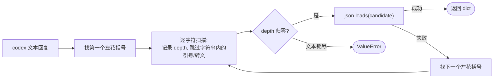

### 4.4 两套系统提示词的契约（codex 必须严格遵守）

| 提示 | 用途 | codex 必须输出 | 规则要点 |
|---|---|---|---|
| `_CHOREO_SYS` | ① 编排 | `{summary, ops:{rid:[{op,args}]}}` | 只用 snapshot 里的 robot_id；只用合法 op；“面对面”=各自 face 对方终点 (x,y)；并排=沿一轴 ~1.2 m 错开 |
| `_SYS` | ③ 指挥官 | 一个 `FleetPlan` JSON | rendezvous=各机目标在质心附近、错开 ~0.8 m（禁止两机同点）；relay 还要填 handoff_from/to/task |

两者都强制：“**只回原始 JSON，不要 markdown，不要解释**”，并且“只能用 snapshot 里存在的 robot_id”。
LLM 只是提议者；`parse_ops()` / `validate()` 才是处置者。

---

## 5. 动作词汇 & 确定性编排器

### 5.1 合法 op 词汇

`choreographer.VALID_OPS`：

```
navigate · await_barrier · patrol · idle · sleep · wake · circle · face · arms_up · hold
```

`parse_ops()` 把 `{rid:[{op,args}]}` 校验成 `List[SubAgentOp]`，对**未知 robot_id**或**词汇外 op**直接抛 `ValueError`。

### 5.2 确定性编排器（离线/codex 失败时的兜底）

`deterministic_choreography(nl, snapshot)` 是纯关键词驱动，让 demo **离线也能可靠跑**。它识别中英关键词：

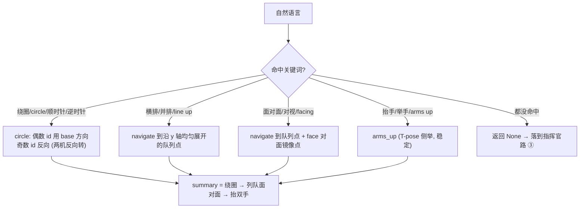

- 时长用正则 `_duration()` 抠（默认 30 s）。
- 队列点：在质心 x、沿 y 轴以 `2*_ROW_HALF=1.2 m` 间距对称展开。
- 面对面：每台机器人 `face` 队列里的镜像位（`ids[-1-i]`）。
- 多阶段时按 `circle → row/face → arms` 顺序串联，每机一条 op 序列、彼此并发推进。

---

## 6. LiveExecutor —— 抢占式调度器（“调度”的核心 A）

`sim/live_executor.py`。它是执行的另一半：把已展开的每机 op 序列对着 live world 跑，并支持**操作员抢占**。

### 6.1 数据结构

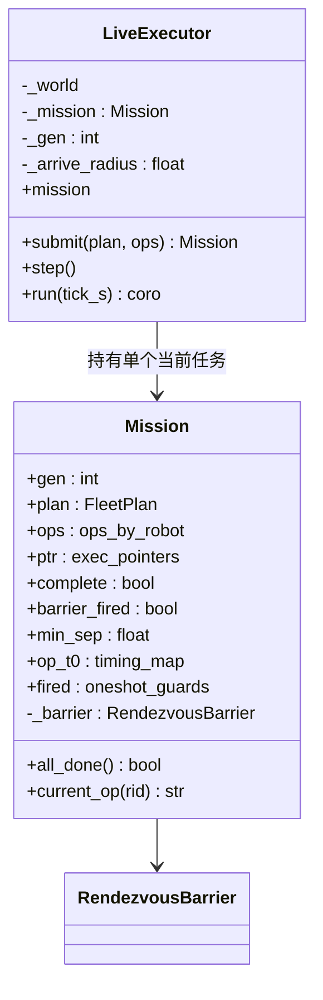

> `_arrive_radius=0.45`；`run()` 默认 `tick_s=0.05`（20 Hz）。`ops` 是 `{rid: [SubAgentOp]}`，
> `ptr` 是每机执行指针 `{rid: int}`，`op_t0` 是 `{rid: (op_index, 起始时钟)}`，`fired` 是一次性触发守卫集合。

### 6.2 抢占：generation id 换任务

执行器**只持有一个当前任务**。`submit()` 自增 `_gen`、直接换掉 `_mission`——长生命周期的 `run()` 循环
下一回合自然就驱动新任务，无需任何 task 编排/取消。这就是“最新意图获胜”。

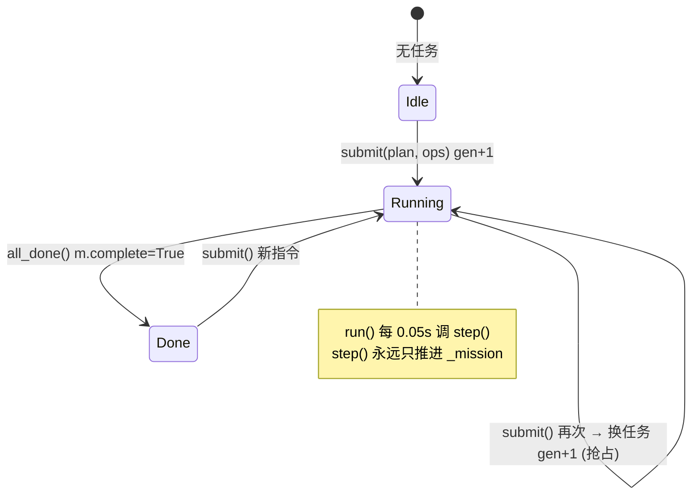

### 6.3 `step()`：每个回合如何推进每机的当前 op

每 tick（20 Hz）对每台机器人取当前 op，按 op 类型发指令给 world 并检查完成条件，完成则 `ptr[rid] += 1`：

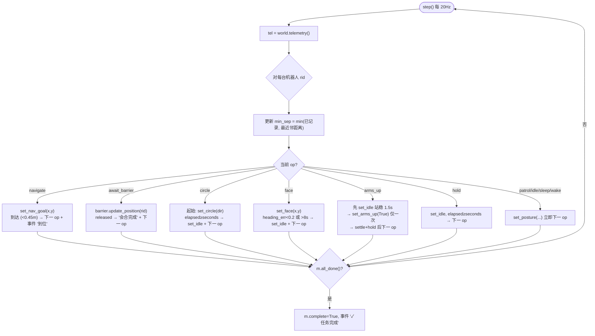

**每个 op 的精确完成语义（执行器侧守卫）：**

| op | 起始动作 | 完成条件 | 备注 |
|---|---|---|---|
| `navigate` | `set_nav_goal(x,y)` 持续 | `hypot(pos-goal) < 0.45` | arrive_radius |
| `await_barrier` | 喂位置给 barrier | `barrier.is_released()`（全员入圈 0.7 m） | 首次释放发 “会合完成” |
| `circle` | `set_circle(dir)` 一次 | `elapsed ≥ seconds`（默认 10） | 结束 `set_idle` |
| `face` | `set_face(x,y)` 持续 | `|heading_err| < 0.2 rad` 或 `>8 s` 超时 | `_FACE_DONE` / `_FACE_TIMEOUT` |
| `arms_up` | `set_idle` 站稳 | `elapsed ≥ 1.5(settle)+hold` | **先 settle 再举**，否则“边走边举会倒”；`fired` 集合保证只触发一次 |
| `hold` | `set_idle` | `elapsed ≥ seconds`（默认 2） | |
| `patrol/idle/sleep/wake` | `set_posture(...)` | 立即推进 | 纯姿态切换 |

`_ARMS_SETTLE=1.5s` 是个工程教训：抬手必须先站稳，举手中途换姿态会让平衡策略发散摔倒（见 §7.5）。

### 6.4 会合屏障（RendezvousBarrier）

`coordinator/barrier.py`：**协同时机绝不交给 LLM**。`await_barrier` 步骤只有在**每个参与者都到达**集合点
`radius` 内才释放——要么显式 `mark_arrived`，要么从遥测里检测到入圈。

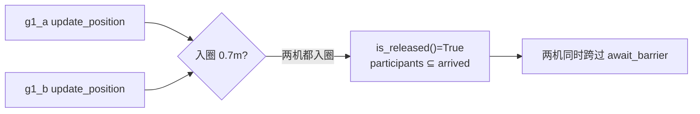

> 注意：编排任务（choreography）的 `Coordination.point=None`，barrier 处于惰性状态（无 `await_barrier` op
> 时根本不触发）。只有 ③ 会合/接力路才真正用到硬屏障。

---

## 7. 共享物理世界（两台 G1 一个 MjModel）

### 7.1 `SharedG1World` —— `MjSpec.attach` 把两台 G1 拼进一个世界

`sim/shared_world.py`。用 MuJoCo 的 `MjSpec` 把两份 `g1_29dof.xml` 各挂一个带 frame 的 body 进同一个
worldbody，编译成**单一 MjModel**（探针验证：`nq=72, nu=58, nv=70`）。每台机器人有自己的连续切片。

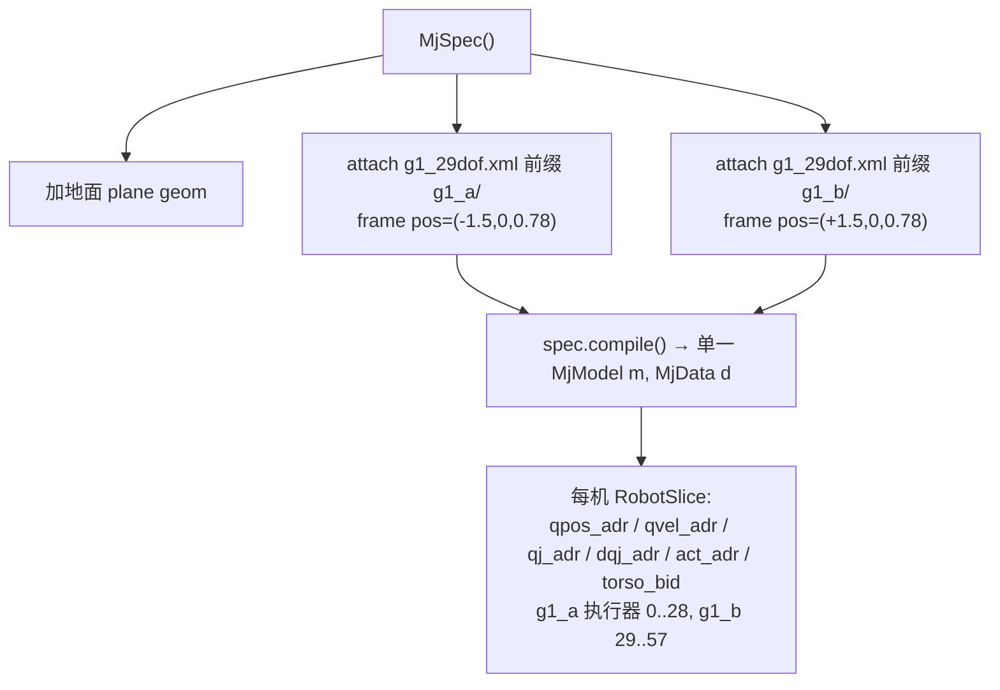

每台机器人按策略关节顺序（腿、腰、左臂、右臂）seed 到 `default_q`，pelvis 抬到 `_STAND_Z=0.78 m`。
`default_q` 直接读自 `unitree_rl_mjlab/.../velocity/v0/params/deploy.yaml`，保证站姿在策略分布内。

### 7.2 控制环 vs 物理步 —— **THE gotcha：PD 必须每个物理步重算**

这是整个共享世界最关键、最反直觉的一点（memory `fleet_shared_world_p1`）：

> **每个 sim substep（200 Hz）都要用最新的 q/dq 重算 PD 力矩，而不是每个 50 Hz 控制 tick 只算一次。**
> 否则 RL 机器人会震荡然后摔倒。

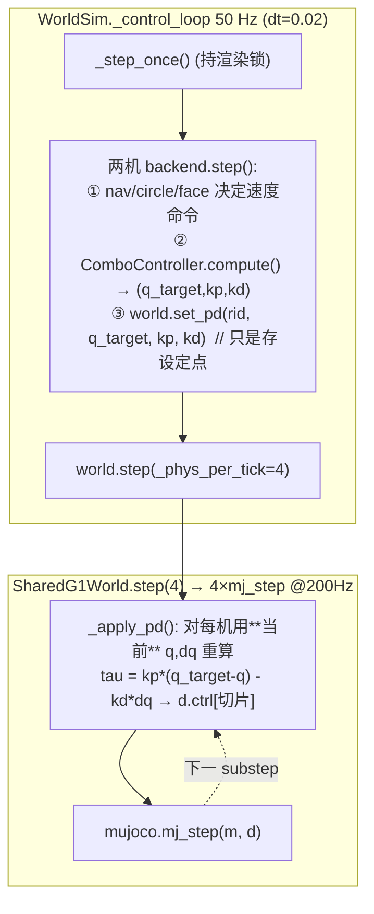

`_phys_per_tick = round(0.02 / 0.005) = 4`。所以一个 50 Hz 控制 tick 内跑 4 个 200 Hz 物理步，
**每步**都 `_apply_pd()` 用新鲜状态重算力矩。`set_pd()` 只缓存设定点 `(q_target,kp,kd)`；力矩在
`step()` 里逐步刷新——和真机 unitree bridge 行为一致：只在 50 Hz 算 PD 会让力矩相对积分器变陈旧，
驱动 Kp 震荡 → 不稳定。

### 7.3 每台机器人的 RL 控制栈

一台机器人从“速度命令”到“关节力矩”要穿过三层。核心是**原样复用**已验证的 `ComboController`：

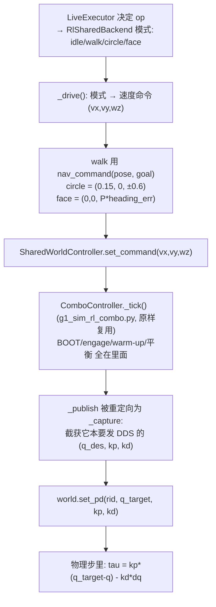

`sim/rl_adapter.py` 的 `SharedWorldController` 干了件巧妙的事：它构造真正的 `ComboController`，
但把 `ctl._publish` 替换成一个 `_capture` 闭包——这样 ComboController 以为自己在发 DDS，实际上我们
**截获**了它算出的 `(q_des, kp, kd)`，喂给共享世界的 PD。**完全不碰 DDS**。两处针对“无弹力带”世界的偏离：

- `boot_dur` 缩短到 `0.3 s`（默认 5 s 的 default_q‑PD 会让无带机器人在 ~1.5 s 内塌掉，赶在策略接管前）。
- 看门狗墙钟每 tick 刷新，永不触发。
- `compute()` 要以 ~50 Hz 真实时间跑，好让墙钟 `POLICY_WARMUP_S` 走完。

`FakeLowState` 是鸭子类型的 `LowState_`，只填 ComboController 读的字段（motor q/dq、imu 四元数/陀螺）。

### 7.4 nav 外环（位置 → 速度命令，限幅在策略分布内）

`sim/nav.py`。把 (当前位姿, 目标 xy) 转成 body‑frame 速度命令，**限幅在策略训练过的命令范围**，
绝不把步态策略开出分布：

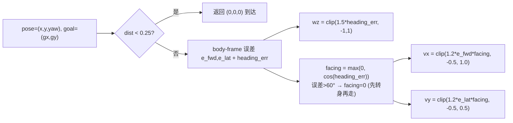

命令范围 `vx∈[-0.5,1.0] vy∈[-0.5,0.5] wz∈[-1,1]`。“没大致朝向目标前先别猛冲”——超过 60° 朝向误差就
把前进分量压零，先原地转。

### 7.5 模式与手臂手势

`agent/motion/rl_shared_backend.py` 把 op 模式映射到速度命令 + 可选手臂叠加：

| 模式 | 速度命令 | 来源 |
|---|---|---|
| idle | `(0,0,0)` 策略保持站立 | `set_idle/set_posture(IDLE/...)` |
| walk | `nav_command(pose, goal)` | `set_nav_goal(x,y)` |
| circle | `(0.15, 0, ±0.6)` → ~0.25 m 半径 | `set_circle(dir)` |
| face | `(0,0, clip(1.5*err))` 原地转 | `set_face(x,y)` |

**手臂手势的工程教训**（写死在代码注释里，verified）：
- “举手”用的是 **T‑pose 侧平举**（`t_pose_pose`），不是过头举。过头/前举会把质心前移，速度平衡策略漂走摔倒
  （实测 0.04 m 漂移 vs 过头 9 m）。
- 手臂只能经 ComboController 的**限速混合器**（`push_arm_action`，2–2.5 s 缓动）移动；直接 snap 目标会让
  关节速度尖峰、平衡策略摔倒。`set_arms_up` 推 `[(2.0s, pose), (30s, pose)]` 两个关键帧（升起再保持）。

---

## 8. 遥测与网页控制台

### 8.1 遥测快照

`WorldSim.telemetry()`（带锁）每机返回：

```python
{rid: {"pose": (x,y,yaw), "gz": gravity_proj_z, "neighbors": [{peer,dx,dy,dist,bearing}],
       "posture": backend.last_posture.value, "activity": backend.activity}}
```

`neighbors` 给出与另一台的距离/方位——俯视图上那条“最近间距 X m”虚线就来自这里。

### 8.2 三个 HTTP 端点驱动 UI

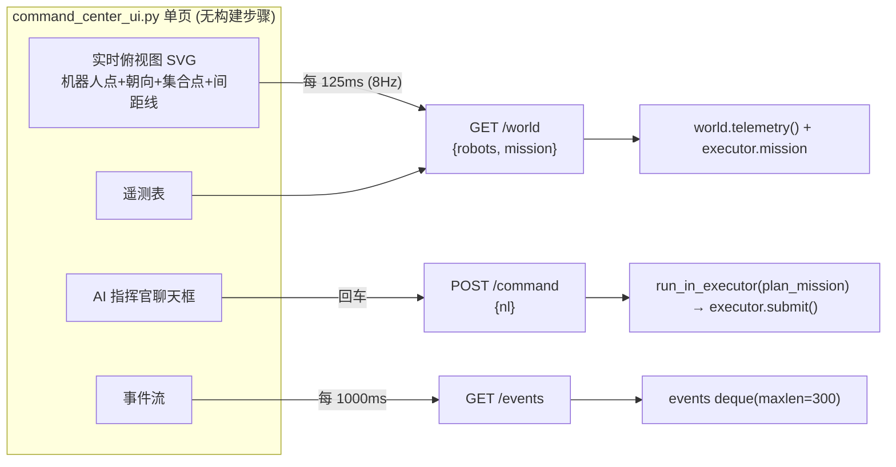

- `/world` 同时返回当前任务状态：summary、coordination type、集合点、是否完成、`min_sep`、每机 op 序列与当前 op。
- 事件由 `LiveExecutor` 的 `on_event` 回调推进一个 `deque(maxlen=300)`，带时间戳（`指挥官: ...`、`g1_a 到位`、
  `会合完成`、`✓ 任务完成` 等）。
- 3D 物理视图是独立的 MuJoCo 窗口（`--viewer`），与网页俯视图并存。

---

## 9. 规划数据契约

`coordinator/fleet_plan.py`（pydantic v2），是两套架构共享的“通用语言”：

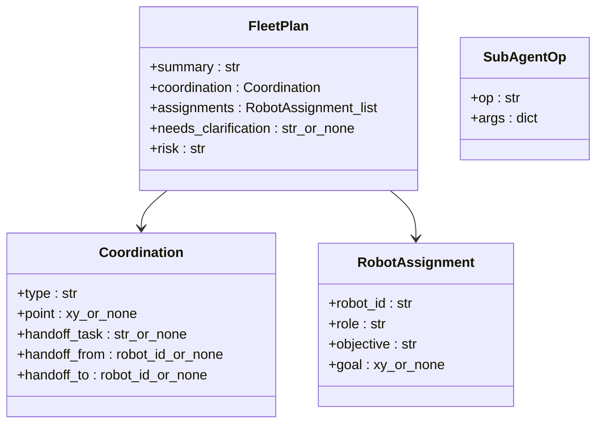

> `coordination.type ∈ {rendezvous, relay, patrol, choreography, none}`；`risk ∈ {low, medium, high}`；
> `point` / `goal` 为 `(x,y)` 或 `null`。

- 在 Live Command Center 里，编排任务用 `Coordination(type="choreography")`、`assignments` 留空，
  实际驱动用的是 `ops: {rid:[SubAgentOp]}`（不在 FleetPlan 里，而是 `plan_mission` 的并列返回值）。
- ③ 会合/接力路才填 `assignments` 和 `coordination.point/handoff_*`。

---

## 10. 分布式 Coordinator（更完整的兄弟系统，P2）

`coordinator/app.py` + `bus/` + `agent/`：这是一个真正分布式的舰队控制平面。机器人各自是进程，
经 WebSocket 接入；coordinator 做**能力/健康匹配的任务调度 + 异常驱动的自治重分配 + 全程审计**，
每条下行命令还要过每机本地的**准入闸**。Live Command Center 不用这条路驱动 3D 演示，但它**复用**了
这里的 `FleetCommander` / `RobotSubAgent` / `RendezvousBarrier` 做 ③ 路兜底。

### 10.1 总线拓扑与四层

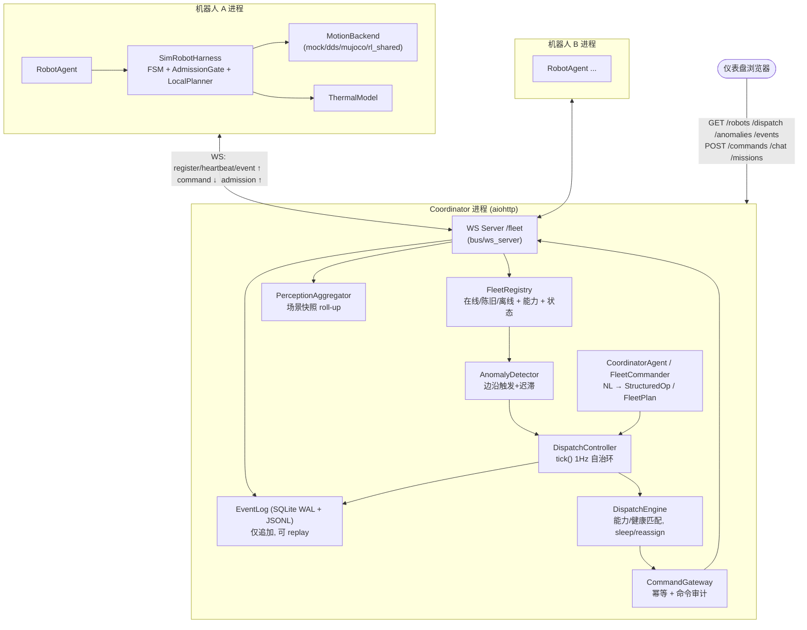

四层：① WS 接入（双向）；② 只读状态（Registry/EventLog/Perception/Anomaly）；③ 调度脑
（DispatchController + DispatchEngine，确定性）；④ LLM 推理层（CoordinatorAgent / FleetCommander，仅提议）。

### 10.2 每机控制栈（fast brain / slow brain / 安全闸）

```mermaid
flowchart TB
    subgraph AGENT["RobotAgent (bus/ws_client 接入)"]
        HB["_heartbeat_loop 2.0s → RobotStateMsg"]
        EV["_event_loop → 转发语义事件"]
        PER["_perception_loop 1.0s → 场景快照→事件"]
        TK["_tick_loop → core.tick()"]
    end
    subgraph CORE["SimRobotHarness (HarnessCore)"]
        FSM["RobotFsm (fast brain)"]
        GATE["AdmissionGate (最终本地权威)"]
        LP["LocalPlanner (slow brain)<br/>capability → Posture + FSM + 事件"]
        TM["ThermalModel (tau 驱动电池/电机温度+SOC)"]
        BK["MotionBackend"]
    end
    DOWN["下行 CommandEnvelope"] --> GATE
    GATE -->|"TTL→幂等→能力→FSM 合法?"| LP
    LP --> BK
    BK -->|"tau_est()"| TM
    TM -->|"快照进 RobotStateMsg.extensions"| HB
    AGENT --> CORE
```

`AdmissionGate.admit()` 是**协调器无法绕过的本地最终权威**，依次检查：
TTL 过期 → 幂等重复 → 能力支持 → FSM 合法 → `LocalPlanner.apply()`，返回 `AdmissionDecision`
（reason_code ∈ EXPIRED/DUPLICATE/UNSUPPORTED_CAPABILITY/FSM_FORBIDDEN/PLAN_ERROR/OK）。

`MotionBackend` 是协议抽象，四个实现：`MockBackend`（CI）、`DdsMujocoBackend`（双进程 DDS）、
`MujocoBackend`（进程内弹力带单机物理）、`RlSharedBackend`（共享世界多机，§7 用的就是它）。
`Posture` 枚举：`ACTIVE / PATROL / SLEEP / WAKE / IDLE / STOP / WALK`。

### 10.3 命令生命周期（操作员 → 机器人 → 审计）

```mermaid
sequenceDiagram
    autonumber
    participant U as 操作员
    participant API as POST /commands
    participant AG as CoordinatorAgent
    participant CT as DispatchController
    participant EN as DispatchEngine
    participant GW as CommandGateway
    participant WS as WS Server
    participant RB as 机器人 AdmissionGate
    participant EL as EventLog

    U->>API: {"nl": "sleep g1_a"}
    API->>AG: parse(nl)  (LLM 或确定性语法)
    AG-->>API: StructuredOp(kind="sleep", args={robot})
    API->>CT: run_op(op)  (持 asyncio.Lock)
    CT->>EN: sleep(rid) → CommandEnvelope
    CT->>GW: issue(env)
    GW->>EL: append COMMAND_ISSUED (带 trace_id)
    GW->>WS: send_command(rid, env)
    WS->>RB: COMMAND 帧
    RB->>RB: admit(): TTL/幂等/能力/FSM
    RB-->>WS: AdmissionDecision (accepted/refused)
    WS-->>GW: record_admission()
    GW->>EL: append COMMAND_ACCEPTED / REFUSED
    CT->>EN: release(rid) + reassign(task)  (若它持有任务)
    CT-->>API: snapshot()
```

`/chat` 走分层派遣：`FleetCommander.plan(nl, snapshot)` → `validate` → 每机 `RobotSubAgent.plan_ops()`
（和 Live 路 ③ 完全同源），返回每机 op 序列供 UI 审批。

### 10.4 自治异常环（tick 每 1 s）—— “调度” 的核心 B

`DispatchController.tick()` 是把感知变成确定性派遣 + 审计命令的唯一地方：

```mermaid
flowchart TD
    TICK(["tick() 每 1s, 持 asyncio.Lock"]) --> SCAN["AnomalyDetector.scan(registry)<br/>电池/电机过热, 低电量, 摔倒, 陈旧<br/>(边沿触发 + 迟滞 margin=3°C)"]
    SCAN --> EACHA{"每个异常"}
    EACHA --> EMIT["emit ANOMALY_DETECTED"]
    EMIT --> HANDLE["engine.handle_anomaly():<br/>① sleep 受影响机器人<br/>② release 它的任务<br/>③ reassign 给最佳健康候选 (SOC 最高)"]
    HANDLE --> ISSUE["gateway.issue(每条命令) → 审计 + 下发"]
    TICK --> LEASE["lease.tick() 过期租约"]
    LEASE --> EACHL{"每个过期租约"}
    EACHL --> LE["emit LEASE_EXPIRED<br/>sleep + release + reassign"]
```

`DispatchEngine._candidates()` 的调度准则：在线 + FSM=STANDING + health=ok + 拥有所需能力，
按电池 SOC 降序选最佳。这就是“LLM 提议，引擎决定”——最终调度器是确定性的。

异常检测阈值（可经环境变量覆盖）：电池 70°C、电机 80°C、SOC 15%、摔倒 `gravity_proj_z > -0.85`；
Registry：5 s 陈旧、15 s 离线；租约 TTL 30 s（网络分区安全阀，权威是有时限的）。

### 10.5 事件审计与契约消息

所有决策都进 `EventLog`（SQLite WAL + JSONL 镜像，`INSERT OR IGNORE` 幂等，按 `trace_id` 可 `replay`）。
总线上的 pydantic 契约消息：

```mermaid
flowchart LR
    CD["CapabilityDescriptor<br/>(register 时, 机器人能力/信任级)"]
    RS["RobotStateMsg<br/>(heartbeat 2s, fsm/电池/健康/位姿)"]
    RE["RobotEvent<br/>(场景/人/障碍/生命周期, payload_hash)"]
    CE["CommandEnvelope<br/>(command_id/trace_id/TTL/幂等键/能力/安全包络)"]
    AD["AdmissionDecision<br/>(accepted/refused/deferred + reason_code)"]
    CD -->|REGISTER ↑| BUS["FrameKind 帧<br/>(bus/messages)"]
    RS -->|HEARTBEAT ↑| BUS
    RE -->|EVENT ↑| BUS
    CE -->|COMMAND ↓| BUS
    AD -->|ADMISSION ↑| BUS
```

---

## 11. 两套架构如何衔接

```mermaid
flowchart TB
    NL(["操作员自然语言"])
    NL --> RT{"哪条路?"}
    RT -->|"Live Command Center"| LIVE["plan_mission():<br/>codex.plan_choreography ①<br/>→ deterministic ②<br/>→ _commander_mission ③"]
    RT -->|"Distributed /chat"| DIST["FleetCommander.plan()<br/>→ RobotSubAgent.plan_ops()"]
    LIVE -->|"① 编排路"| OPS_A["ops: SubAgentOp 序列<br/>(无 await_barrier)"]
    LIVE -->|"③ 兜底"| SHARED_PLAN["FleetCommander + RobotSubAgent + Barrier"]
    DIST --> SHARED_PLAN
    SHARED_PLAN --> OPS_B["ops: 含 await_barrier 的会合/接力"]
    OPS_A --> LE2["LiveExecutor → WorldSim (共享物理)"]
    OPS_B --> LE2
    OPS_B -.分布式下.-> GW2["Dispatch/Gateway → WS → 每机执行"]
```

- **共用的“脑”逻辑**：`FleetCommander`（NL→FleetPlan）、`RobotSubAgent`（assignment→op 序列，含
  await_barrier 的会合/接力展开）、`RendezvousBarrier`（硬同步）。两套架构都靠它。
- **不同的“身体”**：Live 路把 ops 交给 `LiveExecutor` 直接驱动**同进程共享物理世界**；分布式路把命令交给
  `DispatchEngine`/`CommandGateway`，经 **WS 总线**下发到**各自进程**的机器人，过 `AdmissionGate`。
- **不同的“大脑供应商”**：Live 用 **codex**（`CodexFleetLLM`）；分布式用 **OpenAI**
  （`OpenAIFleetLLM` / `OpenAIChatLLM`）。两者都有确定性兜底，无 key / 无 codex 也能跑。

---

## 12. 关键时序与常量速查

| 回路 / 量 | 值 | 出处 |
|---|---|---|
| 物理积分步 | `timestep=0.005 s` → **200 Hz** | `SharedG1World` |
| 控制环 | `dt=0.02 s` → **50 Hz**；每 tick `world.step(4)` | `WorldSim._control_loop` |
| 执行器 tick | `tick_s=0.05 s` → **20 Hz** | `LiveExecutor.run` |
| 查看器渲染 | `sleep(1/60)` → **~60 Hz** | `run()` 主线程 |
| UI 俯视图轮询 | `125 ms` → **8 Hz**；事件 `1000 ms` | `command_center_ui.py` |
| 到达半径 | `0.45 m` | `LiveExecutor` |
| 屏障入圈半径 | `0.7 m` | `Mission._barrier` |
| nav 停止半径 | `0.25 m`；命令限幅 vx∈[-0.5,1] vy∈[-0.5,0.5] wz∈[-1,1] | `nav.py` |
| circle | 前进 `0.15 m/s` + 偏航 `±0.6 rad/s` → ~0.25 m 半径 | `rl_shared_backend` |
| arms 站稳 | `_ARMS_SETTLE=1.5 s`；举臂缓动 `2.0 s`，保持 `30 s` | executor + backend |
| codex | `gpt-5.5` / `xhigh` / `service_tier=fast` / 90 s 超时 | `CodexFleetLLM` |
| BOOT 缩短 | `boot_dur=0.3 s`（无弹力带） | `rl_adapter` |
| Coordinator tick | **1 Hz** 自治环 | `DispatchController` |
| 心跳 / 感知 | `2.0 s` / `1.0 s` | `RobotAgent` |
| Registry 陈旧/离线 | `5 s` / `15 s`；租约 TTL `30 s` | `registry` / `lease` |
| 异常阈值 | 电池 70°C / 电机 80°C / SOC 15% / 摔倒 gz>-0.85；迟滞 3°C | `AnomalyDetector` |

---

## 13. 文件地图（按职责）

```mermaid
flowchart LR
    subgraph LIVEF["Live Command Center"]
        L1["sim/command_center.py · 启动器/HTTP/线程编排"]
        L2["sim/command_center_ui.py · 单页控制台"]
        L3["sim/live_executor.py · 抢占式调度 + op 执行"]
        L4["sim/shared_world_node.py · WorldSim 50Hz 线程"]
        L5["sim/shared_world.py · SharedG1World 单 MjModel 双机 + PD"]
        L6["sim/rl_adapter.py · 复用 ComboController 截获 q/kp/kd"]
        L7["agent/motion/rl_shared_backend.py · 模式→速度命令+手臂"]
        L8["sim/nav.py · 位置→速度外环"]
    end
    subgraph BRAINF["共享规划脑"]
        B1["coordinator/choreographer.py · plan_mission 路由 + 确定性编排"]
        B2["coordinator/codex_fleet_llm.py · codex 适配 + JSON 抽取"]
        B3["coordinator/fleet_commander.py · NL→FleetPlan (+OpenAI)"]
        B4["coordinator/robot_subagent.py · assignment→op 序列"]
        B5["coordinator/barrier.py · 会合硬同步"]
        B6["coordinator/fleet_plan.py · 数据契约"]
    end
    subgraph DISTF["分布式控制平面"]
        D1["coordinator/app.py · FastAPI/aiohttp 组装 + 路由"]
        D2["coordinator/controller.py · DispatchController 自治环"]
        D3["coordinator/dispatch.py · DispatchEngine 能力匹配/重分配"]
        D4["coordinator/gateway.py · 幂等 + 命令审计"]
        D5["coordinator/registry.py / lease.py / anomaly.py / perception_agg.py / event_log.py"]
        D6["coordinator/agent_llm.py · CoordinatorAgent NL→StructuredOp"]
        D7["bus/* · WS/loopback 总线 + Frame 协议"]
        D8["agent/* · RobotAgent/Harness/AdmissionGate/LocalPlanner/ThermalModel/Backends"]
        D9["contracts/models.py · 总线消息契约"]
    end
    LIVEF -.复用.-> BRAINF
    DISTF -.复用.-> BRAINF
```

---

### 一句话总结

你现在跑的 **AI 指挥调度中心** 是：**一句中文 → 丢进线程池里的 codex（gpt‑5.5/xhigh）→ 解析出每台 G1
的动作序列 → `LiveExecutor` 以 20 Hz 抢占式推进、最新指令覆盖旧指令 → 翻译成速度命令喂给原样复用的 RL
平衡控制器 → 在一个 MjModel 里以 50 Hz 控制、200 Hz 物理（每物理步重算 PD）驱动两台机器人真实自平衡行走
→ 你在 3D 窗口和网页俯视图里实时看到它们协同动作**。而它背后还藏着一套 production‑shaped 的分布式控制平面
（WS 总线 + 每机准入闸 + 能力/健康调度 + 异常自治重分配 + 全程审计），与之共享同一套规划脑。
</content>
</invoke>
