# pre_QA1 — 多 Agent Codex 生态 × 快慢脑执行细节 深度问答

> 本文针对你提出的 18 个问题，**逐条彻底展开 + 主动补充**，并配 mermaid 图。
>
> 所有关于 g1_brain 的结论都尽量给 `file:line` 引用（基于 `g1_brain/docs/v1_1_0_runtime.md`
> 的实证审计 + 本轮对源码的复核）。关于 Clariose / codex 多 agent 的结论引用
> `docs/references/Clariose/` 与 `docs/references/CDXLearn/cdx_notes/`。关于"是否首创 / 具身智能进展"
> 的结论附带外部论文与博客链接（截至 2026-05-26）。
>
> **阅读顺序建议**：先看 §0（三个命名陷阱）——你 80% 的困惑来自命名漂移，把这三件事理清，后面全部豁然开朗。

---

## 目录

- [§0 先解决三个"命名陷阱"（你混乱的真正根源）](#0-先解决三个命名陷阱你混乱的真正根源)
- [§1 系统到底有几层？反射层是什么？（Q2）](#1-系统到底有几层反射层是什么q2)
- [§2 快脑详解：一个 agent 还是两个？prompt 结构？（Q8 / Q11 / Q7 / Q14）](#2-快脑详解一个-agent-还是两个prompt-结构q8--q11--q7--q14)
- [§3 慢脑详解：三种 codex 模式 / RPC / daemon（Q1 / Q12 / Q13）](#3-慢脑详解三种-codex-模式--rpc--daemonq1--q12--q13)
- [§4 快慢脑协作全流程：路径 A/B、谁执行（Q15 / Q17）](#4-快慢脑协作全流程路径-ab谁执行q15--q17)
- [§5 安全层：watchdog / FSM / estop / 频率 / GIL（Q5 / Q6 / Q3）](#5-安全层watchdog--fsm--estop--频率--gilq5--q6--q3)
- [§6 多 Agent 生态：固化、加载、通信、飞轮（Q10 / Q16 / Q11）](#6-多-agent-生态固化加载通信飞轮q10--q16--q11)
- [§7 快慢脑是不是你首创？（Q9）](#7-快慢脑是不是你首创q9)
- [§8 具身智能最新进展到了什么地步？（Q18）](#8-具身智能最新进展到了什么地步q18)
- [§9 我替你补充的问题（你还没问但应该问的）](#9-我替你补充的问题你还没问但应该问的)

---

## §0 先解决三个"命名陷阱"（你混乱的真正根源）

你的问题里反复出现"快脑 / 慢脑 / 反射层 / slow brain / 路径 A / 路径 B / phase3"，这些词在**不同文档的不同时期指的不是同一个东西**。先把它们钉死。

### 陷阱 1：「脑」这个词被用过两套语境（直接命中 Q2 / Q8 / Q9）

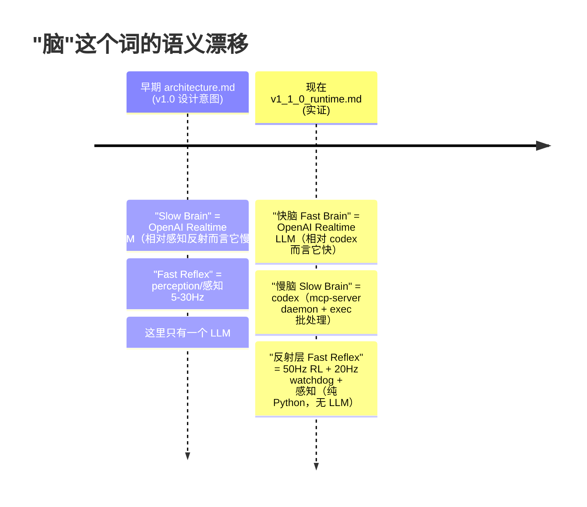

**这就是为什么源码里有矛盾的注释**：
- `apps/agent_main.py:3` 的 docstring 写 `"Slow-Brain + Fast-Reflex + Safe-Skill pipeline"` —— 旧语境。
- `brain/realtime_agent.py:58` 的 `BrainRealtimeAgent` docstring 写 `"""Slow Brain: va-demo's Realtime client..."""` —— 也是旧语境。
- 但 `v1_1_0_runtime.md` 全程管同一个 `BrainRealtimeAgent` 叫**快脑**。

**结论（务必记住）**：
| 你心里的词 | 实际对象 | 频率 | 含 LLM？ |
|---|---|---|---|
| **快脑** | `BrainRealtimeAgent`（OpenAI Realtime gpt-realtime，WebSocket） | turn 级 ~0.2–2 Hz | ✅ 是 |
| **慢脑** | codex（`mcp-server` daemon + `exec` 批处理两种形态） | 按需 / 后台 | ✅ 是 |
| **反射层 / Fast Reflex** | 50 Hz RL policy + 20 Hz watchdog + 5–15 Hz perception | 高频 | ❌ 纯 Python/数值 |

所以"反射层"**不是脑**，它是无 LLM 的实时数值控制+感知。早期文档把 LLM 叫"slow"是相对反射层；现在把同一个 LLM 叫"快脑"是相对 codex。**两个语境都对，只是参照系不同。**

### 陷阱 2：「Phase」有三个互不相干的命名空间（直接命中 Q4）

你问"phase3 的 buses 是什么"——这里的 "phase 3" 是 **agent_main 启动阶段的第 3 步**，跟"记忆 Phase 1/2"和"开发里程碑 phaseN"完全是三回事：

```mermaid
flowchart TB
  subgraph NS1["命名空间①：agent_main 启动 7 阶段（运行时）"]
    A1["Phase 1 prechecks+audio"] --> A2["Phase 2 DDS+Combo"] --> A3["★Phase 3: buses+FSM★"] --> A4["Phase 4 safety+perception"] --> A5["Phase 5 memory+TTS+vision"] --> A6["Phase 6 skills+brain"] --> A7["Phase 7 主循环"]
  end
  subgraph NS2["命名空间②：记忆流水线 Phase 1/2（离线 codex）"]
    P1["Phase 1: 单 session 提炼"] --> P2["Phase 2: 全局 MEMORY.md 合并"]
  end
  subgraph NS3["命名空间③：开发里程碑 docs/g1-fix-phaseN.md"]
    D["phase1..phase9 = 历史开发记录文档"]
  end
```

**你问的 "phase3 的 buses"** = 命名空间①的启动第 3 步（`agent_main.py:838-880`）：创建两条**状态总线** `SceneStateBus` + `RobotStateBus`，再建 `RobotFsm`（进 BOOT 态），并起 20 Hz 的 `RobotStateProducer` 线程。

**"bus（总线）"是什么**：一个**带锁的共享内存对象**，生产者（感知线程）调 `update_*()` 写，消费者（safety / watchdog / 快脑的 query 工具）调 `snapshot()` 读一份**不可变副本**。它不是消息队列，是"最后写入获胜 + 读时快照"。详见 §2.3。

### 陷阱 3：「路径 A / 路径 B」在文档里有两套二分（直接命中 Q15）

你说"感觉路径 A 和路径 B 做的事基本重合"——因为 `v1_1_0_runtime.md` 里**有两组不同的 A/B**，你可能把它们混在一起了：

| 二分组 | 出处 | 路径 A | 路径 B | 是否重合？ |
|---|---|---|---|---|
| **感知→快脑** | §6.2 | motion 后**自动**注入 `scene_after` | 快脑**主动**调 `query_scene_state` / `describe_scene` | **不重合**：A 自动、B 主动；A 免费搭车、B 花一次工具调用 |
| **记忆 recall** | §8.2 | `recall_grep/read/glob`（纯 Python，无 LLM） | `ask_slow_brain`（codex LLM agent） | **不重合**：A 是裸 grep ~10ms、B 是 codex 推理 ~3-15s |

两套 A/B 我在 §4 全部画图拆开。

### 陷阱 4：「sksv」是什么（直接命中 Q7）

**全代码库搜 `sksv` 零命中。** 它不是代码符号，是 `v1_1_0_runtime.md` mermaid 图里的**节点缩写** `SkSv` = **SkillServer**（`skills/skill_server.py`）。所以你看到的 `SkSv` 就是技能服务器。

你 Q7 后半句"快脑只能间接读 scenes 的传感器"——**完全正确**，这是本系统最关键的事实之一，§2.3 详述。

---

## §1 系统到底有几层？反射层是什么？（Q2）

### 1.1 五层 + 三个 LLM 的总览

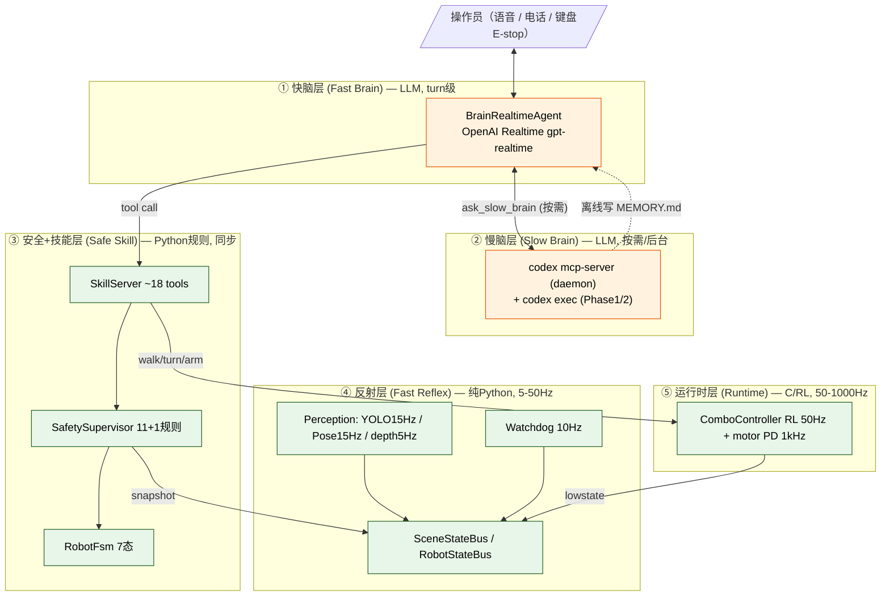

### 1.2 「反射层」到底是什么、起什么作用

**反射层 = Fast Reflex = 不经过任何 LLM 的高频感知与控制回路。** 名字直接写在源码里：
- `perception/__init__.py:1`：`"Fast Reflex perception layer (cameras + YOLO + MediaPipe + depth)"`
- `apps/agent_main.py:3`：`"Slow-Brain + Fast-Reflex + Safe-Skill pipeline"`

它由这些常驻线程/子进程组成（全部纯 Python / 数值，**没有 LLM**）：

| 组件 | 频率 | 作用 |
|---|---|---|
| ComboController RL policy | 50 Hz | 把"vx/vy/wz 命令"翻译成关节力矩（隔离在子进程） |
| 电机 PD | 1000 Hz | MuJoCo / 真机电机层，Python 完全碰不到 |
| YOLO11s 物体检测 | 15 Hz | 检测障碍/人 → 写 SceneStateBus |
| MediaPipe Pose | 15 Hz | 检测用户手势 → 写 SceneStateBus |
| 深度+ground_constraint | 5 Hz | 算 clear_path / nearest_obstacle → 写 SceneStateBus |
| WatchdogManager | 10 Hz | 看门狗，传感器超时就 trip（§5） |
| RobotStateProducer | 20 Hz | 轮询机器人 lowstate → 写 RobotStateBus |

**它和上层的关系（关键）**：反射层产出的世界状态（SceneState）对**安全层是持续生效的**（每次 motion 前 `validate()` 都 snapshot 一次），但对**快脑只是按需可见**（快脑不订阅它，只能主动 query，见 §2.3）。这正是你直觉里"perception 好像没在用"的根因——它对**安全**一直在用，对**快脑的语义意识**是事件驱动的。

> **补充澄清**：为什么不让快脑直接订阅反射层的实时流？因为 Realtime 是 WebSocket 协议，prompt 在 session 开始就被"烧进"会话；要持续灌 perception 必须每 N 秒发一条 `conversation.item.create`，token 成本高（`v1_1_0_runtime.md §6.3 / §14.3`）。这是设计取舍，不是 bug。

---

## §2 快脑详解：一个 agent 还是两个？prompt 结构？（Q8 / Q11 / Q7 / Q14）

### 2.1 你只有一个快脑 agent（Q8）—— 一个基类 + 一个具体实现

**你的直觉对了。** 不是两个 agent，是"基类 + 子类"的关系：

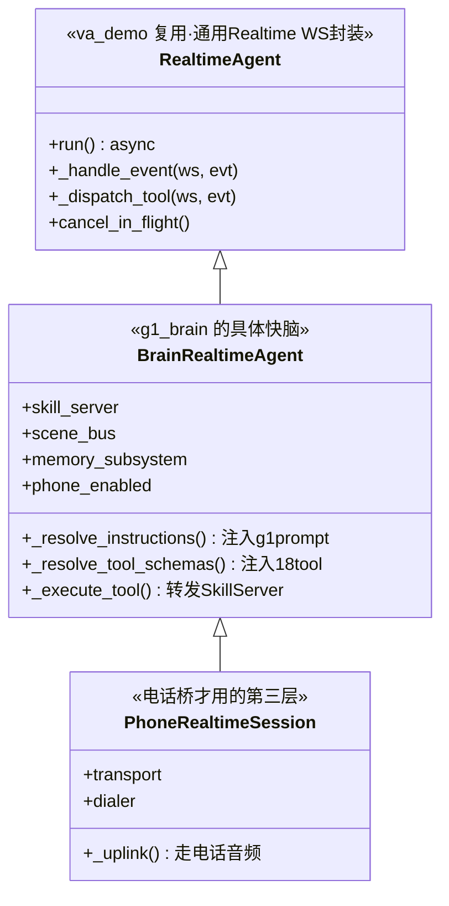

- **`RealtimeAgent`**（`va_demo.realtime_agent.RealtimeAgent`，从 va-demo 复用）= **通用的 OpenAI Realtime API 封装**（管 WS 连接、音频上下行、事件循环、barge-in 取消）。它是"类/框架"。
- **`BrainRealtimeAgent`**（`brain/realtime_agent.py:58`）= **你的具体快脑**，子类只覆写 3 件事：
  1. `_resolve_instructions()` —— 注入 g1 的 system prompt + memory（§2.4）
  2. `_resolve_tool_schemas()` —— 注入 18 个工具的 schema（§2.5）
  3. `_execute_tool()` —— 把每个 function_call 转发给 `SkillServer.execute()`
- `PhoneRealtimeSession` 是电话桥时**再继承一层**，复用同一套安全/技能，只换音频通道。

**所以运行时只有一个快脑实例在跑**（本地话筒）；开 `--enable-phone` 时每来一通电话**再 spawn 一个** `PhoneRealtimeSession` 实例，但它们共享同一个 `SkillServer` / `SafetySupervisor`。

### 2.2 快脑能调用的 18 个工具（含 Q14 的"工具注册"答案）

工具不是运行时动态注册的，而是启动时由 `tool_schemas.build_tool_schemas(sim, vision_only, mock_imitate_enabled, phone_enabled)` **静态生成一张 JSON schema 列表**，在 `BrainRealtimeAgent._resolve_tool_schemas()` 里交给 Realtime。

| 类别 | 工具 | 后端 | 进 safety？ |
|---|---|---|---|
| L1 说/看 | `say` / `describe_scene` / `query_scene_state` / `recall_history` | TTS / Vision / Bus / jsonl | 否 |
| L1 复合 | `look_at` / `approach` / `mock_imitate` / `ask_human` | 内部转 turn/walk/gesture | 部分 |
| L1 记忆 | `recall_grep` / `recall_read` / `recall_glob`（纯Python）/ **`ask_slow_brain`（codex）** | RecallSearcher / codex daemon | 否 |
| L2 运动 | `walk` / `turn` / `gesture` / `static_pose` / `stop` / `release_arms` | ComboController | **是** |
| 真机独有 | `loco_high` / `arm_action_high` / `audio_tts_robot` | 真机 client（sim 拒绝） | 是 |
| 电话 | `start_phone_call`（话筒侧）/ `end_call`（电话侧） | TwilioDialer | no_motion 白名单 |

**Q14「能不能通过写 schema 把任务注册到 realtime」**：
- **现状**：工具集是**编译期/启动期静态**的，没有运行时热注册 API。
- **怎么加新工具**（这就是"注册"的真实做法）：① 在 `tool_schemas.py` 加一个 schema 函数；② 在 `skill_server.py` 加对应的 `_skill_<name>()` 协程；③（若是运动）在 `supervisor.py` 的白名单加它。三处一改，下次启动 Realtime 就认得这个工具了。
- 这跟 §6 的"多 agent 固化"是同构的：**用声明式 schema/manifest 把能力钉死，启动时加载**——只不过这里是单 agent 的工具表，那里是多 agent 的团队清单。

### 2.3 快脑怎么"看世界"——只能间接读 SceneState（Q7 后半 + 为 Q15 铺垫）

**核心事实：快脑从不直接读 SceneStateBus。** `SceneStateBus → 快脑` 这条边在代码里**不存在**。快脑想知道世界状态，只有三条间接通道：

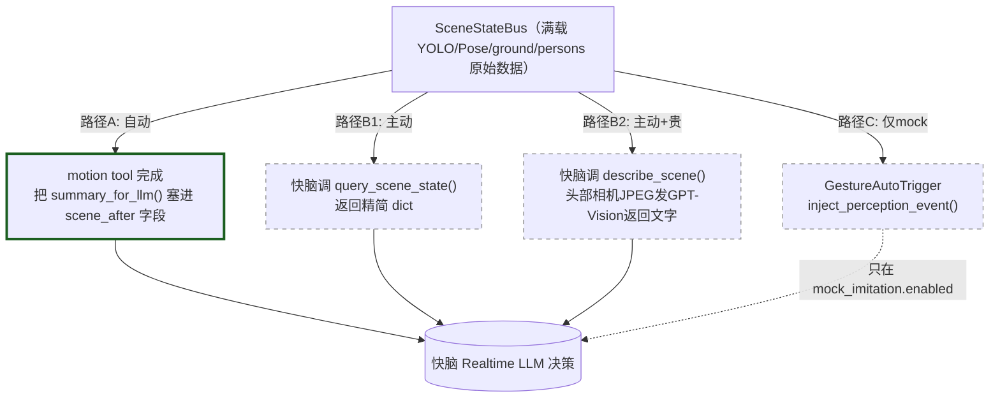

而且快脑拿到的**不是原始数据**——`snapshot().summary_for_llm()` 只返回 6-7 个字段：`persons_visible / nearest_obstacle_m / nearest_person_m / clear_path / surface_tilt_deg / user_gesture / warnings`。**YOLO 的类别框、深度图、姿态骨架，快脑统统看不到。**（`scene_state/types.py:109-132`）

这就是"快脑只能间接读 scenes 的传感器"的精确含义：**反射层把高维感知压缩成几个标量，快脑只在它主动想看的时候拿一眼。**

### 2.4 快脑 system prompt 的 6.3 结构（Q11）

启动时（`await brain_agent.run()` 之前一次性）拼接：

```
_resolve_instructions() 返回 =
   REALTIME_SYSTEM_PROMPT_BRAIN          ← brain/prompts.py:24-113（或 VISION_ONLY 版）
   + "\n\n"
   + _instructions_addendum               ← 由 append_developer_instructions() 注入
       = memory_summary.md（最近N session摘要） + AGENTS.md（recall操作手册）
```

`REALTIME_SYSTEM_PROMPT_BRAIN`（prompts.py）的内部结构是 5 段：

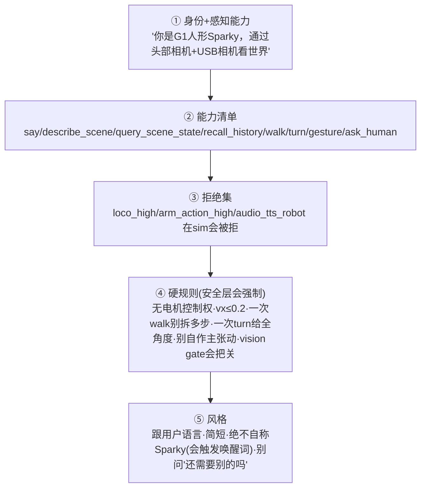

**Q11「这个 prompt 完全可以自定义来辅助多 agent 自我提升」—— 对，而且这正是关键杠杆。** 三个可调点：
1. **静态 prompt 本体**（`prompts.py`）—— 改它就改了快脑的人格/规则/工具偏好。
2. **运行时注入的 addendum**（memory_summary.md + AGENTS.md）—— **这就是飞轮入口**：慢脑离线把"上次学到的教训"写进 `memory_summary.md`，下次启动自动注入快脑 prompt，快脑就"变聪明"了。
3. **AGENTS.md（recall 操作手册）** —— 教快脑"先 grep，找不到再 ask_slow_brain"，决定它何时升级到慢脑。

> **注意一个实测发现**：当前 `REALTIME_SYSTEM_PROMPT_BRAIN` 正文里**根本没提 `ask_slow_brain`**。快脑要不要问慢脑，guidance 只来自：①工具自带的 description（tool_schemas.py:577-611）；②`memory/context.py:85` 注入的一句话；③AGENTS.md。**如果这三处都不强调，快脑几乎不会主动问慢脑**——这直接关系到 Q1（见 §3.3）。

---

## §3 慢脑详解：三种 codex 模式 / RPC / daemon（Q1 / Q12 / Q13）

### 3.1 codex（慢脑）有三种完全独立的形态

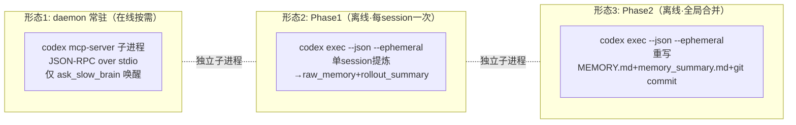

- **形态 1 daemon** = `codex mcp-server`，**常驻**（除非 `memory.enabled=false`），ping 每 30s 保活，崩了懒重启。命令（`daemon.py:417-435`）：`codex mcp-server -c approval_policy=never -c sandbox_mode=read-only -c model_reasoning_effort=high -c model_reasoning_summary=concise -c service_tier=fast`。
- **形态 2/3 exec** = `codex exec --json --ephemeral`（`codex_client.py:105-126`），**一次性**子进程：spawn→喂一段 prompt→stdin EOF→吐 JSONL 事件→退出。Phase1 和 Phase2 共用同一个 `CodexExecClient.exec()` 入口，只是 prompt + workdir 不同。

`effort=high + tier=fast` 是 v1.1.0 默认（`schemas.py:131-133`），来自你"每次 codex 都要 high+fast"的标准要求。

### 3.2 慢脑 RPC 是什么（Q12）

**Q12 答案：慢脑 RPC = MCP JSON-RPC 2.0 over stdio，对一个常驻 codex 子进程。**

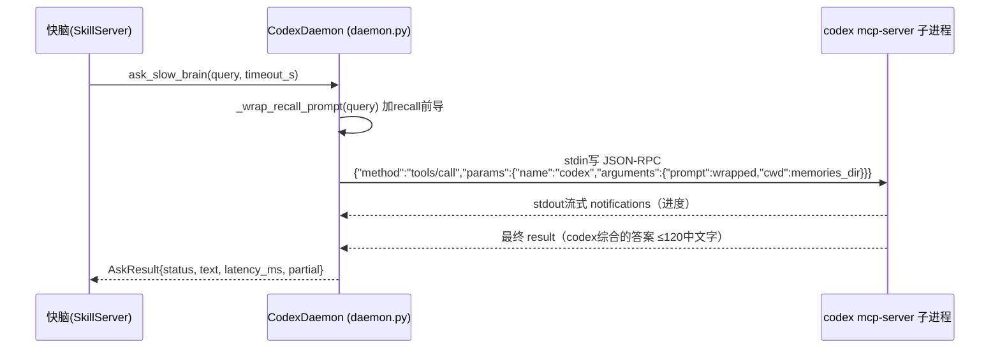

工程细节（`daemon.py`）：
- `asyncio.create_subprocess_exec` 非阻塞 spawn；stdout 用 **16 MB readline 缓冲**（codex 0.128 长输出会撑爆默认 64KB）。
- 失败隔离：daemon 崩溃**不会**把异常抛给调用方，返回 `status ∈ {ok,timeout,canceled,daemon_dead,queue_full,quota_exhausted,protocol_error}`。
- 支持 barge-in 取消（用户说"停"→发 `notifications/cancelled`）、默认 20s 超时、在飞队列上限默认 2、配额耗尽节流。
- `_wrap_recall_prompt()`（daemon.py:348-406）告诉 codex：用 rg/cat/sed 搜 `MEMORY.md / raw_memories.md / rollout_summaries/*.md / *.jsonl`，≤6 次 shell 调用给答案，引用 `session_id 前8字符 + turn_id`。

### 3.3 ask_slow_brain 过去什么时候被调用过？什么情况下调？（Q1）

**诚实的实证结论**：本轮排查**没有在日志里找到 `ask_slow_brain` 的实际历史调用记录**。原因如前述——它只在**快脑的 LLM 自己决定**要问时才触发，而触发它的 guidance 当前**不在主 prompt 里**，只在工具 description + 注入的一句话里。所以实践中它**很可能极少被自发调用**。

它**设计上**应该被调用的条件（来自 `tool_schemas.py:577-611` 的工具描述）：
1. 用户要一个**多步计划**；
2. `recall_grep` 返回空，但你怀疑**埋在某条旧 jsonl 里的罕见历史知识**；
3. 需要**深想一个不显然的安全含义**。
4. **绝不**用于任何反射/运动决策——那些必须留在快路径。

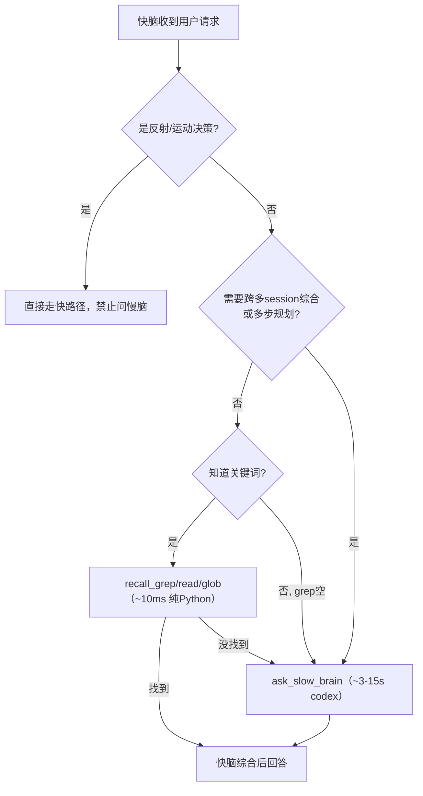

> **这就是 Q1 的真相 + 一个可行动建议**：codex daemon 现在大概率在"空转"——它孵化了、保活了，但快脑很少叫它。**要让它发挥作用，最小改动是在 `prompts.py` 或注入的 AGENTS.md 里明确写**："当用户问'我们上次怎么处理 X 的'/'帮我规划一个多步任务'时，先 recall_grep，没结果就调 ask_slow_brain。"

### 3.4 守护进程 daemon 到底起什么作用？为什么还需要被"唤醒"？（Q13）

你的困惑很合理："守护进程不应该是常驻直到任务完成吗？为什么还要唤醒？"——这里有个概念错位：

**守护进程的"常驻"和"被唤醒"不矛盾，它们是两件事：**
- **常驻（resident）**：进程**一直活着**，不为每次请求重新 spawn。`codex mcp-server` 一旦起来就保持 `STATE_READY`，ping 每 30s 维持，避免每次 ask 都付 ~2s 的冷启动。这就是它"常驻"的价值——**省启动开销**。
- **被唤醒（woken）**：常驻 ≠ 一直在干活。daemon 平时**空闲挂起**（在 stdin 上 block 等下一条 JSON-RPC），只有快脑调 `ask_slow_brain` 时才"醒来"跑一轮推理，跑完又回到空闲。这是**事件驱动**，不是轮询。

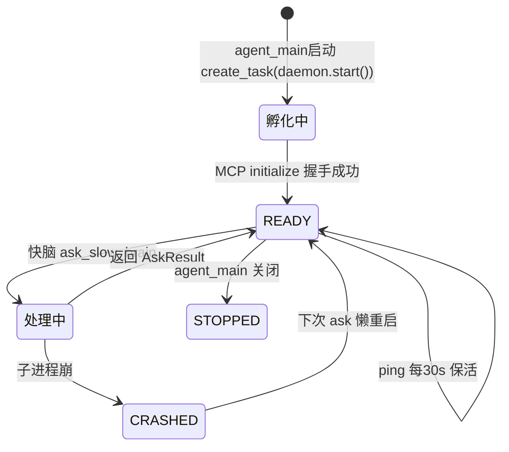

**对比 codex/claude 的 daemon 怎么做**（来自 `cdx_notes/codex_harness.md`）：
- `codex mcp-server` 就是这种"常驻 + 事件驱动唤醒"的标准 MCP server 模式——它**不是**"跑一个任务到完成就退出"的批处理进程。
- 而 `codex exec --ephemeral`（Phase1/2 用的）才是你想象的那种"跑完任务就退"的一次性进程。
- **所以 g1_brain 两种都用了**：daemon（常驻省启动）给在线 `ask_slow_brain`；exec（一次性）给离线 Phase1/2。

**为什么不让 daemon 自己"主动思考"？** 设计哲学就是"慢脑是按需脑"——避免空转烧 token。代价是：如果快脑不叫它，它就闲着（=Q1 的现象）。`v1_1_0_runtime.md §14.4` 列了"如果想让 codex 更主动"的方向（如 jsonl 写到阈值自动触发中期反思、FAULT 时自动 ping 做事后分析），但都会增加成本，要先确认必要性。

### 3.5 codex 何时**不**被调用（消除误解）

| 事件 | 触发 codex？ |
|---|---|
| 用户对快脑说话 / walk / query_scene_state | ❌ |
| `recall_grep/read/glob` | ❌（纯 Python） |
| `describe_scene` | ❌（用 OpenAI Vision，与 codex 无关） |
| `ask_slow_brain` | ✅ 形态1 daemon |
| session 关闭 | ✅ 形态2 Phase1（必然，每 session 一次） |
| Phase1 完成 | ✅ 形态3 Phase2（必然） |
| watchdog trip / FSM 转移 / E-stop / 定时 cron | ❌（完全事件驱动，无 cron） |

---

## §4 快慢脑协作全流程：路径 A/B、谁执行（Q15 / Q17）

### 4.1 你问的"路径 A 还是 B 还是都有"——都有，但它们不重合（Q15）

如 §0 陷阱 3 所述，有两套 A/B。**两套都"都有"，且各司其职、不重合**。

**第一套（感知→快脑，§6.2）**：

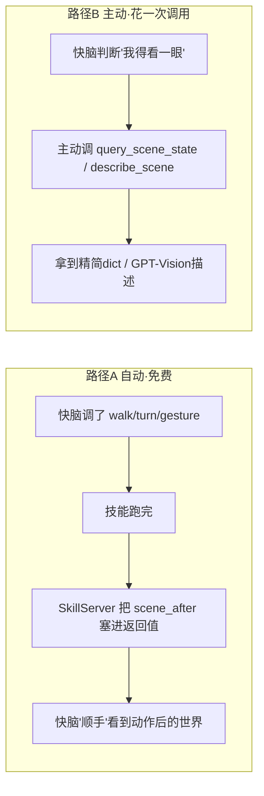
- 路径 A 只在**做完一个动作之后**自动给快脑一帧世界状态（不花额外工具调用）。
- 路径 B 是**快脑没动作、但想主动看**时调的。
- **不重合**：A 是"动作的副产品"，B 是"专门去看"。一个被动一个主动。

**第二套（记忆 recall，§8.2）**：

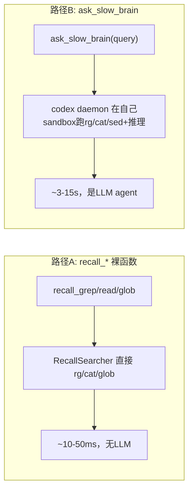
- **不重合**：A 是你已知关键词、快速翻 MEMORY.md 的裸 grep；B 是你找不到/要综合多份 jsonl 时升级到 codex 推理。
- 你感觉"重合"是因为**两者都在读 `memories/` 目录的同一批文件**——但一个是裸工具、一个是带推理的 agent，延迟差 100-1000 倍。

### 4.2 谁执行？慢脑查完是自己执行还是交还快脑？（Q17 核心）

**这是你最关心的，也是最关键的设计决策。答案斩钉截铁：**

> **慢脑（codex）只返回文字，从不执行任何机器人动作。执行权 100% 在快脑手里。**

证据（`skill_server.py:852-881` + `realtime_agent.py:376-387`）：`_skill_ask_slow_brain()` 拿到 `AskResult` 后，只是把 `{"ok":..., "text":..., "status":...}` 当作 **function_call_output 回传给快脑**，然后发 `response.create` 让快脑继续。快脑读完慢脑的文字答案后，**自己决定**下一步是开口说话、还是再调一个运动工具。

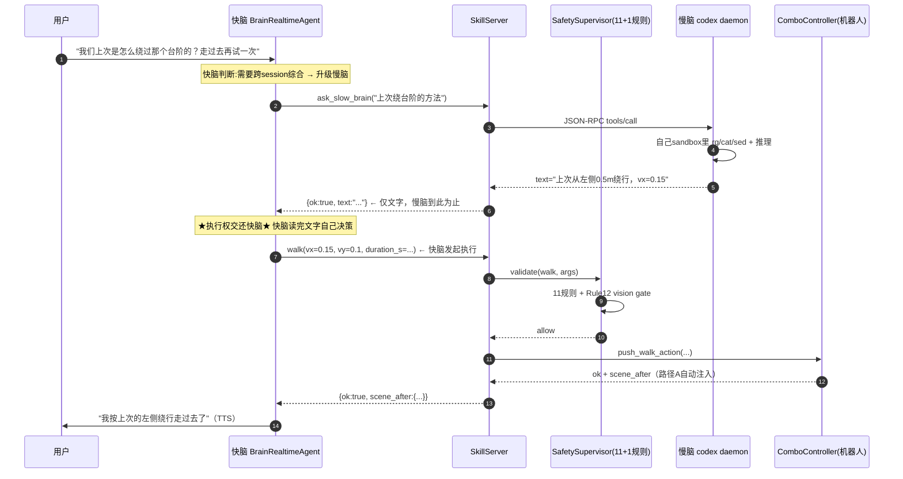

**为什么这样设计？** 三个理由：
1. **安全单一入口**：所有动作必须过 `SafetySupervisor.validate()`。如果慢脑能直接动机器人，就绕过了安全栈。让慢脑只出主意、快脑执行，保证**唯一的执行通道**仍受 11+1 规则约束。
2. **慢脑沙箱是 read-only**：codex 起的时候就是 `sandbox_mode=read-only`，它**物理上**只能读 `memories/`，没有动机器人的工具。
3. **职责清晰**：快脑=决策+执行+对话（带安全），慢脑=思考+检索（只读）。

### 4.3 快慢脑与安全层如何结合（Q17 前半）

**无论动作是快脑自发的，还是听了慢脑建议后发起的，都走同一条安全链**（`realtime_agent.py:168` → `skill_server.py:250` → `supervisor.py`）：

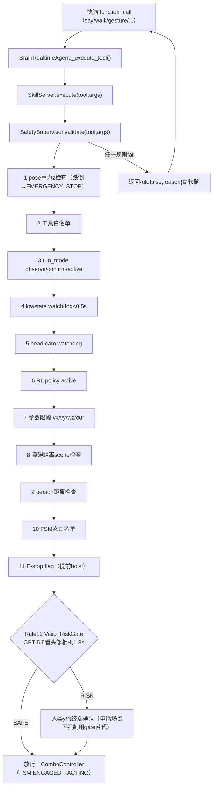

注意：`recall_*` / `ask_slow_brain` / `say` / `query_scene_state` 这些**不进 safety.validate**（它们不动机器人）；只有运动工具（walk/turn/gesture/static_pose/look_at/approach/release_arms）会过完整 11+1 规则。

---

## §5 安全层：watchdog / FSM / estop / 频率 / GIL（Q5 / Q6 / Q3）

### 5.1 Watchdog vs FSM vs E-stop（Q5）—— 三个不同层次的"刹车"

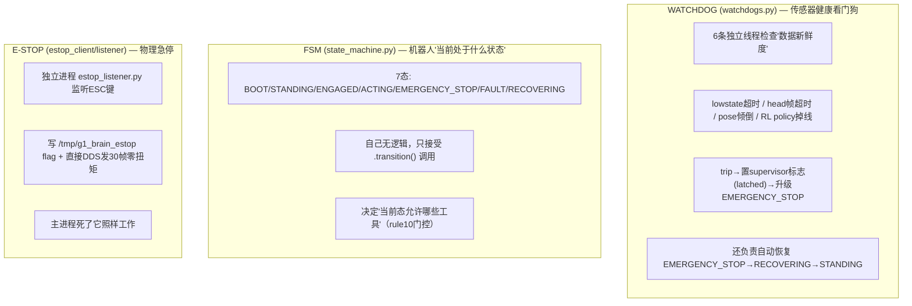

**三者精确分工 + 谁能压谁**：

| 维度 | Watchdog | FSM | E-stop |
|---|---|---|---|
| 管什么 | 传感器**数据是否过期** | 机器人**逻辑状态** | **物理急停按钮** |
| 触发源 | 时间戳超时 | 别人调 transition() | 人按 ESC |
| 能否拦运动 | 能（置标志→supervisor 拒绝） | 能（态不对就 rule10 拒） | 能（rule11，且 hoist 到最前） |
| 能否改 FSM | 能（升 EMERGENCY_STOP / 自动恢复） | 它**就是**状态 | 间接（estop→FSM 转 EMERGENCY_STOP） |
| 在哪个进程 | 主进程 10Hz 线程 | 主进程对象 | **独立进程**（最硬） |
| 优先级 | 中 | 低（被前两者改写） | **最高**（独立进程，软件死了仍生效） |

**一句话**：
- **E-stop** 是最后的物理保险（独立进程，硬切零扭矩）；
- **Watchdog** 是"传感器掉线/机器人快倒了"的自动监护（软件级，会主动升级急停并能自动恢复）；
- **FSM** 是"现在能做什么"的状态门（被动，记录态 + 门控工具）。

E-stop > Watchdog trip > FSM 门控，三者层层独立，越往后越"硬"。

### 5.2 频率到底意味着什么？15Hz 是什么意思？（Q6）

**你的理解需要小修正**：

> **15 Hz = 每秒执行 15 次 = 每 1/15 秒（≈66.7 毫秒）执行一次。**

不是"15 单位时间执行一次"，而是"1 秒内执行 15 次"。Hz（赫兹）就是"每秒次数"。周期 = 1/频率。

| 频率 | 每秒次数 | 周期（间隔） | 谁 |
|---|---|---|---|
| 1000 Hz | 1000 | 1 ms | 电机 PD（C 层） |
| 50 Hz | 50 | 20 ms | RL policy tick |
| 20 Hz | 20 | 50 ms | RobotStateProducer |
| 15 Hz | 15 | 66.7 ms | YOLO / Pose 推理 |
| 10 Hz | 10 | 100 ms | Watchdog |
| 5 Hz | 5 | 200 ms | ground_constraint / frame_age |

代码里就是 `self._stop.wait(0.2)` = 每 200ms 一轮 = 5 Hz（`runner.py:205`）。频率越高=反应越快=吃越多 CPU。这就是为什么 50Hz 控制必须隔离进程（下条）。

### 5.3 GIL 共享是什么？（Q3）

**GIL = Python 全局解释器锁。** Python 同一进程里，**同一时刻只有一个线程能执行 Python 字节码**（即使多核也一样）。多个线程"共享 GIL"= 它们要排队抢这把锁。

**为什么这是个问题（直接关系到 50Hz 控制）**：

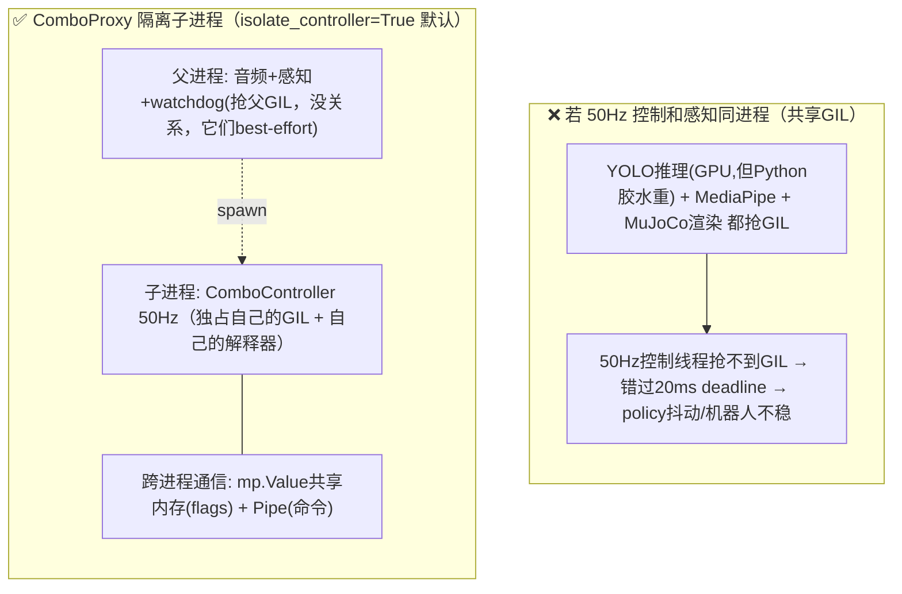

`combo_proxy.py` 用 `mp.get_context("spawn")` 起一个**全新解释器**的子进程跑 50Hz 控制，让它独占自己的 GIL，**不被感知线程拖累**。父子用 `mp.Value`（共享内存，存 policy_active 等 flag）+ `Pipe`（发命令）通信。这就是 `v1_1_0_runtime.md §3` 说的"50Hz 控制循环默认隔离到子进程，避免 perception 抢 GIL 拖垮 policy"。

**总结 Q3**：GIL 共享 = 同进程多线程抢一把解释器锁；本系统把对时延最敏感的 50Hz 控制踢到**独立子进程**避开 GIL 争用，把不那么敏感的感知/音频/看门狗留在父进程容忍 GIL 排队。

---

## §6 多 Agent 生态：固化、加载、通信、飞轮（Q10 / Q16 / Q11）

你想表达的核心——**"多 agent 就是一套自我提升的飞轮，越用越好用"**——是完全成立的，而且 Clariose 和 codex 原生机制各给了一套现成做法。下面把两套都讲清，再给"搬到 g1_brain"的最小配方。

### 6.1 两套多 agent 范式（你的两个参照都看了）

| | **Clariose（TypeScript 业务 harness）** | **codex 原生（Rust 内核，cdx_notes）** |
|---|---|---|
| agent 怎么固化 | `config/codex-teams/*.team.json` 团队清单 + `prompts/codex-agents/*.md` 每 agent 一份 prompt | 文件系统约定 `teams/<name>/{memory,skills}/` 每 agent 一个目录 |
| 加载 | 启动读 manifest → `CodexAgentRegistry.fromManifest()` 建 `Map<role,RoleDefinition>` | codex 内核按 root thread 派生 sub-agent，共享 `AgentControl` |
| 通信 | **4 层总线**：Event Bus / Blackboard(KV) / Mailbox / SubscriptionRegistry | `Op::InterAgentCommunication`：`send_message`(异步) / `followup_task`(唤醒) |
| 记忆隔离 | 每 agent 独立 + 共享 blackboard | 每 agent `teams/<name>/memory/MEMORY.md` 独立 + 共享 `recall-memories/` |
| 飞轮 | per-turn recall 注入 + 每日 Auto-Dream 合并 | Phase1（单 rollout 提炼）+ Phase2（全局合并）+ usage_count 排序 |

### 6.2 Clariose 怎么把多 agent "固化下来"（Q10）

**这就是 g1_brain `tool_schemas` 思路的放大版**：用声明式清单钉死，启动时加载。

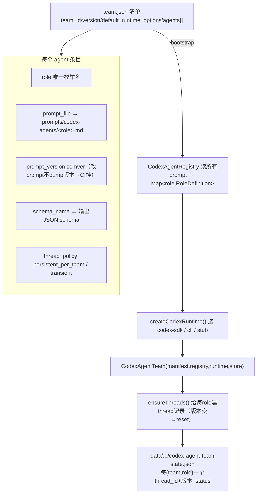

**固化的本质 = 三元组 `(role, prompt_file, schema_name)` 钉死一个 agent**，加上**线程持久化**（thread per (team,role)，存盘，重启续上；prompt/schema 版本一 bump 就自动 reset 线程）。`carenote-doctor-visit.team.json` 里固化了 11 个 agent（visit_orchestrator / transcript_quality / medical_instruction_extractor / safety_clarification / family_summary / memory_update / compliance_guardrail / ...）。

### 6.3 多 agent 之间到底怎么通信（Q16）—— 关键：它们从不直接互相调用

**两套机制都遵守一条铁律：agent 之间不 RPC 互调，全部走"共享状态 + 邮箱 + 订阅"。**

**Clariose 的 4 层总线**：

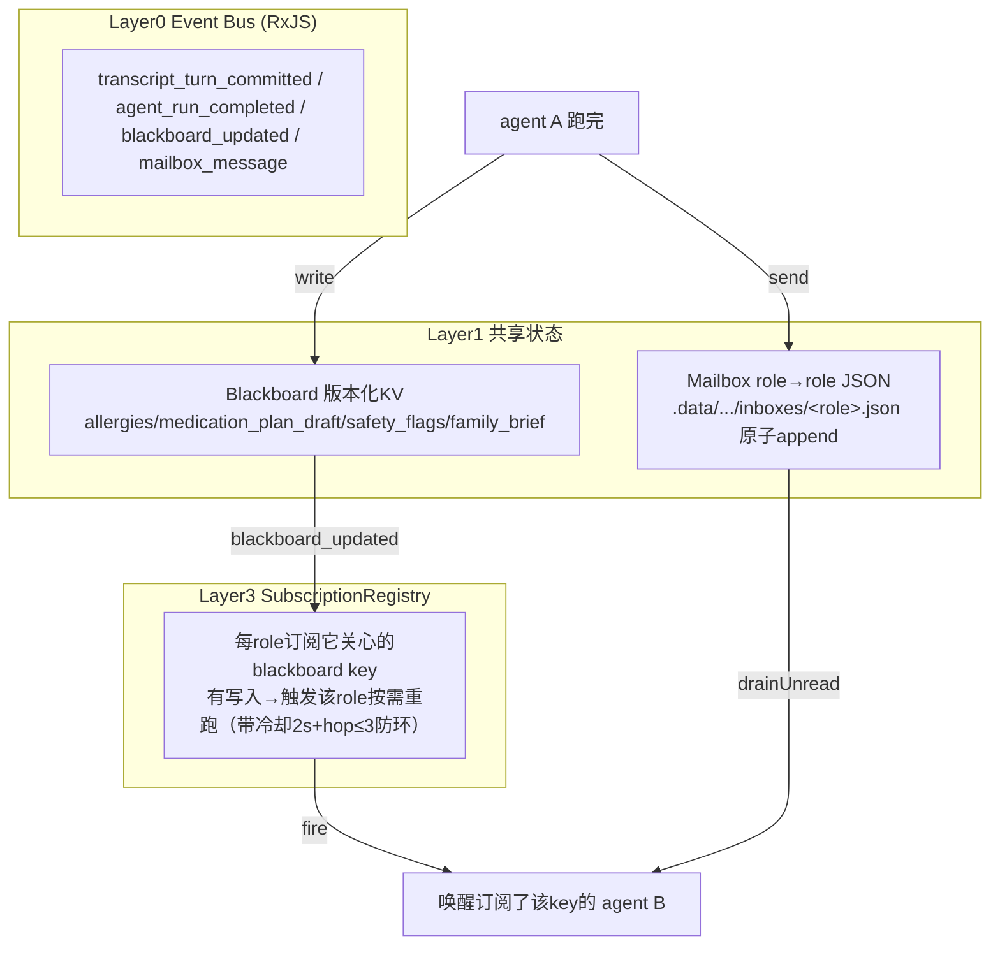

当前 Clariose 的编排是**硬编码的流水线**（不是动态决策）：Pass1 并行(transcript_quality/speaker_role/medical_instruction_extractor) → Pass1.5(safety_clarification) → Pass2 并行(medication_reminder_draft/follow_up_task_draft/family_summary/memory_update) → Pass3(compliance_guardrail 最终守门)。`visit_orchestrator` 这个"编排器 agent"是**预留给未来**做动态决策的。

**codex 原生机制（更底层）**：

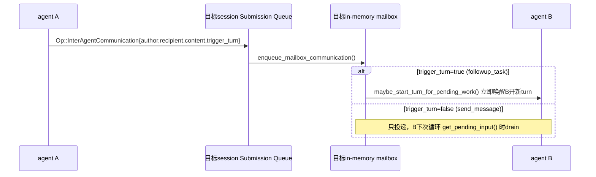

- `send_message(target, msg)` = 写对方邮箱但不要求立即处理（异步）。
- `followup_task(target, msg)` = 写邮箱**并立即唤醒**对方开新 turn（同步派活）。

**所以 Q16 的答案**：多 agent 通信 = **声明式订阅 + 异步邮箱 + 共享黑板**，由一个事件总线驱动，**没有 agent 直接函数调用另一个 agent**。这避免了循环依赖和紧耦合。

### 6.4 自我提升飞轮：越用越好用（Q10 / Q11 收尾）

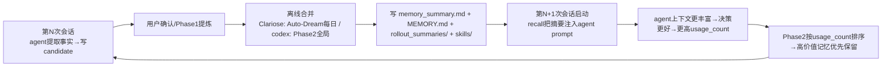

**飞轮的两个泵**：
1. **写泵（离线）**：Phase1 把每条 rollout/session 的 jsonl 提炼成 `raw_memory`；Phase2 把所有提炼**全局合并**重写 `MEMORY.md` + `memory_summary.md`，并 `git commit` 留快照。codex 还按 `usage_count / last_usage / generated_at` 给记忆排序，高频用的留下、长期没用的过期。
2. **读泵（在线）**：每次会话/turn 开始，recall 用 **≤6 步 rg/cat/sed** 把相关记忆注入 prompt（`memory_summary.md` 已常驻 → `rg MEMORY.md` → 打开 1-2 个 `rollout_summaries/` → 必要时回查原始 jsonl → 命中不够就停）。AGENTS.md 是教 agent"怎么搜"的操作手册。

**这正好对应 Q11**：g1_brain 的快脑 prompt 里那个**运行时注入的 addendum（memory_summary.md + AGENTS.md）就是飞轮的读泵入口**。你完全可以自定义 prompt + AGENTS.md 来引导快脑"先查记忆、查不到问慢脑、用完把教训交给 Phase2 沉淀"——这就把单机快脑接进了"越用越好"的飞轮。

### 6.5 搬到 g1_brain 的最小配方（综合两套）

| 要素 | g1_brain 已有？ | 来自 Clariose/codex 的做法 |
|---|---|---|
| (a) 团队清单 schema | ❌（只有单 agent 的 tool_schemas） | `config/teams/<team>.team.json`：agents[] 含 role/prompt_file/schema_name/version |
| (b) 每 agent prompt 文件 | 部分（prompts.py 是单 agent） | `prompts/<role>.md`：身份+输入+硬规则+JSON输出 schema |
| (c) 加载器/registry | ❌ | 启动读清单→读每份 prompt→建 `Map<role,def>` |
| (d) 线程/状态持久化 | ✅ 已有 SQLite + git（memory 子系统） | thread per (team,role)，版本 bump→reset |
| (e) 编排+通信总线 | ❌（目前快脑单点） | 黑板(KV)+邮箱(role→role)+订阅；或 codex 的 send_message/followup_task |
| (f) 共享记忆飞轮 | ✅ 已有 Phase1/2 + recall | 直接复用，按 usage_count 排序 |

**结论**：g1_brain 已经有飞轮的**记忆引擎**（d/f），缺的是**多 agent 的清单/加载/通信**（a/b/c/e）。要把"多 agent 飞轮"落地，最省力的路径是仿 Clariose 的 team.json + registry，把现在的单快脑扩成"快脑(对话) + 若干专家慢脑(规划/安全复核/记忆整理)"，让它们走黑板/邮箱通信、共用现有 `memories/` 飞轮。

---

## §7 快慢脑是不是你首创？（Q9）

**诚实结论：概念不是首创，你的具体组合是有新意的工程实例。** 分三层说清楚：

```mermaid
timeline
    title 快/慢脑（双过程）思想的谱系
    1990s-2011 认知科学 : Stanovich&West 提出 System1/System2 : Kahneman《思考快与慢》普及（双过程理论）
    1986-1998 经典机器人 : Brooks 包容架构(reactive快脑) : 3T/Gat 三层架构(deliberative慢+sequencer+reactive快)
    2022-2023 LLM规划+策略执行 : SayCan/Inner Monologue/Code as Policies/VoxPoser/RT-2(VLA范式)
    2024 双过程LLM agent : DeepMind Talker-Reasoner(arXiv2410.08328): Talker快(对话)+Reasoner慢(推理), 经共享记忆通信 ← 与你最像
    2025-2026 机器人基础模型主流化 : Figure Helix(S1 200Hz/S2 7-9Hz) : NVIDIA GR00T N1(System1+System2) : Google Gemini Robotics + ER(具身推理慢脑)
```

**① 概念是确凿的先行技术**：双过程（System1/2）在认知科学（Kahneman 2011，源自 Stanovich & West）、经典机器人（Brooks 包容架构 1986、Gat 三层架构 1998）、以及 2025-2026 的机器人基础模型（Figure Helix、NVIDIA GR00T N1、Google Gemini Robotics-ER）里都是**主流范式**。声称"思想首创"过不了审稿。

**② 用于对话/具身 agent 且带共享记忆，也已有先例**：DeepMind 的 **Talker-Reasoner**（arXiv 2410.08328，2024-10）就是"快的对话 System1 + 慢的推理 System2，经共享记忆通信"——和你的架构是同一家族。

**③ 你真正新的地方（这是可辩护的工程新意，按"新实例"而非"新范式"来表述）**：
- **用现成异构产品模型当两个脑**：用 **OpenAI Realtime API（语音原生、流式）** 当快脑（而非自训小策略或文本 LLM），用 **Codex CLI（带文件系统/shell 的编码 agent）** 当按需慢脑——文献里慢脑通常是"更大的 VLM/LLM"，用编码 agent 当慢脑很少见。
- **共享、可 grep 的纯 markdown 记忆**作为脑间通道 + 跨 session 存储（Talker-Reasoner 用的是抽象共享记忆；你把它做成人类可读、文件化、两个脑的工具都能查的形态）。
- **离线批量记忆固化**（独立的异步"睡眠时"推理把记忆压缩/策展给未来用）——耦合进双脑人形语音 agent 的打包系统，没找到已发表的。

> **给文档读者的标准表述（建议照抄）**："双过程（快/慢脑）分层是认知科学、经典机器人与当代机器人基础模型（Helix/GR00T/Gemini Robotics-ER）及 LLM agent（DeepMind Talker-Reasoner, 2024）里确立已久的范式。我们的贡献不是范式本身，而是一个面向具身语音 agent 的务实**实例**：语音原生流式模型（OpenAI Realtime）作快脑、按需 agentic 编码 CLI（Codex）作慢脑，经人类可读、可 grep 的 markdown 记忆耦合，并带离线批量固化。"

**你说"非常自然的反应说，因为需要一个低的 latency"——这恰恰是对的**：整个 2025-2026 业界之所以都拆双系统，**正因为单一模型做不到"既足够通用又足够快"**（Helix 的 VLM 慢脑只有 7-9Hz，远低于反射控制需要的 100-200Hz）。你出于低延迟需求自然地拆出快慢脑，**说明你的直觉与前沿共识一致**——这是设计上的加分项，不是减分项。

---

## §8 具身智能最新进展到了什么地步？（Q18）

截至 2026 上半年，**双系统 VLA（视觉-语言-动作）基础模型 + 快速部署策略**已是行业共识架构。

### 8.1 第一梯队玩家现在能做什么（已验证 / 厂商自述 / 传闻分级）

| 系统 | 类型 | 现在能做（2026 中） | 来源/日期 |
|---|---|---|---|
| **Figure Helix / Helix-02** | 双系统 VLA（S2 7-9Hz VLM + S1 200Hz 策略） | 全身自主（腿+躯干+臂+手指一张网）；分拣刚性箱+柔性袋；厂商称连续 8 小时自主班次、直播 ~40 小时/~5万件包裹 | figure.ai/news/helix-02（2026-01）；厂商自述 |
| **NVIDIA Isaac GR00T N1→N1.7** | 开源双系统人形基础模型 | 开放权重；跨本体操作；跑在 GR-1/Unitree G1/AgiBot；真实+人类视频+合成数据训练 | arXiv 2503.14734（2025-03） |
| **Google Gemini Robotics 1.5 + ER 1.5/1.6** | VLA + 独立具身推理模型 | "行动前先思考"；多步规划+工具调用(含网搜)；零样本跨本体 Motion Transfer；ER1.6 能读仪表 | arXiv 2510.03342（2025-10）；ER1.6（2026-04） |
| **Physical Intelligence π0/π0.5** | VLM + flow-matching 动作专家 | 开放世界泛化：在**没见过的家里**做长程任务(清厨房/整卧室)；已开源 openpi | arXiv 2504.16054（2025-04） |
| **Unitree G1 / H1**（你的平台） | 商用人形 | G1 $16K 起、最多 43 DOF、3D LiDAR+深度、力控手；whole-body RL（DreamControl/AMO）；2025 出货 ~5500，2026 目标 ~2万 | botinfo.ai/G1 |
| **Boston Dynamics Atlas(电动)** | 工业人形 | CES 2026-01-05 亮相；56 DOF、举 ~50kg、自换电池；2026 车队给 Hyundai + **Google DeepMind** | automate.org（2026-01） |
| **Tesla Optimus Gen3** | 自研人形 | Gen3 手 22 DOF/~50 执行器；**多为未证实/传闻**，时间线 Tesla 反复跳票，勿当事实 | 传闻分级 |
| **1X NEO** | 家用人形 | 2026 首批交付；**目前非自主**，很多任务靠 VR 远程操作（边收数据边走向自主） | 行业综述 |

### 8.2 已经达到的能力前沿
- 灵巧操作：20+ DOF 腱驱力反馈手，能处理柔性物（袋子）。
- 长程任务：π0.5 端到端做多阶段家务；Gemini 1.5 交错推理分解多步。
- 未见物/未见环境泛化：π0.5 在没见过的家里干活是标志性结果。
- 语言条件多任务、全身控制、跨本体 Motion Transfer、sim-to-real（NVIDIA Cosmos 世界模型）。

### 8.3 还没解决的（开放问题——恰好是你快慢脑要打的点）
- **生产级可靠性/鲁棒性**：行业明说 VLA "还不适合大多数生产环境"，demo 多是受控任务。
- **无人工干预的长程自主**：仍脆弱（很多"自主"家用机器人还靠远操）。
- **实时推理延迟**：VLM/LLM 推理只有个位到低双位数 Hz，远低于反射控制要的 100-200+Hz——**双系统范式存在的全部理由就是这个还没被单一模型解决**。
- **数据稀缺**：人类觉得 trivial 的任务要"几万小时"数据；目标喊到 ~1 亿小时第一人称视频。
- **安全**：人机共处（尤其家用）的物理安全仍是门槛，未"解决"。

### 8.4 数据飞轮与趋势
- ICLR 2026 收到 **164 篇 VLA 投稿，约为前一年 9 篇的 18 倍**。
- 明确策略："开源→生态→数据→更强模型"。数据集：Open X-Embodiment(~100万轨迹/22种机器人)、DROID。
- 远操大规模采数（如 GEN-0 据称 27 万+小时，~1 万小时/周，厂商自述）；世界模型成标配做合成数据。

### 8.5 你的快慢脑在 2026 版图里的位置
**正中主流。** Figure(Helix S1/S2)、NVIDIA(GR00T 双系统)、Google(VLA+ER) 全在做某版双系统。延迟鸿沟（8.3）正是这个范式统治的原因。**g1_brain 稳坐主流架构范式之内**——这对设计文档是优势（押对了、被前沿验证），差异化在实现层：异构现成产品模型(Realtime+Codex) + 可 grep markdown 记忆 + 离线固化，落在低成本商用人形(Unitree G1)上做**语音/对话** agent，而非纯运动控制栈。

---

## §9 我替你补充的问题（你还没问但应该问的）

> 你要我"补充问题帮助你更好理解整个系统"。这些是我读完代码后认为最该补的盲点。

**补Q-A：快脑的记忆和慢脑的记忆是同一个吗？**
是。两者共享 `<robot>/memories/` 这一个真相源目录。快脑通过 `recall_*` 裸 grep 直接读；慢脑通过 codex 在自己沙箱里读同样的文件；离线 Phase1/2 写它。**单一真相源**是飞轮能闭环的前提。

**补Q-B：如果 codex / OpenAI 配额耗尽或 daemon 崩了，机器人会失控吗？**
不会。慢脑是**只读咨询脑**，崩了只是 `ask_slow_brain` 返回 `status=daemon_dead/quota_exhausted`，快脑照常用快路径决策。安全栈（11+1 规则 + watchdog + estop）完全不依赖任何 LLM，纯 Python/独立进程。**LLM 全挂也不影响急停。**

**补Q-C：电话桥是不是第三个脑？**
不是。它是快脑的**并列入口**——`PhoneRealtimeSession` 继承 `BrainRealtimeAgent`，只换音频通道（Twilio μ-law 8k ↔ PCM 24k），共用同一套 `SkillServer`/`SafetySupervisor`/`vision_risk_gate`。本地话筒和电话用 `/tmp/g1_brain_voice_lease`（flock）互斥，不会同时驱动机器人。

**补Q-D：为什么 recall 要限制"≤6 次 shell 调用"？**
成本与延迟。recall 要么在快脑的工具调用里（要快），要么在慢脑的 token 预算里（要省）。漫无目的地扫所有 rollout_summaries 会爆 token/拖延迟，所以 AGENTS.md 强制"摘要→MEMORY.md→1-2 个引用文件→必要时原始 jsonl→停"的有界搜索。

**补Q-E：多 agent 落地后，安全栈要不要每个 agent 各一套？**
不要。安全栈应保持**单一执行入口**（像现在快脑这样）。专家慢脑(规划/复核)应只产出建议文字，由唯一的"执行 agent"（快脑）过 `SafetySupervisor.validate()` 后执行——这跟 §4.2 慢脑只读、快脑执行是同一条原则的推广。否则 N 个 agent N 套安全栈会出现规则不一致的致命缝隙。

**补Q-F：现在最该动手的一件事是什么？**
让 Q1 里"空转的慢脑"真正转起来：在 `prompts.py` / 注入的 AGENTS.md 写清"何时该 `recall_grep`、何时该 `ask_slow_brain`"，并跑几轮真实对话，确认日志里出现 `ask_slow_brain` 调用且 Phase1/2 在 session 结束后落盘。这是把"接了 harness 但没发挥作用"变成"飞轮转起来"的最小闭环验证。

---

## 附录：关键 file:line 速查

| 关注点 | 文件:行 |
|---|---|
| 快脑基类/子类 | `brain/realtime_agent.py:58`（BrainRealtimeAgent），基类来自 `va_demo.realtime_agent.RealtimeAgent` |
| 快脑 prompt 5 段 | `brain/prompts.py:24-113` |
| prompt 拼接(注入memory) | `apps/agent_main.py:1096-1110` + `realtime_agent.py:131-154` |
| 18 工具 schema | `skills/tool_schemas.py`（`build_tool_schemas`） |
| ask_slow_brain 工具描述 | `tool_schemas.py:577-611` |
| ask_slow_brain 注入提示 | `memory/context.py:85` |
| 慢脑 daemon 孵化命令 | `memory/daemon.py:417-435` |
| 慢脑 RPC(JSON-RPC) | `daemon.py:254-278`（tools/call） |
| _wrap_recall_prompt | `daemon.py:348-406` |
| exec 一次性(Phase1/2) | `memory/codex_client.py:105-126` |
| _skill_ask_slow_brain | `skills/skill_server.py:852-881` |
| scene_after 注入(路径A) | `skill_server.py:277-281` |
| SafetySupervisor 11+1 规则 | `safety/supervisor.py` |
| FSM 7 态 | `safety/state_machine.py:18-67` |
| Watchdog 6 线程频率 | `safety/watchdogs.py:154-169` |
| E-stop 独立进程 | `safety/estop_listener.py` |
| ComboProxy 进程隔离(GIL) | `safety/combo_proxy.py:1-26, spawn 227` |
| SceneStateBus/RobotStateBus | `scene_state/fusion.py` + `types.py:109-132` |
| 启动 Phase3 buses+FSM | `apps/agent_main.py:838-880` |
| Clariose 团队清单 | `docs/references/Clariose/config/codex-teams/carenote-doctor-visit.team.json` |
| Clariose 4层总线 | `Clariose/docs/design/cdx_multiagent.md §8.11` |
| codex 多agent通信 | `docs/references/CDXLearn/cdx_notes/6. codex_multiagent.md` |
| codex 召回飞轮 | `docs/references/CDXLearn/cdx_notes/5. Codex召回.md` |
| 完整运行时手册（母文档） | `g1_brain/docs/v1_1_0_runtime.md` |

---

*生成时间：2026-05-26 ｜ 维护者：作者本人。g1_brain 结论以代码为准，如与代码不符以代码为准并提 issue；外部进展结论以引用论文/博客的发布日期为准。*
