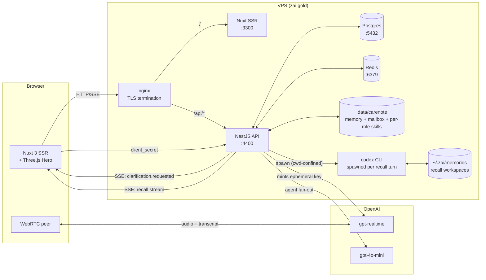
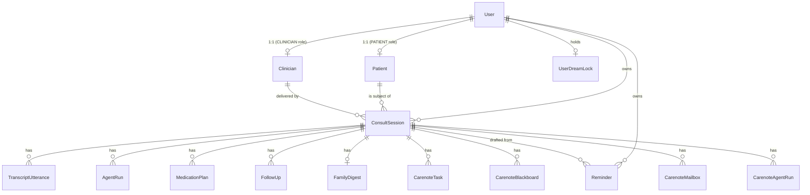
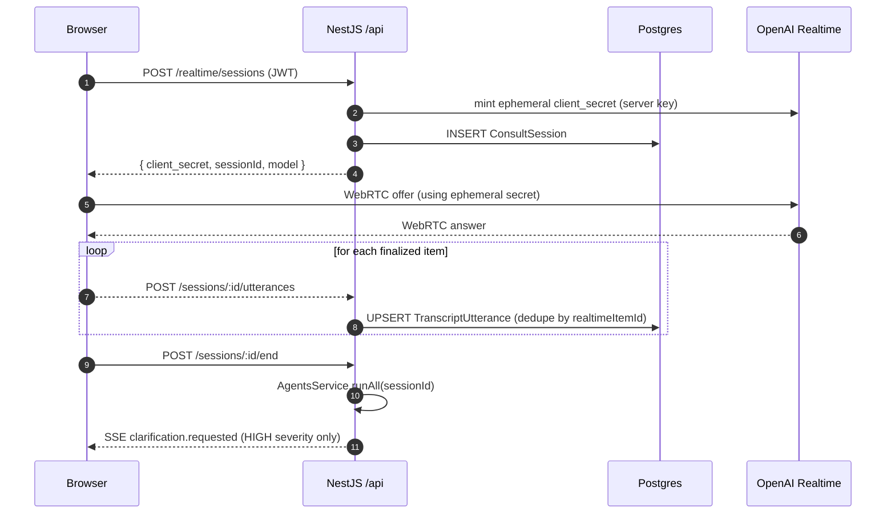
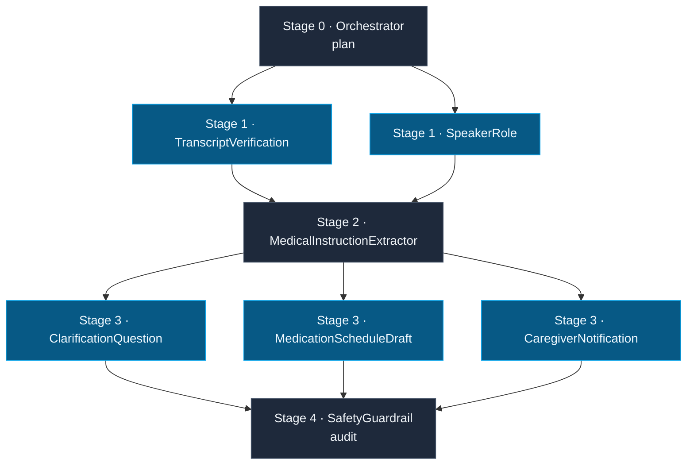
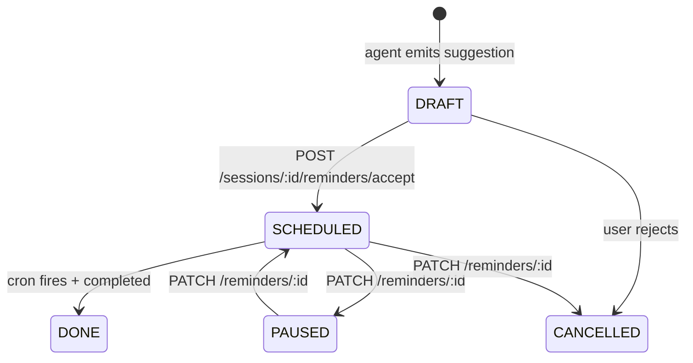
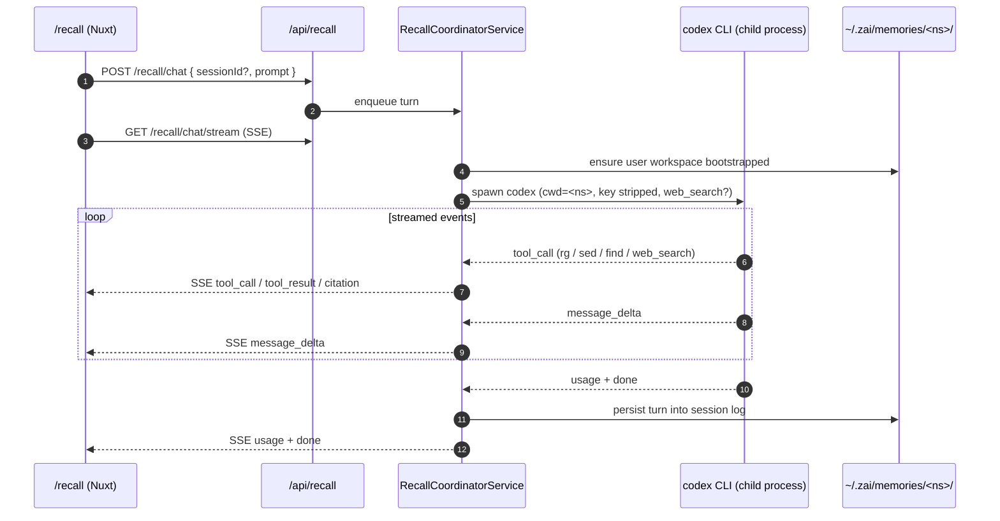

<div align="center">

# 🩺 Clariose — Doctor-Patient Communication Bridge

**Live at [zai.gold](https://zai.gold)** — a real-time consultation transcript service powered by OpenAI `gpt-realtime`, fanned out across an **8-agent persistent care team** that authors medication plans, clarifications, caregiver digests, and (only after explicit user acceptance) reminder schedules. Now bundled with **Recall Codex**: a self-contained conversational-memory subsystem that turns a user's notes and prior chat rollouts into a citable, codex-CLI-driven knowledge surface, with daily two-phase consolidation in the background.

[](https://nestjs.com)
[](https://nuxt.com)
[](https://vuejs.org)
[](https://www.typescriptlang.org)
[](https://www.prisma.io)
[](https://www.postgresql.org)
[](https://redis.io)
[](https://platform.openai.com)
[](https://threejs.org)
[](https://tailwindcss.com)
[](https://pm2.keymetrics.io)
[](https://nginx.org)
[](#-license)

[🚀 Deploy](#-deploy) · [🧠 Architecture](#-architecture) · [📡 Backend Deep Dive](#-backend-deep-dive) · [🧬 Recall Codex](#-recall-codex--conversational-memory-over-your-own-notes) · [🌐 Frontend](#-frontend) · [🔐 API Reference](#-api-reference) · [⚙️ Configuration](#%EF%B8%8F-configuration)

</div>

---

## 📑 Table of Contents

- [✨ What Clariose Is](#-what-clariose-is)
- [🏗️ Architecture](#%EF%B8%8F-architecture)
- [🗂️ Repository Layout](#%EF%B8%8F-repository-layout)
- [🛠️ Tech Stack](#%EF%B8%8F-tech-stack)
- [📡 Backend Deep Dive](#-backend-deep-dive)
  - [Module Map](#module-map)
  - [Domain Model (Prisma)](#domain-model-prisma)
  - [The Realtime Pipeline](#the-realtime-pipeline)
  - [The 8-Agent Carenote Team](#the-8-agent-carenote-team)
  - [Codex Harness — Runtime, Blackboard, Mailbox](#codex-harness--runtime-blackboard-mailbox)
  - [Memory, Recall & Auto-Dream](#memory-recall--auto-dream)
  - [Per-Role Memory & Skills Folders](#per-role-memory--skills-folders)
  - [Reminder Lifecycle](#reminder-lifecycle)
  - [Security Posture](#security-posture)
- [🧬 Recall Codex — Conversational Memory Over Your Own Notes](#-recall-codex--conversational-memory-over-your-own-notes)
- [🌐 Frontend](#-frontend)
- [🔐 API Reference](#-api-reference)
- [🚀 Deploy](#-deploy)
- [✅ Verifying a Deploy Landed](#-verifying-a-deploy-landed)
- [🧪 First-Time VPS Setup](#-first-time-vps-setup)
- [⚙️ Configuration](#%EF%B8%8F-configuration)
- [🧰 CLI Tools](#-cli-tools)
- [🔌 Ports](#-ports)
- [📚 Further Reading](#-further-reading)
- [📝 License](#-license)

---

## ✨ What Clariose Is

Clariose is a **doctor-patient communication bridge**. During a real consultation, the patient's browser opens a [WebRTC](https://webrtc.org) peer connection straight to OpenAI's `gpt-realtime` endpoint and streams microphone audio in. Finalized utterances are mirrored back to our backend, persisted, and fed into a **persistent multi-agent care team** that produces:

| 🎯 Artifact            | 👤 Author Agent                 | 📦 Persisted As            |
| ---------------------- | ------------------------------- | -------------------------- |
| Medication plan        | `medication-schedule-draft`     | `MedicationPlan`           |
| Clarification question | `clarification-question`        | `FollowUp`                 |
| Caregiver digest       | `caregiver-notification`        | `FamilyDigest`             |
| Reminder draft         | `medication-schedule-draft`     | `Reminder` (status=`DRAFT`)|
| Safety audit           | `safety-guardrail`              | `audit.issues` blackboard  |

**Reminders never auto-fire.** They are written as `DRAFT`, surfaced to the user, and only promoted to `SCHEDULED` after the user POSTs to `/sessions/:id/reminders/accept`. Consent is a hard gate, not a setting.

> 💡 **Demo-friendly fallback** — if `OPENAI_API_KEY` is missing, every agent returns deterministic fixtures, so the full UX still works on a laptop with no key. Realtime transcription itself, however, requires a key (returns `503` otherwise).

---

## 🏗️ Architecture



**Key invariants:**

- 🔒 The long-lived `OPENAI_API_KEY` **never leaves the server**. The browser only ever sees ephemeral `client_secret`s minted per session.
- 🚦 The backend binds to `127.0.0.1` only. nginx is the **only** ingress.
- 🧠 The backend holds **in-process state** (consult orchestration, agent-run cache, SSE fan-out). PM2 runs it in `fork` mode with `instances: 1` — **never switch to cluster mode** without first migrating state to Redis/Postgres.
- 💾 The carenote codex-harness uses **the filesystem as a durable bus**: memory `.md` files and JSON inboxes under `.data/carenote/` are the source of truth; the database mirrors them for query-ability.
- 🧬 The **Recall Codex** subsystem is a self-contained add-on that spawns `codex` CLI processes per chat turn against a per-user, cwd-confined memory workspace at `~/.zai/memories/<namespace>/`. It does **not** import from `carenote` — removing the module from `AppModule` cleanly disables the feature with zero side effects on the consult pipeline.

---

## 🗂️ Repository Layout

```text
Zai/
├── backend/                   NestJS 11 + Prisma 6 + Postgres + Redis  (port 4400)
│   ├── src/
│   │   ├── main.ts            Bootstrap — helmet, CORS, ValidationPipe, /api prefix
│   │   ├── app.module.ts      Module wiring + global ThrottlerGuard
│   │   ├── common/            PrismaModule + decorators (CurrentUser, …)
│   │   └── modules/
│   │       ├── auth/          JWT + Passport, /api/auth/{login,register,me}
│   │       ├── realtime/      Mints ephemeral OpenAI Realtime client_secrets
│   │       ├── sessions/      Transcript ingest, agent fan-out, digest, reminders/accept
│   │       ├── reminders/     DRAFT → SCHEDULED → DONE/CANCELLED
│   │       ├── health/        /api/health
│   │       ├── carenote/      ⭐ Codex-harness multi-agent core (see deep dive)
│   │       │   ├── api/                Controllers + CLIs (bootstrap, mock-turn, smoke-role)
│   │       │   ├── codex-harness/      Runtime, registry, run-manager, schema validator
│   │       │   ├── medical/            VisitStateStore, reducers, schemas
│   │       │   ├── prompts/            Realtime + transcription + agent prompt builders
│   │       │   ├── realtime/           Event types, transcript assembler, event bus
│   │       │   ├── recall/             Memory recall, side-query, budget, cache
│   │       │   ├── recap/              Team recap service
│   │       │   ├── runtime/            Role workspace + ALS context
│   │       │   ├── swarm/              Blackboard, mailbox, autoDream, dreamCron
│   │       │   └── teams/<role>/       Per-role persistent memory + skills folders
│   │       │       ├── memory/MEMORY.md
│   │       │       ├── skills/README.md
│   │       │       ├── artifacts/
│   │       │       └── inboxes/
│   │       └── recall-codex/  ⭐ Standalone conversational-memory subsystem (codex CLI)
│   │           ├── recall.module.ts            Self-contained NestJS module — drop-in/drop-out
│   │           ├── recall.cron.ts              03:15 UTC daily — fires Phase-1 sweep
│   │           ├── recall.constants.ts         Tunable knobs (timeouts, idle hours, dry-run, …)
│   │           ├── recallCoordinator.service.ts Per-turn codex CLI spawn, SSE relay
│   │           ├── recallChat.controller.ts    POST /api/recall/chat + SSE /stream
│   │           ├── recallSessions.controller.ts Session list / resume / delete
│   │           ├── recallNotes.controller.ts   Notes CRUD (md / txt / jsonl ≤ 2 MB)
│   │           ├── recallSession.store.ts      File-backed session store
│   │           ├── recallNotes.service.ts      Notes service
│   │           ├── phase1.worker.ts            Per-rollout raw-memory extractor (lease-based)
│   │           ├── phase2.worker.ts            Cross-rollout consolidator (global per-user lock)
│   │           ├── phase2.lock.service.ts      File + DB lock (UserDreamLock-style)
│   │           ├── filesystemBootstrapper.ts   Lays out per-user workspace on first use
│   │           ├── memoryRootResolver.ts       Resolves <MEMORY_ROOT>/<recallNamespace>/
│   │           └── templates/                  AGENTS.md, phase1/phase2 system prompts, read_path
│   └── prisma/schema.prisma   Carenote + recall-codex models — see Domain Model section
│
├── frontend/                  Nuxt 3 + Vue 3 + Tailwind + Three.js SSR  (port 3300)
│   ├── pages/                 index · login · register · dashboard · summary · reminders · carenote/* · recall/*
│   ├── components/            carenote/* · recall/* (TranscriptPane, MessageBlock) · HeroOrb (WebGL) · BrandMark
│   └── composables/           useApi · useAuth · useRealtime · useRealtimeVisit · useCareNote · useTeam · useReveal · useRecallChat · useRecallNotes · useRecallSessions
│
├── team/                      ⭐ Persistent agent team — agent.md + schema.json per role
│   ├── team.json              5-stage DAG manifest
│   ├── orchestrator/          Stage 0 — plan
│   ├── transcript-verification/  Stage 1
│   ├── speaker-role/             Stage 1
│   ├── medical-instruction-extractor/  Stage 2
│   ├── clarification-question/   Stage 3
│   ├── medication-schedule-draft/ Stage 3
│   ├── caregiver-notification/   Stage 3
│   └── safety-guardrail/         Stage 4 — audit
│
├── prompts/codex-agents/      Versioned prompt fragments shared by the harness
├── config/codex-teams/        Team-level config overrides
├── docs/
│   ├── CODEx_HARNESS_README.md
│   ├── pm2-deploy-design.md
│   └── design/                10+ design docs (clariose-v01/v02, carenote PRD, MVP plan, …)
├── scripts/
│   ├── deploy.sh              One-command build → migrate → reload → save
│   └── pm2-auto-reload.cjs    npm postbuild hook — atomic dist swap
├── ecosystem.config.cjs       PM2 process manifest (source of truth)
├── nginx-zai.gold.conf        Site vhost
└── logs/                      PM2 stdout/stderr per app
```

---

## 🛠️ Tech Stack

<table>
<tr>
<td valign="top" width="50%">

### Backend
- **Runtime:** Node.js 22, TypeScript 5.7
- **Framework:** [NestJS 11](https://nestjs.com) (modules, DI, pipes, guards)
- **ORM:** [Prisma 6](https://www.prisma.io) → PostgreSQL 16
- **Cache / queue:** [ioredis](https://github.com/redis/ioredis) + [BullMQ](https://docs.bullmq.io)
- **Auth:** [`@nestjs/jwt`](https://docs.nestjs.com/security/authentication) + [Passport JWT](http://www.passportjs.org/packages/passport-jwt) + [argon2](https://github.com/ranisalt/node-argon2)
- **Validation:** [class-validator](https://github.com/typestack/class-validator) + [Zod](https://zod.dev)
- **Hardening:** [helmet](https://helmetjs.github.io), [@nestjs/throttler](https://docs.nestjs.com/security/rate-limiting)
- **Scheduling:** [@nestjs/schedule](https://docs.nestjs.com/techniques/task-scheduling) + [cron](https://www.npmjs.com/package/cron)
- **AI:** [`openai`](https://github.com/openai/openai-node) v4 — `gpt-realtime` + `gpt-4o-mini` agents
- **File locks:** [proper-lockfile](https://github.com/moxystudio/node-proper-lockfile)

</td>
<td valign="top" width="50%">

### Frontend
- **Framework:** [Nuxt 3](https://nuxt.com) (SSR by default; SPA on `/consult/**`)
- **UI:** [Vue 3](https://vuejs.org) + Composition API
- **Styling:** [Tailwind CSS](https://tailwindcss.com) + [`@nuxtjs/google-fonts`](https://google-fonts.nuxtjs.org)
- **3D / WebGL:** [Three.js](https://threejs.org) (`HeroOrb.client.vue`)
- **Realtime:** Native `RTCPeerConnection` to OpenAI Realtime
- **Markdown:** [marked](https://marked.js.org)
- **Reactivity helpers:** [@vueuse/core](https://vueuse.org)
- **Pretext editor:** [@chenglou/pretext](https://www.npmjs.com/package/@chenglou/pretext)

### Infrastructure
- **Process manager:** [PM2](https://pm2.keymetrics.io) (`fork` mode, `instances: 1`)
- **Reverse proxy:** [nginx](https://nginx.org) — TLS, SSE keep-alive, `/api/` proxy
- **Init:** systemd brings PM2 up at boot via `pm2 startup`

</td>
</tr>
</table>

---

## 📡 Backend Deep Dive

The backend is a single NestJS 11 process bound to `127.0.0.1:4400`, prefixed `/api`, fronted by nginx. It is intentionally a **monolith with internal seams** — the carenote codex-harness is a self-contained subsystem inside the same process.

### Module Map

| Module                        | Purpose                                                                                          | Mount                          |
| ----------------------------- | ------------------------------------------------------------------------------------------------ | ------------------------------ |
| `AuthModule`                  | Email + password (argon2), JWT tokens, `JwtStrategy` for `AuthGuard('jwt')`                      | `/api/auth/*`                  |
| `RealtimeModule`              | `POST /realtime/sessions` mints an OpenAI Realtime `client_secret` **and** creates a `ConsultSession` in one round-trip | `/api/realtime/sessions`       |
| `SessionsModule`              | Transcript ingest, session lifecycle, agent fan-out trigger, digest read, reminder acceptance    | `/api/sessions/*`              |
| `RemindersModule`             | List + patch reminders (`SCHEDULED → PAUSED / DONE / CANCELLED`)                                 | `/api/reminders/*`             |
| `HealthModule`                | Liveness probe                                                                                   | `/api/health`                  |
| `CareNoteModule` ⭐           | Carenote codex-harness — multi-agent visits, blackboard, mailbox, recap, ask-doctor, SSE bus     | `/api/visits/*`, `/api/realtime/session`, `/api/runtime-tasks/*` |
| `RecallCodexModule` ⭐        | Conversational memory over user notes — spawns `codex` CLI per turn, SSE-streamed, with daily Phase-1/2 consolidation cron | `/api/recall/chat/*`, `/api/recall/sessions/*`, `/api/recall/notes/*` |

Global concerns wired in [`backend/src/app.module.ts`](backend/src/app.module.ts) and [`backend/src/main.ts`](backend/src/main.ts):

- 🔒 **`helmet`** on every response (CSP off — Nuxt SSR controls its own headers)
- 🧊 **`ValidationPipe`** with `whitelist`, `transform`, **`forbidNonWhitelisted: true`** — unknown DTO fields are rejected, surfacing accidental client leaks
- 🌍 **CORS** — `https://zai.gold` only in production, `*` only in dev
- 🚦 **Global `ThrottlerGuard`** — 120 req / 60 s baseline, with stricter `@Throttle` on `/auth`
- 📦 **256 KB body cap** — realtime events are tiny; this rejects accidental gigabyte payloads early
- 🌐 **`trust proxy: 'loopback'`** — so `req.ip` and rate-limit keys reflect the real client, not nginx

### Domain Model (Prisma)

Defined in [`backend/prisma/schema.prisma`](backend/prisma/schema.prisma) — 13 models, ~450 lines.



**Identity layer.** `User` + role enum (`PATIENT | CLINICIAN | CARETAKER | ADMIN`) + optional `Patient` / `Clinician` profiles. argon2 password hashes. `lastLoginAt` and `lastDreamedAt` are first-class.

**Session & transcript.** `ConsultSession` is the central object — also repurposed as the carenote **Visit** (we kept the table name to avoid a destructive migration). It carries:
- realtime metadata (`realtimeModel`, `realtimeId`)
- counters (`utteranceCount`, `reminderCount`)
- a cached `summaryMd` filled by the family-digest agent
- a serialized `visitState` JSON blob (matches `medical/medicalSchemas.ts:VisitStateSchema`) — read whole on cold start so a PM2 reload sees the same state the harness was building in-memory
- `consentRecorded`, `rawAudioSaved`, `language` for compliance bookkeeping

`TranscriptUtterance` is one row per finalized realtime item, deduped by the unique `(sessionId, realtimeItemId)` pair so reconnects don't double-insert.

**Agent telemetry.** `AgentRun` records every invocation: `kind` enum (`REVIEWER | MEDICATION | RISK | FAMILY | REMINDER | ORCHESTRATOR | TRANSCRIPT_VERIFICATION | SPEAKER_ROLE`), stable `agentId` for the team-folder agent, DAG `stage` (0–4), `prompt`, `output` JSON, token counts, `latencyMs`, status.

**Structured artifacts.** Typed tables — `MedicationPlan`, `FollowUp` (with `severity` enum), `FamilyDigest` (1:1, with markdown summary + `watchFor` / `doTonight` / `followUps` JSON arrays), `Reminder` — so dashboards don't need to grep JSON.

**Carenote swarm tables.**
- `CarenoteTask` — durable shared work units (Layer 2 of the 4-layer comm model). Roles **don't message each other** for "go do X"; they create a Task and the run-manager dispatches. The Task object **is** the cooperation bus.
- `CarenoteBlackboard` — versioned KV per visit. Every role can read; writes are attributed for audit. Subscribers declare key interest at registration; writes emit `blackboard_updated` events that trigger on-demand re-runs.
- `CarenoteMailbox` — DB mirror of the file-backed inboxes at `.data/carenote/teams/<visit>/inboxes/<role>.json`. The file is source-of-truth; this table exists so the SSE bus and the UI can query unread counts without parsing files.
- `CarenoteAgentRun` — per-codex-run telemetry; `visitId` is `null` for cross-visit auto-dream consolidation runs.
- `UserDreamLock` — single-row-per-user lock preventing two consolidation workers running at once. The file lock at `.data/carenote/memory/users/<u>/.consolidation.lock` is the authoritative cross-process guard; this row exists so ops can see who's consolidating without grepping disk.

**Audit.** `AuditLog` — `(userId, action, resource, resourceId, detail JSON, ip)` with two indices for read patterns.

### The Realtime Pipeline

The core trick: **the long-lived API key never leaves the server.**



Files of interest:
- [`modules/realtime/realtime.service.ts`](backend/src/modules/realtime/realtime.service.ts) — server-side ephemeral key minting
- [`modules/carenote/realtime/applyRealtimeEvent.ts`](backend/src/modules/carenote/realtime/applyRealtimeEvent.ts) — reduces realtime events into VisitState
- [`modules/carenote/realtime/transcriptAssembler.ts`](backend/src/modules/carenote/realtime/transcriptAssembler.ts) — turns delta events into stable utterances
- [`modules/carenote/realtime/transcriptEventBus.ts`](backend/src/modules/carenote/realtime/transcriptEventBus.ts) — in-process pub/sub → SSE
- [`composables/useRealtime.ts`](frontend/composables/useRealtime.ts) on the browser side

### The 8-Agent Carenote Team

Defined declaratively in [`team/team.json`](team/team.json) — the run-manager loads the folder at boot and follows the DAG.



Each agent is a **folder** under `team/<id>/`:
- `agent.md` — persona / system prompt
- `schema.json` — JSON Schema the model **must** match (validated in [`codex-harness/codexSchemaValidator.ts`](backend/src/modules/carenote/codex-harness/codexSchemaValidator.ts))
- `meta.json` — model, temperature, retry policy, blackboard subscriptions

**Blackboard contract** (versioned KV per visit):

| Key                              | Producer                          | Consumers              |
| -------------------------------- | --------------------------------- | ---------------------- |
| `orchestrator.plan`              | Orchestrator                      | All stages 1–3         |
| `transcript.raw`                 | Runner (seeded from `TranscriptUtterance`) | Verifier, SpeakerRole |
| `transcript.verified` / `.lowConfidence` | TranscriptVerification    | Extractor              |
| `speakers.assignments`           | SpeakerRole *(also persists back to `transcript_utterances.speaker`)* | Extractor |
| `instructions.medications` / `.procedures` / `.lifestyle` | MedicalInstructionExtractor | Stage 3 trio |
| `questions.clarifications`       | ClarificationQuestion             | Realtime UI, Guardrail |
| `schedule.reminders`             | MedicationScheduleDraft           | Reminders module, Guardrail |
| `caregiver.digest`               | CaregiverNotification             | Guardrail              |
| `audit.issues`                   | SafetyGuardrail                   | UI                     |

**Realtime follow-up.** When `ClarificationQuestion` emits a `severity: HIGH` question, the runner emits an SSE event `clarification.requested`. The consult page listens on that channel and injects a `response.create` message **into the active gpt-realtime data channel** so the model can ask the doctor *in the room*. Patient and family decide whether to relay — nothing is auto-sent.

### Codex Harness — Runtime, Blackboard, Mailbox

The carenote codex-harness ([`backend/src/modules/carenote/codex-harness/`](backend/src/modules/carenote/codex-harness/)) is a small in-process orchestrator that swaps runtimes via a factory.

| File                            | Responsibility                                                                             |
| ------------------------------- | ------------------------------------------------------------------------------------------ |
| `codexRuntimeFactory.ts`        | Picks the runtime — SDK, CLI, app-server, or **stub** (deterministic for tests/no-key)     |
| `codexSdkRuntime.ts`            | `openai.chat.completions.create` path — strict schema, JSON-mode, retries                  |
| `codexCliRuntime.ts`            | Local `codex` CLI fallback for offline development                                         |
| `codexAppServerRuntime.ts`      | Talks to a sidecar appserver (advanced setup)                                              |
| `stubRuntime.ts`                | Deterministic fixtures — drives the demo without an API key                                |
| `codexAgentRegistry.ts`         | Loads `team/*/agent.md` + `schema.json` + `meta.json` at boot                              |
| `codexAgentTeam.ts`             | DAG materialization — stage ordering, parallelism, retries                                 |
| `codexRunManager.ts`            | The brain: subscribes roles to blackboard keys, fires re-runs on writes, manages threads   |
| `codexJobQueue.ts`              | In-process work queue (per visit) — preserves write-ordering across concurrent role runs   |
| `codexSchemaValidator.ts`       | Strict JSON Schema check — failed outputs go to `json_repair` retries                      |
| `codexOutputParser.ts`          | Robust JSON extraction (handles fenced markdown, leading prose, trailing junk)             |
| `codexPromptAssembler.ts` / `codexPromptLoader.ts` | Builds the actual prompt: persona + schema + memory + blackboard slice    |
| `codexGuardrailReducer.ts`      | Folds Guardrail audit issues into VisitState                                                |
| `codexThreadStore.ts`           | Persists per-role conversation threads for multi-turn visits                                |
| `codexDebugCapture.ts`          | Debug snapshots — every prompt/response/error landed under `.data/carenote/debug/`         |
| `openAiStrictSchema.ts` / `zodToJsonSchemaShim.ts` | Bridges Zod schemas to OpenAI's strict-mode JSON Schema dialect           |

**Swarm primitives** (`carenote/swarm/`):

- [`blackboard.ts`](backend/src/modules/carenote/swarm/blackboard.ts) — versioned KV. Reads are per-key; writes emit events to subscribers. DB-backed via `CarenoteBlackboard`.
- [`mailboxFile.ts`](backend/src/modules/carenote/swarm/mailboxFile.ts) — JSON inboxes on disk (`.data/carenote/teams/<visit>/inboxes/<role>.json`) with `proper-lockfile` siblings. The file is the truth; `CarenoteMailbox` is the queryable mirror.
- [`tasks.ts`](backend/src/modules/carenote/swarm/tasks.ts) — `CarenoteTask` lifecycle (`pending → running → completed | failed | cancelled`). Tasks carry `inputJson`, `outputJson`, and the `blackboardKeys` they wrote — that's the audit trail.
- [`subscriptionRegistry.ts`](backend/src/modules/carenote/swarm/subscriptionRegistry.ts) — at boot, every role declares which blackboard keys it watches. The run-manager uses this to fan out re-runs.
- [`eventBus.ts`](backend/src/modules/carenote/swarm/eventBus.ts) — in-process pub/sub → SSE `/api/visits/:visitId/events`.

The 4-layer comm model (per [`docs/design/clariose-v01-0430.md`](docs/design/clariose-v01-0430.md)): **Layer 1** transcript events → **Layer 2** durable Tasks → **Layer 3** Blackboard (visible state) → **Layer 4** Mailbox (directed messages). Roles never RPC each other directly — every interaction goes through one of the four layers, which makes the whole thing replayable.

### Memory, Recall & Auto-Dream

Located under [`backend/src/modules/carenote/recall/`](backend/src/modules/carenote/recall/) and [`carenote/swarm/autoDream.ts`](backend/src/modules/carenote/swarm/autoDream.ts).

- **`memoryRecall.ts`** + **`memoryScan.ts`** — at the start of each role run, the harness scans `.data/carenote/memory/{visits,users}/<id>/*.md` for relevant memories (recent visits, prior medications, allergies, family preferences).
- **`memorySideQuery.ts`** — when the heuristic scan is ambiguous, a small `gpt-5.4-mini` (or `gpt-4o-mini`) **side-query** ranks candidate memory snippets. Configurable via `CARENOTE_SIDEQUERY_MODEL` and toggleable via `CARENOTE_RECALL_ENABLED`.
- **`recallBudget.ts`** + **`recallCache.ts`** — token-budgeted, per-visit cached so the same memory blob isn't re-read every turn.
- **Auto-dream cron** ([`swarm/dreamCron.ts`](backend/src/modules/carenote/swarm/dreamCron.ts)) — once a day (default 03:00 server time, `CARENOTE_DREAM_HOUR`/`MINUTE`) per user, with a **file lock** (`.consolidation.lock`) and a DB row (`UserDreamLock`) to prevent overlap. It folds the day's visits into a consolidated `MEMORY.md` + `memory_summary.md` for that user. Disabled via `CARENOTE_DREAM_ENABLED=false`.

### Per-Role Memory & Skills Folders

Each carenote role now owns a **persistent on-disk workspace** under `.data/carenote/teams/<role>/`. This lets a role accumulate know-how across visits without polluting any single visit's blackboard, and gives operators a flat-file surface to inspect or edit role behaviour without redeploying.

```text
.data/carenote/teams/<role>/
├── memory/
│   └── MEMORY.md          Long-running notes the role can append to — survives PM2 reload
├── skills/
│   └── README.md          Reusable how-to fragments / playbooks pulled into the role's prompt
├── artifacts/             Structured outputs the role wants to keep (JSON, md, etc.)
└── inboxes/               Per-role JSON inbox (file-locked) — Layer 4 of the comm model
```

The 12 roles currently provisioned: `visit_orchestrator`, `transcript_quality`, `speaker_role`, `medical_instruction_extractor`, `safety_clarification`, `medication_reminder_draft`, `follow_up_task_draft`, `family_summary`, `final_visit_summary`, `compliance_guardrail`, `memory_update`. The harness rehydrates these on boot via `FilesystemBootstrapper`-equivalent logic in [`carenote/api/visitFolder.service.ts`](backend/src/modules/carenote/api/visitFolder.service.ts), so a fresh VPS comes up with the full per-role tree intact.

### Reminder Lifecycle



The `Reminder` table carries a human-readable `cadence` string ("Twice daily after meals") and a resolved `cron` expression (`0 8,20 * * *`). Each reminder also stores `nextFireAt` for an indexed query (`@@index([ownerUserId, status, nextFireAt])`) used by the scheduler. **Nothing fires until the user explicitly accepts.**

### Security Posture

- 🔑 **JWT** — `JWT_SECRET` is enforced at boot in production; the server **refuses to start** with a missing or short (<32 char) secret.
- 🧂 **argon2** for password hashes (memory-hard).
- 🛡️ **`forbidNonWhitelisted` + `whitelist`** ValidationPipe — any field not on the DTO returns 400. This is how we caught a real bug in week 1 (a client posting `user_id` to `/api/visits`).
- 🧱 **`helmet`**, **CORS pinned to `https://zai.gold`** in prod, **256 KB body cap**, **rate-limit** at 120/min globally and stricter on `/auth`.
- 🔐 **Ephemeral OpenAI keys** for browser WebRTC.
- 🧬 **PHI redaction** ([`api/redactPhi.ts`](backend/src/modules/carenote/api/redactPhi.ts)) before any payload that might leave the trust boundary.
- 🗃️ **Audit log** rows for every privileged action.
- 🚷 The backend binds **only to `127.0.0.1`** — there is no public IP path that bypasses nginx.

---

## 🧬 Recall Codex — Conversational Memory Over Your Own Notes

The **Recall Codex** subsystem ([`backend/src/modules/recall-codex/`](backend/src/modules/recall-codex/)) is a self-contained add-on that lets a user converse with their own accumulated memories — uploaded notes, prior chat rollouts, consolidated summaries — through the locally-installed `codex` CLI. It is **deliberately decoupled** from the carenote pipeline: removing it from `AppModule` cleanly disables the feature, and nothing in carenote/realtime/sessions imports anything here. Full design rationale is in [`docs/design/09_codex_memory_recall_design.md`](docs/design/09_codex_memory_recall_design.md).

### How a turn works



### Two-phase background consolidation

A daily cron (`15 3 * * *` UTC, [`recall.cron.ts`](backend/src/modules/recall-codex/recall.cron.ts)) walks every user's idle Codex rollouts and folds them into structured memory:

- **Phase 1 — per-rollout extraction** ([`phase1.worker.ts`](backend/src/modules/recall-codex/phase1.worker.ts)). Picks rollouts that have been idle ≥ 6 hours and are ≤ 30 days old, claims a 5-minute lease, and asks codex to emit a strict JSON object `{ raw_memory, rollout_summary, rollout_slug }`. Up to 16 rollouts per cron firing, 5 retry attempts before a job is marked failed. Mirrors codex source's own `memories.*` defaults so behaviour stays predictable.
- **Phase 2 — cross-rollout consolidation** ([`phase2.worker.ts`](backend/src/modules/recall-codex/phase2.worker.ts)). Behind a **global per-user lock** ([`phase2.lock.service.ts`](backend/src/modules/recall-codex/phase2.lock.service.ts) — file lock is authoritative, DB row is for ops visibility), folds up to 256 stage-1 outputs (excluding any unused for > 30 days) into the user's `MEMORY.md` and `memory_summary.md`. The first two rollout weeks ship in **dry-run mode** (writes to `<root>/.dryrun/` instead of the live workspace) per design doc §9.6, and a baseline directory at `<root>/.baseline/` lets the worker compute workspace diffs.

### Coordinator hardening

The codex CLI runs as an unprivileged child process. Defenses-in-depth, layered:

- 🧱 **`cwd`-confined** to `~/.zai/memories/<recallNamespace>/`. The model has no path into the rest of the FS without escaping its own sandbox.
- 🔑 **`OPENAI_API_KEY` stripped from the spawn env** so the child cannot fall back to direct API calls; auth flows through the user's ChatGPT account by default. Setting `RECALL_CODEX_ALLOW_API_KEY=1` opts back into key-based auth (and unlocks `--model` overrides which would otherwise 400 on ChatGPT-account auth).
- ⏱ **25 → 120s wall-clock cap per turn** (`RECALL_TURN_TIMEOUT_MS`, default 120 s — the original 25 s was killing real prompts that chained `rg`/`sed` reads with a `web_search` round-trip).
- 🔢 **30-call shell cap** per turn, enforced both by codex server-side and reiterated in the read-path system prompt.
- 📜 **Read-only system prompt** ([`templates/`](backend/src/modules/recall-codex/templates/)) — `AGENTS.md`, `phase1System.ts`, `phase2System.ts`, `readPath.ts` — versioned in-tree.
- 💸 **$5/user/day cost cap** (`RECALL_DAILY_CAP_USD`) — refusal happens at the controller, not inside the runtime.
- 🪟 **Optional bwrap-sandbox bypass** — Ubuntu 24.04 gates unprivileged user namespaces by default, which kills codex's bundled bwrap with `loopback: Failed RTM_NEWADDR`. We bypass it (`RECALL_CODEX_BYPASS_SANDBOX=1`) on hosts where bwrap isn't fixable; the cwd-confinement + key-strip + read-only prompt + wall-clock cap make the trade acceptable. Set the var to `0` if you've run `sysctl -w kernel.apparmor_restrict_unprivileged_userns=0`.
- 🌐 **Optional `web_search` tool** — `RECALL_WEB_SEARCH_ENABLED=1` lets the model answer prompts whose answer isn't in the user's notes (e.g., "search the web for X and combine with my notes"). Set to `0` for a fully offline runtime.

### SSE event surface

[`recall.types.ts`](backend/src/modules/recall-codex/recall.types.ts) — the wire contract for `/api/recall/chat/stream`:

| Event             | Payload                                                                        |
| ----------------- | ------------------------------------------------------------------------------ |
| `session_started` | `sessionId`, `codexThreadId`                                                   |
| `message_delta`   | `delta` — token-by-token assistant output                                      |
| `tool_call`       | `command` — every shell call the model issues (`rg`, `sed`, `find`, `web_search`) |
| `tool_result`     | `command`, `exit`, `snippet` — truncated stdout for UI display                 |
| `citation`        | `relPath`, `startLine`, `endLine`, `excerpt` — file:line references the model surfaced |
| `usage`           | `totalTokens`, `cacheHitRate`, `durationMs`                                    |
| `done`            | `messageId` — turn complete                                                    |
| `error`           | `code`, `message` — timeout, cap exceeded, runtime failure                     |

The frontend's `recall/MessageBlock.vue` renders citations inline as collapsible blockquotes; `useRecallChat.ts` is the SSE state machine.

### Notes & sessions

- **Notes** ([`recallNotes.service.ts`](backend/src/modules/recall-codex/recallNotes.service.ts)) — users upload `.md` / `.txt` / `.jsonl` files (≤ 2 MB) that land under their workspace. Notes can be pinned, tagged, grouped into collections, and patched in-place.
- **Sessions** ([`recallSession.store.ts`](backend/src/modules/recall-codex/recallSession.store.ts)) — every chat is a resumable session backed by a Codex rollout file. The frontend can list all sessions (own + global), distinguish active vs. resumable, and resume mid-thread.

---

## 🌐 Frontend

Nuxt 3 SSR by default. The legacy standalone `/consult` subtree has been retired — the live consultation UX is now part of the carenote visit-centric flow at `/carenote/visit/[id]`, which owns mic capture and the WebGL hero scene and is opted out of SSR via `routeRules`.

| Page                   | Purpose                                                       |
| ---------------------- | ------------------------------------------------------------- |
| `index.vue`            | Marketing splash + Three.js hero orb                          |
| `login.vue` / `register.vue` | Auth                                                    |
| `dashboard.vue`        | Sessions list, reminders snapshot                             |
| `summary.vue`          | Post-consult digest, agent outputs, reminder drafts           |
| `reminders.vue`        | Reminder management                                           |
| `carenote/index.vue`   | Visit list                                                    |
| `carenote/visit/[id].vue` | Live visit — mic capture, transcript, multi-agent transparency, ask-doctor |
| `recall/index.vue`     | Conversational memory chat — sessions, notes, SSE-streamed citations |

**Composables:**

- [`useRealtime.ts`](frontend/composables/useRealtime.ts) — drives the WebRTC peer (offer / answer / ICE / data channel)
- [`useRealtimeVisit.ts`](frontend/composables/useRealtimeVisit.ts) — carenote-flavored variant that wires SSE → realtime injection
- [`useApi.ts`](frontend/composables/useApi.ts) / [`useAuth.ts`](frontend/composables/useAuth.ts) — typed fetch wrappers, JWT refresh, `NUXT_PUBLIC_API_BASE`
- [`useCareNote.ts`](frontend/composables/useCareNote.ts) — visit lifecycle, blackboard subscriptions, mailbox
- [`useTeam.ts`](frontend/composables/useTeam.ts) — agent-team progress, stage timing
- [`useReveal.ts`](frontend/composables/useReveal.ts) — staged disclosure animations
- [`useRecallChat.ts`](frontend/composables/useRecallChat.ts) — SSE state machine for the recall chat (deltas, tool calls, citations, usage)
- [`useRecallNotes.ts`](frontend/composables/useRecallNotes.ts) — upload / list / patch notes
- [`useRecallSessions.ts`](frontend/composables/useRecallSessions.ts) — recall session listing, resume, deletion

---

## 🔐 API Reference

All routes are prefixed `/api`. Auth is `Authorization: Bearer <jwt>` unless noted.

### Auth

| Method | Path                  | Description                                      | Auth |
| ------ | --------------------- | ------------------------------------------------ | ---- |
| POST   | `/auth/register`      | Create account (argon2 hashed)                   | ❌   |
| POST   | `/auth/login`         | Email + password → JWT                           | ❌   |
| GET    | `/auth/me`            | Current user                                     | ✅   |

### Realtime

| Method | Path                  | Description                                                      | Auth |
| ------ | --------------------- | ---------------------------------------------------------------- | ---- |
| POST   | `/realtime/sessions`  | Mint ephemeral OpenAI Realtime client_secret + create ConsultSession | ✅   |
| POST   | `/realtime/session`   | (Carenote variant) — visit-aware realtime session                | ✅   |

### Sessions

| Method | Path                                | Description                                       |
| ------ | ----------------------------------- | ------------------------------------------------- |
| GET    | `/sessions`                         | List sessions for current user                    |
| POST   | `/sessions/:id/utterances`          | Append a finalized utterance (idempotent on `realtimeItemId`) |
| POST   | `/sessions/:id/end`                 | End session + trigger agent fan-out               |

### Carenote (Visit-Centric)

| Method | Path                                              | Description                                  |
| ------ | ------------------------------------------------- | -------------------------------------------- |
| POST   | `/visits`                                         | Create visit (alias of ConsultSession)       |
| GET    | `/visits` · `/visits/:id`                         | List / read visits                           |
| DELETE | `/visits/:id`                                     | Soft delete                                  |
| GET    | `/visits/:id/team-activity`                       | Per-stage progress, latency, output summary  |
| POST   | `/visits/:id/team-recap`                          | Force a recap regeneration                   |
| POST   | `/visits/:id/round/end`                           | Close current round (stage trigger)          |
| POST   | `/visits/:id/ask-doctor`                          | Inject a clarification into the realtime channel |
| GET    | `/visits/:id/asks/:askId/audio`                   | TTS rendering of an ask                      |
| GET    | `/visits/:id/recap-image`                         | Generated recap image                        |
| `Sse`  | `/visits/:id/events`                              | Server-Sent Events: blackboard updates, clarifications, agent state |
| POST   | `/visits/:id/realtime-events`                     | Mirror realtime data-channel events server-side |
| POST   | `/visits/:id/stage-summary`                       | Snapshot a stage                             |
| POST   | `/visits/:id/final-summary`                       | Finalize digest                              |
| POST   | `/visits/:id/draft-tasks/:taskId/{confirm,reject}` | Promote / discard suggested tasks           |
| POST   | `/visits/:id/memory-candidates/:cid/{confirm,reject}` | Curate memory before auto-dream consolidates it |
| POST   | `/admin/auto-dream/run`                           | (Admin) Manually trigger auto-dream          |

### Runtime Tasks

| Method | Path                                         | Description                                 |
| ------ | -------------------------------------------- | ------------------------------------------- |
| GET    | `/visits/:id/runtime-tasks`                  | List tasks for a visit                      |
| GET    | `/runtime-tasks/:taskId`                     | Read task                                   |
| GET    | `/runtime-tasks/:taskId/output`              | Stream raw model output                     |
| POST   | `/runtime-tasks/:taskId/messages`            | Inject a message into a running task        |
| POST   | `/runtime-tasks/:taskId/kill`                | Cancel a running task                       |

### Recall Codex

| Method | Path                                  | Description                                                                      |
| ------ | ------------------------------------- | -------------------------------------------------------------------------------- |
| POST   | `/recall/chat`                        | Start (or continue) a recall turn — `{ sessionId?, prompt }`                     |
| POST   | `/recall/chat/abort`                  | Cancel an in-flight turn for a session                                           |
| `Sse`  | `/recall/chat/stream`                 | SSE event stream — `session_started`, `message_delta`, `tool_call`, `tool_result`, `citation`, `usage`, `done`, `error` |
| GET    | `/recall/sessions`                    | List sessions (own + global, with active / resumable flags)                      |
| POST   | `/recall/sessions/new`                | Create a fresh session                                                           |
| POST   | `/recall/sessions/:id/resume`         | Resume an idle session                                                           |
| GET    | `/recall/sessions/:id/messages`       | Fetch the message history for a session                                          |
| DELETE | `/recall/sessions/:id`                | Delete a session                                                                 |
| GET    | `/recall/notes`                       | List notes (slug, title, tags, mtime, pinned, collection)                        |
| POST   | `/recall/notes`                       | Upload one or more notes (`.md` / `.txt` / `.jsonl`, ≤ 2 MB each)                |
| GET    | `/recall/notes/:slug/content`         | Read raw note content                                                            |
| PATCH  | `/recall/notes/:slug`                 | Patch metadata — `pinned`, `collection`, `type`, `tags`, `description`, `title`  |
| DELETE | `/recall/notes/:slug`                 | Delete a note                                                                    |

### Reminders

| Method | Path                | Description                                                 |
| ------ | ------------------- | ----------------------------------------------------------- |
| GET    | `/reminders`        | List for current user                                       |
| PATCH  | `/reminders/:id`    | Update status (`SCHEDULED ↔ PAUSED`, `→ DONE / CANCELLED`)  |

### Health

| Method | Path        | Description     | Auth |
| ------ | ----------- | --------------- | ---- |
| GET    | `/health`   | Liveness probe  | ❌   |

---

## 🚀 Deploy

A successful `npm run build` on either side **is** a deploy: the `postbuild` hook calls [`scripts/pm2-auto-reload.cjs <name>`](scripts/pm2-auto-reload.cjs) which `pm2 reload`s the named app. If `build` fails, the hook never fires and PM2 keeps serving the previous good dist. There is no separate "remember to reload" step.

```bash
scripts/deploy.sh                  # daily — build both sides + prisma migrate deploy + reload + save
scripts/deploy.sh --install        # also runs `npm ci` first
scripts/deploy.sh --backend        # only the API
scripts/deploy.sh --frontend       # only the SSR site
scripts/deploy.sh --no-migrate     # skip `prisma migrate deploy`
```

**Manual fallback (skip the build entirely):**

```bash
pm2 startOrReload /home/ubuntu/Zai/ecosystem.config.cjs --update-env && pm2 save
```

> 📖 The full reasoning behind the build-as-deploy model — including why the postbuild hook is the right level of abstraction — lives in [`docs/pm2-deploy-design.md`](docs/pm2-deploy-design.md).

### How the "no stale dist in production" guarantee works

1. `scripts/deploy.sh` (or a manual `npm run build`) compiles the source.
2. npm runs the `postbuild` hook automatically.
3. `postbuild` invokes `scripts/pm2-auto-reload.cjs <app-name>`.
4. The helper:
   - skips silently if PM2 isn't on `PATH`,
   - skips silently if the named app isn't registered yet,
   - otherwise runs `pm2 reload <app-name> --update-env` (or `restart` if the app was stopped/errored).
5. The deploy script ends with `pm2 startOrReload ecosystem.config.cjs --update-env && pm2 save` — covers first-time bootstrap and persists state to `~/.pm2/dump.pm2`.

If `npm run build` exits non-zero, the postbuild hook never fires and PM2 keeps serving the previous good build. The failure mode is always *"old build keeps running"*, never *"half new, half old"*.

---

## ✅ Verifying a Deploy Landed

```bash
pm2 list | grep clariose-
ss -ltnp | grep -E ':(3300|4400)'
pm2 logs clariose-backend --lines 30 --nostream | grep -E 'Nest application|listening'
test -s ~/.pm2/dump.pm2 && echo "pm2 save: ok" || echo "pm2 save: MISSING"
curl -i https://zai.gold/api/health
```

---

## 🧪 First-Time VPS Setup

```bash
# 1. Drop secrets in
cp backend/.env.example backend/.env
chmod 600 backend/.env
$EDITOR backend/.env  # set DATABASE_URL, JWT_SECRET, OPENAI_API_KEY

# 2. Create the Postgres database
PGPASSWORD=… psql -h 127.0.0.1 -U zai -d postgres \
  -c "CREATE DATABASE clariose OWNER zai;"

# 3. Install global PM2 if missing
command -v pm2 || npm i -g pm2

# 4. First deploy — installs deps, migrates schema, builds, registers PM2 apps
scripts/deploy.sh --install

# 5. Make PM2 survive reboots
pm2 save
pm2 startup systemd -u ubuntu --hp /home/ubuntu  # then run the sudo line it prints

# 6. Wire up nginx
sudo cp nginx-zai.gold.conf /etc/nginx/sites-available/zai.gold
sudo ln -sf /etc/nginx/sites-available/zai.gold /etc/nginx/sites-enabled/zai.gold
sudo nginx -t && sudo systemctl reload nginx

# 7. Smoke test
curl -i https://zai.gold/api/health
```

---

## ⚙️ Configuration

`backend/.env` (chmod 600 — copy from `.env.example`):

| Variable                       | Purpose                                                                            | Default                             |
| ------------------------------ | ---------------------------------------------------------------------------------- | ----------------------------------- |
| `DATABASE_URL`                 | Postgres connection string                                                         | —                                   |
| `REDIS_URL`                    | Redis connection string                                                            | `redis://127.0.0.1:6379`            |
| `JWT_SECRET`                   | ≥32 chars in prod — `openssl rand -hex 48`                                         | —                                   |
| `OPENAI_API_KEY`               | If empty, agents fall back to fixtures and `/realtime/sessions` returns 503        | —                                   |
| `OPENAI_REALTIME_MODEL`        | Realtime model id                                                                  | `gpt-realtime`                      |
| `OPENAI_AGENT_MODEL`           | Agent fan-out model                                                                | `gpt-4o-mini`                       |
| `CARENOTE_SIDEQUERY_MODEL`     | Recall side-query ranker                                                           | `gpt-5.4-mini-2026-03-17`           |
| `CARENOTE_RECALL_ENABLED`      | Toggle memory recall                                                               | `true`                              |
| `CARENOTE_MEMORY_ROOT`         | Filesystem root for memory `.md` files                                             | `/home/ubuntu/Zai/.data/carenote/memory` |
| `CARENOTE_TEAMS_ROOT`          | Filesystem root for mailbox inboxes                                                | `/home/ubuntu/Zai/.data/carenote/teams`  |
| `CARENOTE_DREAM_ENABLED`       | Daily auto-consolidation                                                           | `true`                              |
| `CARENOTE_DREAM_HOUR` / `_MINUTE` | When to run auto-dream (server time)                                            | `3` / `0`                           |
| `RECALL_MEMORY_ROOT`           | Filesystem root for recall-codex per-user workspaces                               | `~/.zai/memories`                   |
| `RECALL_CODEX_BYPASS_SANDBOX`  | Bypass codex's bundled bwrap (Ubuntu 24.04 unprivileged userns gate)               | `1`                                 |
| `RECALL_CODEX_ALLOW_API_KEY`   | Allow `OPENAI_API_KEY` in the codex spawn env (unlocks `--model` overrides)        | `0`                                 |
| `RECALL_TURN_TIMEOUT_MS`       | Wall-clock cap per recall turn                                                     | `120000`                            |
| `RECALL_WEB_SEARCH_ENABLED`    | Enable codex's native `web_search` tool                                            | `1`                                 |
| `RECALL_COORDINATOR_MODEL` / `RECALL_PHASE1_MODEL` / `RECALL_PHASE2_MODEL` | Optional model overrides — only respected when `ALLOW_API_KEY=1` | `""` (codex picks)                  |
| `APP_PORT`                     | NestJS bind port                                                                   | `4400`                              |
| `APP_BASE_URL`                 | Used for CORS and absolute links                                                   | `https://zai.gold`                  |
| `NODE_ENV`                     | `development` \| `production`                                                      | `production`                        |

**Frontend** has no `.env` — production env vars live in [`ecosystem.config.cjs`](ecosystem.config.cjs) (`NUXT_PUBLIC_API_BASE=/api`, `NUXT_PUBLIC_SITE_URL=https://zai.gold`, `PORT=3300`).

> ⚠️ After editing `backend/.env`, run `pm2 reload clariose-backend --update-env` manually — env edits don't auto-reload.

---

## 🧰 CLI Tools

Backend ships with several `ts-node` CLIs for testing the agent harness without booting the full server:

```bash
cd backend
npm run carenote:codex:health        # ping the harness
npm run carenote:codex:bootstrap     # load the team folder, validate schemas
npm run carenote:codex:mock-turn     # run one mock turn end-to-end
npm run carenote:codex:smoke-role    # smoke-test a single role
npm run carenote:smoke:replay-transcript  # replay a saved transcript through the team
npm run carenote:test                # jest carenote/* only
```

---

## 🔌 Ports

| Service          | Port | Notes                                          |
| ---------------- | ---- | ---------------------------------------------- |
| `clariose-backend`  | 4400 | NestJS, behind nginx `/api/`, `127.0.0.1` only |
| `clariose-frontend` | 3300 | Nuxt 3 SSR, behind nginx `/`, `127.0.0.1` only |
| Postgres         | 5432 | Database `clariose`, role `zai`                   |
| Redis            | 6379 | Shared with neighbours; safe for this app      |

---

## 📚 Further Reading

In-tree design docs (mostly in [`docs/design/`](docs/design)):

- [`00_repository_discovery_report.md`](docs/design/00_repository_discovery_report.md)
- [`01_carenote_product_requirements.md`](docs/design/01_carenote_product_requirements.md)
- [`02_realtime_transcript_pipeline.md`](docs/design/02_realtime_transcript_pipeline.md)
- [`03_codex_only_harness_architecture.md`](docs/design/03_codex_only_harness_architecture.md)
- [`04_persistent_agent_team_design.md`](docs/design/04_persistent_agent_team_design.md)
- [`05_medical_safety_and_privacy.md`](docs/design/05_medical_safety_and_privacy.md)
- [`06_migration_from_claude_harness_to_codex_harness.md`](docs/design/06_migration_from_claude_harness_to_codex_harness.md)
- [`07_mvp_implementation_plan.md`](docs/design/07_mvp_implementation_plan.md)
- [`08_testing_and_eval_plan.md`](docs/design/08_testing_and_eval_plan.md)
- [`09_codex_memory_recall_design.md`](docs/design/09_codex_memory_recall_design.md) — recall-codex Phase-1/2 design, sandbox trade-offs, dry-run rollout
- [`dev-design.md`](docs/design/dev-design.md) — dev/prod isolation notes
- [`clariose-v01-0430.md`](docs/design/clariose-v01-0430.md) · [`clariose-v02-0430.md`](docs/design/clariose-v02-0430.md)
- [`pm2-deploy-design.md`](docs/pm2-deploy-design.md) — why the deploy pipeline is shaped the way it is
- [`CODEx_HARNESS_README.md`](docs/CODEx_HARNESS_README.md) — codex harness overview

---

## 📝 License

Proprietary — © 2026 Clariose / zai.gold. All rights reserved. This repository is shared for review and is not licensed for redistribution or commercial use without written permission.

<div align="center">

Built with ❤️ for clearer conversations between doctors, patients, and the people who love them.

</div>
