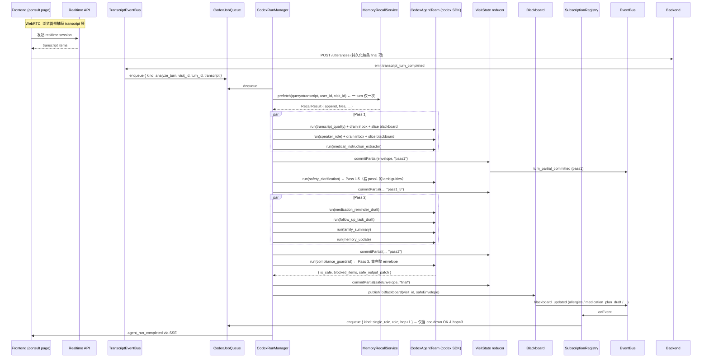

# QA01 — 多 Agent 通信架构 / 数据目录布局 全解

> 范围：本文回答下列五个问题，全部以 `backend/src/modules/carenote/` 实际实现为准（截至 `main` 分支 commit `db14adc`）。
>
> 1. `~/Zai/.data/carenote/memory/users/cmok2cbpn0000rkiarii0yhaf/skills/` 为什么会出现一个 `skills`？这个 ID 是 session 还是别的？
> 2. 仓库根的 `~/Zai/team/` 这一套（kebab-case 的 `medical-instruction-extractor/` 等）是不是已经过时不再使用？
> 3. 当前的多 agent 通信到底是怎么实现的？task-centric 又是怎么实现的？
> 4. 为什么前端「Team conversation → Messages between helpers」永远是 `0`？
> 5. 我需要一份贯穿全流程、带流程图、能对得上代码的彻底解释。

---

## 0. TL;DR — 一句话定位每个问号

| 问题 | 答案 |
| --- | --- |
| `cmok2cbpn0000rkiarii0yhaf` 是什么？ | **User.id**（Prisma cuid，邮箱 `helioswen@163.com`），不是 session/visit。 |
| 为什么用户目录里会有 `skills/`？ | 那是 **auto-dream 每日记忆固化** 留给「per-user 任务备忘」的目标位置。空 = 当天 LLM patch 没产出 `skills[]`。 |
| `~/Zai/team/` 还用吗？ | **不用。** 全后端代码里没有任何一处引用它。真正生效的是 `~/Zai/.data/carenote/teams/<role>/`。`~/Zai/team/` 是早期 v1 设计稿的化石，可以删。 |
| 多 agent 通信是怎么搭的？ | 4 层：**Tasks (L1)** + **Mailbox (L2)** + **Blackboard (L3)** + **EventBus (L4)**；编排器 `CodexRunManager` 按 4-pass DAG 调度 11 个 codex 角色，三种 job 类型 (`analyze_turn` / `single_role` / `stage_summary`)。 |
| Messages between helpers 为什么 0？ | **当前生产代码里没有任何角色调用 `mailbox.send()`** —— mailbox 通道做好了（写/读/锁/事件全齐），但所有跨 agent 协作目前都走 **blackboard**。所以 inbox 文件里始终是 `[]`，UI 自然显示 0。 |

---

## 1. 数据目录布局 — 一张全景图

```
~/Zai/                                 # 仓库 (代码 + 静态资产)
├── prompts/codex-agents/<role>.md     # 角色 system prompt 唯一真实源 (snake_case)
├── team/                              # ☠️ 化石 v1，不再被引用 — 见 §2
└── .data/carenote/                    # 运行时状态根 ($CARENOTE_*ROOT)
    ├── codex-agent-team-state.json    # 11 个角色的 Codex thread_id / 版本游标
    │
    ├── teams/<role>/                  # ✅ Per-Role workspace (Qzone 风格隔离)
    │   ├── CLAUDE.md                  #   role 的 persona seed
    │   ├── memory/MEMORY.md           #   该 role 跨 visit 的私有长期记忆
    │   ├── artifacts/                 #   role 写出的成品文件
    │   ├── skills/                    #   只该 role 看得见的 SKILL.md
    │   └── inboxes/<visitId>.json     #   ⭐ Mailbox 文件源 (per-visit 一文件)
    │
    ├── visits/<visitId>/              # ✅ Per-Visit workspace
    │   ├── visit.json
    │   └── round-NNN/                 #   一次 pause 关一个 round
    │       ├── transcripts.json
    │       ├── agent-state.json
    │       ├── asks.json
    │       └── recap.json (开了 recap 才有)
    │
    ├── memory/users/<userId>/         # ✅ Per-User 长期记忆 (auto-dream 输出)
    │   ├── MEMORY.md                  #   index
    │   ├── memory_summary.md          #   跨 visit 总结
    │   ├── allergies.md / conditions.md  # 规范化 facts
    │   ├── rollout_summaries/<vid>.md #   一次 visit 一份 rollup
    │   └── skills/<name>.md           #   ⭐ §1 的问题 — 见下文
    │
    ├── recaps/                        # 暂存 recap 图片
    └── debug/                         # codex 原始 IO 抓取
```

### 1.1 `cmok2cbpn0000rkiarii0yhaf` 是 User，不是 session

刚才用 prisma 查了一下：

```text
{ id: 'cmok2cbpn0000rkiarii0yhaf',
  email: 'helioswen@163.com',
  createdAt: 2026-04-29T13:00:43.980Z,
  lastDreamedAt: 2026-04-30T03:00:01.868Z }
```

可见 `lastDreamedAt = 2026-04-30 03:00`，正好是上一次 **auto-dream cron** 跑过这个 user 的时间。即 `memory/users/<userId>/` 这个目录是 auto-dream 在那一刻创建出来准备落盘的。

### 1.2 那个 `skills/` 是干嘛的，为什么是空的

代码里写得很清楚（`backend/src/modules/carenote/swarm/autoDream.ts:35-42`）：

```ts
type DreamPatch = {
  memory_summary?: string;
  rollout_summaries?: Array<{ visit_id: string; markdown: string }>;
  skills?: Array<{ name: string; markdown: string }>;
  allergies?: string[] | null;
  conditions?: string[] | null;
};
```

每天一次的 `runDailyConsolidation()` 用 OpenAI Chat 把当天 ENDED 的 visits 汇总成一个 `DreamPatch`，**`skills[]` 就是 LLM 自己挑出来该长期保存的「跨 visit 任务备忘 / 操作要点」**——例如「这个用户每次都问 X 类型的问题，下回 family_summary 要主动写 Y」。落盘路径：

```
.data/carenote/memory/users/<userId>/skills/<name>.md
```

> 注意区分 — 这里的 `skills/` 跟 `~/Zai/.data/carenote/teams/<role>/skills/` **不是一个东西**：
> - `users/<u>/skills/` = 这位用户私有的备忘（auto-dream 写）
> - `teams/<role>/skills/` = 这个角色私有的本领（RoleWorkspaceService 初始化时建空目录）
>
> 同名不同义，只是都借用了 Codex 的 `SKILL.md` 命名习惯。

**为什么是空的**：第一次 dream pass 跑过来给你建好了目录骨架（`MEMORY.md` 写了「auto-generated by carenote auto-dream」），但当天 LLM 返回的 patch 里没有任何 `skills` 条目（很正常——只有 1 天数据，模型还没什么可沉淀的），所以目录被建出来但没文件。`rollout_summaries/` 也一样空。等用户多用几天，dream 才会塞东西进来。

**关键定位**：
- 创建逻辑 — `autoDream.ts:apply()` 里 `mkdir users/<u>/skills`、`writeFile users/<u>/skills/<name>.md`。
- 跑批入口 — `dreamCron.ts`（cron）+ `POST /api/admin/auto-dream/run`（管理员手动）。
- 召回链路 — `MemoryScanService` 扫到这些文件（`recall.constants.ts:32`），由 `MemorySideQueryService` 让小模型挑相关的，再注入到 codex 角色的 `extra_instructions`（见 §3.4）。

---

## 2. `~/Zai/team/` — 已废弃，可以删

```
~/Zai/team/
├── README.md                # 描述 8-agent v1 DAG（kebab-case）
├── team.json                # v1 manifest
├── orchestrator/
├── transcript-verification/
├── speaker-role/
├── medical-instruction-extractor/
├── clarification-question/
├── medication-schedule-draft/
├── caregiver-notification/
└── safety-guardrail/
```

**佐证它是死代码**：

```bash
$ grep -rn "team/team.json\|/home/ubuntu/Zai/team\b" backend/src/
# (空)
$ grep -rn "team/[a-z-]*"                          backend/src/
# (空)
```

后端 0 处引用。真正在用的：

| v1（化石） | v3（实际生效） |
| --- | --- |
| `~/Zai/team/medical-instruction-extractor/` | `~/Zai/.data/carenote/teams/medical_instruction_extractor/` |
| 8 个 agent，kebab-case | 11 个 role，snake_case，与 `CodexAgentRole` 枚举一一对应 |
| `team.json` DAG | 编排逻辑硬编码在 `codexRunManager.ts:analyzeTurn` 里 |
| `<id>/agent.md` + `<id>/schema.json` | prompt 在 `prompts/codex-agents/<role>.md`，schema 在 `medical/medicalSchemas.ts` |

**结论**：`~/Zai/team/` 完全可以删除（最好留一行 commit message 说明），不会影响运行。它确实是「在 .data 持久化之前的设计稿，已经被 .data/carenote/teams 取代」。

---

## 3. 多 Agent 通信全流程

### 3.1 角色清单（11 个 Codex Role，永久持有 thread）

```
visit_orchestrator                 — Maestro Cen   (不进 11-role pipeline，只在 single_role/recap 里用)
transcript_quality                 — Scribe Lin
speaker_role                       — Scribe Lin
medical_instruction_extractor      — Scout Ada
safety_clarification               — Curious Mei
medication_reminder_draft          — Dr. Apo
follow_up_task_draft               — Planner Yuki
family_summary                     — Postie Ren
memory_update                      — Keeper Sage
compliance_guardrail               — Nurse Iris
final_visit_summary                — Auntie Rosa
```

每个 role：
- 自己的 codex thread（`codex-agent-team-state.json` 里 thread_id 持久化）
- 自己的 prompt（`prompts/codex-agents/<role>.md`，注入 `team.run` 的 `instructions`）
- 自己的 `RoleWorkspace`（`teams/<role>/`，独立 memory/inbox/skills）
- 自己的 Zod 输出 schema（`RoleOutputSchemas[role]`，强校验，失败走一次 repair）

### 3.2 4 层通信架构（CCLearn note 4 的港式翻译）

```
┌──────────────────────────────────────────────────────────────────┐
│ Layer 1 — TASKS                  (in-memory, ALS)               │
│   RuntimeTask 树 + AsyncLocalStorage 背包 (AgentContext /         │
│   TeammateContext / WorkloadContext) 把 visitId/role/parent      │
│   "无侵入"地传递给所有下游层。                                      │
│   tasks.service.ts / runtime/als/                                │
├──────────────────────────────────────────────────────────────────┤
│ Layer 2 — MAILBOX                (file = SoT, DB mirror)        │
│   teams/<role>/inboxes/<visitId>.json + proper-lockfile          │
│   send/drainUnread；DB 镜像 CarenoteMailbox；事件 mailbox_message │
│   mailboxFile.ts / mailboxService.ts                             │
├──────────────────────────────────────────────────────────────────┤
│ Layer 3 — BLACKBOARD             (DB only)                      │
│   carenote_blackboard (visitId, key) UNIQUE，原子 version++       │
│   write/read/readMany/snapshot；事件 blackboard_updated          │
│   blackboard.ts                                                  │
├──────────────────────────────────────────────────────────────────┤
│ Layer 4 — EVENT BUS              (RxJS Subject)                 │
│   in-process 单 Subject。订阅者：SSE 控制器、SubscriptionRegistry │
│   (按订阅触发 single_role 重跑)、permission bridge。              │
│   eventBus.ts / subscriptionRegistry.ts                          │
└──────────────────────────────────────────────────────────────────┘
```

> 设计原则在 `codexRunManager.ts:7-13` 和 `subscriptionRegistry.ts:7-16` 写得很直白：
> **没有任何 agent 轮询另一个 agent；所有跨 role 协作 100% event-driven**。

### 3.3 Task-centric 是怎么实现的（Layer-1 细节）

「task-centric」的字面含义就是 **每一次 codex 调用都先包成一个 RuntimeTask 节点**，然后把所有上下文（visitId / role / parent / abortController / 工作负载分类）通过 **AsyncLocalStorage**（`runtime/als/`）注入进异步调用栈，下游 mailbox / blackboard / eventBus / recall 直接 `agentCtx.current()` 取值，不再靠参数透传。

层级树（一个 turn 触发的实际形状）：

```
analyze_turn (parent task, kind="analyze_turn")
├── role_run transcript_quality            ┐
├── role_run speaker_role                  ├ Pass 1 (Promise.all)
├── role_run medical_instruction_extractor ┘
├── role_run safety_clarification              Pass 1.5
├── role_run medication_reminder_draft     ┐
├── role_run follow_up_task_draft          ├ Pass 2 (Promise.all)
├── role_run family_summary                │
├── role_run memory_update                 ┘
└── role_run compliance_guardrail              Pass 3 (audit)
```

实现锚点：
- `withParentTask` (`codexRunManager.ts:792`) — 顶层 wrap，开 AgentContext + TeammateContext。
- `withChildTask` (`codexRunManager.ts:855`) — 每个 role 开子任务，继承父的 traceId / ownerUserId / parentTaskId。
- `tasks.service.ts:register/complete/fail` — 维护 in-memory 任务表 + 发 `runtime_task` 事件。
- 任务 abortController 是「per-task，turn 边界轮换」的，单个 role 卡死可 kill，不会带翻整个 turn。

### 3.4 编排主循环 — `analyze_turn` 一次的全图



**几个关键决策**：

1. **partial commit**：每 pass 完都把当前 envelope reduce 进 VisitState，前端面板渐进式填充，不用等完整 9 个 role 跑完才一次性弹出。`commitPartial` 会先用 `removeTurnContributions` 把"这一 turn 之前已经 reduce 过的"剥掉，避免重复。
2. **guardrail 一定最后**：`applyGuardrail` 用 `safe_output_patch` 替换不安全条目，结果通过 `commitPartial(... "final")` 最终落到 VisitState，**partial 阶段写入的不安全内容会被这一步覆盖**。
3. **单 turn 内 recall 只跑一次**：所有 role 共享同一个 `RecallResult.append`，这是 §6 prompt 组装的「per-turn user-message side」。

### 3.5 三种 Job 类型（`codexRunManager.process`）

| Job kind | 触发源 | 处理方法 | 用途 |
| --- | --- | --- | --- |
| `analyze_turn` | TranscriptEventBus → bus.on() | `analyzeTurn(job)` | 一次 final transcript turn → 整个 9-role pipeline + guardrail |
| `single_role` | SubscriptionRegistry.fire() | `runOneRoleOnDemand(job)` | blackboard/mailbox 触发的某个 role 重跑（hop ≤ 3，cooldown 2s） |
| `stage_summary` / `final_summary` | controller (`/round/end` / `/end`) | `summarise(job)` | 调 `final_visit_summary` 一个 role，输出阶段/最终摘要 |

**同一 visit_id 串行**：`CodexJobQueue` 按 visit 串行（设计上避免 thread 状态冲突），跨 visit 并行。

### 3.6 一次 `runRole` 内部到底做了什么

`codexRunManager.runRoleInner()` 折叠后：

```text
0. withChildTask 开 RuntimeTask + AgentContext
1. mailbox.drainUnread(visit, role)       → Layer-2 收件箱
2. blackboard.readMany(visit, [...keys])  → Layer-3 切片（只看 subscribedKeys）
3. assembleCodexPrompt({                  → §6 动态模板
     visitState, event,
     recall,           // append 进 system instructions
     inbox,            // <inbox> 块
     blackboard,       // <blackboard> 块
     userMessage 输出
   })
4. roleWorkspace.loadMemoryForPrompt(role)   →  teams/<role>/memory/MEMORY.md
   把 role 私有 memory 拼到 extra_instructions 末尾
5. team.run(role, {                       → 走 CodexAgentTeam.run
     instructions: registry prompt,
     extra_instructions: recall.append + role MEMORY.md,
     pre_built_user_message: userMessage,
     expected_output_schema: zodToJsonSchema(...)
   })
   └── codex SDK / CLI 复用 thread_id（首次 null，回填后落盘 codex-agent-team-state.json）
6. validateAndMaybeRepair():
   - parseCodexJson → 失败给一次 json_repair 二跑
   - validateRoleOutput (Zod 强校验)
7. recordAgentRun  → DB CarenoteAgentRun（前端 team-activity 拉的就是这张表）
8. EventBus.emit(agent_run_started/completed)
9. tasks.complete(taskId)
```

> Mailbox 是「读」的链路是工作的，且 `runOneRoleOnDemand` 也走同一条 `runRole`。一切都已就位，只差有人 `mailbox.send()`（见 §4）。

### 3.7 Subscription / Cooldown / Hop — 防死循环

```mermaid
graph LR
    BB[Blackboard write] -->|emit blackboard_updated| EB[EventBus]
    Mail[Mailbox send]   -->|emit mailbox_message|     EB
    EB --> Sub[SubscriptionRegistry.onEvent]
    Sub -->|匹配 onBlackboardKeys / onMailboxFromAnyone| Gate{cooldown<br/>< 2s ?}
    Gate -- yes --> Drop[skip]
    Gate -- no --> Hop{hop ≥ 3 ?}
    Hop -- yes --> Brk[cycle_breaker_engaged]
    Hop -- no --> Q[enqueue single_role hop+1]
    Q --> Mgr[CodexRunManager.runOneRoleOnDemand]
    Mgr --> BB
```

默认订阅（`subscriptionRegistry.ts:78` `registerDefaultsFor`）：

| Role | 订阅 blackboard keys | 订阅 mailbox |
| --- | --- | --- |
| `medication_reminder_draft` | `allergies`, `medication_plan_draft` | 任何人发给我 |
| `safety_clarification` | `safety_flags` | 任何人发给我 |
| `family_summary` | `family_brief`, `safety_flags` | — |

> 「don't bounce a write back to its own author」(`subscriptionRegistry.ts:115`) — 一个 role 写自己订阅的 key，不会触发自己重跑，这条规则也写得很硬。

### 3.8 Blackboard 真正写入的 key（`publishToBlackboard`）

| key | 写入者 | 来源 |
| --- | --- | --- |
| `allergies` | medical_instruction_extractor | envelope.facts where fact_type='allergy' |
| `medication_plan_draft` | medication_reminder_draft | envelope.draft_reminders |
| `follow_up_tasks` | follow_up_task_draft | envelope.draft_tasks |
| `safety_flags` | compliance_guardrail | envelope.safety_flags |
| `family_brief` | family_summary | envelope.caregiver_notification |

只有 JSON-equal 不变的 key 不会写（避免空触发）。每次实际 write 都 `version++`，对应的订阅者会被 fire（受 cooldown / hop 保护）。

### 3.9 Recall（§4）— 单独提一句因为它影响 prompt

`MemoryRecallService.prefetch()`：
1. `MemoryScanService` 扫 `~/.data/carenote/memory/` 下的 manifest（5min Redis 缓存）。
2. `MemorySideQueryService` 把 manifest + 当前 transcript 发给 `gpt-5.4-mini`，让它返一个 ≤5 文件的 JSON 数组。
3. `MemorySurfaceService` 把这些文件读进来（每文件 ≤16KB，总和 ≤96KB / visit）。
4. 拼成一段 markdown 当作 `RecallResult.append`。

这段 append 拼到 role prompt 后面（`CodexAgentTeam.run` 内 `composedInstructions`），**11 个 role 共享同一段**。所以一次 turn 里的 recall 调用是 1 次而不是 11 次（CCLearn 的「DO #6」）。

---

## 4. 为什么「Messages between helpers (0)」永远是 0

### 4.1 接口在哪取这个数

`carenote.controller.ts:148`：

```ts
@Get("visits/:visitId/team-activity")
async teamActivity(...) {
  for (const role of KNOWN_ROLES) {
    const inbox = await this.mailboxFile.read(visitId, role);   // ← 直接读 .data/carenote/teams/<role>/inboxes/<visit>.json
    for (const m of inbox) messages.push({...m});
  }
  // 还有 blackboard 和 agent_runs
  return { messages, blackboard, agent_runs };
}
```

### 4.2 inbox 文件目前都是空数组

```bash
$ ls .data/carenote/teams/medical_instruction_extractor/inboxes/
(空)
```

—— 说明 **从来没有人调用 `mailbox.send()`**。

### 4.3 grep 验证

```bash
$ grep -rn "mailbox.send\|MailboxService.*send\|sendToMailbox" backend/src/
# 0 hit
```

`MailboxService.send()` 是定义好的（`mailboxService.ts:52`），但生产 codex pipeline 里没有调用方。`codexRunManager` 只调用 `mailbox.drainUnread()`（读侧），永远不调 `mailbox.send()`（写侧）。

### 4.4 那今天 11 个 role 怎么协作的？

**完全靠 Blackboard**。流程：
- pass1/pass2 的 role 输出 → `reduceTurn` 写进 VisitState envelope
- `publishToBlackboard` 把 envelope 切片写到 5 个 blackboard key
- `SubscriptionRegistry.onEvent` 看见 `blackboard_updated`，按订阅表决定是否触发某个 role 的 single_role 重跑
- 重跑的 role 在 `runRoleInner` 里读 blackboard 切片（`readMany(visit, subscribedKeys)`）当作输入

UI 上「Shared notes (blackboard)」那一栏是有值的（你应该能看到 allergies / medication_plan_draft 这些条目），就是因为 blackboard 通道是真正在被使用的。

### 4.5 这是 bug 还是设计？

**设计**。Mailbox 是为了三类用途事先打好的地基：

1. **Permission flow** — `permission_request` / `permission_response`（已定义类型，未在 carenote 用上）。
2. **Plan approval** — `plan_approval_request` / `plan_approval_response`。
3. **Free-form chat between roles** — 用 LLM tool-call 让 role 主动发 free-text。

Qzone（`mailboxMessages.ts:1` 的"Ported from Qagent"）这边已经验证过这个范式；carenote 选择「先把 blackboard 作为唯一的官方协作通道」，等真有需要 role A 给 role B 发自由文本的场景再开 mailbox.send 的口子。当前 11 个 role 的工作流靠「envelope reduce + blackboard publish + subscription」就够用了，所以 inbox 一直空。

### 4.6 想看到 Messages between helpers > 0 的最小改动

- 任意一个 role 在它的输出 schema 里加一个 `notify_role: { to, summary, payload }` 字段；
- 在 `analyzeTurnInner` 收完该 role 输出后调 `this.opts.mailbox?.send(...)`；
- 这条消息会立刻：(a) 落 `teams/<to>/inboxes/<visit>.json`，(b) 写 DB 镜像，(c) emit `mailbox_message`，(d) 触发 `<to>` 的 single_role 重跑。

是非常顺手的扩展点。

---

## 5. 还有几个常见追问

### 5.1 「task-centric」相对「turn-centric / agent-centric」的差别在哪？

- **agent-centric** = 一个 agent 长期 hold 一个对话上下文，靠它自己的 react/plan 循环产出。
- **turn-centric** = 一切以「这一段 transcript」为单位，所有 role 同步看同一段输入。
- **task-centric**（本仓库的实现）= 在 turn-centric 之上，把每个 role 的执行都包进一个 RuntimeTask 节点，使得：(a) 父子任务可以独立 abort；(b) 跨层属性（visitId/role/parent/owner）通过 ALS 透传，不污染函数签名；(c) UI 能拿任务树渲染层级化进度（这就是 `runtime_task` 事件的目的）。

### 5.2 一次完整 visit 的生命周期里，data 落到了哪些地方？

| 事件 | 落到哪 |
| --- | --- |
| 创建 visit | DB `ConsultSession` + 文件 `visits/<id>/visit.json` (VisitFolderService) |
| 每条 final transcript item | DB `TranscriptUtterance` + `visits/<id>/round-NNN/transcripts.json` |
| 每个 role 一次执行 | DB `CarenoteAgentRun` + RuntimeTask in-memory + sidechain JSONL |
| envelope reduce | DB `VisitState` JSON 字段 |
| Blackboard 写 | DB `CarenoteBlackboard` |
| Mailbox 写 | 文件 `teams/<role>/inboxes/<visit>.json` + DB `CarenoteMailbox` |
| recap | `visits/<id>/round-NNN/recap.json` + 图片到 `recaps/` |
| visit 结束、跨夜 | auto-dream → `memory/users/<userId>/{memory_summary.md, rollout_summaries/, skills/, allergies.md, conditions.md}` |

### 5.3 Codex thread 的复用边界

- 一份全局 `codex-agent-team-state.json`（**11 个 role 一份**）。
- thread 跟 (role × promptVersion × schemaVersion × runtime) 绑定。任意一项变 → `reset_reason` 被记录、thread_id 设回 `null`，下次 `team.run` 重新让 SDK 分配。
- **跨 visit 共享同一 thread**：这是有意的——Codex 的 thread 缓存能让 system prompt 不重复计费。代价是 role 的 thread 里会看到多个 visit 的历史，但因为每次 user message 都包了完整的 `visit_context` / `recent_transcript`，模型不会跨 visit 串内容（CCLearn 的「DON'T」也明示禁止跨 visit 共享 mailbox/blackboard）。

### 5.4 「我看到的 `Visit Conversation` UI 板块从右到左是什么对应？」

`pages/carenote/visit/[id].vue:388` 起：
- 左列 **Messages between helpers** ← `teamActivity.messages` ← `mailboxFile.read(<role>)` 全部 inbox 拉平按 timestamp 排序
- 右列 **Shared notes (blackboard)** ← `teamActivity.blackboard` ← `BlackboardService.snapshot(visit)`
- 下方 **Agent runs** ← `teamActivity.agent_runs` ← DB `CarenoteAgentRun` 最近 200 条

—— 三列分别对应 §3.2 的 Layer-2 / Layer-3 / Layer-1 任务执行。哪一列空就直接说明该层这次没有交互。

---

## 6. 参考路径速查

```
backend/src/modules/carenote/
├── api/
│   ├── carenote.controller.ts    # /api/visits/* + /team-activity
│   ├── carenote.service.ts       # 入口装配 codex harness
│   ├── codexHarnessApi.ts        # opts 把 4 层服务注入到 RunManager
│   └── tasks.controller.ts       # /api/visits/:id/runtime-tasks
├── codex-harness/
│   ├── codexRunManager.ts        # ⭐ 编排器（4-pass DAG / single_role / withParentTask）
│   ├── codexAgentTeam.ts         # team.run() 把 thread + prompt + schema 一起打包
│   ├── codexAgentRegistry.ts     # 11 角色注册
│   ├── codexPromptAssembler.ts   # 动态 user message 模板（§6）
│   └── codexThreadStore.ts       # codex-agent-team-state.json 落盘
├── medical/
│   ├── medicalSchemas.ts         # CodexAgentRole 枚举 + Zod schemas
│   └── medicalReducers.ts        # reduceTurn / removeTurnContributions
├── recall/                       # §4 召回
│   ├── memoryScan.ts memorySideQuery.ts memorySurface.ts
│   ├── recallBudget.ts recallCache.ts memoryRecall.ts
├── runtime/
│   ├── runtime.module.ts
│   ├── als/                      # AsyncLocalStorage 三件套
│   ├── roleWorkspace.service.ts  # ⭐ teams/<role>/ 目录 + MEMORY.md 注入
│   └── tasks/                    # ⭐ Layer-1 RuntimeTask
└── swarm/
    ├── eventBus.ts               # ⭐ Layer-4 RxJS Subject
    ├── blackboard.ts             # ⭐ Layer-3 KV
    ├── mailboxFile.ts            # Layer-2 文件 + 锁
    ├── mailboxService.ts         # Layer-2 send/drain + DB mirror + bus emit
    ├── mailboxMessages.ts        # 结构化消息类型（permission/plan/...）
    ├── subscriptionRegistry.ts   # ⭐ §9 on-demand 触发
    ├── autoDream.ts              # ⭐ §5 跨夜记忆固化（生成 users/<u>/skills/*.md）
    ├── consolidationLock.ts dreamCron.ts
    └── tasks.ts                  # 用户态 CarenoteTask（reminder 流），跟 Layer-1 RuntimeTask 同名不同物
```

---

## 附 A — 数据持久化 vs `~/Zai/team` 是否还有用？

不再有用。**完全可以**：

```bash
# 备份一份再删，安全起见
mv ~/Zai/team /tmp/zai-team-v1-fossil-$(date +%Y%m%d)
```

现行 role workspace 由 `RoleWorkspaceService.onModuleInit` 在 `~/Zai/.data/carenote/teams/<role>/` 自动建出来，并且 prompt 来源是 `~/Zai/prompts/codex-agents/<role>.md`。两者跟 `~/Zai/team/` 没有任何代码依赖关系。
