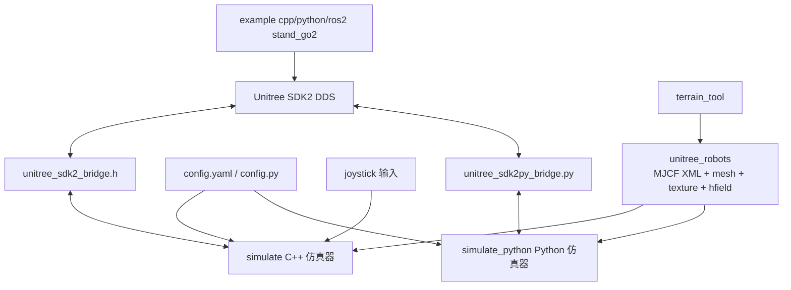
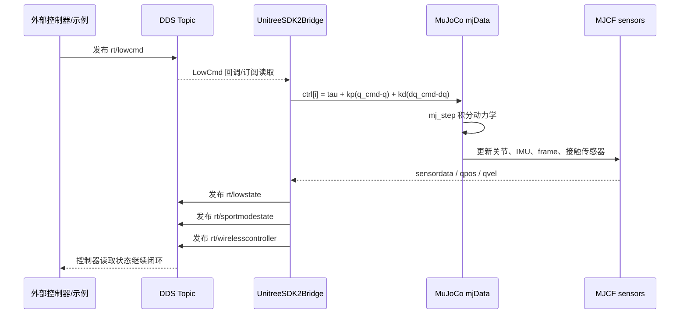
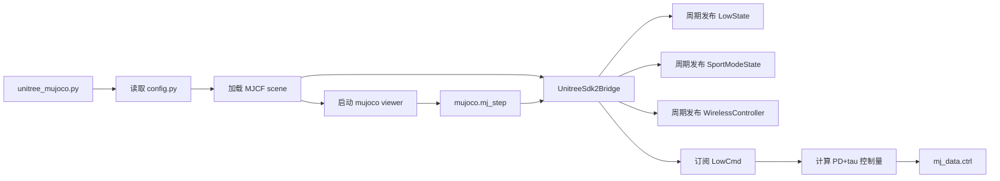
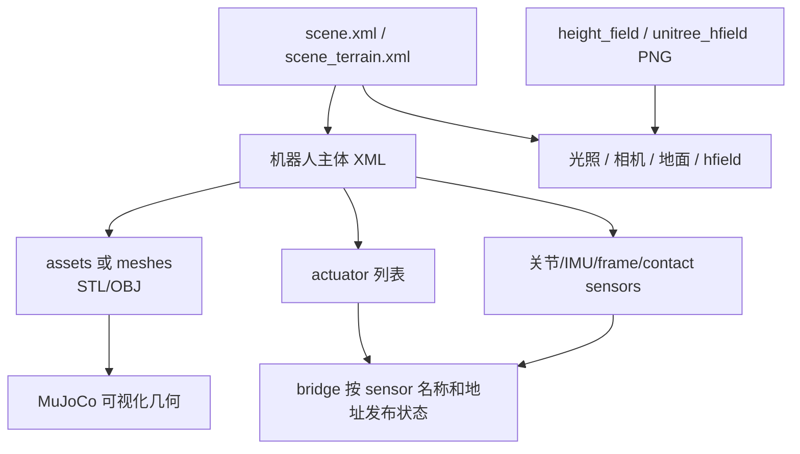

# unitree_mujoco 仓库完整说明

本文档基于当前工作区中的 `unitree_mujoco/` 目录整理。该目录共有约 31 个目录、389 个文件，总大小约 245M。核心代码约 2983 行，不包含第三方 `lodepng` 和大量 STL/OBJ/PNG 资源。

`unitree_mujoco` 是一个把 Unitree SDK2 DDS 通信接口接到 MuJoCo 物理仿真的仓库。它的目标不是训练框架，而是让使用 `unitree_sdk2`、`unitree_sdk2_python` 或 `unitree_ros2` 写出来的低层控制程序，可以直接控制仿真中的 Unitree 机器人，从而做 sim to real 验证。

## 1. 全量仓库索引表（目录与逐文件作用）

> 本节为 `unitree_mujoco/` 的全量索引，包含目录节点和每一个文件。说明依据文件路径、文件类型以及源码/配置/模型内容生成；源码文件会列出其实际定义的类、函数、API 常量或运行职责。

- 目录数：31
- 文件数：389

| 序号 | 路径 | 类型 | 大小 | 作用说明 |
|---:|---|---|---:|---|
| 1 | `unitree_mujoco` | 目录 | - | 目录节点，包含 30 个子目录、389 个文件，用于组织 unitree_mujoco 相关代码或资源。 |
| 2 | `unitree_mujoco/doc` | 目录 | - | 目录节点，包含 0 个子目录、3 个文件，用于组织 doc 相关代码或资源。 |
| 3 | `unitree_mujoco/example` | 目录 | - | 目录节点，包含 5 个子目录、8 个文件，用于组织 example 相关代码或资源。 |
| 4 | `unitree_mujoco/example/cpp` | 目录 | - | 目录节点，包含 0 个子目录、2 个文件，用于组织 example/cpp 相关代码或资源。 |
| 5 | `unitree_mujoco/example/python` | 目录 | - | 目录节点，包含 0 个子目录、1 个文件，用于组织 example/python 相关代码或资源。 |
| 6 | `unitree_mujoco/example/ros2` | 目录 | - | 目录节点，包含 2 个子目录、5 个文件，用于组织 example/ros2 相关代码或资源。 |
| 7 | `unitree_mujoco/example/ros2/include` | 目录 | - | 目录节点，包含 0 个子目录、1 个文件，用于组织 example/ros2/include 相关代码或资源。 |
| 8 | `unitree_mujoco/example/ros2/src` | 目录 | - | 目录节点，包含 0 个子目录、2 个文件，用于组织 example/ros2/src 相关代码或资源。 |
| 9 | `unitree_mujoco/simulate` | 目录 | - | 目录节点，包含 3 个子目录、15 个文件，用于组织 simulate 相关代码或资源。 |
| 10 | `unitree_mujoco/simulate/src` | 目录 | - | 目录节点，包含 2 个子目录、13 个文件，用于组织 simulate/src 相关代码或资源。 |
| 11 | `unitree_mujoco/simulate/src/joystick` | 目录 | - | 目录节点，包含 0 个子目录、5 个文件，用于组织 simulate/src/joystick 相关代码或资源。 |
| 12 | `unitree_mujoco/simulate/src/lodepng` | 目录 | - | 目录节点，包含 0 个子目录、4 个文件，用于组织 simulate/src/lodepng 相关代码或资源。 |
| 13 | `unitree_mujoco/simulate_python` | 目录 | - | 目录节点，包含 1 个子目录、5 个文件，用于组织 simulate_python 相关代码或资源。 |
| 14 | `unitree_mujoco/simulate_python/test` | 目录 | - | 目录节点，包含 0 个子目录、2 个文件，用于组织 simulate_python/test 相关代码或资源。 |
| 15 | `unitree_mujoco/terrain_tool` | 目录 | - | 目录节点，包含 0 个子目录、5 个文件，用于组织 terrain_tool 相关代码或资源。 |
| 16 | `unitree_mujoco/unitree_robots` | 目录 | - | 目录节点，包含 15 个子目录、349 个文件，用于组织 unitree_robots 相关代码或资源。 |
| 17 | `unitree_mujoco/unitree_robots/b2` | 目录 | - | 目录节点，包含 1 个子目录、37 个文件，用于组织 unitree_robots/b2 相关代码或资源。 |
| 18 | `unitree_mujoco/unitree_robots/b2/assets` | 目录 | - | 目录节点，包含 0 个子目录、31 个文件，用于组织 unitree_robots/b2/assets 相关代码或资源。 |
| 19 | `unitree_mujoco/unitree_robots/b2w` | 目录 | - | 目录节点，包含 1 个子目录、41 个文件，用于组织 unitree_robots/b2w 相关代码或资源。 |
| 20 | `unitree_mujoco/unitree_robots/b2w/assets` | 目录 | - | 目录节点，包含 0 个子目录、35 个文件，用于组织 unitree_robots/b2w/assets 相关代码或资源。 |
| 21 | `unitree_mujoco/unitree_robots/g1` | 目录 | - | 目录节点，包含 2 个子目录、72 个文件，用于组织 unitree_robots/g1 相关代码或资源。 |
| 22 | `unitree_mujoco/unitree_robots/g1/images` | 目录 | - | 目录节点，包含 0 个子目录、4 个文件，用于组织 unitree_robots/g1/images 相关代码或资源。 |
| 23 | `unitree_mujoco/unitree_robots/g1/meshes` | 目录 | - | 目录节点，包含 0 个子目录、60 个文件，用于组织 unitree_robots/g1/meshes 相关代码或资源。 |
| 24 | `unitree_mujoco/unitree_robots/go2` | 目录 | - | 目录节点，包含 1 个子目录、22 个文件，用于组织 unitree_robots/go2 相关代码或资源。 |
| 25 | `unitree_mujoco/unitree_robots/go2/assets` | 目录 | - | 目录节点，包含 0 个子目录、16 个文件，用于组织 unitree_robots/go2/assets 相关代码或资源。 |
| 26 | `unitree_mujoco/unitree_robots/go2w` | 目录 | - | 目录节点，包含 1 个子目录、27 个文件，用于组织 unitree_robots/go2w 相关代码或资源。 |
| 27 | `unitree_mujoco/unitree_robots/go2w/assets` | 目录 | - | 目录节点，包含 0 个子目录、22 个文件，用于组织 unitree_robots/go2w/assets 相关代码或资源。 |
| 28 | `unitree_mujoco/unitree_robots/h1` | 目录 | - | 目录节点，包含 1 个子目录、57 个文件，用于组织 unitree_robots/h1 相关代码或资源。 |
| 29 | `unitree_mujoco/unitree_robots/h1/assets` | 目录 | - | 目录节点，包含 0 个子目录、51 个文件，用于组织 unitree_robots/h1/assets 相关代码或资源。 |
| 30 | `unitree_mujoco/unitree_robots/h1_2` | 目录 | - | 目录节点，包含 1 个子目录、93 个文件，用于组织 unitree_robots/h1_2 相关代码或资源。 |
| 31 | `unitree_mujoco/unitree_robots/h1_2/meshes` | 目录 | - | 目录节点，包含 0 个子目录、90 个文件，用于组织 unitree_robots/h1_2/meshes 相关代码或资源。 |
| 32 | `unitree_mujoco/.gitignore` | 项目文件 | 73 B | Git 忽略规则，排除构建产物、缓存、日志、二进制临时文件或本地环境文件。 |
| 33 | `unitree_mujoco/LICENSE` | 文本/许可文件 | 1.5 KB | 许可文本，声明本仓库或第三方组件的授权条款。 |
| 34 | `unitree_mujoco/doc/fun.dio` | 项目文件 | 4.6 KB | 项目资源或配置文件，被对应示例、构建、仿真、训练或部署流程读取。 |
| 35 | `unitree_mujoco/doc/func.png` | 图像/GIF资源 | 155.0 KB | 机器人、场景、文档或 UI 预览图像资源，被 README、MJCF 材质或文档引用。 |
| 36 | `unitree_mujoco/doc/terrain.png` | 图像/GIF资源 | 1.5 MB | 高度场/地形图像资源，被 MuJoCo hfield 或地形工具读取来生成起伏地面。 |
| 37 | `unitree_mujoco/example/cpp/CMakeLists.txt` | 构建脚本 | 276 B | CMake 构建入口，声明目标、源文件、include 路径、第三方库和链接依赖。 |
| 38 | `unitree_mujoco/example/cpp/stand_go2.cpp` | C/C++源码 | 5.0 KB | C/C++ 源码或头文件，主要定义/实现 Custom，参与构建、部署控制、仿真桥接或数据结构声明。 |
| 39 | `unitree_mujoco/example/python/stand_go2.py` | Python源码 | 2.7 KB | 示例脚本，演示该机器人/功能的 SDK 调用流程；源码主要执行 脚本入口逻辑，用于实机或仿真快速验证。 |
| 40 | `unitree_mujoco/example/ros2/CMakeLists.txt` | 构建脚本 | 1.3 KB | CMake 构建入口，声明目标、源文件、include 路径、第三方库和链接依赖。 |
| 41 | `unitree_mujoco/example/ros2/include/motor_crc.h` | C/C++头文件 | 1.9 KB | C/C++ 源码或头文件，主要定义/实现 依赖 stdint.h、array、rclcpp/rclcpp.hpp、unitree_go/msg/low_cmd.hpp，参与构建、部署控制、仿真桥接或数据结构声明。 |
| 42 | `unitree_mujoco/example/ros2/package.xml` | 模型/场景XML | 612 B | XML 配置/描述文件，根节点 package，用于场景、模型、包元数据或工具配置。 |
| 43 | `unitree_mujoco/example/ros2/src/motor_crc.cpp` | C/C++源码 | 1.7 KB | C/C++ 源码或头文件，主要定义/实现 get_crc、crc32_core，参与构建、部署控制、仿真桥接或数据结构声明。 |
| 44 | `unitree_mujoco/example/ros2/src/stand_go2.cpp` | C/C++源码 | 3.8 KB | C/C++ 源码或头文件，主要定义/实现 for、low_level_cmd_sender、rclcpp，参与构建、部署控制、仿真桥接或数据结构声明。 |
| 45 | `unitree_mujoco/readme.md` | Markdown文档 | 11.6 KB | Markdown 文档《Introduction》，记录安装、使用、模型说明、接口约定或第三方组件说明。 |
| 46 | `unitree_mujoco/readme_zh.md` | Markdown文档 | 10.2 KB | Markdown 文档《介绍》，记录安装、使用、模型说明、接口约定或第三方组件说明。 |
| 47 | `unitree_mujoco/simulate/CMakeLists.txt` | 构建脚本 | 996 B | CMake 构建入口，声明目标、源文件、include 路径、第三方库和链接依赖。 |
| 48 | `unitree_mujoco/simulate/config.yaml` | YAML配置 | 603 B | 运行配置文件，设置机器人类型、网络接口、模型/场景、手柄、打印调试和控制周期等参数；顶层键包括 robot、robot_scene、domain_id、interface、use_joystick、joystick_type、joystick_device、joystick_bits。 |
| 49 | `unitree_mujoco/simulate/src/joystick/LICENSE-2.0.txt` | 文本/许可文件 | 11.1 KB | 许可文本，声明本仓库或第三方组件的授权条款。 |
| 50 | `unitree_mujoco/simulate/src/joystick/joystick.cc` | C/C++源码 | 2.0 KB | Linux 手柄输入封装/测试源码，定义 joystick，从 joystick 设备读取按键和摇杆事件供仿真控制使用。 |
| 51 | `unitree_mujoco/simulate/src/joystick/joystick.h` | C/C++头文件 | 3.6 KB | Linux 手柄输入封装/测试源码，定义 JoystickEvent、Joystick，从 joystick 设备读取按键和摇杆事件供仿真控制使用。 |
| 52 | `unitree_mujoco/simulate/src/joystick/jstest.cc` | C/C++源码 | 2.6 KB | Linux 手柄输入封装/测试源码，定义 jstest，从 joystick 设备读取按键和摇杆事件供仿真控制使用。 |
| 53 | `unitree_mujoco/simulate/src/joystick/readme.md` | Markdown文档 | 104 B | Markdown 文档，记录该目录的使用方法、接口说明、安装步骤或许可信息。 |
| 54 | `unitree_mujoco/simulate/src/lodepng/LICENSE` | 文本/许可文件 | 886 B | 许可文本，声明本仓库或第三方组件的授权条款。 |
| 55 | `unitree_mujoco/simulate/src/lodepng/README.md` | Markdown文档 | 2.2 KB | Markdown 文档《Documentation》，记录安装、使用、模型说明、接口约定或第三方组件说明。 |
| 56 | `unitree_mujoco/simulate/src/lodepng/lodepng.cpp` | C/C++源码 | 304.6 KB | 第三方 lodepng PNG 编解码源码/头文件，用于读取或写入地形、贴图等 PNG 资源。 |
| 57 | `unitree_mujoco/simulate/src/lodepng/lodepng.h` | C/C++头文件 | 105.3 KB | 第三方 lodepng PNG 编解码源码/头文件，用于读取或写入地形、贴图等 PNG 资源。 |
| 58 | `unitree_mujoco/simulate/src/main.cc` | C/C++源码 | 19.3 KB | 程序入口源码，读取配置/参数、初始化通信或仿真对象、创建状态机/桥接器，并启动主循环或 RecurrentThread。 |
| 59 | `unitree_mujoco/simulate/src/param.h` | C/C++头文件 | 2.3 KB | C/C++ 源码或头文件，主要定义/实现 SimulationConfig，参与构建、部署控制、仿真桥接或数据结构声明。 |
| 60 | `unitree_mujoco/simulate/src/physics_joystick.h` | C/C++头文件 | 2.3 KB | Linux 手柄输入封装/测试源码，定义 XBoxJoystick、SwitchJoystick，从 joystick 设备读取按键和摇杆事件供仿真控制使用。 |
| 61 | `unitree_mujoco/simulate/src/unitree_sdk2_bridge.h` | C/C++头文件 | 12.9 KB | Unitree SDK2 与 MuJoCo 的核心桥接层：订阅 rt/lowcmd，把 PD+tau 写入 mj_data->ctrl，并发布 lowstate、sportmodestate、wirelesscontroller。 |
| 62 | `unitree_mujoco/simulate_python/config.py` | Python源码 | 644 B | Python 源码文件，承载该模块的导入、常量或脚本入口逻辑。 |
| 63 | `unitree_mujoco/simulate_python/test/gamepad_test.py` | Python源码 | 731 B | Python 源码文件，承载该模块的导入、常量或脚本入口逻辑。 |
| 64 | `unitree_mujoco/simulate_python/test/test_unitree_sdk2.py` | Python源码 | 2.0 KB | Python 源码，定义 函数 HighStateHandler、LowStateHandler。 |
| 65 | `unitree_mujoco/simulate_python/unitree_mujoco.py` | Python源码 | 2.2 KB | Python 源码，定义 函数 SimulationThread、PhysicsViewerThread。 |
| 66 | `unitree_mujoco/simulate_python/unitree_sdk2py_bridge.py` | Python源码 | 15.9 KB | Python 源码，定义 类 UnitreeSdk2Bridge、ElasticBand。 |
| 67 | `unitree_mujoco/terrain_tool/readme.md` | Markdown文档 | 4.0 KB | Markdown 文档《Terrain Generation Tool》，记录安装、使用、模型说明、接口约定或第三方组件说明。 |
| 68 | `unitree_mujoco/terrain_tool/readme_zh.md` | Markdown文档 | 3.7 KB | Markdown 文档《地形生成工具》，记录安装、使用、模型说明、接口约定或第三方组件说明。 |
| 69 | `unitree_mujoco/terrain_tool/scene.xml` | 模型/场景XML | 883 B | XML 配置/描述文件，根节点 mujoco，用于场景、模型、包元数据或工具配置。 |
| 70 | `unitree_mujoco/terrain_tool/terrain_generator.py` | Python源码 | 10.4 KB | Python 源码，定义 类 TerrainGenerator；函数 euler_to_quat、euler_to_rot、rot2d、rot3d、list_to_str。 |
| 71 | `unitree_mujoco/terrain_tool/unitree_robot.jpeg` | 图像/GIF资源 | 6.1 KB | 机器人、场景、文档或 UI 预览图像资源，被 README、MJCF 材质或文档引用。 |
| 72 | `unitree_mujoco/unitree_robots/b2/B2.png` | 图像/GIF资源 | 650.1 KB | 机器人、场景、文档或 UI 预览图像资源，被 README、MJCF 材质或文档引用。 |
| 73 | `unitree_mujoco/unitree_robots/b2/assets/FL_calf.obj` | 三维网格资源 | 657.2 KB | 三维网格资源，表示 FL_calf 机器人部件的可视化/碰撞几何，被 MJCF XML 的 mesh/geom 引用。 |
| 74 | `unitree_mujoco/unitree_robots/b2/assets/FL_foot.obj` | 三维网格资源 | 1.1 MB | 三维网格资源，表示 FL_foot 机器人部件的可视化/碰撞几何，被 MJCF XML 的 mesh/geom 引用。 |
| 75 | `unitree_mujoco/unitree_robots/b2/assets/FL_hip.obj` | 三维网格资源 | 164.8 KB | 三维网格资源，表示 FL_hip 机器人部件的可视化/碰撞几何，被 MJCF XML 的 mesh/geom 引用。 |
| 76 | `unitree_mujoco/unitree_robots/b2/assets/FL_thigh.obj` | 三维网格资源 | 641.4 KB | 三维网格资源，表示 FL_thigh 机器人部件的可视化/碰撞几何，被 MJCF XML 的 mesh/geom 引用。 |
| 77 | `unitree_mujoco/unitree_robots/b2/assets/FL_thigh_protect.obj` | 三维网格资源 | 397.8 KB | 三维网格资源，表示 FL_thigh_protect 机器人部件的可视化/碰撞几何，被 MJCF XML 的 mesh/geom 引用。 |
| 78 | `unitree_mujoco/unitree_robots/b2/assets/FR_calf.obj` | 三维网格资源 | 657.2 KB | 三维网格资源，表示 FR_calf 机器人部件的可视化/碰撞几何，被 MJCF XML 的 mesh/geom 引用。 |
| 79 | `unitree_mujoco/unitree_robots/b2/assets/FR_foot.obj` | 三维网格资源 | 1.1 MB | 三维网格资源，表示 FR_foot 机器人部件的可视化/碰撞几何，被 MJCF XML 的 mesh/geom 引用。 |
| 80 | `unitree_mujoco/unitree_robots/b2/assets/FR_hip.obj` | 三维网格资源 | 164.3 KB | 三维网格资源，表示 FR_hip 机器人部件的可视化/碰撞几何，被 MJCF XML 的 mesh/geom 引用。 |
| 81 | `unitree_mujoco/unitree_robots/b2/assets/FR_thigh.obj` | 三维网格资源 | 1.4 MB | 三维网格资源，表示 FR_thigh 机器人部件的可视化/碰撞几何，被 MJCF XML 的 mesh/geom 引用。 |
| 82 | `unitree_mujoco/unitree_robots/b2/assets/FR_thigh_protect.obj` | 三维网格资源 | 398.5 KB | 三维网格资源，表示 FR_thigh_protect 机器人部件的可视化/碰撞几何，被 MJCF XML 的 mesh/geom 引用。 |
| 83 | `unitree_mujoco/unitree_robots/b2/assets/RL_calf.obj` | 三维网格资源 | 657.2 KB | 三维网格资源，表示 RL_calf 机器人部件的可视化/碰撞几何，被 MJCF XML 的 mesh/geom 引用。 |
| 84 | `unitree_mujoco/unitree_robots/b2/assets/RL_foot.obj` | 三维网格资源 | 1.1 MB | 三维网格资源，表示 RL_foot 机器人部件的可视化/碰撞几何，被 MJCF XML 的 mesh/geom 引用。 |
| 85 | `unitree_mujoco/unitree_robots/b2/assets/RL_hip.obj` | 三维网格资源 | 161.4 KB | 三维网格资源，表示 RL_hip 机器人部件的可视化/碰撞几何，被 MJCF XML 的 mesh/geom 引用。 |
| 86 | `unitree_mujoco/unitree_robots/b2/assets/RL_thigh.obj` | 三维网格资源 | 641.4 KB | 三维网格资源，表示 RL_thigh 机器人部件的可视化/碰撞几何，被 MJCF XML 的 mesh/geom 引用。 |
| 87 | `unitree_mujoco/unitree_robots/b2/assets/RL_thigh_protect.obj` | 三维网格资源 | 397.8 KB | 三维网格资源，表示 RL_thigh_protect 机器人部件的可视化/碰撞几何，被 MJCF XML 的 mesh/geom 引用。 |
| 88 | `unitree_mujoco/unitree_robots/b2/assets/RR_calf.obj` | 三维网格资源 | 657.2 KB | 三维网格资源，表示 RR_calf 机器人部件的可视化/碰撞几何，被 MJCF XML 的 mesh/geom 引用。 |
| 89 | `unitree_mujoco/unitree_robots/b2/assets/RR_foot.obj` | 三维网格资源 | 1.1 MB | 三维网格资源，表示 RR_foot 机器人部件的可视化/碰撞几何，被 MJCF XML 的 mesh/geom 引用。 |
| 90 | `unitree_mujoco/unitree_robots/b2/assets/RR_hip.obj` | 三维网格资源 | 161.5 KB | 三维网格资源，表示 RR_hip 机器人部件的可视化/碰撞几何，被 MJCF XML 的 mesh/geom 引用。 |
| 91 | `unitree_mujoco/unitree_robots/b2/assets/RR_thigh.obj` | 三维网格资源 | 1.4 MB | 三维网格资源，表示 RR_thigh 机器人部件的可视化/碰撞几何，被 MJCF XML 的 mesh/geom 引用。 |
| 92 | `unitree_mujoco/unitree_robots/b2/assets/RR_thigh_protect.obj` | 三维网格资源 | 398.5 KB | 三维网格资源，表示 RR_thigh_protect 机器人部件的可视化/碰撞几何，被 MJCF XML 的 mesh/geom 引用。 |
| 93 | `unitree_mujoco/unitree_robots/b2/assets/base_link.obj` | 三维网格资源 | 16.0 MB | 三维网格资源，表示 base_link 机器人部件的可视化/碰撞几何，被 MJCF XML 的 mesh/geom 引用。 |
| 94 | `unitree_mujoco/unitree_robots/b2/assets/f_dc_link.obj` | 三维网格资源 | 2.9 KB | 三维网格资源，表示 f_dc_link 机器人部件的可视化/碰撞几何，被 MJCF XML 的 mesh/geom 引用。 |
| 95 | `unitree_mujoco/unitree_robots/b2/assets/f_oc_link.obj` | 三维网格资源 | 7.5 KB | 三维网格资源，表示 f_oc_link 机器人部件的可视化/碰撞几何，被 MJCF XML 的 mesh/geom 引用。 |
| 96 | `unitree_mujoco/unitree_robots/b2/assets/fake_head_Link.STL` | 三维网格资源 | 114.9 KB | 三维网格资源，表示 fake_head_Link 机器人部件的可视化/碰撞几何，被 MJCF XML 的 mesh/geom 引用。 |
| 97 | `unitree_mujoco/unitree_robots/b2/assets/fake_imu_link.STL` | 三维网格资源 | 114.9 KB | 三维网格资源，表示 fake_imu_link 机器人部件的可视化/碰撞几何，被 MJCF XML 的 mesh/geom 引用。 |
| 98 | `unitree_mujoco/unitree_robots/b2/assets/fake_tail_link.STL` | 三维网格资源 | 114.9 KB | 三维网格资源，表示 fake_tail_link 机器人部件的可视化/碰撞几何，被 MJCF XML 的 mesh/geom 引用。 |
| 99 | `unitree_mujoco/unitree_robots/b2/assets/logo_left.obj` | 三维网格资源 | 265.7 KB | 三维网格资源，表示 logo_left 机器人部件的可视化/碰撞几何，被 MJCF XML 的 mesh/geom 引用。 |
| 100 | `unitree_mujoco/unitree_robots/b2/assets/logo_right.obj` | 三维网格资源 | 266.6 KB | 三维网格资源，表示 logo_right 机器人部件的可视化/碰撞几何，被 MJCF XML 的 mesh/geom 引用。 |
| 101 | `unitree_mujoco/unitree_robots/b2/assets/r_dc_link.obj` | 三维网格资源 | 2.9 KB | 三维网格资源，表示 r_dc_link 机器人部件的可视化/碰撞几何，被 MJCF XML 的 mesh/geom 引用。 |
| 102 | `unitree_mujoco/unitree_robots/b2/assets/r_oc_link.obj` | 三维网格资源 | 7.6 KB | 三维网格资源，表示 r_oc_link 机器人部件的可视化/碰撞几何，被 MJCF XML 的 mesh/geom 引用。 |
| 103 | `unitree_mujoco/unitree_robots/b2/assets/unitree_ladar.obj` | 三维网格资源 | 9.0 KB | 三维网格资源，表示 unitree_ladar 机器人部件的可视化/碰撞几何，被 MJCF XML 的 mesh/geom 引用。 |
| 104 | `unitree_mujoco/unitree_robots/b2/b2.xml` | 模型/场景XML | 18.4 KB | MuJoCo/MJCF 机器人或场景模型，根节点 mujoco，声明约 13 个 body、12 个 actuator、5 个传感器/传感器组，供仿真加载。 |
| 105 | `unitree_mujoco/unitree_robots/b2/height_field.png` | 图像/GIF资源 | 4.8 KB | 高度场/地形图像资源，被 MuJoCo hfield 或地形工具读取来生成起伏地面。 |
| 106 | `unitree_mujoco/unitree_robots/b2/scene.xml` | 模型/场景XML | 1.6 KB | MuJoCo/MJCF 机器人或场景模型，根节点 mujoco，声明约 0 个 body、0 个 actuator、0 个传感器/传感器组，供仿真加载。 |
| 107 | `unitree_mujoco/unitree_robots/b2/scene_terrain.xml` | 模型/场景XML | 20.8 KB | MuJoCo/MJCF 机器人或场景模型，根节点 mujoco，声明约 0 个 body、0 个 actuator、0 个传感器/传感器组，供仿真加载。 |
| 108 | `unitree_mujoco/unitree_robots/b2/unitree_hfield.png` | 图像/GIF资源 | 13.9 KB | 高度场/地形图像资源，被 MuJoCo hfield 或地形工具读取来生成起伏地面。 |
| 109 | `unitree_mujoco/unitree_robots/b2w/B2w.png` | 图像/GIF资源 | 669.8 KB | 机器人、场景、文档或 UI 预览图像资源，被 README、MJCF 材质或文档引用。 |
| 110 | `unitree_mujoco/unitree_robots/b2w/assets/FL_calf.STL` | 三维网格资源 | 1.9 MB | 三维网格资源，表示 FL_calf 机器人部件的可视化/碰撞几何，被 MJCF XML 的 mesh/geom 引用。 |
| 111 | `unitree_mujoco/unitree_robots/b2w/assets/FL_foot.obj` | 三维网格资源 | 1.1 MB | 三维网格资源，表示 FL_foot 机器人部件的可视化/碰撞几何，被 MJCF XML 的 mesh/geom 引用。 |
| 112 | `unitree_mujoco/unitree_robots/b2w/assets/FL_hip.obj` | 三维网格资源 | 164.8 KB | 三维网格资源，表示 FL_hip 机器人部件的可视化/碰撞几何，被 MJCF XML 的 mesh/geom 引用。 |
| 113 | `unitree_mujoco/unitree_robots/b2w/assets/FL_thigh.obj` | 三维网格资源 | 641.4 KB | 三维网格资源，表示 FL_thigh 机器人部件的可视化/碰撞几何，被 MJCF XML 的 mesh/geom 引用。 |
| 114 | `unitree_mujoco/unitree_robots/b2w/assets/FL_thigh_protect.obj` | 三维网格资源 | 397.8 KB | 三维网格资源，表示 FL_thigh_protect 机器人部件的可视化/碰撞几何，被 MJCF XML 的 mesh/geom 引用。 |
| 115 | `unitree_mujoco/unitree_robots/b2w/assets/FL_wheel.STL` | 三维网格资源 | 257.8 KB | 三维网格资源，表示 FL_wheel 机器人部件的可视化/碰撞几何，被 MJCF XML 的 mesh/geom 引用。 |
| 116 | `unitree_mujoco/unitree_robots/b2w/assets/FR_calf.STL` | 三维网格资源 | 1.9 MB | 三维网格资源，表示 FR_calf 机器人部件的可视化/碰撞几何，被 MJCF XML 的 mesh/geom 引用。 |
| 117 | `unitree_mujoco/unitree_robots/b2w/assets/FR_foot.obj` | 三维网格资源 | 1.1 MB | 三维网格资源，表示 FR_foot 机器人部件的可视化/碰撞几何，被 MJCF XML 的 mesh/geom 引用。 |
| 118 | `unitree_mujoco/unitree_robots/b2w/assets/FR_hip.obj` | 三维网格资源 | 164.3 KB | 三维网格资源，表示 FR_hip 机器人部件的可视化/碰撞几何，被 MJCF XML 的 mesh/geom 引用。 |
| 119 | `unitree_mujoco/unitree_robots/b2w/assets/FR_thigh.obj` | 三维网格资源 | 1.4 MB | 三维网格资源，表示 FR_thigh 机器人部件的可视化/碰撞几何，被 MJCF XML 的 mesh/geom 引用。 |
| 120 | `unitree_mujoco/unitree_robots/b2w/assets/FR_thigh_protect.obj` | 三维网格资源 | 398.5 KB | 三维网格资源，表示 FR_thigh_protect 机器人部件的可视化/碰撞几何，被 MJCF XML 的 mesh/geom 引用。 |
| 121 | `unitree_mujoco/unitree_robots/b2w/assets/FR_wheel.STL` | 三维网格资源 | 257.8 KB | 三维网格资源，表示 FR_wheel 机器人部件的可视化/碰撞几何，被 MJCF XML 的 mesh/geom 引用。 |
| 122 | `unitree_mujoco/unitree_robots/b2w/assets/RL_calf.STL` | 三维网格资源 | 1.9 MB | 三维网格资源，表示 RL_calf 机器人部件的可视化/碰撞几何，被 MJCF XML 的 mesh/geom 引用。 |
| 123 | `unitree_mujoco/unitree_robots/b2w/assets/RL_foot.obj` | 三维网格资源 | 1.1 MB | 三维网格资源，表示 RL_foot 机器人部件的可视化/碰撞几何，被 MJCF XML 的 mesh/geom 引用。 |
| 124 | `unitree_mujoco/unitree_robots/b2w/assets/RL_hip.obj` | 三维网格资源 | 161.4 KB | 三维网格资源，表示 RL_hip 机器人部件的可视化/碰撞几何，被 MJCF XML 的 mesh/geom 引用。 |
| 125 | `unitree_mujoco/unitree_robots/b2w/assets/RL_thigh.obj` | 三维网格资源 | 641.4 KB | 三维网格资源，表示 RL_thigh 机器人部件的可视化/碰撞几何，被 MJCF XML 的 mesh/geom 引用。 |
| 126 | `unitree_mujoco/unitree_robots/b2w/assets/RL_thigh_protect.obj` | 三维网格资源 | 397.8 KB | 三维网格资源，表示 RL_thigh_protect 机器人部件的可视化/碰撞几何，被 MJCF XML 的 mesh/geom 引用。 |
| 127 | `unitree_mujoco/unitree_robots/b2w/assets/RL_wheel.STL` | 三维网格资源 | 257.8 KB | 三维网格资源，表示 RL_wheel 机器人部件的可视化/碰撞几何，被 MJCF XML 的 mesh/geom 引用。 |
| 128 | `unitree_mujoco/unitree_robots/b2w/assets/RR_calf.STL` | 三维网格资源 | 1.9 MB | 三维网格资源，表示 RR_calf 机器人部件的可视化/碰撞几何，被 MJCF XML 的 mesh/geom 引用。 |
| 129 | `unitree_mujoco/unitree_robots/b2w/assets/RR_foot.obj` | 三维网格资源 | 1.1 MB | 三维网格资源，表示 RR_foot 机器人部件的可视化/碰撞几何，被 MJCF XML 的 mesh/geom 引用。 |
| 130 | `unitree_mujoco/unitree_robots/b2w/assets/RR_hip.obj` | 三维网格资源 | 161.5 KB | 三维网格资源，表示 RR_hip 机器人部件的可视化/碰撞几何，被 MJCF XML 的 mesh/geom 引用。 |
| 131 | `unitree_mujoco/unitree_robots/b2w/assets/RR_thigh.obj` | 三维网格资源 | 1.4 MB | 三维网格资源，表示 RR_thigh 机器人部件的可视化/碰撞几何，被 MJCF XML 的 mesh/geom 引用。 |
| 132 | `unitree_mujoco/unitree_robots/b2w/assets/RR_thigh_protect.obj` | 三维网格资源 | 398.5 KB | 三维网格资源，表示 RR_thigh_protect 机器人部件的可视化/碰撞几何，被 MJCF XML 的 mesh/geom 引用。 |
| 133 | `unitree_mujoco/unitree_robots/b2w/assets/RR_wheel.STL` | 三维网格资源 | 257.8 KB | 三维网格资源，表示 RR_wheel 机器人部件的可视化/碰撞几何，被 MJCF XML 的 mesh/geom 引用。 |
| 134 | `unitree_mujoco/unitree_robots/b2w/assets/base_link.obj` | 三维网格资源 | 16.0 MB | 三维网格资源，表示 base_link 机器人部件的可视化/碰撞几何，被 MJCF XML 的 mesh/geom 引用。 |
| 135 | `unitree_mujoco/unitree_robots/b2w/assets/f_dc_link.obj` | 三维网格资源 | 2.9 KB | 三维网格资源，表示 f_dc_link 机器人部件的可视化/碰撞几何，被 MJCF XML 的 mesh/geom 引用。 |
| 136 | `unitree_mujoco/unitree_robots/b2w/assets/f_oc_link.obj` | 三维网格资源 | 7.5 KB | 三维网格资源，表示 f_oc_link 机器人部件的可视化/碰撞几何，被 MJCF XML 的 mesh/geom 引用。 |
| 137 | `unitree_mujoco/unitree_robots/b2w/assets/fake_head_Link.STL` | 三维网格资源 | 114.9 KB | 三维网格资源，表示 fake_head_Link 机器人部件的可视化/碰撞几何，被 MJCF XML 的 mesh/geom 引用。 |
| 138 | `unitree_mujoco/unitree_robots/b2w/assets/fake_imu_link.STL` | 三维网格资源 | 114.9 KB | 三维网格资源，表示 fake_imu_link 机器人部件的可视化/碰撞几何，被 MJCF XML 的 mesh/geom 引用。 |
| 139 | `unitree_mujoco/unitree_robots/b2w/assets/fake_tail_link.STL` | 三维网格资源 | 114.9 KB | 三维网格资源，表示 fake_tail_link 机器人部件的可视化/碰撞几何，被 MJCF XML 的 mesh/geom 引用。 |
| 140 | `unitree_mujoco/unitree_robots/b2w/assets/logo_left.obj` | 三维网格资源 | 265.7 KB | 三维网格资源，表示 logo_left 机器人部件的可视化/碰撞几何，被 MJCF XML 的 mesh/geom 引用。 |
| 141 | `unitree_mujoco/unitree_robots/b2w/assets/logo_right.obj` | 三维网格资源 | 266.6 KB | 三维网格资源，表示 logo_right 机器人部件的可视化/碰撞几何，被 MJCF XML 的 mesh/geom 引用。 |
| 142 | `unitree_mujoco/unitree_robots/b2w/assets/r_dc_link.obj` | 三维网格资源 | 2.9 KB | 三维网格资源，表示 r_dc_link 机器人部件的可视化/碰撞几何，被 MJCF XML 的 mesh/geom 引用。 |
| 143 | `unitree_mujoco/unitree_robots/b2w/assets/r_oc_link.obj` | 三维网格资源 | 7.6 KB | 三维网格资源，表示 r_oc_link 机器人部件的可视化/碰撞几何，被 MJCF XML 的 mesh/geom 引用。 |
| 144 | `unitree_mujoco/unitree_robots/b2w/assets/unitree_ladar.obj` | 三维网格资源 | 9.0 KB | 三维网格资源，表示 unitree_ladar 机器人部件的可视化/碰撞几何，被 MJCF XML 的 mesh/geom 引用。 |
| 145 | `unitree_mujoco/unitree_robots/b2w/b2w.xml` | 模型/场景XML | 21.6 KB | MuJoCo/MJCF 机器人或场景模型，根节点 mujoco，声明约 17 个 body、16 个 actuator、5 个传感器/传感器组，供仿真加载。 |
| 146 | `unitree_mujoco/unitree_robots/b2w/height_field.png` | 图像/GIF资源 | 4.8 KB | 高度场/地形图像资源，被 MuJoCo hfield 或地形工具读取来生成起伏地面。 |
| 147 | `unitree_mujoco/unitree_robots/b2w/scene.xml` | 模型/场景XML | 1.6 KB | MuJoCo/MJCF 机器人或场景模型，根节点 mujoco，声明约 0 个 body、0 个 actuator、0 个传感器/传感器组，供仿真加载。 |
| 148 | `unitree_mujoco/unitree_robots/b2w/scene_terrain.xml` | 模型/场景XML | 20.8 KB | MuJoCo/MJCF 机器人或场景模型，根节点 mujoco，声明约 0 个 body、0 个 actuator、0 个传感器/传感器组，供仿真加载。 |
| 149 | `unitree_mujoco/unitree_robots/b2w/unitree_hfield.png` | 图像/GIF资源 | 13.9 KB | 高度场/地形图像资源，被 MuJoCo hfield 或地形工具读取来生成起伏地面。 |
| 150 | `unitree_mujoco/unitree_robots/g1/g1_23dof.xml` | 模型/场景XML | 31.0 KB | MuJoCo/MJCF 机器人或场景模型，根节点 mujoco，声明约 30 个 body、29 个 actuator、8 个传感器/传感器组，供仿真加载。 |
| 151 | `unitree_mujoco/unitree_robots/g1/g1_29dof.xml` | 模型/场景XML | 35.3 KB | MuJoCo/MJCF 机器人或场景模型，根节点 mujoco，声明约 30 个 body、29 个 actuator、8 个传感器/传感器组，供仿真加载。 |
| 152 | `unitree_mujoco/unitree_robots/g1/g1_joint_index_dds.md` | Markdown文档 | 9.0 KB | Markdown 文档《电机顺序》，记录安装、使用、模型说明、接口约定或第三方组件说明。 |
| 153 | `unitree_mujoco/unitree_robots/g1/height_field.png` | 图像/GIF资源 | 4.8 KB | 高度场/地形图像资源，被 MuJoCo hfield 或地形工具读取来生成起伏地面。 |
| 154 | `unitree_mujoco/unitree_robots/g1/images/g1_23dof.png` | 图像/GIF资源 | 911.8 KB | 机器人、场景、文档或 UI 预览图像资源，被 README、MJCF 材质或文档引用。 |
| 155 | `unitree_mujoco/unitree_robots/g1/images/g1_29dof.png` | 图像/GIF资源 | 920.2 KB | 机器人、场景、文档或 UI 预览图像资源，被 README、MJCF 材质或文档引用。 |
| 156 | `unitree_mujoco/unitree_robots/g1/images/g1_29dof_with_hand.png` | 图像/GIF资源 | 921.8 KB | 机器人、场景、文档或 UI 预览图像资源，被 README、MJCF 材质或文档引用。 |
| 157 | `unitree_mujoco/unitree_robots/g1/images/g1_dual_arm.png` | 图像/GIF资源 | 827.2 KB | 机器人、场景、文档或 UI 预览图像资源，被 README、MJCF 材质或文档引用。 |
| 158 | `unitree_mujoco/unitree_robots/g1/meshes/head_link.STL` | 三维网格资源 | 329.7 KB | 三维网格资源，表示 head_link 机器人部件的可视化/碰撞几何，被 MJCF XML 的 mesh/geom 引用。 |
| 159 | `unitree_mujoco/unitree_robots/g1/meshes/left_ankle_pitch_link.STL` | 三维网格资源 | 69.5 KB | 三维网格资源，表示 left_ankle_pitch_link 机器人部件的可视化/碰撞几何，被 MJCF XML 的 mesh/geom 引用。 |
| 160 | `unitree_mujoco/unitree_robots/g1/meshes/left_ankle_roll_link.STL` | 三维网格资源 | 638.1 KB | 三维网格资源，表示 left_ankle_roll_link 机器人部件的可视化/碰撞几何，被 MJCF XML 的 mesh/geom 引用。 |
| 161 | `unitree_mujoco/unitree_robots/g1/meshes/left_elbow_link.STL` | 三维网格资源 | 86.7 KB | 三维网格资源，表示 left_elbow_link 机器人部件的可视化/碰撞几何，被 MJCF XML 的 mesh/geom 引用。 |
| 162 | `unitree_mujoco/unitree_robots/g1/meshes/left_hand_index_0_link.STL` | 三维网格资源 | 185.4 KB | 三维网格资源，表示 left_hand_index_0_link 机器人部件的可视化/碰撞几何，被 MJCF XML 的 mesh/geom 引用。 |
| 163 | `unitree_mujoco/unitree_robots/g1/meshes/left_hand_index_1_link.STL` | 三维网格资源 | 750.7 KB | 三维网格资源，表示 left_hand_index_1_link 机器人部件的可视化/碰撞几何，被 MJCF XML 的 mesh/geom 引用。 |
| 164 | `unitree_mujoco/unitree_robots/g1/meshes/left_hand_middle_0_link.STL` | 三维网格资源 | 185.4 KB | 三维网格资源，表示 left_hand_middle_0_link 机器人部件的可视化/碰撞几何，被 MJCF XML 的 mesh/geom 引用。 |
| 165 | `unitree_mujoco/unitree_robots/g1/meshes/left_hand_middle_1_link.STL` | 三维网格资源 | 750.7 KB | 三维网格资源，表示 left_hand_middle_1_link 机器人部件的可视化/碰撞几何，被 MJCF XML 的 mesh/geom 引用。 |
| 166 | `unitree_mujoco/unitree_robots/g1/meshes/left_hand_palm_link.STL` | 三维网格资源 | 543.1 KB | 三维网格资源，表示 left_hand_palm_link 机器人部件的可视化/碰撞几何，被 MJCF XML 的 mesh/geom 引用。 |
| 167 | `unitree_mujoco/unitree_robots/g1/meshes/left_hand_thumb_0_link.STL` | 三维网格资源 | 69.7 KB | 三维网格资源，表示 left_hand_thumb_0_link 机器人部件的可视化/碰撞几何，被 MJCF XML 的 mesh/geom 引用。 |
| 168 | `unitree_mujoco/unitree_robots/g1/meshes/left_hand_thumb_1_link.STL` | 三维网格资源 | 185.4 KB | 三维网格资源，表示 left_hand_thumb_1_link 机器人部件的可视化/碰撞几何，被 MJCF XML 的 mesh/geom 引用。 |
| 169 | `unitree_mujoco/unitree_robots/g1/meshes/left_hand_thumb_2_link.STL` | 三维网格资源 | 750.7 KB | 三维网格资源，表示 left_hand_thumb_2_link 机器人部件的可视化/碰撞几何，被 MJCF XML 的 mesh/geom 引用。 |
| 170 | `unitree_mujoco/unitree_robots/g1/meshes/left_hip_pitch_link.STL` | 三维网格资源 | 177.4 KB | 三维网格资源，表示 left_hip_pitch_link 机器人部件的可视化/碰撞几何，被 MJCF XML 的 mesh/geom 引用。 |
| 171 | `unitree_mujoco/unitree_robots/g1/meshes/left_hip_roll_link.STL` | 三维网格资源 | 187.7 KB | 三维网格资源，表示 left_hip_roll_link 机器人部件的可视化/碰撞几何，被 MJCF XML 的 mesh/geom 引用。 |
| 172 | `unitree_mujoco/unitree_robots/g1/meshes/left_hip_yaw_link.STL` | 三维网格资源 | 289.3 KB | 三维网格资源，表示 left_hip_yaw_link 机器人部件的可视化/碰撞几何，被 MJCF XML 的 mesh/geom 引用。 |
| 173 | `unitree_mujoco/unitree_robots/g1/meshes/left_knee_link.STL` | 三维网格资源 | 834.8 KB | 三维网格资源，表示 left_knee_link 机器人部件的可视化/碰撞几何，被 MJCF XML 的 mesh/geom 引用。 |
| 174 | `unitree_mujoco/unitree_robots/g1/meshes/left_rubber_hand.STL` | 三维网格资源 | 2.2 MB | 三维网格资源，表示 left_rubber_hand 机器人部件的可视化/碰撞几何，被 MJCF XML 的 mesh/geom 引用。 |
| 175 | `unitree_mujoco/unitree_robots/g1/meshes/left_shoulder_pitch_link.STL` | 三维网格资源 | 172.6 KB | 三维网格资源，表示 left_shoulder_pitch_link 机器人部件的可视化/碰撞几何，被 MJCF XML 的 mesh/geom 引用。 |
| 176 | `unitree_mujoco/unitree_robots/g1/meshes/left_shoulder_roll_link.STL` | 三维网格资源 | 390.9 KB | 三维网格资源，表示 left_shoulder_roll_link 机器人部件的可视化/碰撞几何，被 MJCF XML 的 mesh/geom 引用。 |
| 177 | `unitree_mujoco/unitree_robots/g1/meshes/left_shoulder_yaw_link.STL` | 三维网格资源 | 243.3 KB | 三维网格资源，表示 left_shoulder_yaw_link 机器人部件的可视化/碰撞几何，被 MJCF XML 的 mesh/geom 引用。 |
| 178 | `unitree_mujoco/unitree_robots/g1/meshes/left_wrist_pitch_link.STL` | 三维网格资源 | 84.0 KB | 三维网格资源，表示 left_wrist_pitch_link 机器人部件的可视化/碰撞几何，被 MJCF XML 的 mesh/geom 引用。 |
| 179 | `unitree_mujoco/unitree_robots/g1/meshes/left_wrist_roll_link.STL` | 三维网格资源 | 347.8 KB | 三维网格资源，表示 left_wrist_roll_link 机器人部件的可视化/碰撞几何，被 MJCF XML 的 mesh/geom 引用。 |
| 180 | `unitree_mujoco/unitree_robots/g1/meshes/left_wrist_roll_rubber_hand.STL` | 三维网格资源 | 3.3 MB | 三维网格资源，表示 left_wrist_roll_rubber_hand 机器人部件的可视化/碰撞几何，被 MJCF XML 的 mesh/geom 引用。 |
| 181 | `unitree_mujoco/unitree_robots/g1/meshes/left_wrist_yaw_link.STL` | 三维网格资源 | 311.2 KB | 三维网格资源，表示 left_wrist_yaw_link 机器人部件的可视化/碰撞几何，被 MJCF XML 的 mesh/geom 引用。 |
| 182 | `unitree_mujoco/unitree_robots/g1/meshes/logo_link.STL` | 三维网格资源 | 237.7 KB | 三维网格资源，表示 logo_link 机器人部件的可视化/碰撞几何，被 MJCF XML 的 mesh/geom 引用。 |
| 183 | `unitree_mujoco/unitree_robots/g1/meshes/pelvis.STL` | 三维网格资源 | 1.0 MB | 三维网格资源，表示 pelvis 机器人部件的可视化/碰撞几何，被 MJCF XML 的 mesh/geom 引用。 |
| 184 | `unitree_mujoco/unitree_robots/g1/meshes/pelvis_contour_link.STL` | 三维网格资源 | 1.7 MB | 三维网格资源，表示 pelvis_contour_link 机器人部件的可视化/碰撞几何，被 MJCF XML 的 mesh/geom 引用。 |
| 185 | `unitree_mujoco/unitree_robots/g1/meshes/right_ankle_pitch_link.STL` | 三维网格资源 | 69.5 KB | 三维网格资源，表示 right_ankle_pitch_link 机器人部件的可视化/碰撞几何，被 MJCF XML 的 mesh/geom 引用。 |
| 186 | `unitree_mujoco/unitree_robots/g1/meshes/right_ankle_roll_link.STL` | 三维网格资源 | 638.5 KB | 三维网格资源，表示 right_ankle_roll_link 机器人部件的可视化/碰撞几何，被 MJCF XML 的 mesh/geom 引用。 |
| 187 | `unitree_mujoco/unitree_robots/g1/meshes/right_elbow_link.STL` | 三维网格资源 | 86.7 KB | 三维网格资源，表示 right_elbow_link 机器人部件的可视化/碰撞几何，被 MJCF XML 的 mesh/geom 引用。 |
| 188 | `unitree_mujoco/unitree_robots/g1/meshes/right_hand_index_0_link.STL` | 三维网格资源 | 185.4 KB | 三维网格资源，表示 right_hand_index_0_link 机器人部件的可视化/碰撞几何，被 MJCF XML 的 mesh/geom 引用。 |
| 189 | `unitree_mujoco/unitree_robots/g1/meshes/right_hand_index_1_link.STL` | 三维网格资源 | 750.7 KB | 三维网格资源，表示 right_hand_index_1_link 机器人部件的可视化/碰撞几何，被 MJCF XML 的 mesh/geom 引用。 |
| 190 | `unitree_mujoco/unitree_robots/g1/meshes/right_hand_middle_0_link.STL` | 三维网格资源 | 185.4 KB | 三维网格资源，表示 right_hand_middle_0_link 机器人部件的可视化/碰撞几何，被 MJCF XML 的 mesh/geom 引用。 |
| 191 | `unitree_mujoco/unitree_robots/g1/meshes/right_hand_middle_1_link.STL` | 三维网格资源 | 750.7 KB | 三维网格资源，表示 right_hand_middle_1_link 机器人部件的可视化/碰撞几何，被 MJCF XML 的 mesh/geom 引用。 |
| 192 | `unitree_mujoco/unitree_robots/g1/meshes/right_hand_palm_link.STL` | 三维网格资源 | 543.1 KB | 三维网格资源，表示 right_hand_palm_link 机器人部件的可视化/碰撞几何，被 MJCF XML 的 mesh/geom 引用。 |
| 193 | `unitree_mujoco/unitree_robots/g1/meshes/right_hand_thumb_0_link.STL` | 三维网格资源 | 69.7 KB | 三维网格资源，表示 right_hand_thumb_0_link 机器人部件的可视化/碰撞几何，被 MJCF XML 的 mesh/geom 引用。 |
| 194 | `unitree_mujoco/unitree_robots/g1/meshes/right_hand_thumb_1_link.STL` | 三维网格资源 | 185.4 KB | 三维网格资源，表示 right_hand_thumb_1_link 机器人部件的可视化/碰撞几何，被 MJCF XML 的 mesh/geom 引用。 |
| 195 | `unitree_mujoco/unitree_robots/g1/meshes/right_hand_thumb_2_link.STL` | 三维网格资源 | 750.7 KB | 三维网格资源，表示 right_hand_thumb_2_link 机器人部件的可视化/碰撞几何，被 MJCF XML 的 mesh/geom 引用。 |
| 196 | `unitree_mujoco/unitree_robots/g1/meshes/right_hip_pitch_link.STL` | 三维网格资源 | 177.0 KB | 三维网格资源，表示 right_hip_pitch_link 机器人部件的可视化/碰撞几何，被 MJCF XML 的 mesh/geom 引用。 |
| 197 | `unitree_mujoco/unitree_robots/g1/meshes/right_hip_roll_link.STL` | 三维网格资源 | 188.2 KB | 三维网格资源，表示 right_hip_roll_link 机器人部件的可视化/碰撞几何，被 MJCF XML 的 mesh/geom 引用。 |
| 198 | `unitree_mujoco/unitree_robots/g1/meshes/right_hip_yaw_link.STL` | 三维网格资源 | 289.3 KB | 三维网格资源，表示 right_hip_yaw_link 机器人部件的可视化/碰撞几何，被 MJCF XML 的 mesh/geom 引用。 |
| 199 | `unitree_mujoco/unitree_robots/g1/meshes/right_knee_link.STL` | 三维网格资源 | 832.3 KB | 三维网格资源，表示 right_knee_link 机器人部件的可视化/碰撞几何，被 MJCF XML 的 mesh/geom 引用。 |
| 200 | `unitree_mujoco/unitree_robots/g1/meshes/right_rubber_hand.STL` | 三维网格资源 | 2.1 MB | 三维网格资源，表示 right_rubber_hand 机器人部件的可视化/碰撞几何，被 MJCF XML 的 mesh/geom 引用。 |
| 201 | `unitree_mujoco/unitree_robots/g1/meshes/right_shoulder_pitch_link.STL` | 三维网格资源 | 172.6 KB | 三维网格资源，表示 right_shoulder_pitch_link 机器人部件的可视化/碰撞几何，被 MJCF XML 的 mesh/geom 引用。 |
| 202 | `unitree_mujoco/unitree_robots/g1/meshes/right_shoulder_roll_link.STL` | 三维网格资源 | 392.5 KB | 三维网格资源，表示 right_shoulder_roll_link 机器人部件的可视化/碰撞几何，被 MJCF XML 的 mesh/geom 引用。 |
| 203 | `unitree_mujoco/unitree_robots/g1/meshes/right_shoulder_yaw_link.STL` | 三维网格资源 | 244.1 KB | 三维网格资源，表示 right_shoulder_yaw_link 机器人部件的可视化/碰撞几何，被 MJCF XML 的 mesh/geom 引用。 |
| 204 | `unitree_mujoco/unitree_robots/g1/meshes/right_wrist_pitch_link.STL` | 三维网格资源 | 77.7 KB | 三维网格资源，表示 right_wrist_pitch_link 机器人部件的可视化/碰撞几何，被 MJCF XML 的 mesh/geom 引用。 |
| 205 | `unitree_mujoco/unitree_robots/g1/meshes/right_wrist_roll_link.STL` | 三维网格资源 | 347.7 KB | 三维网格资源，表示 right_wrist_roll_link 机器人部件的可视化/碰撞几何，被 MJCF XML 的 mesh/geom 引用。 |
| 206 | `unitree_mujoco/unitree_robots/g1/meshes/right_wrist_roll_rubber_hand.STL` | 三维网格资源 | 3.3 MB | 三维网格资源，表示 right_wrist_roll_rubber_hand 机器人部件的可视化/碰撞几何，被 MJCF XML 的 mesh/geom 引用。 |
| 207 | `unitree_mujoco/unitree_robots/g1/meshes/right_wrist_yaw_link.STL` | 三维网格资源 | 333.5 KB | 三维网格资源，表示 right_wrist_yaw_link 机器人部件的可视化/碰撞几何，被 MJCF XML 的 mesh/geom 引用。 |
| 208 | `unitree_mujoco/unitree_robots/g1/meshes/torso_constraint_L_link.STL` | 三维网格资源 | 198.8 KB | 三维网格资源，表示 torso_constraint_L_link 机器人部件的可视化/碰撞几何，被 MJCF XML 的 mesh/geom 引用。 |
| 209 | `unitree_mujoco/unitree_robots/g1/meshes/torso_constraint_L_rod_link.STL` | 三维网格资源 | 73.1 KB | 三维网格资源，表示 torso_constraint_L_rod_link 机器人部件的可视化/碰撞几何，被 MJCF XML 的 mesh/geom 引用。 |
| 210 | `unitree_mujoco/unitree_robots/g1/meshes/torso_constraint_R_link.STL` | 三维网格资源 | 198.8 KB | 三维网格资源，表示 torso_constraint_R_link 机器人部件的可视化/碰撞几何，被 MJCF XML 的 mesh/geom 引用。 |
| 211 | `unitree_mujoco/unitree_robots/g1/meshes/torso_constraint_R_rod_link.STL` | 三维网格资源 | 73.1 KB | 三维网格资源，表示 torso_constraint_R_rod_link 机器人部件的可视化/碰撞几何，被 MJCF XML 的 mesh/geom 引用。 |
| 212 | `unitree_mujoco/unitree_robots/g1/meshes/torso_link.STL` | 三维网格资源 | 2.1 MB | 三维网格资源，表示 torso_link 机器人部件的可视化/碰撞几何，被 MJCF XML 的 mesh/geom 引用。 |
| 213 | `unitree_mujoco/unitree_robots/g1/meshes/waist_constraint_L.STL` | 三维网格资源 | 112.0 KB | 三维网格资源，表示 waist_constraint_L 机器人部件的可视化/碰撞几何，被 MJCF XML 的 mesh/geom 引用。 |
| 214 | `unitree_mujoco/unitree_robots/g1/meshes/waist_constraint_R.STL` | 三维网格资源 | 112.0 KB | 三维网格资源，表示 waist_constraint_R 机器人部件的可视化/碰撞几何，被 MJCF XML 的 mesh/geom 引用。 |
| 215 | `unitree_mujoco/unitree_robots/g1/meshes/waist_roll_link.STL` | 三维网格资源 | 23.6 KB | 三维网格资源，表示 waist_roll_link 机器人部件的可视化/碰撞几何，被 MJCF XML 的 mesh/geom 引用。 |
| 216 | `unitree_mujoco/unitree_robots/g1/meshes/waist_support_link.STL` | 三维网格资源 | 147.0 KB | 三维网格资源，表示 waist_support_link 机器人部件的可视化/碰撞几何，被 MJCF XML 的 mesh/geom 引用。 |
| 217 | `unitree_mujoco/unitree_robots/g1/meshes/waist_yaw_link.STL` | 三维网格资源 | 328.4 KB | 三维网格资源，表示 waist_yaw_link 机器人部件的可视化/碰撞几何，被 MJCF XML 的 mesh/geom 引用。 |
| 218 | `unitree_mujoco/unitree_robots/g1/scene.xml` | 模型/场景XML | 20.8 KB | MuJoCo/MJCF 机器人或场景模型，根节点 xml，声明约 0 个 body、0 个 actuator、0 个传感器/传感器组，供仿真加载。 |
| 219 | `unitree_mujoco/unitree_robots/g1/scene_23dof.xml` | 模型/场景XML | 872 B | MuJoCo/MJCF 机器人或场景模型，根节点 mujoco，声明约 0 个 body、0 个 actuator、0 个传感器/传感器组，供仿真加载。 |
| 220 | `unitree_mujoco/unitree_robots/g1/scene_29dof.xml` | 模型/场景XML | 872 B | MuJoCo/MJCF 机器人或场景模型，根节点 mujoco，声明约 0 个 body、0 个 actuator、0 个传感器/传感器组，供仿真加载。 |
| 221 | `unitree_mujoco/unitree_robots/g1/unitree_hfield.png` | 图像/GIF资源 | 13.9 KB | 高度场/地形图像资源，被 MuJoCo hfield 或地形工具读取来生成起伏地面。 |
| 222 | `unitree_mujoco/unitree_robots/go2/Go2.png` | 图像/GIF资源 | 610.7 KB | 机器人、场景、文档或 UI 预览图像资源，被 README、MJCF 材质或文档引用。 |
| 223 | `unitree_mujoco/unitree_robots/go2/assets/base_0.obj` | 三维网格资源 | 1.3 MB | 三维网格资源，表示 base_0 机器人部件的可视化/碰撞几何，被 MJCF XML 的 mesh/geom 引用。 |
| 224 | `unitree_mujoco/unitree_robots/go2/assets/base_1.obj` | 三维网格资源 | 792.8 KB | 三维网格资源，表示 base_1 机器人部件的可视化/碰撞几何，被 MJCF XML 的 mesh/geom 引用。 |
| 225 | `unitree_mujoco/unitree_robots/go2/assets/base_2.obj` | 三维网格资源 | 287.2 KB | 三维网格资源，表示 base_2 机器人部件的可视化/碰撞几何，被 MJCF XML 的 mesh/geom 引用。 |
| 226 | `unitree_mujoco/unitree_robots/go2/assets/base_3.obj` | 三维网格资源 | 370.2 KB | 三维网格资源，表示 base_3 机器人部件的可视化/碰撞几何，被 MJCF XML 的 mesh/geom 引用。 |
| 227 | `unitree_mujoco/unitree_robots/go2/assets/base_4.obj` | 三维网格资源 | 7.4 MB | 三维网格资源，表示 base_4 机器人部件的可视化/碰撞几何，被 MJCF XML 的 mesh/geom 引用。 |
| 228 | `unitree_mujoco/unitree_robots/go2/assets/calf_0.obj` | 三维网格资源 | 856.6 KB | 三维网格资源，表示 calf_0 机器人部件的可视化/碰撞几何，被 MJCF XML 的 mesh/geom 引用。 |
| 229 | `unitree_mujoco/unitree_robots/go2/assets/calf_1.obj` | 三维网格资源 | 319.2 KB | 三维网格资源，表示 calf_1 机器人部件的可视化/碰撞几何，被 MJCF XML 的 mesh/geom 引用。 |
| 230 | `unitree_mujoco/unitree_robots/go2/assets/calf_mirror_0.obj` | 三维网格资源 | 856.0 KB | 三维网格资源，表示 calf_mirror_0 机器人部件的可视化/碰撞几何，被 MJCF XML 的 mesh/geom 引用。 |
| 231 | `unitree_mujoco/unitree_robots/go2/assets/calf_mirror_1.obj` | 三维网格资源 | 319.6 KB | 三维网格资源，表示 calf_mirror_1 机器人部件的可视化/碰撞几何，被 MJCF XML 的 mesh/geom 引用。 |
| 232 | `unitree_mujoco/unitree_robots/go2/assets/foot.obj` | 三维网格资源 | 1.1 MB | 三维网格资源，表示 foot 机器人部件的可视化/碰撞几何，被 MJCF XML 的 mesh/geom 引用。 |
| 233 | `unitree_mujoco/unitree_robots/go2/assets/hip_0.obj` | 三维网格资源 | 2.7 MB | 三维网格资源，表示 hip_0 机器人部件的可视化/碰撞几何，被 MJCF XML 的 mesh/geom 引用。 |
| 234 | `unitree_mujoco/unitree_robots/go2/assets/hip_1.obj` | 三维网格资源 | 2.6 MB | 三维网格资源，表示 hip_1 机器人部件的可视化/碰撞几何，被 MJCF XML 的 mesh/geom 引用。 |
| 235 | `unitree_mujoco/unitree_robots/go2/assets/thigh_0.obj` | 三维网格资源 | 2.7 MB | 三维网格资源，表示 thigh_0 机器人部件的可视化/碰撞几何，被 MJCF XML 的 mesh/geom 引用。 |
| 236 | `unitree_mujoco/unitree_robots/go2/assets/thigh_1.obj` | 三维网格资源 | 1.4 MB | 三维网格资源，表示 thigh_1 机器人部件的可视化/碰撞几何，被 MJCF XML 的 mesh/geom 引用。 |
| 237 | `unitree_mujoco/unitree_robots/go2/assets/thigh_mirror_0.obj` | 三维网格资源 | 2.7 MB | 三维网格资源，表示 thigh_mirror_0 机器人部件的可视化/碰撞几何，被 MJCF XML 的 mesh/geom 引用。 |
| 238 | `unitree_mujoco/unitree_robots/go2/assets/thigh_mirror_1.obj` | 三维网格资源 | 1.4 MB | 三维网格资源，表示 thigh_mirror_1 机器人部件的可视化/碰撞几何，被 MJCF XML 的 mesh/geom 引用。 |
| 239 | `unitree_mujoco/unitree_robots/go2/go2.xml` | 模型/场景XML | 14.5 KB | MuJoCo/MJCF 机器人或场景模型，根节点 mujoco，声明约 17 个 body、14 个 actuator、5 个传感器/传感器组，供仿真加载。 |
| 240 | `unitree_mujoco/unitree_robots/go2/height_field.png` | 图像/GIF资源 | 4.8 KB | 高度场/地形图像资源，被 MuJoCo hfield 或地形工具读取来生成起伏地面。 |
| 241 | `unitree_mujoco/unitree_robots/go2/scene.xml` | 模型/场景XML | 1.4 KB | MuJoCo/MJCF 机器人或场景模型，根节点 mujoco，声明约 0 个 body、0 个 actuator、0 个传感器/传感器组，供仿真加载。 |
| 242 | `unitree_mujoco/unitree_robots/go2/scene_terrain.xml` | 模型/场景XML | 20.8 KB | MuJoCo/MJCF 机器人或场景模型，根节点 mujoco，声明约 0 个 body、0 个 actuator、0 个传感器/传感器组，供仿真加载。 |
| 243 | `unitree_mujoco/unitree_robots/go2/unitree_hfield.png` | 图像/GIF资源 | 13.9 KB | 高度场/地形图像资源，被 MuJoCo hfield 或地形工具读取来生成起伏地面。 |
| 244 | `unitree_mujoco/unitree_robots/go2w/assets/base_0.obj` | 三维网格资源 | 1.3 MB | 三维网格资源，表示 base_0 机器人部件的可视化/碰撞几何，被 MJCF XML 的 mesh/geom 引用。 |
| 245 | `unitree_mujoco/unitree_robots/go2w/assets/base_1.obj` | 三维网格资源 | 792.8 KB | 三维网格资源，表示 base_1 机器人部件的可视化/碰撞几何，被 MJCF XML 的 mesh/geom 引用。 |
| 246 | `unitree_mujoco/unitree_robots/go2w/assets/base_2.obj` | 三维网格资源 | 287.2 KB | 三维网格资源，表示 base_2 机器人部件的可视化/碰撞几何，被 MJCF XML 的 mesh/geom 引用。 |
| 247 | `unitree_mujoco/unitree_robots/go2w/assets/base_3.obj` | 三维网格资源 | 370.2 KB | 三维网格资源，表示 base_3 机器人部件的可视化/碰撞几何，被 MJCF XML 的 mesh/geom 引用。 |
| 248 | `unitree_mujoco/unitree_robots/go2w/assets/base_4.obj` | 三维网格资源 | 7.4 MB | 三维网格资源，表示 base_4 机器人部件的可视化/碰撞几何，被 MJCF XML 的 mesh/geom 引用。 |
| 249 | `unitree_mujoco/unitree_robots/go2w/assets/calf.stl` | 三维网格资源 | 2.1 MB | 三维网格资源，表示 calf 机器人部件的可视化/碰撞几何，被 MJCF XML 的 mesh/geom 引用。 |
| 250 | `unitree_mujoco/unitree_robots/go2w/assets/calf_0.obj` | 三维网格资源 | 856.6 KB | 三维网格资源，表示 calf_0 机器人部件的可视化/碰撞几何，被 MJCF XML 的 mesh/geom 引用。 |
| 251 | `unitree_mujoco/unitree_robots/go2w/assets/calf_1.obj` | 三维网格资源 | 319.2 KB | 三维网格资源，表示 calf_1 机器人部件的可视化/碰撞几何，被 MJCF XML 的 mesh/geom 引用。 |
| 252 | `unitree_mujoco/unitree_robots/go2w/assets/calf_mirror.stl` | 三维网格资源 | 1.6 MB | 三维网格资源，表示 calf_mirror 机器人部件的可视化/碰撞几何，被 MJCF XML 的 mesh/geom 引用。 |
| 253 | `unitree_mujoco/unitree_robots/go2w/assets/calf_mirror_0.obj` | 三维网格资源 | 856.0 KB | 三维网格资源，表示 calf_mirror_0 机器人部件的可视化/碰撞几何，被 MJCF XML 的 mesh/geom 引用。 |
| 254 | `unitree_mujoco/unitree_robots/go2w/assets/calf_mirror_1.obj` | 三维网格资源 | 319.6 KB | 三维网格资源，表示 calf_mirror_1 机器人部件的可视化/碰撞几何，被 MJCF XML 的 mesh/geom 引用。 |
| 255 | `unitree_mujoco/unitree_robots/go2w/assets/foot.obj` | 三维网格资源 | 1.1 MB | 三维网格资源，表示 foot 机器人部件的可视化/碰撞几何，被 MJCF XML 的 mesh/geom 引用。 |
| 256 | `unitree_mujoco/unitree_robots/go2w/assets/hip_0.obj` | 三维网格资源 | 2.7 MB | 三维网格资源，表示 hip_0 机器人部件的可视化/碰撞几何，被 MJCF XML 的 mesh/geom 引用。 |
| 257 | `unitree_mujoco/unitree_robots/go2w/assets/hip_1.obj` | 三维网格资源 | 2.6 MB | 三维网格资源，表示 hip_1 机器人部件的可视化/碰撞几何，被 MJCF XML 的 mesh/geom 引用。 |
| 258 | `unitree_mujoco/unitree_robots/go2w/assets/terrain.stl` | 三维网格资源 | 37.2 KB | 三维网格资源，表示 terrain 机器人部件的可视化/碰撞几何，被 MJCF XML 的 mesh/geom 引用。 |
| 259 | `unitree_mujoco/unitree_robots/go2w/assets/thigh_0.obj` | 三维网格资源 | 2.7 MB | 三维网格资源，表示 thigh_0 机器人部件的可视化/碰撞几何，被 MJCF XML 的 mesh/geom 引用。 |
| 260 | `unitree_mujoco/unitree_robots/go2w/assets/thigh_1.obj` | 三维网格资源 | 1.4 MB | 三维网格资源，表示 thigh_1 机器人部件的可视化/碰撞几何，被 MJCF XML 的 mesh/geom 引用。 |
| 261 | `unitree_mujoco/unitree_robots/go2w/assets/thigh_mirror_0.obj` | 三维网格资源 | 2.7 MB | 三维网格资源，表示 thigh_mirror_0 机器人部件的可视化/碰撞几何，被 MJCF XML 的 mesh/geom 引用。 |
| 262 | `unitree_mujoco/unitree_robots/go2w/assets/thigh_mirror_1.obj` | 三维网格资源 | 1.4 MB | 三维网格资源，表示 thigh_mirror_1 机器人部件的可视化/碰撞几何，被 MJCF XML 的 mesh/geom 引用。 |
| 263 | `unitree_mujoco/unitree_robots/go2w/assets/untitled.stl` | 三维网格资源 | 37.2 KB | 三维网格资源，表示 untitled 机器人部件的可视化/碰撞几何，被 MJCF XML 的 mesh/geom 引用。 |
| 264 | `unitree_mujoco/unitree_robots/go2w/assets/wheel.stl` | 三维网格资源 | 885.3 KB | 三维网格资源，表示 wheel 机器人部件的可视化/碰撞几何，被 MJCF XML 的 mesh/geom 引用。 |
| 265 | `unitree_mujoco/unitree_robots/go2w/assets/wheel1.stl` | 三维网格资源 | 257.8 KB | 三维网格资源，表示 wheel1 机器人部件的可视化/碰撞几何，被 MJCF XML 的 mesh/geom 引用。 |
| 266 | `unitree_mujoco/unitree_robots/go2w/go2w.xml` | 模型/场景XML | 16.5 KB | MuJoCo/MJCF 机器人或场景模型，根节点 mujoco，声明约 17 个 body、18 个 actuator、5 个传感器/传感器组，供仿真加载。 |
| 267 | `unitree_mujoco/unitree_robots/go2w/height_field.png` | 图像/GIF资源 | 4.8 KB | 高度场/地形图像资源，被 MuJoCo hfield 或地形工具读取来生成起伏地面。 |
| 268 | `unitree_mujoco/unitree_robots/go2w/scene.xml` | 模型/场景XML | 1.4 KB | MuJoCo/MJCF 机器人或场景模型，根节点 mujoco，声明约 0 个 body、0 个 actuator、0 个传感器/传感器组，供仿真加载。 |
| 269 | `unitree_mujoco/unitree_robots/go2w/scene_terrain.xml` | 模型/场景XML | 20.8 KB | MuJoCo/MJCF 机器人或场景模型，根节点 mujoco，声明约 0 个 body、0 个 actuator、0 个传感器/传感器组，供仿真加载。 |
| 270 | `unitree_mujoco/unitree_robots/go2w/unitree_hfield.png` | 图像/GIF资源 | 13.9 KB | 高度场/地形图像资源，被 MuJoCo hfield 或地形工具读取来生成起伏地面。 |
| 271 | `unitree_mujoco/unitree_robots/h1/H1.png` | 图像/GIF资源 | 769.9 KB | 机器人、场景、文档或 UI 预览图像资源，被 README、MJCF 材质或文档引用。 |
| 272 | `unitree_mujoco/unitree_robots/h1/assets/L_hand_base_link.STL` | 三维网格资源 | 1.4 MB | 三维网格资源，表示 L_hand_base_link 机器人部件的可视化/碰撞几何，被 MJCF XML 的 mesh/geom 引用。 |
| 273 | `unitree_mujoco/unitree_robots/h1/assets/Link11_L.STL` | 三维网格资源 | 45.5 KB | 三维网格资源，表示 Link11_L 机器人部件的可视化/碰撞几何，被 MJCF XML 的 mesh/geom 引用。 |
| 274 | `unitree_mujoco/unitree_robots/h1/assets/Link11_R.STL` | 三维网格资源 | 45.8 KB | 三维网格资源，表示 Link11_R 机器人部件的可视化/碰撞几何，被 MJCF XML 的 mesh/geom 引用。 |
| 275 | `unitree_mujoco/unitree_robots/h1/assets/Link12_L.STL` | 三维网格资源 | 895.8 KB | 三维网格资源，表示 Link12_L 机器人部件的可视化/碰撞几何，被 MJCF XML 的 mesh/geom 引用。 |
| 276 | `unitree_mujoco/unitree_robots/h1/assets/Link12_R.STL` | 三维网格资源 | 900.4 KB | 三维网格资源，表示 Link12_R 机器人部件的可视化/碰撞几何，被 MJCF XML 的 mesh/geom 引用。 |
| 277 | `unitree_mujoco/unitree_robots/h1/assets/Link13_L.STL` | 三维网格资源 | 477.1 KB | 三维网格资源，表示 Link13_L 机器人部件的可视化/碰撞几何，被 MJCF XML 的 mesh/geom 引用。 |
| 278 | `unitree_mujoco/unitree_robots/h1/assets/Link13_R.STL` | 三维网格资源 | 472.0 KB | 三维网格资源，表示 Link13_R 机器人部件的可视化/碰撞几何，被 MJCF XML 的 mesh/geom 引用。 |
| 279 | `unitree_mujoco/unitree_robots/h1/assets/Link14_L.STL` | 三维网格资源 | 151.5 KB | 三维网格资源，表示 Link14_L 机器人部件的可视化/碰撞几何，被 MJCF XML 的 mesh/geom 引用。 |
| 280 | `unitree_mujoco/unitree_robots/h1/assets/Link14_R.STL` | 三维网格资源 | 151.9 KB | 三维网格资源，表示 Link14_R 机器人部件的可视化/碰撞几何，被 MJCF XML 的 mesh/geom 引用。 |
| 281 | `unitree_mujoco/unitree_robots/h1/assets/Link15_L.STL` | 三维网格资源 | 397.6 KB | 三维网格资源，表示 Link15_L 机器人部件的可视化/碰撞几何，被 MJCF XML 的 mesh/geom 引用。 |
| 282 | `unitree_mujoco/unitree_robots/h1/assets/Link15_R.STL` | 三维网格资源 | 402.2 KB | 三维网格资源，表示 Link15_R 机器人部件的可视化/碰撞几何，被 MJCF XML 的 mesh/geom 引用。 |
| 283 | `unitree_mujoco/unitree_robots/h1/assets/Link16_L.STL` | 三维网格资源 | 321.7 KB | 三维网格资源，表示 Link16_L 机器人部件的可视化/碰撞几何，被 MJCF XML 的 mesh/geom 引用。 |
| 284 | `unitree_mujoco/unitree_robots/h1/assets/Link16_R.STL` | 三维网格资源 | 327.6 KB | 三维网格资源，表示 Link16_R 机器人部件的可视化/碰撞几何，被 MJCF XML 的 mesh/geom 引用。 |
| 285 | `unitree_mujoco/unitree_robots/h1/assets/Link17_L.STL` | 三维网格资源 | 397.6 KB | 三维网格资源，表示 Link17_L 机器人部件的可视化/碰撞几何，被 MJCF XML 的 mesh/geom 引用。 |
| 286 | `unitree_mujoco/unitree_robots/h1/assets/Link17_R.STL` | 三维网格资源 | 402.2 KB | 三维网格资源，表示 Link17_R 机器人部件的可视化/碰撞几何，被 MJCF XML 的 mesh/geom 引用。 |
| 287 | `unitree_mujoco/unitree_robots/h1/assets/Link18_L.STL` | 三维网格资源 | 178.4 KB | 三维网格资源，表示 Link18_L 机器人部件的可视化/碰撞几何，被 MJCF XML 的 mesh/geom 引用。 |
| 288 | `unitree_mujoco/unitree_robots/h1/assets/Link18_R.STL` | 三维网格资源 | 178.7 KB | 三维网格资源，表示 Link18_R 机器人部件的可视化/碰撞几何，被 MJCF XML 的 mesh/geom 引用。 |
| 289 | `unitree_mujoco/unitree_robots/h1/assets/Link19_L.STL` | 三维网格资源 | 397.6 KB | 三维网格资源，表示 Link19_L 机器人部件的可视化/碰撞几何，被 MJCF XML 的 mesh/geom 引用。 |
| 290 | `unitree_mujoco/unitree_robots/h1/assets/Link19_R.STL` | 三维网格资源 | 402.2 KB | 三维网格资源，表示 Link19_R 机器人部件的可视化/碰撞几何，被 MJCF XML 的 mesh/geom 引用。 |
| 291 | `unitree_mujoco/unitree_robots/h1/assets/Link20_L.STL` | 三维网格资源 | 321.8 KB | 三维网格资源，表示 Link20_L 机器人部件的可视化/碰撞几何，被 MJCF XML 的 mesh/geom 引用。 |
| 292 | `unitree_mujoco/unitree_robots/h1/assets/Link20_R.STL` | 三维网格资源 | 326.9 KB | 三维网格资源，表示 Link20_R 机器人部件的可视化/碰撞几何，被 MJCF XML 的 mesh/geom 引用。 |
| 293 | `unitree_mujoco/unitree_robots/h1/assets/Link21_L.STL` | 三维网格资源 | 397.6 KB | 三维网格资源，表示 Link21_L 机器人部件的可视化/碰撞几何，被 MJCF XML 的 mesh/geom 引用。 |
| 294 | `unitree_mujoco/unitree_robots/h1/assets/Link21_R.STL` | 三维网格资源 | 402.2 KB | 三维网格资源，表示 Link21_R 机器人部件的可视化/碰撞几何，被 MJCF XML 的 mesh/geom 引用。 |
| 295 | `unitree_mujoco/unitree_robots/h1/assets/Link22_L.STL` | 三维网格资源 | 403.7 KB | 三维网格资源，表示 Link22_L 机器人部件的可视化/碰撞几何，被 MJCF XML 的 mesh/geom 引用。 |
| 296 | `unitree_mujoco/unitree_robots/h1/assets/Link22_R.STL` | 三维网格资源 | 406.7 KB | 三维网格资源，表示 Link22_R 机器人部件的可视化/碰撞几何，被 MJCF XML 的 mesh/geom 引用。 |
| 297 | `unitree_mujoco/unitree_robots/h1/assets/R_hand_base_link.STL` | 三维网格资源 | 1.4 MB | 三维网格资源，表示 R_hand_base_link 机器人部件的可视化/碰撞几何，被 MJCF XML 的 mesh/geom 引用。 |
| 298 | `unitree_mujoco/unitree_robots/h1/assets/left_ankle_link.STL` | 三维网格资源 | 429.2 KB | 三维网格资源，表示 left_ankle_link 机器人部件的可视化/碰撞几何，被 MJCF XML 的 mesh/geom 引用。 |
| 299 | `unitree_mujoco/unitree_robots/h1/assets/left_elbow_link.STL` | 三维网格资源 | 1.2 MB | 三维网格资源，表示 left_elbow_link 机器人部件的可视化/碰撞几何，被 MJCF XML 的 mesh/geom 引用。 |
| 300 | `unitree_mujoco/unitree_robots/h1/assets/left_elbow_link_ball_hand.STL` | 三维网格资源 | 252.6 KB | 三维网格资源，表示 left_elbow_link_ball_hand 机器人部件的可视化/碰撞几何，被 MJCF XML 的 mesh/geom 引用。 |
| 301 | `unitree_mujoco/unitree_robots/h1/assets/left_hand_link.STL` | 三维网格资源 | 144.2 KB | 三维网格资源，表示 left_hand_link 机器人部件的可视化/碰撞几何，被 MJCF XML 的 mesh/geom 引用。 |
| 302 | `unitree_mujoco/unitree_robots/h1/assets/left_hip_pitch_link.STL` | 三维网格资源 | 441.8 KB | 三维网格资源，表示 left_hip_pitch_link 机器人部件的可视化/碰撞几何，被 MJCF XML 的 mesh/geom 引用。 |
| 303 | `unitree_mujoco/unitree_robots/h1/assets/left_hip_roll_link.STL` | 三维网格资源 | 751.3 KB | 三维网格资源，表示 left_hip_roll_link 机器人部件的可视化/碰撞几何，被 MJCF XML 的 mesh/geom 引用。 |
| 304 | `unitree_mujoco/unitree_robots/h1/assets/left_hip_yaw_link.STL` | 三维网格资源 | 865.1 KB | 三维网格资源，表示 left_hip_yaw_link 机器人部件的可视化/碰撞几何，被 MJCF XML 的 mesh/geom 引用。 |
| 305 | `unitree_mujoco/unitree_robots/h1/assets/left_knee_link.STL` | 三维网格资源 | 644.9 KB | 三维网格资源，表示 left_knee_link 机器人部件的可视化/碰撞几何，被 MJCF XML 的 mesh/geom 引用。 |
| 306 | `unitree_mujoco/unitree_robots/h1/assets/left_shoulder_pitch_link.STL` | 三维网格资源 | 769.0 KB | 三维网格资源，表示 left_shoulder_pitch_link 机器人部件的可视化/碰撞几何，被 MJCF XML 的 mesh/geom 引用。 |
| 307 | `unitree_mujoco/unitree_robots/h1/assets/left_shoulder_roll_link.STL` | 三维网格资源 | 882.2 KB | 三维网格资源，表示 left_shoulder_roll_link 机器人部件的可视化/碰撞几何，被 MJCF XML 的 mesh/geom 引用。 |
| 308 | `unitree_mujoco/unitree_robots/h1/assets/left_shoulder_yaw_link.STL` | 三维网格资源 | 629.1 KB | 三维网格资源，表示 left_shoulder_yaw_link 机器人部件的可视化/碰撞几何，被 MJCF XML 的 mesh/geom 引用。 |
| 309 | `unitree_mujoco/unitree_robots/h1/assets/logo_link.STL` | 三维网格资源 | 142.1 KB | 三维网格资源，表示 logo_link 机器人部件的可视化/碰撞几何，被 MJCF XML 的 mesh/geom 引用。 |
| 310 | `unitree_mujoco/unitree_robots/h1/assets/pelvis.STL` | 三维网格资源 | 657.1 KB | 三维网格资源，表示 pelvis 机器人部件的可视化/碰撞几何，被 MJCF XML 的 mesh/geom 引用。 |
| 311 | `unitree_mujoco/unitree_robots/h1/assets/right_ankle_link.STL` | 三维网格资源 | 429.2 KB | 三维网格资源，表示 right_ankle_link 机器人部件的可视化/碰撞几何，被 MJCF XML 的 mesh/geom 引用。 |
| 312 | `unitree_mujoco/unitree_robots/h1/assets/right_elbow_link.STL` | 三维网格资源 | 2.3 MB | 三维网格资源，表示 right_elbow_link 机器人部件的可视化/碰撞几何，被 MJCF XML 的 mesh/geom 引用。 |
| 313 | `unitree_mujoco/unitree_robots/h1/assets/right_elbow_link_ball_hand.STL` | 三维网格资源 | 252.5 KB | 三维网格资源，表示 right_elbow_link_ball_hand 机器人部件的可视化/碰撞几何，被 MJCF XML 的 mesh/geom 引用。 |
| 314 | `unitree_mujoco/unitree_robots/h1/assets/right_hand_link.STL` | 三维网格资源 | 144.2 KB | 三维网格资源，表示 right_hand_link 机器人部件的可视化/碰撞几何，被 MJCF XML 的 mesh/geom 引用。 |
| 315 | `unitree_mujoco/unitree_robots/h1/assets/right_hip_pitch_link.STL` | 三维网格资源 | 441.8 KB | 三维网格资源，表示 right_hip_pitch_link 机器人部件的可视化/碰撞几何，被 MJCF XML 的 mesh/geom 引用。 |
| 316 | `unitree_mujoco/unitree_robots/h1/assets/right_hip_roll_link.STL` | 三维网格资源 | 750.5 KB | 三维网格资源，表示 right_hip_roll_link 机器人部件的可视化/碰撞几何，被 MJCF XML 的 mesh/geom 引用。 |
| 317 | `unitree_mujoco/unitree_robots/h1/assets/right_hip_yaw_link.STL` | 三维网格资源 | 863.8 KB | 三维网格资源，表示 right_hip_yaw_link 机器人部件的可视化/碰撞几何，被 MJCF XML 的 mesh/geom 引用。 |
| 318 | `unitree_mujoco/unitree_robots/h1/assets/right_knee_link.STL` | 三维网格资源 | 646.7 KB | 三维网格资源，表示 right_knee_link 机器人部件的可视化/碰撞几何，被 MJCF XML 的 mesh/geom 引用。 |
| 319 | `unitree_mujoco/unitree_robots/h1/assets/right_shoulder_pitch_link.STL` | 三维网格资源 | 770.0 KB | 三维网格资源，表示 right_shoulder_pitch_link 机器人部件的可视化/碰撞几何，被 MJCF XML 的 mesh/geom 引用。 |
| 320 | `unitree_mujoco/unitree_robots/h1/assets/right_shoulder_roll_link.STL` | 三维网格资源 | 887.0 KB | 三维网格资源，表示 right_shoulder_roll_link 机器人部件的可视化/碰撞几何，被 MJCF XML 的 mesh/geom 引用。 |
| 321 | `unitree_mujoco/unitree_robots/h1/assets/right_shoulder_yaw_link.STL` | 三维网格资源 | 631.7 KB | 三维网格资源，表示 right_shoulder_yaw_link 机器人部件的可视化/碰撞几何，被 MJCF XML 的 mesh/geom 引用。 |
| 322 | `unitree_mujoco/unitree_robots/h1/assets/torso_link.STL` | 三维网格资源 | 2.2 MB | 三维网格资源，表示 torso_link 机器人部件的可视化/碰撞几何，被 MJCF XML 的 mesh/geom 引用。 |
| 323 | `unitree_mujoco/unitree_robots/h1/h1.xml` | 模型/场景XML | 17.8 KB | MuJoCo/MJCF 机器人或场景模型，根节点 mujoco，声明约 21 个 body、20 个 actuator、5 个传感器/传感器组，供仿真加载。 |
| 324 | `unitree_mujoco/unitree_robots/h1/height_field.png` | 图像/GIF资源 | 4.8 KB | 高度场/地形图像资源，被 MuJoCo hfield 或地形工具读取来生成起伏地面。 |
| 325 | `unitree_mujoco/unitree_robots/h1/scene.xml` | 模型/场景XML | 865 B | MuJoCo/MJCF 机器人或场景模型，根节点 mujoco，声明约 0 个 body、0 个 actuator、0 个传感器/传感器组，供仿真加载。 |
| 326 | `unitree_mujoco/unitree_robots/h1/scene_terrain.xml` | 模型/场景XML | 20.8 KB | MuJoCo/MJCF 机器人或场景模型，根节点 mujoco，声明约 0 个 body、0 个 actuator、0 个传感器/传感器组，供仿真加载。 |
| 327 | `unitree_mujoco/unitree_robots/h1/unitree_hfield.png` | 图像/GIF资源 | 13.9 KB | 高度场/地形图像资源，被 MuJoCo hfield 或地形工具读取来生成起伏地面。 |
| 328 | `unitree_mujoco/unitree_robots/h1_2/h1_2.png` | 图像/GIF资源 | 752.7 KB | 机器人、场景、文档或 UI 预览图像资源，被 README、MJCF 材质或文档引用。 |
| 329 | `unitree_mujoco/unitree_robots/h1_2/h1_2_handless.xml` | 模型/场景XML | 26.7 KB | MuJoCo/MJCF 机器人或场景模型，根节点 mujoco，声明约 28 个 body、27 个 actuator、5 个传感器/传感器组，供仿真加载。 |
| 330 | `unitree_mujoco/unitree_robots/h1_2/meshes/L_hand_base_link.STL` | 三维网格资源 | 1.4 MB | 三维网格资源，表示 L_hand_base_link 机器人部件的可视化/碰撞几何，被 MJCF XML 的 mesh/geom 引用。 |
| 331 | `unitree_mujoco/unitree_robots/h1_2/meshes/L_index_intermediate.STL` | 三维网格资源 | 321.7 KB | 三维网格资源，表示 L_index_intermediate 机器人部件的可视化/碰撞几何，被 MJCF XML 的 mesh/geom 引用。 |
| 332 | `unitree_mujoco/unitree_robots/h1_2/meshes/L_index_proximal.STL` | 三维网格资源 | 397.6 KB | 三维网格资源，表示 L_index_proximal 机器人部件的可视化/碰撞几何，被 MJCF XML 的 mesh/geom 引用。 |
| 333 | `unitree_mujoco/unitree_robots/h1_2/meshes/L_middle_intermediate.STL` | 三维网格资源 | 178.4 KB | 三维网格资源，表示 L_middle_intermediate 机器人部件的可视化/碰撞几何，被 MJCF XML 的 mesh/geom 引用。 |
| 334 | `unitree_mujoco/unitree_robots/h1_2/meshes/L_middle_proximal.STL` | 三维网格资源 | 397.6 KB | 三维网格资源，表示 L_middle_proximal 机器人部件的可视化/碰撞几何，被 MJCF XML 的 mesh/geom 引用。 |
| 335 | `unitree_mujoco/unitree_robots/h1_2/meshes/L_pinky_intermediate.STL` | 三维网格资源 | 403.7 KB | 三维网格资源，表示 L_pinky_intermediate 机器人部件的可视化/碰撞几何，被 MJCF XML 的 mesh/geom 引用。 |
| 336 | `unitree_mujoco/unitree_robots/h1_2/meshes/L_pinky_proximal.STL` | 三维网格资源 | 397.6 KB | 三维网格资源，表示 L_pinky_proximal 机器人部件的可视化/碰撞几何，被 MJCF XML 的 mesh/geom 引用。 |
| 337 | `unitree_mujoco/unitree_robots/h1_2/meshes/L_ring_intermediate.STL` | 三维网格资源 | 321.8 KB | 三维网格资源，表示 L_ring_intermediate 机器人部件的可视化/碰撞几何，被 MJCF XML 的 mesh/geom 引用。 |
| 338 | `unitree_mujoco/unitree_robots/h1_2/meshes/L_ring_proximal.STL` | 三维网格资源 | 397.6 KB | 三维网格资源，表示 L_ring_proximal 机器人部件的可视化/碰撞几何，被 MJCF XML 的 mesh/geom 引用。 |
| 339 | `unitree_mujoco/unitree_robots/h1_2/meshes/L_thumb_distal.STL` | 三维网格资源 | 151.5 KB | 三维网格资源，表示 L_thumb_distal 机器人部件的可视化/碰撞几何，被 MJCF XML 的 mesh/geom 引用。 |
| 340 | `unitree_mujoco/unitree_robots/h1_2/meshes/L_thumb_intermediate.STL` | 三维网格资源 | 477.1 KB | 三维网格资源，表示 L_thumb_intermediate 机器人部件的可视化/碰撞几何，被 MJCF XML 的 mesh/geom 引用。 |
| 341 | `unitree_mujoco/unitree_robots/h1_2/meshes/L_thumb_proximal.STL` | 三维网格资源 | 895.8 KB | 三维网格资源，表示 L_thumb_proximal 机器人部件的可视化/碰撞几何，被 MJCF XML 的 mesh/geom 引用。 |
| 342 | `unitree_mujoco/unitree_robots/h1_2/meshes/L_thumb_proximal_base.STL` | 三维网格资源 | 45.5 KB | 三维网格资源，表示 L_thumb_proximal_base 机器人部件的可视化/碰撞几何，被 MJCF XML 的 mesh/geom 引用。 |
| 343 | `unitree_mujoco/unitree_robots/h1_2/meshes/R_hand_base_link.STL` | 三维网格资源 | 1.4 MB | 三维网格资源，表示 R_hand_base_link 机器人部件的可视化/碰撞几何，被 MJCF XML 的 mesh/geom 引用。 |
| 344 | `unitree_mujoco/unitree_robots/h1_2/meshes/R_index_intermediate.STL` | 三维网格资源 | 327.6 KB | 三维网格资源，表示 R_index_intermediate 机器人部件的可视化/碰撞几何，被 MJCF XML 的 mesh/geom 引用。 |
| 345 | `unitree_mujoco/unitree_robots/h1_2/meshes/R_index_proximal.STL` | 三维网格资源 | 402.2 KB | 三维网格资源，表示 R_index_proximal 机器人部件的可视化/碰撞几何，被 MJCF XML 的 mesh/geom 引用。 |
| 346 | `unitree_mujoco/unitree_robots/h1_2/meshes/R_middle_intermediate.STL` | 三维网格资源 | 178.7 KB | 三维网格资源，表示 R_middle_intermediate 机器人部件的可视化/碰撞几何，被 MJCF XML 的 mesh/geom 引用。 |
| 347 | `unitree_mujoco/unitree_robots/h1_2/meshes/R_middle_proximal.STL` | 三维网格资源 | 402.2 KB | 三维网格资源，表示 R_middle_proximal 机器人部件的可视化/碰撞几何，被 MJCF XML 的 mesh/geom 引用。 |
| 348 | `unitree_mujoco/unitree_robots/h1_2/meshes/R_pinky_intermediate.STL` | 三维网格资源 | 406.7 KB | 三维网格资源，表示 R_pinky_intermediate 机器人部件的可视化/碰撞几何，被 MJCF XML 的 mesh/geom 引用。 |
| 349 | `unitree_mujoco/unitree_robots/h1_2/meshes/R_pinky_proximal.STL` | 三维网格资源 | 402.2 KB | 三维网格资源，表示 R_pinky_proximal 机器人部件的可视化/碰撞几何，被 MJCF XML 的 mesh/geom 引用。 |
| 350 | `unitree_mujoco/unitree_robots/h1_2/meshes/R_ring_intermediate.STL` | 三维网格资源 | 326.9 KB | 三维网格资源，表示 R_ring_intermediate 机器人部件的可视化/碰撞几何，被 MJCF XML 的 mesh/geom 引用。 |
| 351 | `unitree_mujoco/unitree_robots/h1_2/meshes/R_ring_proximal.STL` | 三维网格资源 | 402.2 KB | 三维网格资源，表示 R_ring_proximal 机器人部件的可视化/碰撞几何，被 MJCF XML 的 mesh/geom 引用。 |
| 352 | `unitree_mujoco/unitree_robots/h1_2/meshes/R_thumb_distal.STL` | 三维网格资源 | 151.9 KB | 三维网格资源，表示 R_thumb_distal 机器人部件的可视化/碰撞几何，被 MJCF XML 的 mesh/geom 引用。 |
| 353 | `unitree_mujoco/unitree_robots/h1_2/meshes/R_thumb_intermediate.STL` | 三维网格资源 | 472.0 KB | 三维网格资源，表示 R_thumb_intermediate 机器人部件的可视化/碰撞几何，被 MJCF XML 的 mesh/geom 引用。 |
| 354 | `unitree_mujoco/unitree_robots/h1_2/meshes/R_thumb_proximal.STL` | 三维网格资源 | 900.4 KB | 三维网格资源，表示 R_thumb_proximal 机器人部件的可视化/碰撞几何，被 MJCF XML 的 mesh/geom 引用。 |
| 355 | `unitree_mujoco/unitree_robots/h1_2/meshes/R_thumb_proximal_base.STL` | 三维网格资源 | 45.8 KB | 三维网格资源，表示 R_thumb_proximal_base 机器人部件的可视化/碰撞几何，被 MJCF XML 的 mesh/geom 引用。 |
| 356 | `unitree_mujoco/unitree_robots/h1_2/meshes/left_ankle_A_link.STL` | 三维网格资源 | 138.7 KB | 三维网格资源，表示 left_ankle_A_link 机器人部件的可视化/碰撞几何，被 MJCF XML 的 mesh/geom 引用。 |
| 357 | `unitree_mujoco/unitree_robots/h1_2/meshes/left_ankle_A_rod_link.STL` | 三维网格资源 | 43.4 KB | 三维网格资源，表示 left_ankle_A_rod_link 机器人部件的可视化/碰撞几何，被 MJCF XML 的 mesh/geom 引用。 |
| 358 | `unitree_mujoco/unitree_robots/h1_2/meshes/left_ankle_B_link.STL` | 三维网格资源 | 138.7 KB | 三维网格资源，表示 left_ankle_B_link 机器人部件的可视化/碰撞几何，被 MJCF XML 的 mesh/geom 引用。 |
| 359 | `unitree_mujoco/unitree_robots/h1_2/meshes/left_ankle_B_rod_link.STL` | 三维网格资源 | 37.0 KB | 三维网格资源，表示 left_ankle_B_rod_link 机器人部件的可视化/碰撞几何，被 MJCF XML 的 mesh/geom 引用。 |
| 360 | `unitree_mujoco/unitree_robots/h1_2/meshes/left_ankle_pitch_link.STL` | 三维网格资源 | 33.3 KB | 三维网格资源，表示 left_ankle_pitch_link 机器人部件的可视化/碰撞几何，被 MJCF XML 的 mesh/geom 引用。 |
| 361 | `unitree_mujoco/unitree_robots/h1_2/meshes/left_ankle_roll_link.STL` | 三维网格资源 | 195.8 KB | 三维网格资源，表示 left_ankle_roll_link 机器人部件的可视化/碰撞几何，被 MJCF XML 的 mesh/geom 引用。 |
| 362 | `unitree_mujoco/unitree_robots/h1_2/meshes/left_elbow_link.STL` | 三维网格资源 | 1.2 MB | 三维网格资源，表示 left_elbow_link 机器人部件的可视化/碰撞几何，被 MJCF XML 的 mesh/geom 引用。 |
| 363 | `unitree_mujoco/unitree_robots/h1_2/meshes/left_hand_link.STL` | 三维网格资源 | 144.2 KB | 三维网格资源，表示 left_hand_link 机器人部件的可视化/碰撞几何，被 MJCF XML 的 mesh/geom 引用。 |
| 364 | `unitree_mujoco/unitree_robots/h1_2/meshes/left_hip_pitch_link.STL` | 三维网格资源 | 1.2 MB | 三维网格资源，表示 left_hip_pitch_link 机器人部件的可视化/碰撞几何，被 MJCF XML 的 mesh/geom 引用。 |
| 365 | `unitree_mujoco/unitree_robots/h1_2/meshes/left_hip_roll_link.STL` | 三维网格资源 | 374.2 KB | 三维网格资源，表示 left_hip_roll_link 机器人部件的可视化/碰撞几何，被 MJCF XML 的 mesh/geom 引用。 |
| 366 | `unitree_mujoco/unitree_robots/h1_2/meshes/left_hip_yaw_link.STL` | 三维网格资源 | 815.4 KB | 三维网格资源，表示 left_hip_yaw_link 机器人部件的可视化/碰撞几何，被 MJCF XML 的 mesh/geom 引用。 |
| 367 | `unitree_mujoco/unitree_robots/h1_2/meshes/left_knee_link.STL` | 三维网格资源 | 207.4 KB | 三维网格资源，表示 left_knee_link 机器人部件的可视化/碰撞几何，被 MJCF XML 的 mesh/geom 引用。 |
| 368 | `unitree_mujoco/unitree_robots/h1_2/meshes/left_shoulder_pitch_link.STL` | 三维网格资源 | 1.9 MB | 三维网格资源，表示 left_shoulder_pitch_link 机器人部件的可视化/碰撞几何，被 MJCF XML 的 mesh/geom 引用。 |
| 369 | `unitree_mujoco/unitree_robots/h1_2/meshes/left_shoulder_roll_link.STL` | 三维网格资源 | 1.9 MB | 三维网格资源，表示 left_shoulder_roll_link 机器人部件的可视化/碰撞几何，被 MJCF XML 的 mesh/geom 引用。 |
| 370 | `unitree_mujoco/unitree_robots/h1_2/meshes/left_shoulder_yaw_link.STL` | 三维网格资源 | 2.0 MB | 三维网格资源，表示 left_shoulder_yaw_link 机器人部件的可视化/碰撞几何，被 MJCF XML 的 mesh/geom 引用。 |
| 371 | `unitree_mujoco/unitree_robots/h1_2/meshes/left_wrist_pitch_link.STL` | 三维网格资源 | 615.4 KB | 三维网格资源，表示 left_wrist_pitch_link 机器人部件的可视化/碰撞几何，被 MJCF XML 的 mesh/geom 引用。 |
| 372 | `unitree_mujoco/unitree_robots/h1_2/meshes/left_wrist_roll_link.STL` | 三维网格资源 | 1.2 MB | 三维网格资源，表示 left_wrist_roll_link 机器人部件的可视化/碰撞几何，被 MJCF XML 的 mesh/geom 引用。 |
| 373 | `unitree_mujoco/unitree_robots/h1_2/meshes/link11_L.STL` | 三维网格资源 | 45.5 KB | 三维网格资源，表示 link11_L 机器人部件的可视化/碰撞几何，被 MJCF XML 的 mesh/geom 引用。 |
| 374 | `unitree_mujoco/unitree_robots/h1_2/meshes/link11_R.STL` | 三维网格资源 | 45.8 KB | 三维网格资源，表示 link11_R 机器人部件的可视化/碰撞几何，被 MJCF XML 的 mesh/geom 引用。 |
| 375 | `unitree_mujoco/unitree_robots/h1_2/meshes/link12_L.STL` | 三维网格资源 | 895.8 KB | 三维网格资源，表示 link12_L 机器人部件的可视化/碰撞几何，被 MJCF XML 的 mesh/geom 引用。 |
| 376 | `unitree_mujoco/unitree_robots/h1_2/meshes/link12_R.STL` | 三维网格资源 | 900.4 KB | 三维网格资源，表示 link12_R 机器人部件的可视化/碰撞几何，被 MJCF XML 的 mesh/geom 引用。 |
| 377 | `unitree_mujoco/unitree_robots/h1_2/meshes/link13_L.STL` | 三维网格资源 | 477.1 KB | 三维网格资源，表示 link13_L 机器人部件的可视化/碰撞几何，被 MJCF XML 的 mesh/geom 引用。 |
| 378 | `unitree_mujoco/unitree_robots/h1_2/meshes/link13_R.STL` | 三维网格资源 | 472.0 KB | 三维网格资源，表示 link13_R 机器人部件的可视化/碰撞几何，被 MJCF XML 的 mesh/geom 引用。 |
| 379 | `unitree_mujoco/unitree_robots/h1_2/meshes/link14_L.STL` | 三维网格资源 | 151.5 KB | 三维网格资源，表示 link14_L 机器人部件的可视化/碰撞几何，被 MJCF XML 的 mesh/geom 引用。 |
| 380 | `unitree_mujoco/unitree_robots/h1_2/meshes/link14_R.STL` | 三维网格资源 | 151.9 KB | 三维网格资源，表示 link14_R 机器人部件的可视化/碰撞几何，被 MJCF XML 的 mesh/geom 引用。 |
| 381 | `unitree_mujoco/unitree_robots/h1_2/meshes/link15_L.STL` | 三维网格资源 | 397.6 KB | 三维网格资源，表示 link15_L 机器人部件的可视化/碰撞几何，被 MJCF XML 的 mesh/geom 引用。 |
| 382 | `unitree_mujoco/unitree_robots/h1_2/meshes/link15_R.STL` | 三维网格资源 | 402.2 KB | 三维网格资源，表示 link15_R 机器人部件的可视化/碰撞几何，被 MJCF XML 的 mesh/geom 引用。 |
| 383 | `unitree_mujoco/unitree_robots/h1_2/meshes/link16_L.STL` | 三维网格资源 | 321.7 KB | 三维网格资源，表示 link16_L 机器人部件的可视化/碰撞几何，被 MJCF XML 的 mesh/geom 引用。 |
| 384 | `unitree_mujoco/unitree_robots/h1_2/meshes/link16_R.STL` | 三维网格资源 | 327.6 KB | 三维网格资源，表示 link16_R 机器人部件的可视化/碰撞几何，被 MJCF XML 的 mesh/geom 引用。 |
| 385 | `unitree_mujoco/unitree_robots/h1_2/meshes/link17_L.STL` | 三维网格资源 | 397.6 KB | 三维网格资源，表示 link17_L 机器人部件的可视化/碰撞几何，被 MJCF XML 的 mesh/geom 引用。 |
| 386 | `unitree_mujoco/unitree_robots/h1_2/meshes/link17_R.STL` | 三维网格资源 | 402.2 KB | 三维网格资源，表示 link17_R 机器人部件的可视化/碰撞几何，被 MJCF XML 的 mesh/geom 引用。 |
| 387 | `unitree_mujoco/unitree_robots/h1_2/meshes/link18_L.STL` | 三维网格资源 | 178.4 KB | 三维网格资源，表示 link18_L 机器人部件的可视化/碰撞几何，被 MJCF XML 的 mesh/geom 引用。 |
| 388 | `unitree_mujoco/unitree_robots/h1_2/meshes/link18_R.STL` | 三维网格资源 | 178.7 KB | 三维网格资源，表示 link18_R 机器人部件的可视化/碰撞几何，被 MJCF XML 的 mesh/geom 引用。 |
| 389 | `unitree_mujoco/unitree_robots/h1_2/meshes/link19_L.STL` | 三维网格资源 | 397.6 KB | 三维网格资源，表示 link19_L 机器人部件的可视化/碰撞几何，被 MJCF XML 的 mesh/geom 引用。 |
| 390 | `unitree_mujoco/unitree_robots/h1_2/meshes/link19_R.STL` | 三维网格资源 | 402.2 KB | 三维网格资源，表示 link19_R 机器人部件的可视化/碰撞几何，被 MJCF XML 的 mesh/geom 引用。 |
| 391 | `unitree_mujoco/unitree_robots/h1_2/meshes/link20_L.STL` | 三维网格资源 | 321.8 KB | 三维网格资源，表示 link20_L 机器人部件的可视化/碰撞几何，被 MJCF XML 的 mesh/geom 引用。 |
| 392 | `unitree_mujoco/unitree_robots/h1_2/meshes/link20_R.STL` | 三维网格资源 | 326.9 KB | 三维网格资源，表示 link20_R 机器人部件的可视化/碰撞几何，被 MJCF XML 的 mesh/geom 引用。 |
| 393 | `unitree_mujoco/unitree_robots/h1_2/meshes/link21_L.STL` | 三维网格资源 | 397.6 KB | 三维网格资源，表示 link21_L 机器人部件的可视化/碰撞几何，被 MJCF XML 的 mesh/geom 引用。 |
| 394 | `unitree_mujoco/unitree_robots/h1_2/meshes/link21_R.STL` | 三维网格资源 | 402.2 KB | 三维网格资源，表示 link21_R 机器人部件的可视化/碰撞几何，被 MJCF XML 的 mesh/geom 引用。 |
| 395 | `unitree_mujoco/unitree_robots/h1_2/meshes/link22_L.STL` | 三维网格资源 | 403.7 KB | 三维网格资源，表示 link22_L 机器人部件的可视化/碰撞几何，被 MJCF XML 的 mesh/geom 引用。 |
| 396 | `unitree_mujoco/unitree_robots/h1_2/meshes/link22_R.STL` | 三维网格资源 | 406.7 KB | 三维网格资源，表示 link22_R 机器人部件的可视化/碰撞几何，被 MJCF XML 的 mesh/geom 引用。 |
| 397 | `unitree_mujoco/unitree_robots/h1_2/meshes/logo_link.STL` | 三维网格资源 | 142.1 KB | 三维网格资源，表示 logo_link 机器人部件的可视化/碰撞几何，被 MJCF XML 的 mesh/geom 引用。 |
| 398 | `unitree_mujoco/unitree_robots/h1_2/meshes/pelvis.STL` | 三维网格资源 | 657.1 KB | 三维网格资源，表示 pelvis 机器人部件的可视化/碰撞几何，被 MJCF XML 的 mesh/geom 引用。 |
| 399 | `unitree_mujoco/unitree_robots/h1_2/meshes/right_ankle_A_link.STL` | 三维网格资源 | 138.7 KB | 三维网格资源，表示 right_ankle_A_link 机器人部件的可视化/碰撞几何，被 MJCF XML 的 mesh/geom 引用。 |
| 400 | `unitree_mujoco/unitree_robots/h1_2/meshes/right_ankle_A_rod_link.STL` | 三维网格资源 | 43.4 KB | 三维网格资源，表示 right_ankle_A_rod_link 机器人部件的可视化/碰撞几何，被 MJCF XML 的 mesh/geom 引用。 |
| 401 | `unitree_mujoco/unitree_robots/h1_2/meshes/right_ankle_B_link.STL` | 三维网格资源 | 138.7 KB | 三维网格资源，表示 right_ankle_B_link 机器人部件的可视化/碰撞几何，被 MJCF XML 的 mesh/geom 引用。 |
| 402 | `unitree_mujoco/unitree_robots/h1_2/meshes/right_ankle_B_rod_link.STL` | 三维网格资源 | 37.0 KB | 三维网格资源，表示 right_ankle_B_rod_link 机器人部件的可视化/碰撞几何，被 MJCF XML 的 mesh/geom 引用。 |
| 403 | `unitree_mujoco/unitree_robots/h1_2/meshes/right_ankle_link.STL` | 三维网格资源 | 429.2 KB | 三维网格资源，表示 right_ankle_link 机器人部件的可视化/碰撞几何，被 MJCF XML 的 mesh/geom 引用。 |
| 404 | `unitree_mujoco/unitree_robots/h1_2/meshes/right_ankle_pitch_link.STL` | 三维网格资源 | 33.3 KB | 三维网格资源，表示 right_ankle_pitch_link 机器人部件的可视化/碰撞几何，被 MJCF XML 的 mesh/geom 引用。 |
| 405 | `unitree_mujoco/unitree_robots/h1_2/meshes/right_ankle_roll_link.STL` | 三维网格资源 | 195.8 KB | 三维网格资源，表示 right_ankle_roll_link 机器人部件的可视化/碰撞几何，被 MJCF XML 的 mesh/geom 引用。 |
| 406 | `unitree_mujoco/unitree_robots/h1_2/meshes/right_elbow_link.STL` | 三维网格资源 | 1.2 MB | 三维网格资源，表示 right_elbow_link 机器人部件的可视化/碰撞几何，被 MJCF XML 的 mesh/geom 引用。 |
| 407 | `unitree_mujoco/unitree_robots/h1_2/meshes/right_hand_link.STL` | 三维网格资源 | 144.2 KB | 三维网格资源，表示 right_hand_link 机器人部件的可视化/碰撞几何，被 MJCF XML 的 mesh/geom 引用。 |
| 408 | `unitree_mujoco/unitree_robots/h1_2/meshes/right_hip_pitch_link.STL` | 三维网格资源 | 1.2 MB | 三维网格资源，表示 right_hip_pitch_link 机器人部件的可视化/碰撞几何，被 MJCF XML 的 mesh/geom 引用。 |
| 409 | `unitree_mujoco/unitree_robots/h1_2/meshes/right_hip_roll_link.STL` | 三维网格资源 | 377.4 KB | 三维网格资源，表示 right_hip_roll_link 机器人部件的可视化/碰撞几何，被 MJCF XML 的 mesh/geom 引用。 |
| 410 | `unitree_mujoco/unitree_robots/h1_2/meshes/right_hip_yaw_link.STL` | 三维网格资源 | 820.7 KB | 三维网格资源，表示 right_hip_yaw_link 机器人部件的可视化/碰撞几何，被 MJCF XML 的 mesh/geom 引用。 |
| 411 | `unitree_mujoco/unitree_robots/h1_2/meshes/right_knee_link.STL` | 三维网格资源 | 207.4 KB | 三维网格资源，表示 right_knee_link 机器人部件的可视化/碰撞几何，被 MJCF XML 的 mesh/geom 引用。 |
| 412 | `unitree_mujoco/unitree_robots/h1_2/meshes/right_pitch_link.STL` | 三维网格资源 | 330.5 KB | 三维网格资源，表示 right_pitch_link 机器人部件的可视化/碰撞几何，被 MJCF XML 的 mesh/geom 引用。 |
| 413 | `unitree_mujoco/unitree_robots/h1_2/meshes/right_shoulder_pitch_link.STL` | 三维网格资源 | 1.9 MB | 三维网格资源，表示 right_shoulder_pitch_link 机器人部件的可视化/碰撞几何，被 MJCF XML 的 mesh/geom 引用。 |
| 414 | `unitree_mujoco/unitree_robots/h1_2/meshes/right_shoulder_roll_link.STL` | 三维网格资源 | 1.9 MB | 三维网格资源，表示 right_shoulder_roll_link 机器人部件的可视化/碰撞几何，被 MJCF XML 的 mesh/geom 引用。 |
| 415 | `unitree_mujoco/unitree_robots/h1_2/meshes/right_shoulder_yaw_link.STL` | 三维网格资源 | 2.1 MB | 三维网格资源，表示 right_shoulder_yaw_link 机器人部件的可视化/碰撞几何，被 MJCF XML 的 mesh/geom 引用。 |
| 416 | `unitree_mujoco/unitree_robots/h1_2/meshes/right_wrist_pitch_link.STL` | 三维网格资源 | 615.4 KB | 三维网格资源，表示 right_wrist_pitch_link 机器人部件的可视化/碰撞几何，被 MJCF XML 的 mesh/geom 引用。 |
| 417 | `unitree_mujoco/unitree_robots/h1_2/meshes/right_wrist_roll_link.STL` | 三维网格资源 | 1.2 MB | 三维网格资源，表示 right_wrist_roll_link 机器人部件的可视化/碰撞几何，被 MJCF XML 的 mesh/geom 引用。 |
| 418 | `unitree_mujoco/unitree_robots/h1_2/meshes/torso_link.STL` | 三维网格资源 | 2.0 MB | 三维网格资源，表示 torso_link 机器人部件的可视化/碰撞几何，被 MJCF XML 的 mesh/geom 引用。 |
| 419 | `unitree_mujoco/unitree_robots/h1_2/meshes/wrist_yaw_link.STL` | 三维网格资源 | 52.0 KB | 三维网格资源，表示 wrist_yaw_link 机器人部件的可视化/碰撞几何，被 MJCF XML 的 mesh/geom 引用。 |
| 420 | `unitree_mujoco/unitree_robots/h1_2/scene.xml` | 模型/场景XML | 883 B | MuJoCo/MJCF 机器人或场景模型，根节点 mujoco，声明约 0 个 body、0 个 actuator、0 个传感器/传感器组，供仿真加载。 |

## 顶层文件

| 路径 | 作用 |
| --- | --- |
| `.gitignore` | 忽略构建产物、VS Code 配置、Python 缓存、日志、ROS2 install 目录，以及 `simulate/mujoco` 这个本地 MuJoCo 软链接。 |
| `LICENSE` | 仓库许可证文本。 |
| `readme.md` | 英文 README，说明仓库目标、目录结构、支持的 DDS 消息、依赖、构建、运行、手柄、虚拟挂带、地形工具和 sim to real 示例。 |
| `readme_zh.md` | 中文 README，内容与英文版基本一致。 |

支持的核心 DDS 消息是 `LowCmd`、`LowState`、`SportModeState`，G1 还支持胸部或 secondary IMU 状态。Go2/B2/H1/B2w/Go2w 使用 `unitree_go` IDL，G1/H1-2 使用 `unitree_hg` IDL。

## doc

| 路径 | 作用 |
| --- | --- |
| `doc/func.png` | README 中的功能结构图，展示控制程序、DDS、SDK2 bridge、MuJoCo 仿真之间的关系。 |
| `doc/terrain.png` | README 中的地形生成示例图。 |
| `doc/fun.dio` | draw.io 图源文件，对应功能结构图，可用于重新编辑 `func.png`。 |

该目录只包含文档图片和图源，没有运行时代码。

## simulate: C++ 版仿真器

这是仓库推荐使用的仿真器实现。它把 MuJoCo 的 `mjData::ctrl` 与 Unitree DDS 的 `rt/lowcmd` 连接起来，同时周期性发布仿真状态。

### `simulate/CMakeLists.txt`

主要实现：

- 要求 CMake 3.16，项目名 `unitree_mujoco`。
- Debug 模式使用 `-std=c++17 -g -O0 -fPIC`，其他模式使用 `-std=c++17 -O3 -DNDEBUG -fPIC`。
- 把 `/opt/unitree_robotics/lib/cmake` 加入 `CMAKE_PREFIX_PATH`，查找 `unitree_sdk2`。
- 查找 `Boost program_options`。
- 头文件路径包括 `mujoco/include`、`mujoco/simulate`、`src/lodepng`。
- 链接库包括 `pthread`、`mujoco`、`glfw`、`yaml-cpp`、`unitree_sdk2`、`boost_program_options`、`fmt`。
- 构建两个可执行文件：
  - `unitree_mujoco`: 主仿真器，源文件包括 MuJoCo sample UI、`lodepng.cpp`、`joystick.cc`、`main.cc`。
  - `jstest`: 手柄测试工具，源文件是 `jstest.cc` 和 `joystick.cc`。

### `simulate/config.yaml`

运行配置：

- `robot`: 机器人目录名，当前默认 `go2`，注释中列出 `go2`、`b2`、`b2w`、`h1`、`go2w`、`g1`。
- `robot_scene`: 机器人场景文件名，默认 `scene.xml`，会解析为 `unitree_robots/[robot]/[robot_scene]`。
- `domain_id`: DDS domain，默认 1。实物通常是 0，所以仿真使用 1 以避免混线。
- `interface`: DDS 网卡，默认 `lo`。
- `use_joystick`: 是否启用手柄模拟 Unitree WirelessController。
- `joystick_type`: `xbox` 或 `switch`。
- `joystick_device`: Linux joystick 设备路径，默认 `/dev/input/js0`。
- `joystick_bits`: 轴值位宽，默认 16，用于归一化摇杆值。
- `print_scene_information`: 是否打印 link、joint、actuator、sensor 索引。
- `enable_elastic_band`: 是否启用人形机器人虚拟挂带。

### `simulate/src/param.h`

该文件封装 C++ 版参数读取：

- 定义 `param::SimulationConfig` inline 全局对象 `param::config`。
- 字段覆盖机器人、场景、DDS、网卡、手柄、打印开关、虚拟挂带和挂带附着 link。
- `load_from_yaml(filename)` 使用 `yaml-cpp` 读取 `config.yaml`，逐项转成 C++ 字段。异常时打印错误并退出。
- `helper(argc, argv)` 使用 Boost Program Options 解析命令行：
  - `--help`/`-h`
  - `--domain_id`/`-i`
  - `--network`/`-n`
  - `--robot`/`-r`
  - `--scene`/`-s`
- 命令行参数会覆盖 YAML 中对应配置。

### `simulate/src/physics_joystick.h`

该文件把 Linux joystick 事件映射成 Unitree SDK2 的 `UnitreeJoystick` 抽象。

实现两个类：

- `XBoxJoystick`
  - 构造时打开设备路径，失败则退出。
  - `max_value_ = 1 << (bits - 1)`，把轴值归一化。
  - `update()` 调用 `Joystick::getState()`，把 Xbox 按键和轴映射到 Unitree 手柄字段：`back/start/LB/RB/A/B/X/Y/up/down/left/right/LT/RT/lx/ly/rx/ry`。
- `SwitchJoystick`
  - 结构同 Xbox，区别是 Switch 手柄的按钮和轴编号不同。

### `simulate/src/joystick`

这个子目录是 Linux joystick 读取封装。

| 文件 | 实现 |
| --- | --- |
| `joystick.h` | 定义 `JoystickEvent` 和 `Joystick`。`JoystickEvent` 对应 Linux `/dev/input/js*` 事件，包含时间、值、类型、编号，并提供 `isButton()`、`isAxis()`、`isInitialState()`。`Joystick` 持有文件描述符 `_fd`，维护 `button_[20]` 和 `axis_[10]` 当前状态。 |
| `joystick.cc` | 实现构造函数、`openPath()`、`sample()`、`isFound()`、`getState()` 和析构关闭文件描述符。默认打开 `/dev/input/js0`，支持按编号或路径打开。非阻塞读取事件，按钮事件写入 `button_`，轴事件写入 `axis_`。 |
| `jstest.cc` | 独立测试程序，打开 `/dev/input/js0`，定义 Xbox 按键/轴映射，把当前按钮状态组装成 Unitree 风格 16 bit key union 并循环打印。 |
| `readme.md` | 简短说明该 joystick 代码来源于 `https://github.com/drewnoakes/joystick`。 |
| `LICENSE-2.0.txt` | Apache 2.0 许可证。 |

### `simulate/src/lodepng`

这是第三方 PNG 编解码库，用于 MuJoCo sample viewer 相关图片功能。

| 文件 | 实现 |
| --- | --- |
| `lodepng.cpp` | LodePNG 主实现，包含 PNG chunk 读写、颜色格式转换、zlib/deflate/inflate、CRC、过滤器、Adam7 interlace、编码和解码 API。 |
| `lodepng.h` | LodePNG 头文件，声明 C 和 C++ API、状态结构、颜色模式、压缩参数、错误码等。 |
| `README.md` | 说明 LodePNG 是无依赖 C/C++ PNG encoder/decoder，只需 `lodepng.cpp` 和 `lodepng.h` 即可集成。 |
| `LICENSE` | LodePNG 许可证。 |

### `simulate/src/unitree_sdk2_bridge.h`

这是 C++ 版桥接核心。

#### `UnitreeSDK2BridgeBase`

构造时接收 `mjModel*` 和 `mjData*`：

- 保存 MuJoCo 模型和数据指针。
- `_check_sensor()` 从 MJCF 中按名字查找传感器地址：
  - `imu_quat`
  - `imu_gyro`
  - `imu_acc`
  - `frame_pos`
  - `frame_vel`
  - `secondary_imu_quat`
  - `secondary_imu_gyro`
  - `secondary_imu_acc`
- `num_motor_ = mj_model_->nu`，执行器数量即电机数量。
- `dim_motor_sensor_ = 3 * num_motor_`，约定每个电机有 q、dq、tau 三类 sensor。
- 如果 `print_scene_information == 1`，打印 Link、Joint、Actuator、Sensor 的索引和名字。Sensor 索引按 `sensor_dim` 累加，输出的是 `sensordata` 起始索引。
- 如果 `use_joystick == 1`，按 `joystick_type` 创建 `XBoxJoystick` 或 `SwitchJoystick`。

#### `RobotBridge<LowCmd_t, LowState_t>`

模板类，适配 `unitree_go` 或 `unitree_hg` 的低层命令/状态类型。

构造内容：

- `lowcmd`: 订阅 `rt/lowcmd` 的低层命令对象。
- `lowstate`: 发布 `rt/lowstate` 的低层状态对象。
- `highstate`: 发布 `rt/sportmodestate` 的 `SportModeState`。
- `wireless_controller`: 发布 Unitree 无线手柄状态。
- `lowstate->joystick` 和 `wireless_controller->joystick` 都指向同一个手柄对象。

`start()` 创建 1000 Hz recurrent thread，周期调用 `run()`。

`run()` 的核心逻辑：

- 如有手柄，先 `joystick->update()`。
- 读取最新 `LowCmd`：
  - 对每个电机 `i`，写入 MuJoCo 控制量：
    - `ctrl[i] = tau + kp * (q_cmd - q_sensor) + kd * (dq_cmd - dq_sensor)`
  - 这里 q、dq 从 `mj_data_->sensordata[i]` 和 `sensordata[i + num_motor_]` 读取。
- 发布 `LowState`：
  - `motor_state[i].q`
  - `motor_state[i].dq`
  - `motor_state[i].tau_est`
  - 主 IMU 四元数、陀螺仪、加速度计。
  - 四元数会额外转换为 RPY。
  - `tick = round(sim_time / 1ms)`。
- 发布 `SportModeState`：
  - 如果有 `frame_pos`，写入 `position[0..2]`。
  - 如果有 `frame_vel`，写入 `velocity[0..2]`。
- 如果有手柄，发布 `wireless_controller`。

别名：

- `Go2Bridge = RobotBridge<unitree_go LowCmd, unitree_go LowState>`。

#### `G1Bridge`

继承 `RobotBridge<unitree_hg LowCmd, unitree_hg LowState>`，用于 G1/H1-2 类高自由度机器人。

额外行为：

- 如果机器人名包含 `g1`，按场景文件名判断 23DOF 或 29DOF，并设置 `mode_machine()`：
  - 场景名含 `23` 时设为 4。
  - 否则设为 5。
- 发布 `rt/lf/bmsstate`，SOC 固定为 100。
- 发布 `rt/secondary_imu`，从 `secondary_imu_*` 传感器读取四元数、RPY、陀螺仪和加速度。

### `simulate/src/main.cc`

这是 C++ 仿真器主程序，基于 MuJoCo 官方 sample viewer 改造。

关键实现：

- 通过 `#define private public` 临时让 `glfw_adapter.window_` 可访问，用于安装自定义键盘回调。
- 全局持有 `mjModel* m`、`mjData* d`、`ctrlnoise`。
- `ElasticBand` 类实现虚拟挂带：
  - 固定空间点 `point_ = {0, 0, 3}`。
  - `stiffness_ = 200`，`damping_ = 100`。
  - `Advance(x, dx)` 计算机器人当前位置到挂点的方向、距离和沿绳方向速度，输出弹簧阻尼力 `f_`。
  - 通过 `length_` 模拟放长或收短挂带。
- `getExecutableDir()` 获取可执行文件目录，跨 Windows、macOS、Linux。
- `scanPluginLibraries()` 加载可执行文件旁边 `mujoco_plugin` 目录下的 MuJoCo 插件库。
- `LoadModel(file, sim)` 加载 `.mjb` 或 XML/MJCF，失败时记录错误，成功后返回 `mjModel*`。
- `PhysicsLoop(sim)` 是后台物理线程：
  - 处理拖拽加载和 UI 加载模型请求。
  - 按 viewer 目标速度同步 CPU 时间和仿真时间。
  - 支持控制噪声。
  - `sim.run` 为真时按 MuJoCo 时间步调用 `mj_step()`。
  - 如果启用虚拟挂带，将力写入 `d->xfrc_applied` 对应 base/torso body。
  - 每次 step 后写入 viewer history。
  - 暂停时调用 `mj_forward()` 更新渲染和 joint slider。
- `PhysicsThread(sim, filename)` 初始化加载模型，然后进入 `PhysicsLoop()`，退出时释放 `ctrlnoise`、`mjData`、`mjModel`。
- `UnitreeSdk2BridgeThread()` 等待 `d` 准备好后：
  - 初始化 DDS：`ChannelFactory::Instance()->Init(domain_id, interface)`。
  - 查找 `torso_link`，找不到则查找 `base_link`，用于虚拟挂带附着点。
  - 如果 `m->nu > 20`，创建 `G1Bridge`，否则创建 `Go2Bridge`。
  - 调用 `interface->start()` 启动 1000 Hz bridge 线程。
- `user_key_cb()`：
  - 启用虚拟挂带时，`9` 切换启用，`7` 或上方向键缩短挂带，`8` 或下方向键放长挂带。
  - Backspace 重置 MuJoCo data。
- `main()`：
  - 打印 MuJoCo 版本并检查头文件/库版本一致。
  - 加载插件。
  - 初始化相机、视觉选项、扰动对象。
  - 从 `config.yaml` 读取配置，再解析命令行覆盖项。
  - 把相对场景路径解析为 `unitree_robots/[robot]/[scene]`。
  - 创建 `mj::Simulate` viewer。
  - 启动 Unitree bridge 线程和 physics 线程。
  - 设置键盘回调并进入阻塞的 `RenderLoop()`。

## simulate_python: Python 版仿真器

Python 版结构更短，便于理解和二次改造。功能与 C++ 版接近，但 G1 只按 `config.ROBOT == "g1"` 选择 `unitree_hg`，且传感器地址处理没有 C++ 版稳健。

### `simulate_python/config.py`

Python 版配置：

- `ROBOT = "go2"`。
- `ROBOT_SCENE = "../unitree_robots/" + ROBOT + "/scene.xml"`。
- `DOMAIN_ID = 1`，`INTERFACE = "lo"`。
- `USE_JOYSTICK = 1`。
- `JOYSTICK_TYPE = "xbox"`。
- `JOYSTICK_DEVICE = 0`，但主程序实际调用时硬编码 `device_id=0`。
- `PRINT_SCENE_INFORMATION = True`。
- `ENABLE_ELASTIC_BAND = False`。
- `SIMULATE_DT = 0.005`。
- `VIEWER_DT = 0.02`。

### `simulate_python/unitree_mujoco.py`

主程序：

- 加载 MuJoCo XML：`mujoco.MjModel.from_xml_path(config.ROBOT_SCENE)`。
- 创建 `MjData`。
- 如果启用虚拟挂带：
  - 创建 `ElasticBand`。
  - H1/G1 挂到 `torso_link`，其他挂到 `base_link`。
  - `launch_passive()` 时传入键盘回调。
- 否则正常启动 passive viewer。
- 设置 `mj_model.opt.timestep = SIMULATE_DT`。
- 定义全局 `locker` 锁，保护 viewer sync 和 physics step。
- `SimulationThread()`：
  - 初始化 DDS。
  - 创建 `UnitreeSdk2Bridge`。
  - 可选初始化手柄。
  - 可选打印场景信息。
  - 循环中加锁，必要时施加虚拟挂带力，调用 `mujoco.mj_step()`。
  - 按 `mj_model.opt.timestep` 补 sleep。
- `PhysicsViewerThread()`：
  - 循环加锁调用 `viewer.sync()`。
  - 按 `VIEWER_DT` sleep。
- `__main__` 中启动 viewer 线程和 simulation 线程。

### `simulate_python/unitree_sdk2py_bridge.py`

Python 版 bridge。

全局 topic 常量：

- `rt/lowcmd`
- `rt/lowstate`
- `rt/sportmodestate`
- `rt/wirelesscontroller`

常量：

- `MOTOR_SENSOR_NUM = 3`
- `NUM_MOTOR_IDL_GO = 20`
- `NUM_MOTOR_IDL_HG = 35`

#### IDL 选择

- 如果 `config.ROBOT == "g1"`，导入 `unitree_hg` 的 `LowCmd_` 和 `LowState_`。
- 否则导入 `unitree_go` 的 `LowCmd_` 和 `LowState_`。
- `SportModeState_` 和 `WirelessController_` 固定使用 `unitree_go`。

#### `UnitreeSdk2Bridge.__init__`

- 保存 `mj_model`、`mj_data`。
- `num_motor = mj_model.nu`。
- `dim_motor_sensor = 3 * num_motor`。
- `idl_type = num_motor > 20`，但后续主要依赖导入时的 `config.ROBOT`。
- 遍历 sensor 名称，尝试标记是否有 IMU 和 frame sensor。代码里初始化字段是 `have_imu`、`have_frame_sensor`，但赋值用的是 `have_imu_`、`have_frame_sensor_`，属于命名不一致问题；实际后续使用的是带下划线字段。
- 创建并启动三个周期线程：
  - `PublishLowState`，间隔 `dt`。
  - `PublishHighState`，间隔 `dt`。
  - `PublishWirelessController`，间隔 0.01s。
- 创建 `ChannelSubscriber(TOPIC_LOWCMD, LowCmd_)`，收到命令时调用 `LowCmdHandler()`。
- 定义 16 位手柄 key bit 映射。

#### `LowCmdHandler`

与 C++ 版一致，把 `LowCmd.motor_cmd[i]` 转成 MuJoCo 控制：

```text
ctrl[i] = tau + kp * (q_cmd - q_sensor) + kd * (dq_cmd - dq_sensor)
```

#### `PublishLowState`

- 对每个电机发布 q、dq、tau_est。
- 如果检测到 frame sensor，按固定偏移读取 IMU 四元数、陀螺仪、加速度计。
- 如果启用手柄，读取 pygame joystick：
  - 把 LT/RT/SELECT/START/LB/RB 写入 `wireless_remote[2]`。
  - 把方向键和 ABXY 写入 `wireless_remote[3]`。
  - 把四个摇杆轴按 float 打包到 `wireless_remote` 指定字节段。
- 写出 `rt/lowstate`。

#### `PublishHighState`

- 从 `sensordata[dim_motor_sensor + 10..15]` 读取 position 和 velocity。
- 写出 `rt/sportmodestate`。

#### `PublishWirelessController`

- 从 pygame joystick 读取按钮、hat 和轴。
- 按 `key_map` 合成 16 bit `keys`。
- 写入 `lx`、`ly`、`rx`、`ry`。
- 发布 `rt/wirelesscontroller`。

#### `SetupJoystick`

- 初始化 pygame。
- 检测 joystick 个数，为 0 时退出。
- 支持 `xbox` 和 `switch` 两套轴/按钮映射。

#### `PrintSceneInformation`

打印 body、joint、actuator、sensor 名称和索引。Sensor 索引按 `sensor_dim` 累加，与 C++ 版一致。

#### `ElasticBand`

Python 版虚拟挂带：

- 参数同 C++：`stiffness=200`，`damping=100`，`point=[0,0,3]`，`length=0`，`enable=True`。
- `Advance(x, dx)` 返回弹簧阻尼力。
- `MujuocoKeyCallback(key)` 中：
  - `7` 缩短。
  - `8` 放长。
  - `9` 启用/禁用。

### `simulate_python/test/test_unitree_sdk2.py`

用于测试 Python 仿真器 DDS 通信：

- 初始化 `ChannelFactoryInitialize(1, "lo")`。
- 订阅：
  - `rt/sportmodestate`，打印 position。
  - `rt/lowstate`，打印 IMU state。
- 发布 `rt/lowcmd`。
- 初始化 `LowCmd` 头、level、gpio 和 20 个电机命令。
- 循环给前 12 个电机发送 `tau=1.0`，kp/kd/q/dq 为 0。
- 每次发送前计算 CRC。
- 2ms 周期发布。

### `simulate_python/test/gamepad_test.py`

pygame 手柄测试脚本：

- 初始化 pygame joystick。
- 打开第 0 个手柄。
- 循环读取事件。
- 打印轴数、hat 数、按钮数、ball 数，以及按钮 0 当前状态。

## example: sim to real 示例

`example` 目录提供同一个 Go2 站起再趴下动作的三种接口实现。

### `example/python/stand_go2.py`

Python SDK2 示例：

- 定义 `stand_up_joint_pos` 和 `stand_down_joint_pos` 两组 12 关节目标。
- `dt = 0.002`，用 500 Hz 发布。
- 等待用户按 Enter。
- 无命令行网卡参数时：`ChannelFactoryInitialize(1, "lo")` 控制仿真。
- 有网卡参数时：`ChannelFactoryInitialize(0, sys.argv[1])` 控制实物。
- 初始化 `rt/lowcmd` publisher。
- 20 个电机默认进入 PMSM mode。
- 前 3 秒：
  - `phase = tanh(runing_time / 1.2)`。
  - 从趴下姿态平滑插值到站立姿态。
  - kp 从 20 平滑到 50，kd 为 3.5。
- 3 秒后：
  - 从站立姿态平滑回趴下姿态。
  - kp 50，kd 3.5。
- 每帧计算 CRC 并发布。

### `example/cpp/CMakeLists.txt`

- 查找 `/opt/unitree_robotics` 下的 `unitree_sdk2`。
- 构建 `stand_go2`。
- 链接 `unitree_sdk2`。
- 设置 Release 构建类型。

### `example/cpp/stand_go2.cpp`

C++ SDK2 示例，逻辑与 Python 版一致。

主要实现：

- 定义 DDS topic：
  - `rt/lowcmd`
  - `rt/lowstate`
- 定义停止常量：
  - `PosStopF = 2.146E+9`
  - `VelStopF = 16000.0`
- `Custom` 类封装：
  - 站立/趴下目标关节数组。
  - `LowCmd_ low_cmd` 和 `LowState_ low_state`。
  - `ChannelPublisher` 和 `ChannelSubscriber`。
  - `LowCmdWriteThread`。
- `crc32_core()` 手写 CRC32，和 Unitree 底层命令格式匹配。
- `InitLowCmd()` 初始化 20 个 motor_cmd 为 PMSM mode，默认 q/dq 使用 stop sentinel。
- `LowStateMessageHandler()` 保存收到的 lowstate。
- `LowCmdWrite()`：
  - 500 Hz 递增时间。
  - 前 3 秒站起，之后趴下。
  - 写入前 12 个关节目标。
  - CRC 覆盖最后一个字段。
  - 发布 lowcmd。
- `main()` 根据是否传入网卡决定仿真或实物 DDS 初始化，等待 Enter，然后创建 `Custom` 并保持进程。

### `example/ros2/package.xml`

ROS2 包元数据：

- 包名 `stand_go2`。
- 构建工具 `ament_cmake`。
- 依赖 `unitree_go`、`unitree_api`、`rclcpp`、`std_msgs`、`rosbag2_cpp`。
- 测试依赖 `ament_lint_auto`、`ament_lint_common`。
- license 字段仍是 `TODO: License declaration`。

### `example/ros2/CMakeLists.txt`

- CMake 3.5。
- C 标准 C99，C++ 标准 C++14。
- GCC/Clang 开启 `-Wall -Wextra -Wpedantic`。
- include 路径是 `include`。
- 查找 ament 和 ROS2/Unitree 依赖。
- 构建 `stand_go2`，源文件是 `src/stand_go2.cpp` 和 `src/motor_crc.cpp`。
- 安装目标并调用 `ament_package()`。

### `example/ros2/include/motor_crc.h`

ROS2 版 CRC 头文件：

- 定义 Unitree level 常量：`HIGHLEVEL`、`LOWLEVEL`、`TRIGERLEVEL`。
- 定义 `PosStopF`、`VelStopF`。
- 定义 Go2 关节索引常量：
  - FR: 0,1,2
  - FL: 3,4,5
  - RR: 6,7,8
  - RL: 9,10,11
- 定义与底层二进制布局匹配的 `BmsCmd`、`MotorCmd`、`LowCmd` struct。
- 声明 `crc32_core()` 和 `get_crc(unitree_go::msg::LowCmd&)`。

### `example/ros2/src/motor_crc.cpp`

把 ROS2 message 转换成底层 `LowCmd` struct 后计算 CRC：

- `get_crc()`：
  - 逐字段复制 ROS2 `unitree_go::msg::LowCmd` 到本地 `LowCmd raw`。
  - motor_cmd 中复制 mode、q、dq、tau、kp、kd、reserve。
  - 复制 bms、wireless_remote、led、fan、gpio、reserve。
  - 调用 `crc32_core()`，结果写回 `msg.crc`。
- `crc32_core()` 使用多项式 `0x04c11db7`，初始值 `0xFFFFFFFF`。

### `example/ros2/src/stand_go2.cpp`

ROS2 版站起/趴下示例：

- 定义 `low_level_cmd_sender` 节点。
- 发布 `/lowcmd`，队列 10。
- 用 wall timer 定时调用 `timer_callback()`。注意 `dt=0.002`，转换为 `std::chrono::milliseconds(int(dt * 1000))` 时是 2ms。
- `init_cmd()` 初始化 20 个电机为 PMSM mode。
- `timer_callback()` 使用与 C++/Python SDK2 示例相同的站起/趴下插值。
- 每帧调用 `get_crc(low_cmd)` 后发布。
- `main()` 等待 Enter，初始化 rclcpp，spin 节点。

## terrain_tool: 地形生成工具

该目录用于从一个基础 scene XML 生成带障碍和高度场的 MuJoCo 场景。

### `terrain_tool/readme.md` 和 `readme_zh.md`

说明使用方式：

- 安装依赖：`noise`、`opencv-python`、`numpy`。
- 修改 `terrain_generator.py` 顶部配置：
  - `ROBOT`
  - `INPUT_SCENE_PATH`
  - `OUTPUT_SCENE_PATH`
- 运行 `python3 ./terrain_generator.py`。
- 输出到 `unitree_robots/[ROBOT]/scene_terrain.xml`。
- 仿真器配置中把 `robot_scene` 或 `ROBOT_SCENE` 改为 `scene_terrain.xml`。
- 文档逐个解释 `AddBox`、`AddGeometry`、`AddStairs`、`AddSuspendStairs`、`AddRoughGround`、`AddPerlinHeighField`、`AddHeighFieldFromImage`。

### `terrain_tool/scene.xml`

地形工具输入模板，当前是 Go2 基础场景：

- `<include file="go2.xml" />`。
- 设置 statistic center 和 extent。
- 设置 headlight、haze、camera global azimuth/elevation。
- asset 中定义 skybox gradient、checker groundplane texture 和 groundplane material。
- worldbody 中定义 directional light 和 plane floor。

### `terrain_tool/unitree_robot.jpeg`

用于 `AddHeighFieldFromImage()` 的示例输入图片。脚本会把它转灰度，写成 `unitree_hfield.png` 高度场。

### `terrain_tool/terrain_generator.py`

核心实现：

- 顶部配置：
  - `ROBOT = "go2"`
  - `INPUT_SCENE_PATH = "./scene.xml"`
  - `OUTPUT_SCENE_PATH = "../unitree_robots/" + ROBOT + "/scene_terrain.xml"`
- 工具函数：
  - `euler_to_quat(roll, pitch, yaw)`：ZYX 欧拉角转 MuJoCo 四元数。
  - `euler_to_rot()`：欧拉角转旋转矩阵。
  - `rot2d(x, y, yaw)`：二维旋转。
  - `rot3d(pos, euler)`：三维旋转。
  - `list_to_str(vec)`：把数组转为 XML 属性字符串。
- `TerrainGenerator.__init__()`：
  - 用 `xml.etree.ElementTree` 解析输入 scene。
  - 缓存 root、worldbody、asset 节点。
- `AddBox(position, euler, size)`：
  - 在 worldbody 下添加 box geom。
  - MuJoCo box size 是半长宽高，所以写入 `0.5 * size`。
  - 姿态用 quaternion。
- `AddGeometry(position, euler, size, geo_type)`：
  - 添加任意 MuJoCo geom，支持 plane、sphere、capsule、ellipsoid、cylinder、box。
- `AddStairs(init_pos, yaw, width, height, length, stair_nums)`：
  - 循环添加逐级升高的 box。
  - 用 `rot2d` 支持楼梯朝向。
- `AddSuspendStairs(...)`：
  - 类似楼梯，但 box 高度用 `abs(height - gap)`，形成悬空间隙。
- `AddRoughGround(...)`：
  - 随机生成多个 box，随机扰动 box 尺寸、姿态和间隔。
  - 支持整体地形欧拉角旋转。
- `AddPerlinHeighField(...)`：
  - 用 `noise.pnoise2()` 生成 Perlin noise 灰度高度图。
  - 保存到 `../unitree_robots/[ROBOT]/height_field.png`。
  - 在 XML asset 中添加 `<hfield name="perlin_hfield">`。
  - 在 worldbody 中添加使用该 hfield 的 geom。
- `AddHeighFieldFromImage(...)`：
  - 用 OpenCV 读取输入图片，缩放并转灰度。
  - 保存成高度图。
  - 在 XML asset/worldbody 中加入 `image_hfield`。
  - 代码中 `invert_gray` 分支写的是 `terrain_image = 255 - position`，这里疑似 bug，应当是 `255 - terrain_image`。
- `Save()` 写出 XML。
- `__main__` 示例顺序添加：
  - box 障碍
  - cylinder 几何体
  - 斜坡
  - 楼梯
  - 悬浮楼梯
  - rough ground
  - Perlin 高度场
  - 图片高度场
  - 保存到目标 scene。

## unitree_robots: MuJoCo 机器人模型和场景

该目录是仓库最大的部分。每个机器人子目录通常包含：

- 机器人 MJCF 主模型 XML。
- scene XML，负责 include 主模型并定义地面、灯光、相机、障碍或地形。
- STL/OBJ mesh 资源。
- 机器人预览图片。
- 高度场 PNG。

### MJCF 模型统计

| XML | bodies | joints | geoms | meshes | actuators | sensors |
| --- | ---: | ---: | ---: | ---: | ---: | ---: |
| `b2/b2.xml` | 13 | 14 | 66 | 31 | 12 | 30 |
| `b2w/b2w.xml` | 17 | 18 | 66 | 35 | 16 | 38 |
| `go2/go2.xml` | 17 | 17 | 60 | 16 | 12 | 30 |
| `go2w/go2w.xml` | 17 | 21 | 56 | 17 | 16 | 38 |
| `h1/h1.xml` | 21 | 21 | 44 | 21 | 20 | 46 |
| `h1_2/h1_2_handless.xml` | 28 | 29 | 51 | 28 | 27 | 60 |
| `g1/g1_23dof.xml` | 30 | 34 | 62 | 29 | 29 | 67 |
| `g1/g1_29dof.xml` | 30 | 35 | 73 | 36 | 29 | 67 |

统计中 joint 包含 free joint 或不驱动 joint；actuator 列按 `<motor>`/位置/速度执行器统计。

### 通用传感器约定

这些 MJCF 文件的传感器顺序是 bridge 能工作的关键：

- 前 `num_motor` 个 sensor 是电机位置 q。
- 接下来 `num_motor` 个 sensor 是电机速度 dq。
- 接下来 `num_motor` 个 sensor 是电机输出力或估计力 tau。
- 后面是 IMU 和 base frame：
  - `imu_quat`
  - `imu_gyro`
  - `imu_acc`
  - `frame_pos`
  - `frame_vel`
- G1 还包含：
  - `secondary_imu_quat`
  - `secondary_imu_gyro`
  - `secondary_imu_acc`

### `unitree_robots/go2`

文件：

- `go2.xml`: Go2 机器人主模型。
- `scene.xml`: 默认 Go2 场景，include `go2.xml`，带平面地面和若干 box 障碍。
- `scene_terrain.xml`: 地形工具生成的复杂场景，include `go2.xml`，包含 plane、box、cylinder、楼梯、rough ground、Perlin hfield、image hfield。
- `height_field.png`: Perlin 高度场图。
- `unitree_hfield.png`: 图片转换高度场图。
- `Go2.png`: Go2 预览图。
- `assets/*.obj`: base、hip、thigh、calf、foot 的视觉网格。

`go2.xml` 重点：

- `<compiler meshdir="assets" autolimits="true" />`。
- 默认类 `go2` 设置：
  - geom friction、margin、condim。
  - joint damping、armature、frictionloss。
  - abduction、front_hip、back_hip、knee 关节范围。
  - knee 电机控制范围更大。
  - visual geom 不碰撞，collision geom 用 group 3。
- body 树：
  - `base_link` 带 freejoint 和 IMU site。
  - 四条腿：FL、FR、RL、RR。
  - 每条腿为 hip、thigh、calf、foot 结构。
- 12 个驱动关节：
  - FL/FR/RL/RR 各 hip、thigh、calf。
- 12 个 motor actuator：
  - bridge 发送的 12 个低层电机命令会落到这些 actuator。
- sensor：
  - 12 个 jointpos。
  - 12 个 jointvel。
  - 12 个 actuatorfrc。
  - 主 IMU 和 base frame 传感器。

### `unitree_robots/go2w`

Go2 带轮版本。

文件：

- `go2w.xml`: 主模型。
- `scene.xml`: 默认场景。
- `scene_terrain.xml`: 复杂地形场景。
- `height_field.png`、`unitree_hfield.png`: 高度场。
- `assets/*.obj` 和 `assets/*.stl`: Go2 body/leg 网格、wheel 网格、terrain/untitled 示例网格。

`go2w.xml` 与 Go2 的主要区别：

- 四条腿每条多一个 `*_wheel_joint`。
- actuator 多四个 wheel：
  - `FR_wheel`
  - `FL_wheel`
  - `RR_wheel`
  - `RL_wheel`
- sensor 多四个 wheel position 和四个 wheel velocity。
- 总低层驱动为 16 个，仍走 `unitree_go` IDL。

### `unitree_robots/b2`

文件：

- `b2.xml`: B2 四足主模型。
- `scene.xml`: include `b2.xml`，平地加若干 box 障碍。
- `scene_terrain.xml`: 复杂地形场景。
- `B2.png`: 预览图。
- `height_field.png`、`unitree_hfield.png`: 高度场。
- `assets/*.obj`/`*.STL`: base、logo、雷达、头尾假 link、IMU 假 link、四腿 hip/thigh/calf/foot/protect 网格。

`b2.xml` 重点：

- base body 初始高度约 0.8m，质量和惯量比 Go2 大很多。
- 四条腿每条 3 个关节：hip、thigh、calf。
- 关节范围和 actuator ctrlrange 更大：
  - hip/thigh 通常 `-200 200`。
  - calf 通常 `-300 300`。
- foot collision 使用 sphere，摩擦参数偏向足端接触。
- sensor 结构与 Go2 类似：12 q、12 dq、12 tau、IMU、frame。
- 仍使用 `unitree_go` IDL。

### `unitree_robots/b2w`

B2 带轮版本。

文件与 B2 类似，但 `assets` 中额外包含四个 wheel STL，以及 calf STL 替换若干 calf OBJ。

`b2w.xml` 重点：

- 在 B2 12 个腿部关节基础上增加四个 wheel joint。
- actuator 为 16 个。
- sensor 为 16 q、16 dq、16 tau，加 IMU/frame。
- 仍使用 `unitree_go` IDL。

### `unitree_robots/h1`

文件：

- `h1.xml`: H1 人形机器人主模型。
- `scene.xml`: include `h1.xml`，简单平地场景。
- `scene_terrain.xml`: 复杂地形场景。
- `H1.png`: 预览图。
- `height_field.png`、`unitree_hfield.png`: 高度场。
- `assets/*.STL`: pelvis、腿、torso、肩肘、手部基础/Link11-22 等网格。

`h1.xml` 重点：

- pelvis 初始高度约 1.1m，带 freejoint。
- 两条腿：
  - hip yaw/roll/pitch
  - knee
  - ankle
- torso:
  - `torso_joint`
- 两臂：
  - shoulder pitch/roll/yaw
  - elbow
- 存在 `not_use_body` 和 `not_use_joint`，放在远处 `z=20`，用于占位以匹配 Unitree 电机顺序。
- actuator 顺序不是 XML body 顺序，而是按 Unitree IDL 需要排列。
- sensor 同样按 actuator 顺序排列 q、dq、tau。
- H1 在 C++ bridge 中因为 `m->nu <= 20` 会走 `Go2Bridge` 模板，也就是 `unitree_go` IDL。

### `unitree_robots/h1_2`

文件：

- `h1_2_handless.xml`: H1-2 无灵巧手主模型。
- `scene.xml`: include `h1_2_handless.xml`，简单平地场景。
- `h1_2.png`: 预览图。
- `meshes/*.STL`: H1-2 的 pelvis、腿、踝部连杆、torso、肩肘腕、手部/手指网格资源。虽然模型文件名是 handless，但目录保留了许多手部 mesh。

`h1_2_handless.xml` 重点：

- 使用 `unitree_hg` IDL。
- body 根通常是 pelvis，带 `floating_base_joint`。
- 两腿每侧 6 个驱动：
  - hip yaw/pitch/roll
  - knee
  - ankle pitch/roll
- torso 1 个驱动。
- 两臂每侧 7 个驱动：
  - shoulder pitch/roll/yaw
  - elbow
  - wrist roll/pitch/yaw
- actuator 总数 27 个。
- sensor 为 27 q、27 dq，加 IMU/frame 等。

### `unitree_robots/g1`

文件：

- `g1_23dof.xml`: G1 23DOF 版本模型。
- `g1_29dof.xml`: G1 29DOF 版本模型。
- `scene_23dof.xml`: 简单平地，include `g1_23dof.xml`。
- `scene_29dof.xml`: 简单平地，include `g1_29dof.xml`。
- `scene.xml`: 当前 include `g1_29dof.xml`，并包含 terrain_tool 生成的复杂地形。
- `g1_joint_index_dds.md`: G1 DDS 电机顺序说明。
- `height_field.png`、`unitree_hfield.png`: 高度场。
- `images/*.png`: G1 23DOF、29DOF、带手、双臂版本示意图。
- `meshes/*.STL`: pelvis、腿、腰、torso、头、肩肘腕、橡胶手、灵巧手相关网格。

`g1_29dof.xml` 重点：

- `<compiler meshdir="meshes" />`。
- 默认类按电机类型分为：
  - `torso_motor`
  - `leg_motor`
  - `ankle_motor`
  - `arm_motor`
  - `wrist_motor`
- pelvis 初始高度约 0.793m，带 `floating_base_joint`。
- 主 IMU site 在 pelvis。
- secondary IMU site 在腰/torso 附近。
- 两腿每侧 6 个驱动：
  - hip pitch/roll/yaw
  - knee
  - ankle pitch/roll
- 腰部 3 个驱动：
  - waist yaw
  - waist roll
  - waist pitch
- 两臂每侧 7 个驱动：
  - shoulder pitch/roll/yaw
  - elbow
  - wrist roll/pitch/yaw
- actuator 总数 29。
- `G1Bridge` 根据 `scene` 文件名设置 mode machine，区别 23DOF 和 29DOF。
- 发布额外的 BMS 和 secondary IMU。

`g1_23dof.xml`：

- 与 29DOF 结构相近，但实际用于 23DOF 模式。
- DDS 文档说明 23DOF 的 IDL 索引 0 到 22 包含腿、torso、肩、肘、腕 roll，腕 pitch/yaw 等在不同 mode 下解释不同。
- XML 中仍可看到若干额外 joint 名称，模型与 DDS mode 映射需要结合 `g1_joint_index_dds.md`。

`g1_joint_index_dds.md`：

- 说明 `unitree_hg::LowCmd_.motor_cmd` 与 `LowState_.motor_state` 中 G1 全身电机顺序。
- 覆盖：
  - 23DOF 版本。
  - 29DOF 版本。
  - 14DOF 双臂版本。
  - Dex3-1 灵巧手电机顺序。
- 其中 ankle、waist 等关节在 `mode == 0` 和 `mode == 1` 时命名可能不同，例如 ankle pitch/roll 与 ankle A/B。

## 场景 XML 文件说明

所有 `scene*.xml` 的作用都是给主模型提供世界环境。

常见结构：

- `<include file="xxx.xml" />` 引入机器人主模型。
- `<statistic>` 设置 viewer 初始 center/extent。
- `<visual>` 设置 headlight、haze、camera。
- `<asset>` 定义 skybox、地面 checker texture、material、高度场 hfield。
- `<worldbody>` 定义 light、floor plane、障碍物、hfield geom。

简单场景：

- `h1/scene.xml`、`h1_2/scene.xml`、`g1/scene_23dof.xml`、`g1/scene_29dof.xml` 主要是平地。

带障碍场景：

- `go2/scene.xml`、`go2w/scene.xml`、`b2/scene.xml`、`b2w/scene.xml` 包含 floor 和多个 box 障碍。

复杂地形场景：

- `go2/scene_terrain.xml`
- `go2w/scene_terrain.xml`
- `b2/scene_terrain.xml`
- `b2w/scene_terrain.xml`
- `h1/scene_terrain.xml`
- `g1/scene.xml`

这些场景通常包含：

- plane floor。
- box 障碍。
- cylinder 几何障碍。
- 斜坡。
- 普通楼梯。
- 悬浮楼梯。
- rough ground box 阵列。
- `perlin_hfield`，文件 `../height_field.png`。
- `image_hfield`，文件 `../unitree_hfield.png`。

## 机器人资源文件说明

STL/OBJ/PNG 文件没有可执行代码，但它们是 MJCF 模型能正常渲染和碰撞的重要输入。

- `.obj` 和 `.STL`：
  - 表示机器人视觉/碰撞网格。
  - 文件名基本对应连杆名，如 `base_link`、`FL_hip`、`left_knee_link`、`torso_link`。
  - MuJoCo XML 通过 `<mesh file="...">` 引用它们。
- `height_field.png`：
  - terrain_tool 生成的 Perlin 高度图。
  - XML 中作为 hfield asset 使用。
- `unitree_hfield.png`：
  - 从 `terrain_tool/unitree_robot.jpeg` 转换得到的图像高度图。
- `Go2.png`、`B2.png`、`B2w.png`、`H1.png`、`h1_2.png`、`g1/images/*.png`：
  - 文档或预览用图片，不参与控制逻辑。

## DDS 与 MuJoCo 数据流

运行 C++ 版时，主要线程关系如下：

1. 主线程启动 MuJoCo viewer。
2. physics thread 持续调用 `mj_step()`。
3. bridge thread 初始化 DDS，并以 1000 Hz 运行 `RobotBridge::run()`。
4. 外部控制程序发布 `rt/lowcmd`。
5. bridge 把 `LowCmd` 中每个电机的 `tau/q/kp/dq/kd` 转成 MuJoCo actuator ctrl。
6. MuJoCo 物理推进后，sensor 写入 `mj_data->sensordata`。
7. bridge 从 sensordata 读出 q、dq、tau、IMU、base frame。
8. bridge 发布 `rt/lowstate` 和 `rt/sportmodestate`。
9. 如果有手柄，bridge 同时发布无线手柄状态。

低层控制公式是本仓库最关键的接口语义：

```text
ctrl[i] = tau_cmd
        + kp_cmd * (q_cmd  - q_measured)
        + kd_cmd * (dq_cmd - dq_measured)
```

这意味着外部控制程序可以发送纯力矩，也可以发送 PD 目标，也可以混合二者。

## 运行入口总结

- C++ 仿真器：
  - 构建目录中运行 `./unitree_mujoco`。
  - 可用 `-r go2 -s scene_terrain.xml` 覆盖配置。
- C++ 手柄测试：
  - 构建目录中运行 `./jstest`。
- Python 仿真器：
  - 在 `simulate_python` 中运行 `python3 unitree_mujoco.py`。
- Python 通信测试：
  - `python3 simulate_python/test/test_unitree_sdk2.py`。
- Python 手柄测试：
  - `python3 simulate_python/test/gamepad_test.py`。
- C++ Go2 示例：
  - `example/cpp/stand_go2`。
- Python Go2 示例：
  - `example/python/stand_go2.py`。
- ROS2 Go2 示例：
  - `example/ros2` 中 colcon 构建后运行 `stand_go2`。
- 地形生成：
  - `cd terrain_tool && python3 terrain_generator.py`。

## 需要注意的实现细节

- C++ bridge 使用 `m->nu > 20` 判断是否走 `G1Bridge`。因此 Go2/B2/B2w/Go2w/H1 走 `unitree_go`，G1/H1-2 这类高自由度模型走 `unitree_hg`。
- Python bridge 只用 `config.ROBOT == "g1"` 判断是否导入 `unitree_hg`，如果要跑 `h1_2`，需要检查并扩展这个判断。
- Python bridge 对 IMU/frame sensor 的读取使用固定偏移，C++ 版按 sensor 名称查找地址，更稳健。
- `terrain_generator.py` 的 `AddHeighFieldFromImage()` 中 `invert_gray` 分支疑似写错变量。
- `main.cc` 用 `#define private public` 暴露 MuJoCo sample 的 GLFW window，这是实用 hack，方便设置按键回调，但不是很干净的封装。
- 虚拟挂带只在 humanoid 调试时有意义，四足通常不需要启用。
- `example/ros2/package.xml` 的 license 仍为 TODO。

## 14. 流程图与框架图

### 14.1 仓库总体框架



### 14.2 C++ 仿真启动流程

```mermaid
flowchart TD
  A[main.cc 启动] --> B[解析命令行和 config.yaml]
  B --> C[定位可执行目录并加载 MuJoCo 插件]
  C --> D[加载 scene XML 到 mjModel]
  D --> E[创建 mjData / viewer simulate 对象]
  E --> F[根据 robot 类型创建 Go2Bridge 或 G1Bridge]
  F --> G[初始化 Unitree DDS channel]
  G --> H[启动 bridge RecurrentThread]
  H --> I[MuJoCo step/render 循环]
  I --> J[每步读取 lowcmd 写 ctrl]
  I --> K[发布 lowstate/highstate/wirelesscontroller]
  J --> I
  K --> I
```



### 14.3 DDS 与 MuJoCo 闭环数据流



### 14.4 Python 仿真器流程



### 14.5 机器人模型资源装配关系



### 14.6 地形生成工具流程


