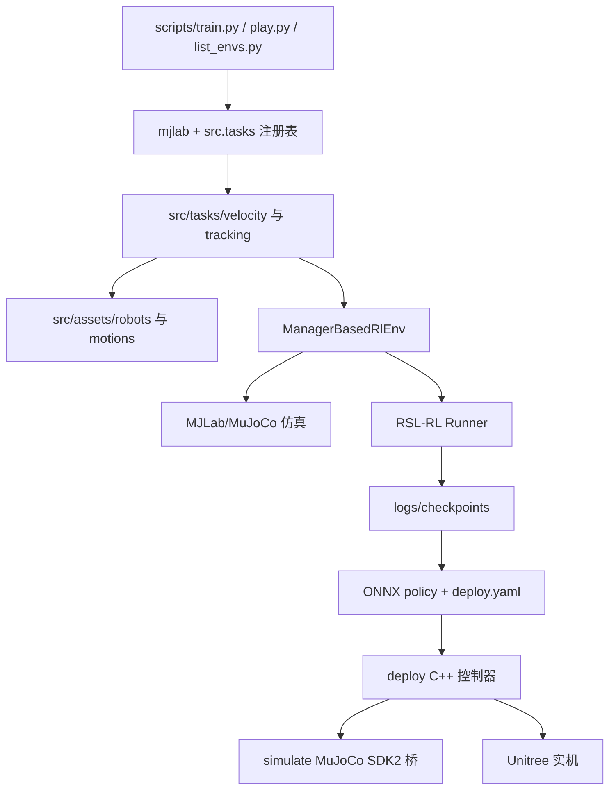
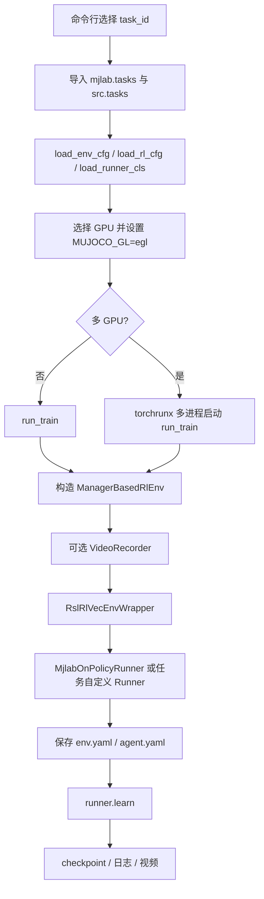
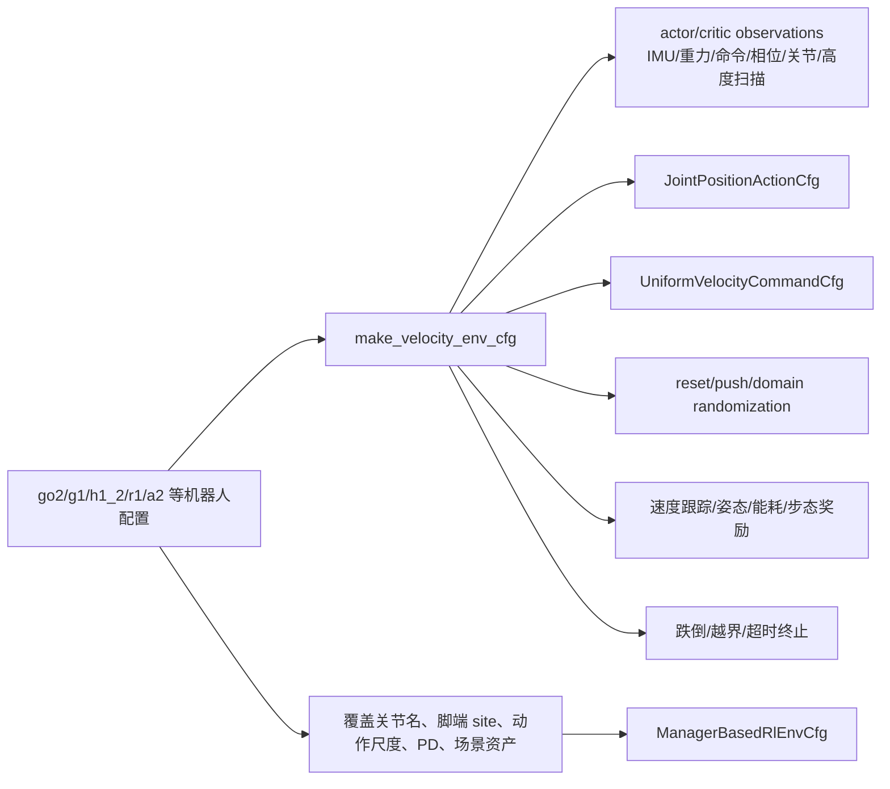
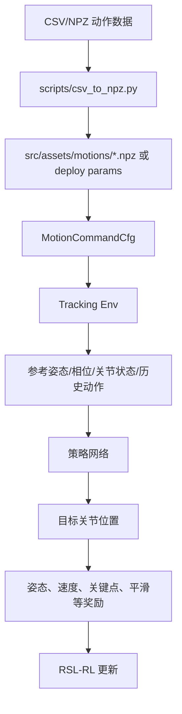
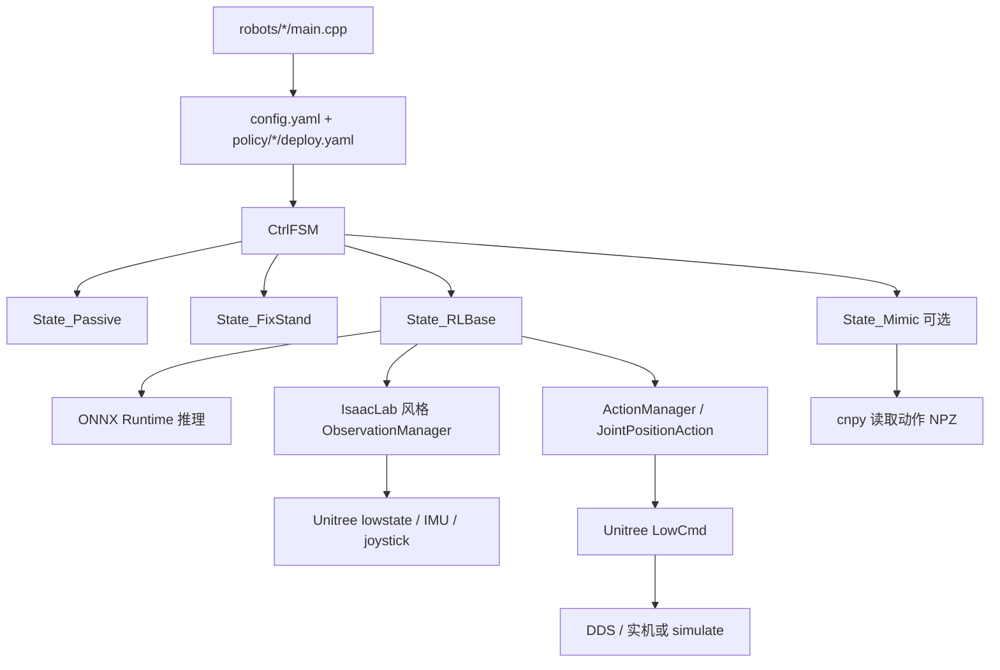
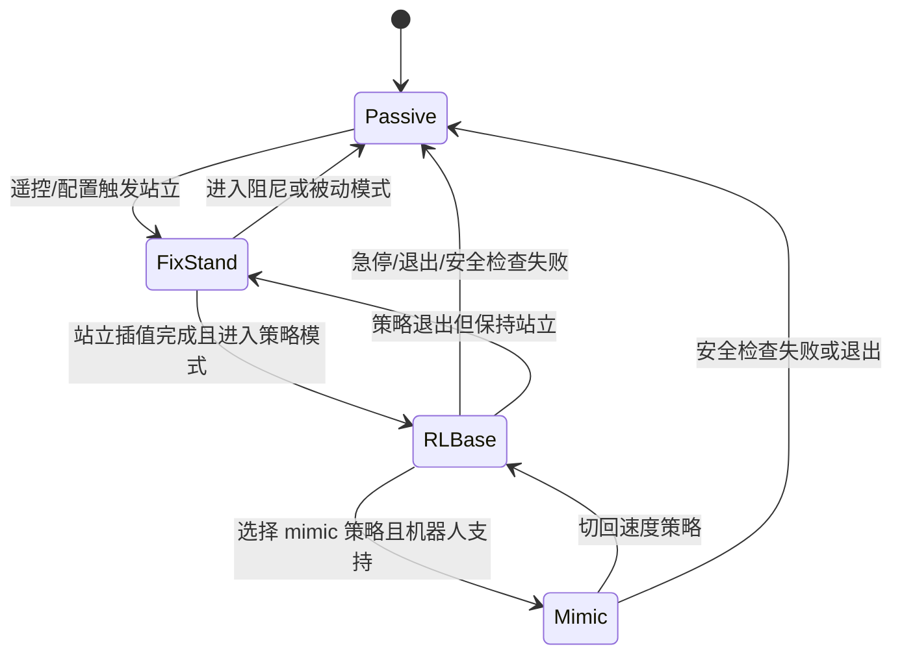
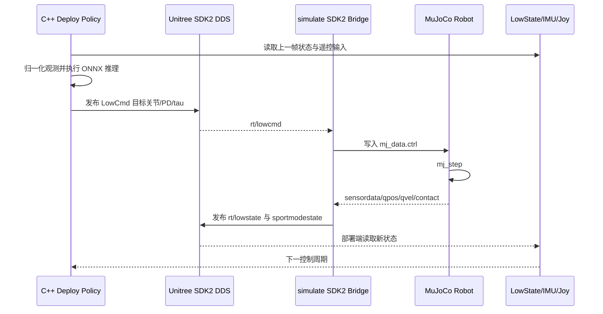

# unitree_rl_mjlab 仓库全量解析

本文档基于本地目录 `/home/helios/unitree/unitree-notes/unitree_rl_mjlab` 静态阅读生成。仓库总计 **743 个文件**，约 **340 MB**。其中核心业务逻辑集中在 Python 训练任务、C++ 部署控制器、MuJoCo 仿真桥接三部分；大量体积来自机器人网格资源、演示 GIF、MuJoCo 发行包、ONNX Runtime 发行包和已导出的策略模型。

## 1. 全量仓库索引表（目录与逐文件作用）

> 本节为 `unitree_rl_mjlab/` 的全量索引，包含目录节点和每一个文件。说明依据文件路径、文件类型以及源码/配置/模型内容生成；源码文件会列出其实际定义的类、函数、API 常量或运行职责。

- 目录数：182
- 文件数：743

| 序号 | 路径 | 类型 | 大小 | 作用说明 |
|---:|---|---|---:|---|
| 1 | `unitree_rl_mjlab` | 目录 | - | 目录节点，包含 181 个子目录、743 个文件，用于组织 unitree_rl_mjlab 相关代码或资源。 |
| 2 | `unitree_rl_mjlab/deploy` | 目录 | - | 目录节点，包含 89 个子目录、126 个文件，用于组织 deploy 相关代码或资源。 |
| 3 | `unitree_rl_mjlab/deploy/include` | 目录 | - | 目录节点，包含 13 个子目录、21 个文件，用于组织 deploy/include 相关代码或资源。 |
| 4 | `unitree_rl_mjlab/deploy/include/FSM` | 目录 | - | 目录节点，包含 0 个子目录、6 个文件，用于组织 deploy/include/FSM 相关代码或资源。 |
| 5 | `unitree_rl_mjlab/deploy/include/isaaclab` | 目录 | - | 目录节点，包含 11 个子目录、11 个文件，用于组织 deploy/include/isaaclab 相关代码或资源。 |
| 6 | `unitree_rl_mjlab/deploy/include/isaaclab/algorithms` | 目录 | - | 目录节点，包含 0 个子目录、1 个文件，用于组织 deploy/include/isaaclab/algorithms 相关代码或资源。 |
| 7 | `unitree_rl_mjlab/deploy/include/isaaclab/assets` | 目录 | - | 目录节点，包含 1 个子目录、1 个文件，用于组织 deploy/include/isaaclab/assets 相关代码或资源。 |
| 8 | `unitree_rl_mjlab/deploy/include/isaaclab/assets/articulation` | 目录 | - | 目录节点，包含 0 个子目录、1 个文件，用于组织 deploy/include/isaaclab/assets/articulation 相关代码或资源。 |
| 9 | `unitree_rl_mjlab/deploy/include/isaaclab/devices` | 目录 | - | 目录节点，包含 1 个子目录、1 个文件，用于组织 deploy/include/isaaclab/devices 相关代码或资源。 |
| 10 | `unitree_rl_mjlab/deploy/include/isaaclab/devices/keyboard` | 目录 | - | 目录节点，包含 0 个子目录、1 个文件，用于组织 deploy/include/isaaclab/devices/keyboard 相关代码或资源。 |
| 11 | `unitree_rl_mjlab/deploy/include/isaaclab/envs` | 目录 | - | 目录节点，包含 3 个子目录、4 个文件，用于组织 deploy/include/isaaclab/envs 相关代码或资源。 |
| 12 | `unitree_rl_mjlab/deploy/include/isaaclab/envs/mdp` | 目录 | - | 目录节点，包含 2 个子目录、3 个文件，用于组织 deploy/include/isaaclab/envs/mdp 相关代码或资源。 |
| 13 | `unitree_rl_mjlab/deploy/include/isaaclab/envs/mdp/actions` | 目录 | - | 目录节点，包含 0 个子目录、1 个文件，用于组织 deploy/include/isaaclab/envs/mdp/actions 相关代码或资源。 |
| 14 | `unitree_rl_mjlab/deploy/include/isaaclab/envs/mdp/observations` | 目录 | - | 目录节点，包含 0 个子目录、1 个文件，用于组织 deploy/include/isaaclab/envs/mdp/observations 相关代码或资源。 |
| 15 | `unitree_rl_mjlab/deploy/include/isaaclab/manager` | 目录 | - | 目录节点，包含 0 个子目录、3 个文件，用于组织 deploy/include/isaaclab/manager 相关代码或资源。 |
| 16 | `unitree_rl_mjlab/deploy/include/isaaclab/utils` | 目录 | - | 目录节点，包含 0 个子目录、1 个文件，用于组织 deploy/include/isaaclab/utils 相关代码或资源。 |
| 17 | `unitree_rl_mjlab/deploy/robots` | 目录 | - | 目录节点，包含 56 个子目录、46 个文件，用于组织 deploy/robots 相关代码或资源。 |
| 18 | `unitree_rl_mjlab/deploy/robots/a2` | 目录 | - | 目录节点，包含 7 个子目录、6 个文件，用于组织 deploy/robots/a2 相关代码或资源。 |
| 19 | `unitree_rl_mjlab/deploy/robots/a2/config` | 目录 | - | 目录节点，包含 4 个子目录、2 个文件，用于组织 deploy/robots/a2/config 相关代码或资源。 |
| 20 | `unitree_rl_mjlab/deploy/robots/a2/config/policy` | 目录 | - | 目录节点，包含 3 个子目录、1 个文件，用于组织 deploy/robots/a2/config/policy 相关代码或资源。 |
| 21 | `unitree_rl_mjlab/deploy/robots/a2/config/policy/velocity` | 目录 | - | 目录节点，包含 2 个子目录、1 个文件，用于组织 deploy/robots/a2/config/policy/velocity 相关代码或资源。 |
| 22 | `unitree_rl_mjlab/deploy/robots/a2/config/policy/velocity/v0` | 目录 | - | 目录节点，包含 1 个子目录、1 个文件，用于组织 deploy/robots/a2/config/policy/velocity/v0 相关代码或资源。 |
| 23 | `unitree_rl_mjlab/deploy/robots/a2/config/policy/velocity/v0/params` | 目录 | - | 目录节点，包含 0 个子目录、1 个文件，用于组织 deploy/robots/a2/config/policy/velocity/v0/params 相关代码或资源。 |
| 24 | `unitree_rl_mjlab/deploy/robots/a2/include` | 目录 | - | 目录节点，包含 0 个子目录、1 个文件，用于组织 deploy/robots/a2/include 相关代码或资源。 |
| 25 | `unitree_rl_mjlab/deploy/robots/a2/src` | 目录 | - | 目录节点，包含 0 个子目录、1 个文件，用于组织 deploy/robots/a2/src 相关代码或资源。 |
| 26 | `unitree_rl_mjlab/deploy/robots/g1` | 目录 | - | 目录节点，包含 12 个子目录、13 个文件，用于组织 deploy/robots/g1 相关代码或资源。 |
| 27 | `unitree_rl_mjlab/deploy/robots/g1/config` | 目录 | - | 目录节点，包含 9 个子目录、7 个文件，用于组织 deploy/robots/g1/config 相关代码或资源。 |
| 28 | `unitree_rl_mjlab/deploy/robots/g1/config/policy` | 目录 | - | 目录节点，包含 8 个子目录、6 个文件，用于组织 deploy/robots/g1/config/policy 相关代码或资源。 |
| 29 | `unitree_rl_mjlab/deploy/robots/g1/config/policy/mimic` | 目录 | - | 目录节点，包含 3 个子目录、4 个文件，用于组织 deploy/robots/g1/config/policy/mimic 相关代码或资源。 |
| 30 | `unitree_rl_mjlab/deploy/robots/g1/config/policy/mimic/dance1_subject2` | 目录 | - | 目录节点，包含 2 个子目录、4 个文件，用于组织 deploy/robots/g1/config/policy/mimic/dance1_subject2 相关代码或资源。 |
| 31 | `unitree_rl_mjlab/deploy/robots/g1/config/policy/mimic/dance1_subject2/exported` | 目录 | - | 目录节点，包含 0 个子目录、2 个文件，用于组织 deploy/robots/g1/config/policy/mimic/dance1_subject2/exported 相关代码或资源。 |
| 32 | `unitree_rl_mjlab/deploy/robots/g1/config/policy/mimic/dance1_subject2/params` | 目录 | - | 目录节点，包含 0 个子目录、2 个文件，用于组织 deploy/robots/g1/config/policy/mimic/dance1_subject2/params 相关代码或资源。 |
| 33 | `unitree_rl_mjlab/deploy/robots/g1/config/policy/velocity` | 目录 | - | 目录节点，包含 3 个子目录、2 个文件，用于组织 deploy/robots/g1/config/policy/velocity 相关代码或资源。 |
| 34 | `unitree_rl_mjlab/deploy/robots/g1/config/policy/velocity/v0` | 目录 | - | 目录节点，包含 2 个子目录、2 个文件，用于组织 deploy/robots/g1/config/policy/velocity/v0 相关代码或资源。 |
| 35 | `unitree_rl_mjlab/deploy/robots/g1/config/policy/velocity/v0/exported` | 目录 | - | 目录节点，包含 0 个子目录、1 个文件，用于组织 deploy/robots/g1/config/policy/velocity/v0/exported 相关代码或资源。 |
| 36 | `unitree_rl_mjlab/deploy/robots/g1/config/policy/velocity/v0/params` | 目录 | - | 目录节点，包含 0 个子目录、1 个文件，用于组织 deploy/robots/g1/config/policy/velocity/v0/params 相关代码或资源。 |
| 37 | `unitree_rl_mjlab/deploy/robots/g1/include` | 目录 | - | 目录节点，包含 0 个子目录、2 个文件，用于组织 deploy/robots/g1/include 相关代码或资源。 |
| 38 | `unitree_rl_mjlab/deploy/robots/g1/src` | 目录 | - | 目录节点，包含 0 个子目录、2 个文件，用于组织 deploy/robots/g1/src 相关代码或资源。 |
| 39 | `unitree_rl_mjlab/deploy/robots/g1_23dof` | 目录 | - | 目录节点，包含 10 个子目录、9 个文件，用于组织 deploy/robots/g1_23dof 相关代码或资源。 |
| 40 | `unitree_rl_mjlab/deploy/robots/g1_23dof/config` | 目录 | - | 目录节点，包含 7 个子目录、3 个文件，用于组织 deploy/robots/g1_23dof/config 相关代码或资源。 |
| 41 | `unitree_rl_mjlab/deploy/robots/g1_23dof/config/policy` | 目录 | - | 目录节点，包含 6 个子目录、2 个文件，用于组织 deploy/robots/g1_23dof/config/policy 相关代码或资源。 |
| 42 | `unitree_rl_mjlab/deploy/robots/g1_23dof/config/policy/mimic` | 目录 | - | 目录节点，包含 2 个子目录、1 个文件，用于组织 deploy/robots/g1_23dof/config/policy/mimic 相关代码或资源。 |
| 43 | `unitree_rl_mjlab/deploy/robots/g1_23dof/config/policy/mimic/dance1_subject2` | 目录 | - | 目录节点，包含 1 个子目录、1 个文件，用于组织 deploy/robots/g1_23dof/config/policy/mimic/dance1_subject2 相关代码或资源。 |
| 44 | `unitree_rl_mjlab/deploy/robots/g1_23dof/config/policy/mimic/dance1_subject2/params` | 目录 | - | 目录节点，包含 0 个子目录、1 个文件，用于组织 deploy/robots/g1_23dof/config/policy/mimic/dance1_subject2/params 相关代码或资源。 |
| 45 | `unitree_rl_mjlab/deploy/robots/g1_23dof/config/policy/velocity` | 目录 | - | 目录节点，包含 2 个子目录、1 个文件，用于组织 deploy/robots/g1_23dof/config/policy/velocity 相关代码或资源。 |
| 46 | `unitree_rl_mjlab/deploy/robots/g1_23dof/config/policy/velocity/v0` | 目录 | - | 目录节点，包含 1 个子目录、1 个文件，用于组织 deploy/robots/g1_23dof/config/policy/velocity/v0 相关代码或资源。 |
| 47 | `unitree_rl_mjlab/deploy/robots/g1_23dof/config/policy/velocity/v0/params` | 目录 | - | 目录节点，包含 0 个子目录、1 个文件，用于组织 deploy/robots/g1_23dof/config/policy/velocity/v0/params 相关代码或资源。 |
| 48 | `unitree_rl_mjlab/deploy/robots/g1_23dof/include` | 目录 | - | 目录节点，包含 0 个子目录、2 个文件，用于组织 deploy/robots/g1_23dof/include 相关代码或资源。 |
| 49 | `unitree_rl_mjlab/deploy/robots/g1_23dof/src` | 目录 | - | 目录节点，包含 0 个子目录、2 个文件，用于组织 deploy/robots/g1_23dof/src 相关代码或资源。 |
| 50 | `unitree_rl_mjlab/deploy/robots/go2` | 目录 | - | 目录节点，包含 7 个子目录、6 个文件，用于组织 deploy/robots/go2 相关代码或资源。 |
| 51 | `unitree_rl_mjlab/deploy/robots/go2/config` | 目录 | - | 目录节点，包含 4 个子目录、2 个文件，用于组织 deploy/robots/go2/config 相关代码或资源。 |
| 52 | `unitree_rl_mjlab/deploy/robots/go2/config/policy` | 目录 | - | 目录节点，包含 3 个子目录、1 个文件，用于组织 deploy/robots/go2/config/policy 相关代码或资源。 |
| 53 | `unitree_rl_mjlab/deploy/robots/go2/config/policy/velocity` | 目录 | - | 目录节点，包含 2 个子目录、1 个文件，用于组织 deploy/robots/go2/config/policy/velocity 相关代码或资源。 |
| 54 | `unitree_rl_mjlab/deploy/robots/go2/config/policy/velocity/v0` | 目录 | - | 目录节点，包含 1 个子目录、1 个文件，用于组织 deploy/robots/go2/config/policy/velocity/v0 相关代码或资源。 |
| 55 | `unitree_rl_mjlab/deploy/robots/go2/config/policy/velocity/v0/params` | 目录 | - | 目录节点，包含 0 个子目录、1 个文件，用于组织 deploy/robots/go2/config/policy/velocity/v0/params 相关代码或资源。 |
| 56 | `unitree_rl_mjlab/deploy/robots/go2/include` | 目录 | - | 目录节点，包含 0 个子目录、1 个文件，用于组织 deploy/robots/go2/include 相关代码或资源。 |
| 57 | `unitree_rl_mjlab/deploy/robots/go2/src` | 目录 | - | 目录节点，包含 0 个子目录、1 个文件，用于组织 deploy/robots/go2/src 相关代码或资源。 |
| 58 | `unitree_rl_mjlab/deploy/robots/h1_2` | 目录 | - | 目录节点，包含 7 个子目录、6 个文件，用于组织 deploy/robots/h1_2 相关代码或资源。 |
| 59 | `unitree_rl_mjlab/deploy/robots/h1_2/config` | 目录 | - | 目录节点，包含 4 个子目录、2 个文件，用于组织 deploy/robots/h1_2/config 相关代码或资源。 |
| 60 | `unitree_rl_mjlab/deploy/robots/h1_2/config/policy` | 目录 | - | 目录节点，包含 3 个子目录、1 个文件，用于组织 deploy/robots/h1_2/config/policy 相关代码或资源。 |
| 61 | `unitree_rl_mjlab/deploy/robots/h1_2/config/policy/velocity` | 目录 | - | 目录节点，包含 2 个子目录、1 个文件，用于组织 deploy/robots/h1_2/config/policy/velocity 相关代码或资源。 |
| 62 | `unitree_rl_mjlab/deploy/robots/h1_2/config/policy/velocity/v0` | 目录 | - | 目录节点，包含 1 个子目录、1 个文件，用于组织 deploy/robots/h1_2/config/policy/velocity/v0 相关代码或资源。 |
| 63 | `unitree_rl_mjlab/deploy/robots/h1_2/config/policy/velocity/v0/params` | 目录 | - | 目录节点，包含 0 个子目录、1 个文件，用于组织 deploy/robots/h1_2/config/policy/velocity/v0/params 相关代码或资源。 |
| 64 | `unitree_rl_mjlab/deploy/robots/h1_2/include` | 目录 | - | 目录节点，包含 0 个子目录、1 个文件，用于组织 deploy/robots/h1_2/include 相关代码或资源。 |
| 65 | `unitree_rl_mjlab/deploy/robots/h1_2/src` | 目录 | - | 目录节点，包含 0 个子目录、1 个文件，用于组织 deploy/robots/h1_2/src 相关代码或资源。 |
| 66 | `unitree_rl_mjlab/deploy/robots/r1` | 目录 | - | 目录节点，包含 7 个子目录、6 个文件，用于组织 deploy/robots/r1 相关代码或资源。 |
| 67 | `unitree_rl_mjlab/deploy/robots/r1/config` | 目录 | - | 目录节点，包含 4 个子目录、2 个文件，用于组织 deploy/robots/r1/config 相关代码或资源。 |
| 68 | `unitree_rl_mjlab/deploy/robots/r1/config/policy` | 目录 | - | 目录节点，包含 3 个子目录、1 个文件，用于组织 deploy/robots/r1/config/policy 相关代码或资源。 |
| 69 | `unitree_rl_mjlab/deploy/robots/r1/config/policy/velocity` | 目录 | - | 目录节点，包含 2 个子目录、1 个文件，用于组织 deploy/robots/r1/config/policy/velocity 相关代码或资源。 |
| 70 | `unitree_rl_mjlab/deploy/robots/r1/config/policy/velocity/v0` | 目录 | - | 目录节点，包含 1 个子目录、1 个文件，用于组织 deploy/robots/r1/config/policy/velocity/v0 相关代码或资源。 |
| 71 | `unitree_rl_mjlab/deploy/robots/r1/config/policy/velocity/v0/params` | 目录 | - | 目录节点，包含 0 个子目录、1 个文件，用于组织 deploy/robots/r1/config/policy/velocity/v0/params 相关代码或资源。 |
| 72 | `unitree_rl_mjlab/deploy/robots/r1/include` | 目录 | - | 目录节点，包含 0 个子目录、1 个文件，用于组织 deploy/robots/r1/include 相关代码或资源。 |
| 73 | `unitree_rl_mjlab/deploy/robots/r1/src` | 目录 | - | 目录节点，包含 0 个子目录、1 个文件，用于组织 deploy/robots/r1/src 相关代码或资源。 |
| 74 | `unitree_rl_mjlab/deploy/thirdparty` | 目录 | - | 目录节点，包含 17 个子目录、59 个文件，用于组织 deploy/thirdparty 相关代码或资源。 |
| 75 | `unitree_rl_mjlab/deploy/thirdparty/cnpy` | 目录 | - | 目录节点，包含 0 个子目录、9 个文件，用于组织 deploy/thirdparty/cnpy 相关代码或资源。 |
| 76 | `unitree_rl_mjlab/deploy/thirdparty/onnxruntime-linux-aarch64-1.22.0` | 目录 | - | 目录节点，包含 7 个子目录、26 个文件，用于组织 deploy/thirdparty/onnxruntime-linux-aarch64-1.22.0 相关代码或资源。 |
| 77 | `unitree_rl_mjlab/deploy/thirdparty/onnxruntime-linux-aarch64-1.22.0/include` | 目录 | - | 目录节点，包含 2 个子目录、11 个文件，用于组织 deploy/thirdparty/onnxruntime-linux-aarch64-1.22.0/include 相关代码或资源。 |
| 78 | `unitree_rl_mjlab/deploy/thirdparty/onnxruntime-linux-aarch64-1.22.0/include/core` | 目录 | - | 目录节点，包含 1 个子目录、2 个文件，用于组织 deploy/thirdparty/onnxruntime-linux-aarch64-1.22.0/include/core 相关代码或资源。 |
| 79 | `unitree_rl_mjlab/deploy/thirdparty/onnxruntime-linux-aarch64-1.22.0/include/core/providers` | 目录 | - | 目录节点，包含 0 个子目录、2 个文件，用于组织 deploy/thirdparty/onnxruntime-linux-aarch64-1.22.0/include/core/providers 相关代码或资源。 |
| 80 | `unitree_rl_mjlab/deploy/thirdparty/onnxruntime-linux-aarch64-1.22.0/lib` | 目录 | - | 目录节点，包含 3 个子目录、9 个文件，用于组织 deploy/thirdparty/onnxruntime-linux-aarch64-1.22.0/lib 相关代码或资源。 |
| 81 | `unitree_rl_mjlab/deploy/thirdparty/onnxruntime-linux-aarch64-1.22.0/lib/cmake` | 目录 | - | 目录节点，包含 1 个子目录、4 个文件，用于组织 deploy/thirdparty/onnxruntime-linux-aarch64-1.22.0/lib/cmake 相关代码或资源。 |
| 82 | `unitree_rl_mjlab/deploy/thirdparty/onnxruntime-linux-aarch64-1.22.0/lib/cmake/onnxruntime` | 目录 | - | 目录节点，包含 0 个子目录、4 个文件，用于组织 deploy/thirdparty/onnxruntime-linux-aarch64-1.22.0/lib/cmake/onnxruntime 相关代码或资源。 |
| 83 | `unitree_rl_mjlab/deploy/thirdparty/onnxruntime-linux-aarch64-1.22.0/lib/pkgconfig` | 目录 | - | 目录节点，包含 0 个子目录、1 个文件，用于组织 deploy/thirdparty/onnxruntime-linux-aarch64-1.22.0/lib/pkgconfig 相关代码或资源。 |
| 84 | `unitree_rl_mjlab/deploy/thirdparty/onnxruntime-linux-x64-1.22.0` | 目录 | - | 目录节点，包含 7 个子目录、24 个文件，用于组织 deploy/thirdparty/onnxruntime-linux-x64-1.22.0 相关代码或资源。 |
| 85 | `unitree_rl_mjlab/deploy/thirdparty/onnxruntime-linux-x64-1.22.0/include` | 目录 | - | 目录节点，包含 2 个子目录、11 个文件，用于组织 deploy/thirdparty/onnxruntime-linux-x64-1.22.0/include 相关代码或资源。 |
| 86 | `unitree_rl_mjlab/deploy/thirdparty/onnxruntime-linux-x64-1.22.0/include/core` | 目录 | - | 目录节点，包含 1 个子目录、2 个文件，用于组织 deploy/thirdparty/onnxruntime-linux-x64-1.22.0/include/core 相关代码或资源。 |
| 87 | `unitree_rl_mjlab/deploy/thirdparty/onnxruntime-linux-x64-1.22.0/include/core/providers` | 目录 | - | 目录节点，包含 0 个子目录、2 个文件，用于组织 deploy/thirdparty/onnxruntime-linux-x64-1.22.0/include/core/providers 相关代码或资源。 |
| 88 | `unitree_rl_mjlab/deploy/thirdparty/onnxruntime-linux-x64-1.22.0/lib` | 目录 | - | 目录节点，包含 3 个子目录、7 个文件，用于组织 deploy/thirdparty/onnxruntime-linux-x64-1.22.0/lib 相关代码或资源。 |
| 89 | `unitree_rl_mjlab/deploy/thirdparty/onnxruntime-linux-x64-1.22.0/lib/cmake` | 目录 | - | 目录节点，包含 1 个子目录、4 个文件，用于组织 deploy/thirdparty/onnxruntime-linux-x64-1.22.0/lib/cmake 相关代码或资源。 |
| 90 | `unitree_rl_mjlab/deploy/thirdparty/onnxruntime-linux-x64-1.22.0/lib/cmake/onnxruntime` | 目录 | - | 目录节点，包含 0 个子目录、4 个文件，用于组织 deploy/thirdparty/onnxruntime-linux-x64-1.22.0/lib/cmake/onnxruntime 相关代码或资源。 |
| 91 | `unitree_rl_mjlab/deploy/thirdparty/onnxruntime-linux-x64-1.22.0/lib/pkgconfig` | 目录 | - | 目录节点，包含 0 个子目录、1 个文件，用于组织 deploy/thirdparty/onnxruntime-linux-x64-1.22.0/lib/pkgconfig 相关代码或资源。 |
| 92 | `unitree_rl_mjlab/doc` | 目录 | - | 目录节点，包含 2 个子目录、13 个文件，用于组织 doc 相关代码或资源。 |
| 93 | `unitree_rl_mjlab/doc/gif` | 目录 | - | 目录节点，包含 0 个子目录、8 个文件，用于组织 doc/gif 相关代码或资源。 |
| 94 | `unitree_rl_mjlab/doc/license` | 目录 | - | 目录节点，包含 0 个子目录、3 个文件，用于组织 doc/license 相关代码或资源。 |
| 95 | `unitree_rl_mjlab/scripts` | 目录 | - | 目录节点，包含 0 个子目录、5 个文件，用于组织 scripts 相关代码或资源。 |
| 96 | `unitree_rl_mjlab/simulate` | 目录 | - | 目录节点，包含 40 个子目录、253 个文件，用于组织 simulate 相关代码或资源。 |
| 97 | `unitree_rl_mjlab/simulate/mujoco` | 目录 | - | 目录节点，包含 36 个子目录、238 个文件，用于组织 simulate/mujoco 相关代码或资源。 |
| 98 | `unitree_rl_mjlab/simulate/mujoco/bin` | 目录 | - | 目录节点，包含 1 个子目录、9 个文件，用于组织 simulate/mujoco/bin 相关代码或资源。 |
| 99 | `unitree_rl_mjlab/simulate/mujoco/bin/mujoco_plugin` | 目录 | - | 目录节点，包含 0 个子目录、4 个文件，用于组织 simulate/mujoco/bin/mujoco_plugin 相关代码或资源。 |
| 100 | `unitree_rl_mjlab/simulate/mujoco/include` | 目录 | - | 目录节点，包含 4 个子目录、29 个文件，用于组织 simulate/mujoco/include 相关代码或资源。 |
| 101 | `unitree_rl_mjlab/simulate/mujoco/include/mujoco` | 目录 | - | 目录节点，包含 3 个子目录、29 个文件，用于组织 simulate/mujoco/include/mujoco 相关代码或资源。 |
| 102 | `unitree_rl_mjlab/simulate/mujoco/include/mujoco/experimental` | 目录 | - | 目录节点，包含 2 个子目录、15 个文件，用于组织 simulate/mujoco/include/mujoco/experimental 相关代码或资源。 |
| 103 | `unitree_rl_mjlab/simulate/mujoco/include/mujoco/experimental/usd` | 目录 | - | 目录节点，包含 1 个子目录、15 个文件，用于组织 simulate/mujoco/include/mujoco/experimental/usd 相关代码或资源。 |
| 104 | `unitree_rl_mjlab/simulate/mujoco/include/mujoco/experimental/usd/mjcPhysics` | 目录 | - | 目录节点，包含 0 个子目录、11 个文件，用于组织 simulate/mujoco/include/mujoco/experimental/usd/mjcPhysics 相关代码或资源。 |
| 105 | `unitree_rl_mjlab/simulate/mujoco/lib` | 目录 | - | 目录节点，包含 0 个子目录、2 个文件，用于组织 simulate/mujoco/lib 相关代码或资源。 |
| 106 | `unitree_rl_mjlab/simulate/mujoco/model` | 目录 | - | 目录节点，包含 23 个子目录、165 个文件，用于组织 simulate/mujoco/model 相关代码或资源。 |
| 107 | `unitree_rl_mjlab/simulate/mujoco/model/adhesion` | 目录 | - | 目录节点，包含 0 个子目录、2 个文件，用于组织 simulate/mujoco/model/adhesion 相关代码或资源。 |
| 108 | `unitree_rl_mjlab/simulate/mujoco/model/balloons` | 目录 | - | 目录节点，包含 0 个子目录、1 个文件，用于组织 simulate/mujoco/model/balloons 相关代码或资源。 |
| 109 | `unitree_rl_mjlab/simulate/mujoco/model/car` | 目录 | - | 目录节点，包含 0 个子目录、1 个文件，用于组织 simulate/mujoco/model/car 相关代码或资源。 |
| 110 | `unitree_rl_mjlab/simulate/mujoco/model/cards` | 目录 | - | 目录节点，包含 1 个子目录、56 个文件，用于组织 simulate/mujoco/model/cards 相关代码或资源。 |
| 111 | `unitree_rl_mjlab/simulate/mujoco/model/cards/assets` | 目录 | - | 目录节点，包含 0 个子目录、55 个文件，用于组织 simulate/mujoco/model/cards/assets 相关代码或资源。 |
| 112 | `unitree_rl_mjlab/simulate/mujoco/model/cube` | 目录 | - | 目录节点，包含 1 个子目录、29 个文件，用于组织 simulate/mujoco/model/cube 相关代码或资源。 |
| 113 | `unitree_rl_mjlab/simulate/mujoco/model/cube/assets` | 目录 | - | 目录节点，包含 0 个子目录、27 个文件，用于组织 simulate/mujoco/model/cube/assets 相关代码或资源。 |
| 114 | `unitree_rl_mjlab/simulate/mujoco/model/flex` | 目录 | - | 目录节点，包含 1 个子目录、27 个文件，用于组织 simulate/mujoco/model/flex 相关代码或资源。 |
| 115 | `unitree_rl_mjlab/simulate/mujoco/model/flex/asset` | 目录 | - | 目录节点，包含 0 个子目录、4 个文件，用于组织 simulate/mujoco/model/flex/asset 相关代码或资源。 |
| 116 | `unitree_rl_mjlab/simulate/mujoco/model/hammock` | 目录 | - | 目录节点，包含 0 个子目录、1 个文件，用于组织 simulate/mujoco/model/hammock 相关代码或资源。 |
| 117 | `unitree_rl_mjlab/simulate/mujoco/model/humanoid` | 目录 | - | 目录节点，包含 0 个子目录、6 个文件，用于组织 simulate/mujoco/model/humanoid 相关代码或资源。 |
| 118 | `unitree_rl_mjlab/simulate/mujoco/model/mug` | 目录 | - | 目录节点，包含 0 个子目录、3 个文件，用于组织 simulate/mujoco/model/mug 相关代码或资源。 |
| 119 | `unitree_rl_mjlab/simulate/mujoco/model/plugin` | 目录 | - | 目录节点，包含 5 个子目录、20 个文件，用于组织 simulate/mujoco/model/plugin 相关代码或资源。 |
| 120 | `unitree_rl_mjlab/simulate/mujoco/model/plugin/actuator` | 目录 | - | 目录节点，包含 0 个子目录、1 个文件，用于组织 simulate/mujoco/model/plugin/actuator 相关代码或资源。 |
| 121 | `unitree_rl_mjlab/simulate/mujoco/model/plugin/elasticity` | 目录 | - | 目录节点，包含 0 个子目录、4 个文件，用于组织 simulate/mujoco/model/plugin/elasticity 相关代码或资源。 |
| 122 | `unitree_rl_mjlab/simulate/mujoco/model/plugin/sdf` | 目录 | - | 目录节点，包含 1 个子目录、13 个文件，用于组织 simulate/mujoco/model/plugin/sdf 相关代码或资源。 |
| 123 | `unitree_rl_mjlab/simulate/mujoco/model/plugin/sdf/asset` | 目录 | - | 目录节点，包含 0 个子目录、4 个文件，用于组织 simulate/mujoco/model/plugin/sdf/asset 相关代码或资源。 |
| 124 | `unitree_rl_mjlab/simulate/mujoco/model/plugin/sensor` | 目录 | - | 目录节点，包含 0 个子目录、2 个文件，用于组织 simulate/mujoco/model/plugin/sensor 相关代码或资源。 |
| 125 | `unitree_rl_mjlab/simulate/mujoco/model/replicate` | 目录 | - | 目录节点，包含 1 个子目录、16 个文件，用于组织 simulate/mujoco/model/replicate 相关代码或资源。 |
| 126 | `unitree_rl_mjlab/simulate/mujoco/model/replicate/asset` | 目录 | - | 目录节点，包含 0 个子目录、1 个文件，用于组织 simulate/mujoco/model/replicate/asset 相关代码或资源。 |
| 127 | `unitree_rl_mjlab/simulate/mujoco/model/slider_crank` | 目录 | - | 目录节点，包含 0 个子目录、1 个文件，用于组织 simulate/mujoco/model/slider_crank 相关代码或资源。 |
| 128 | `unitree_rl_mjlab/simulate/mujoco/model/tactile` | 目录 | - | 目录节点，包含 0 个子目录、1 个文件，用于组织 simulate/mujoco/model/tactile 相关代码或资源。 |
| 129 | `unitree_rl_mjlab/simulate/mujoco/model/tendon_arm` | 目录 | - | 目录节点，包含 0 个子目录、1 个文件，用于组织 simulate/mujoco/model/tendon_arm 相关代码或资源。 |
| 130 | `unitree_rl_mjlab/simulate/mujoco/sample` | 目录 | - | 目录节点，包含 1 个子目录、12 个文件，用于组织 simulate/mujoco/sample 相关代码或资源。 |
| 131 | `unitree_rl_mjlab/simulate/mujoco/sample/cmake` | 目录 | - | 目录节点，包含 0 个子目录、7 个文件，用于组织 simulate/mujoco/sample/cmake 相关代码或资源。 |
| 132 | `unitree_rl_mjlab/simulate/mujoco/simulate` | 目录 | - | 目录节点，包含 1 个子目录、20 个文件，用于组织 simulate/mujoco/simulate 相关代码或资源。 |
| 133 | `unitree_rl_mjlab/simulate/mujoco/simulate/cmake` | 目录 | - | 目录节点，包含 0 个子目录、7 个文件，用于组织 simulate/mujoco/simulate/cmake 相关代码或资源。 |
| 134 | `unitree_rl_mjlab/simulate/src` | 目录 | - | 目录节点，包含 2 个子目录、13 个文件，用于组织 simulate/src 相关代码或资源。 |
| 135 | `unitree_rl_mjlab/simulate/src/joystick` | 目录 | - | 目录节点，包含 0 个子目录、5 个文件，用于组织 simulate/src/joystick 相关代码或资源。 |
| 136 | `unitree_rl_mjlab/simulate/src/lodepng` | 目录 | - | 目录节点，包含 0 个子目录、4 个文件，用于组织 simulate/src/lodepng 相关代码或资源。 |
| 137 | `unitree_rl_mjlab/src` | 目录 | - | 目录节点，包含 45 个子目录、341 个文件，用于组织 src 相关代码或资源。 |
| 138 | `unitree_rl_mjlab/src/assets` | 目录 | - | 目录节点，包含 25 个子目录、287 个文件，用于组织 src/assets 相关代码或资源。 |
| 139 | `unitree_rl_mjlab/src/assets/motions` | 目录 | - | 目录节点，包含 2 个子目录、3 个文件，用于组织 src/assets/motions 相关代码或资源。 |
| 140 | `unitree_rl_mjlab/src/assets/motions/g1` | 目录 | - | 目录节点，包含 0 个子目录、1 个文件，用于组织 src/assets/motions/g1 相关代码或资源。 |
| 141 | `unitree_rl_mjlab/src/assets/motions/g1_23dof` | 目录 | - | 目录节点，包含 0 个子目录、1 个文件，用于组织 src/assets/motions/g1_23dof 相关代码或资源。 |
| 142 | `unitree_rl_mjlab/src/assets/robots` | 目录 | - | 目录节点，包含 21 个子目录、283 个文件，用于组织 src/assets/robots 相关代码或资源。 |
| 143 | `unitree_rl_mjlab/src/assets/robots/unitree_a2` | 目录 | - | 目录节点，包含 2 个子目录、21 个文件，用于组织 src/assets/robots/unitree_a2 相关代码或资源。 |
| 144 | `unitree_rl_mjlab/src/assets/robots/unitree_a2/xmls` | 目录 | - | 目录节点，包含 1 个子目录、19 个文件，用于组织 src/assets/robots/unitree_a2/xmls 相关代码或资源。 |
| 145 | `unitree_rl_mjlab/src/assets/robots/unitree_a2/xmls/assets` | 目录 | - | 目录节点，包含 0 个子目录、17 个文件，用于组织 src/assets/robots/unitree_a2/xmls/assets 相关代码或资源。 |
| 146 | `unitree_rl_mjlab/src/assets/robots/unitree_as2` | 目录 | - | 目录节点，包含 2 个子目录、21 个文件，用于组织 src/assets/robots/unitree_as2 相关代码或资源。 |
| 147 | `unitree_rl_mjlab/src/assets/robots/unitree_as2/xmls` | 目录 | - | 目录节点，包含 1 个子目录、19 个文件，用于组织 src/assets/robots/unitree_as2/xmls 相关代码或资源。 |
| 148 | `unitree_rl_mjlab/src/assets/robots/unitree_as2/xmls/assets` | 目录 | - | 目录节点，包含 0 个子目录、18 个文件，用于组织 src/assets/robots/unitree_as2/xmls/assets 相关代码或资源。 |
| 149 | `unitree_rl_mjlab/src/assets/robots/unitree_g1` | 目录 | - | 目录节点，包含 2 个子目录、45 个文件，用于组织 src/assets/robots/unitree_g1 相关代码或资源。 |
| 150 | `unitree_rl_mjlab/src/assets/robots/unitree_g1/xmls` | 目录 | - | 目录节点，包含 1 个子目录、42 个文件，用于组织 src/assets/robots/unitree_g1/xmls 相关代码或资源。 |
| 151 | `unitree_rl_mjlab/src/assets/robots/unitree_g1/xmls/assets` | 目录 | - | 目录节点，包含 0 个子目录、38 个文件，用于组织 src/assets/robots/unitree_g1/xmls/assets 相关代码或资源。 |
| 152 | `unitree_rl_mjlab/src/assets/robots/unitree_go2` | 目录 | - | 目录节点，包含 2 个子目录、20 个文件，用于组织 src/assets/robots/unitree_go2 相关代码或资源。 |
| 153 | `unitree_rl_mjlab/src/assets/robots/unitree_go2/xmls` | 目录 | - | 目录节点，包含 1 个子目录、18 个文件，用于组织 src/assets/robots/unitree_go2/xmls 相关代码或资源。 |
| 154 | `unitree_rl_mjlab/src/assets/robots/unitree_go2/xmls/assets` | 目录 | - | 目录节点，包含 0 个子目录、16 个文件，用于组织 src/assets/robots/unitree_go2/xmls/assets 相关代码或资源。 |
| 155 | `unitree_rl_mjlab/src/assets/robots/unitree_h1_2` | 目录 | - | 目录节点，包含 2 个子目录、94 个文件，用于组织 src/assets/robots/unitree_h1_2 相关代码或资源。 |
| 156 | `unitree_rl_mjlab/src/assets/robots/unitree_h1_2/xmls` | 目录 | - | 目录节点，包含 1 个子目录、92 个文件，用于组织 src/assets/robots/unitree_h1_2/xmls 相关代码或资源。 |
| 157 | `unitree_rl_mjlab/src/assets/robots/unitree_h1_2/xmls/assets` | 目录 | - | 目录节点，包含 0 个子目录、90 个文件，用于组织 src/assets/robots/unitree_h1_2/xmls/assets 相关代码或资源。 |
| 158 | `unitree_rl_mjlab/src/assets/robots/unitree_h2` | 目录 | - | 目录节点，包含 2 个子目录、35 个文件，用于组织 src/assets/robots/unitree_h2 相关代码或资源。 |
| 159 | `unitree_rl_mjlab/src/assets/robots/unitree_h2/xmls` | 目录 | - | 目录节点，包含 1 个子目录、33 个文件，用于组织 src/assets/robots/unitree_h2/xmls 相关代码或资源。 |
| 160 | `unitree_rl_mjlab/src/assets/robots/unitree_h2/xmls/assets` | 目录 | - | 目录节点，包含 0 个子目录、32 个文件，用于组织 src/assets/robots/unitree_h2/xmls/assets 相关代码或资源。 |
| 161 | `unitree_rl_mjlab/src/assets/robots/unitree_r1` | 目录 | - | 目录节点，包含 2 个子目录、46 个文件，用于组织 src/assets/robots/unitree_r1 相关代码或资源。 |
| 162 | `unitree_rl_mjlab/src/assets/robots/unitree_r1/xmls` | 目录 | - | 目录节点，包含 1 个子目录、44 个文件，用于组织 src/assets/robots/unitree_r1/xmls 相关代码或资源。 |
| 163 | `unitree_rl_mjlab/src/assets/robots/unitree_r1/xmls/assets` | 目录 | - | 目录节点，包含 0 个子目录、43 个文件，用于组织 src/assets/robots/unitree_r1/xmls/assets 相关代码或资源。 |
| 164 | `unitree_rl_mjlab/src/tasks` | 目录 | - | 目录节点，包含 18 个子目录、53 个文件，用于组织 src/tasks 相关代码或资源。 |
| 165 | `unitree_rl_mjlab/src/tasks/tracking` | 目录 | - | 目录节点，包含 5 个子目录、17 个文件，用于组织 src/tasks/tracking 相关代码或资源。 |
| 166 | `unitree_rl_mjlab/src/tasks/tracking/config` | 目录 | - | 目录节点，包含 2 个子目录、7 个文件，用于组织 src/tasks/tracking/config 相关代码或资源。 |
| 167 | `unitree_rl_mjlab/src/tasks/tracking/config/g1` | 目录 | - | 目录节点，包含 0 个子目录、3 个文件，用于组织 src/tasks/tracking/config/g1 相关代码或资源。 |
| 168 | `unitree_rl_mjlab/src/tasks/tracking/config/g1_23dof` | 目录 | - | 目录节点，包含 0 个子目录、3 个文件，用于组织 src/tasks/tracking/config/g1_23dof 相关代码或资源。 |
| 169 | `unitree_rl_mjlab/src/tasks/tracking/mdp` | 目录 | - | 目录节点，包含 0 个子目录、6 个文件，用于组织 src/tasks/tracking/mdp 相关代码或资源。 |
| 170 | `unitree_rl_mjlab/src/tasks/tracking/rl` | 目录 | - | 目录节点，包含 0 个子目录、2 个文件，用于组织 src/tasks/tracking/rl 相关代码或资源。 |
| 171 | `unitree_rl_mjlab/src/tasks/velocity` | 目录 | - | 目录节点，包含 11 个子目录、35 个文件，用于组织 src/tasks/velocity 相关代码或资源。 |
| 172 | `unitree_rl_mjlab/src/tasks/velocity/config` | 目录 | - | 目录节点，包含 8 个子目录、25 个文件，用于组织 src/tasks/velocity/config 相关代码或资源。 |
| 173 | `unitree_rl_mjlab/src/tasks/velocity/config/a2` | 目录 | - | 目录节点，包含 0 个子目录、3 个文件，用于组织 src/tasks/velocity/config/a2 相关代码或资源。 |
| 174 | `unitree_rl_mjlab/src/tasks/velocity/config/as2` | 目录 | - | 目录节点，包含 0 个子目录、3 个文件，用于组织 src/tasks/velocity/config/as2 相关代码或资源。 |
| 175 | `unitree_rl_mjlab/src/tasks/velocity/config/g1` | 目录 | - | 目录节点，包含 0 个子目录、3 个文件，用于组织 src/tasks/velocity/config/g1 相关代码或资源。 |
| 176 | `unitree_rl_mjlab/src/tasks/velocity/config/g1_23dof` | 目录 | - | 目录节点，包含 0 个子目录、3 个文件，用于组织 src/tasks/velocity/config/g1_23dof 相关代码或资源。 |
| 177 | `unitree_rl_mjlab/src/tasks/velocity/config/go2` | 目录 | - | 目录节点，包含 0 个子目录、3 个文件，用于组织 src/tasks/velocity/config/go2 相关代码或资源。 |
| 178 | `unitree_rl_mjlab/src/tasks/velocity/config/h1_2` | 目录 | - | 目录节点，包含 0 个子目录、3 个文件，用于组织 src/tasks/velocity/config/h1_2 相关代码或资源。 |
| 179 | `unitree_rl_mjlab/src/tasks/velocity/config/h2` | 目录 | - | 目录节点，包含 0 个子目录、3 个文件，用于组织 src/tasks/velocity/config/h2 相关代码或资源。 |
| 180 | `unitree_rl_mjlab/src/tasks/velocity/config/r1` | 目录 | - | 目录节点，包含 0 个子目录、3 个文件，用于组织 src/tasks/velocity/config/r1 相关代码或资源。 |
| 181 | `unitree_rl_mjlab/src/tasks/velocity/mdp` | 目录 | - | 目录节点，包含 0 个子目录、6 个文件，用于组织 src/tasks/velocity/mdp 相关代码或资源。 |
| 182 | `unitree_rl_mjlab/src/tasks/velocity/rl` | 目录 | - | 目录节点，包含 0 个子目录、2 个文件，用于组织 src/tasks/velocity/rl 相关代码或资源。 |
| 183 | `unitree_rl_mjlab/.gitignore` | 项目文件 | 254 B | Git 忽略规则，排除构建产物、缓存、日志、二进制临时文件或本地环境文件。 |
| 184 | `unitree_rl_mjlab/LICENCE` | 文本/许可文件 | 11.1 KB | 许可文本，声明本仓库或第三方组件的授权条款。 |
| 185 | `unitree_rl_mjlab/README.md` | Markdown文档 | 9.0 KB | Markdown 文档《Unitree RL Mjlab》，记录安装、使用、模型说明、接口约定或第三方组件说明。 |
| 186 | `unitree_rl_mjlab/README_zh.md` | Markdown文档 | 9.4 KB | Markdown 文档《Unitree RL Mjlab》，记录安装、使用、模型说明、接口约定或第三方组件说明。 |
| 187 | `unitree_rl_mjlab/deploy/include/FSM/BaseState.h` | C/C++头文件 | 1.7 KB | 部署有限状态机源码/头文件，定义 BaseState、__registrar_，实现 enter/run/exit、状态注册、状态切换检查和控制周期调度。 |
| 188 | `unitree_rl_mjlab/deploy/include/FSM/CtrlFSM.h` | C/C++头文件 | 3.3 KB | 部署有限状态机源码/头文件，定义 CtrlFSM，实现 enter/run/exit、状态注册、状态切换检查和控制周期调度。 |
| 189 | `unitree_rl_mjlab/deploy/include/FSM/FSMState.h` | C/C++头文件 | 2.0 KB | 部署有限状态机源码/头文件，定义 FSMState，实现 enter/run/exit、状态注册、状态切换检查和控制周期调度。 |
| 190 | `unitree_rl_mjlab/deploy/include/FSM/State_FixStand.h` | C/C++头文件 | 1.6 KB | 部署有限状态机源码/头文件，定义 State_FixStand，实现 enter/run/exit、状态注册、状态切换检查和控制周期调度。 |
| 191 | `unitree_rl_mjlab/deploy/include/FSM/State_Passive.h` | C/C++头文件 | 1.2 KB | 部署有限状态机源码/头文件，定义 State_Passive，实现 enter/run/exit、状态注册、状态切换检查和控制周期调度。 |
| 192 | `unitree_rl_mjlab/deploy/include/FSM/State_RLBase.h` | C/C++头文件 | 1.7 KB | 部署有限状态机源码/头文件，定义 State_RLBase，实现 enter/run/exit、状态注册、状态切换检查和控制周期调度。 |
| 193 | `unitree_rl_mjlab/deploy/include/LinearInterpolator.h` | C/C++头文件 | 952 B | C/C++ 源码或头文件，主要定义/实现 linear_interpolate，参与构建、部署控制、仿真桥接或数据结构声明。 |
| 194 | `unitree_rl_mjlab/deploy/include/isaaclab/algorithms/algorithms.h` | C/C++头文件 | 3.5 KB | C++ 部署端复刻 IsaacLab/MJLab 的配置和管理器抽象，定义 Algorithms、OrtRunner，用于在 ONNX 推理前复现 observation/action/termination 逻辑。 |
| 195 | `unitree_rl_mjlab/deploy/include/isaaclab/assets/articulation/articulation.h` | C/C++头文件 | 1.1 KB | C++ 部署端复刻 IsaacLab/MJLab 的配置和管理器抽象，定义 MotionLoader、Articulation、ArticulationData，用于在 ONNX 推理前复现 observation/action/termination 逻辑。 |
| 196 | `unitree_rl_mjlab/deploy/include/isaaclab/devices/keyboard/keyboard.h` | C/C++头文件 | 3.1 KB | C++ 部署端复刻 IsaacLab/MJLab 的配置和管理器抽象，定义 Keyboard，用于在 ONNX 推理前复现 observation/action/termination 逻辑。 |
| 197 | `unitree_rl_mjlab/deploy/include/isaaclab/envs/manager_based_rl_env.h` | C/C++头文件 | 2.3 KB | C++ 部署端复刻 IsaacLab/MJLab 的配置和管理器抽象，定义 ObservationManager、ActionManager、ManagerBasedRLEnv，用于在 ONNX 推理前复现 observation/action/termination 逻辑。 |
| 198 | `unitree_rl_mjlab/deploy/include/isaaclab/envs/mdp/actions/joint_actions.h` | C/C++头文件 | 2.7 KB | C++ 部署端复刻 IsaacLab/MJLab 的配置和管理器抽象，定义 JointAction、JointPositionAction、JointVelocityAction，用于在 ONNX 推理前复现 observation/action/termination 逻辑。 |
| 199 | `unitree_rl_mjlab/deploy/include/isaaclab/envs/mdp/observations/observations.h` | C/C++头文件 | 3.9 KB | C++ 部署端复刻 IsaacLab/MJLab 的配置和管理器抽象，定义 observations，用于在 ONNX 推理前复现 observation/action/termination 逻辑。 |
| 200 | `unitree_rl_mjlab/deploy/include/isaaclab/envs/mdp/terminations.h` | C/C++头文件 | 347 B | C++ 部署端复刻 IsaacLab/MJLab 的配置和管理器抽象，定义 terminations，用于在 ONNX 推理前复现 observation/action/termination 逻辑。 |
| 201 | `unitree_rl_mjlab/deploy/include/isaaclab/manager/action_manager.h` | C/C++头文件 | 3.2 KB | C++ 部署端复刻 IsaacLab/MJLab 的配置和管理器抽象，定义 ActionTerm、ActionManager、name，用于在 ONNX 推理前复现 observation/action/termination 逻辑。 |
| 202 | `unitree_rl_mjlab/deploy/include/isaaclab/manager/manager_term_cfg.h` | C/C++头文件 | 1.8 KB | C++ 部署端复刻 IsaacLab/MJLab 的配置和管理器抽象，定义 ManagerBasedRLEnv、ObservationTermCfg，用于在 ONNX 推理前复现 observation/action/termination 逻辑。 |
| 203 | `unitree_rl_mjlab/deploy/include/isaaclab/manager/observation_manager.h` | C/C++头文件 | 4.9 KB | C++ 部署端复刻 IsaacLab/MJLab 的配置和管理器抽象，定义 ObservationManager、name，用于在 ONNX 推理前复现 observation/action/termination 逻辑。 |
| 204 | `unitree_rl_mjlab/deploy/include/isaaclab/utils/utils.h` | C/C++头文件 | 1.3 KB | C++ 部署端复刻 IsaacLab/MJLab 的配置和管理器抽象，定义 utils，用于在 ONNX 推理前复现 observation/action/termination 逻辑。 |
| 205 | `unitree_rl_mjlab/deploy/include/param.h` | C/C++头文件 | 4.7 KB | C/C++ 源码或头文件，主要定义/实现 create_logger、get_bin_path、load_config_file、parser_policy_dir、helper，参与构建、部署控制、仿真桥接或数据结构声明。 |
| 206 | `unitree_rl_mjlab/deploy/include/unitree_articulation.h` | C/C++头文件 | 1.3 KB | C/C++ 源码或头文件，主要定义/实现 BaseArticulation，参与构建、部署控制、仿真桥接或数据结构声明。 |
| 207 | `unitree_rl_mjlab/deploy/include/unitree_joystick_dsl.hpp` | C/C++头文件 | 12.5 KB | Linux 手柄输入封装/测试源码，定义 Lexer、Field、Parser、Token、Atom，从 joystick 设备读取按键和摇杆事件供仿真控制使用。 |
| 208 | `unitree_rl_mjlab/deploy/robots/a2/CMakeLists.txt` | 构建脚本 | 976 B | CMake 构建入口，声明目标、源文件、include 路径、第三方库和链接依赖。 |
| 209 | `unitree_rl_mjlab/deploy/robots/a2/config/config.yaml` | YAML配置 | 794 B | 运行配置文件，设置机器人类型、网络接口、模型/场景、手柄、打印调试和控制周期等参数；顶层键包括 FSM。 |
| 210 | `unitree_rl_mjlab/deploy/robots/a2/config/policy/velocity/v0/params/deploy.yaml` | YAML配置 | 1.5 KB | 部署策略配置，声明 ONNX/NPZ 路径、观测尺度、动作尺度、PD 增益、关节映射或 FSM 参数；顶层键包括 joint_ids_map、step_dt、stiffness、damping、default_joint_pos、commands、actions、observations。 |
| 211 | `unitree_rl_mjlab/deploy/robots/a2/include/Types.h` | C/C++头文件 | 227 B | C/C++ 源码或头文件，主要定义/实现 依赖 unitree/dds_wrapper/robots/go2/go2.h、unitree/dds_wrapper/robots/g1/g1.h，参与构建、部署控制、仿真桥接或数据结构声明。 |
| 212 | `unitree_rl_mjlab/deploy/robots/a2/main.cpp` | C/C++源码 | 1.7 KB | 程序入口源码，读取配置/参数、初始化通信或仿真对象、创建状态机/桥接器，并启动主循环或 RecurrentThread。 |
| 213 | `unitree_rl_mjlab/deploy/robots/a2/src/State_RLBase.cpp` | C/C++源码 | 1.2 KB | 部署有限状态机源码/头文件，定义 State_RLBase，实现 enter/run/exit、状态注册、状态切换检查和控制周期调度。 |
| 214 | `unitree_rl_mjlab/deploy/robots/g1/CMakeLists.txt` | 构建脚本 | 1.2 KB | CMake 构建入口，声明目标、源文件、include 路径、第三方库和链接依赖。 |
| 215 | `unitree_rl_mjlab/deploy/robots/g1/config/config.yaml` | YAML配置 | 1.4 KB | 运行配置文件，设置机器人类型、网络接口、模型/场景、手柄、打印调试和控制周期等参数；顶层键包括 FSM。 |
| 216 | `unitree_rl_mjlab/deploy/robots/g1/config/policy/mimic/dance1_subject2/exported/policy.onnx` | 二进制/模型产物 | 13.9 KB | 导出的 ONNX 策略网络，部署端通过 ONNX Runtime 加载并执行前向推理。 |
| 217 | `unitree_rl_mjlab/deploy/robots/g1/config/policy/mimic/dance1_subject2/exported/policy.onnx.data` | 二进制/模型产物 | 967.2 KB | ONNX 外置权重数据文件，与同目录 policy.onnx 共同组成大模型参数。 |
| 218 | `unitree_rl_mjlab/deploy/robots/g1/config/policy/mimic/dance1_subject2/params/dance1_subject2.npz` | NumPy数据包 | 11.2 MB | NumPy 压缩数据包，保存动作模仿轨迹、部署归一化参数或策略辅助数据。 |
| 219 | `unitree_rl_mjlab/deploy/robots/g1/config/policy/mimic/dance1_subject2/params/deploy.yaml` | YAML配置 | 2.3 KB | 部署策略配置，声明 ONNX/NPZ 路径、观测尺度、动作尺度、PD 增益、关节映射或 FSM 参数；顶层键包括 joint_ids_map、step_dt、stiffness、damping、default_joint_pos、commands、actions、observations。 |
| 220 | `unitree_rl_mjlab/deploy/robots/g1/config/policy/velocity/v0/exported/policy.onnx` | 二进制/模型产物 | 857.8 KB | 导出的 ONNX 策略网络，部署端通过 ONNX Runtime 加载并执行前向推理。 |
| 221 | `unitree_rl_mjlab/deploy/robots/g1/config/policy/velocity/v0/params/deploy.yaml` | YAML配置 | 2.2 KB | 部署策略配置，声明 ONNX/NPZ 路径、观测尺度、动作尺度、PD 增益、关节映射或 FSM 参数；顶层键包括 joint_ids_map、step_dt、stiffness、damping、default_joint_pos、commands、actions、observations。 |
| 222 | `unitree_rl_mjlab/deploy/robots/g1/include/State_Mimic.h` | C/C++头文件 | 4.1 KB | 部署有限状态机源码/头文件，定义 State_Mimic、MotionLoader_、State_Mimic，实现 enter/run/exit、状态注册、状态切换检查和控制周期调度。 |
| 223 | `unitree_rl_mjlab/deploy/robots/g1/include/Types.h` | C/C++头文件 | 227 B | C/C++ 源码或头文件，主要定义/实现 依赖 unitree/dds_wrapper/robots/go2/go2.h、unitree/dds_wrapper/robots/g1/g1.h，参与构建、部署控制、仿真桥接或数据结构声明。 |
| 224 | `unitree_rl_mjlab/deploy/robots/g1/main.cpp` | C/C++源码 | 1.8 KB | 程序入口源码，读取配置/参数、初始化通信或仿真对象、创建状态机/桥接器，并启动主循环或 RecurrentThread。 |
| 225 | `unitree_rl_mjlab/deploy/robots/g1/src/State_Mimic.cpp` | C/C++源码 | 6.2 KB | 部署有限状态机源码/头文件，定义 State_Mimic，实现 enter/run/exit、状态注册、状态切换检查和控制周期调度。 |
| 226 | `unitree_rl_mjlab/deploy/robots/g1/src/State_RLBase.cpp` | C/C++源码 | 2.0 KB | 部署有限状态机源码/头文件，定义 State_RLBase，实现 enter/run/exit、状态注册、状态切换检查和控制周期调度。 |
| 227 | `unitree_rl_mjlab/deploy/robots/g1_23dof/CMakeLists.txt` | 构建脚本 | 1.2 KB | CMake 构建入口，声明目标、源文件、include 路径、第三方库和链接依赖。 |
| 228 | `unitree_rl_mjlab/deploy/robots/g1_23dof/config/config.yaml` | YAML配置 | 1.4 KB | 运行配置文件，设置机器人类型、网络接口、模型/场景、手柄、打印调试和控制周期等参数；顶层键包括 FSM。 |
| 229 | `unitree_rl_mjlab/deploy/robots/g1_23dof/config/policy/mimic/dance1_subject2/params/deploy.yaml` | YAML配置 | 2.1 KB | 部署策略配置，声明 ONNX/NPZ 路径、观测尺度、动作尺度、PD 增益、关节映射或 FSM 参数；顶层键包括 joint_ids_map、step_dt、stiffness、damping、default_joint_pos、commands、actions、observations。 |
| 230 | `unitree_rl_mjlab/deploy/robots/g1_23dof/config/policy/velocity/v0/params/deploy.yaml` | YAML配置 | 2.0 KB | 部署策略配置，声明 ONNX/NPZ 路径、观测尺度、动作尺度、PD 增益、关节映射或 FSM 参数；顶层键包括 joint_ids_map、step_dt、stiffness、damping、default_joint_pos、commands、actions、observations。 |
| 231 | `unitree_rl_mjlab/deploy/robots/g1_23dof/include/State_Mimic.h` | C/C++头文件 | 4.1 KB | 部署有限状态机源码/头文件，定义 State_Mimic、MotionLoader_、State_Mimic，实现 enter/run/exit、状态注册、状态切换检查和控制周期调度。 |
| 232 | `unitree_rl_mjlab/deploy/robots/g1_23dof/include/Types.h` | C/C++头文件 | 227 B | C/C++ 源码或头文件，主要定义/实现 依赖 unitree/dds_wrapper/robots/go2/go2.h、unitree/dds_wrapper/robots/g1/g1.h，参与构建、部署控制、仿真桥接或数据结构声明。 |
| 233 | `unitree_rl_mjlab/deploy/robots/g1_23dof/main.cpp` | C/C++源码 | 1.8 KB | 程序入口源码，读取配置/参数、初始化通信或仿真对象、创建状态机/桥接器，并启动主循环或 RecurrentThread。 |
| 234 | `unitree_rl_mjlab/deploy/robots/g1_23dof/src/State_Mimic.cpp` | C/C++源码 | 5.9 KB | 部署有限状态机源码/头文件，定义 State_Mimic，实现 enter/run/exit、状态注册、状态切换检查和控制周期调度。 |
| 235 | `unitree_rl_mjlab/deploy/robots/g1_23dof/src/State_RLBase.cpp` | C/C++源码 | 1.2 KB | 部署有限状态机源码/头文件，定义 State_RLBase，实现 enter/run/exit、状态注册、状态切换检查和控制周期调度。 |
| 236 | `unitree_rl_mjlab/deploy/robots/go2/CMakeLists.txt` | 构建脚本 | 978 B | CMake 构建入口，声明目标、源文件、include 路径、第三方库和链接依赖。 |
| 237 | `unitree_rl_mjlab/deploy/robots/go2/config/config.yaml` | YAML配置 | 774 B | 运行配置文件，设置机器人类型、网络接口、模型/场景、手柄、打印调试和控制周期等参数；顶层键包括 FSM。 |
| 238 | `unitree_rl_mjlab/deploy/robots/go2/config/policy/velocity/v0/params/deploy.yaml` | YAML配置 | 1.5 KB | 部署策略配置，声明 ONNX/NPZ 路径、观测尺度、动作尺度、PD 增益、关节映射或 FSM 参数；顶层键包括 joint_ids_map、step_dt、stiffness、damping、default_joint_pos、commands、actions、observations。 |
| 239 | `unitree_rl_mjlab/deploy/robots/go2/include/Types.h` | C/C++头文件 | 183 B | C/C++ 源码或头文件，主要定义/实现 依赖 unitree/dds_wrapper/robots/go2/go2.h，参与构建、部署控制、仿真桥接或数据结构声明。 |
| 240 | `unitree_rl_mjlab/deploy/robots/go2/main.cpp` | C/C++源码 | 1.5 KB | 程序入口源码，读取配置/参数、初始化通信或仿真对象、创建状态机/桥接器，并启动主循环或 RecurrentThread。 |
| 241 | `unitree_rl_mjlab/deploy/robots/go2/src/State_RLBase.cpp` | C/C++源码 | 1.2 KB | 部署有限状态机源码/头文件，定义 State_RLBase，实现 enter/run/exit、状态注册、状态切换检查和控制周期调度。 |
| 242 | `unitree_rl_mjlab/deploy/robots/h1_2/CMakeLists.txt` | 构建脚本 | 980 B | CMake 构建入口，声明目标、源文件、include 路径、第三方库和链接依赖。 |
| 243 | `unitree_rl_mjlab/deploy/robots/h1_2/config/config.yaml` | YAML配置 | 1.1 KB | 运行配置文件，设置机器人类型、网络接口、模型/场景、手柄、打印调试和控制周期等参数；顶层键包括 FSM。 |
| 244 | `unitree_rl_mjlab/deploy/robots/h1_2/config/policy/velocity/v0/params/deploy.yaml` | YAML配置 | 2.1 KB | 部署策略配置，声明 ONNX/NPZ 路径、观测尺度、动作尺度、PD 增益、关节映射或 FSM 参数；顶层键包括 joint_ids_map、step_dt、stiffness、damping、default_joint_pos、commands、actions、observations。 |
| 245 | `unitree_rl_mjlab/deploy/robots/h1_2/include/Types.h` | C/C++头文件 | 227 B | C/C++ 源码或头文件，主要定义/实现 依赖 unitree/dds_wrapper/robots/go2/go2.h、unitree/dds_wrapper/robots/g1/g1.h，参与构建、部署控制、仿真桥接或数据结构声明。 |
| 246 | `unitree_rl_mjlab/deploy/robots/h1_2/main.cpp` | C/C++源码 | 1.7 KB | 程序入口源码，读取配置/参数、初始化通信或仿真对象、创建状态机/桥接器，并启动主循环或 RecurrentThread。 |
| 247 | `unitree_rl_mjlab/deploy/robots/h1_2/src/State_RLBase.cpp` | C/C++源码 | 1.2 KB | 部署有限状态机源码/头文件，定义 State_RLBase，实现 enter/run/exit、状态注册、状态切换检查和控制周期调度。 |
| 248 | `unitree_rl_mjlab/deploy/robots/r1/CMakeLists.txt` | 构建脚本 | 1.2 KB | CMake 构建入口，声明目标、源文件、include 路径、第三方库和链接依赖。 |
| 249 | `unitree_rl_mjlab/deploy/robots/r1/config/config.yaml` | YAML配置 | 1.1 KB | 运行配置文件，设置机器人类型、网络接口、模型/场景、手柄、打印调试和控制周期等参数；顶层键包括 FSM。 |
| 250 | `unitree_rl_mjlab/deploy/robots/r1/config/policy/velocity/v0/params/deploy.yaml` | YAML配置 | 2.0 KB | 部署策略配置，声明 ONNX/NPZ 路径、观测尺度、动作尺度、PD 增益、关节映射或 FSM 参数；顶层键包括 joint_ids_map、step_dt、stiffness、damping、default_joint_pos、commands、actions、observations。 |
| 251 | `unitree_rl_mjlab/deploy/robots/r1/include/Types.h` | C/C++头文件 | 227 B | C/C++ 源码或头文件，主要定义/实现 依赖 unitree/dds_wrapper/robots/go2/go2.h、unitree/dds_wrapper/robots/g1/g1.h，参与构建、部署控制、仿真桥接或数据结构声明。 |
| 252 | `unitree_rl_mjlab/deploy/robots/r1/main.cpp` | C/C++源码 | 1.7 KB | 程序入口源码，读取配置/参数、初始化通信或仿真对象、创建状态机/桥接器，并启动主循环或 RecurrentThread。 |
| 253 | `unitree_rl_mjlab/deploy/robots/r1/src/State_RLBase.cpp` | C/C++源码 | 1.2 KB | 部署有限状态机源码/头文件，定义 State_RLBase，实现 enter/run/exit、状态注册、状态切换检查和控制周期调度。 |
| 254 | `unitree_rl_mjlab/deploy/thirdparty/cnpy/CMakeLists.txt` | 构建脚本 | 1.0 KB | CMake 构建入口，声明目标、源文件、include 路径、第三方库和链接依赖。 |
| 255 | `unitree_rl_mjlab/deploy/thirdparty/cnpy/LICENSE` | 文本/许可文件 | 1.0 KB | 许可文本，声明本仓库或第三方组件的授权条款。 |
| 256 | `unitree_rl_mjlab/deploy/thirdparty/cnpy/README.md` | Markdown文档 | 2.1 KB | Markdown 文档《Purpose:》，记录安装、使用、模型说明、接口约定或第三方组件说明。 |
| 257 | `unitree_rl_mjlab/deploy/thirdparty/cnpy/cnpy.cpp` | C/C++源码 | 11.2 KB | C/C++ 源码或头文件，主要定义/实现 load_the_npy_file、load_the_npz_array，参与构建、部署控制、仿真桥接或数据结构声明。 |
| 258 | `unitree_rl_mjlab/deploy/thirdparty/cnpy/cnpy.h` | C/C++头文件 | 10.7 KB | C/C++ 源码或头文件，主要定义/实现 NpyArray，参与构建、部署控制、仿真桥接或数据结构声明。 |
| 259 | `unitree_rl_mjlab/deploy/thirdparty/cnpy/example1.cpp` | C/C++源码 | 1.9 KB | C/C++ 源码或头文件，主要定义/实现 main，参与构建、部署控制、仿真桥接或数据结构声明。 |
| 260 | `unitree_rl_mjlab/deploy/thirdparty/cnpy/mat2npz` | 项目文件 | 333 B | 可执行工具/示例程序，用于 MuJoCo 示例运行、模型编译、录制、测速或 npy/npz 与 mat 格式转换。 |
| 261 | `unitree_rl_mjlab/deploy/thirdparty/cnpy/npy2mat` | 项目文件 | 253 B | 可执行工具/示例程序，用于 MuJoCo 示例运行、模型编译、录制、测速或 npy/npz 与 mat 格式转换。 |
| 262 | `unitree_rl_mjlab/deploy/thirdparty/cnpy/npz2mat` | 项目文件 | 271 B | 可执行工具/示例程序，用于 MuJoCo 示例运行、模型编译、录制、测速或 npy/npz 与 mat 格式转换。 |
| 263 | `unitree_rl_mjlab/deploy/thirdparty/onnxruntime-linux-aarch64-1.22.0/GIT_COMMIT_ID` | 项目文件 | 41 B | 项目资源或配置文件，被对应示例、构建、仿真、训练或部署流程读取。 |
| 264 | `unitree_rl_mjlab/deploy/thirdparty/onnxruntime-linux-aarch64-1.22.0/LICENSE` | 文本/许可文件 | 1.0 KB | 许可文本，声明本仓库或第三方组件的授权条款。 |
| 265 | `unitree_rl_mjlab/deploy/thirdparty/onnxruntime-linux-aarch64-1.22.0/Privacy.md` | Markdown文档 | 2.4 KB | Markdown 文档《Privacy》，记录安装、使用、模型说明、接口约定或第三方组件说明。 |
| 266 | `unitree_rl_mjlab/deploy/thirdparty/onnxruntime-linux-aarch64-1.22.0/README.md` | Markdown文档 | 6.8 KB | Markdown 文档《Get Started & Resources》，记录安装、使用、模型说明、接口约定或第三方组件说明。 |
| 267 | `unitree_rl_mjlab/deploy/thirdparty/onnxruntime-linux-aarch64-1.22.0/ThirdPartyNotices.txt` | 文本/许可文件 | 319.2 KB | 纯文本说明/通知文件，记录版本、第三方声明、提交号或包配置内容。 |
| 268 | `unitree_rl_mjlab/deploy/thirdparty/onnxruntime-linux-aarch64-1.22.0/VERSION_NUMBER` | 项目文件 | 7 B | 项目资源或配置文件，被对应示例、构建、仿真、训练或部署流程读取。 |
| 269 | `unitree_rl_mjlab/deploy/thirdparty/onnxruntime-linux-aarch64-1.22.0/include/core/providers/custom_op_context.h` | C/C++头文件 | 296 B | C/C++ 源码或头文件，主要定义/实现 CustomOpContext，参与构建、部署控制、仿真桥接或数据结构声明。 |
| 270 | `unitree_rl_mjlab/deploy/thirdparty/onnxruntime-linux-aarch64-1.22.0/include/core/providers/resource.h` | C/C++头文件 | 360 B | C/C++ 源码或头文件，主要定义/实现 resource，参与构建、部署控制、仿真桥接或数据结构声明。 |
| 271 | `unitree_rl_mjlab/deploy/thirdparty/onnxruntime-linux-aarch64-1.22.0/include/cpu_provider_factory.h` | C/C++头文件 | 397 B | C/C++ 源码或头文件，主要定义/实现 依赖 onnxruntime_c_api.h，参与构建、部署控制、仿真桥接或数据结构声明。 |
| 272 | `unitree_rl_mjlab/deploy/thirdparty/onnxruntime-linux-aarch64-1.22.0/include/onnxruntime_c_api.h` | C/C++头文件 | 269.0 KB | C/C++ 源码或头文件，主要定义/实现 Ort、Ort、OrtAllocator、OrtAllocator、OrtAllocator，参与构建、部署控制、仿真桥接或数据结构声明。 |
| 273 | `unitree_rl_mjlab/deploy/thirdparty/onnxruntime-linux-aarch64-1.22.0/include/onnxruntime_cxx_api.h` | C/C++头文件 | 125.4 KB | C/C++ 源码或头文件，主要定义/实现 holds、implements、member、member、represents，参与构建、部署控制、仿真桥接或数据结构声明。 |
| 274 | `unitree_rl_mjlab/deploy/thirdparty/onnxruntime-linux-aarch64-1.22.0/include/onnxruntime_cxx_inline.h` | C/C++头文件 | 101.8 KB | C/C++ 源码或头文件，主要定义/实现 TypeToTensorType、TypeToTensorType、TypeToTensorType、TypeToTensorType、TypeToTensorType，参与构建、部署控制、仿真桥接或数据结构声明。 |
| 275 | `unitree_rl_mjlab/deploy/thirdparty/onnxruntime-linux-aarch64-1.22.0/include/onnxruntime_float16.h` | C/C++头文件 | 17.4 KB | C/C++ 源码或头文件，主要定义/实现 endian、Derived、Derived、Derived、Derived，参与构建、部署控制、仿真桥接或数据结构声明。 |
| 276 | `unitree_rl_mjlab/deploy/thirdparty/onnxruntime-linux-aarch64-1.22.0/include/onnxruntime_lite_custom_op.h` | C/C++头文件 | 60.8 KB | C/C++ 源码或头文件，主要定义/实现 ArgBase、TensorBase、Tensor、Tensor、Tensor，参与构建、部署控制、仿真桥接或数据结构声明。 |
| 277 | `unitree_rl_mjlab/deploy/thirdparty/onnxruntime-linux-aarch64-1.22.0/include/onnxruntime_run_options_config_keys.h` | C/C++头文件 | 2.9 KB | C/C++ 源码或头文件，主要定义/实现 onnxruntime_run_options_config_keys，参与构建、部署控制、仿真桥接或数据结构声明。 |
| 278 | `unitree_rl_mjlab/deploy/thirdparty/onnxruntime-linux-aarch64-1.22.0/include/onnxruntime_session_options_config_keys.h` | C/C++头文件 | 23.1 KB | C/C++ 源码或头文件，主要定义/实现 like，参与构建、部署控制、仿真桥接或数据结构声明。 |
| 279 | `unitree_rl_mjlab/deploy/thirdparty/onnxruntime-linux-aarch64-1.22.0/include/provider_options.h` | C/C++头文件 | 480 B | C/C++ 源码或头文件，主要定义/实现 依赖 string、unordered_map、vector，参与构建、部署控制、仿真桥接或数据结构声明。 |
| 280 | `unitree_rl_mjlab/deploy/thirdparty/onnxruntime-linux-aarch64-1.22.0/lib/cmake/onnxruntime/onnxruntimeConfig.cmake` | 构建脚本 | 939 B | CMake 包配置/导出目标文件，供 find_package 或链接第三方库使用。 |
| 281 | `unitree_rl_mjlab/deploy/thirdparty/onnxruntime-linux-aarch64-1.22.0/lib/cmake/onnxruntime/onnxruntimeConfigVersion.cmake` | 构建脚本 | 2.7 KB | CMake 包配置/导出目标文件，供 find_package 或链接第三方库使用。 |
| 282 | `unitree_rl_mjlab/deploy/thirdparty/onnxruntime-linux-aarch64-1.22.0/lib/cmake/onnxruntime/onnxruntimeTargets-release.cmake` | 构建脚本 | 921 B | CMake 包配置/导出目标文件，供 find_package 或链接第三方库使用。 |
| 283 | `unitree_rl_mjlab/deploy/thirdparty/onnxruntime-linux-aarch64-1.22.0/lib/cmake/onnxruntime/onnxruntimeTargets.cmake` | 构建脚本 | 4.1 KB | CMake 包配置/导出目标文件，供 find_package 或链接第三方库使用。 |
| 284 | `unitree_rl_mjlab/deploy/thirdparty/onnxruntime-linux-aarch64-1.22.0/lib/libonnxruntime.so` | 二进制/模型产物 | 19 B | Linux 共享库，提供 MuJoCo、ONNX Runtime、CRC 或插件运行时能力。 |
| 285 | `unitree_rl_mjlab/deploy/thirdparty/onnxruntime-linux-aarch64-1.22.0/lib/libonnxruntime.so.1` | 项目文件 | 24 B | 项目资源或配置文件，被对应示例、构建、仿真、训练或部署流程读取。 |
| 286 | `unitree_rl_mjlab/deploy/thirdparty/onnxruntime-linux-aarch64-1.22.0/lib/libonnxruntime.so.1.22.0` | 项目文件 | 16.8 MB | 项目资源或配置文件，被对应示例、构建、仿真、训练或部署流程读取。 |
| 287 | `unitree_rl_mjlab/deploy/thirdparty/onnxruntime-linux-aarch64-1.22.0/lib/libonnxruntime_providers_shared.so` | 二进制/模型产物 | 194.1 KB | Linux 共享库，提供 MuJoCo、ONNX Runtime、CRC 或插件运行时能力。 |
| 288 | `unitree_rl_mjlab/deploy/thirdparty/onnxruntime-linux-aarch64-1.22.0/lib/pkgconfig/libonnxruntime.pc` | 项目文件 | 332 B | pkg-config 元数据，供构建系统定位库、头文件和链接参数。 |
| 289 | `unitree_rl_mjlab/deploy/thirdparty/onnxruntime-linux-x64-1.22.0/GIT_COMMIT_ID` | 项目文件 | 41 B | 项目资源或配置文件，被对应示例、构建、仿真、训练或部署流程读取。 |
| 290 | `unitree_rl_mjlab/deploy/thirdparty/onnxruntime-linux-x64-1.22.0/LICENSE` | 文本/许可文件 | 1.0 KB | 许可文本，声明本仓库或第三方组件的授权条款。 |
| 291 | `unitree_rl_mjlab/deploy/thirdparty/onnxruntime-linux-x64-1.22.0/Privacy.md` | Markdown文档 | 2.4 KB | Markdown 文档《Privacy》，记录安装、使用、模型说明、接口约定或第三方组件说明。 |
| 292 | `unitree_rl_mjlab/deploy/thirdparty/onnxruntime-linux-x64-1.22.0/README.md` | Markdown文档 | 6.8 KB | Markdown 文档《Get Started & Resources》，记录安装、使用、模型说明、接口约定或第三方组件说明。 |
| 293 | `unitree_rl_mjlab/deploy/thirdparty/onnxruntime-linux-x64-1.22.0/ThirdPartyNotices.txt` | 文本/许可文件 | 319.2 KB | 纯文本说明/通知文件，记录版本、第三方声明、提交号或包配置内容。 |
| 294 | `unitree_rl_mjlab/deploy/thirdparty/onnxruntime-linux-x64-1.22.0/VERSION_NUMBER` | 项目文件 | 7 B | 项目资源或配置文件，被对应示例、构建、仿真、训练或部署流程读取。 |
| 295 | `unitree_rl_mjlab/deploy/thirdparty/onnxruntime-linux-x64-1.22.0/include/core/providers/custom_op_context.h` | C/C++头文件 | 296 B | C/C++ 源码或头文件，主要定义/实现 CustomOpContext，参与构建、部署控制、仿真桥接或数据结构声明。 |
| 296 | `unitree_rl_mjlab/deploy/thirdparty/onnxruntime-linux-x64-1.22.0/include/core/providers/resource.h` | C/C++头文件 | 360 B | C/C++ 源码或头文件，主要定义/实现 resource，参与构建、部署控制、仿真桥接或数据结构声明。 |
| 297 | `unitree_rl_mjlab/deploy/thirdparty/onnxruntime-linux-x64-1.22.0/include/cpu_provider_factory.h` | C/C++头文件 | 397 B | C/C++ 源码或头文件，主要定义/实现 依赖 onnxruntime_c_api.h，参与构建、部署控制、仿真桥接或数据结构声明。 |
| 298 | `unitree_rl_mjlab/deploy/thirdparty/onnxruntime-linux-x64-1.22.0/include/onnxruntime_c_api.h` | C/C++头文件 | 269.0 KB | C/C++ 源码或头文件，主要定义/实现 Ort、Ort、OrtAllocator、OrtAllocator、OrtAllocator，参与构建、部署控制、仿真桥接或数据结构声明。 |
| 299 | `unitree_rl_mjlab/deploy/thirdparty/onnxruntime-linux-x64-1.22.0/include/onnxruntime_cxx_api.h` | C/C++头文件 | 125.4 KB | C/C++ 源码或头文件，主要定义/实现 holds、implements、member、member、represents，参与构建、部署控制、仿真桥接或数据结构声明。 |
| 300 | `unitree_rl_mjlab/deploy/thirdparty/onnxruntime-linux-x64-1.22.0/include/onnxruntime_cxx_inline.h` | C/C++头文件 | 101.8 KB | C/C++ 源码或头文件，主要定义/实现 TypeToTensorType、TypeToTensorType、TypeToTensorType、TypeToTensorType、TypeToTensorType，参与构建、部署控制、仿真桥接或数据结构声明。 |
| 301 | `unitree_rl_mjlab/deploy/thirdparty/onnxruntime-linux-x64-1.22.0/include/onnxruntime_float16.h` | C/C++头文件 | 17.4 KB | C/C++ 源码或头文件，主要定义/实现 endian、Derived、Derived、Derived、Derived，参与构建、部署控制、仿真桥接或数据结构声明。 |
| 302 | `unitree_rl_mjlab/deploy/thirdparty/onnxruntime-linux-x64-1.22.0/include/onnxruntime_lite_custom_op.h` | C/C++头文件 | 60.8 KB | C/C++ 源码或头文件，主要定义/实现 ArgBase、TensorBase、Tensor、Tensor、Tensor，参与构建、部署控制、仿真桥接或数据结构声明。 |
| 303 | `unitree_rl_mjlab/deploy/thirdparty/onnxruntime-linux-x64-1.22.0/include/onnxruntime_run_options_config_keys.h` | C/C++头文件 | 2.9 KB | C/C++ 源码或头文件，主要定义/实现 onnxruntime_run_options_config_keys，参与构建、部署控制、仿真桥接或数据结构声明。 |
| 304 | `unitree_rl_mjlab/deploy/thirdparty/onnxruntime-linux-x64-1.22.0/include/onnxruntime_session_options_config_keys.h` | C/C++头文件 | 23.1 KB | C/C++ 源码或头文件，主要定义/实现 like，参与构建、部署控制、仿真桥接或数据结构声明。 |
| 305 | `unitree_rl_mjlab/deploy/thirdparty/onnxruntime-linux-x64-1.22.0/include/provider_options.h` | C/C++头文件 | 480 B | C/C++ 源码或头文件，主要定义/实现 依赖 string、unordered_map、vector，参与构建、部署控制、仿真桥接或数据结构声明。 |
| 306 | `unitree_rl_mjlab/deploy/thirdparty/onnxruntime-linux-x64-1.22.0/lib/cmake/onnxruntime/onnxruntimeConfig.cmake` | 构建脚本 | 939 B | CMake 包配置/导出目标文件，供 find_package 或链接第三方库使用。 |
| 307 | `unitree_rl_mjlab/deploy/thirdparty/onnxruntime-linux-x64-1.22.0/lib/cmake/onnxruntime/onnxruntimeConfigVersion.cmake` | 构建脚本 | 2.7 KB | CMake 包配置/导出目标文件，供 find_package 或链接第三方库使用。 |
| 308 | `unitree_rl_mjlab/deploy/thirdparty/onnxruntime-linux-x64-1.22.0/lib/cmake/onnxruntime/onnxruntimeTargets-release.cmake` | 构建脚本 | 921 B | CMake 包配置/导出目标文件，供 find_package 或链接第三方库使用。 |
| 309 | `unitree_rl_mjlab/deploy/thirdparty/onnxruntime-linux-x64-1.22.0/lib/cmake/onnxruntime/onnxruntimeTargets.cmake` | 构建脚本 | 4.1 KB | CMake 包配置/导出目标文件，供 find_package 或链接第三方库使用。 |
| 310 | `unitree_rl_mjlab/deploy/thirdparty/onnxruntime-linux-x64-1.22.0/lib/libonnxruntime.so.1` | 项目文件 | 24 B | 项目资源或配置文件，被对应示例、构建、仿真、训练或部署流程读取。 |
| 311 | `unitree_rl_mjlab/deploy/thirdparty/onnxruntime-linux-x64-1.22.0/lib/libonnxruntime.so.1.22.0` | 项目文件 | 20.1 MB | 项目资源或配置文件，被对应示例、构建、仿真、训练或部署流程读取。 |
| 312 | `unitree_rl_mjlab/deploy/thirdparty/onnxruntime-linux-x64-1.22.0/lib/pkgconfig/libonnxruntime.pc` | 项目文件 | 332 B | pkg-config 元数据，供构建系统定位库、头文件和链接参数。 |
| 313 | `unitree_rl_mjlab/doc/gif/g1-mimic-real.gif` | 图像/GIF资源 | 6.6 MB | 演示 GIF，展示训练/部署后的机器人运动效果或真实机器人运行效果。 |
| 314 | `unitree_rl_mjlab/doc/gif/g1-mimic.gif` | 图像/GIF资源 | 5.9 MB | 演示 GIF，展示训练/部署后的机器人运动效果或真实机器人运行效果。 |
| 315 | `unitree_rl_mjlab/doc/gif/g1-velocity-real.gif` | 图像/GIF资源 | 6.8 MB | 演示 GIF，展示训练/部署后的机器人运动效果或真实机器人运行效果。 |
| 316 | `unitree_rl_mjlab/doc/gif/g1-velocity.gif` | 图像/GIF资源 | 4.4 MB | 演示 GIF，展示训练/部署后的机器人运动效果或真实机器人运行效果。 |
| 317 | `unitree_rl_mjlab/doc/gif/go2-velocity-real.gif` | 图像/GIF资源 | 4.8 MB | 演示 GIF，展示训练/部署后的机器人运动效果或真实机器人运行效果。 |
| 318 | `unitree_rl_mjlab/doc/gif/go2-velocity.gif` | 图像/GIF资源 | 3.2 MB | 演示 GIF，展示训练/部署后的机器人运动效果或真实机器人运行效果。 |
| 319 | `unitree_rl_mjlab/doc/gif/h1_2-velocity-real.gif` | 图像/GIF资源 | 1.7 MB | 演示 GIF，展示训练/部署后的机器人运动效果或真实机器人运行效果。 |
| 320 | `unitree_rl_mjlab/doc/gif/h1_2-velocity.gif` | 图像/GIF资源 | 5.4 MB | 演示 GIF，展示训练/部署后的机器人运动效果或真实机器人运行效果。 |
| 321 | `unitree_rl_mjlab/doc/license/cnpy-license` | 文本/许可文件 | 1.0 KB | 许可文本，声明本仓库或第三方组件的授权条款。 |
| 322 | `unitree_rl_mjlab/doc/license/mjlab-license` | 文本/许可文件 | 11.1 KB | 许可文本，声明本仓库或第三方组件的授权条款。 |
| 323 | `unitree_rl_mjlab/doc/license/onnxruntime-license` | 文本/许可文件 | 1.0 KB | 许可文本，声明本仓库或第三方组件的授权条款。 |
| 324 | `unitree_rl_mjlab/doc/setup_en.md` | Markdown文档 | 1.9 KB | Markdown 文档《Installation Guide》，记录安装、使用、模型说明、接口约定或第三方组件说明。 |
| 325 | `unitree_rl_mjlab/doc/setup_zh.md` | Markdown文档 | 1.6 KB | Markdown 文档《安装配置文档》，记录安装、使用、模型说明、接口约定或第三方组件说明。 |
| 326 | `unitree_rl_mjlab/scripts/csv_to_npz.py` | Python源码 | 12.8 KB | Python 源码，定义 类 MotionLoader；函数 run_sim、main。 |
| 327 | `unitree_rl_mjlab/scripts/list_envs.py` | Python源码 | 1.0 KB | Python 源码，定义 函数 list_environments、main；Script to list mjlab environments.。 |
| 328 | `unitree_rl_mjlab/scripts/play.py` | Python源码 | 6.8 KB | Python 源码，定义 类 PlayConfig；函数 run_play、main；Script to play RL agent with RSL-RL.。 |
| 329 | `unitree_rl_mjlab/scripts/train.py` | Python源码 | 7.2 KB | Python 源码，定义 类 TrainConfig；函数 run_train、launch_training、main；Script to train RL agent with RSL-RL.。 |
| 330 | `unitree_rl_mjlab/scripts/visualize_terrain.py` | Python源码 | 15.6 KB | Python 源码，定义 类 _AppState；函数 main；Interactive terrain visualizer using Viser. Displays a 10-row grid of terrains with incre。 |
| 331 | `unitree_rl_mjlab/setup.py` | Python源码 | 384 B | Python 源码文件，承载该模块的导入、常量或脚本入口逻辑。 |
| 332 | `unitree_rl_mjlab/simulate/CMakeLists.txt` | 构建脚本 | 996 B | CMake 构建入口，声明目标、源文件、include 路径、第三方库和链接依赖。 |
| 333 | `unitree_rl_mjlab/simulate/config.yaml` | YAML配置 | 859 B | 运行配置文件，设置机器人类型、网络接口、模型/场景、手柄、打印调试和控制周期等参数；顶层键包括 robot、robot_scene、domain_id、interface、use_joystick、joystick_type、joystick_device、joystick_bits。 |
| 334 | `unitree_rl_mjlab/simulate/mujoco/THIRD_PARTY_NOTICES` | 项目文件 | 29.2 KB | 项目资源或配置文件，被对应示例、构建、仿真、训练或部署流程读取。 |
| 335 | `unitree_rl_mjlab/simulate/mujoco/bin/basic` | 项目文件 | 387.5 KB | 可执行工具/示例程序，用于 MuJoCo 示例运行、模型编译、录制、测速或 npy/npz 与 mat 格式转换。 |
| 336 | `unitree_rl_mjlab/simulate/mujoco/bin/compile` | 项目文件 | 628.1 KB | 可执行工具/示例程序，用于 MuJoCo 示例运行、模型编译、录制、测速或 npy/npz 与 mat 格式转换。 |
| 337 | `unitree_rl_mjlab/simulate/mujoco/bin/mujoco_plugin/libactuator.so` | 二进制/模型产物 | 316.9 KB | Linux 共享库，提供 MuJoCo、ONNX Runtime、CRC 或插件运行时能力。 |
| 338 | `unitree_rl_mjlab/simulate/mujoco/bin/mujoco_plugin/libelasticity.so` | 二进制/模型产物 | 331.6 KB | Linux 共享库，提供 MuJoCo、ONNX Runtime、CRC 或插件运行时能力。 |
| 339 | `unitree_rl_mjlab/simulate/mujoco/bin/mujoco_plugin/libsdf_plugin.so` | 二进制/模型产物 | 357.8 KB | Linux 共享库，提供 MuJoCo、ONNX Runtime、CRC 或插件运行时能力。 |
| 340 | `unitree_rl_mjlab/simulate/mujoco/bin/mujoco_plugin/libsensor.so` | 二进制/模型产物 | 629.1 KB | Linux 共享库，提供 MuJoCo、ONNX Runtime、CRC 或插件运行时能力。 |
| 341 | `unitree_rl_mjlab/simulate/mujoco/bin/record` | 项目文件 | 682.1 KB | 可执行工具/示例程序，用于 MuJoCo 示例运行、模型编译、录制、测速或 npy/npz 与 mat 格式转换。 |
| 342 | `unitree_rl_mjlab/simulate/mujoco/bin/simulate` | 项目文件 | 1.2 MB | 可执行工具/示例程序，用于 MuJoCo 示例运行、模型编译、录制、测速或 npy/npz 与 mat 格式转换。 |
| 343 | `unitree_rl_mjlab/simulate/mujoco/bin/testspeed` | 项目文件 | 340.8 KB | 可执行工具/示例程序，用于 MuJoCo 示例运行、模型编译、录制、测速或 npy/npz 与 mat 格式转换。 |
| 344 | `unitree_rl_mjlab/simulate/mujoco/include/mujoco/experimental/usd/layer_sink.h` | C/C++头文件 | 1.3 KB | C/C++ 源码或头文件，主要定义/实现 LayerSink，参与构建、部署控制、仿真桥接或数据结构声明。 |
| 345 | `unitree_rl_mjlab/simulate/mujoco/include/mujoco/experimental/usd/mjcPhysics/actuator.h` | C/C++头文件 | 38.3 KB | C/C++ 源码或头文件，主要定义/实现 SdfAssetPath、MjcPhysicsActuator、MjcPhysicsActuator、is、and，参与构建、部署控制、仿真桥接或数据结构声明。 |
| 346 | `unitree_rl_mjlab/simulate/mujoco/include/mujoco/experimental/usd/mjcPhysics/api.h` | C/C++头文件 | 1.3 KB | C/C++ 源码或头文件，主要定义/实现 依赖 pxr/base/arch/export.h，参与构建、部署控制、仿真桥接或数据结构声明。 |
| 347 | `unitree_rl_mjlab/simulate/mujoco/include/mujoco/experimental/usd/mjcPhysics/collisionAPI.h` | C/C++头文件 | 15.3 KB | C/C++ 源码或头文件，主要定义/实现 SdfAssetPath、MjcPhysicsCollisionAPI、MjcPhysicsCollisionAPI、is、and，参与构建、部署控制、仿真桥接或数据结构声明。 |
| 348 | `unitree_rl_mjlab/simulate/mujoco/include/mujoco/experimental/usd/mjcPhysics/imageableAPI.h` | C/C++头文件 | 6.6 KB | C/C++ 源码或头文件，主要定义/实现 SdfAssetPath、MjcPhysicsImageableAPI、MjcPhysicsImageableAPI、is、and，参与构建、部署控制、仿真桥接或数据结构声明。 |
| 349 | `unitree_rl_mjlab/simulate/mujoco/include/mujoco/experimental/usd/mjcPhysics/jointAPI.h` | C/C++头文件 | 28.0 KB | C/C++ 源码或头文件，主要定义/实现 SdfAssetPath、MjcPhysicsJointAPI、MjcPhysicsJointAPI、is、and，参与构建、部署控制、仿真桥接或数据结构声明。 |
| 350 | `unitree_rl_mjlab/simulate/mujoco/include/mujoco/experimental/usd/mjcPhysics/keyframe.h` | C/C++头文件 | 11.3 KB | C/C++ 源码或头文件，主要定义/实现 SdfAssetPath、MjcPhysicsKeyframe、MjcPhysicsKeyframe、is、and，参与构建、部署控制、仿真桥接或数据结构声明。 |
| 351 | `unitree_rl_mjlab/simulate/mujoco/include/mujoco/experimental/usd/mjcPhysics/materialAPI.h` | C/C++头文件 | 7.7 KB | C/C++ 源码或头文件，主要定义/实现 SdfAssetPath、MjcPhysicsMaterialAPI、MjcPhysicsMaterialAPI、is、and，参与构建、部署控制、仿真桥接或数据结构声明。 |
| 352 | `unitree_rl_mjlab/simulate/mujoco/include/mujoco/experimental/usd/mjcPhysics/meshCollisionAPI.h` | C/C++头文件 | 8.2 KB | C/C++ 源码或头文件，主要定义/实现 SdfAssetPath、MjcPhysicsMeshCollisionAPI、MjcPhysicsMeshCollisionAPI、is、and，参与构建、部署控制、仿真桥接或数据结构声明。 |
| 353 | `unitree_rl_mjlab/simulate/mujoco/include/mujoco/experimental/usd/mjcPhysics/sceneAPI.h` | C/C++头文件 | 76.8 KB | C/C++ 源码或头文件，主要定义/实现 SdfAssetPath、MjcPhysicsSceneAPI、MjcPhysicsSceneAPI、is、and，参与构建、部署控制、仿真桥接或数据结构声明。 |
| 354 | `unitree_rl_mjlab/simulate/mujoco/include/mujoco/experimental/usd/mjcPhysics/siteAPI.h` | C/C++头文件 | 6.5 KB | C/C++ 源码或头文件，主要定义/实现 SdfAssetPath、MjcPhysicsSiteAPI、MjcPhysicsSiteAPI、is、and，参与构建、部署控制、仿真桥接或数据结构声明。 |
| 355 | `unitree_rl_mjlab/simulate/mujoco/include/mujoco/experimental/usd/mjcPhysics/tokens.h` | C/C++头文件 | 20.7 KB | C/C++ 源码或头文件，主要定义/实现 MjcPhysicsTokensType、MjcPhysicsTokensType，参与构建、部署控制、仿真桥接或数据结构声明。 |
| 356 | `unitree_rl_mjlab/simulate/mujoco/include/mujoco/experimental/usd/usd.h` | C/C++头文件 | 1.7 KB | C/C++ 源码或头文件，主要定义/实现 依赖 mujoco/mujoco.h、pxr/usd/usd/common.h，参与构建、部署控制、仿真桥接或数据结构声明。 |
| 357 | `unitree_rl_mjlab/simulate/mujoco/include/mujoco/experimental/usd/utils.h` | C/C++头文件 | 1.2 KB | C/C++ 源码或头文件，主要定义/实现 依赖 mujoco/mujoco.h、pxr/usd/sdf/path.h，参与构建、部署控制、仿真桥接或数据结构声明。 |
| 358 | `unitree_rl_mjlab/simulate/mujoco/include/mujoco/experimental/usd/writer.h` | C/C++头文件 | 1.5 KB | C/C++ 源码或头文件，主要定义/实现 Writer，参与构建、部署控制、仿真桥接或数据结构声明。 |
| 359 | `unitree_rl_mjlab/simulate/mujoco/include/mujoco/mjdata.h` | C/C++头文件 | 26.7 KB | C/C++ 源码或头文件，主要定义/实现 mjContact_、mjContact_、mjWarningStat_、mjWarningStat_、mjTimerStat_，参与构建、部署控制、仿真桥接或数据结构声明。 |
| 360 | `unitree_rl_mjlab/simulate/mujoco/include/mujoco/mjexport.h` | C/C++头文件 | 1.5 KB | C/C++ 源码或头文件，主要定义/实现 mjexport，参与构建、部署控制、仿真桥接或数据结构声明。 |
| 361 | `unitree_rl_mjlab/simulate/mujoco/include/mujoco/mjmacro.h` | C/C++头文件 | 1.3 KB | C/C++ 源码或头文件，主要定义/实现 mjmacro，参与构建、部署控制、仿真桥接或数据结构声明。 |
| 362 | `unitree_rl_mjlab/simulate/mujoco/include/mujoco/mjmodel.h` | C/C++头文件 | 74.6 KB | C/C++ 源码或头文件，主要定义/实现 mjLROpt_、mjLROpt_、mjCache_、mjCache_、mjVFS_，参与构建、部署控制、仿真桥接或数据结构声明。 |
| 363 | `unitree_rl_mjlab/simulate/mujoco/include/mujoco/mjplugin.h` | C/C++头文件 | 7.5 KB | C/C++ 源码或头文件，主要定义/实现 mjResource_、mjpResourceProvider、mjResource_、describing、mjpResourceProvider，参与构建、部署控制、仿真桥接或数据结构声明。 |
| 364 | `unitree_rl_mjlab/simulate/mujoco/include/mujoco/mjrender.h` | C/C++头文件 | 7.9 KB | C/C++ 源码或头文件，主要定义/实现 mjrRect_、mjrRect_、mjrContext_、mjrContext_，参与构建、部署控制、仿真桥接或数据结构声明。 |
| 365 | `unitree_rl_mjlab/simulate/mujoco/include/mujoco/mjsan.h` | C/C++头文件 | 2.2 KB | C/C++ 源码或头文件，主要定义/实现 mj_markStack、mj_freeStack，参与构建、部署控制、仿真桥接或数据结构声明。 |
| 366 | `unitree_rl_mjlab/simulate/mujoco/include/mujoco/mjspec.h` | C/C++头文件 | 33.1 KB | C/C++ 源码或头文件，主要定义/实现 mjsElement_、mjsCompiler_、mjSpec_、mjsOrientation_、mjsPlugin_，参与构建、部署控制、仿真桥接或数据结构声明。 |
| 367 | `unitree_rl_mjlab/simulate/mujoco/include/mujoco/mjthread.h` | C/C++头文件 | 1.5 KB | C/C++ 源码或头文件，主要定义/实现 mjThreadPool_、mjThreadPool_、mjTask_、mjTask_，参与构建、部署控制、仿真桥接或数据结构声明。 |
| 368 | `unitree_rl_mjlab/simulate/mujoco/include/mujoco/mjtnum.h` | C/C++头文件 | 1.3 KB | C/C++ 源码或头文件，主要定义/实现 依赖 stdint.h，参与构建、部署控制、仿真桥接或数据结构声明。 |
| 369 | `unitree_rl_mjlab/simulate/mujoco/include/mujoco/mjui.h` | C/C++头文件 | 14.0 KB | C/C++ 源码或头文件，主要定义/实现 mjuiState_、mjuiState_、mjuiThemeSpacing_、mjuiThemeSpacing_、mjuiThemeColor_，参与构建、部署控制、仿真桥接或数据结构声明。 |
| 370 | `unitree_rl_mjlab/simulate/mujoco/include/mujoco/mjvisualize.h` | C/C++头文件 | 18.7 KB | C/C++ 源码或头文件，主要定义/实现 mjvPerturb_、mjvPerturb_、mjvCamera_、mjvCamera_、mjvGLCamera_，参与构建、部署控制、仿真桥接或数据结构声明。 |
| 371 | `unitree_rl_mjlab/simulate/mujoco/include/mujoco/mjxmacro.h` | C/C++头文件 | 55.8 KB | C/C++ 源码或头文件，主要定义/实现 mjxmacro，参与构建、部署控制、仿真桥接或数据结构声明。 |
| 372 | `unitree_rl_mjlab/simulate/mujoco/include/mujoco/mujoco.h` | C/C++头文件 | 74.0 KB | C/C++ 源码或头文件，主要定义/实现 name，参与构建、部署控制、仿真桥接或数据结构声明。 |
| 373 | `unitree_rl_mjlab/simulate/mujoco/lib/libmujoco.so` | 二进制/模型产物 | 18 B | Linux 共享库，提供 MuJoCo、ONNX Runtime、CRC 或插件运行时能力。 |
| 374 | `unitree_rl_mjlab/simulate/mujoco/lib/libmujoco.so.3.3.6` | 项目文件 | 4.8 MB | 项目资源或配置文件，被对应示例、构建、仿真、训练或部署流程读取。 |
| 375 | `unitree_rl_mjlab/simulate/mujoco/model/adhesion/README.md` | Markdown文档 | 287 B | Markdown 文档《Active adhesion example》，记录安装、使用、模型说明、接口约定或第三方组件说明。 |
| 376 | `unitree_rl_mjlab/simulate/mujoco/model/adhesion/active_adhesion.xml` | 模型/场景XML | 5.5 KB | MuJoCo/MJCF 机器人或场景模型，根节点 mujoco，声明约 8 个 body、3 个 actuator、1 个传感器/传感器组，供仿真加载。 |
| 377 | `unitree_rl_mjlab/simulate/mujoco/model/balloons/balloons.xml` | 模型/场景XML | 3.6 KB | MuJoCo/MJCF 机器人或场景模型，根节点 mujoco，声明约 5 个 body、0 个 actuator、0 个传感器/传感器组，供仿真加载。 |
| 378 | `unitree_rl_mjlab/simulate/mujoco/model/car/car.xml` | 模型/场景XML | 2.2 KB | MuJoCo/MJCF 机器人或场景模型，根节点 mujoco，声明约 3 个 body、2 个 actuator、1 个传感器/传感器组，供仿真加载。 |
| 379 | `unitree_rl_mjlab/simulate/mujoco/model/cards/assets/10_of_clubs.png` | 图像/GIF资源 | 127.4 KB | 机器人、场景、文档或 UI 预览图像资源，被 README、MJCF 材质或文档引用。 |
| 380 | `unitree_rl_mjlab/simulate/mujoco/model/cards/assets/10_of_diamonds.png` | 图像/GIF资源 | 124.5 KB | 机器人、场景、文档或 UI 预览图像资源，被 README、MJCF 材质或文档引用。 |
| 381 | `unitree_rl_mjlab/simulate/mujoco/model/cards/assets/10_of_hearts.png` | 图像/GIF资源 | 125.2 KB | 机器人、场景、文档或 UI 预览图像资源，被 README、MJCF 材质或文档引用。 |
| 382 | `unitree_rl_mjlab/simulate/mujoco/model/cards/assets/10_of_spades.png` | 图像/GIF资源 | 125.5 KB | 机器人、场景、文档或 UI 预览图像资源，被 README、MJCF 材质或文档引用。 |
| 383 | `unitree_rl_mjlab/simulate/mujoco/model/cards/assets/2_of_clubs.png` | 图像/GIF资源 | 111.8 KB | 机器人、场景、文档或 UI 预览图像资源，被 README、MJCF 材质或文档引用。 |
| 384 | `unitree_rl_mjlab/simulate/mujoco/model/cards/assets/2_of_diamonds.png` | 图像/GIF资源 | 110.6 KB | 机器人、场景、文档或 UI 预览图像资源，被 README、MJCF 材质或文档引用。 |
| 385 | `unitree_rl_mjlab/simulate/mujoco/model/cards/assets/2_of_hearts.png` | 图像/GIF资源 | 111.1 KB | 机器人、场景、文档或 UI 预览图像资源，被 README、MJCF 材质或文档引用。 |
| 386 | `unitree_rl_mjlab/simulate/mujoco/model/cards/assets/2_of_spades.png` | 图像/GIF资源 | 111.1 KB | 机器人、场景、文档或 UI 预览图像资源，被 README、MJCF 材质或文档引用。 |
| 387 | `unitree_rl_mjlab/simulate/mujoco/model/cards/assets/3_of_clubs.png` | 图像/GIF资源 | 114.1 KB | 机器人、场景、文档或 UI 预览图像资源，被 README、MJCF 材质或文档引用。 |
| 388 | `unitree_rl_mjlab/simulate/mujoco/model/cards/assets/3_of_diamonds.png` | 图像/GIF资源 | 112.5 KB | 机器人、场景、文档或 UI 预览图像资源，被 README、MJCF 材质或文档引用。 |
| 389 | `unitree_rl_mjlab/simulate/mujoco/model/cards/assets/3_of_hearts.png` | 图像/GIF资源 | 113.0 KB | 机器人、场景、文档或 UI 预览图像资源，被 README、MJCF 材质或文档引用。 |
| 390 | `unitree_rl_mjlab/simulate/mujoco/model/cards/assets/3_of_spades.png` | 图像/GIF资源 | 113.4 KB | 机器人、场景、文档或 UI 预览图像资源，被 README、MJCF 材质或文档引用。 |
| 391 | `unitree_rl_mjlab/simulate/mujoco/model/cards/assets/4_of_clubs.png` | 图像/GIF资源 | 115.2 KB | 机器人、场景、文档或 UI 预览图像资源，被 README、MJCF 材质或文档引用。 |
| 392 | `unitree_rl_mjlab/simulate/mujoco/model/cards/assets/4_of_diamonds.png` | 图像/GIF资源 | 113.4 KB | 机器人、场景、文档或 UI 预览图像资源，被 README、MJCF 材质或文档引用。 |
| 393 | `unitree_rl_mjlab/simulate/mujoco/model/cards/assets/4_of_hearts.png` | 图像/GIF资源 | 114.2 KB | 机器人、场景、文档或 UI 预览图像资源，被 README、MJCF 材质或文档引用。 |
| 394 | `unitree_rl_mjlab/simulate/mujoco/model/cards/assets/4_of_spades.png` | 图像/GIF资源 | 114.4 KB | 机器人、场景、文档或 UI 预览图像资源，被 README、MJCF 材质或文档引用。 |
| 395 | `unitree_rl_mjlab/simulate/mujoco/model/cards/assets/5_of_clubs.png` | 图像/GIF资源 | 117.6 KB | 机器人、场景、文档或 UI 预览图像资源，被 README、MJCF 材质或文档引用。 |
| 396 | `unitree_rl_mjlab/simulate/mujoco/model/cards/assets/5_of_diamonds.png` | 图像/GIF资源 | 115.6 KB | 机器人、场景、文档或 UI 预览图像资源，被 README、MJCF 材质或文档引用。 |
| 397 | `unitree_rl_mjlab/simulate/mujoco/model/cards/assets/5_of_hearts.png` | 图像/GIF资源 | 116.4 KB | 机器人、场景、文档或 UI 预览图像资源，被 README、MJCF 材质或文档引用。 |
| 398 | `unitree_rl_mjlab/simulate/mujoco/model/cards/assets/5_of_spades.png` | 图像/GIF资源 | 116.5 KB | 机器人、场景、文档或 UI 预览图像资源，被 README、MJCF 材质或文档引用。 |
| 399 | `unitree_rl_mjlab/simulate/mujoco/model/cards/assets/6_of_clubs.png` | 图像/GIF资源 | 119.5 KB | 机器人、场景、文档或 UI 预览图像资源，被 README、MJCF 材质或文档引用。 |
| 400 | `unitree_rl_mjlab/simulate/mujoco/model/cards/assets/6_of_diamonds.png` | 图像/GIF资源 | 117.5 KB | 机器人、场景、文档或 UI 预览图像资源，被 README、MJCF 材质或文档引用。 |
| 401 | `unitree_rl_mjlab/simulate/mujoco/model/cards/assets/6_of_hearts.png` | 图像/GIF资源 | 117.9 KB | 机器人、场景、文档或 UI 预览图像资源，被 README、MJCF 材质或文档引用。 |
| 402 | `unitree_rl_mjlab/simulate/mujoco/model/cards/assets/6_of_spades.png` | 图像/GIF资源 | 118.5 KB | 机器人、场景、文档或 UI 预览图像资源，被 README、MJCF 材质或文档引用。 |
| 403 | `unitree_rl_mjlab/simulate/mujoco/model/cards/assets/7_of_clubs.png` | 图像/GIF资源 | 120.1 KB | 机器人、场景、文档或 UI 预览图像资源，被 README、MJCF 材质或文档引用。 |
| 404 | `unitree_rl_mjlab/simulate/mujoco/model/cards/assets/7_of_diamonds.png` | 图像/GIF资源 | 118.0 KB | 机器人、场景、文档或 UI 预览图像资源，被 README、MJCF 材质或文档引用。 |
| 405 | `unitree_rl_mjlab/simulate/mujoco/model/cards/assets/7_of_hearts.png` | 图像/GIF资源 | 118.4 KB | 机器人、场景、文档或 UI 预览图像资源，被 README、MJCF 材质或文档引用。 |
| 406 | `unitree_rl_mjlab/simulate/mujoco/model/cards/assets/7_of_spades.png` | 图像/GIF资源 | 119.1 KB | 机器人、场景、文档或 UI 预览图像资源，被 README、MJCF 材质或文档引用。 |
| 407 | `unitree_rl_mjlab/simulate/mujoco/model/cards/assets/8_of_clubs.png` | 图像/GIF资源 | 123.0 KB | 机器人、场景、文档或 UI 预览图像资源，被 README、MJCF 材质或文档引用。 |
| 408 | `unitree_rl_mjlab/simulate/mujoco/model/cards/assets/8_of_diamonds.png` | 图像/GIF资源 | 120.8 KB | 机器人、场景、文档或 UI 预览图像资源，被 README、MJCF 材质或文档引用。 |
| 409 | `unitree_rl_mjlab/simulate/mujoco/model/cards/assets/8_of_hearts.png` | 图像/GIF资源 | 121.2 KB | 机器人、场景、文档或 UI 预览图像资源，被 README、MJCF 材质或文档引用。 |
| 410 | `unitree_rl_mjlab/simulate/mujoco/model/cards/assets/8_of_spades.png` | 图像/GIF资源 | 121.9 KB | 机器人、场景、文档或 UI 预览图像资源，被 README、MJCF 材质或文档引用。 |
| 411 | `unitree_rl_mjlab/simulate/mujoco/model/cards/assets/9_of_clubs.png` | 图像/GIF资源 | 124.8 KB | 机器人、场景、文档或 UI 预览图像资源，被 README、MJCF 材质或文档引用。 |
| 412 | `unitree_rl_mjlab/simulate/mujoco/model/cards/assets/9_of_diamonds.png` | 图像/GIF资源 | 122.1 KB | 机器人、场景、文档或 UI 预览图像资源，被 README、MJCF 材质或文档引用。 |
| 413 | `unitree_rl_mjlab/simulate/mujoco/model/cards/assets/9_of_hearts.png` | 图像/GIF资源 | 122.9 KB | 机器人、场景、文档或 UI 预览图像资源，被 README、MJCF 材质或文档引用。 |
| 414 | `unitree_rl_mjlab/simulate/mujoco/model/cards/assets/9_of_spades.png` | 图像/GIF资源 | 123.2 KB | 机器人、场景、文档或 UI 预览图像资源，被 README、MJCF 材质或文档引用。 |
| 415 | `unitree_rl_mjlab/simulate/mujoco/model/cards/assets/ace_of_clubs.png` | 图像/GIF资源 | 121.5 KB | 机器人、场景、文档或 UI 预览图像资源，被 README、MJCF 材质或文档引用。 |
| 416 | `unitree_rl_mjlab/simulate/mujoco/model/cards/assets/ace_of_diamonds.png` | 图像/GIF资源 | 118.8 KB | 机器人、场景、文档或 UI 预览图像资源，被 README、MJCF 材质或文档引用。 |
| 417 | `unitree_rl_mjlab/simulate/mujoco/model/cards/assets/ace_of_hearts.png` | 图像/GIF资源 | 122.7 KB | 机器人、场景、文档或 UI 预览图像资源，被 README、MJCF 材质或文档引用。 |
| 418 | `unitree_rl_mjlab/simulate/mujoco/model/cards/assets/ace_of_spades.png` | 图像/GIF资源 | 127.0 KB | 机器人、场景、文档或 UI 预览图像资源，被 README、MJCF 材质或文档引用。 |
| 419 | `unitree_rl_mjlab/simulate/mujoco/model/cards/assets/black_joker.png` | 图像/GIF资源 | 120.5 KB | 机器人、场景、文档或 UI 预览图像资源，被 README、MJCF 材质或文档引用。 |
| 420 | `unitree_rl_mjlab/simulate/mujoco/model/cards/assets/card.obj` | 三维网格资源 | 5.7 KB | 三维网格资源，表示 card 机器人部件的可视化/碰撞几何，被 MJCF XML 的 mesh/geom 引用。 |
| 421 | `unitree_rl_mjlab/simulate/mujoco/model/cards/assets/jack_of_clubs.png` | 图像/GIF资源 | 194.3 KB | 机器人、场景、文档或 UI 预览图像资源，被 README、MJCF 材质或文档引用。 |
| 422 | `unitree_rl_mjlab/simulate/mujoco/model/cards/assets/jack_of_diamonds.png` | 图像/GIF资源 | 197.8 KB | 机器人、场景、文档或 UI 预览图像资源，被 README、MJCF 材质或文档引用。 |
| 423 | `unitree_rl_mjlab/simulate/mujoco/model/cards/assets/jack_of_hearts.png` | 图像/GIF资源 | 202.6 KB | 机器人、场景、文档或 UI 预览图像资源，被 README、MJCF 材质或文档引用。 |
| 424 | `unitree_rl_mjlab/simulate/mujoco/model/cards/assets/jack_of_spades.png` | 图像/GIF资源 | 196.6 KB | 机器人、场景、文档或 UI 预览图像资源，被 README、MJCF 材质或文档引用。 |
| 425 | `unitree_rl_mjlab/simulate/mujoco/model/cards/assets/king_of_clubs.png` | 图像/GIF资源 | 198.4 KB | 机器人、场景、文档或 UI 预览图像资源，被 README、MJCF 材质或文档引用。 |
| 426 | `unitree_rl_mjlab/simulate/mujoco/model/cards/assets/king_of_diamonds.png` | 图像/GIF资源 | 201.8 KB | 机器人、场景、文档或 UI 预览图像资源，被 README、MJCF 材质或文档引用。 |
| 427 | `unitree_rl_mjlab/simulate/mujoco/model/cards/assets/king_of_hearts.png` | 图像/GIF资源 | 205.7 KB | 机器人、场景、文档或 UI 预览图像资源，被 README、MJCF 材质或文档引用。 |
| 428 | `unitree_rl_mjlab/simulate/mujoco/model/cards/assets/king_of_spades.png` | 图像/GIF资源 | 191.1 KB | 机器人、场景、文档或 UI 预览图像资源，被 README、MJCF 材质或文档引用。 |
| 429 | `unitree_rl_mjlab/simulate/mujoco/model/cards/assets/queen_of_clubs.png` | 图像/GIF资源 | 204.0 KB | 机器人、场景、文档或 UI 预览图像资源，被 README、MJCF 材质或文档引用。 |
| 430 | `unitree_rl_mjlab/simulate/mujoco/model/cards/assets/queen_of_diamonds.png` | 图像/GIF资源 | 189.6 KB | 机器人、场景、文档或 UI 预览图像资源，被 README、MJCF 材质或文档引用。 |
| 431 | `unitree_rl_mjlab/simulate/mujoco/model/cards/assets/queen_of_hearts.png` | 图像/GIF资源 | 197.5 KB | 机器人、场景、文档或 UI 预览图像资源，被 README、MJCF 材质或文档引用。 |
| 432 | `unitree_rl_mjlab/simulate/mujoco/model/cards/assets/queen_of_spades.png` | 图像/GIF资源 | 192.3 KB | 机器人、场景、文档或 UI 预览图像资源，被 README、MJCF 材质或文档引用。 |
| 433 | `unitree_rl_mjlab/simulate/mujoco/model/cards/assets/red_joker.png` | 图像/GIF资源 | 121.3 KB | 机器人、场景、文档或 UI 预览图像资源，被 README、MJCF 材质或文档引用。 |
| 434 | `unitree_rl_mjlab/simulate/mujoco/model/cards/cards.xml` | 模型/场景XML | 15.8 KB | MuJoCo/MJCF 机器人或场景模型，根节点 mujoco，声明约 53 个 body、0 个 actuator、0 个传感器/传感器组，供仿真加载。 |
| 435 | `unitree_rl_mjlab/simulate/mujoco/model/cube/README.md` | Markdown文档 | 349 B | Markdown 文档《Cube》，记录安装、使用、模型说明、接口约定或第三方组件说明。 |
| 436 | `unitree_rl_mjlab/simulate/mujoco/model/cube/assets/blue.png` | 图像/GIF资源 | 3.0 KB | 机器人、场景、文档或 UI 预览图像资源，被 README、MJCF 材质或文档引用。 |
| 437 | `unitree_rl_mjlab/simulate/mujoco/model/cube/assets/blue_orange.png` | 图像/GIF资源 | 3.3 KB | 机器人、场景、文档或 UI 预览图像资源，被 README、MJCF 材质或文档引用。 |
| 438 | `unitree_rl_mjlab/simulate/mujoco/model/cube/assets/blue_orange_white.png` | 图像/GIF资源 | 3.5 KB | 机器人、场景、文档或 UI 预览图像资源，被 README、MJCF 材质或文档引用。 |
| 439 | `unitree_rl_mjlab/simulate/mujoco/model/cube/assets/blue_orange_yellow.png` | 图像/GIF资源 | 3.5 KB | 机器人、场景、文档或 UI 预览图像资源，被 README、MJCF 材质或文档引用。 |
| 440 | `unitree_rl_mjlab/simulate/mujoco/model/cube/assets/blue_red.png` | 图像/GIF资源 | 3.3 KB | 机器人、场景、文档或 UI 预览图像资源，被 README、MJCF 材质或文档引用。 |
| 441 | `unitree_rl_mjlab/simulate/mujoco/model/cube/assets/blue_red_white.png` | 图像/GIF资源 | 3.5 KB | 机器人、场景、文档或 UI 预览图像资源，被 README、MJCF 材质或文档引用。 |
| 442 | `unitree_rl_mjlab/simulate/mujoco/model/cube/assets/blue_red_yellow.png` | 图像/GIF资源 | 3.5 KB | 机器人、场景、文档或 UI 预览图像资源，被 README、MJCF 材质或文档引用。 |
| 443 | `unitree_rl_mjlab/simulate/mujoco/model/cube/assets/blue_white.png` | 图像/GIF资源 | 3.3 KB | 机器人、场景、文档或 UI 预览图像资源，被 README、MJCF 材质或文档引用。 |
| 444 | `unitree_rl_mjlab/simulate/mujoco/model/cube/assets/blue_yellow.png` | 图像/GIF资源 | 3.3 KB | 机器人、场景、文档或 UI 预览图像资源，被 README、MJCF 材质或文档引用。 |
| 445 | `unitree_rl_mjlab/simulate/mujoco/model/cube/assets/green.png` | 图像/GIF资源 | 3.0 KB | 机器人、场景、文档或 UI 预览图像资源，被 README、MJCF 材质或文档引用。 |
| 446 | `unitree_rl_mjlab/simulate/mujoco/model/cube/assets/green_orange.png` | 图像/GIF资源 | 3.3 KB | 机器人、场景、文档或 UI 预览图像资源，被 README、MJCF 材质或文档引用。 |
| 447 | `unitree_rl_mjlab/simulate/mujoco/model/cube/assets/green_orange_white.png` | 图像/GIF资源 | 3.5 KB | 机器人、场景、文档或 UI 预览图像资源，被 README、MJCF 材质或文档引用。 |
| 448 | `unitree_rl_mjlab/simulate/mujoco/model/cube/assets/green_orange_yellow.png` | 图像/GIF资源 | 3.5 KB | 机器人、场景、文档或 UI 预览图像资源，被 README、MJCF 材质或文档引用。 |
| 449 | `unitree_rl_mjlab/simulate/mujoco/model/cube/assets/green_red.png` | 图像/GIF资源 | 3.3 KB | 机器人、场景、文档或 UI 预览图像资源，被 README、MJCF 材质或文档引用。 |
| 450 | `unitree_rl_mjlab/simulate/mujoco/model/cube/assets/green_red_white.png` | 图像/GIF资源 | 3.5 KB | 机器人、场景、文档或 UI 预览图像资源，被 README、MJCF 材质或文档引用。 |
| 451 | `unitree_rl_mjlab/simulate/mujoco/model/cube/assets/green_red_yellow.png` | 图像/GIF资源 | 3.5 KB | 机器人、场景、文档或 UI 预览图像资源，被 README、MJCF 材质或文档引用。 |
| 452 | `unitree_rl_mjlab/simulate/mujoco/model/cube/assets/green_white.png` | 图像/GIF资源 | 3.3 KB | 机器人、场景、文档或 UI 预览图像资源，被 README、MJCF 材质或文档引用。 |
| 453 | `unitree_rl_mjlab/simulate/mujoco/model/cube/assets/green_yellow.png` | 图像/GIF资源 | 3.3 KB | 机器人、场景、文档或 UI 预览图像资源，被 README、MJCF 材质或文档引用。 |
| 454 | `unitree_rl_mjlab/simulate/mujoco/model/cube/assets/orange.png` | 图像/GIF资源 | 3.0 KB | 机器人、场景、文档或 UI 预览图像资源，被 README、MJCF 材质或文档引用。 |
| 455 | `unitree_rl_mjlab/simulate/mujoco/model/cube/assets/orange_red.png` | 图像/GIF资源 | 3.3 KB | 机器人、场景、文档或 UI 预览图像资源，被 README、MJCF 材质或文档引用。 |
| 456 | `unitree_rl_mjlab/simulate/mujoco/model/cube/assets/orange_white.png` | 图像/GIF资源 | 3.3 KB | 机器人、场景、文档或 UI 预览图像资源，被 README、MJCF 材质或文档引用。 |
| 457 | `unitree_rl_mjlab/simulate/mujoco/model/cube/assets/orange_yellow.png` | 图像/GIF资源 | 3.3 KB | 机器人、场景、文档或 UI 预览图像资源，被 README、MJCF 材质或文档引用。 |
| 458 | `unitree_rl_mjlab/simulate/mujoco/model/cube/assets/red.png` | 图像/GIF资源 | 3.0 KB | 机器人、场景、文档或 UI 预览图像资源，被 README、MJCF 材质或文档引用。 |
| 459 | `unitree_rl_mjlab/simulate/mujoco/model/cube/assets/red_white.png` | 图像/GIF资源 | 3.3 KB | 机器人、场景、文档或 UI 预览图像资源，被 README、MJCF 材质或文档引用。 |
| 460 | `unitree_rl_mjlab/simulate/mujoco/model/cube/assets/red_yellow.png` | 图像/GIF资源 | 3.3 KB | 机器人、场景、文档或 UI 预览图像资源，被 README、MJCF 材质或文档引用。 |
| 461 | `unitree_rl_mjlab/simulate/mujoco/model/cube/assets/white.png` | 图像/GIF资源 | 3.0 KB | 机器人、场景、文档或 UI 预览图像资源，被 README、MJCF 材质或文档引用。 |
| 462 | `unitree_rl_mjlab/simulate/mujoco/model/cube/assets/yellow.png` | 图像/GIF资源 | 3.0 KB | 机器人、场景、文档或 UI 预览图像资源，被 README、MJCF 材质或文档引用。 |
| 463 | `unitree_rl_mjlab/simulate/mujoco/model/cube/cube_3x3x3.xml` | 模型/场景XML | 9.4 KB | MuJoCo/MJCF 机器人或场景模型，根节点 mujoco，声明约 27 个 body、7 个 actuator、0 个传感器/传感器组，供仿真加载。 |
| 464 | `unitree_rl_mjlab/simulate/mujoco/model/flex/asset/bunny.obj` | 三维网格资源 | 193.8 KB | 三维网格资源，表示 bunny 机器人部件的可视化/碰撞几何，被 MJCF XML 的 mesh/geom 引用。 |
| 465 | `unitree_rl_mjlab/simulate/mujoco/model/flex/asset/bunny_with_uv.obj` | 三维网格资源 | 437.4 KB | 三维网格资源，表示 bunny_with_uv 机器人部件的可视化/碰撞几何，被 MJCF XML 的 mesh/geom 引用。 |
| 466 | `unitree_rl_mjlab/simulate/mujoco/model/flex/asset/cap.obj` | 三维网格资源 | 12.6 KB | 三维网格资源，表示 cap 机器人部件的可视化/碰撞几何，被 MJCF XML 的 mesh/geom 引用。 |
| 467 | `unitree_rl_mjlab/simulate/mujoco/model/flex/asset/sponge.png` | 图像/GIF资源 | 634.3 KB | 机器人、场景、文档或 UI 预览图像资源，被 README、MJCF 材质或文档引用。 |
| 468 | `unitree_rl_mjlab/simulate/mujoco/model/flex/basket.xml` | 模型/场景XML | 1.6 KB | MuJoCo/MJCF 机器人或场景模型，根节点 mujoco，声明约 1 个 body、0 个 actuator、0 个传感器/传感器组，供仿真加载。 |
| 469 | `unitree_rl_mjlab/simulate/mujoco/model/flex/bunny.xml` | 模型/场景XML | 1.4 KB | MuJoCo/MJCF 机器人或场景模型，根节点 mujoco，声明约 1 个 body、1 个 actuator、0 个传感器/传感器组，供仿真加载。 |
| 470 | `unitree_rl_mjlab/simulate/mujoco/model/flex/bunny_with_uv.xml` | 模型/场景XML | 1.6 KB | MuJoCo/MJCF 机器人或场景模型，根节点 mujoco，声明约 1 个 body、1 个 actuator、0 个传感器/传感器组，供仿真加载。 |
| 471 | `unitree_rl_mjlab/simulate/mujoco/model/flex/flag.xml` | 模型/场景XML | 1.6 KB | MuJoCo/MJCF 机器人或场景模型，根节点 mujoco，声明约 1 个 body、0 个 actuator、0 个传感器/传感器组，供仿真加载。 |
| 472 | `unitree_rl_mjlab/simulate/mujoco/model/flex/floppy.xml` | 模型/场景XML | 1.5 KB | MuJoCo/MJCF 机器人或场景模型，根节点 mujoco，声明约 1 个 body、1 个 actuator、0 个传感器/传感器组，供仿真加载。 |
| 473 | `unitree_rl_mjlab/simulate/mujoco/model/flex/gripper.xml` | 模型/场景XML | 2.9 KB | MuJoCo/MJCF 机器人或场景模型，根节点 mujoco，声明约 4 个 body、2 个 actuator、0 个传感器/传感器组，供仿真加载。 |
| 474 | `unitree_rl_mjlab/simulate/mujoco/model/flex/gripper_trilinear.xml` | 模型/场景XML | 2.6 KB | MuJoCo/MJCF 机器人或场景模型，根节点 mujoco，声明约 4 个 body、2 个 actuator、0 个传感器/传感器组，供仿真加载。 |
| 475 | `unitree_rl_mjlab/simulate/mujoco/model/flex/jelly.xml` | 模型/场景XML | 1.6 KB | MuJoCo/MJCF 机器人或场景模型，根节点 mujoco，声明约 1 个 body、0 个 actuator、0 个传感器/传感器组，供仿真加载。 |
| 476 | `unitree_rl_mjlab/simulate/mujoco/model/flex/mannequin.xml` | 模型/场景XML | 6.7 KB | MuJoCo/MJCF 机器人或场景模型，根节点 mujoco，声明约 17 个 body、1 个 actuator、0 个传感器/传感器组，供仿真加载。 |
| 477 | `unitree_rl_mjlab/simulate/mujoco/model/flex/pancake.xml` | 模型/场景XML | 1.3 KB | MuJoCo/MJCF 机器人或场景模型，根节点 mujoco，声明约 0 个 body、0 个 actuator、0 个传感器/传感器组，供仿真加载。 |
| 478 | `unitree_rl_mjlab/simulate/mujoco/model/flex/plate.xml` | 模型/场景XML | 1.4 KB | MuJoCo/MJCF 机器人或场景模型，根节点 mujoco，声明约 1 个 body、0 个 actuator、0 个传感器/传感器组，供仿真加载。 |
| 479 | `unitree_rl_mjlab/simulate/mujoco/model/flex/poncho.xml` | 模型/场景XML | 46.9 KB | MuJoCo/MJCF 机器人或场景模型，根节点 mujoco，声明约 0 个 body、0 个 actuator、0 个传感器/传感器组，供仿真加载。 |
| 480 | `unitree_rl_mjlab/simulate/mujoco/model/flex/poncho_vertcollide.xml` | 模型/场景XML | 47.0 KB | MuJoCo/MJCF 机器人或场景模型，根节点 mujoco，声明约 0 个 body、0 个 actuator、0 个传感器/传感器组，供仿真加载。 |
| 481 | `unitree_rl_mjlab/simulate/mujoco/model/flex/press.xml` | 模型/场景XML | 2.0 KB | MuJoCo/MJCF 机器人或场景模型，根节点 mujoco，声明约 2 个 body、2 个 actuator、0 个传感器/传感器组，供仿真加载。 |
| 482 | `unitree_rl_mjlab/simulate/mujoco/model/flex/pulley.xml` | 模型/场景XML | 2.1 KB | MuJoCo/MJCF 机器人或场景模型，根节点 mujoco，声明约 2 个 body、3 个 actuator、0 个传感器/传感器组，供仿真加载。 |
| 483 | `unitree_rl_mjlab/simulate/mujoco/model/flex/scene.xml` | 模型/场景XML | 1.6 KB | MuJoCo/MJCF 机器人或场景模型，根节点 mujoco，声明约 0 个 body、0 个 actuator、0 个传感器/传感器组，供仿真加载。 |
| 484 | `unitree_rl_mjlab/simulate/mujoco/model/flex/softbox.xml` | 模型/场景XML | 1.3 KB | MuJoCo/MJCF 机器人或场景模型，根节点 mujoco，声明约 1 个 body、0 个 actuator、0 个传感器/传感器组，供仿真加载。 |
| 485 | `unitree_rl_mjlab/simulate/mujoco/model/flex/sphere_full.xml` | 模型/场景XML | 1.2 KB | MuJoCo/MJCF 机器人或场景模型，根节点 mujoco，声明约 0 个 body、0 个 actuator、0 个传感器/传感器组，供仿真加载。 |
| 486 | `unitree_rl_mjlab/simulate/mujoco/model/flex/sphere_passive.xml` | 模型/场景XML | 1.3 KB | MuJoCo/MJCF 机器人或场景模型，根节点 mujoco，声明约 0 个 body、0 个 actuator、0 个传感器/传感器组，供仿真加载。 |
| 487 | `unitree_rl_mjlab/simulate/mujoco/model/flex/sphere_radial.xml` | 模型/场景XML | 1.5 KB | MuJoCo/MJCF 机器人或场景模型，根节点 mujoco，声明约 1 个 body、0 个 actuator、0 个传感器/传感器组，供仿真加载。 |
| 488 | `unitree_rl_mjlab/simulate/mujoco/model/flex/sphere_trilinear.xml` | 模型/场景XML | 1.9 KB | MuJoCo/MJCF 机器人或场景模型，根节点 mujoco，声明约 0 个 body、0 个 actuator、0 个传感器/传感器组，供仿真加载。 |
| 489 | `unitree_rl_mjlab/simulate/mujoco/model/flex/trampoline.xml` | 模型/场景XML | 1.4 KB | MuJoCo/MJCF 机器人或场景模型，根节点 mujoco，声明约 1 个 body、0 个 actuator、0 个传感器/传感器组，供仿真加载。 |
| 490 | `unitree_rl_mjlab/simulate/mujoco/model/flex/trilinear.xml` | 模型/场景XML | 1.3 KB | MuJoCo/MJCF 机器人或场景模型，根节点 mujoco，声明约 1 个 body、0 个 actuator、0 个传感器/传感器组，供仿真加载。 |
| 491 | `unitree_rl_mjlab/simulate/mujoco/model/hammock/hammock.xml` | 模型/场景XML | 2.5 KB | MuJoCo/MJCF 机器人或场景模型，根节点 mujoco，声明约 0 个 body、0 个 actuator、0 个传感器/传感器组，供仿真加载。 |
| 492 | `unitree_rl_mjlab/simulate/mujoco/model/humanoid/100_humanoids.xml` | 模型/场景XML | 1.9 KB | MuJoCo/MJCF 机器人或场景模型，根节点 mujoco，声明约 0 个 body、0 个 actuator、0 个传感器/传感器组，供仿真加载。 |
| 493 | `unitree_rl_mjlab/simulate/mujoco/model/humanoid/22_humanoids.xml` | 模型/场景XML | 1.9 KB | MuJoCo/MJCF 机器人或场景模型，根节点 mujoco，声明约 0 个 body、0 个 actuator、0 个传感器/传感器组，供仿真加载。 |
| 494 | `unitree_rl_mjlab/simulate/mujoco/model/humanoid/README.md` | Markdown文档 | 1.3 KB | Markdown 文档《Humanoid》，记录安装、使用、模型说明、接口约定或第三方组件说明。 |
| 495 | `unitree_rl_mjlab/simulate/mujoco/model/humanoid/humanoid.png` | 图像/GIF资源 | 388.4 KB | 机器人、场景、文档或 UI 预览图像资源，被 README、MJCF 材质或文档引用。 |
| 496 | `unitree_rl_mjlab/simulate/mujoco/model/humanoid/humanoid.xml` | 模型/场景XML | 11.0 KB | MuJoCo/MJCF 机器人或场景模型，根节点 mujoco，声明约 16 个 body、22 个 actuator、0 个传感器/传感器组，供仿真加载。 |
| 497 | `unitree_rl_mjlab/simulate/mujoco/model/humanoid/humanoid100.xml` | 模型/场景XML | 5.1 KB | MuJoCo/MJCF 机器人或场景模型，根节点 mujoco，声明约 5 个 body、0 个 actuator、0 个传感器/传感器组，供仿真加载。 |
| 498 | `unitree_rl_mjlab/simulate/mujoco/model/mug/mug.obj` | 三维网格资源 | 2.1 MB | 三维网格资源，表示 mug 机器人部件的可视化/碰撞几何，被 MJCF XML 的 mesh/geom 引用。 |
| 499 | `unitree_rl_mjlab/simulate/mujoco/model/mug/mug.png` | 图像/GIF资源 | 36.7 KB | 机器人、场景、文档或 UI 预览图像资源，被 README、MJCF 材质或文档引用。 |
| 500 | `unitree_rl_mjlab/simulate/mujoco/model/mug/mug.xml` | 模型/场景XML | 3.4 KB | MuJoCo/MJCF 机器人或场景模型，根节点 mujoco，声明约 2 个 body、0 个 actuator、0 个传感器/传感器组，供仿真加载。 |
| 501 | `unitree_rl_mjlab/simulate/mujoco/model/plugin/actuator/pid.xml` | 模型/场景XML | 2.1 KB | MuJoCo/MJCF 机器人或场景模型，根节点 mujoco，声明约 4 个 body、0 个 actuator、0 个传感器/传感器组，供仿真加载。 |
| 502 | `unitree_rl_mjlab/simulate/mujoco/model/plugin/elasticity/belt.xml` | 模型/场景XML | 2.1 KB | MuJoCo/MJCF 机器人或场景模型，根节点 mujoco，声明约 0 个 body、1 个 actuator、0 个传感器/传感器组，供仿真加载。 |
| 503 | `unitree_rl_mjlab/simulate/mujoco/model/plugin/elasticity/cable.xml` | 模型/场景XML | 1.8 KB | MuJoCo/MJCF 机器人或场景模型，根节点 mujoco，声明约 1 个 body、1 个 actuator、0 个传感器/传感器组，供仿真加载。 |
| 504 | `unitree_rl_mjlab/simulate/mujoco/model/plugin/elasticity/coil.xml` | 模型/场景XML | 3.7 KB | MuJoCo/MJCF 机器人或场景模型，根节点 mujoco，声明约 1 个 body、1 个 actuator、0 个传感器/传感器组，供仿真加载。 |
| 505 | `unitree_rl_mjlab/simulate/mujoco/model/plugin/elasticity/scene.xml` | 模型/场景XML | 1.6 KB | MuJoCo/MJCF 机器人或场景模型，根节点 mujoco，声明约 0 个 body、0 个 actuator、0 个传感器/传感器组，供仿真加载。 |
| 506 | `unitree_rl_mjlab/simulate/mujoco/model/plugin/sdf/asset/README.md` | Markdown文档 | 179 B | Markdown 文档，记录该目录的使用方法、接口说明、安装步骤或许可信息。 |
| 507 | `unitree_rl_mjlab/simulate/mujoco/model/plugin/sdf/asset/die.obj` | 三维网格资源 | 8.8 KB | 三维网格资源，表示 die 机器人部件的可视化/碰撞几何，被 MJCF XML 的 mesh/geom 引用。 |
| 508 | `unitree_rl_mjlab/simulate/mujoco/model/plugin/sdf/asset/spot.obj` | 三维网格资源 | 322.9 KB | 三维网格资源，表示 spot 机器人部件的可视化/碰撞几何，被 MJCF XML 的 mesh/geom 引用。 |
| 509 | `unitree_rl_mjlab/simulate/mujoco/model/plugin/sdf/asset/spot.png` | 图像/GIF资源 | 76.9 KB | 机器人、场景、文档或 UI 预览图像资源，被 README、MJCF 材质或文档引用。 |
| 510 | `unitree_rl_mjlab/simulate/mujoco/model/plugin/sdf/bowl.xml` | 模型/场景XML | 1.2 KB | MuJoCo/MJCF 机器人或场景模型，根节点 mujoco，声明约 4 个 body、0 个 actuator、0 个传感器/传感器组，供仿真加载。 |
| 511 | `unitree_rl_mjlab/simulate/mujoco/model/plugin/sdf/cow.xml` | 模型/场景XML | 1.3 KB | MuJoCo/MJCF 机器人或场景模型，根节点 mujoco，声明约 3 个 body、0 个 actuator、0 个传感器/传感器组，供仿真加载。 |
| 512 | `unitree_rl_mjlab/simulate/mujoco/model/plugin/sdf/gear.xml` | 模型/场景XML | 1.3 KB | MuJoCo/MJCF 机器人或场景模型，根节点 mujoco，声明约 2 个 body、1 个 actuator、0 个传感器/传感器组，供仿真加载。 |
| 513 | `unitree_rl_mjlab/simulate/mujoco/model/plugin/sdf/mesh.xml` | 模型/场景XML | 915 B | MuJoCo/MJCF 机器人或场景模型，根节点 mujoco，声明约 2 个 body、0 个 actuator、0 个传感器/传感器组，供仿真加载。 |
| 514 | `unitree_rl_mjlab/simulate/mujoco/model/plugin/sdf/mug.xml` | 模型/场景XML | 872 B | MuJoCo/MJCF 机器人或场景模型，根节点 mujoco，声明约 2 个 body、0 个 actuator、0 个传感器/传感器组，供仿真加载。 |
| 515 | `unitree_rl_mjlab/simulate/mujoco/model/plugin/sdf/nutbolt.xml` | 模型/场景XML | 1.3 KB | MuJoCo/MJCF 机器人或场景模型，根节点 mujoco，声明约 2 个 body、0 个 actuator、0 个传感器/传感器组，供仿真加载。 |
| 516 | `unitree_rl_mjlab/simulate/mujoco/model/plugin/sdf/primitives.xml` | 模型/场景XML | 1.6 KB | MuJoCo/MJCF 机器人或场景模型，根节点 mujoco，声明约 8 个 body、0 个 actuator、0 个传感器/传感器组，供仿真加载。 |
| 517 | `unitree_rl_mjlab/simulate/mujoco/model/plugin/sdf/scene.xml` | 模型/场景XML | 1.5 KB | MuJoCo/MJCF 机器人或场景模型，根节点 mujoco，声明约 0 个 body、0 个 actuator、0 个传感器/传感器组，供仿真加载。 |
| 518 | `unitree_rl_mjlab/simulate/mujoco/model/plugin/sdf/torus.xml` | 模型/场景XML | 1.3 KB | MuJoCo/MJCF 机器人或场景模型，根节点 mujoco，声明约 5 个 body、0 个 actuator、0 个传感器/传感器组，供仿真加载。 |
| 519 | `unitree_rl_mjlab/simulate/mujoco/model/plugin/sensor/a.png` | 图像/GIF资源 | 195 B | 机器人、场景、文档或 UI 预览图像资源，被 README、MJCF 材质或文档引用。 |
| 520 | `unitree_rl_mjlab/simulate/mujoco/model/plugin/sensor/touch_grid.xml` | 模型/场景XML | 1.7 KB | MuJoCo/MJCF 机器人或场景模型，根节点 mujoco，声明约 1 个 body、0 个 actuator、1 个传感器/传感器组，供仿真加载。 |
| 521 | `unitree_rl_mjlab/simulate/mujoco/model/replicate/README.md` | Markdown文档 | 691 B | Markdown 文档《Replicate》，记录安装、使用、模型说明、接口约定或第三方组件说明。 |
| 522 | `unitree_rl_mjlab/simulate/mujoco/model/replicate/asset/marble.png` | 图像/GIF资源 | 310.6 KB | 机器人、场景、文档或 UI 预览图像资源，被 README、MJCF 材质或文档引用。 |
| 523 | `unitree_rl_mjlab/simulate/mujoco/model/replicate/bowl.xml` | 模型/场景XML | 1.4 KB | MuJoCo/MJCF 机器人或场景模型，根节点 mujoco，声明约 3 个 body、0 个 actuator、0 个传感器/传感器组，供仿真加载。 |
| 524 | `unitree_rl_mjlab/simulate/mujoco/model/replicate/bunnies.xml` | 模型/场景XML | 572 B | MuJoCo/MJCF 机器人或场景模型，根节点 mujoco，声明约 1 个 body、0 个 actuator、0 个传感器/传感器组，供仿真加载。 |
| 525 | `unitree_rl_mjlab/simulate/mujoco/model/replicate/bunny.obj` | 三维网格资源 | 193.8 KB | 三维网格资源，表示 bunny 机器人部件的可视化/碰撞几何，被 MJCF XML 的 mesh/geom 引用。 |
| 526 | `unitree_rl_mjlab/simulate/mujoco/model/replicate/container.xml` | 模型/场景XML | 1.1 KB | MuJoCo/MJCF 机器人或场景模型，根节点 mujoco，声明约 1 个 body、0 个 actuator、0 个传感器/传感器组，供仿真加载。 |
| 527 | `unitree_rl_mjlab/simulate/mujoco/model/replicate/cylinder.xml` | 模型/场景XML | 839 B | MuJoCo/MJCF 机器人或场景模型，根节点 mujoco，声明约 3 个 body、0 个 actuator、0 个传感器/传感器组，供仿真加载。 |
| 528 | `unitree_rl_mjlab/simulate/mujoco/model/replicate/helix.xml` | 模型/场景XML | 674 B | MuJoCo/MJCF 机器人或场景模型，根节点 mujoco，声明约 2 个 body、0 个 actuator、0 个传感器/传感器组，供仿真加载。 |
| 529 | `unitree_rl_mjlab/simulate/mujoco/model/replicate/leaves.xml` | 模型/场景XML | 1.8 KB | MuJoCo/MJCF 机器人或场景模型，根节点 mujoco，声明约 1 个 body、0 个 actuator、0 个传感器/传感器组，供仿真加载。 |
| 530 | `unitree_rl_mjlab/simulate/mujoco/model/replicate/newton_cradle.xml` | 模型/场景XML | 2.0 KB | MuJoCo/MJCF 机器人或场景模型，根节点 mujoco，声明约 2 个 body、0 个 actuator、0 个传感器/传感器组，供仿真加载。 |
| 531 | `unitree_rl_mjlab/simulate/mujoco/model/replicate/particle.xml` | 模型/场景XML | 1.7 KB | MuJoCo/MJCF 机器人或场景模型，根节点 mujoco，声明约 1 个 body、0 个 actuator、0 个传感器/传感器组，供仿真加载。 |
| 532 | `unitree_rl_mjlab/simulate/mujoco/model/replicate/particle_free.xml` | 模型/场景XML | 1.5 KB | MuJoCo/MJCF 机器人或场景模型，根节点 mujoco，声明约 1 个 body、0 个 actuator、0 个传感器/传感器组，供仿真加载。 |
| 533 | `unitree_rl_mjlab/simulate/mujoco/model/replicate/particle_free2d.xml` | 模型/场景XML | 1.6 KB | MuJoCo/MJCF 机器人或场景模型，根节点 mujoco，声明约 1 个 body、0 个 actuator、0 个传感器/传感器组，供仿真加载。 |
| 534 | `unitree_rl_mjlab/simulate/mujoco/model/replicate/scene.xml` | 模型/场景XML | 2.0 KB | MuJoCo/MJCF 机器人或场景模型，根节点 mujoco，声明约 1 个 body、0 个 actuator、0 个传感器/传感器组，供仿真加载。 |
| 535 | `unitree_rl_mjlab/simulate/mujoco/model/replicate/stonehenge.xml` | 模型/场景XML | 1.1 KB | MuJoCo/MJCF 机器人或场景模型，根节点 mujoco，声明约 6 个 body、0 个 actuator、0 个传感器/传感器组，供仿真加载。 |
| 536 | `unitree_rl_mjlab/simulate/mujoco/model/replicate/tendon.xml` | 模型/场景XML | 1.1 KB | MuJoCo/MJCF 机器人或场景模型，根节点 mujoco，声明约 3 个 body、0 个 actuator、0 个传感器/传感器组，供仿真加载。 |
| 537 | `unitree_rl_mjlab/simulate/mujoco/model/slider_crank/slider_crank.xml` | 模型/场景XML | 2.3 KB | MuJoCo/MJCF 机器人或场景模型，根节点 mujoco，声明约 3 个 body、4 个 actuator、0 个传感器/传感器组，供仿真加载。 |
| 538 | `unitree_rl_mjlab/simulate/mujoco/model/tactile/tactile.xml` | 模型/场景XML | 2.2 KB | MuJoCo/MJCF 机器人或场景模型，根节点 mujoco，声明约 2 个 body、0 个 actuator、1 个传感器/传感器组，供仿真加载。 |
| 539 | `unitree_rl_mjlab/simulate/mujoco/model/tendon_arm/arm26.xml` | 模型/场景XML | 3.9 KB | MuJoCo/MJCF 机器人或场景模型，根节点 mujoco，声明约 2 个 body、0 个 actuator、0 个传感器/传感器组，供仿真加载。 |
| 540 | `unitree_rl_mjlab/simulate/mujoco/sample/array_safety.h` | C/C++头文件 | 3.3 KB | C/C++ 源码或头文件，主要定义/实现 sizeof_arr、strcmp_arr、strlen_arr、sprintf_arr、strcat_arr、strcpy_arr，参与构建、部署控制、仿真桥接或数据结构声明。 |
| 541 | `unitree_rl_mjlab/simulate/mujoco/sample/basic.cc` | C/C++源码 | 5.5 KB | C/C++ 源码或头文件，主要定义/实现 keyboard、mouse_button、mouse_move、scroll、main，参与构建、部署控制、仿真桥接或数据结构声明。 |
| 542 | `unitree_rl_mjlab/simulate/mujoco/sample/cmake/CheckAvxSupport.cmake` | 构建脚本 | 1.7 KB | CMake 包配置/导出目标文件，供 find_package 或链接第三方库使用。 |
| 543 | `unitree_rl_mjlab/simulate/mujoco/sample/cmake/FindOrFetch.cmake` | 构建脚本 | 4.7 KB | CMake 包配置/导出目标文件，供 find_package 或链接第三方库使用。 |
| 544 | `unitree_rl_mjlab/simulate/mujoco/sample/cmake/MujocoHarden.cmake` | 构建脚本 | 1.2 KB | CMake 包配置/导出目标文件，供 find_package 或链接第三方库使用。 |
| 545 | `unitree_rl_mjlab/simulate/mujoco/sample/cmake/MujocoLinkOptions.cmake` | 构建脚本 | 2.2 KB | CMake 包配置/导出目标文件，供 find_package 或链接第三方库使用。 |
| 546 | `unitree_rl_mjlab/simulate/mujoco/sample/cmake/MujocoMacOS.cmake` | 构建脚本 | 1.7 KB | CMake 包配置/导出目标文件，供 find_package 或链接第三方库使用。 |
| 547 | `unitree_rl_mjlab/simulate/mujoco/sample/cmake/SampleDependencies.cmake` | 构建脚本 | 2.6 KB | CMake 包配置/导出目标文件，供 find_package 或链接第三方库使用。 |
| 548 | `unitree_rl_mjlab/simulate/mujoco/sample/cmake/SampleOptions.cmake` | 构建脚本 | 3.9 KB | CMake 包配置/导出目标文件，供 find_package 或链接第三方库使用。 |
| 549 | `unitree_rl_mjlab/simulate/mujoco/sample/compile.cc` | C/C++源码 | 4.2 KB | C/C++ 源码或头文件，主要定义/实现 gettm、finish、filetype、main，参与构建、部署控制、仿真桥接或数据结构声明。 |
| 550 | `unitree_rl_mjlab/simulate/mujoco/sample/record.cc` | C/C++源码 | 8.5 KB | C/C++ 源码或头文件，主要定义/实现 initMuJoCo、closeMuJoCo、initOpenGL、closeOpenGL、main，参与构建、部署控制、仿真桥接或数据结构声明。 |
| 551 | `unitree_rl_mjlab/simulate/mujoco/sample/testspeed.cc` | C/C++源码 | 10.2 KB | C/C++ 源码或头文件，主要定义/实现 gettm、finish、CtrlNoise、simulate、main，参与构建、部署控制、仿真桥接或数据结构声明。 |
| 552 | `unitree_rl_mjlab/simulate/mujoco/simulate/README.md` | Markdown文档 | 610 B | Markdown 文档《Simulate App》，记录安装、使用、模型说明、接口约定或第三方组件说明。 |
| 553 | `unitree_rl_mjlab/simulate/mujoco/simulate/array_safety.h` | C/C++头文件 | 3.3 KB | C/C++ 源码或头文件，主要定义/实现 sizeof_arr、strcmp_arr、strlen_arr、sprintf_arr、strcat_arr、strcpy_arr，参与构建、部署控制、仿真桥接或数据结构声明。 |
| 554 | `unitree_rl_mjlab/simulate/mujoco/simulate/cmake/CheckAvxSupport.cmake` | 构建脚本 | 1.7 KB | CMake 包配置/导出目标文件，供 find_package 或链接第三方库使用。 |
| 555 | `unitree_rl_mjlab/simulate/mujoco/simulate/cmake/FindOrFetch.cmake` | 构建脚本 | 4.7 KB | CMake 包配置/导出目标文件，供 find_package 或链接第三方库使用。 |
| 556 | `unitree_rl_mjlab/simulate/mujoco/simulate/cmake/MujocoHarden.cmake` | 构建脚本 | 1.2 KB | CMake 包配置/导出目标文件，供 find_package 或链接第三方库使用。 |
| 557 | `unitree_rl_mjlab/simulate/mujoco/simulate/cmake/MujocoLinkOptions.cmake` | 构建脚本 | 2.2 KB | CMake 包配置/导出目标文件，供 find_package 或链接第三方库使用。 |
| 558 | `unitree_rl_mjlab/simulate/mujoco/simulate/cmake/MujocoMacOS.cmake` | 构建脚本 | 1.7 KB | CMake 包配置/导出目标文件，供 find_package 或链接第三方库使用。 |
| 559 | `unitree_rl_mjlab/simulate/mujoco/simulate/cmake/SimulateDependencies.cmake` | 构建脚本 | 2.6 KB | CMake 包配置/导出目标文件，供 find_package 或链接第三方库使用。 |
| 560 | `unitree_rl_mjlab/simulate/mujoco/simulate/cmake/SimulateOptions.cmake` | 构建脚本 | 3.9 KB | CMake 包配置/导出目标文件，供 find_package 或链接第三方库使用。 |
| 561 | `unitree_rl_mjlab/simulate/mujoco/simulate/glfw_adapter.cc` | C/C++源码 | 7.6 KB | C/C++ 源码或头文件，主要定义/实现 MaybeGlfwInit、GlfwAdapterFromWindow，参与构建、部署控制、仿真桥接或数据结构声明。 |
| 562 | `unitree_rl_mjlab/simulate/mujoco/simulate/glfw_adapter.h` | C/C++头文件 | 2.4 KB | C/C++ 源码或头文件，主要定义/实现 GlfwAdapter，参与构建、部署控制、仿真桥接或数据结构声明。 |
| 563 | `unitree_rl_mjlab/simulate/mujoco/simulate/glfw_corevideo.h` | C/C++头文件 | 1.5 KB | C/C++ 源码或头文件，主要定义/实现 GlfwCoreVideo，参与构建、部署控制、仿真桥接或数据结构声明。 |
| 564 | `unitree_rl_mjlab/simulate/mujoco/simulate/glfw_corevideo.mm` | 项目文件 | 2.5 KB | 项目资源或配置文件，被对应示例、构建、仿真、训练或部署流程读取。 |
| 565 | `unitree_rl_mjlab/simulate/mujoco/simulate/glfw_dispatch.cc` | C/C++源码 | 4.3 KB | C/C++ 源码或头文件，主要定义/实现 Glfw、Glfw、Glfw，参与构建、部署控制、仿真桥接或数据结构声明。 |
| 566 | `unitree_rl_mjlab/simulate/mujoco/simulate/glfw_dispatch.h` | C/C++头文件 | 2.8 KB | C/C++ 源码或头文件，主要定义/实现 Glfw、Glfw，参与构建、部署控制、仿真桥接或数据结构声明。 |
| 567 | `unitree_rl_mjlab/simulate/mujoco/simulate/main.cc` | C/C++源码 | 15.6 KB | 程序入口源码，读取配置/参数、初始化通信或仿真对象、创建状态机/桥接器，并启动主循环或 RecurrentThread。 |
| 568 | `unitree_rl_mjlab/simulate/mujoco/simulate/platform_ui_adapter.cc` | C/C++源码 | 6.0 KB | C/C++ 源码或头文件，主要定义/实现 依赖 platform_ui_adapter.h、chrono，参与构建、部署控制、仿真桥接或数据结构声明。 |
| 569 | `unitree_rl_mjlab/simulate/mujoco/simulate/platform_ui_adapter.h` | C/C++头文件 | 3.3 KB | C/C++ 源码或头文件，主要定义/实现 PlatformUIAdapter，参与构建、部署控制、仿真桥接或数据结构声明。 |
| 570 | `unitree_rl_mjlab/simulate/mujoco/simulate/simulate.cc` | C/C++源码 | 96.4 KB | C/C++ 源码或头文件，主要定义/实现 GetSavePath、IsDifferent、constexpr、CopyScalar、CopyArray、Copy，参与构建、部署控制、仿真桥接或数据结构声明。 |
| 571 | `unitree_rl_mjlab/simulate/mujoco/simulate/simulate.h` | C/C++头文件 | 11.2 KB | C/C++ 源码或头文件，主要定义/实现 SimulateMutex、Simulate，参与构建、部署控制、仿真桥接或数据结构声明。 |
| 572 | `unitree_rl_mjlab/simulate/src/joystick/LICENSE-2.0.txt` | 文本/许可文件 | 11.1 KB | 许可文本，声明本仓库或第三方组件的授权条款。 |
| 573 | `unitree_rl_mjlab/simulate/src/joystick/joystick.cc` | C/C++源码 | 2.0 KB | Linux 手柄输入封装/测试源码，定义 joystick，从 joystick 设备读取按键和摇杆事件供仿真控制使用。 |
| 574 | `unitree_rl_mjlab/simulate/src/joystick/joystick.h` | C/C++头文件 | 3.6 KB | Linux 手柄输入封装/测试源码，定义 JoystickEvent、Joystick，从 joystick 设备读取按键和摇杆事件供仿真控制使用。 |
| 575 | `unitree_rl_mjlab/simulate/src/joystick/jstest.cc` | C/C++源码 | 2.6 KB | Linux 手柄输入封装/测试源码，定义 jstest，从 joystick 设备读取按键和摇杆事件供仿真控制使用。 |
| 576 | `unitree_rl_mjlab/simulate/src/joystick/readme.md` | Markdown文档 | 104 B | Markdown 文档，记录该目录的使用方法、接口说明、安装步骤或许可信息。 |
| 577 | `unitree_rl_mjlab/simulate/src/lodepng/LICENSE` | 文本/许可文件 | 886 B | 许可文本，声明本仓库或第三方组件的授权条款。 |
| 578 | `unitree_rl_mjlab/simulate/src/lodepng/README.md` | Markdown文档 | 2.2 KB | Markdown 文档《Documentation》，记录安装、使用、模型说明、接口约定或第三方组件说明。 |
| 579 | `unitree_rl_mjlab/simulate/src/lodepng/lodepng.cpp` | C/C++源码 | 304.6 KB | 第三方 lodepng PNG 编解码源码/头文件，用于读取或写入地形、贴图等 PNG 资源。 |
| 580 | `unitree_rl_mjlab/simulate/src/lodepng/lodepng.h` | C/C++头文件 | 105.3 KB | 第三方 lodepng PNG 编解码源码/头文件，用于读取或写入地形、贴图等 PNG 资源。 |
| 581 | `unitree_rl_mjlab/simulate/src/main.cc` | C/C++源码 | 19.2 KB | 程序入口源码，读取配置/参数、初始化通信或仿真对象、创建状态机/桥接器，并启动主循环或 RecurrentThread。 |
| 582 | `unitree_rl_mjlab/simulate/src/param.h` | C/C++头文件 | 2.3 KB | C/C++ 源码或头文件，主要定义/实现 SimulationConfig，参与构建、部署控制、仿真桥接或数据结构声明。 |
| 583 | `unitree_rl_mjlab/simulate/src/physics_joystick.h` | C/C++头文件 | 2.3 KB | Linux 手柄输入封装/测试源码，定义 XBoxJoystick、SwitchJoystick，从 joystick 设备读取按键和摇杆事件供仿真控制使用。 |
| 584 | `unitree_rl_mjlab/simulate/src/unitree_sdk2_bridge.h` | C/C++头文件 | 13.1 KB | Unitree SDK2 与 MuJoCo 的核心桥接层：订阅 rt/lowcmd，把 PD+tau 写入 mj_data->ctrl，并发布 lowstate、sportmodestate、wirelesscontroller。 |
| 585 | `unitree_rl_mjlab/src/__init__.py` | Python源码 | 65 B | 包初始化文件，控制该目录作为 Python package 导入；若包含导入语句，则对外聚合子模块符号。 |
| 586 | `unitree_rl_mjlab/src/assets/__init__.py` | Python源码 | 0 B | 包初始化文件，控制该目录作为 Python package 导入；若包含导入语句，则对外聚合子模块符号。 |
| 587 | `unitree_rl_mjlab/src/assets/motions/__init__.py` | Python源码 | 0 B | 包初始化文件，控制该目录作为 Python package 导入；若包含导入语句，则对外聚合子模块符号。 |
| 588 | `unitree_rl_mjlab/src/assets/motions/g1/dance1_subject2.csv` | 项目文件 | 1.3 MB | 项目资源或配置文件，被对应示例、构建、仿真、训练或部署流程读取。 |
| 589 | `unitree_rl_mjlab/src/assets/motions/g1_23dof/dance1_subject2.csv` | 项目文件 | 249.5 KB | 项目资源或配置文件，被对应示例、构建、仿真、训练或部署流程读取。 |
| 590 | `unitree_rl_mjlab/src/assets/robots/__init__.py` | Python源码 | 1.1 KB | 包初始化文件，控制该目录作为 Python package 导入；若包含导入语句，则对外聚合子模块符号。 |
| 591 | `unitree_rl_mjlab/src/assets/robots/unitree_a2/__init__.py` | Python源码 | 28 B | 包初始化文件，控制该目录作为 Python package 导入；若包含导入语句，则对外聚合子模块符号。 |
| 592 | `unitree_rl_mjlab/src/assets/robots/unitree_a2/a2_constants.py` | Python源码 | 2.9 KB | Python 源码，定义 函数 get_assets、get_spec、get_a2_robot_cfg；Unitree A2 constants.。 |
| 593 | `unitree_rl_mjlab/src/assets/robots/unitree_a2/xmls/a2.xml` | 模型/场景XML | 14.1 KB | MuJoCo/MJCF 机器人或场景模型，根节点 mujoco，声明约 13 个 body、0 个 actuator、3 个传感器/传感器组，供仿真加载。 |
| 594 | `unitree_rl_mjlab/src/assets/robots/unitree_a2/xmls/assets/base_link.STL` | 三维网格资源 | 3.3 MB | 三维网格资源，表示 base_link 机器人部件的可视化/碰撞几何，被 MJCF XML 的 mesh/geom 引用。 |
| 595 | `unitree_rl_mjlab/src/assets/robots/unitree_a2/xmls/assets/left_front_Link1.STL` | 三维网格资源 | 243.8 KB | 三维网格资源，表示 left_front_Link1 机器人部件的可视化/碰撞几何，被 MJCF XML 的 mesh/geom 引用。 |
| 596 | `unitree_rl_mjlab/src/assets/robots/unitree_a2/xmls/assets/left_front_Link2.STL` | 三维网格资源 | 535.6 KB | 三维网格资源，表示 left_front_Link2 机器人部件的可视化/碰撞几何，被 MJCF XML 的 mesh/geom 引用。 |
| 597 | `unitree_rl_mjlab/src/assets/robots/unitree_a2/xmls/assets/left_front_Link3.STL` | 三维网格资源 | 303.2 KB | 三维网格资源，表示 left_front_Link3 机器人部件的可视化/碰撞几何，被 MJCF XML 的 mesh/geom 引用。 |
| 598 | `unitree_rl_mjlab/src/assets/robots/unitree_a2/xmls/assets/left_front_Link4.STL` | 三维网格资源 | 1.6 MB | 三维网格资源，表示 left_front_Link4 机器人部件的可视化/碰撞几何，被 MJCF XML 的 mesh/geom 引用。 |
| 599 | `unitree_rl_mjlab/src/assets/robots/unitree_a2/xmls/assets/left_hind_Link1.STL` | 三维网格资源 | 243.8 KB | 三维网格资源，表示 left_hind_Link1 机器人部件的可视化/碰撞几何，被 MJCF XML 的 mesh/geom 引用。 |
| 600 | `unitree_rl_mjlab/src/assets/robots/unitree_a2/xmls/assets/left_hind_Link2.STL` | 三维网格资源 | 535.6 KB | 三维网格资源，表示 left_hind_Link2 机器人部件的可视化/碰撞几何，被 MJCF XML 的 mesh/geom 引用。 |
| 601 | `unitree_rl_mjlab/src/assets/robots/unitree_a2/xmls/assets/left_hind_Link3.STL` | 三维网格资源 | 303.2 KB | 三维网格资源，表示 left_hind_Link3 机器人部件的可视化/碰撞几何，被 MJCF XML 的 mesh/geom 引用。 |
| 602 | `unitree_rl_mjlab/src/assets/robots/unitree_a2/xmls/assets/left_hind_Link4.STL` | 三维网格资源 | 1.6 MB | 三维网格资源，表示 left_hind_Link4 机器人部件的可视化/碰撞几何，被 MJCF XML 的 mesh/geom 引用。 |
| 603 | `unitree_rl_mjlab/src/assets/robots/unitree_a2/xmls/assets/right_front_Link1.STL` | 三维网格资源 | 243.8 KB | 三维网格资源，表示 right_front_Link1 机器人部件的可视化/碰撞几何，被 MJCF XML 的 mesh/geom 引用。 |
| 604 | `unitree_rl_mjlab/src/assets/robots/unitree_a2/xmls/assets/right_front_Link2.STL` | 三维网格资源 | 534.7 KB | 三维网格资源，表示 right_front_Link2 机器人部件的可视化/碰撞几何，被 MJCF XML 的 mesh/geom 引用。 |
| 605 | `unitree_rl_mjlab/src/assets/robots/unitree_a2/xmls/assets/right_front_Link3.STL` | 三维网格资源 | 303.2 KB | 三维网格资源，表示 right_front_Link3 机器人部件的可视化/碰撞几何，被 MJCF XML 的 mesh/geom 引用。 |
| 606 | `unitree_rl_mjlab/src/assets/robots/unitree_a2/xmls/assets/right_front_Link4.STL` | 三维网格资源 | 1.6 MB | 三维网格资源，表示 right_front_Link4 机器人部件的可视化/碰撞几何，被 MJCF XML 的 mesh/geom 引用。 |
| 607 | `unitree_rl_mjlab/src/assets/robots/unitree_a2/xmls/assets/right_hind_Link1.STL` | 三维网格资源 | 243.8 KB | 三维网格资源，表示 right_hind_Link1 机器人部件的可视化/碰撞几何，被 MJCF XML 的 mesh/geom 引用。 |
| 608 | `unitree_rl_mjlab/src/assets/robots/unitree_a2/xmls/assets/right_hind_Link2.STL` | 三维网格资源 | 534.7 KB | 三维网格资源，表示 right_hind_Link2 机器人部件的可视化/碰撞几何，被 MJCF XML 的 mesh/geom 引用。 |
| 609 | `unitree_rl_mjlab/src/assets/robots/unitree_a2/xmls/assets/right_hind_Link3.STL` | 三维网格资源 | 303.2 KB | 三维网格资源，表示 right_hind_Link3 机器人部件的可视化/碰撞几何，被 MJCF XML 的 mesh/geom 引用。 |
| 610 | `unitree_rl_mjlab/src/assets/robots/unitree_a2/xmls/assets/right_hind_Link4.STL` | 三维网格资源 | 1.6 MB | 三维网格资源，表示 right_hind_Link4 机器人部件的可视化/碰撞几何，被 MJCF XML 的 mesh/geom 引用。 |
| 611 | `unitree_rl_mjlab/src/assets/robots/unitree_a2/xmls/scene_a2.xml` | 模型/场景XML | 18.5 KB | MuJoCo/MJCF 机器人或场景模型，根节点 mujoco，声明约 13 个 body、12 个 actuator、5 个传感器/传感器组，供仿真加载。 |
| 612 | `unitree_rl_mjlab/src/assets/robots/unitree_as2/__init__.py` | Python源码 | 29 B | 包初始化文件，控制该目录作为 Python package 导入；若包含导入语句，则对外聚合子模块符号。 |
| 613 | `unitree_rl_mjlab/src/assets/robots/unitree_as2/as2_constants.py` | Python源码 | 3.0 KB | Python 源码，定义 函数 get_assets、get_spec、get_as2_robot_cfg；Unitree As2 constants.。 |
| 614 | `unitree_rl_mjlab/src/assets/robots/unitree_as2/xmls/as2.xml` | 模型/场景XML | 12.6 KB | MuJoCo/MJCF 机器人或场景模型，根节点 xml，声明约 13 个 body、0 个 actuator、3 个传感器/传感器组，供仿真加载。 |
| 615 | `unitree_rl_mjlab/src/assets/robots/unitree_as2/xmls/assets/FL_calf.STL` | 三维网格资源 | 1.6 MB | 三维网格资源，表示 FL_calf 机器人部件的可视化/碰撞几何，被 MJCF XML 的 mesh/geom 引用。 |
| 616 | `unitree_rl_mjlab/src/assets/robots/unitree_as2/xmls/assets/FL_foot.STL` | 三维网格资源 | 2.8 MB | 三维网格资源，表示 FL_foot 机器人部件的可视化/碰撞几何，被 MJCF XML 的 mesh/geom 引用。 |
| 617 | `unitree_rl_mjlab/src/assets/robots/unitree_as2/xmls/assets/FL_hip.STL` | 三维网格资源 | 3.3 MB | 三维网格资源，表示 FL_hip 机器人部件的可视化/碰撞几何，被 MJCF XML 的 mesh/geom 引用。 |
| 618 | `unitree_rl_mjlab/src/assets/robots/unitree_as2/xmls/assets/FL_thigh.STL` | 三维网格资源 | 3.4 MB | 三维网格资源，表示 FL_thigh 机器人部件的可视化/碰撞几何，被 MJCF XML 的 mesh/geom 引用。 |
| 619 | `unitree_rl_mjlab/src/assets/robots/unitree_as2/xmls/assets/FR_calf.STL` | 三维网格资源 | 1.6 MB | 三维网格资源，表示 FR_calf 机器人部件的可视化/碰撞几何，被 MJCF XML 的 mesh/geom 引用。 |
| 620 | `unitree_rl_mjlab/src/assets/robots/unitree_as2/xmls/assets/FR_foot.STL` | 三维网格资源 | 2.8 MB | 三维网格资源，表示 FR_foot 机器人部件的可视化/碰撞几何，被 MJCF XML 的 mesh/geom 引用。 |
| 621 | `unitree_rl_mjlab/src/assets/robots/unitree_as2/xmls/assets/FR_hip.STL` | 三维网格资源 | 3.3 MB | 三维网格资源，表示 FR_hip 机器人部件的可视化/碰撞几何，被 MJCF XML 的 mesh/geom 引用。 |
| 622 | `unitree_rl_mjlab/src/assets/robots/unitree_as2/xmls/assets/FR_thigh.STL` | 三维网格资源 | 3.4 MB | 三维网格资源，表示 FR_thigh 机器人部件的可视化/碰撞几何，被 MJCF XML 的 mesh/geom 引用。 |
| 623 | `unitree_rl_mjlab/src/assets/robots/unitree_as2/xmls/assets/RL_calf.STL` | 三维网格资源 | 1.6 MB | 三维网格资源，表示 RL_calf 机器人部件的可视化/碰撞几何，被 MJCF XML 的 mesh/geom 引用。 |
| 624 | `unitree_rl_mjlab/src/assets/robots/unitree_as2/xmls/assets/RL_foot.STL` | 三维网格资源 | 2.8 MB | 三维网格资源，表示 RL_foot 机器人部件的可视化/碰撞几何，被 MJCF XML 的 mesh/geom 引用。 |
| 625 | `unitree_rl_mjlab/src/assets/robots/unitree_as2/xmls/assets/RL_hip.STL` | 三维网格资源 | 3.3 MB | 三维网格资源，表示 RL_hip 机器人部件的可视化/碰撞几何，被 MJCF XML 的 mesh/geom 引用。 |
| 626 | `unitree_rl_mjlab/src/assets/robots/unitree_as2/xmls/assets/RL_thigh.STL` | 三维网格资源 | 3.4 MB | 三维网格资源，表示 RL_thigh 机器人部件的可视化/碰撞几何，被 MJCF XML 的 mesh/geom 引用。 |
| 627 | `unitree_rl_mjlab/src/assets/robots/unitree_as2/xmls/assets/RR_calf.STL` | 三维网格资源 | 1.6 MB | 三维网格资源，表示 RR_calf 机器人部件的可视化/碰撞几何，被 MJCF XML 的 mesh/geom 引用。 |
| 628 | `unitree_rl_mjlab/src/assets/robots/unitree_as2/xmls/assets/RR_foot.STL` | 三维网格资源 | 2.7 MB | 三维网格资源，表示 RR_foot 机器人部件的可视化/碰撞几何，被 MJCF XML 的 mesh/geom 引用。 |
| 629 | `unitree_rl_mjlab/src/assets/robots/unitree_as2/xmls/assets/RR_hip.STL` | 三维网格资源 | 3.3 MB | 三维网格资源，表示 RR_hip 机器人部件的可视化/碰撞几何，被 MJCF XML 的 mesh/geom 引用。 |
| 630 | `unitree_rl_mjlab/src/assets/robots/unitree_as2/xmls/assets/RR_thigh.STL` | 三维网格资源 | 3.4 MB | 三维网格资源，表示 RR_thigh 机器人部件的可视化/碰撞几何，被 MJCF XML 的 mesh/geom 引用。 |
| 631 | `unitree_rl_mjlab/src/assets/robots/unitree_as2/xmls/assets/base_link.STL` | 三维网格资源 | 6.9 MB | 三维网格资源，表示 base_link 机器人部件的可视化/碰撞几何，被 MJCF XML 的 mesh/geom 引用。 |
| 632 | `unitree_rl_mjlab/src/assets/robots/unitree_as2/xmls/assets/s.STL` | 三维网格资源 | 13.8 MB | 三维网格资源，表示 s 机器人部件的可视化/碰撞几何，被 MJCF XML 的 mesh/geom 引用。 |
| 633 | `unitree_rl_mjlab/src/assets/robots/unitree_g1/__init__.py` | Python源码 | 27 B | 包初始化文件，控制该目录作为 Python package 导入；若包含导入语句，则对外聚合子模块符号。 |
| 634 | `unitree_rl_mjlab/src/assets/robots/unitree_g1/g1_23dof_constants.py` | Python源码 | 7.0 KB | Python 源码，定义 函数 get_assets、get_spec、get_g1_23dof_robot_cfg；Unitree G1_23DOF constants.。 |
| 635 | `unitree_rl_mjlab/src/assets/robots/unitree_g1/g1_constants.py` | Python源码 | 7.5 KB | Python 源码，定义 函数 get_assets、get_spec、get_g1_robot_cfg；Unitree G1 constants.。 |
| 636 | `unitree_rl_mjlab/src/assets/robots/unitree_g1/xmls/assets/head_link.STL` | 三维网格资源 | 910.9 KB | 三维网格资源，表示 head_link 机器人部件的可视化/碰撞几何，被 MJCF XML 的 mesh/geom 引用。 |
| 637 | `unitree_rl_mjlab/src/assets/robots/unitree_g1/xmls/assets/left_ankle_pitch_link.STL` | 三维网格资源 | 69.5 KB | 三维网格资源，表示 left_ankle_pitch_link 机器人部件的可视化/碰撞几何，被 MJCF XML 的 mesh/geom 引用。 |
| 638 | `unitree_rl_mjlab/src/assets/robots/unitree_g1/xmls/assets/left_ankle_roll_link.STL` | 三维网格资源 | 638.1 KB | 三维网格资源，表示 left_ankle_roll_link 机器人部件的可视化/碰撞几何，被 MJCF XML 的 mesh/geom 引用。 |
| 639 | `unitree_rl_mjlab/src/assets/robots/unitree_g1/xmls/assets/left_elbow_link.STL` | 三维网格资源 | 86.7 KB | 三维网格资源，表示 left_elbow_link 机器人部件的可视化/碰撞几何，被 MJCF XML 的 mesh/geom 引用。 |
| 640 | `unitree_rl_mjlab/src/assets/robots/unitree_g1/xmls/assets/left_hip_pitch_link.STL` | 三维网格资源 | 177.4 KB | 三维网格资源，表示 left_hip_pitch_link 机器人部件的可视化/碰撞几何，被 MJCF XML 的 mesh/geom 引用。 |
| 641 | `unitree_rl_mjlab/src/assets/robots/unitree_g1/xmls/assets/left_hip_roll_link.STL` | 三维网格资源 | 187.7 KB | 三维网格资源，表示 left_hip_roll_link 机器人部件的可视化/碰撞几何，被 MJCF XML 的 mesh/geom 引用。 |
| 642 | `unitree_rl_mjlab/src/assets/robots/unitree_g1/xmls/assets/left_hip_yaw_link.STL` | 三维网格资源 | 289.3 KB | 三维网格资源，表示 left_hip_yaw_link 机器人部件的可视化/碰撞几何，被 MJCF XML 的 mesh/geom 引用。 |
| 643 | `unitree_rl_mjlab/src/assets/robots/unitree_g1/xmls/assets/left_knee_link.STL` | 三维网格资源 | 834.8 KB | 三维网格资源，表示 left_knee_link 机器人部件的可视化/碰撞几何，被 MJCF XML 的 mesh/geom 引用。 |
| 644 | `unitree_rl_mjlab/src/assets/robots/unitree_g1/xmls/assets/left_rubber_hand.STL` | 三维网格资源 | 2.2 MB | 三维网格资源，表示 left_rubber_hand 机器人部件的可视化/碰撞几何，被 MJCF XML 的 mesh/geom 引用。 |
| 645 | `unitree_rl_mjlab/src/assets/robots/unitree_g1/xmls/assets/left_shoulder_pitch_link.STL` | 三维网格资源 | 172.6 KB | 三维网格资源，表示 left_shoulder_pitch_link 机器人部件的可视化/碰撞几何，被 MJCF XML 的 mesh/geom 引用。 |
| 646 | `unitree_rl_mjlab/src/assets/robots/unitree_g1/xmls/assets/left_shoulder_roll_link.STL` | 三维网格资源 | 390.9 KB | 三维网格资源，表示 left_shoulder_roll_link 机器人部件的可视化/碰撞几何，被 MJCF XML 的 mesh/geom 引用。 |
| 647 | `unitree_rl_mjlab/src/assets/robots/unitree_g1/xmls/assets/left_shoulder_yaw_link.STL` | 三维网格资源 | 243.3 KB | 三维网格资源，表示 left_shoulder_yaw_link 机器人部件的可视化/碰撞几何，被 MJCF XML 的 mesh/geom 引用。 |
| 648 | `unitree_rl_mjlab/src/assets/robots/unitree_g1/xmls/assets/left_wrist_pitch_link.STL` | 三维网格资源 | 84.0 KB | 三维网格资源，表示 left_wrist_pitch_link 机器人部件的可视化/碰撞几何，被 MJCF XML 的 mesh/geom 引用。 |
| 649 | `unitree_rl_mjlab/src/assets/robots/unitree_g1/xmls/assets/left_wrist_roll_link.STL` | 三维网格资源 | 347.8 KB | 三维网格资源，表示 left_wrist_roll_link 机器人部件的可视化/碰撞几何，被 MJCF XML 的 mesh/geom 引用。 |
| 650 | `unitree_rl_mjlab/src/assets/robots/unitree_g1/xmls/assets/left_wrist_roll_rubber_hand.STL` | 三维网格资源 | 3.3 MB | 三维网格资源，表示 left_wrist_roll_rubber_hand 机器人部件的可视化/碰撞几何，被 MJCF XML 的 mesh/geom 引用。 |
| 651 | `unitree_rl_mjlab/src/assets/robots/unitree_g1/xmls/assets/left_wrist_yaw_link.STL` | 三维网格资源 | 311.2 KB | 三维网格资源，表示 left_wrist_yaw_link 机器人部件的可视化/碰撞几何，被 MJCF XML 的 mesh/geom 引用。 |
| 652 | `unitree_rl_mjlab/src/assets/robots/unitree_g1/xmls/assets/logo_link.STL` | 三维网格资源 | 237.7 KB | 三维网格资源，表示 logo_link 机器人部件的可视化/碰撞几何，被 MJCF XML 的 mesh/geom 引用。 |
| 653 | `unitree_rl_mjlab/src/assets/robots/unitree_g1/xmls/assets/pelvis.STL` | 三维网格资源 | 1.0 MB | 三维网格资源，表示 pelvis 机器人部件的可视化/碰撞几何，被 MJCF XML 的 mesh/geom 引用。 |
| 654 | `unitree_rl_mjlab/src/assets/robots/unitree_g1/xmls/assets/pelvis_contour_link.STL` | 三维网格资源 | 1.7 MB | 三维网格资源，表示 pelvis_contour_link 机器人部件的可视化/碰撞几何，被 MJCF XML 的 mesh/geom 引用。 |
| 655 | `unitree_rl_mjlab/src/assets/robots/unitree_g1/xmls/assets/right_ankle_pitch_link.STL` | 三维网格资源 | 69.5 KB | 三维网格资源，表示 right_ankle_pitch_link 机器人部件的可视化/碰撞几何，被 MJCF XML 的 mesh/geom 引用。 |
| 656 | `unitree_rl_mjlab/src/assets/robots/unitree_g1/xmls/assets/right_ankle_roll_link.STL` | 三维网格资源 | 638.5 KB | 三维网格资源，表示 right_ankle_roll_link 机器人部件的可视化/碰撞几何，被 MJCF XML 的 mesh/geom 引用。 |
| 657 | `unitree_rl_mjlab/src/assets/robots/unitree_g1/xmls/assets/right_elbow_link.STL` | 三维网格资源 | 86.7 KB | 三维网格资源，表示 right_elbow_link 机器人部件的可视化/碰撞几何，被 MJCF XML 的 mesh/geom 引用。 |
| 658 | `unitree_rl_mjlab/src/assets/robots/unitree_g1/xmls/assets/right_hip_pitch_link.STL` | 三维网格资源 | 177.0 KB | 三维网格资源，表示 right_hip_pitch_link 机器人部件的可视化/碰撞几何，被 MJCF XML 的 mesh/geom 引用。 |
| 659 | `unitree_rl_mjlab/src/assets/robots/unitree_g1/xmls/assets/right_hip_roll_link.STL` | 三维网格资源 | 188.2 KB | 三维网格资源，表示 right_hip_roll_link 机器人部件的可视化/碰撞几何，被 MJCF XML 的 mesh/geom 引用。 |
| 660 | `unitree_rl_mjlab/src/assets/robots/unitree_g1/xmls/assets/right_hip_yaw_link.STL` | 三维网格资源 | 289.3 KB | 三维网格资源，表示 right_hip_yaw_link 机器人部件的可视化/碰撞几何，被 MJCF XML 的 mesh/geom 引用。 |
| 661 | `unitree_rl_mjlab/src/assets/robots/unitree_g1/xmls/assets/right_knee_link.STL` | 三维网格资源 | 832.3 KB | 三维网格资源，表示 right_knee_link 机器人部件的可视化/碰撞几何，被 MJCF XML 的 mesh/geom 引用。 |
| 662 | `unitree_rl_mjlab/src/assets/robots/unitree_g1/xmls/assets/right_rubber_hand.STL` | 三维网格资源 | 2.1 MB | 三维网格资源，表示 right_rubber_hand 机器人部件的可视化/碰撞几何，被 MJCF XML 的 mesh/geom 引用。 |
| 663 | `unitree_rl_mjlab/src/assets/robots/unitree_g1/xmls/assets/right_shoulder_pitch_link.STL` | 三维网格资源 | 172.6 KB | 三维网格资源，表示 right_shoulder_pitch_link 机器人部件的可视化/碰撞几何，被 MJCF XML 的 mesh/geom 引用。 |
| 664 | `unitree_rl_mjlab/src/assets/robots/unitree_g1/xmls/assets/right_shoulder_roll_link.STL` | 三维网格资源 | 392.5 KB | 三维网格资源，表示 right_shoulder_roll_link 机器人部件的可视化/碰撞几何，被 MJCF XML 的 mesh/geom 引用。 |
| 665 | `unitree_rl_mjlab/src/assets/robots/unitree_g1/xmls/assets/right_shoulder_yaw_link.STL` | 三维网格资源 | 244.1 KB | 三维网格资源，表示 right_shoulder_yaw_link 机器人部件的可视化/碰撞几何，被 MJCF XML 的 mesh/geom 引用。 |
| 666 | `unitree_rl_mjlab/src/assets/robots/unitree_g1/xmls/assets/right_wrist_pitch_link.STL` | 三维网格资源 | 77.7 KB | 三维网格资源，表示 right_wrist_pitch_link 机器人部件的可视化/碰撞几何，被 MJCF XML 的 mesh/geom 引用。 |
| 667 | `unitree_rl_mjlab/src/assets/robots/unitree_g1/xmls/assets/right_wrist_roll_link.STL` | 三维网格资源 | 347.7 KB | 三维网格资源，表示 right_wrist_roll_link 机器人部件的可视化/碰撞几何，被 MJCF XML 的 mesh/geom 引用。 |
| 668 | `unitree_rl_mjlab/src/assets/robots/unitree_g1/xmls/assets/right_wrist_roll_rubber_hand.STL` | 三维网格资源 | 3.3 MB | 三维网格资源，表示 right_wrist_roll_rubber_hand 机器人部件的可视化/碰撞几何，被 MJCF XML 的 mesh/geom 引用。 |
| 669 | `unitree_rl_mjlab/src/assets/robots/unitree_g1/xmls/assets/right_wrist_yaw_link.STL` | 三维网格资源 | 333.5 KB | 三维网格资源，表示 right_wrist_yaw_link 机器人部件的可视化/碰撞几何，被 MJCF XML 的 mesh/geom 引用。 |
| 670 | `unitree_rl_mjlab/src/assets/robots/unitree_g1/xmls/assets/torso_link_23dof_rev_1_0.STL` | 三维网格资源 | 7.5 MB | 三维网格资源，表示 torso_link_23dof_rev_1_0 机器人部件的可视化/碰撞几何，被 MJCF XML 的 mesh/geom 引用。 |
| 671 | `unitree_rl_mjlab/src/assets/robots/unitree_g1/xmls/assets/torso_link_rev_1_0.STL` | 三维网格资源 | 2.5 MB | 三维网格资源，表示 torso_link_rev_1_0 机器人部件的可视化/碰撞几何，被 MJCF XML 的 mesh/geom 引用。 |
| 672 | `unitree_rl_mjlab/src/assets/robots/unitree_g1/xmls/assets/waist_roll_link_rev_1_0.STL` | 三维网格资源 | 83.9 KB | 三维网格资源，表示 waist_roll_link_rev_1_0 机器人部件的可视化/碰撞几何，被 MJCF XML 的 mesh/geom 引用。 |
| 673 | `unitree_rl_mjlab/src/assets/robots/unitree_g1/xmls/assets/waist_yaw_link_rev_1_0.STL` | 三维网格资源 | 605.5 KB | 三维网格资源，表示 waist_yaw_link_rev_1_0 机器人部件的可视化/碰撞几何，被 MJCF XML 的 mesh/geom 引用。 |
| 674 | `unitree_rl_mjlab/src/assets/robots/unitree_g1/xmls/g1.xml` | 模型/场景XML | 21.0 KB | MuJoCo/MJCF 机器人或场景模型，根节点 mujoco，声明约 30 个 body、0 个 actuator、3 个传感器/传感器组，供仿真加载。 |
| 675 | `unitree_rl_mjlab/src/assets/robots/unitree_g1/xmls/g1_23dof.xml` | 模型/场景XML | 17.4 KB | MuJoCo/MJCF 机器人或场景模型，根节点 mujoco，声明约 24 个 body、0 个 actuator、3 个传感器/传感器组，供仿真加载。 |
| 676 | `unitree_rl_mjlab/src/assets/robots/unitree_g1/xmls/scene_g1.xml` | 模型/场景XML | 32.1 KB | MuJoCo/MJCF 机器人或场景模型，根节点 mujoco，声明约 30 个 body、29 个 actuator、5 个传感器/传感器组，供仿真加载。 |
| 677 | `unitree_rl_mjlab/src/assets/robots/unitree_g1/xmls/scene_g1_23dof.xml` | 模型/场景XML | 28.8 KB | MuJoCo/MJCF 机器人或场景模型，根节点 mujoco，声明约 30 个 body、29 个 actuator、5 个传感器/传感器组，供仿真加载。 |
| 678 | `unitree_rl_mjlab/src/assets/robots/unitree_go2/__init__.py` | Python源码 | 29 B | 包初始化文件，控制该目录作为 Python package 导入；若包含导入语句，则对外聚合子模块符号。 |
| 679 | `unitree_rl_mjlab/src/assets/robots/unitree_go2/go2_constants.py` | Python源码 | 3.0 KB | Python 源码，定义 函数 get_assets、get_spec、get_go2_robot_cfg；Unitree Go2 constants.。 |
| 680 | `unitree_rl_mjlab/src/assets/robots/unitree_go2/xmls/assets/base_0.obj` | 三维网格资源 | 1.3 MB | 三维网格资源，表示 base_0 机器人部件的可视化/碰撞几何，被 MJCF XML 的 mesh/geom 引用。 |
| 681 | `unitree_rl_mjlab/src/assets/robots/unitree_go2/xmls/assets/base_1.obj` | 三维网格资源 | 792.8 KB | 三维网格资源，表示 base_1 机器人部件的可视化/碰撞几何，被 MJCF XML 的 mesh/geom 引用。 |
| 682 | `unitree_rl_mjlab/src/assets/robots/unitree_go2/xmls/assets/base_2.obj` | 三维网格资源 | 287.2 KB | 三维网格资源，表示 base_2 机器人部件的可视化/碰撞几何，被 MJCF XML 的 mesh/geom 引用。 |
| 683 | `unitree_rl_mjlab/src/assets/robots/unitree_go2/xmls/assets/base_3.obj` | 三维网格资源 | 370.2 KB | 三维网格资源，表示 base_3 机器人部件的可视化/碰撞几何，被 MJCF XML 的 mesh/geom 引用。 |
| 684 | `unitree_rl_mjlab/src/assets/robots/unitree_go2/xmls/assets/base_4.obj` | 三维网格资源 | 7.4 MB | 三维网格资源，表示 base_4 机器人部件的可视化/碰撞几何，被 MJCF XML 的 mesh/geom 引用。 |
| 685 | `unitree_rl_mjlab/src/assets/robots/unitree_go2/xmls/assets/calf_0.obj` | 三维网格资源 | 856.6 KB | 三维网格资源，表示 calf_0 机器人部件的可视化/碰撞几何，被 MJCF XML 的 mesh/geom 引用。 |
| 686 | `unitree_rl_mjlab/src/assets/robots/unitree_go2/xmls/assets/calf_1.obj` | 三维网格资源 | 319.2 KB | 三维网格资源，表示 calf_1 机器人部件的可视化/碰撞几何，被 MJCF XML 的 mesh/geom 引用。 |
| 687 | `unitree_rl_mjlab/src/assets/robots/unitree_go2/xmls/assets/calf_mirror_0.obj` | 三维网格资源 | 856.0 KB | 三维网格资源，表示 calf_mirror_0 机器人部件的可视化/碰撞几何，被 MJCF XML 的 mesh/geom 引用。 |
| 688 | `unitree_rl_mjlab/src/assets/robots/unitree_go2/xmls/assets/calf_mirror_1.obj` | 三维网格资源 | 319.6 KB | 三维网格资源，表示 calf_mirror_1 机器人部件的可视化/碰撞几何，被 MJCF XML 的 mesh/geom 引用。 |
| 689 | `unitree_rl_mjlab/src/assets/robots/unitree_go2/xmls/assets/foot.obj` | 三维网格资源 | 1.1 MB | 三维网格资源，表示 foot 机器人部件的可视化/碰撞几何，被 MJCF XML 的 mesh/geom 引用。 |
| 690 | `unitree_rl_mjlab/src/assets/robots/unitree_go2/xmls/assets/hip_0.obj` | 三维网格资源 | 2.7 MB | 三维网格资源，表示 hip_0 机器人部件的可视化/碰撞几何，被 MJCF XML 的 mesh/geom 引用。 |
| 691 | `unitree_rl_mjlab/src/assets/robots/unitree_go2/xmls/assets/hip_1.obj` | 三维网格资源 | 2.6 MB | 三维网格资源，表示 hip_1 机器人部件的可视化/碰撞几何，被 MJCF XML 的 mesh/geom 引用。 |
| 692 | `unitree_rl_mjlab/src/assets/robots/unitree_go2/xmls/assets/thigh_0.obj` | 三维网格资源 | 2.7 MB | 三维网格资源，表示 thigh_0 机器人部件的可视化/碰撞几何，被 MJCF XML 的 mesh/geom 引用。 |
| 693 | `unitree_rl_mjlab/src/assets/robots/unitree_go2/xmls/assets/thigh_1.obj` | 三维网格资源 | 1.4 MB | 三维网格资源，表示 thigh_1 机器人部件的可视化/碰撞几何，被 MJCF XML 的 mesh/geom 引用。 |
| 694 | `unitree_rl_mjlab/src/assets/robots/unitree_go2/xmls/assets/thigh_mirror_0.obj` | 三维网格资源 | 2.7 MB | 三维网格资源，表示 thigh_mirror_0 机器人部件的可视化/碰撞几何，被 MJCF XML 的 mesh/geom 引用。 |
| 695 | `unitree_rl_mjlab/src/assets/robots/unitree_go2/xmls/assets/thigh_mirror_1.obj` | 三维网格资源 | 1.4 MB | 三维网格资源，表示 thigh_mirror_1 机器人部件的可视化/碰撞几何，被 MJCF XML 的 mesh/geom 引用。 |
| 696 | `unitree_rl_mjlab/src/assets/robots/unitree_go2/xmls/go2.xml` | 模型/场景XML | 11.0 KB | MuJoCo/MJCF 机器人或场景模型，根节点 mujoco，声明约 13 个 body、0 个 actuator、3 个传感器/传感器组，供仿真加载。 |
| 697 | `unitree_rl_mjlab/src/assets/robots/unitree_go2/xmls/scene_go2.xml` | 模型/场景XML | 15.3 KB | MuJoCo/MJCF 机器人或场景模型，根节点 mujoco，声明约 17 个 body、14 个 actuator、5 个传感器/传感器组，供仿真加载。 |
| 698 | `unitree_rl_mjlab/src/assets/robots/unitree_h1_2/__init__.py` | Python源码 | 29 B | 包初始化文件，控制该目录作为 Python package 导入；若包含导入语句，则对外聚合子模块符号。 |
| 699 | `unitree_rl_mjlab/src/assets/robots/unitree_h1_2/h1_2_constants.py` | Python源码 | 4.0 KB | Python 源码，定义 函数 get_assets、get_spec、get_h1_2_robot_cfg；Unitree H1_2 constants.。 |
| 700 | `unitree_rl_mjlab/src/assets/robots/unitree_h1_2/xmls/assets/L_hand_base_link.STL` | 三维网格资源 | 1.4 MB | 三维网格资源，表示 L_hand_base_link 机器人部件的可视化/碰撞几何，被 MJCF XML 的 mesh/geom 引用。 |
| 701 | `unitree_rl_mjlab/src/assets/robots/unitree_h1_2/xmls/assets/L_index_intermediate.STL` | 三维网格资源 | 321.7 KB | 三维网格资源，表示 L_index_intermediate 机器人部件的可视化/碰撞几何，被 MJCF XML 的 mesh/geom 引用。 |
| 702 | `unitree_rl_mjlab/src/assets/robots/unitree_h1_2/xmls/assets/L_index_proximal.STL` | 三维网格资源 | 397.6 KB | 三维网格资源，表示 L_index_proximal 机器人部件的可视化/碰撞几何，被 MJCF XML 的 mesh/geom 引用。 |
| 703 | `unitree_rl_mjlab/src/assets/robots/unitree_h1_2/xmls/assets/L_middle_intermediate.STL` | 三维网格资源 | 178.4 KB | 三维网格资源，表示 L_middle_intermediate 机器人部件的可视化/碰撞几何，被 MJCF XML 的 mesh/geom 引用。 |
| 704 | `unitree_rl_mjlab/src/assets/robots/unitree_h1_2/xmls/assets/L_middle_proximal.STL` | 三维网格资源 | 397.6 KB | 三维网格资源，表示 L_middle_proximal 机器人部件的可视化/碰撞几何，被 MJCF XML 的 mesh/geom 引用。 |
| 705 | `unitree_rl_mjlab/src/assets/robots/unitree_h1_2/xmls/assets/L_pinky_intermediate.STL` | 三维网格资源 | 403.7 KB | 三维网格资源，表示 L_pinky_intermediate 机器人部件的可视化/碰撞几何，被 MJCF XML 的 mesh/geom 引用。 |
| 706 | `unitree_rl_mjlab/src/assets/robots/unitree_h1_2/xmls/assets/L_pinky_proximal.STL` | 三维网格资源 | 397.6 KB | 三维网格资源，表示 L_pinky_proximal 机器人部件的可视化/碰撞几何，被 MJCF XML 的 mesh/geom 引用。 |
| 707 | `unitree_rl_mjlab/src/assets/robots/unitree_h1_2/xmls/assets/L_ring_intermediate.STL` | 三维网格资源 | 321.8 KB | 三维网格资源，表示 L_ring_intermediate 机器人部件的可视化/碰撞几何，被 MJCF XML 的 mesh/geom 引用。 |
| 708 | `unitree_rl_mjlab/src/assets/robots/unitree_h1_2/xmls/assets/L_ring_proximal.STL` | 三维网格资源 | 397.6 KB | 三维网格资源，表示 L_ring_proximal 机器人部件的可视化/碰撞几何，被 MJCF XML 的 mesh/geom 引用。 |
| 709 | `unitree_rl_mjlab/src/assets/robots/unitree_h1_2/xmls/assets/L_thumb_distal.STL` | 三维网格资源 | 151.5 KB | 三维网格资源，表示 L_thumb_distal 机器人部件的可视化/碰撞几何，被 MJCF XML 的 mesh/geom 引用。 |
| 710 | `unitree_rl_mjlab/src/assets/robots/unitree_h1_2/xmls/assets/L_thumb_intermediate.STL` | 三维网格资源 | 477.1 KB | 三维网格资源，表示 L_thumb_intermediate 机器人部件的可视化/碰撞几何，被 MJCF XML 的 mesh/geom 引用。 |
| 711 | `unitree_rl_mjlab/src/assets/robots/unitree_h1_2/xmls/assets/L_thumb_proximal.STL` | 三维网格资源 | 895.8 KB | 三维网格资源，表示 L_thumb_proximal 机器人部件的可视化/碰撞几何，被 MJCF XML 的 mesh/geom 引用。 |
| 712 | `unitree_rl_mjlab/src/assets/robots/unitree_h1_2/xmls/assets/L_thumb_proximal_base.STL` | 三维网格资源 | 45.5 KB | 三维网格资源，表示 L_thumb_proximal_base 机器人部件的可视化/碰撞几何，被 MJCF XML 的 mesh/geom 引用。 |
| 713 | `unitree_rl_mjlab/src/assets/robots/unitree_h1_2/xmls/assets/R_hand_base_link.STL` | 三维网格资源 | 1.4 MB | 三维网格资源，表示 R_hand_base_link 机器人部件的可视化/碰撞几何，被 MJCF XML 的 mesh/geom 引用。 |
| 714 | `unitree_rl_mjlab/src/assets/robots/unitree_h1_2/xmls/assets/R_index_intermediate.STL` | 三维网格资源 | 327.6 KB | 三维网格资源，表示 R_index_intermediate 机器人部件的可视化/碰撞几何，被 MJCF XML 的 mesh/geom 引用。 |
| 715 | `unitree_rl_mjlab/src/assets/robots/unitree_h1_2/xmls/assets/R_index_proximal.STL` | 三维网格资源 | 402.2 KB | 三维网格资源，表示 R_index_proximal 机器人部件的可视化/碰撞几何，被 MJCF XML 的 mesh/geom 引用。 |
| 716 | `unitree_rl_mjlab/src/assets/robots/unitree_h1_2/xmls/assets/R_middle_intermediate.STL` | 三维网格资源 | 178.7 KB | 三维网格资源，表示 R_middle_intermediate 机器人部件的可视化/碰撞几何，被 MJCF XML 的 mesh/geom 引用。 |
| 717 | `unitree_rl_mjlab/src/assets/robots/unitree_h1_2/xmls/assets/R_middle_proximal.STL` | 三维网格资源 | 402.2 KB | 三维网格资源，表示 R_middle_proximal 机器人部件的可视化/碰撞几何，被 MJCF XML 的 mesh/geom 引用。 |
| 718 | `unitree_rl_mjlab/src/assets/robots/unitree_h1_2/xmls/assets/R_pinky_intermediate.STL` | 三维网格资源 | 406.7 KB | 三维网格资源，表示 R_pinky_intermediate 机器人部件的可视化/碰撞几何，被 MJCF XML 的 mesh/geom 引用。 |
| 719 | `unitree_rl_mjlab/src/assets/robots/unitree_h1_2/xmls/assets/R_pinky_proximal.STL` | 三维网格资源 | 402.2 KB | 三维网格资源，表示 R_pinky_proximal 机器人部件的可视化/碰撞几何，被 MJCF XML 的 mesh/geom 引用。 |
| 720 | `unitree_rl_mjlab/src/assets/robots/unitree_h1_2/xmls/assets/R_ring_intermediate.STL` | 三维网格资源 | 326.9 KB | 三维网格资源，表示 R_ring_intermediate 机器人部件的可视化/碰撞几何，被 MJCF XML 的 mesh/geom 引用。 |
| 721 | `unitree_rl_mjlab/src/assets/robots/unitree_h1_2/xmls/assets/R_ring_proximal.STL` | 三维网格资源 | 402.2 KB | 三维网格资源，表示 R_ring_proximal 机器人部件的可视化/碰撞几何，被 MJCF XML 的 mesh/geom 引用。 |
| 722 | `unitree_rl_mjlab/src/assets/robots/unitree_h1_2/xmls/assets/R_thumb_distal.STL` | 三维网格资源 | 151.9 KB | 三维网格资源，表示 R_thumb_distal 机器人部件的可视化/碰撞几何，被 MJCF XML 的 mesh/geom 引用。 |
| 723 | `unitree_rl_mjlab/src/assets/robots/unitree_h1_2/xmls/assets/R_thumb_intermediate.STL` | 三维网格资源 | 472.0 KB | 三维网格资源，表示 R_thumb_intermediate 机器人部件的可视化/碰撞几何，被 MJCF XML 的 mesh/geom 引用。 |
| 724 | `unitree_rl_mjlab/src/assets/robots/unitree_h1_2/xmls/assets/R_thumb_proximal.STL` | 三维网格资源 | 900.4 KB | 三维网格资源，表示 R_thumb_proximal 机器人部件的可视化/碰撞几何，被 MJCF XML 的 mesh/geom 引用。 |
| 725 | `unitree_rl_mjlab/src/assets/robots/unitree_h1_2/xmls/assets/R_thumb_proximal_base.STL` | 三维网格资源 | 45.8 KB | 三维网格资源，表示 R_thumb_proximal_base 机器人部件的可视化/碰撞几何，被 MJCF XML 的 mesh/geom 引用。 |
| 726 | `unitree_rl_mjlab/src/assets/robots/unitree_h1_2/xmls/assets/left_ankle_A_link.STL` | 三维网格资源 | 138.7 KB | 三维网格资源，表示 left_ankle_A_link 机器人部件的可视化/碰撞几何，被 MJCF XML 的 mesh/geom 引用。 |
| 727 | `unitree_rl_mjlab/src/assets/robots/unitree_h1_2/xmls/assets/left_ankle_A_rod_link.STL` | 三维网格资源 | 43.4 KB | 三维网格资源，表示 left_ankle_A_rod_link 机器人部件的可视化/碰撞几何，被 MJCF XML 的 mesh/geom 引用。 |
| 728 | `unitree_rl_mjlab/src/assets/robots/unitree_h1_2/xmls/assets/left_ankle_B_link.STL` | 三维网格资源 | 138.7 KB | 三维网格资源，表示 left_ankle_B_link 机器人部件的可视化/碰撞几何，被 MJCF XML 的 mesh/geom 引用。 |
| 729 | `unitree_rl_mjlab/src/assets/robots/unitree_h1_2/xmls/assets/left_ankle_B_rod_link.STL` | 三维网格资源 | 37.0 KB | 三维网格资源，表示 left_ankle_B_rod_link 机器人部件的可视化/碰撞几何，被 MJCF XML 的 mesh/geom 引用。 |
| 730 | `unitree_rl_mjlab/src/assets/robots/unitree_h1_2/xmls/assets/left_ankle_pitch_link.STL` | 三维网格资源 | 33.3 KB | 三维网格资源，表示 left_ankle_pitch_link 机器人部件的可视化/碰撞几何，被 MJCF XML 的 mesh/geom 引用。 |
| 731 | `unitree_rl_mjlab/src/assets/robots/unitree_h1_2/xmls/assets/left_ankle_roll_link.STL` | 三维网格资源 | 195.8 KB | 三维网格资源，表示 left_ankle_roll_link 机器人部件的可视化/碰撞几何，被 MJCF XML 的 mesh/geom 引用。 |
| 732 | `unitree_rl_mjlab/src/assets/robots/unitree_h1_2/xmls/assets/left_elbow_link.STL` | 三维网格资源 | 1.2 MB | 三维网格资源，表示 left_elbow_link 机器人部件的可视化/碰撞几何，被 MJCF XML 的 mesh/geom 引用。 |
| 733 | `unitree_rl_mjlab/src/assets/robots/unitree_h1_2/xmls/assets/left_hand_link.STL` | 三维网格资源 | 144.2 KB | 三维网格资源，表示 left_hand_link 机器人部件的可视化/碰撞几何，被 MJCF XML 的 mesh/geom 引用。 |
| 734 | `unitree_rl_mjlab/src/assets/robots/unitree_h1_2/xmls/assets/left_hip_pitch_link.STL` | 三维网格资源 | 1.2 MB | 三维网格资源，表示 left_hip_pitch_link 机器人部件的可视化/碰撞几何，被 MJCF XML 的 mesh/geom 引用。 |
| 735 | `unitree_rl_mjlab/src/assets/robots/unitree_h1_2/xmls/assets/left_hip_roll_link.STL` | 三维网格资源 | 374.2 KB | 三维网格资源，表示 left_hip_roll_link 机器人部件的可视化/碰撞几何，被 MJCF XML 的 mesh/geom 引用。 |
| 736 | `unitree_rl_mjlab/src/assets/robots/unitree_h1_2/xmls/assets/left_hip_yaw_link.STL` | 三维网格资源 | 815.4 KB | 三维网格资源，表示 left_hip_yaw_link 机器人部件的可视化/碰撞几何，被 MJCF XML 的 mesh/geom 引用。 |
| 737 | `unitree_rl_mjlab/src/assets/robots/unitree_h1_2/xmls/assets/left_knee_link.STL` | 三维网格资源 | 207.4 KB | 三维网格资源，表示 left_knee_link 机器人部件的可视化/碰撞几何，被 MJCF XML 的 mesh/geom 引用。 |
| 738 | `unitree_rl_mjlab/src/assets/robots/unitree_h1_2/xmls/assets/left_shoulder_pitch_link.STL` | 三维网格资源 | 1.9 MB | 三维网格资源，表示 left_shoulder_pitch_link 机器人部件的可视化/碰撞几何，被 MJCF XML 的 mesh/geom 引用。 |
| 739 | `unitree_rl_mjlab/src/assets/robots/unitree_h1_2/xmls/assets/left_shoulder_roll_link.STL` | 三维网格资源 | 1.9 MB | 三维网格资源，表示 left_shoulder_roll_link 机器人部件的可视化/碰撞几何，被 MJCF XML 的 mesh/geom 引用。 |
| 740 | `unitree_rl_mjlab/src/assets/robots/unitree_h1_2/xmls/assets/left_shoulder_yaw_link.STL` | 三维网格资源 | 2.0 MB | 三维网格资源，表示 left_shoulder_yaw_link 机器人部件的可视化/碰撞几何，被 MJCF XML 的 mesh/geom 引用。 |
| 741 | `unitree_rl_mjlab/src/assets/robots/unitree_h1_2/xmls/assets/left_wrist_pitch_link.STL` | 三维网格资源 | 615.4 KB | 三维网格资源，表示 left_wrist_pitch_link 机器人部件的可视化/碰撞几何，被 MJCF XML 的 mesh/geom 引用。 |
| 742 | `unitree_rl_mjlab/src/assets/robots/unitree_h1_2/xmls/assets/left_wrist_roll_link.STL` | 三维网格资源 | 1.2 MB | 三维网格资源，表示 left_wrist_roll_link 机器人部件的可视化/碰撞几何，被 MJCF XML 的 mesh/geom 引用。 |
| 743 | `unitree_rl_mjlab/src/assets/robots/unitree_h1_2/xmls/assets/link11_L.STL` | 三维网格资源 | 45.5 KB | 三维网格资源，表示 link11_L 机器人部件的可视化/碰撞几何，被 MJCF XML 的 mesh/geom 引用。 |
| 744 | `unitree_rl_mjlab/src/assets/robots/unitree_h1_2/xmls/assets/link11_R.STL` | 三维网格资源 | 45.8 KB | 三维网格资源，表示 link11_R 机器人部件的可视化/碰撞几何，被 MJCF XML 的 mesh/geom 引用。 |
| 745 | `unitree_rl_mjlab/src/assets/robots/unitree_h1_2/xmls/assets/link12_L.STL` | 三维网格资源 | 895.8 KB | 三维网格资源，表示 link12_L 机器人部件的可视化/碰撞几何，被 MJCF XML 的 mesh/geom 引用。 |
| 746 | `unitree_rl_mjlab/src/assets/robots/unitree_h1_2/xmls/assets/link12_R.STL` | 三维网格资源 | 900.4 KB | 三维网格资源，表示 link12_R 机器人部件的可视化/碰撞几何，被 MJCF XML 的 mesh/geom 引用。 |
| 747 | `unitree_rl_mjlab/src/assets/robots/unitree_h1_2/xmls/assets/link13_L.STL` | 三维网格资源 | 477.1 KB | 三维网格资源，表示 link13_L 机器人部件的可视化/碰撞几何，被 MJCF XML 的 mesh/geom 引用。 |
| 748 | `unitree_rl_mjlab/src/assets/robots/unitree_h1_2/xmls/assets/link13_R.STL` | 三维网格资源 | 472.0 KB | 三维网格资源，表示 link13_R 机器人部件的可视化/碰撞几何，被 MJCF XML 的 mesh/geom 引用。 |
| 749 | `unitree_rl_mjlab/src/assets/robots/unitree_h1_2/xmls/assets/link14_L.STL` | 三维网格资源 | 151.5 KB | 三维网格资源，表示 link14_L 机器人部件的可视化/碰撞几何，被 MJCF XML 的 mesh/geom 引用。 |
| 750 | `unitree_rl_mjlab/src/assets/robots/unitree_h1_2/xmls/assets/link14_R.STL` | 三维网格资源 | 151.9 KB | 三维网格资源，表示 link14_R 机器人部件的可视化/碰撞几何，被 MJCF XML 的 mesh/geom 引用。 |
| 751 | `unitree_rl_mjlab/src/assets/robots/unitree_h1_2/xmls/assets/link15_L.STL` | 三维网格资源 | 397.6 KB | 三维网格资源，表示 link15_L 机器人部件的可视化/碰撞几何，被 MJCF XML 的 mesh/geom 引用。 |
| 752 | `unitree_rl_mjlab/src/assets/robots/unitree_h1_2/xmls/assets/link15_R.STL` | 三维网格资源 | 402.2 KB | 三维网格资源，表示 link15_R 机器人部件的可视化/碰撞几何，被 MJCF XML 的 mesh/geom 引用。 |
| 753 | `unitree_rl_mjlab/src/assets/robots/unitree_h1_2/xmls/assets/link16_L.STL` | 三维网格资源 | 321.7 KB | 三维网格资源，表示 link16_L 机器人部件的可视化/碰撞几何，被 MJCF XML 的 mesh/geom 引用。 |
| 754 | `unitree_rl_mjlab/src/assets/robots/unitree_h1_2/xmls/assets/link16_R.STL` | 三维网格资源 | 327.6 KB | 三维网格资源，表示 link16_R 机器人部件的可视化/碰撞几何，被 MJCF XML 的 mesh/geom 引用。 |
| 755 | `unitree_rl_mjlab/src/assets/robots/unitree_h1_2/xmls/assets/link17_L.STL` | 三维网格资源 | 397.6 KB | 三维网格资源，表示 link17_L 机器人部件的可视化/碰撞几何，被 MJCF XML 的 mesh/geom 引用。 |
| 756 | `unitree_rl_mjlab/src/assets/robots/unitree_h1_2/xmls/assets/link17_R.STL` | 三维网格资源 | 402.2 KB | 三维网格资源，表示 link17_R 机器人部件的可视化/碰撞几何，被 MJCF XML 的 mesh/geom 引用。 |
| 757 | `unitree_rl_mjlab/src/assets/robots/unitree_h1_2/xmls/assets/link18_L.STL` | 三维网格资源 | 178.4 KB | 三维网格资源，表示 link18_L 机器人部件的可视化/碰撞几何，被 MJCF XML 的 mesh/geom 引用。 |
| 758 | `unitree_rl_mjlab/src/assets/robots/unitree_h1_2/xmls/assets/link18_R.STL` | 三维网格资源 | 178.7 KB | 三维网格资源，表示 link18_R 机器人部件的可视化/碰撞几何，被 MJCF XML 的 mesh/geom 引用。 |
| 759 | `unitree_rl_mjlab/src/assets/robots/unitree_h1_2/xmls/assets/link19_L.STL` | 三维网格资源 | 397.6 KB | 三维网格资源，表示 link19_L 机器人部件的可视化/碰撞几何，被 MJCF XML 的 mesh/geom 引用。 |
| 760 | `unitree_rl_mjlab/src/assets/robots/unitree_h1_2/xmls/assets/link19_R.STL` | 三维网格资源 | 402.2 KB | 三维网格资源，表示 link19_R 机器人部件的可视化/碰撞几何，被 MJCF XML 的 mesh/geom 引用。 |
| 761 | `unitree_rl_mjlab/src/assets/robots/unitree_h1_2/xmls/assets/link20_L.STL` | 三维网格资源 | 321.8 KB | 三维网格资源，表示 link20_L 机器人部件的可视化/碰撞几何，被 MJCF XML 的 mesh/geom 引用。 |
| 762 | `unitree_rl_mjlab/src/assets/robots/unitree_h1_2/xmls/assets/link20_R.STL` | 三维网格资源 | 326.9 KB | 三维网格资源，表示 link20_R 机器人部件的可视化/碰撞几何，被 MJCF XML 的 mesh/geom 引用。 |
| 763 | `unitree_rl_mjlab/src/assets/robots/unitree_h1_2/xmls/assets/link21_L.STL` | 三维网格资源 | 397.6 KB | 三维网格资源，表示 link21_L 机器人部件的可视化/碰撞几何，被 MJCF XML 的 mesh/geom 引用。 |
| 764 | `unitree_rl_mjlab/src/assets/robots/unitree_h1_2/xmls/assets/link21_R.STL` | 三维网格资源 | 402.2 KB | 三维网格资源，表示 link21_R 机器人部件的可视化/碰撞几何，被 MJCF XML 的 mesh/geom 引用。 |
| 765 | `unitree_rl_mjlab/src/assets/robots/unitree_h1_2/xmls/assets/link22_L.STL` | 三维网格资源 | 403.7 KB | 三维网格资源，表示 link22_L 机器人部件的可视化/碰撞几何，被 MJCF XML 的 mesh/geom 引用。 |
| 766 | `unitree_rl_mjlab/src/assets/robots/unitree_h1_2/xmls/assets/link22_R.STL` | 三维网格资源 | 406.7 KB | 三维网格资源，表示 link22_R 机器人部件的可视化/碰撞几何，被 MJCF XML 的 mesh/geom 引用。 |
| 767 | `unitree_rl_mjlab/src/assets/robots/unitree_h1_2/xmls/assets/logo_link.STL` | 三维网格资源 | 142.1 KB | 三维网格资源，表示 logo_link 机器人部件的可视化/碰撞几何，被 MJCF XML 的 mesh/geom 引用。 |
| 768 | `unitree_rl_mjlab/src/assets/robots/unitree_h1_2/xmls/assets/pelvis.STL` | 三维网格资源 | 657.1 KB | 三维网格资源，表示 pelvis 机器人部件的可视化/碰撞几何，被 MJCF XML 的 mesh/geom 引用。 |
| 769 | `unitree_rl_mjlab/src/assets/robots/unitree_h1_2/xmls/assets/right_ankle_A_link.STL` | 三维网格资源 | 138.7 KB | 三维网格资源，表示 right_ankle_A_link 机器人部件的可视化/碰撞几何，被 MJCF XML 的 mesh/geom 引用。 |
| 770 | `unitree_rl_mjlab/src/assets/robots/unitree_h1_2/xmls/assets/right_ankle_A_rod_link.STL` | 三维网格资源 | 43.4 KB | 三维网格资源，表示 right_ankle_A_rod_link 机器人部件的可视化/碰撞几何，被 MJCF XML 的 mesh/geom 引用。 |
| 771 | `unitree_rl_mjlab/src/assets/robots/unitree_h1_2/xmls/assets/right_ankle_B_link.STL` | 三维网格资源 | 138.7 KB | 三维网格资源，表示 right_ankle_B_link 机器人部件的可视化/碰撞几何，被 MJCF XML 的 mesh/geom 引用。 |
| 772 | `unitree_rl_mjlab/src/assets/robots/unitree_h1_2/xmls/assets/right_ankle_B_rod_link.STL` | 三维网格资源 | 37.0 KB | 三维网格资源，表示 right_ankle_B_rod_link 机器人部件的可视化/碰撞几何，被 MJCF XML 的 mesh/geom 引用。 |
| 773 | `unitree_rl_mjlab/src/assets/robots/unitree_h1_2/xmls/assets/right_ankle_link.STL` | 三维网格资源 | 429.2 KB | 三维网格资源，表示 right_ankle_link 机器人部件的可视化/碰撞几何，被 MJCF XML 的 mesh/geom 引用。 |
| 774 | `unitree_rl_mjlab/src/assets/robots/unitree_h1_2/xmls/assets/right_ankle_pitch_link.STL` | 三维网格资源 | 33.3 KB | 三维网格资源，表示 right_ankle_pitch_link 机器人部件的可视化/碰撞几何，被 MJCF XML 的 mesh/geom 引用。 |
| 775 | `unitree_rl_mjlab/src/assets/robots/unitree_h1_2/xmls/assets/right_ankle_roll_link.STL` | 三维网格资源 | 195.8 KB | 三维网格资源，表示 right_ankle_roll_link 机器人部件的可视化/碰撞几何，被 MJCF XML 的 mesh/geom 引用。 |
| 776 | `unitree_rl_mjlab/src/assets/robots/unitree_h1_2/xmls/assets/right_elbow_link.STL` | 三维网格资源 | 1.2 MB | 三维网格资源，表示 right_elbow_link 机器人部件的可视化/碰撞几何，被 MJCF XML 的 mesh/geom 引用。 |
| 777 | `unitree_rl_mjlab/src/assets/robots/unitree_h1_2/xmls/assets/right_hand_link.STL` | 三维网格资源 | 144.2 KB | 三维网格资源，表示 right_hand_link 机器人部件的可视化/碰撞几何，被 MJCF XML 的 mesh/geom 引用。 |
| 778 | `unitree_rl_mjlab/src/assets/robots/unitree_h1_2/xmls/assets/right_hip_pitch_link.STL` | 三维网格资源 | 1.2 MB | 三维网格资源，表示 right_hip_pitch_link 机器人部件的可视化/碰撞几何，被 MJCF XML 的 mesh/geom 引用。 |
| 779 | `unitree_rl_mjlab/src/assets/robots/unitree_h1_2/xmls/assets/right_hip_roll_link.STL` | 三维网格资源 | 377.4 KB | 三维网格资源，表示 right_hip_roll_link 机器人部件的可视化/碰撞几何，被 MJCF XML 的 mesh/geom 引用。 |
| 780 | `unitree_rl_mjlab/src/assets/robots/unitree_h1_2/xmls/assets/right_hip_yaw_link.STL` | 三维网格资源 | 820.7 KB | 三维网格资源，表示 right_hip_yaw_link 机器人部件的可视化/碰撞几何，被 MJCF XML 的 mesh/geom 引用。 |
| 781 | `unitree_rl_mjlab/src/assets/robots/unitree_h1_2/xmls/assets/right_knee_link.STL` | 三维网格资源 | 207.4 KB | 三维网格资源，表示 right_knee_link 机器人部件的可视化/碰撞几何，被 MJCF XML 的 mesh/geom 引用。 |
| 782 | `unitree_rl_mjlab/src/assets/robots/unitree_h1_2/xmls/assets/right_pitch_link.STL` | 三维网格资源 | 330.5 KB | 三维网格资源，表示 right_pitch_link 机器人部件的可视化/碰撞几何，被 MJCF XML 的 mesh/geom 引用。 |
| 783 | `unitree_rl_mjlab/src/assets/robots/unitree_h1_2/xmls/assets/right_shoulder_pitch_link.STL` | 三维网格资源 | 1.9 MB | 三维网格资源，表示 right_shoulder_pitch_link 机器人部件的可视化/碰撞几何，被 MJCF XML 的 mesh/geom 引用。 |
| 784 | `unitree_rl_mjlab/src/assets/robots/unitree_h1_2/xmls/assets/right_shoulder_roll_link.STL` | 三维网格资源 | 1.9 MB | 三维网格资源，表示 right_shoulder_roll_link 机器人部件的可视化/碰撞几何，被 MJCF XML 的 mesh/geom 引用。 |
| 785 | `unitree_rl_mjlab/src/assets/robots/unitree_h1_2/xmls/assets/right_shoulder_yaw_link.STL` | 三维网格资源 | 2.1 MB | 三维网格资源，表示 right_shoulder_yaw_link 机器人部件的可视化/碰撞几何，被 MJCF XML 的 mesh/geom 引用。 |
| 786 | `unitree_rl_mjlab/src/assets/robots/unitree_h1_2/xmls/assets/right_wrist_pitch_link.STL` | 三维网格资源 | 615.4 KB | 三维网格资源，表示 right_wrist_pitch_link 机器人部件的可视化/碰撞几何，被 MJCF XML 的 mesh/geom 引用。 |
| 787 | `unitree_rl_mjlab/src/assets/robots/unitree_h1_2/xmls/assets/right_wrist_roll_link.STL` | 三维网格资源 | 1.2 MB | 三维网格资源，表示 right_wrist_roll_link 机器人部件的可视化/碰撞几何，被 MJCF XML 的 mesh/geom 引用。 |
| 788 | `unitree_rl_mjlab/src/assets/robots/unitree_h1_2/xmls/assets/torso_link.STL` | 三维网格资源 | 2.0 MB | 三维网格资源，表示 torso_link 机器人部件的可视化/碰撞几何，被 MJCF XML 的 mesh/geom 引用。 |
| 789 | `unitree_rl_mjlab/src/assets/robots/unitree_h1_2/xmls/assets/wrist_yaw_link.STL` | 三维网格资源 | 52.0 KB | 三维网格资源，表示 wrist_yaw_link 机器人部件的可视化/碰撞几何，被 MJCF XML 的 mesh/geom 引用。 |
| 790 | `unitree_rl_mjlab/src/assets/robots/unitree_h1_2/xmls/h1_2.xml` | 模型/场景XML | 18.2 KB | MuJoCo/MJCF 机器人或场景模型，根节点 mujoco，声明约 28 个 body、0 个 actuator、3 个传感器/传感器组，供仿真加载。 |
| 791 | `unitree_rl_mjlab/src/assets/robots/unitree_h1_2/xmls/scene_h1_2.xml` | 模型/场景XML | 27.5 KB | MuJoCo/MJCF 机器人或场景模型，根节点 mujoco，声明约 28 个 body、27 个 actuator、5 个传感器/传感器组，供仿真加载。 |
| 792 | `unitree_rl_mjlab/src/assets/robots/unitree_h2/__init__.py` | Python源码 | 27 B | 包初始化文件，控制该目录作为 Python package 导入；若包含导入语句，则对外聚合子模块符号。 |
| 793 | `unitree_rl_mjlab/src/assets/robots/unitree_h2/h2_constants.py` | Python源码 | 4.3 KB | Python 源码，定义 函数 get_assets、get_spec、get_h2_robot_cfg；Unitree H2 constants.。 |
| 794 | `unitree_rl_mjlab/src/assets/robots/unitree_h2/xmls/assets/head_pitch_link.stl` | 三维网格资源 | 38.6 KB | 三维网格资源，表示 head_pitch_link 机器人部件的可视化/碰撞几何，被 MJCF XML 的 mesh/geom 引用。 |
| 795 | `unitree_rl_mjlab/src/assets/robots/unitree_h2/xmls/assets/head_yaw_link.stl` | 三维网格资源 | 1.1 MB | 三维网格资源，表示 head_yaw_link 机器人部件的可视化/碰撞几何，被 MJCF XML 的 mesh/geom 引用。 |
| 796 | `unitree_rl_mjlab/src/assets/robots/unitree_h2/xmls/assets/left_ankle_pitch_link.stl` | 三维网格资源 | 323.7 KB | 三维网格资源，表示 left_ankle_pitch_link 机器人部件的可视化/碰撞几何，被 MJCF XML 的 mesh/geom 引用。 |
| 797 | `unitree_rl_mjlab/src/assets/robots/unitree_h2/xmls/assets/left_ankle_roll_link.stl` | 三维网格资源 | 35.4 KB | 三维网格资源，表示 left_ankle_roll_link 机器人部件的可视化/碰撞几何，被 MJCF XML 的 mesh/geom 引用。 |
| 798 | `unitree_rl_mjlab/src/assets/robots/unitree_h2/xmls/assets/left_elbow_link.stl` | 三维网格资源 | 461.6 KB | 三维网格资源，表示 left_elbow_link 机器人部件的可视化/碰撞几何，被 MJCF XML 的 mesh/geom 引用。 |
| 799 | `unitree_rl_mjlab/src/assets/robots/unitree_h2/xmls/assets/left_hip_pitch_link.stl` | 三维网格资源 | 191.7 KB | 三维网格资源，表示 left_hip_pitch_link 机器人部件的可视化/碰撞几何，被 MJCF XML 的 mesh/geom 引用。 |
| 800 | `unitree_rl_mjlab/src/assets/robots/unitree_h2/xmls/assets/left_hip_roll_link.stl` | 三维网格资源 | 1.2 MB | 三维网格资源，表示 left_hip_roll_link 机器人部件的可视化/碰撞几何，被 MJCF XML 的 mesh/geom 引用。 |
| 801 | `unitree_rl_mjlab/src/assets/robots/unitree_h2/xmls/assets/left_hip_yaw_link.stl` | 三维网格资源 | 293.8 KB | 三维网格资源，表示 left_hip_yaw_link 机器人部件的可视化/碰撞几何，被 MJCF XML 的 mesh/geom 引用。 |
| 802 | `unitree_rl_mjlab/src/assets/robots/unitree_h2/xmls/assets/left_knee_link.stl` | 三维网格资源 | 681.9 KB | 三维网格资源，表示 left_knee_link 机器人部件的可视化/碰撞几何，被 MJCF XML 的 mesh/geom 引用。 |
| 803 | `unitree_rl_mjlab/src/assets/robots/unitree_h2/xmls/assets/left_shoulder_pitch_link.stl` | 三维网格资源 | 260.1 KB | 三维网格资源，表示 left_shoulder_pitch_link 机器人部件的可视化/碰撞几何，被 MJCF XML 的 mesh/geom 引用。 |
| 804 | `unitree_rl_mjlab/src/assets/robots/unitree_h2/xmls/assets/left_shoulder_roll_link.stl` | 三维网格资源 | 297.0 KB | 三维网格资源，表示 left_shoulder_roll_link 机器人部件的可视化/碰撞几何，被 MJCF XML 的 mesh/geom 引用。 |
| 805 | `unitree_rl_mjlab/src/assets/robots/unitree_h2/xmls/assets/left_shoulder_yaw_link.stl` | 三维网格资源 | 283.2 KB | 三维网格资源，表示 left_shoulder_yaw_link 机器人部件的可视化/碰撞几何，被 MJCF XML 的 mesh/geom 引用。 |
| 806 | `unitree_rl_mjlab/src/assets/robots/unitree_h2/xmls/assets/left_wrist_pitch_link.stl` | 三维网格资源 | 26.0 KB | 三维网格资源，表示 left_wrist_pitch_link 机器人部件的可视化/碰撞几何，被 MJCF XML 的 mesh/geom 引用。 |
| 807 | `unitree_rl_mjlab/src/assets/robots/unitree_h2/xmls/assets/left_wrist_roll_link.stl` | 三维网格资源 | 195.8 KB | 三维网格资源，表示 left_wrist_roll_link 机器人部件的可视化/碰撞几何，被 MJCF XML 的 mesh/geom 引用。 |
| 808 | `unitree_rl_mjlab/src/assets/robots/unitree_h2/xmls/assets/left_wrist_yaw_link.stl` | 三维网格资源 | 941.6 KB | 三维网格资源，表示 left_wrist_yaw_link 机器人部件的可视化/碰撞几何，被 MJCF XML 的 mesh/geom 引用。 |
| 809 | `unitree_rl_mjlab/src/assets/robots/unitree_h2/xmls/assets/pelvis.stl` | 三维网格资源 | 673.8 KB | 三维网格资源，表示 pelvis 机器人部件的可视化/碰撞几何，被 MJCF XML 的 mesh/geom 引用。 |
| 810 | `unitree_rl_mjlab/src/assets/robots/unitree_h2/xmls/assets/right_ankle_pitch_link.stl` | 三维网格资源 | 322.3 KB | 三维网格资源，表示 right_ankle_pitch_link 机器人部件的可视化/碰撞几何，被 MJCF XML 的 mesh/geom 引用。 |
| 811 | `unitree_rl_mjlab/src/assets/robots/unitree_h2/xmls/assets/right_ankle_roll_link.stl` | 三维网格资源 | 35.4 KB | 三维网格资源，表示 right_ankle_roll_link 机器人部件的可视化/碰撞几何，被 MJCF XML 的 mesh/geom 引用。 |
| 812 | `unitree_rl_mjlab/src/assets/robots/unitree_h2/xmls/assets/right_elbow_link.stl` | 三维网格资源 | 465.7 KB | 三维网格资源，表示 right_elbow_link 机器人部件的可视化/碰撞几何，被 MJCF XML 的 mesh/geom 引用。 |
| 813 | `unitree_rl_mjlab/src/assets/robots/unitree_h2/xmls/assets/right_hip_pitch_link.stl` | 三维网格资源 | 193.8 KB | 三维网格资源，表示 right_hip_pitch_link 机器人部件的可视化/碰撞几何，被 MJCF XML 的 mesh/geom 引用。 |
| 814 | `unitree_rl_mjlab/src/assets/robots/unitree_h2/xmls/assets/right_hip_roll_link.stl` | 三维网格资源 | 1.2 MB | 三维网格资源，表示 right_hip_roll_link 机器人部件的可视化/碰撞几何，被 MJCF XML 的 mesh/geom 引用。 |
| 815 | `unitree_rl_mjlab/src/assets/robots/unitree_h2/xmls/assets/right_hip_yaw_link.stl` | 三维网格资源 | 290.5 KB | 三维网格资源，表示 right_hip_yaw_link 机器人部件的可视化/碰撞几何，被 MJCF XML 的 mesh/geom 引用。 |
| 816 | `unitree_rl_mjlab/src/assets/robots/unitree_h2/xmls/assets/right_knee_link.stl` | 三维网格资源 | 684.5 KB | 三维网格资源，表示 right_knee_link 机器人部件的可视化/碰撞几何，被 MJCF XML 的 mesh/geom 引用。 |
| 817 | `unitree_rl_mjlab/src/assets/robots/unitree_h2/xmls/assets/right_shoulder_pitch_link.stl` | 三维网格资源 | 260.3 KB | 三维网格资源，表示 right_shoulder_pitch_link 机器人部件的可视化/碰撞几何，被 MJCF XML 的 mesh/geom 引用。 |
| 818 | `unitree_rl_mjlab/src/assets/robots/unitree_h2/xmls/assets/right_shoulder_roll_link.stl` | 三维网格资源 | 297.0 KB | 三维网格资源，表示 right_shoulder_roll_link 机器人部件的可视化/碰撞几何，被 MJCF XML 的 mesh/geom 引用。 |
| 819 | `unitree_rl_mjlab/src/assets/robots/unitree_h2/xmls/assets/right_shoulder_yaw_link.stl` | 三维网格资源 | 282.7 KB | 三维网格资源，表示 right_shoulder_yaw_link 机器人部件的可视化/碰撞几何，被 MJCF XML 的 mesh/geom 引用。 |
| 820 | `unitree_rl_mjlab/src/assets/robots/unitree_h2/xmls/assets/right_wrist_pitch_link.stl` | 三维网格资源 | 26.0 KB | 三维网格资源，表示 right_wrist_pitch_link 机器人部件的可视化/碰撞几何，被 MJCF XML 的 mesh/geom 引用。 |
| 821 | `unitree_rl_mjlab/src/assets/robots/unitree_h2/xmls/assets/right_wrist_roll_link.stl` | 三维网格资源 | 195.8 KB | 三维网格资源，表示 right_wrist_roll_link 机器人部件的可视化/碰撞几何，被 MJCF XML 的 mesh/geom 引用。 |
| 822 | `unitree_rl_mjlab/src/assets/robots/unitree_h2/xmls/assets/right_wrist_yaw_link.stl` | 三维网格资源 | 941.6 KB | 三维网格资源，表示 right_wrist_yaw_link 机器人部件的可视化/碰撞几何，被 MJCF XML 的 mesh/geom 引用。 |
| 823 | `unitree_rl_mjlab/src/assets/robots/unitree_h2/xmls/assets/torso_link.stl` | 三维网格资源 | 514.5 KB | 三维网格资源，表示 torso_link 机器人部件的可视化/碰撞几何，被 MJCF XML 的 mesh/geom 引用。 |
| 824 | `unitree_rl_mjlab/src/assets/robots/unitree_h2/xmls/assets/waist_roll_link.stl` | 三维网格资源 | 12.8 KB | 三维网格资源，表示 waist_roll_link 机器人部件的可视化/碰撞几何，被 MJCF XML 的 mesh/geom 引用。 |
| 825 | `unitree_rl_mjlab/src/assets/robots/unitree_h2/xmls/assets/waist_yaw_link.stl` | 三维网格资源 | 20.2 KB | 三维网格资源，表示 waist_yaw_link 机器人部件的可视化/碰撞几何，被 MJCF XML 的 mesh/geom 引用。 |
| 826 | `unitree_rl_mjlab/src/assets/robots/unitree_h2/xmls/h2.xml` | 模型/场景XML | 21.8 KB | MuJoCo/MJCF 机器人或场景模型，根节点 mujoco，声明约 32 个 body、0 个 actuator、3 个传感器/传感器组，供仿真加载。 |
| 827 | `unitree_rl_mjlab/src/assets/robots/unitree_r1/__init__.py` | Python源码 | 27 B | 包初始化文件，控制该目录作为 Python package 导入；若包含导入语句，则对外聚合子模块符号。 |
| 828 | `unitree_rl_mjlab/src/assets/robots/unitree_r1/r1_constants.py` | Python源码 | 4.1 KB | Python 源码，定义 函数 get_assets、get_spec、get_r1_robot_cfg；Unitree R1 constants.。 |
| 829 | `unitree_rl_mjlab/src/assets/robots/unitree_r1/xmls/assets/head_pitch_link.STL` | 三维网格资源 | 272.5 KB | 三维网格资源，表示 head_pitch_link 机器人部件的可视化/碰撞几何，被 MJCF XML 的 mesh/geom 引用。 |
| 830 | `unitree_rl_mjlab/src/assets/robots/unitree_r1/xmls/assets/head_yaw_link.STL` | 三维网格资源 | 3.3 MB | 三维网格资源，表示 head_yaw_link 机器人部件的可视化/碰撞几何，被 MJCF XML 的 mesh/geom 引用。 |
| 831 | `unitree_rl_mjlab/src/assets/robots/unitree_r1/xmls/assets/imu_in_pelvis_link.STL` | 三维网格资源 | 103.0 KB | 三维网格资源，表示 imu_in_pelvis_link 机器人部件的可视化/碰撞几何，被 MJCF XML 的 mesh/geom 引用。 |
| 832 | `unitree_rl_mjlab/src/assets/robots/unitree_r1/xmls/assets/left_ankle_A_link.STL` | 三维网格资源 | 30.6 KB | 三维网格资源，表示 left_ankle_A_link 机器人部件的可视化/碰撞几何，被 MJCF XML 的 mesh/geom 引用。 |
| 833 | `unitree_rl_mjlab/src/assets/robots/unitree_r1/xmls/assets/left_ankle_A_rod_link.STL` | 三维网格资源 | 108.4 KB | 三维网格资源，表示 left_ankle_A_rod_link 机器人部件的可视化/碰撞几何，被 MJCF XML 的 mesh/geom 引用。 |
| 834 | `unitree_rl_mjlab/src/assets/robots/unitree_r1/xmls/assets/left_ankle_B_link.STL` | 三维网格资源 | 30.6 KB | 三维网格资源，表示 left_ankle_B_link 机器人部件的可视化/碰撞几何，被 MJCF XML 的 mesh/geom 引用。 |
| 835 | `unitree_rl_mjlab/src/assets/robots/unitree_r1/xmls/assets/left_ankle_B_rod_link.STL` | 三维网格资源 | 108.4 KB | 三维网格资源，表示 left_ankle_B_rod_link 机器人部件的可视化/碰撞几何，被 MJCF XML 的 mesh/geom 引用。 |
| 836 | `unitree_rl_mjlab/src/assets/robots/unitree_r1/xmls/assets/left_ankle_constraint_A_link.STL` | 三维网格资源 | 108.4 KB | 三维网格资源，表示 left_ankle_constraint_A_link 机器人部件的可视化/碰撞几何，被 MJCF XML 的 mesh/geom 引用。 |
| 837 | `unitree_rl_mjlab/src/assets/robots/unitree_r1/xmls/assets/left_ankle_constraint_B_link.STL` | 三维网格资源 | 108.4 KB | 三维网格资源，表示 left_ankle_constraint_B_link 机器人部件的可视化/碰撞几何，被 MJCF XML 的 mesh/geom 引用。 |
| 838 | `unitree_rl_mjlab/src/assets/robots/unitree_r1/xmls/assets/left_ankle_pitch_link.STL` | 三维网格资源 | 29.4 KB | 三维网格资源，表示 left_ankle_pitch_link 机器人部件的可视化/碰撞几何，被 MJCF XML 的 mesh/geom 引用。 |
| 839 | `unitree_rl_mjlab/src/assets/robots/unitree_r1/xmls/assets/left_ankle_roll_link.STL` | 三维网格资源 | 855.6 KB | 三维网格资源，表示 left_ankle_roll_link 机器人部件的可视化/碰撞几何，被 MJCF XML 的 mesh/geom 引用。 |
| 840 | `unitree_rl_mjlab/src/assets/robots/unitree_r1/xmls/assets/left_elbow_link.STL` | 三维网格资源 | 364.6 KB | 三维网格资源，表示 left_elbow_link 机器人部件的可视化/碰撞几何，被 MJCF XML 的 mesh/geom 引用。 |
| 841 | `unitree_rl_mjlab/src/assets/robots/unitree_r1/xmls/assets/left_hip_pitch_link.STL` | 三维网格资源 | 525.5 KB | 三维网格资源，表示 left_hip_pitch_link 机器人部件的可视化/碰撞几何，被 MJCF XML 的 mesh/geom 引用。 |
| 842 | `unitree_rl_mjlab/src/assets/robots/unitree_r1/xmls/assets/left_hip_roll_link.STL` | 三维网格资源 | 484.9 KB | 三维网格资源，表示 left_hip_roll_link 机器人部件的可视化/碰撞几何，被 MJCF XML 的 mesh/geom 引用。 |
| 843 | `unitree_rl_mjlab/src/assets/robots/unitree_r1/xmls/assets/left_hip_yaw_link.STL` | 三维网格资源 | 852.6 KB | 三维网格资源，表示 left_hip_yaw_link 机器人部件的可视化/碰撞几何，被 MJCF XML 的 mesh/geom 引用。 |
| 844 | `unitree_rl_mjlab/src/assets/robots/unitree_r1/xmls/assets/left_knee_collision.STL` | 三维网格资源 | 61.8 KB | 三维网格资源，表示 left_knee_collision 机器人部件的可视化/碰撞几何，被 MJCF XML 的 mesh/geom 引用。 |
| 845 | `unitree_rl_mjlab/src/assets/robots/unitree_r1/xmls/assets/left_knee_link.STL` | 三维网格资源 | 877.6 KB | 三维网格资源，表示 left_knee_link 机器人部件的可视化/碰撞几何，被 MJCF XML 的 mesh/geom 引用。 |
| 846 | `unitree_rl_mjlab/src/assets/robots/unitree_r1/xmls/assets/left_shoulder_pitch_link.STL` | 三维网格资源 | 410.2 KB | 三维网格资源，表示 left_shoulder_pitch_link 机器人部件的可视化/碰撞几何，被 MJCF XML 的 mesh/geom 引用。 |
| 847 | `unitree_rl_mjlab/src/assets/robots/unitree_r1/xmls/assets/left_shoulder_roll_link.STL` | 三维网格资源 | 530.2 KB | 三维网格资源，表示 left_shoulder_roll_link 机器人部件的可视化/碰撞几何，被 MJCF XML 的 mesh/geom 引用。 |
| 848 | `unitree_rl_mjlab/src/assets/robots/unitree_r1/xmls/assets/left_shoulder_yaw_link.STL` | 三维网格资源 | 634.4 KB | 三维网格资源，表示 left_shoulder_yaw_link 机器人部件的可视化/碰撞几何，被 MJCF XML 的 mesh/geom 引用。 |
| 849 | `unitree_rl_mjlab/src/assets/robots/unitree_r1/xmls/assets/left_wrist_roll_link.STL` | 三维网格资源 | 860.3 KB | 三维网格资源，表示 left_wrist_roll_link 机器人部件的可视化/碰撞几何，被 MJCF XML 的 mesh/geom 引用。 |
| 850 | `unitree_rl_mjlab/src/assets/robots/unitree_r1/xmls/assets/pelvis_link.STL` | 三维网格资源 | 1.8 MB | 三维网格资源，表示 pelvis_link 机器人部件的可视化/碰撞几何，被 MJCF XML 的 mesh/geom 引用。 |
| 851 | `unitree_rl_mjlab/src/assets/robots/unitree_r1/xmls/assets/right_ankle_A_link.STL` | 三维网格资源 | 30.6 KB | 三维网格资源，表示 right_ankle_A_link 机器人部件的可视化/碰撞几何，被 MJCF XML 的 mesh/geom 引用。 |
| 852 | `unitree_rl_mjlab/src/assets/robots/unitree_r1/xmls/assets/right_ankle_A_rod_link.STL` | 三维网格资源 | 108.4 KB | 三维网格资源，表示 right_ankle_A_rod_link 机器人部件的可视化/碰撞几何，被 MJCF XML 的 mesh/geom 引用。 |
| 853 | `unitree_rl_mjlab/src/assets/robots/unitree_r1/xmls/assets/right_ankle_B_link.STL` | 三维网格资源 | 30.6 KB | 三维网格资源，表示 right_ankle_B_link 机器人部件的可视化/碰撞几何，被 MJCF XML 的 mesh/geom 引用。 |
| 854 | `unitree_rl_mjlab/src/assets/robots/unitree_r1/xmls/assets/right_ankle_B_rod_link.STL` | 三维网格资源 | 108.4 KB | 三维网格资源，表示 right_ankle_B_rod_link 机器人部件的可视化/碰撞几何，被 MJCF XML 的 mesh/geom 引用。 |
| 855 | `unitree_rl_mjlab/src/assets/robots/unitree_r1/xmls/assets/right_ankle_constraint_A_link.STL` | 三维网格资源 | 108.4 KB | 三维网格资源，表示 right_ankle_constraint_A_link 机器人部件的可视化/碰撞几何，被 MJCF XML 的 mesh/geom 引用。 |
| 856 | `unitree_rl_mjlab/src/assets/robots/unitree_r1/xmls/assets/right_ankle_constraint_B_link.STL` | 三维网格资源 | 108.4 KB | 三维网格资源，表示 right_ankle_constraint_B_link 机器人部件的可视化/碰撞几何，被 MJCF XML 的 mesh/geom 引用。 |
| 857 | `unitree_rl_mjlab/src/assets/robots/unitree_r1/xmls/assets/right_ankle_pitch_link.STL` | 三维网格资源 | 29.4 KB | 三维网格资源，表示 right_ankle_pitch_link 机器人部件的可视化/碰撞几何，被 MJCF XML 的 mesh/geom 引用。 |
| 858 | `unitree_rl_mjlab/src/assets/robots/unitree_r1/xmls/assets/right_ankle_roll_link.STL` | 三维网格资源 | 854.1 KB | 三维网格资源，表示 right_ankle_roll_link 机器人部件的可视化/碰撞几何，被 MJCF XML 的 mesh/geom 引用。 |
| 859 | `unitree_rl_mjlab/src/assets/robots/unitree_r1/xmls/assets/right_elbow_link.STL` | 三维网格资源 | 352.4 KB | 三维网格资源，表示 right_elbow_link 机器人部件的可视化/碰撞几何，被 MJCF XML 的 mesh/geom 引用。 |
| 860 | `unitree_rl_mjlab/src/assets/robots/unitree_r1/xmls/assets/right_hip_pitch_link.STL` | 三维网格资源 | 526.9 KB | 三维网格资源，表示 right_hip_pitch_link 机器人部件的可视化/碰撞几何，被 MJCF XML 的 mesh/geom 引用。 |
| 861 | `unitree_rl_mjlab/src/assets/robots/unitree_r1/xmls/assets/right_hip_roll_link.STL` | 三维网格资源 | 487.2 KB | 三维网格资源，表示 right_hip_roll_link 机器人部件的可视化/碰撞几何，被 MJCF XML 的 mesh/geom 引用。 |
| 862 | `unitree_rl_mjlab/src/assets/robots/unitree_r1/xmls/assets/right_hip_yaw_link.STL` | 三维网格资源 | 844.1 KB | 三维网格资源，表示 right_hip_yaw_link 机器人部件的可视化/碰撞几何，被 MJCF XML 的 mesh/geom 引用。 |
| 863 | `unitree_rl_mjlab/src/assets/robots/unitree_r1/xmls/assets/right_knee_collision.STL` | 三维网格资源 | 62.2 KB | 三维网格资源，表示 right_knee_collision 机器人部件的可视化/碰撞几何，被 MJCF XML 的 mesh/geom 引用。 |
| 864 | `unitree_rl_mjlab/src/assets/robots/unitree_r1/xmls/assets/right_knee_link.STL` | 三维网格资源 | 878.9 KB | 三维网格资源，表示 right_knee_link 机器人部件的可视化/碰撞几何，被 MJCF XML 的 mesh/geom 引用。 |
| 865 | `unitree_rl_mjlab/src/assets/robots/unitree_r1/xmls/assets/right_shoulder_pitch_link.STL` | 三维网格资源 | 409.8 KB | 三维网格资源，表示 right_shoulder_pitch_link 机器人部件的可视化/碰撞几何，被 MJCF XML 的 mesh/geom 引用。 |
| 866 | `unitree_rl_mjlab/src/assets/robots/unitree_r1/xmls/assets/right_shoulder_roll_link.STL` | 三维网格资源 | 522.5 KB | 三维网格资源，表示 right_shoulder_roll_link 机器人部件的可视化/碰撞几何，被 MJCF XML 的 mesh/geom 引用。 |
| 867 | `unitree_rl_mjlab/src/assets/robots/unitree_r1/xmls/assets/right_shoulder_yaw_link.STL` | 三维网格资源 | 632.6 KB | 三维网格资源，表示 right_shoulder_yaw_link 机器人部件的可视化/碰撞几何，被 MJCF XML 的 mesh/geom 引用。 |
| 868 | `unitree_rl_mjlab/src/assets/robots/unitree_r1/xmls/assets/right_wrist_roll_link.STL` | 三维网格资源 | 861.1 KB | 三维网格资源，表示 right_wrist_roll_link 机器人部件的可视化/碰撞几何，被 MJCF XML 的 mesh/geom 引用。 |
| 869 | `unitree_rl_mjlab/src/assets/robots/unitree_r1/xmls/assets/torso_collision.stl` | 三维网格资源 | 201.7 KB | 三维网格资源，表示 torso_collision 机器人部件的可视化/碰撞几何，被 MJCF XML 的 mesh/geom 引用。 |
| 870 | `unitree_rl_mjlab/src/assets/robots/unitree_r1/xmls/assets/waist_roll_link.STL` | 三维网格资源 | 358.0 KB | 三维网格资源，表示 waist_roll_link 机器人部件的可视化/碰撞几何，被 MJCF XML 的 mesh/geom 引用。 |
| 871 | `unitree_rl_mjlab/src/assets/robots/unitree_r1/xmls/assets/waist_yaw_link.STL` | 三维网格资源 | 2.0 MB | 三维网格资源，表示 waist_yaw_link 机器人部件的可视化/碰撞几何，被 MJCF XML 的 mesh/geom 引用。 |
| 872 | `unitree_rl_mjlab/src/assets/robots/unitree_r1/xmls/r1.xml` | 模型/场景XML | 20.3 KB | MuJoCo/MJCF 机器人或场景模型，根节点 mujoco，声明约 25 个 body、0 个 actuator、3 个传感器/传感器组，供仿真加载。 |
| 873 | `unitree_rl_mjlab/src/tasks/__init__.py` | Python源码 | 144 B | 包初始化文件，控制该目录作为 Python package 导入；若包含导入语句，则对外聚合子模块符号。 |
| 874 | `unitree_rl_mjlab/src/tasks/tracking/__init__.py` | Python源码 | 55 B | 包初始化文件，控制该目录作为 Python package 导入；若包含导入语句，则对外聚合子模块符号。 |
| 875 | `unitree_rl_mjlab/src/tasks/tracking/config/__init__.py` | Python源码 | 0 B | 包初始化文件，控制该目录作为 Python package 导入；若包含导入语句，则对外聚合子模块符号。 |
| 876 | `unitree_rl_mjlab/src/tasks/tracking/config/g1/__init__.py` | Python源码 | 807 B | 包初始化文件，控制该目录作为 Python package 导入；若包含导入语句，则对外聚合子模块符号。 |
| 877 | `unitree_rl_mjlab/src/tasks/tracking/config/g1/env_cfgs.py` | Python源码 | 2.9 KB | Python 源码，定义 函数 unitree_g1_flat_tracking_env_cfg；Unitree G1 flat tracking environment configurations.。 |
| 878 | `unitree_rl_mjlab/src/tasks/tracking/config/g1/rl_cfg.py` | Python源码 | 1.1 KB | Python 源码，定义 函数 unitree_g1_tracking_ppo_runner_cfg；RL configuration for Unitree G1 tracking task.。 |
| 879 | `unitree_rl_mjlab/src/tasks/tracking/config/g1_23dof/__init__.py` | Python源码 | 867 B | 包初始化文件，控制该目录作为 Python package 导入；若包含导入语句，则对外聚合子模块符号。 |
| 880 | `unitree_rl_mjlab/src/tasks/tracking/config/g1_23dof/env_cfgs.py` | Python源码 | 3.0 KB | Python 源码，定义 函数 unitree_g1_23dof_flat_tracking_env_cfg；Unitree G1_23Dof flat tracking environment configurations.。 |
| 881 | `unitree_rl_mjlab/src/tasks/tracking/config/g1_23dof/rl_cfg.py` | Python源码 | 1.2 KB | Python 源码，定义 函数 unitree_g1_23dof_tracking_ppo_runner_cfg；RL configuration for Unitree G1_23Dof tracking task.。 |
| 882 | `unitree_rl_mjlab/src/tasks/tracking/mdp/__init__.py` | Python源码 | 246 B | 包初始化文件，控制该目录作为 Python package 导入；若包含导入语句，则对外聚合子模块符号。 |
| 883 | `unitree_rl_mjlab/src/tasks/tracking/mdp/commands.py` | Python源码 | 17.6 KB | Python 源码，定义 类 MotionLoader、MotionCommand、MotionCommandCfg。 |
| 884 | `unitree_rl_mjlab/src/tasks/tracking/mdp/metrics.py` | Python源码 | 3.3 KB | Python 源码，定义 函数 compute_mpkpe、compute_root_relative_mpkpe、compute_joint_velocity_error、compute_ee_position_error、compute_ee_orientation_error、_get_body_indices。 |
| 885 | `unitree_rl_mjlab/src/tasks/tracking/mdp/observations.py` | Python源码 | 2.0 KB | Python 源码，定义 函数 motion_anchor_pos_b、motion_anchor_ori_b、robot_body_pos_b、robot_body_ori_b。 |
| 886 | `unitree_rl_mjlab/src/tasks/tracking/mdp/rewards.py` | Python源码 | 3.9 KB | Python 源码，定义 函数 _get_body_indexes、motion_global_anchor_position_error_exp、motion_global_anchor_orientation_error_exp、motion_relative_body_position_error_exp、motion_relative_body_orientation_error_exp、motion_global_body_linear_velocity_error_exp。 |
| 887 | `unitree_rl_mjlab/src/tasks/tracking/mdp/terminations.py` | Python源码 | 2.4 KB | Python 源码，定义 函数 bad_anchor_pos、bad_anchor_pos_z_only、bad_anchor_ori、bad_motion_body_pos、bad_motion_body_pos_z_only。 |
| 888 | `unitree_rl_mjlab/src/tasks/tracking/rl/__init__.py` | Python源码 | 88 B | 包初始化文件，控制该目录作为 Python package 导入；若包含导入语句，则对外聚合子模块符号。 |
| 889 | `unitree_rl_mjlab/src/tasks/tracking/rl/runner.py` | Python源码 | 3.9 KB | Python 源码，定义 类 _OnnxMotionModel、MotionTrackingOnPolicyRunner。 |
| 890 | `unitree_rl_mjlab/src/tasks/tracking/tracking_env_cfg.py` | Python源码 | 8.8 KB | Python 源码，定义 函数 make_tracking_env_cfg；Motion mimic task configuration. This module defines the base configuration for motion mi。 |
| 891 | `unitree_rl_mjlab/src/tasks/velocity/__init__.py` | Python源码 | 56 B | 包初始化文件，控制该目录作为 Python package 导入；若包含导入语句，则对外聚合子模块符号。 |
| 892 | `unitree_rl_mjlab/src/tasks/velocity/config/__init__.py` | Python源码 | 0 B | 包初始化文件，控制该目录作为 Python package 导入；若包含导入语句，则对外聚合子模块符号。 |
| 893 | `unitree_rl_mjlab/src/tasks/velocity/config/a2/__init__.py` | Python源码 | 673 B | 包初始化文件，控制该目录作为 Python package 导入；若包含导入语句，则对外聚合子模块符号。 |
| 894 | `unitree_rl_mjlab/src/tasks/velocity/config/a2/env_cfgs.py` | Python源码 | 5.6 KB | Python 源码，定义 函数 unitree_a2_rough_env_cfg、unitree_a2_flat_env_cfg；Unitree A2 velocity environment configurations.。 |
| 895 | `unitree_rl_mjlab/src/tasks/velocity/config/a2/rl_cfg.py` | Python源码 | 1.1 KB | Python 源码，定义 函数 unitree_a2_ppo_runner_cfg；RL configuration for Unitree A2 velocity task.。 |
| 896 | `unitree_rl_mjlab/src/tasks/velocity/config/as2/__init__.py` | Python源码 | 684 B | 包初始化文件，控制该目录作为 Python package 导入；若包含导入语句，则对外聚合子模块符号。 |
| 897 | `unitree_rl_mjlab/src/tasks/velocity/config/as2/env_cfgs.py` | Python源码 | 5.6 KB | Python 源码，定义 函数 unitree_as2_rough_env_cfg、unitree_as2_flat_env_cfg；Unitree As2 velocity environment configurations.。 |
| 898 | `unitree_rl_mjlab/src/tasks/velocity/config/as2/rl_cfg.py` | Python源码 | 1.1 KB | Python 源码，定义 函数 unitree_as2_ppo_runner_cfg；RL configuration for Unitree As2 velocity task.。 |
| 899 | `unitree_rl_mjlab/src/tasks/velocity/config/g1/__init__.py` | Python源码 | 673 B | 包初始化文件，控制该目录作为 Python package 导入；若包含导入语句，则对外聚合子模块符号。 |
| 900 | `unitree_rl_mjlab/src/tasks/velocity/config/g1/env_cfgs.py` | Python源码 | 6.6 KB | Python 源码，定义 函数 unitree_g1_rough_env_cfg、unitree_g1_flat_env_cfg；Unitree G1 velocity environment configurations.。 |
| 901 | `unitree_rl_mjlab/src/tasks/velocity/config/g1/rl_cfg.py` | Python源码 | 1.1 KB | Python 源码，定义 函数 unitree_g1_ppo_runner_cfg；RL configuration for Unitree G1 velocity task.。 |
| 902 | `unitree_rl_mjlab/src/tasks/velocity/config/g1_23dof/__init__.py` | Python源码 | 739 B | 包初始化文件，控制该目录作为 Python package 导入；若包含导入语句，则对外聚合子模块符号。 |
| 903 | `unitree_rl_mjlab/src/tasks/velocity/config/g1_23dof/env_cfgs.py` | Python源码 | 6.6 KB | Python 源码，定义 函数 unitree_g1_23dof_rough_env_cfg、unitree_g1_23dof_flat_env_cfg；Unitree G1-23DOF velocity environment configurations.。 |
| 904 | `unitree_rl_mjlab/src/tasks/velocity/config/g1_23dof/rl_cfg.py` | Python源码 | 1.1 KB | Python 源码，定义 函数 unitree_g1_23dof_ppo_runner_cfg；RL configuration for Unitree G1-23DOF velocity task.。 |
| 905 | `unitree_rl_mjlab/src/tasks/velocity/config/go2/__init__.py` | Python源码 | 684 B | 包初始化文件，控制该目录作为 Python package 导入；若包含导入语句，则对外聚合子模块符号。 |
| 906 | `unitree_rl_mjlab/src/tasks/velocity/config/go2/env_cfgs.py` | Python源码 | 5.6 KB | Python 源码，定义 函数 unitree_go2_rough_env_cfg、unitree_go2_flat_env_cfg；Unitree Go2 velocity environment configurations.。 |
| 907 | `unitree_rl_mjlab/src/tasks/velocity/config/go2/rl_cfg.py` | Python源码 | 1.1 KB | Python 源码，定义 函数 unitree_go2_ppo_runner_cfg；RL configuration for Unitree Go2 velocity task.。 |
| 908 | `unitree_rl_mjlab/src/tasks/velocity/config/h1_2/__init__.py` | Python源码 | 695 B | 包初始化文件，控制该目录作为 Python package 导入；若包含导入语句，则对外聚合子模块符号。 |
| 909 | `unitree_rl_mjlab/src/tasks/velocity/config/h1_2/env_cfgs.py` | Python源码 | 6.5 KB | Python 源码，定义 函数 unitree_h1_2_rough_env_cfg、unitree_h1_2_flat_env_cfg；Unitree H1_2 velocity environment configurations.。 |
| 910 | `unitree_rl_mjlab/src/tasks/velocity/config/h1_2/rl_cfg.py` | Python源码 | 1.1 KB | Python 源码，定义 函数 unitree_h1_2_ppo_runner_cfg；RL configuration for Unitree H1_2 velocity task.。 |
| 911 | `unitree_rl_mjlab/src/tasks/velocity/config/h2/__init__.py` | Python源码 | 673 B | 包初始化文件，控制该目录作为 Python package 导入；若包含导入语句，则对外聚合子模块符号。 |
| 912 | `unitree_rl_mjlab/src/tasks/velocity/config/h2/env_cfgs.py` | Python源码 | 6.6 KB | Python 源码，定义 函数 unitree_h2_rough_env_cfg、unitree_h2_flat_env_cfg；Unitree H2 velocity environment configurations.。 |
| 913 | `unitree_rl_mjlab/src/tasks/velocity/config/h2/rl_cfg.py` | Python源码 | 1.1 KB | Python 源码，定义 函数 unitree_h2_ppo_runner_cfg；RL configuration for Unitree H2 velocity task.。 |
| 914 | `unitree_rl_mjlab/src/tasks/velocity/config/r1/__init__.py` | Python源码 | 673 B | 包初始化文件，控制该目录作为 Python package 导入；若包含导入语句，则对外聚合子模块符号。 |
| 915 | `unitree_rl_mjlab/src/tasks/velocity/config/r1/env_cfgs.py` | Python源码 | 6.6 KB | Python 源码，定义 函数 unitree_r1_rough_env_cfg、unitree_r1_flat_env_cfg；Unitree R1 velocity environment configurations.。 |
| 916 | `unitree_rl_mjlab/src/tasks/velocity/config/r1/rl_cfg.py` | Python源码 | 1.1 KB | Python 源码，定义 函数 unitree_r1_ppo_runner_cfg；RL configuration for Unitree R1 velocity task.。 |
| 917 | `unitree_rl_mjlab/src/tasks/velocity/mdp/__init__.py` | Python源码 | 258 B | 包初始化文件，控制该目录作为 Python package 导入；若包含导入语句，则对外聚合子模块符号。 |
| 918 | `unitree_rl_mjlab/src/tasks/velocity/mdp/curriculums.py` | Python源码 | 3.2 KB | Python 源码，定义 类 VelocityStage、RewardWeightStage；函数 terrain_levels_vel、commands_vel、reward_weight。 |
| 919 | `unitree_rl_mjlab/src/tasks/velocity/mdp/observations.py` | Python源码 | 1.9 KB | Python 源码，定义 函数 foot_height、foot_air_time、foot_contact、foot_contact_forces、phase。 |
| 920 | `unitree_rl_mjlab/src/tasks/velocity/mdp/rewards.py` | Python源码 | 15.7 KB | Python 源码，定义 类 feet_swing_height、variable_posture；函数 track_linear_velocity、track_angular_velocity、body_orientation_l2、self_collision_cost、body_angular_velocity_penalty、angular_momentum_penalty。 |
| 921 | `unitree_rl_mjlab/src/tasks/velocity/mdp/terminations.py` | Python源码 | 657 B | Python 源码，定义 函数 illegal_contact。 |
| 922 | `unitree_rl_mjlab/src/tasks/velocity/mdp/velocity_command.py` | Python源码 | 9.6 KB | Python 源码，定义 类 UniformVelocityCommand、UniformVelocityCommandCfg。 |
| 923 | `unitree_rl_mjlab/src/tasks/velocity/rl/__init__.py` | Python源码 | 76 B | 包初始化文件，控制该目录作为 Python package 导入；若包含导入语句，则对外聚合子模块符号。 |
| 924 | `unitree_rl_mjlab/src/tasks/velocity/rl/runner.py` | Python源码 | 908 B | Python 源码，定义 类 VelocityOnPolicyRunner。 |
| 925 | `unitree_rl_mjlab/src/tasks/velocity/velocity_env_cfg.py` | Python源码 | 11.5 KB | Python 源码，定义 函数 make_velocity_env_cfg；Velocity task configuration. This module provides a factory function to create a base vel。 |

## 2. 顶层结构总览

`README.md` 和 `README_zh.md` 说明项目定位：这是基于 `mjlab` 的 Unitree 强化学习项目，使用 MuJoCo 作为物理后端，当前支持 Go2、A2、As2、G1、G1 23DoF、R1、H1_2、H2 等机器人。它的主流程是训练、仿真验证、Sim2Real 部署。README 中给出了速度跟踪训练、动作模仿训练、仿真回放、实机部署的基本命令。

`setup.py` 把项目安装为 `unitree_rl_mjlab` Python 包，实际只声明 `packages=["src"]`，依赖固定为 `mjlab==1.2.0` 和 `mujoco-warp==3.5.0`。这意味着训练侧主要复用 mjlab 的环境、管理器、PPO runner、MuJoCo/Warp 封装，本仓库在 `src/` 下补充 Unitree 机器人资源和任务配置。

`LICENCE` 是仓库许可证文件。`.gitignore` 是版本控制忽略规则。

顶层目录职责如下：

- `doc/`：安装说明、许可证副本、演示 GIF。
- `scripts/`：训练、回放、动作 CSV 转 NPZ、任务列表、地形可视化脚本。
- `src/`：Python 包源码，包含机器人 MJCF/网格资源、机器人常量、速度跟踪任务、动作模仿任务。
- `deploy/`：实机/仿真部署端 C++ 控制程序，含 FSM、ONNX Runtime 推理、Unitree SDK2 通信、各机器人部署配置和策略文件。
- `simulate/`：集成的 Unitree MuJoCo 仿真器，向部署控制器提供类似实机的 DDS lowcmd/lowstate 通道。

## 3. `doc/` 目录

`doc/setup_zh.md` 和 `doc/setup_en.md` 是环境安装文档。中文文档要求 Ubuntu 22.04、NVIDIA GPU、550 以上驱动，推荐 Conda 创建 Python 3.11 环境，然后安装系统依赖 `libyaml-cpp-dev`、`libboost-all-dev`、`libeigen3-dev`、`libspdlog-dev`、`libfmt-dev`，最后在仓库根目录执行 `pip install -e .`。

`doc/gif/` 包含 8 个演示 GIF：G1 速度、G1 模仿、Go2 速度、H1_2 速度，以及对应实机效果。它们只服务 README 展示，不参与训练或部署运行。

`doc/license/` 保存第三方许可证副本：`cnpy-license`、`mjlab-license`、`onnxruntime-license`。这些文件用于说明仓库随附第三方组件的授权来源。

## 4. `scripts/` 目录逐文件说明

`scripts/train.py` 是训练入口。`TrainConfig` dataclass 包含环境配置、PPO agent 配置、动作文件、视频录制、NaN guard、多 GPU 选择等参数。`main()` 先导入 `mjlab.tasks` 和 `src.tasks` 触发任务注册，再用 tyro 从已注册任务列表中选择任务，随后解析剩余配置覆盖。`launch_training()` 创建 `logs/rsl_rl/<experiment>/<timestamp>` 日志目录，设置 `CUDA_VISIBLE_DEVICES` 和 `MUJOCO_GL=egl`，单 GPU/CPU 直接调用 `run_train()`，多 GPU 则通过 `torchrunx` 启动多进程。`run_train()` 根据进程 rank 设置 device 和 seed，加载 tracking 任务所需 motion NPZ，构造 `ManagerBasedRlEnv`，可选包裹 `VideoRecorder`，再用 `RslRlVecEnvWrapper` 适配 RSL-RL。runner 类来自任务注册，速度任务使用 `VelocityOnPolicyRunner`，动作模仿使用 `MotionTrackingOnPolicyRunner`。训练会保存 env/agent YAML，并在 runner save 时导出 ONNX。

`scripts/play.py` 是策略回放入口。`PlayConfig` 支持 `trained`、`zero`、`random` 三种 agent，支持本地 checkpoint、motion file、环境数量、viewer 后端、视频输出和关闭 termination。`run_play()` 加载 play 版环境配置和 RL 配置。tracking 任务会把 `motion_file` 写入 `MotionCommandCfg`，dummy 模式可用零动作或随机动作观察环境，trained 模式加载 checkpoint 并调用 runner 的 inference policy。viewer 选择为 `auto` 时，有 DISPLAY/WAYLAND 则用 native MuJoCo viewer，否则用 Viser viewer。注意：当前文件中存在引用 `cfg.registry_name` 与 `cfg.wandb_run_path` 的分支，但 `PlayConfig` 没有声明这两个字段；如果走到对应分支会报属性错误。这不影响 README 中显式传 `--checkpoint_file` 和本地 `--motion_file` 的常规路径。

`scripts/csv_to_npz.py` 把动作 CSV 转换为 tracking 训练可用的 NPZ。`MotionLoader` 读取 CSV，约定列格式为 base position 3、base quaternion 4、关节位置若干；它把四元数从 xyzw 转为 wxyz，按输入 FPS 到输出 FPS 做线性插值和四元数 slerp，并用差分计算 base linear velocity、base angular velocity、joint velocity。`run_sim()` 创建 mjlab `Simulation` 和 `Scene`，逐帧把动作状态写入机器人 root 和 joint state，调用 `sim.forward()` 更新 body pose/velocity，再把 `joint_pos`、`joint_vel`、`body_pos_w`、`body_quat_w`、`body_lin_vel_w`、`body_ang_vel_w` 堆叠保存为 NPZ。`main()` 支持 `robot=g1` 和 `robot=g1_23dof`，分别定义 29DoF 和 23DoF 的关节顺序，输出目录为 `src/assets/motions/g1` 或 `src/assets/motions/g1_23dof`。

`scripts/list_envs.py` 导入任务注册表并用 PrettyTable 列出所有可用 task id，可通过 keyword 过滤。

`scripts/visualize_terrain.py` 是 Viser 交互式地形可视化工具。它读取 `mjlab.terrains.config.ALL_TERRAINS_CFG`，为不同 terrain preset 创建 GUI 参数滑条，支持把 Go1/G1/Yam 机器人模型放到地形网格上显示。该脚本主要用于调试地形生成，不是 Unitree 任务训练的必需入口。

## 5. `src/` Python 包

`src/__init__.py` 只定义 `SRC_PATH = Path(__file__).parent`，供机器人常量文件定位 MJCF 和 mesh 资源。`src/assets/__init__.py`、`src/assets/robots/__init__.py`、`src/assets/motions/__init__.py` 是包初始化文件；其中 robots 包会导出各机器人 `get_*_robot_cfg()` 等配置函数。

### 5.1 `src/assets/robots/` 机器人资源

这个目录按机器人型号分组。每组通常包含：

- `__init__.py`：导出该机器人常量与配置函数。
- `*_constants.py`：Python 侧机器人模型配置，负责加载 MJCF、注册 mesh assets、定义 actuator 参数、默认初始姿态、碰撞配置和 `EntityCfg`。
- `xmls/*.xml`：MuJoCo MJCF 机器人模型与 scene 文件。
- `xmls/assets/*`：STL/OBJ 网格资源，供 MJCF 可视化与碰撞几何引用。

`unitree_go2/go2_constants.py` 定义 Go2。`GO2_XML` 指向 `xmls/go2.xml`，`get_assets()` 用 mjlab 的 `update_assets()` 把 mesh 文件写入 MuJoCo spec assets，`get_spec()` 从 XML 创建 `mujoco.MjSpec`。执行器分 hip/thigh/calf 三组，刚度/阻尼分别为 20/1、20/1、40/2，力矩上限为 23.5、23.5、45。`INIT_STATE` 设置机身高度 0.32、腿部默认姿态。碰撞配置包含脚部专用碰撞和全碰撞配置。`get_go2_robot_cfg()` 返回含 init state、collision、spec_fn、articulation 的 `EntityCfg`。

`unitree_a2/a2_constants.py` 结构和 Go2 相同，A2 的 hip/thigh/calf 刚度为 100/100/150，阻尼为 4/4/6，力矩上限为 120/120/180，初始机身高度 0.4。

`unitree_as2/as2_constants.py` 结构同四足机器人，As2 的 hip/thigh/calf 刚度为 40/40/60，阻尼为 2/2/3，力矩上限为 50/50/75，armature 为 0.026/0.026/0.038。

`unitree_g1/g1_constants.py` 定义 G1 29DoF。它从 Unitree 电机参数计算反射转动惯量，包含 5020、7520-14、7520-22、4010 等电机组，并基于 10Hz 自然频率和阻尼比 2.0 计算 stiffness/damping。不同关节按正则匹配到对应 actuator：肩肘腕 roll 用 5020，髋 pitch/yaw 与 waist yaw 用 7520-14，髋 roll/knee 用 7520-22，wrist pitch/yaw 用 4010，腰 pitch/roll 和 ankle pitch/roll 近似为两个 5020 并联。文件定义 `HOME_KEYFRAME`、`KNEES_BENT_KEYFRAME`、全碰撞配置、`G1_ARTICULATION`、`get_g1_robot_cfg()`，并计算 `G1_ACTION_SCALE = 0.25 * effort_limit / stiffness`，用于动作输出转关节位置目标。

`unitree_g1/g1_23dof_constants.py` 是 G1 23DoF 版本，省略部分腰/腕自由度，仍采用同类电机参数计算。它定义 `G1_23DOF_XML`、执行器组、初始姿态、碰撞配置、`get_g1_23dof_robot_cfg()` 和对应 action scale。

`unitree_h1_2/h1_2_constants.py` 定义 H1_2。执行器按 M107_24_2、M107_24_1、GO2HV_1、GO2HV_2 分组，覆盖髋/膝/踝/肩/肘/腕/torso 关节。默认高度 1.02，碰撞配置包含全碰撞、去自碰撞、仅脚碰撞三种。`H1_2_ACTION_SCALE` 同样按力矩上限和刚度计算。

`unitree_h2/h2_constants.py` 定义 H2。执行器分腿、ankle roll、ankle pitch、waist、arm、wrist，默认高度 1.03。碰撞配置和 H1_2 类似，也计算 `H2_ACTION_SCALE`。

`unitree_r1/r1_constants.py` 定义 R1。执行器分 leg、ankle、waist、arm、wrist，默认高度 0.76，并提供 `R1_ACTION_SCALE`。

各 `xmls/scene_*.xml` 是包含地面、灯光、传感器和机器人引用的仿真场景；各 `xmls/*.xml` 是机器人主体 MJCF；各 STL/OBJ 是网格模型，不包含 Python/C++ 逻辑。

### 5.2 `src/assets/motions/`

该目录用于动作模仿训练的数据。仓库中包含 `g1/dance1_subject2.csv`、`g1/dance1_subject2.npz`、`g1_23dof/dance1_subject2.csv` 等动作文件。CSV 是原始动作序列，NPZ 是 `csv_to_npz.py` 处理后的训练/部署格式，包含关节位置速度和刚体位姿速度数组。

## 6. 速度跟踪任务 `src/tasks/velocity/`

`velocity_env_cfg.py` 提供速度任务基础配置工厂 `make_velocity_env_cfg()`。它构造一个 mjlab `ManagerBasedRlEnvCfg`，核心内容包括：

- 传感器：粗糙地形下使用 `RayCastSensorCfg terrain_scan` 做高度扫描，默认相对机器人 body，网格尺寸 1.6 x 1.0、分辨率 0.1、最大距离 5m。
- actor 观测：base angular velocity、projected gravity、速度命令、步态相位、相对关节位置、相对关节速度、last action、height scan。
- critic 观测：包含 actor 项，额外加入 base linear velocity、脚高、脚空中时间、接触状态和接触力。
- 动作：`JointPositionActionCfg`，默认所有 actuator，scale 0.25，使用默认姿态偏置。
- 命令：`UniformVelocityCommandCfg`，采样 x/y 线速度、yaw 角速度和 heading，支持 standing env 与 heading control。
- 事件：reset base、reset joints、随机推机器人、脚底摩擦随机化、encoder bias、base COM 随机化。
- 奖励：线速度跟踪、角速度跟踪、机身姿态、速度相关姿态约束、身体角速度、角动量、termination penalty、关节加速度、关节限位、action rate、步态、抬脚高度、脚滑、软着陆、静止姿态。
- 终止：time out 和大姿态倾倒。
- curriculum：地形难度 curriculum、速度范围 curriculum。
- 仿真：MuJoCo timestep 0.005、decimation 4，因此策略步长 0.02s；episode 20s。

`mdp/velocity_command.py` 定义 `UniformVelocityCommand`。它在 reset/resample 时采样速度命令，可选 heading target，把部分环境设为 standing，把部分环境初始化为命令速度。每步 `_update_command()` 会根据 heading 误差生成 yaw 速度，并把 standing 环境命令置零。它还为 Viser viewer 创建 joystick GUI，允许在单个环境中手动调整线速度和角速度；debug 可视化会画出命令速度和实际速度箭头。

`mdp/observations.py` 提供脚部高度、脚空中时间、脚接触、脚接触力的观测函数；`phase()` 根据 episode 时间和 period 输出 sin/cos 相位，命令接近 0 时置零。

`mdp/rewards.py` 实现速度任务奖励。`track_linear_velocity()` 对 body frame 下 xy 速度误差和 z 速度误差做指数奖励；`track_angular_velocity()` 跟踪 yaw 角速度并轻微惩罚 roll/pitch 角速度；`body_orientation_l2()` 惩罚重力投影 xy 分量；`self_collision_cost()` 基于 contact force history 或 found 计数惩罚自碰；`feet_air_time()`、`feet_clearance()`、`feet_gait()`、`feet_slip()`、`soft_landing()` 约束步态和足端接触；`feet_swing_height` 是有状态奖励，在落地时检查摆动期峰值高度；`variable_posture` 根据站立/行走/奔跑速度阶段选择不同关节 std，对偏离默认姿态做指数奖励；`stand_still()` 在小命令时惩罚关节偏离默认姿态。

`mdp/curriculums.py` 实现 curriculum。`terrain_levels_vel()` 根据机器人相对 terrain origin 行走距离决定升降地形难度；`commands_vel()` 按全局 step 修改命令采样范围；`reward_weight()` 按 step 动态修改某个奖励权重。

`mdp/terminations.py` 当前只定义 `illegal_contact()`，用于检测非脚部接触力是否超过阈值。

`rl/runner.py` 定义 `VelocityOnPolicyRunner`，继承 mjlab 的 `MjlabOnPolicyRunner`，重写 `save()`：保存 PyTorch checkpoint 后在同目录导出 `policy.onnx`，附加 base metadata，wandb 模式下同步 ONNX 文件。

`config/<robot>/__init__.py` 完成任务注册。每个机器人通常注册 Rough 和 Flat 两个 task，例如 `Unitree-Go2-Rough`、`Unitree-Go2-Flat`、`Unitree-G1-Flat` 等，runner 均为 `VelocityOnPolicyRunner`。

`config/<robot>/env_cfgs.py` 在基础速度环境上做机器人定制：设置 `cfg.scene.entities` 为对应 robot cfg，设置 raycast frame、脚部 site/geom 名、接触传感器、base body 名、足端摩擦随机化对象、COM 随机化对象、姿态奖励不同速度阶段的 std、步态相位 offset、非法接触 termination。Flat 版本会把 terrain 改为 plane，移除 terrain_scan 和 height_scan，关闭地形 curriculum；play 模式会关闭观测噪声和 push、放宽 episode，并缩小速度命令范围。

`config/<robot>/rl_cfg.py` 均返回 RSL-RL PPO runner 配置。速度任务的 actor/critic MLP 均为 `(512, 256, 128)`、ELU、观测归一化；actor 使用 GaussianDistribution，init std 1.0。PPO 参数为 value loss 1.0、clip 0.2、entropy 0.01、5 epochs、4 minibatches、learning rate 1e-3、自适应 schedule、gamma 0.99、lambda 0.95、desired KL 0.01、max grad norm 1.0。速度任务通常 `save_interval=100`、`num_steps_per_env=24`、`max_iterations=10001`，experiment name 按机器人命名。

## 7. 动作模仿任务 `src/tasks/tracking/`

`tracking_env_cfg.py` 提供 `make_tracking_env_cfg()`，这是 BeyondMimic 风格的全身动作跟踪任务配置。actor 观测包含 motion command、anchor 相对位置/姿态、base lin/ang velocity、相对关节位置、关节速度、last action；critic 额外看到 robot body 相对位置/姿态。动作同样是 joint position action。命令为 `MotionCommandCfg`，包含 motion file、anchor body、body_names、随机初始位姿扰动、随机速度扰动和关节位置扰动。事件包括 push robot、base COM 随机化、encoder bias、脚底摩擦随机化。奖励包括全局 anchor 位置/姿态、相对 body 位置/姿态、body 线/角速度、action rate、joint limit、自碰撞。终止条件包括超时、anchor z 偏差、anchor 姿态偏差、末端 body z 偏差。仿真同样是 0.005 timestep、decimation 4，episode 10s。

`mdp/commands.py` 是动作模仿任务核心。`MotionLoader` 从 NPZ 读取 `joint_pos`、`joint_vel`、`body_pos_w`、`body_quat_w`、`body_lin_vel_w`、`body_ang_vel_w`，并按配置 body 索引筛选。`MotionCommand` 维护每个环境当前 motion time step，提供当前参考关节、参考刚体位姿速度、anchor 位姿速度、机器人实际刚体位姿速度等属性。reset 时支持三种采样模式：`start` 从第 0 帧开始，`uniform` 均匀采样时间，`adaptive` 根据失败 bin 增加采样概率。`_resample_command()` 会把机器人 root 和 joint state 初始化到参考动作附近，并叠加配置的随机位姿、速度、关节扰动。`_update_command()` 每步推进时间，动作结束后重采样；同时以机器人 anchor 的 yaw 对齐参考动作，得到 `body_pos_relative_w` 和 `body_quat_relative_w`。debug 可视化支持 ghost robot 或 frame 模式。

`mdp/observations.py` 把参考 anchor 与机器人 anchor 的差异转换到机器人 anchor body frame，输出位置和姿态矩阵前两列；也可输出机器人各 body 相对 anchor 的位置/姿态。

`mdp/rewards.py` 对 anchor/body 的位置、姿态、线速度、角速度误差做指数奖励，并提供自碰撞成本。姿态误差使用四元数误差幅值。

`mdp/terminations.py` 实现动作模仿终止条件：anchor 位置偏差、anchor z 偏差、anchor 姿态偏差、指定 body 位置偏差、指定 body z 偏差超过阈值。

`mdp/metrics.py` 提供离线指标：MPKPE、root-relative MPKPE、关节速度误差、末端位置误差、末端姿态误差。

`rl/runner.py` 定义 `MotionTrackingOnPolicyRunner`。它在普通 checkpoint 之外导出两类 ONNX：`policy.onnx` 是纯策略；另一个以运行目录名命名的 ONNX 通过 `_OnnxMotionModel` 把策略和 motion reference buffer 一起打包，输入为 `obs` 与 `time_step`，输出 actions 以及参考 joint/body 数据，便于部署端动作模仿使用。保存时会附加 metadata，包括 anchor body 和 body_names。

`config/g1/env_cfgs.py` 和 `config/g1_23dof/env_cfgs.py` 分别配置 G1 29DoF 与 23DoF tracking。它们设置机器人实体、self collision 传感器、动作 scale、anchor body、参与跟踪的 body_names、足底摩擦 geoms、base COM body、末端位置 termination 的 body 集合、viewer body。`has_state_estimation=False` 时会从 actor 观测中移除 `motion_anchor_pos_b` 和 `base_lin_vel`，形成 README 中的 No-State-Estimation 任务。play 模式关闭观测噪声和 push，关闭 RSI 随机扰动，并从动作开头播放。

`config/*/rl_cfg.py` 的网络结构与速度任务相同，但 entropy coef 为 0.005，`save_interval=500`，`max_iterations=30001`，experiment name 为 `g1_tracking` 或 `g1_23dof_tracking`。

## 8. `deploy/` C++ 部署框架

`deploy/include/param.h` 负责部署程序公共参数。它解析可执行文件路径，推导项目目录和 `config/config.yaml` 位置；`param::helper()` 解析 `--help`、`--version`、`--log`、`--network`，并设置 spdlog 日志。`parser_policy_dir()` 支持传入相对 policy 目录，如果目录下没有 `exported`，会按子目录排序寻找最新带 `exported` 的策略目录。

`deploy/include/FSM/BaseState.h` 定义状态基类，包含状态 id、状态名、`enter/pre_run/run/post_run/exit` 虚函数和状态转换检查列表。宏 `REGISTER_FSM` 把派生状态注册到全局工厂表。

`deploy/include/FSM/FSMState.h` 继承 `BaseState`，持有静态 `lowcmd`、`lowstate`、`keyboard`。构造时读取 YAML 中该状态的 `transitions`，使用 `unitree_joystick_dsl.hpp` 把条件字符串编译成函数，例如 `LT + up.on_pressed`，匹配后跳转到目标 FSM。所有状态默认注册 lowstate timeout 到 Passive 的安全转换。`pre_run()` 更新 lowstate 和键盘，`post_run()` 发布 lowcmd。

`deploy/include/FSM/CtrlFSM.h` 构造 FSM。它从 YAML 的 `FSM._` 读取启用状态、id 和 type，通过工厂创建状态实例。`start()` 从第一个状态开始，启动 1ms 周期的 Unitree recurrent thread。每周期执行当前状态 pre/run/post，然后依次检查 transition 条件并切换状态。

`deploy/include/FSM/State_Passive.h` 是零主动控制/阻尼状态。构造时可设置 motor mode；`enter()` 设置 kp=0、kd 为 YAML 配置；`run()` 把命令位置保持为当前关节位置。

`deploy/include/FSM/State_FixStand.h` 是固定站立过渡状态。它读取 `kp/kd/ts/qs`，进入时设置增益并把 `qs[0]` 改为当前关节位置；运行时用 `LinearInterpolator.h` 在时间序列上插值，逐步把机器人拉到目标站姿。

`deploy/include/FSM/State_RLBase.h` 是强化学习策略状态基类。`enter()` 设置部署 YAML 中的关节 stiffness/damping，启动策略线程。策略线程以 `env->step_dt` 周期执行 `env->step()`，其中包含观测计算、ONNX 推理和动作处理。`run()` 的具体实现位于各机器人 `src/State_RLBase.cpp`，会把 `env->action_manager->processed_actions()` 写到 lowcmd 的关节目标位置。`exit()` 停止策略线程。

`deploy/include/isaaclab/algorithms/algorithms.h` 是 ONNX 推理封装。`Algorithms` 抽象 `act(obs)`；`OrtRunner` 使用 ONNX Runtime 加载模型，读取输入名和 shape，要求观测 map 中包含所有 ONNX 输入名，创建 CPU tensor 后运行 session，并把第一个输出复制到线程安全的 `action` 缓冲。

`deploy/include/isaaclab/envs/manager_based_rl_env.h` 是部署端简化版 `ManagerBasedRLEnv`。构造时从 YAML 读取 `step_dt`、`joint_ids_map`、默认关节位置、stiffness、damping，创建 `ActionManager` 和 `ObservationManager`。`step()` 更新机器人状态、计算观测、调用 ONNX runner、处理动作。

`deploy/include/unitree_articulation.h` 把 Unitree `LowState` 映射成部署端 articulation 数据：IMU gyroscope 到 root angular velocity，IMU quaternion 到 root quaternion，重力投影到 body frame，按 `joint_ids_map` 读取 motor q/dq。

`deploy/include/isaaclab/manager/action_manager.h` 和 `envs/mdp/actions/joint_actions.h` 实现动作管理。`ActionManager` 从 YAML 创建动作 term，拼接 action 维度，把 ONNX raw action 分片给各 term。`JointAction` 对 raw action 做 scale、offset、clip，`JointPositionAction` 和 `JointVelocityAction` 共享这套处理逻辑。

`deploy/include/isaaclab/manager/observation_manager.h` 和 `envs/mdp/observations/observations.h` 实现观测管理。观测 term 通过 `REGISTER_OBSERVATION` 注册。内置观测包括 `base_ang_vel`、`projected_gravity`、`joint_pos`、`joint_pos_rel`、`joint_vel_rel`、`last_action`、`velocity_commands`、`gait_phase`。`velocity_commands` 从 Unitree 手柄读取 ly/lx/rx 并按 deploy YAML 限幅；`gait_phase` 根据全局相位输出 sin/cos，速度命令很小时置零。ObservationManager 支持 scale、clip、history_length 和按 group 组织 ONNX 输入。

`deploy/include/isaaclab/envs/mdp/terminations.h` 提供部署端安全检查，例如 `bad_orientation`，用于姿态异常时回 Passive。

`deploy/include/unitree_joystick_dsl.hpp` 是手柄条件 DSL。它词法解析按钮名、`.` 字段、`+`/`&`/`|`/`!`/括号、数值比较等，支持 `pressed`、`on_pressed`、`on_released`、`hold_time` 之类条件，然后编译为读取 Unitree joystick 状态的函数。FSM YAML 中的 `LT + B.on_pressed` 等转换条件依赖它。

`deploy/include/LinearInterpolator.h` 是线性插值工具，给 FixStand 用。

`deploy/include/isaaclab/utils/utils.h`、`manager_term_cfg.h`、`unitree_articulation.h` 等是部署端小型工具/数据结构文件，用于 scale/clip/history、四元数 yaw、观测 term 配置等。

### 8.1 `deploy/robots/` 各机器人部署目录

每个机器人部署目录都有 `CMakeLists.txt`、`main.cpp`、`include/Types.h`、`src/State_RLBase.cpp`、`config/config.yaml`、`config/policy/.../params/deploy.yaml`。G1 和 G1_23dof 额外有 `State_Mimic.h/.cpp` 和 mimic 策略/动作文件。

`Types.h` 很短，用于选择该机器人对应的 Unitree SDK2 lowcmd/lowstate 类型。

`main.cpp` 做部署程序入口：调用 `param::helper()` 读取参数；初始化 Unitree `ChannelFactory`，网络接口来自 `--network`；创建 lowcmd/lowstate 并等待连接；G1 会设置 `mode_machine()` 区分 29DoF/23DoF；随后构造 `CtrlFSM(param::config["FSM"])` 并启动，主线程 sleep 保持进程。

`src/State_RLBase.cpp` 加载当前 FSM 状态的 `policy_dir`，读取 `params/deploy.yaml` 创建部署环境，加载 `exported/policy.onnx` 创建 `OrtRunner`，注册姿态异常回 Passive 的检查。G1 版本还注册了 `keyboard_velocity_commands` 示例观测，可把 deploy YAML 的速度命令观测改为键盘输入。

`config/config.yaml` 定义 FSM 状态与切换。典型流程是 Passive -> FixStand -> Velocity；Passive 中 LT+Up 进入 FixStand，FixStand 中 RT+A 进入 Velocity，LT+B 回 Passive。G1 还定义 Mimic 状态，Velocity 下 RB+A 进入舞蹈 mimic，Mimic 结束或 RT+A 回 Velocity，LT+B 回 Passive。FixStand 配置了 kp/kd、时间点 `ts` 和站立目标 `qs`。Velocity/Mimic 指向对应 policy 目录。

`config/policy/velocity/v0/params/deploy.yaml` 是部署策略运行时配置。它包含 `joint_ids_map`、`step_dt=0.02`、stiffness/damping、默认关节位置、命令范围、JointPositionAction 的 scale/offset/clip、ONNX 输入对应的 observation 列表和 history_length。这个 YAML 是训练导出策略与 C++ 部署环境之间的契约：观测顺序、动作缩放、关节顺序必须匹配训练。

G1 mimic 的 `State_Mimic.h/.cpp` 使用 cnpy 读取 `dance1_subject2.npz`，把 body pose、body quat、joint pos、joint vel 载入内存。`MotionLoader_` 按 50Hz 更新时间帧，`reset()` 计算参考 yaw 与当前机器人 yaw 的对齐矩阵。Mimic 状态注册两个特殊观测：`motion_command` 输出参考 joint pos + joint vel；`motion_anchor_ori_b` 输出参考 torso 与当前 torso 的相对朝向矩阵前两列。进入 Mimic 时设置增益、重置 motion、启动策略线程，按 `time_start/time_end` 播放动作，超时后跳到配置的 end_state，姿态异常则回 Passive。

`deploy/thirdparty/cnpy/` 是读取 `.npy/.npz` 的第三方 C++ 库，G1 mimic 部署使用它加载动作 NPZ。`cnpy.cpp`/`cnpy.h` 是库实现，`example1.cpp` 是示例，`mat2npz`、`npy2mat`、`npz2mat` 是工具脚本/可执行入口。

`deploy/thirdparty/onnxruntime-linux-x64-1.22.0/` 和 `onnxruntime-linux-aarch64-1.22.0/` 是 ONNX Runtime 预编译发行包，分别用于 x86_64 开发机和 aarch64 机器人/边缘端。它们包含头文件、CMake/pkgconfig 文件、动态库和许可证。项目自身只通过 `OrtRunner` 调用其 C++ API。

## 9. `simulate/` 集成 MuJoCo 仿真器

`simulate/config.yaml` 选择仿真机器人和场景。默认是 `robot: g1`、`robot_scene: src/assets/robots/unitree_g1/xmls/scene_g1.xml`，也注释列出了 g1_23dof、h1_2、go2、a2。`domain_id` 和 `interface` 配置 DDS；`use_joystick`、`joystick_type`、`joystick_device`、`joystick_bits` 配置手柄；`print_scene_information` 控制启动时打印 link/joint/actuator/sensor；`enable_elastic_band` 是给人形吊装/辅助的虚拟弹簧带。

`simulate/CMakeLists.txt` 编译 `unitree_mujoco` 和 `jstest`，链接 MuJoCo、GLFW、yaml-cpp、unitree_sdk2、Boost program_options、fmt、pthread。源码来自 `simulate/src/main.cc`、`simulate/src/joystick`、`simulate/src/lodepng` 和 `simulate/mujoco/simulate` 的 UI 组件。

`simulate/src/param.h` 读取仿真配置，并支持命令行覆盖 `--domain_id`、`--network`、`--robot`、`--scene`。

`simulate/src/main.cc` 是从 MuJoCo 官方 simulate 程序改造的主程序。它加载 MuJoCo 插件，创建 `mujoco::Simulate` UI，启动物理线程 `PhysicsThread()`，加载配置中的 robot scene，执行 MuJoCo step。另一个线程 `UnitreeSdk2BridgeThread()` 等待 MuJoCo data 准备后初始化 Unitree DDS，根据 actuator 数量选择 Go2Bridge 或 G1Bridge，把 MuJoCo 仿真包装成 Unitree SDK2 lowcmd/lowstate 通道。键盘回调支持 Backspace reset，也支持 elastic band 的开关和长度调节。

`simulate/src/unitree_sdk2_bridge.h` 是仿真到 Unitree DDS 的桥。`UnitreeSDK2BridgeBase` 检查 MuJoCo sensor 地址，如 `imu_quat`、`imu_gyro`、`imu_acc`、`frame_pos`、`frame_vel`、secondary IMU，并可初始化 joystick。模板 `RobotBridge<LowCmd_t, LowState_t>` 订阅 lowcmd、发布 lowstate/highstate/wireless controller。每 1ms 读取 lowcmd 的 q/dq/kp/kd/tau，计算 PD 力矩写入 `mj_data->ctrl`；再从 MuJoCo sensordata 写回 motor state、IMU、tick、高层位置速度。`G1Bridge` 扩展发布 BMS 和 secondary IMU，并设置 G1 mode_machine。

`simulate/src/physics_joystick.h` 定义 Xbox 和 Switch 手柄映射，把 Linux joystick 输入转换为 Unitree joystick 按钮与摇杆字段。

`simulate/src/joystick/` 是 Linux joystick 读取小库，`joystick.cc/h` 打开 `/dev/input/js*` 并采样事件，`jstest.cc` 是测试程序，`readme.md` 与许可证来自第三方。

`simulate/src/lodepng/` 是 PNG 编解码第三方库，来自 LodePNG，主要供 MuJoCo simulate UI/截图相关代码使用。

`simulate/mujoco/` 是随仓库携带的 MuJoCo 3.3.6 发行内容：`bin/` 是 MuJoCo 工具可执行文件和插件库，`include/` 是 MuJoCo C/C++ 头文件，`lib/` 是 `libmujoco.so`，`model/` 是官方示例模型，`sample/` 是 basic/compile/record/testspeed 示例源码，`simulate/` 是官方 simulate UI 源码和 CMake helper。它们不是本项目业务逻辑，但项目仿真器直接复用这些文件。

## 10. 训练到部署的完整数据流

速度跟踪训练流程如下：

1. 用户执行 `python scripts/train.py Unitree-G1-Flat --env.scene.num-envs=4096`。
2. `src.tasks` 导入后，各 `config/*/__init__.py` 调用 `register_mjlab_task()` 注册 task id、env cfg、play env cfg、rl cfg 和 runner。
3. `train.py` 根据 task id 加载环境和 PPO 配置，创建 `ManagerBasedRlEnv`。
4. 环境每步由命令项生成速度目标，由观测项拼接 actor/critic 输入，由动作项把策略输出转为目标关节位置，由奖励项优化速度、姿态、步态、能耗和安全行为。
5. RSL-RL PPO 训练 actor/critic，runner 周期性保存 `model_*.pt`。
6. `VelocityOnPolicyRunner.save()` 同步导出 `policy.onnx`，并写入 metadata。
7. 部署时把 `policy.onnx` 放入 `deploy/robots/<robot>/config/policy/velocity/v0/exported/`，同时保证 `params/deploy.yaml` 的观测、动作和关节顺序与训练导出一致。
8. 运行 `./<robot>_ctrl --network=lo` 可连接本仓库 `simulate`；运行 `--network=<网卡>` 可连接实机。

动作模仿训练流程如下：

1. 准备 CSV 动作，执行 `scripts/csv_to_npz.py` 转为 NPZ。
2. 训练命令传入 tracking task 和 `--motion_file=...npz`。
3. `MotionCommand` 读取 NPZ，按时间步给出参考 joint/body 状态，并在 reset 时把机器人初始化到参考动作附近。
4. tracking 观测把参考 anchor/body 与当前机器人状态的差异编码给策略；奖励鼓励 anchor/body 位置姿态和速度跟踪。
5. `MotionTrackingOnPolicyRunner.save()` 保存 checkpoint，同时导出纯 `policy.onnx` 和包含动作参考 buffer 的 motion ONNX。
6. G1 部署 Mimic 状态通过 cnpy 读取同一 NPZ，部署 YAML 的 `motion_command` 和 `motion_anchor_ori_b` 观测与策略输入对齐，实时输出关节目标。

仿真部署流程如下：

1. `simulate/build/unitree_mujoco` 加载 `simulate/config.yaml` 中的 scene。
2. MuJoCo 物理线程运行模型，DDS 桥线程发布仿真的 lowstate 并订阅 lowcmd。
3. 部署控制器通过 `--network=lo` 连接同一 DDS 域，把自己当成连到真实机器人。
4. FSM 从 Passive 进入 FixStand，再进入 Velocity/Mimic。
5. 策略线程读取仿真 lowstate，ONNX 输出动作，经 action manager 变成目标关节位置，发布 lowcmd。
6. 仿真桥把 lowcmd 转为 MuJoCo actuator control，下一步物理更新后再发布 lowstate，形成闭环。

## 11. 重要配置契约和风险点

训练侧 `src/tasks/...` 的观测顺序与部署侧 `deploy/robots/.../params/deploy.yaml` 必须一致。ONNX Runtime 按输入名读取观测 map；如果训练导出的 ONNX 输入名、部署 YAML group 名、观测项顺序或 history 不一致，策略行为会错误。

`joint_ids_map` 是部署端最关键的关节顺序映射。它决定从 Unitree lowstate 的 motor_state 读取哪些电机、以及把策略动作写回哪些电机。不同机器人和 G1 29DoF/23DoF 的顺序不能混用。

`default_joint_pos`、`scale`、`offset` 必须和训练时 action scale/default pose 对齐。训练侧通常使用 `JointPositionActionCfg(use_default_offset=True)`，部署侧则显式在 YAML 中写 offset。

实机部署前必须先用 `simulate` 验证策略。FSM 的 Passive 和 bad_orientation 回退是基本安全保护，但它不能替代吊装、限幅、急停和人工监控。

`deploy/thirdparty` 和 `simulate/mujoco` 是随仓库携带的第三方发行文件。修改核心逻辑通常不应编辑这些文件，除非是在升级 ONNX Runtime 或 MuJoCo。

## 12. 文件夹与文件类别速查

- 顶层 Markdown/许可证/setup：项目说明、安装和依赖声明。
- `doc/gif/*.gif`：演示素材。
- `doc/license/*`：第三方许可证文本。
- `scripts/*.py`：训练、回放、数据转换和可视化命令入口。
- `src/assets/robots/*/*_constants.py`：Python 训练侧机器人建模配置。
- `src/assets/robots/*/xmls/*.xml`：MuJoCo 机器人/场景模型。
- `src/assets/robots/*/xmls/assets/*`：机器人网格资源。
- `src/assets/motions/*`：动作模仿数据。
- `src/tasks/velocity/*`：速度跟踪环境、MDP 项、PPO 配置、任务注册、ONNX 导出 runner。
- `src/tasks/tracking/*`：动作模仿环境、MotionCommand、奖励终止指标、PPO 配置、任务注册、motion ONNX 导出 runner。
- `deploy/include/*`：部署端通用 FSM、观测/动作管理、ONNX Runtime wrapper、Unitree articulation 映射、手柄 DSL。
- `deploy/robots/*`：各机器人部署程序、FSM YAML、部署策略 YAML、已导出策略模型。
- `deploy/thirdparty/cnpy`：NPZ 读取库。
- `deploy/thirdparty/onnxruntime-*`：ONNX Runtime 发行包。
- `simulate/src/*`：Unitree MuJoCo 仿真器自有桥接逻辑。
- `simulate/mujoco/*`：MuJoCo 官方发行包、示例模型、工具、库和 UI 源码。

## 13. 流程图与框架图

### 13.1 仓库总体框架

### 13.2 训练流程

### 13.3 Velocity 任务配置流

### 13.4 Tracking/Mimic 任务流程

### 13.5 C++ 部署控制框架

### 13.6 FSM 状态切换流程

### 13.7 仿真部署闭环

