# g1_brain v1.1.0 — Complete Runtime Manual

> This document is an end-to-end runtime snapshot of g1_brain as of **v1.1.0 (May 2026)**.
>
> How it differs from the earlier `architecture.md` / `structure.md`:
> - Those two are **design-intent** documents; this one is an empirical audit of the **code's actual behavior**.
> - It focuses on answering three commonly misunderstood questions:
>   1. **Does local perception actually reach the fast brain?**
>   2. **At exactly which moments is Codex invoked?**
>   3. **Are `recall_*` LLM-in-the-loop tool agents, or pure Python?**
>
> Every conclusion carries a `file:line` reference you can verify directly with `Ctrl+G`.

---

## Table of Contents

1. [One-Sentence Overview](#1-one-sentence-overview)
2. [System-Wide Diagram](#2-system-wide-diagram)
3. [Process / Thread / asyncio Task Tree](#3-process--thread--asyncio-task-tree)
4. [Startup Sequence (the 7 Phases of agent_main)](#4-startup-sequence-the-7-phases-of-agent_main)
5. [SceneStateBus + RobotStateBus: The Core Data Contract](#5-scenestatebus--robotstatebus-the-core-data-contract)
6. [Fast Brain: BrainRealtimeAgent](#6-fast-brain-brainrealtimeagent)
7. [Slow Brain: The Three Codex Invocation Modes](#7-slow-brain-the-three-codex-invocation-modes)
8. [Memory System: Phase 1 / Phase 2 / Recall](#8-memory-system-phase-1--phase-2--recall)
9. [Tool Matrix (the Complete Matrix of 18 Tools)](#9-tool-matrix-the-complete-matrix-of-18-tools)
10. [Safety Supervision: 11+1 Rules + FSM + Watchdog](#10-safety-supervision-111-rules--fsm--watchdog)
11. [Audio Streaming and the Conversation State Machine](#11-audio-streaming-and-the-conversation-state-machine)
12. [End-to-End Timeline of a Complete Turn](#12-end-to-end-timeline-of-a-complete-turn)
13. [Key Questions Answered](#13-key-questions-answered)
14. [Known Limitations and Next Steps](#14-known-limitations-and-next-steps)
15. [Phone Bridge (Twilio + Realtime, 2026-05-24 Increment)](#15-phone-bridge-twilio--realtime-2026-05-24-increment)

---

## 1. One-Sentence Overview

**g1_brain v1.1.0 is a three-brain system**:

| Brain | Frequency | Implementation | When it works |
|----|------|------|----------|
| **Fast brain** | 0.2–2 Hz / turn | OpenAI **Realtime API** (WebSocket, gpt-realtime) | Online throughout; listens to the mic, converses, decides, calls tools |
| **Slow brain (online)** | On demand | `codex mcp-server` subprocess (reasoning_effort=high, service_tier=fast) | Triggered only when the fast brain explicitly calls the `ask_slow_brain(query)` tool |
| **Slow brain (offline)** | Background batch | `codex exec --json` one-shot subprocess (Phase 1 + Phase 2) | Asynchronously digests jsonl → MEMORY.md after a session ends |

**The Fast Reflex layer** is a separate matter: 50 Hz RL policy + 20 Hz watchdog + 5 Hz perception, all pure Python, no LLM.

> 🆕 **2026-05-24 increment**: On top of v1.1.0, a **Phone Bridge (`g1_brain/phone/`)** was added — a **parallel** fast-brain entry point that bridges Twilio Voice Media Streams into a separate OpenAI Realtime session, then runs through the **exact same** `SafetySupervisor` + `vision_risk_gate` + `SkillServer` instances. See §15. The rest of this section (the three brains, the reflex layer) is unchanged.

> ⚠️ Both of the user's intuitions are correct:
> 1. **Almost no "continuous stream" of the fast brain's local perception reaches the LLM** — a single `scene_after` frame is injected only in a motion tool's return value, or it is queried on demand when the fast brain actively calls `query_scene_state()` / `describe_scene()`. In v1.1.0, the `inject_perception_event()` path **applies only to the `mock_imitation` module**; the ordinary user path does not use it.
> 2. **`recall_grep` / `recall_read` / `recall_glob` are pure Python** — called by the fast brain within realtime, but they **never reach codex or any LLM**. They are merely sandboxed `rg`/`cat`/`glob`. The observation that "the harness's memory recall is executed in real time by a tool agent" is right — but that tool is not an LLM agent, it is a pure function.

---

## 2. System-Wide Diagram

> This diagram draws out **every** process boundary, every LLM, and every cross-process IPC.

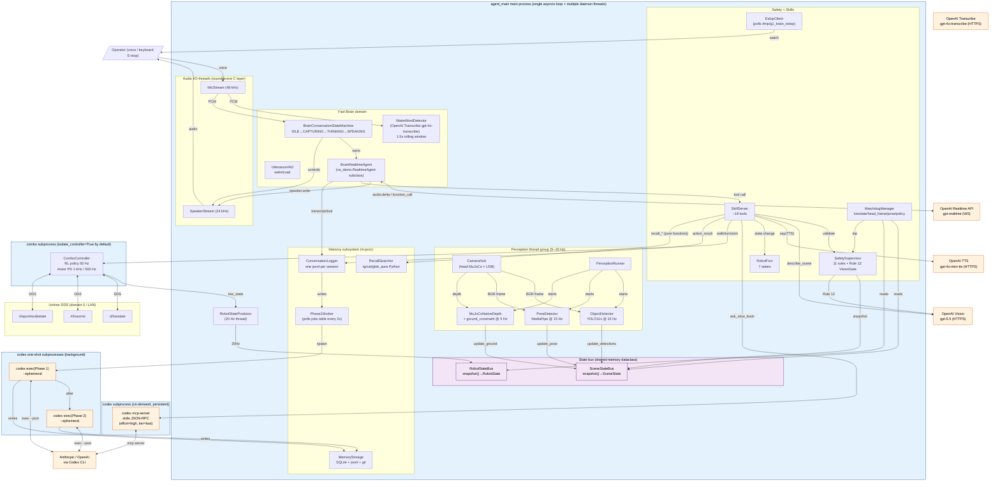
```mermaid
flowchart TB
  %% ---- external ----
  User[/"Operator (voice / keyboard E-stop)"/]
  OAI_RT["OpenAI Realtime API<br/>gpt-realtime (WS)"]
  OAI_Vis["OpenAI Vision<br/>gpt-5.5 (HTTPS)"]
  OAI_TTS["OpenAI TTS<br/>gpt-4o-mini-tts (HTTPS)"]
  OAI_Wake["OpenAI Transcribe<br/>gpt-4o-transcribe (HTTPS)"]
  OAI_Codex["Anthropic / OpenAI<br/>via Codex CLI"]

  %% ---- main process ----
  subgraph MainProc["agent_main main process (single asyncio loop + multiple daemon threads)"]
    direction TB

    subgraph Audio["Audio I/O threads (sounddevice C layer)"]
      Mic["MicStream (48 kHz)"]
      Spk["SpeakerStream (24 kHz)"]
    end

    subgraph FastBrain["Fast Brain domain"]
      direction TB
      CSM["BrainConversationStateMachine<br/>IDLE→CAPTURING→THINKING→SPEAKING"]
      WW["WakeWordDetector<br/>(OpenAI Transcribe gpt-4o-transcribe)<br/>1.5s rolling window"]
      VAD["UtteranceVAD<br/>webrtcvad"]
      RTA["BrainRealtimeAgent<br/>(va_demo.RealtimeAgent subclass)"]
    end

    subgraph SafetySkill["Safety + Skills"]
      Sup["SafetySupervisor<br/>11 rules + Rule 12 VisionGate"]
      SkSv["SkillServer<br/>~18 tools"]
      FSM["RobotFsm<br/>7 states"]
      ESC["EstopClient<br/>(polls /tmp/g1_brain_estop)"]
      WD["WatchdogManager<br/>lowstate/head_frame/pose/policy"]
    end

    subgraph Perception["Perception thread group (5–15 Hz)"]
      Cam["CameraHub<br/>(head MuJoCo + USB)"]
      YOLO["ObjectDetector<br/>YOLO11s @ 15 Hz"]
      Pose["PoseDetector<br/>MediaPipe @ 15 Hz"]
      Depth["MuJoCoNativeDepth<br/>+ ground_constraint @ 5 Hz"]
      PR["PerceptionRunner"]
    end

    subgraph SceneBus["State bus (shared-memory dataclass)"]
      Scene["SceneStateBus<br/>snapshot()→SceneState"]
      Robot["RobotStateBus<br/>snapshot()→RobotState"]
    end

    subgraph Memory["Memory subsystem (in-proc)"]
      Recall["RecallSearcher<br/>rg/cat/glob, pure Python"]
      Store["MemoryStorage<br/>SQLite + jsonl + git"]
      P1W["Phase1Worker<br/>(polls jobs table every 2s)"]
      ConvLog["ConversationLogger<br/>one jsonl per session"]
    end

    RSP["RobotStateProducer<br/>(20 Hz thread)"]
  end

  %% ---- child processes ----
  subgraph ComboProc["combo subprocess (isolate_controller=True by default)"]
    Combo["ComboController<br/>RL policy 50 Hz<br/>motor PD 1 kHz / 500 Hz"]
  end

  subgraph CodexDaemon["codex subprocess (on-demand, persistent)"]
    CodexMcp["codex mcp-server<br/>stdio JSON-RPC<br/>(effort=high, tier=fast)"]
  end

  subgraph CodexBatch["codex one-shot subprocesses (background)"]
    P1["codex exec(Phase 1)<br/>--ephemeral"]
    P2["codex exec(Phase 2)<br/>--ephemeral"]
  end

  subgraph DDS["Unitree DDS (domain 0 / LAN)"]
    LS["rt/lowstate"]
    LC["rt/lowcmd"]
    SM["rt/sportmodestate"]
  end

  %% ---- edges ----
  User -- voice --> Mic
  Mic -- PCM --> WW
  Mic -- PCM --> CSM
  CSM -- owns --> RTA
  CSM -- controls --> Spk
  RTA <-- "audio.delta / function_call" --> OAI_RT
  RTA -- "speaker.write" --> Spk
  Spk -- audio --> User

  RTA -- tool call --> SkSv
  SkSv -- validate --> Sup
  Sup -- snapshot --> Scene
  Sup -- "Rule 12" --> OAI_Vis
  SkSv -- "describe_scene" --> OAI_Vis
  SkSv -- "say(TTS)" --> OAI_TTS
  SkSv -- "state change" --> FSM
  SkSv -- "ask_slow_brain" --> CodexMcp

  PR -- starts --> YOLO
  PR -- starts --> Pose
  PR -- starts --> Depth
  YOLO -- "update_detections" --> Scene
  Pose -- "update_pose" --> Scene
  Depth -- "update_ground" --> Scene
  Cam -- "BGR frame" --> YOLO
  Cam -- "BGR frame" --> Pose
  Cam -- depth --> Depth

  WD -- reads --> Scene
  WD -- reads --> Robot
  WD -- trip --> Sup

  RSP -- 20Hz --> Robot
  Combo -- "low_state" --> RSP
  SkSv -- "walk/turn/arm" --> Combo
  Combo <-- DDS --> LS
  Combo <-- DDS --> LC
  Combo <-- DDS --> SM
  ESC -- watch --> User

  RTA -- transcript/tool --> ConvLog
  SkSv -- action_result --> ConvLog
  ConvLog -- writes --> P1W
  P1W -- spawn --> P1
  P1 -- after --> P2
  P1 <-- "exec --json" --> OAI_Codex
  P2 <-- "exec --json" --> OAI_Codex
  CodexMcp <-- "mcp-server" --> OAI_Codex
  SkSv -- "recall_* (pure functions)" --> Recall
  P1 -- writes --> Store
  P2 -- writes --> Store

  classDef llm fill:#fff3e0,stroke:#e65100,color:#000
  classDef proc fill:#e3f2fd,stroke:#0d47a1,color:#000
  classDef bus fill:#f3e5f5,stroke:#4a148c,color:#000
  class OAI_RT,OAI_Vis,OAI_TTS,OAI_Wake,OAI_Codex,CodexMcp,P1,P2 llm
  class MainProc,ComboProc,CodexDaemon,CodexBatch proc
  class SceneBus,Scene,Robot bus
```

**What this diagram reveals**:

1. **The only continuously connected LLM path is `RTA <-> OAI_RT`.** All other LLM calls are one-shot (vision / tts / codex exec) or on-demand (codex mcp-server).
2. **Perception writes to SceneStateBus**, but between `SceneBus → RTA` there is **only one indirect path, through SkSv** — namely "a motion tool returns `scene_after`" or "the fast brain explicitly calls `query_scene_state`".
3. **The fast brain never reads SceneStateBus directly.**

---

## 3. Process / Thread / asyncio Task Tree


```mermaid
flowchart TD
  AM["agent_main process (PID N)"]
  AM --> EL["asyncio event loop (main thread)"]
  AM --> SD["signal handlers SIGINT/SIGTERM"]

  EL --> RunT["task: _run() (agent_main.py:519-1238)"]
  EL --> SupT["task: _supervise() (signal→stop_evt)"]

  RunT --> RTRun["await brain_agent.run() — Realtime WS main loop"]
  RunT --> P1Task["task: Phase1Worker._loop (poll jobs every 2s)"]
  RunT --> DaemonInit["task: codex_daemon.start() (spawn + handshake)"]
  RunT --> CSMRun["task: state_machine._run() — IDLE/CAPTURE/THINK/SPEAK"]

  AM --> Threads["Daemon thread group (non-asyncio)"]
  Threads --> T1["MicStream (sounddevice C)"]
  Threads --> T2["SpeakerStream (sounddevice C)"]
  Threads --> T3["g1-brain-robotstate 20 Hz (RobotStateProducer)"]
  Threads --> T4["perception-frame-age 5 Hz"]
  Threads --> T5["ground-constraint 5 Hz"]
  Threads --> T6["g1_yolo 15 Hz (ObjectDetector)"]
  Threads --> T7["pose_detector 15 Hz (PoseDetector)"]
  Threads --> T8["watchdog 10 Hz"]
  Threads --> T9["EstopClient poll 20 Hz"]
  Threads --> T10["BrainConversationStateMachine VAD/WakeWord subthread"]
  Threads --> T11["DDS network thread group (CycloneDDS, started by ChannelFactory)"]

  AM --> Children["Subprocesses"]
  Children --> CP["combo subprocess (isolate_controller=True by default)"]
  CP --> CPL["50 Hz RL policy + 1 kHz motor PD"]
  CP --> CPD["DDS subscribe rt/lowstate + publish rt/lowcmd"]

  Children --> CDX["codex mcp-server subprocess (on demand)"]
  CDX --> CDXIO["stdio JSON-RPC + 16 MB readline buffer"]

  Children --> P1P["codex exec subprocess (Phase 1, one-shot)"]
  Children --> P2P["codex exec subprocess (Phase 2, one-shot)"]

  classDef async fill:#e8f5e9,stroke:#1b5e20
  classDef thread fill:#fff9c4,stroke:#f57f17
  classDef proc fill:#ffebee,stroke:#b71c1c
  class RunT,SupT,RTRun,P1Task,DaemonInit,CSMRun async
  class T1,T2,T3,T4,T5,T6,T7,T8,T9,T10,T11 thread
  class CP,CDX,P1P,P2P proc
```

**Key facts**:
- The entire main program is a **single asyncio event loop**; all awaits run on the main thread.
- DDS / audio / YOLO / pose are **plain threads** that communicate with the event loop through the GIL + shared dataclasses.
- The 50 Hz control loop is **isolated into a subprocess by default** (`combo_proxy.py`) to keep perception from grabbing the GIL and dragging down the policy.
- Codex's **mcp-server subprocess is persistent** (unless `memory.enabled=false`); the exec-mode subprocess is **one-shot**.

---

## 4. Startup Sequence (the 7 Phases of agent_main)

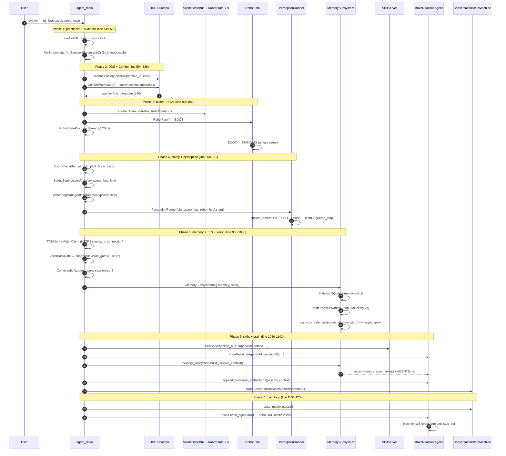
```mermaid
sequenceDiagram
  autonumber
  participant U as User
  participant AM as agent_main
  participant DDS as DDS / Combo
  participant SB as SceneStateBus + RobotStateBus
  participant FSM as RobotFsm
  participant Perc as PerceptionRunner
  participant Mem as MemorySubsystem
  participant SS as SkillServer
  participant BR as BrainRealtimeAgent
  participant CSM as ConversationStateMachine

  U->>AM: python -m g1_brain.apps.agent_main
  Note over AM: Phase 1: prechecks + audio init (line 519-592)
  AM->>AM: load YAML, flock instance lock
  AM->>AM: MicStream.start() / SpeakerStream.start() (5s timeout each)

  Note over AM,DDS: Phase 2: DDS + Combo (line 594-836)
  AM->>DDS: ChannelFactoryInitialize(domain_id, iface)
  AM->>DDS: ComboProxy.start() — spawn combo subprocess
  DDS-->>AM: wait for first rt/lowstate (≤40s)

  Note over AM,FSM: Phase 3: buses + FSM (line 838-880)
  AM->>SB: create SceneStateBus, RobotStateBus
  AM->>FSM: RobotFsm() → BOOT
  AM->>AM: RobotStateProducer thread @ 20 Hz
  FSM->>FSM: BOOT → STANDING (unless estop)

  Note over AM,Perc: Phase 4: safety + perception (line 868-931)
  AM->>AM: EstopClient(flag_path=/tmp/g1_brain_estop)
  AM->>AM: SafetySupervisor(cfg.safety, scene_bus, fsm)
  AM->>AM: WatchdogManager(lowstate/head/pose/policy)
  AM->>Perc: PerceptionRunner(cfg, scene_bus, robot_bus).start()
  Perc->>Perc: spawn CameraHub + YOLO + Pose + Depth + ground_loop

  Note over AM,Mem: Phase 5: memory + TTS + vision (line 933-1038)
  AM->>AM: TTSClient / VisionClient (HTTPS clients, no connection)
  AM->>AM: VisionRiskGate → supervisor.vision_gate (Rule 12)
  AM->>AM: ConversationLogger opens session jsonl
  AM->>Mem: MemorySubsystem(cfg.memory).start()
  Mem->>Mem: initialize SQLite + memories/.git
  Mem->>Mem: start Phase1Worker._loop (poll every 2s)
  Mem->>Mem: asyncio.create_task(codex_daemon.start()) — async spawn

  Note over AM,BR: Phase 6: skills + brain (line 1040-1142)
  AM->>SS: SkillServer(scene_bus, supervisor, combo, ...)
  AM->>BR: BrainRealtimeAgent(skill_server=SS, ...)
  AM->>Mem: memory_subsystem.build_passive_context()
  Mem-->>BR: return memory_summary.md + AGENTS.md
  AM->>BR: append_developer_instructions(passive_context)
  AM->>CSM: BrainConversationStateMachine(brain=BR, ...)

  Note over AM,CSM: Phase 7: main loop (line 1184-1238)
  AM->>CSM: state_machine.start()
  AM->>BR: await brain_agent.run() — open OAI Realtime WS
  BR->>BR: block on WS event loop until stop_evt
```

> Key invariant: **DDS must be initialized before CameraHub** (agent_main.py:595-598), because the head camera internally subscribes to `rt/sportmodestate` to sync the root pose into MuJoCo's synthetic head camera.

---

## 5. SceneStateBus + RobotStateBus: The Core Data Contract

**This is the system's "source of truth."** All perception/state is written here, and all consumers (safety / watchdog / brain) read from here.

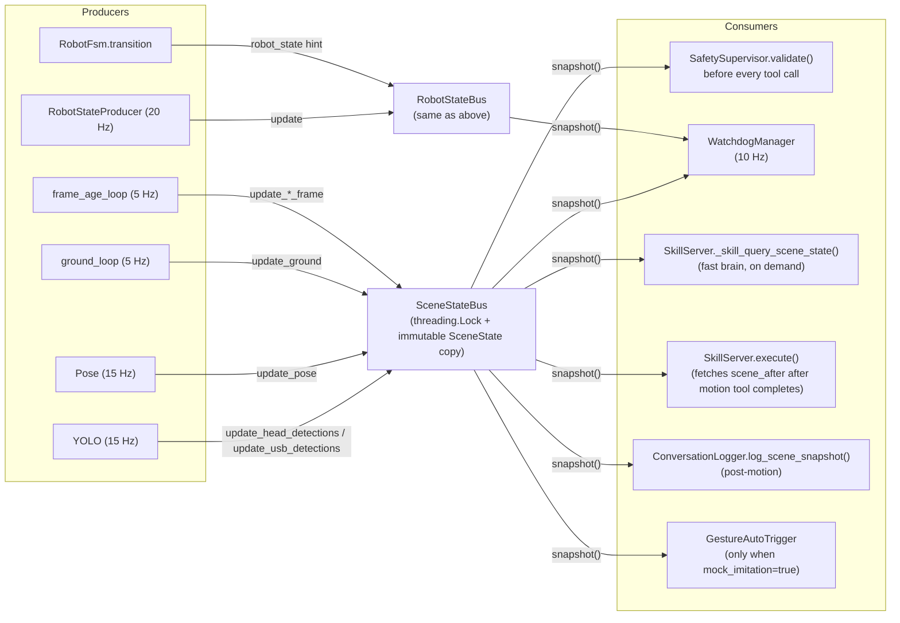
```mermaid
flowchart LR
  subgraph Producers
    PR1["YOLO (15 Hz)"]
    PR2["Pose (15 Hz)"]
    PR3["ground_loop (5 Hz)"]
    PR4["frame_age_loop (5 Hz)"]
    PR5["RobotStateProducer (20 Hz)"]
    PR6["RobotFsm.transition"]
  end

  SB["SceneStateBus<br/>(threading.Lock + immutable SceneState copy)"]
  RB["RobotStateBus<br/>(same as above)"]

  subgraph Consumers
    C1["SafetySupervisor.validate()<br/>before every tool call"]
    C2["WatchdogManager<br/>(10 Hz)"]
    C3["SkillServer._skill_query_scene_state()<br/>(fast brain, on demand)"]
    C4["SkillServer.execute()<br/>(fetches scene_after after motion tool completes)"]
    C5["ConversationLogger.log_scene_snapshot()<br/>(post-motion)"]
    C6["GestureAutoTrigger<br/>(only when mock_imitation=true)"]
  end

  PR1 -- update_head_detections / update_usb_detections --> SB
  PR2 -- update_pose --> SB
  PR3 -- update_ground --> SB
  PR4 -- update_*_frame --> SB
  PR5 -- update --> RB
  PR6 -- robot_state hint --> RB

  SB -- snapshot() --> C1
  SB -- snapshot() --> C2
  SB -- snapshot() --> C3
  SB -- snapshot() --> C4
  SB -- snapshot() --> C5
  SB -- snapshot() --> C6
  RB -- snapshot() --> C2
```

**Core observations**:
- **`snapshot()` returns an immutable dataclass copy** (`scene_state/fusion.py`); this prevents safety from reading a half-updated state.
- **The "fast brain reads SceneStateBus" edge does not exist** — the fast brain can only obtain the condensed `summary_for_llm()` dict indirectly, through SkSv's `query_scene_state` tool.
- Fields returned by `summary_for_llm()`: `persons_visible`, `nearest_obstacle_m`, `nearest_person_m`, `clear_path`, `surface_tilt_deg`, `user_gesture`, `warnings`.
- **Raw YOLO detections, the depth map, the pose skeleton — the fast brain sees none of them.**

---

## 6. Fast Brain: BrainRealtimeAgent

### 6.1 Class Inheritance and Lifecycle

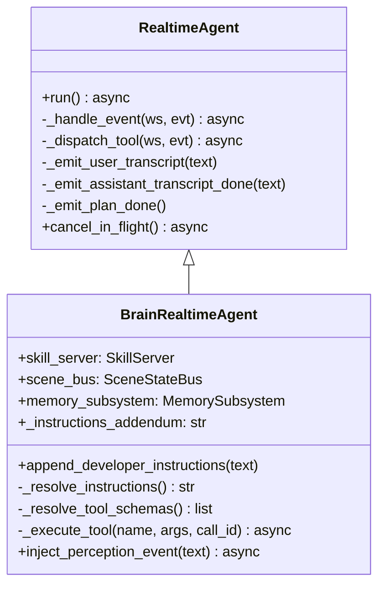
```mermaid
classDiagram
  class RealtimeAgent {
    +run() async
    -_handle_event(ws, evt) async
    -_dispatch_tool(ws, evt) async
    -_emit_user_transcript(text)
    -_emit_assistant_transcript_done(text)
    -_emit_plan_done()
    +cancel_in_flight() async
  }
  class BrainRealtimeAgent {
    +skill_server: SkillServer
    +scene_bus: SceneStateBus
    +memory_subsystem: MemorySubsystem
    +_instructions_addendum: str
    +append_developer_instructions(text)
    -_resolve_instructions() str
    -_resolve_tool_schemas() list
    -_execute_tool(name, args, call_id) async
    +inject_perception_event(text) async
  }
  RealtimeAgent <|-- BrainRealtimeAgent
```

**Important: in v1.1.0, BrainRealtimeAgent mainly overrides 3 things**:
1. `_resolve_instructions()` — appends memory's `memory_summary.md + AGENTS.md` to the end of the system prompt (once, before the session opens).
2. `_resolve_tool_schemas()` — registers the 18 schemas returned by `tool_schemas.build_tool_schemas(...)` with Realtime.
3. `_execute_tool()` — forwards every function_call to `skill_server.execute(name, args, call_id=...)`.

### 6.2 Fast Brain ↔ Perception Actual Data Flow (**the key truth**)

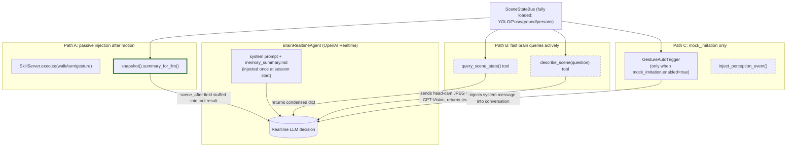
```mermaid
flowchart TD
  Scene["SceneStateBus (fully loaded: YOLO/Pose/ground/persons)"]

  subgraph FastBrain["BrainRealtimeAgent (OpenAI Realtime)"]
    direction TB
    Prompt["system prompt + memory_summary.md<br/>(injected once at session start)"]
    LLM[("Realtime LLM decision")]
  end

  subgraph PathA["Path A: passive injection after motion"]
    SSA["SkillServer.execute(walk/turn/gesture)"]
    SA["snapshot().summary_for_llm()"]
  end

  subgraph PathB["Path B: fast brain queries actively"]
    SSB["query_scene_state() tool"]
    SSC["describe_scene(question) tool"]
  end

  subgraph PathC["Path C: mock_imitation only"]
    GAT["GestureAutoTrigger<br/>(only when mock_imitation.enabled=true)"]
    IPE["inject_perception_event()"]
  end

  Scene --> SA
  Scene --> SSB
  Scene --> SSC
  Scene --> GAT

  SA -- "scene_after field stuffed into tool result" --> LLM
  SSB -- "returns condensed dict" --> LLM
  SSC -- "sends head-cam JPEG to GPT-Vision, returns text" --> LLM
  GAT -- "injects system message into conversation" --> LLM
  Prompt --> LLM

  classDef strong stroke-width:3px,stroke:#1b5e20
  classDef weak stroke-dasharray: 5 5,stroke:#888
  class SA strong
  class SSB,SSC weak
  class IPE weak
```

**This is the crux of the user's suspicion. The conclusion**:

| Channel | Trigger | Frequency | Who decides? | Data shape |
|------|------|------|----------|----------|
| A — `scene_after` injection | motion tool succeeds | after every walk/turn/gesture/look_at | **automatic** | condensed `summary_for_llm()` dict |
| B1 — `query_scene_state` | fast brain deems it needed | uncertain (depends on the LLM's decision) | LLM | same as above |
| B2 — `describe_scene` | fast brain deems it needed | same as above, expensive (vision API ~1-3s) | LLM | GPT-Vision text description |
| C — `inject_perception_event` | mock_imitation triggers | only when `mock_imitation.enabled=true` | GestureAutoTrigger | system message text |

**v1.1.0 has no path that "continuously pushes perception to the fast brain."** The fast brain's "continuous awareness" of the world is entirely **a function of how often it decides to call query_scene_state itself** — that is, **the LLM only takes a look when it actively wants to**.

> This is exactly the source of the user's intuition that "perception isn't doing anything." **Perception is in fact continuously effective for safety and the watchdog** (every motion validate takes a snapshot), but **for the fast brain's "semantic awareness" it is event-driven and on-demand**.

### 6.3 Structure of the Fast Brain's System Prompt

```
[REALTIME_SYSTEM_PROMPT_BRAIN]              ← brain/prompts.py
  + "\n\n"
  + memory_summary.md (summary of last N sessions)  ← memory/__init__.py
  + AGENTS.md (recall operations manual)            ← memory/storage.py
```

**Note**: this concatenation happens once, before `await brain_agent.run()` (`agent_main.py:1096-1110`). Once the session opens, **the prompt is burned into the Realtime session and never changes again**. So "continuously feeding perception to the fast brain" is hard to do at the protocol level (you would have to send `conversation.item.create` every N seconds).

### 6.4 Event Loop (`_handle_event`)

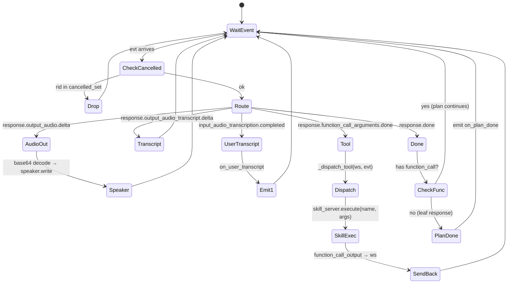
```mermaid
stateDiagram-v2
  [*] --> WaitEvent
  WaitEvent --> CheckCancelled : evt arrives
  CheckCancelled --> Drop : rid in cancelled_set
  CheckCancelled --> Route : ok
  Drop --> WaitEvent

  Route --> AudioOut : response.output_audio.delta
  Route --> Transcript : response.output_audio_transcript.delta
  Route --> UserTranscript : input_audio_transcription.completed
  Route --> Tool : response.function_call_arguments.done
  Route --> Done : response.done

  AudioOut --> Speaker : base64 decode → speaker.write
  Speaker --> WaitEvent

  Transcript --> WaitEvent
  UserTranscript --> Emit1 : on_user_transcript
  Emit1 --> WaitEvent

  Tool --> Dispatch : _dispatch_tool(ws, evt)
  Dispatch --> SkillExec : skill_server.execute(name, args)
  SkillExec --> SendBack : function_call_output → ws
  SendBack --> WaitEvent

  Done --> CheckFunc : has function_call?
  CheckFunc --> WaitEvent : yes (plan continues)
  CheckFunc --> PlanDone : no (leaf response)
  PlanDone --> WaitEvent : emit on_plan_done
```

`cancelled_response_ids` is the key safeguard for barge-in — it keeps the last 16 cancelled response_ids, and **late-arriving events are silently dropped**, avoiding:
- an old audio.delta being written to the speaker again after `speaker.clear()`
- an old function_call triggering a walk after the user has already said "stop"

---

## 7. Slow Brain: The Three Codex Invocation Modes

> **The user's question: when exactly does codex come into play?**
>
> The answer: **there are three completely independent moments.**

### 7.1 Overview of the Three Codex Modes

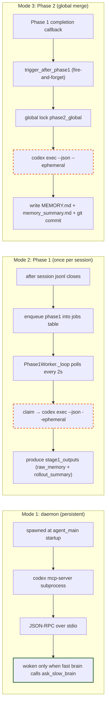
```mermaid
flowchart LR
  subgraph M1["Mode 1: daemon (persistent)"]
    direction TB
    D1["spawned at agent_main startup"]
    D2["codex mcp-server subprocess"]
    D3["JSON-RPC over stdio"]
    D4["woken only when fast brain calls ask_slow_brain"]
    D1 --> D2 --> D3 --> D4
  end

  subgraph M2["Mode 2: Phase 1 (once per session)"]
    direction TB
    P1A["after session jsonl closes"]
    P1B["enqueue phase1 into jobs table"]
    P1C["Phase1Worker._loop polls every 2s"]
    P1D["claim → codex exec --json --ephemeral"]
    P1E["produce stage1_outputs (raw_memory + rollout_summary)"]
    P1A --> P1B --> P1C --> P1D --> P1E
  end

  subgraph M3["Mode 3: Phase 2 (global merge)"]
    direction TB
    P2A["Phase 1 completion callback"]
    P2B["trigger_after_phase1 (fire-and-forget)"]
    P2C["global lock phase2_global"]
    P2D["codex exec --json --ephemeral"]
    P2E["write MEMORY.md + memory_summary.md + git commit"]
    P2A --> P2B --> P2C --> P2D --> P2E
  end

  classDef ondemand stroke:#1b5e20,stroke-width:2px
  classDef bg stroke:#e65100,stroke-width:2px,stroke-dasharray:5 5
  class D4 ondemand
  class P1D,P2D bg
```

### 7.2 Mode 1: the `codex mcp-server` daemon

**When it spawns**: `agent_main.py:1033` calls `await memory_subsystem.start()`, which internally runs `asyncio.create_task(daemon.start())`.

**Command line** (`daemon.py:417-435`):
```bash
codex mcp-server \
  -c approval_policy=never \
  -c sandbox_mode="read-only" \
  -c model_reasoning_effort="high" \
  -c model_reasoning_summary="concise" \
  -c service_tier="fast"
```

**Key facts**:
- `effort=high` + `tier=fast` are the **v1.1.0 defaults** (`schemas.py:131-133`), derived from the user's standing rule that "every codex call should be high+fast".
- The daemon is **woken by the fast brain only through the `ask_slow_brain(query)` tool** — it is not triggered by session end, idle timeout, the watchdog, or any other event.
- The subprocess uses a 16 MB readline buffer (`limit=self._stdout_buffer_bytes`) to keep codex 0.128 from blowing out readline on long outputs.

**Protocol**: MCP JSON-RPC 2.0 over stdio. Each `ask_slow_brain` actually sends:
```json
{"jsonrpc":"2.0","id":N,"method":"tools/call",
 "params":{"name":"codex","arguments":{"prompt": <wrapped>,"cwd": <memories_dir>}}}
```

`<wrapped>` is the recall preamble added by `_wrap_recall_prompt()` (`daemon.py:348-406`), which tells codex to:
- use `rg`/`cat`/`sed` to search `MEMORY.md` / `raw_memories.md` / `rollout_summaries/*.md` / the raw `*.jsonl`
- give an answer within ≤6 shell calls
- not use `\b` for CJK
- keep the answer to ≤120 Chinese characters / 80 English words, citing `session_id 8-char prefix + turn_id`

### 7.3 Modes 2 / 3: `codex exec --json --ephemeral`

**This is a completely different subprocess from the daemon** (`codex_client.py:105-126`):
```bash
codex exec --json \
  --skip-git-repo-check \
  --ignore-user-config \
  -C <workdir> \
  -s read-only \
  -c approval_policy=never \
  -c model_reasoning_effort="high" \
  -c model_reasoning_summary="concise" \
  -c service_tier="fast" \
  --ephemeral
```

- **Each is a one-shot subprocess** (spawn → one prompt → stdin EOF → stdout streams JSONL events → exit).
- **`--ephemeral` does not write codex's conversation history.**
- Phase 1 and Phase 2 go through the same `CodexExecClient.exec()` entry point; the only differences are the prompt + workdir.

### 7.4 Key Clarification: When is codex **not** invoked?

| Event | Triggers codex? |
|------|-----------------|
| The user says something to the fast brain | ❌ |
| The fast brain calls `walk` / `gesture` / `query_scene_state` | ❌ |
| The fast brain calls `recall_grep` / `recall_read` / `recall_glob` | ❌ |
| The fast brain calls `describe_scene` | ❌ (uses OpenAI Vision, not codex) |
| The fast brain calls `ask_slow_brain` | ✅ **Mode 1 (daemon)** |
| A session ends (jsonl closes) | ✅ **Mode 2 (Phase 1)** enqueued → claimed within 2 s |
| Phase 1 completes | ✅ **Mode 3 (Phase 2)** fire-and-forget |
| Watchdog trip / FSM transition / E-stop | ❌ |
| Periodic cron | ❌ — there is no scheduled task; **entirely event-driven** |

> The user's suspicion — "I wired in the harness but codex isn't actually doing anything" — is **partly valid**:
> - During an online conversation, **only an explicit `ask_slow_brain` moves codex**.
> - If the fast brain never calls `ask_slow_brain` on its own (e.g. the prompt doesn't nudge it to), the daemon stays idle forever.
> - **The offline Phase 1/2 is a different matter** — it fires inevitably whenever a session jsonl closes; this is the harness's "accumulation" path.

---

## 8. Memory System: Phase 1 / Phase 2 / Recall

### 8.1 Three Data Flows

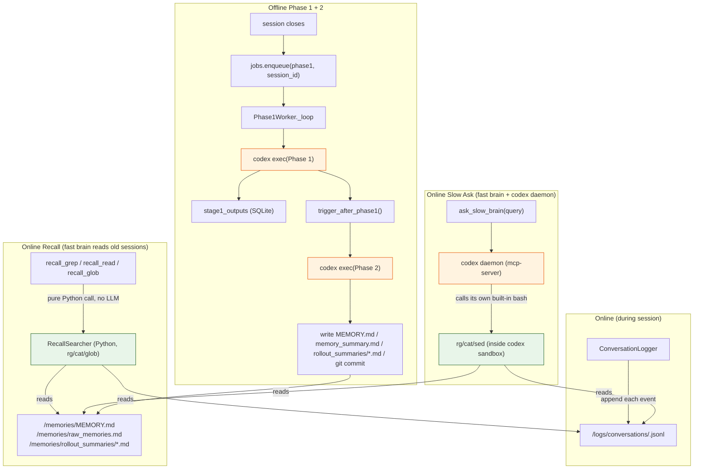
```mermaid
flowchart TB
  subgraph Live["Online (during session)"]
    direction TB
    Conv["ConversationLogger"]
    JL["/logs/conversations/<session>.jsonl"]
    Conv -- "append each event" --> JL
  end

  subgraph Recall["Online Recall (fast brain reads old sessions)"]
    direction TB
    RG["recall_grep / recall_read / recall_glob"]
    RS["RecallSearcher (Python, rg/cat/glob)"]
    Mem["/memories/MEMORY.md<br/>/memories/raw_memories.md<br/>/memories/rollout_summaries/*.md"]
    RG -- "pure Python call, no LLM" --> RS
    RS -- reads --> Mem
    RS -- reads --> JL
  end

  subgraph SlowAsk["Online Slow Ask (fast brain + codex daemon)"]
    direction TB
    ASB["ask_slow_brain(query)"]
    DM["codex daemon (mcp-server)"]
    ASB --> DM
    DM -- "calls its own built-in bash" --> RS2["rg/cat/sed (inside codex sandbox)"]
    RS2 -- reads --> Mem
    RS2 -- reads --> JL
  end

  subgraph Batch["Offline Phase 1 + 2"]
    direction TB
    SC["session closes"]
    JE["jobs.enqueue(phase1, session_id)"]
    P1W["Phase1Worker._loop"]
    P1E["codex exec(Phase 1)"]
    S1O["stage1_outputs (SQLite)"]
    P2T["trigger_after_phase1()"]
    P2E["codex exec(Phase 2)"]
    Write["write MEMORY.md / memory_summary.md / rollout_summaries/*.md / git commit"]
    SC --> JE
    JE --> P1W
    P1W --> P1E
    P1E --> S1O
    P1E --> P2T
    P2T --> P2E
    P2E --> Write
    Write --> Mem
  end

  classDef nollm fill:#e8f5e9,stroke:#1b5e20
  classDef llm fill:#fff3e0,stroke:#e65100
  class RS,RS2 nollm
  class DM,P1E,P2E llm
```

### 8.2 Recall's Two Execution Paths (the user's key question)

> **The user's exact words**: "For the memory-recall part of the harness mechanism, I checked the logs and it seems to also be executed by a tool agent called in realtime?"

**Partly right, partly wrong.** Let's unpack it:

**Path A: the fast brain directly calls `recall_grep` / `recall_read` / `recall_glob`**

```python
# tool_schemas.py registers recall_* with Realtime
# realtime_agent._execute_tool() -> skill_server.execute("recall_grep", args)
# skill_server._skill_recall_grep() -> memory.recall.grep(...)
# recall.py directly spawns an `rg` subprocess (or grep / Python re)
# No LLM. No codex. No "tool agent".
```

This path is a **pure function call**: the fast-brain LLM decides to call it → SkillServer dispatches synchronously → Python invokes `rg` → returns a dict. **There is no second LLM anywhere in the chain.**

**Path B: the fast brain calls `ask_slow_brain(query)`**

```python
# tool_schemas.py registers ask_slow_brain
# skill_server._skill_ask_slow_brain(query, timeout_s)
# memory.daemon.ask_slow_brain(query, ...)
#   -> JSON-RPC tools/call -> codex mcp-server
#   -> codex (a separate LLM agent) runs rg/cat/sed in its own sandbox
#   -> returns codex's synthesized answer (≤120 Chinese characters)
```

This path **is the "LLM-in-the-loop" one**: the fast brain tosses the ball to codex, and codex retrieves using its own reasoning + its own shell tools.

**So the description "a tool agent called in realtime" applies to Path B, not Path A.** If the "realtime tool executing recall" you saw is specifically a `recall_grep`-style tool, that is Python grep; if it is `ask_slow_brain`, that is codex.

### 8.3 Engineering Rationale: "Why It's Designed This Way"

| Tool | Latency | When to use |
|------|------|----------|
| `recall_grep` / `recall_read` / `recall_glob` | ~10-50 ms | The fast brain already knows the keyword and wants to flip through MEMORY.md quickly |
| `ask_slow_brain` | ~3-15 s (including codex reasoning) | The fast brain has given up / can't find it / needs to synthesize across multiple jsonl files |

`AGENTS.md` (the recall operations manual, stored at `<robot>/memories/AGENTS.md`) is the "which one to use when" guide that the fast brain reads — by default in v1.1.0 the fast brain should **grep first, and escalate to ask_slow_brain only when it can't find something**.

### 8.4 Phase 1 / Phase 2 Output Contract

**Phase 1 output** (one per session):
```json
{
  "raw_memory": "key fact entries from this session (Chinese or English allowed)",
  "rollout_summary": "session summary of ≤200 characters",
  "rollout_slug": "kebab-case-<10 chars>"
}
```

**Phase 2 output** (global, rewritten on every trigger):
```json
{
  "memory_md": "full new MEMORY.md (curated)",
  "memory_summary_md": "full new memory_summary.md (concise digest)"
}
```

Phase 2 additionally:
- concatenates the raw_memory of all stage1_outputs into `raw_memories.md` (deterministic)
- writes a `rollout_summaries/<slug>.md` for each stage1_output
- runs `git add . && git commit -m "phase2 @ <iso>"`, preserving a snapshot of every merge

### 8.5 SQLite + git Dual-Track Persistence

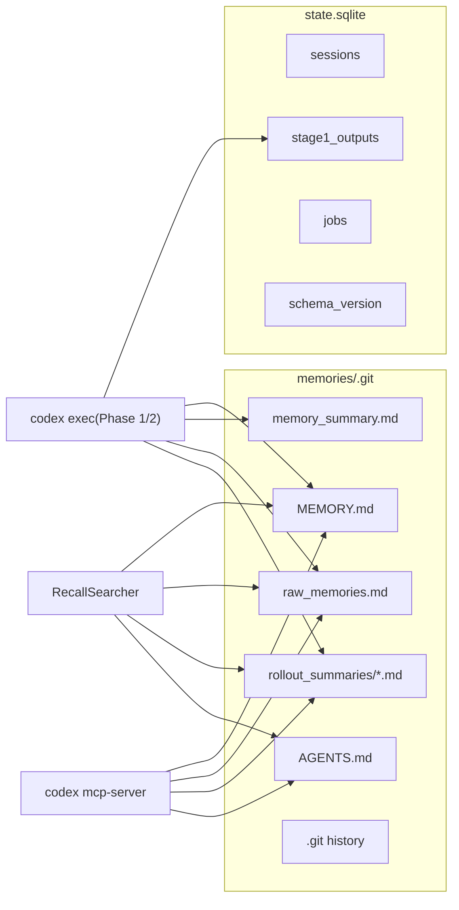
```mermaid
flowchart LR
  subgraph SQ["state.sqlite"]
    A1["sessions"]
    A2["stage1_outputs"]
    A3["jobs"]
    A4["schema_version"]
  end

  subgraph FS["memories/.git"]
    B1["MEMORY.md"]
    B2["memory_summary.md"]
    B3["raw_memories.md"]
    B4["rollout_summaries/*.md"]
    B5["AGENTS.md"]
    B6[".git history"]
  end

  CodexBatch["codex exec(Phase 1/2)"]
  CodexBatch --> A2
  CodexBatch --> B1
  CodexBatch --> B2
  CodexBatch --> B3
  CodexBatch --> B4

  Recall["RecallSearcher"]
  Recall --> B1
  Recall --> B3
  Recall --> B4
  Recall --> B5

  Daemon["codex mcp-server"]
  Daemon --> B1
  Daemon --> B3
  Daemon --> B4
  Daemon --> B5
```

---

## 9. Tool Matrix (the Complete Matrix of 18 Tools)

> **All the tools the fast brain can actually call** (`tool_schemas.build_tool_schemas(sim=True, ...)`).

| # | Tool | Layer | Sync/Async | Backend | Goes through safety.validate? | Kept in vision_only mode? |
|---|------|------|----------|------|----------------------|----------------------------|
| 1 | `say(text)` | L1 | Sync | OpenAI TTS gpt-4o-mini-tts | No (direct speaker) | Yes |
| 2 | `describe_scene(question, detail)` | L1 | Async | OpenAI Vision gpt-5.5 | No | Yes |
| 3 | `query_scene_state()` | L1 | Sync | SceneStateBus.snapshot() | No | Yes |
| 4 | `recall_history(kind, limit)` | L1 | Sync | reads jsonl directly | No | Yes |
| 5 | `look_at(target)` | L1 composite | Async | internal → `turn` | Yes | Yes |
| 6 | `approach(target_distance_m)` | L1 composite | Async | internal → repeated `walk` | Yes | Yes |
| 7 | `mock_imitate(gesture)` | L1 composite | Async | internal → `gesture` list | Yes | Only when `mock_imitation.enabled` |
| 8 | `ask_human(question)` | L1 composite | Async | `say` + wait 5s | No | Yes |
| 9 | `recall_grep(pattern, scope, ...)` | L1 memory | Sync | RecallSearcher (rg / grep / re) | No | Yes |
| 10 | `recall_read(path, start, end)` | L1 memory | Sync | RecallSearcher (Path.read_text) | No | Yes |
| 11 | `recall_glob(pattern, limit)` | L1 memory | Sync | RecallSearcher (Path.glob) | No | Yes |
| 12 | `ask_slow_brain(query, timeout_s)` | L1 memory | Async | **codex mcp-server** (high effort, fast tier) | No | Yes |
| 13 | `walk(vx, vy, wz, duration_s)` | L2 | Async | ComboController (reactive abort at 100 ms intervals) | **Yes** | No (blocked in vision_only) |
| 14 | `turn(yaw_deg)` | L2 | Async | internal → `walk(wz, dur)` | Yes | No |
| 15 | `gesture(name)` | L2 | Async | Combo.push_arm_action (keyframe) | Yes | No |
| 16 | `static_pose(name)` | L2 | Async | Combo.push_arm_action | Yes | No |
| 17 | `stop()` | L2 | Sync | combo halt + clear arm queue | Yes (but on a fast path) | Yes |
| 18 | `release_arms()` | L2 | Sync | combo arm release | Yes | No |

**Real-hardware-only (rejected by default)**:
- `loco_high(action)` — only when `--real` is enabled
- `arm_action_high(action_id)` — only when `--real`
- `audio_tts_robot(text)` — only when `--real`

### 9.1 The Motion Tool's "Reactive Abort"

`walk` does not simply write vx to combo — `skill_server._skill_walk()` (line 583-633):

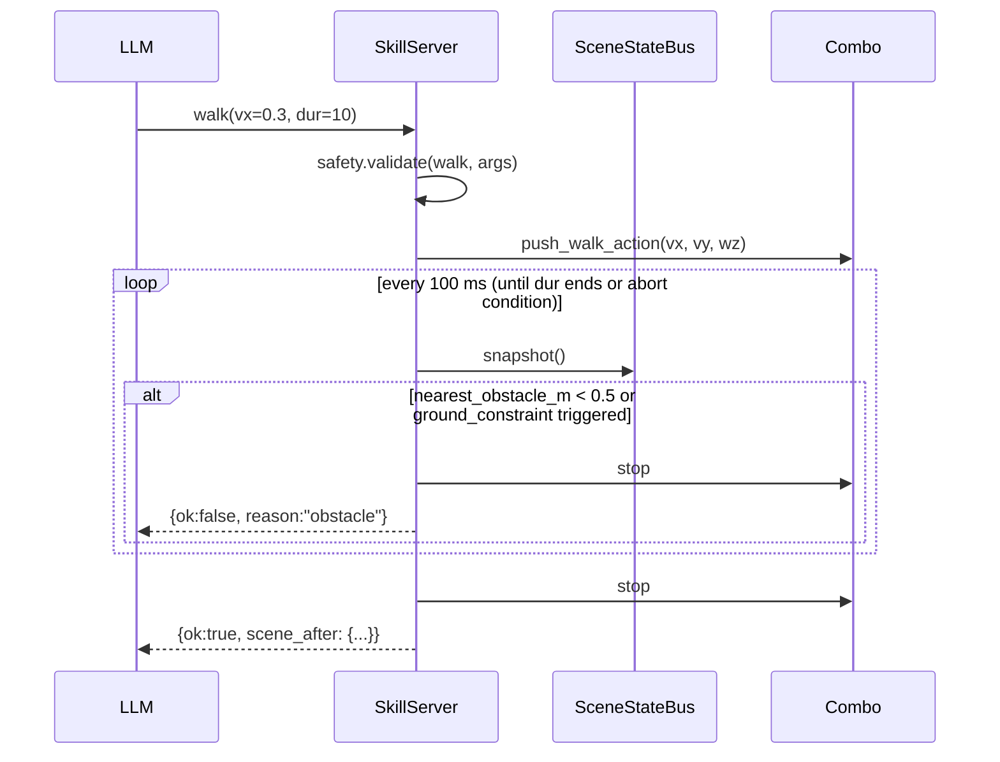
```mermaid
sequenceDiagram
  participant LLM
  participant SS as SkillServer
  participant SB as SceneStateBus
  participant Combo
  LLM->>SS: walk(vx=0.3, dur=10)
  SS->>SS: safety.validate(walk, args)
  SS->>Combo: push_walk_action(vx, vy, wz)
  loop every 100 ms (until dur ends or abort condition)
    SS->>SB: snapshot()
    alt nearest_obstacle_m < 0.5 or ground_constraint triggered
      SS->>Combo: stop
      SS-->>LLM: {ok:false, reason:"obstacle"}
    end
  end
  SS->>Combo: stop
  SS-->>LLM: {ok:true, scene_after: {...}}
```

> This is the **only place where code continuously reads perception during tool execution**, but the consumer is SkillServer, not the fast-brain LLM.

---

## 10. Safety Supervision: 11+1 Rules + FSM + Watchdog

### 10.1 The Safety Stack

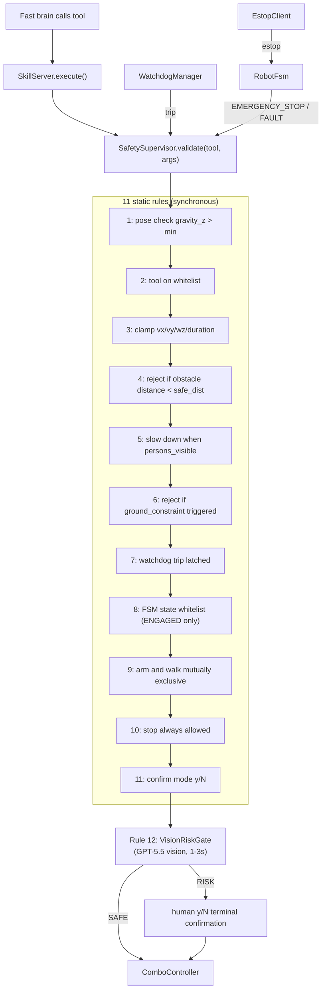
```mermaid
flowchart TB
  Tool["Fast brain calls tool"]
  SS["SkillServer.execute()"]
  V["SafetySupervisor.validate(tool, args)"]

  subgraph Rules["11 static rules (synchronous)"]
    R1["1: pose check gravity_z > min"]
    R2["2: tool on whitelist"]
    R3["3: clamp vx/vy/wz/duration"]
    R4["4: reject if obstacle distance < safe_dist"]
    R5["5: slow down when persons_visible"]
    R6["6: reject if ground_constraint triggered"]
    R7["7: watchdog trip latched"]
    R8["8: FSM state whitelist (ENGAGED only)"]
    R9["9: arm and walk mutually exclusive"]
    R10["10: stop always allowed"]
    R11["11: confirm mode y/N"]
  end

  R12["Rule 12: VisionRiskGate<br/>(GPT-5.5 vision, 1-3s)"]
  FSM["RobotFsm"]
  WD["WatchdogManager"]
  Combo["ComboController"]
  ESC["EstopClient"]

  Tool --> SS
  SS --> V
  V --> R1
  R1 --> R2 --> R3 --> R4 --> R5 --> R6 --> R7 --> R8 --> R9 --> R10 --> R11
  R11 --> R12
  R12 -- SAFE --> Combo
  R12 -- RISK --> Confirm["human y/N terminal confirmation"]
  Confirm --> Combo

  WD -- trip --> V
  ESC -- estop --> FSM
  FSM -- "EMERGENCY_STOP / FAULT" --> V
```

### 10.2 The 7-State FSM

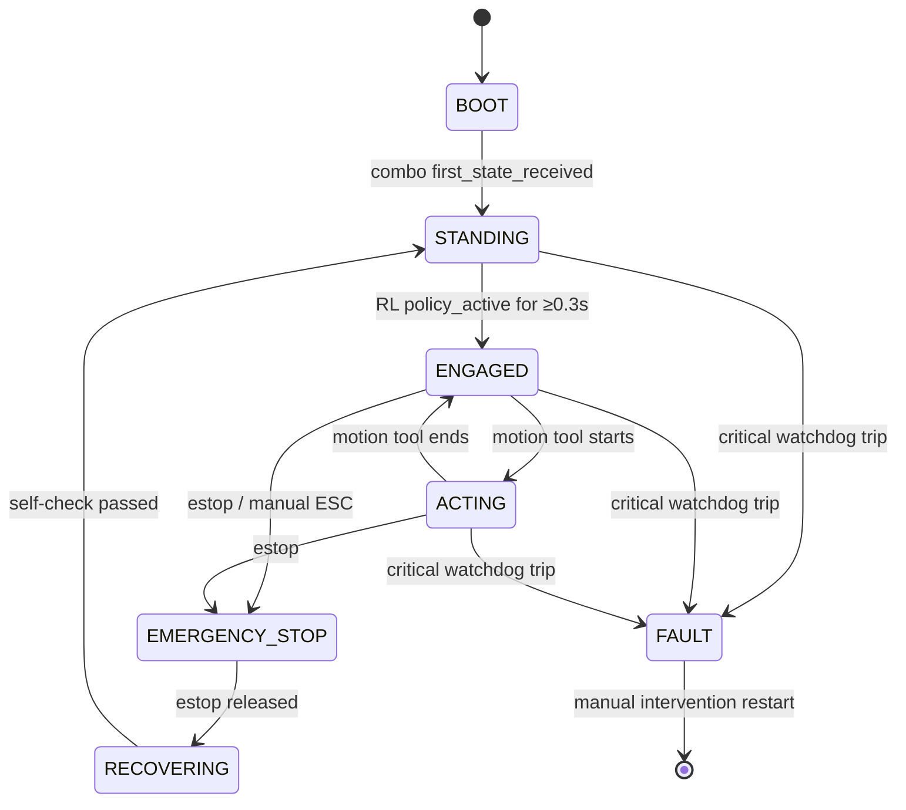
```mermaid
stateDiagram-v2
  [*] --> BOOT
  BOOT --> STANDING : combo first_state_received
  STANDING --> ENGAGED : RL policy_active for ≥0.3s
  ENGAGED --> ACTING : motion tool starts
  ACTING --> ENGAGED : motion tool ends
  ENGAGED --> EMERGENCY_STOP : estop / manual ESC
  ACTING --> EMERGENCY_STOP : estop
  EMERGENCY_STOP --> RECOVERING : estop released
  RECOVERING --> STANDING : self-check passed
  STANDING --> FAULT : critical watchdog trip
  ENGAGED --> FAULT : critical watchdog trip
  ACTING --> FAULT : critical watchdog trip
  FAULT --> [*] : manual intervention restart
```

> Safety does not allow any motion to execute in the BOOT / STANDING / EMERGENCY_STOP / FAULT states.

### 10.3 E-stop Process Separation

`EstopClient` **polls the `/tmp/g1_brain_estop` flag file** in the main process (default `safety.estop.flag_path`).

**Key**: the "true forced zero-torque" of the E-stop lives in a separate process, `estop_listener.py` (launched via its own systemd unit / terminal), which directly publishes 30 frames of zero-torque `rt/lowcmd`, **independent of the main process**. It keeps working even if the main process dies.

---

## 11. Audio Streaming and the Conversation State Machine

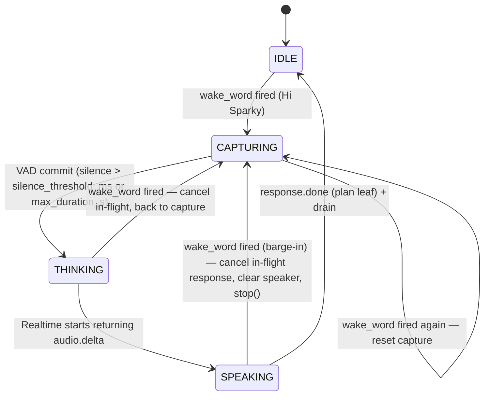
```mermaid
stateDiagram-v2
  [*] --> IDLE
  IDLE --> CAPTURING : wake_word fired (Hi Sparky)
  CAPTURING --> THINKING : VAD commit (silence > silence_threshold_ms or max_duration_s)
  THINKING --> SPEAKING : Realtime starts returning audio.delta
  SPEAKING --> CAPTURING : wake_word fired (barge-in) — cancel in-flight response, clear speaker, stop()
  SPEAKING --> IDLE : response.done (plan leaf) + drain
  CAPTURING --> CAPTURING : wake_word fired again — reset capture
  THINKING --> CAPTURING : wake_word fired — cancel in-flight, back to capture
```

### 11.1 Wake-Word Backend

- v1.1.0 defaults to `wakeword.backend=openai` (OpenAI Transcribe `gpt-4o-transcribe`, 1.5s rolling window)
- 1300 Hz entry RMS gate `rms_threshold=300` (avoids TTS self-triggering)
- AEC: subtract predicted echo using the speaker's recent `recent_played_rms(window_s)`

### 11.2 Barge-In Path ("Hi Sparky" can interrupt in any state)

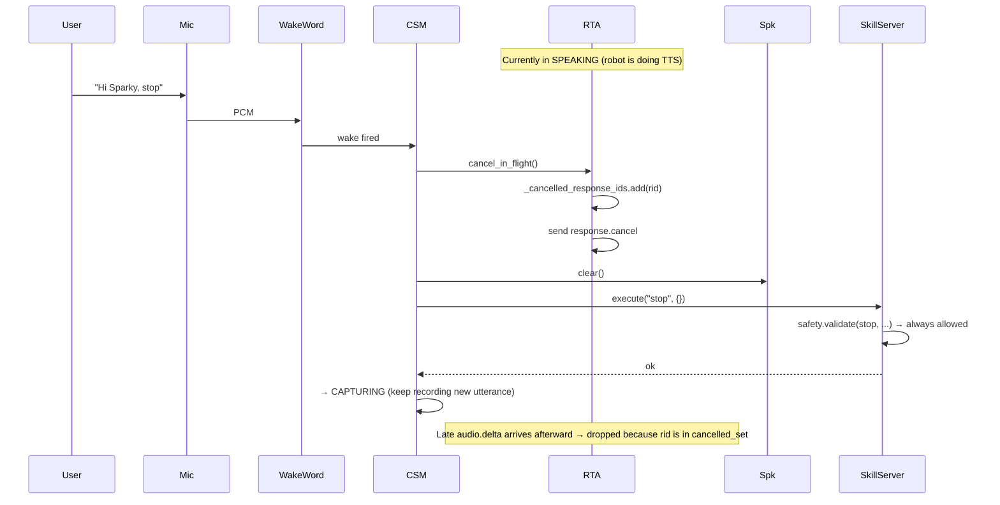
```mermaid
sequenceDiagram
  participant U as User
  participant Mic
  participant WW as WakeWord
  participant CSM
  participant RTA
  participant Spk
  participant SS as SkillServer

  Note over RTA: Currently in SPEAKING (robot is doing TTS)
  U->>Mic: "Hi Sparky, stop"
  Mic->>WW: PCM
  WW->>CSM: wake fired
  CSM->>RTA: cancel_in_flight()
  RTA->>RTA: _cancelled_response_ids.add(rid)
  RTA->>RTA: send response.cancel
  CSM->>Spk: clear()
  CSM->>SS: execute("stop", {})
  SS->>SS: safety.validate(stop, ...) → always allowed
  SS-->>CSM: ok
  CSM->>CSM: → CAPTURING (keep recording new utterance)
  Note over RTA: Late audio.delta arrives afterward → dropped because rid is in cancelled_set
```

> The user's latest patches (commits `3b7fff6`, `74722b3`, `a5383df`, `cf09042`, `42597de`) fix exactly this path's RMS gating and AEC delay.

---

## 12. End-to-End Timeline of a Complete Turn

> An end-to-end breakdown of the user saying **"Hi Sparky, walk over 0.5 m and look at that box."**

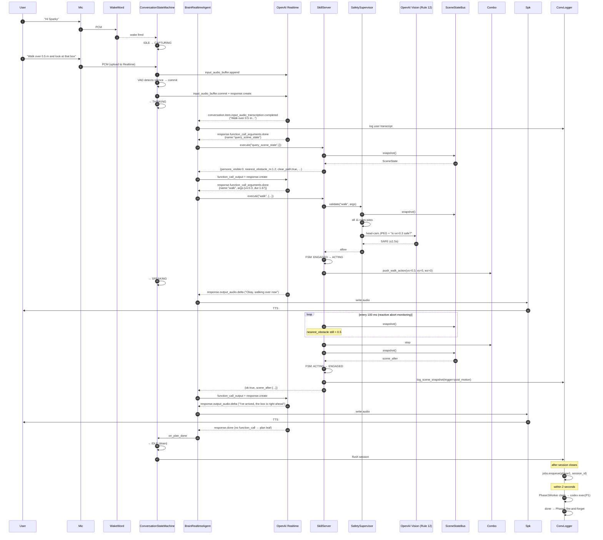
```mermaid
sequenceDiagram
  autonumber
  participant U as User
  participant Mic
  participant WW as WakeWord
  participant CSM as ConversationStateMachine
  participant RTA as BrainRealtimeAgent
  participant OAI as OpenAI Realtime
  participant SS as SkillServer
  participant Sup as SafetySupervisor
  participant Vis as OpenAI Vision (Rule 12)
  participant SB as SceneStateBus
  participant Combo
  participant Spk
  participant CL as ConvLogger

  U->>Mic: "Hi Sparky"
  Mic->>WW: PCM
  WW-->>CSM: wake fired
  CSM->>CSM: IDLE → CAPTURING

  U->>Mic: "Walk over 0.5 m and look at that box"
  Mic->>CSM: PCM (upload to Realtime)
  CSM->>OAI: input_audio_buffer.append
  CSM->>CSM: VAD detects silence → commit
  CSM->>OAI: input_audio_buffer.commit + response.create
  CSM->>CSM: → THINKING

  OAI-->>RTA: conversation.item.input_audio_transcription.completed<br/>("Walk over 0.5 m...")
  RTA->>CL: log user transcript
  OAI-->>RTA: response.function_call_arguments.done<br/>{name:"query_scene_state"}
  RTA->>SS: execute("query_scene_state",{})
  SS->>SB: snapshot()
  SB-->>SS: SceneState
  SS-->>RTA: {persons_visible:0, nearest_obstacle_m:1.2, clear_path:true, ...}
  RTA->>OAI: function_call_output + response.create

  OAI-->>RTA: response.function_call_arguments.done<br/>{name:"walk", args:{vx:0.3, dur:1.67}}
  RTA->>SS: execute("walk", {...})
  SS->>Sup: validate("walk", args)
  Sup->>SB: snapshot()
  Sup->>Sup: all 11 rules pass
  Sup->>Vis: head-cam JPEG + "is vx=0.3 safe?"
  Vis-->>Sup: SAFE (≤1.5s)
  Sup-->>SS: allow

  SS->>SS: FSM: ENGAGED → ACTING
  SS->>Combo: push_walk_action(vx=0.3, vy=0, wz=0)
  CSM->>CSM: → SPEAKING
  OAI-->>RTA: response.output_audio.delta ("Okay, walking over now")
  RTA->>Spk: write audio
  Spk->>U: TTS

  loop every 100 ms (reactive abort monitoring)
    SS->>SB: snapshot()
    Note over SS: nearest_obstacle still > 0.5
  end

  SS->>Combo: stop
  SS->>SB: snapshot()
  SB-->>SS: scene_after
  SS->>SS: FSM: ACTING → ENGAGED
  SS->>CL: log_scene_snapshot(trigger=post_motion)
  SS-->>RTA: {ok:true, scene_after:{...}}
  RTA->>OAI: function_call_output + response.create

  OAI-->>RTA: response.output_audio.delta ("I've arrived, the box is right ahead")
  RTA->>Spk: write audio
  Spk->>U: TTS
  OAI-->>RTA: response.done (no function_call → plan leaf)
  RTA->>CSM: on_plan_done
  CSM->>CSM: → IDLE (drain)
  CSM->>CL: flush session

  Note over CL: after session closes
  CL->>CL: jobs.enqueue(phase1, session_id)
  Note over CL: within 2 seconds
  CL->>CL: Phase1Worker claim → codex exec(P1)
  CL->>CL: done → Phase2 fire-and-forget
```

**This single turn touched**:
- 4 LLM services (Realtime / Vision / TTS / Codex Phase 1/2)
- 3 of the 18 tools (`query_scene_state` / `walk` / an implicit `say` via the TTS delta)
- 2 processes (main + combo)
- one background Phase 1/2 asynchronous digestion

---

## 13. Key Questions Answered

### Q1: Is the fast brain's local perception not doing anything?

**Conclusion: partly true — for the fast brain's "semantic awareness," it is partial.**

| Dimension | Is perception effective? |
|------|---------------------|
| Safety (snapshots on every validate) | ✅ continuously effective |
| Watchdog (reads frame_age at 10 Hz) | ✅ continuously effective |
| Reactive abort (checks every 100 ms during walk) | ✅ continuously effective |
| The motion tool's `scene_after` injection | ✅ after every motion |
| The fast brain's active decision ("should I take a look?") | ⚠️ **depends on the LLM deciding to call `query_scene_state` itself** |
| A continuous visual stream (YOLO frames fed into the LLM frame by frame) | ❌ **no such path exists** |

**In other words**:
- Your YOLO/Pose/depth/ground all run at 5-15 Hz
- but **the fast-brain LLM never receives their real-time output**
- it "takes a look at the world" only at two moments:
  1. when it actively calls `query_scene_state` / `describe_scene` itself
  2. the `scene_after` field returned by the previous motion tool

**If your system prompt doesn't tell the LLM to "query_scene_state before acting," it really won't look.** This is the root cause of the user feeling "perception isn't being used."

> **If you want perception to be continuously pushed to the fast brain**, one of the things to do is:
> - open a ticker in the main loop that calls `RTA.inject_perception_event(scene.snapshot().summary_for_llm())` every N seconds (e.g. 5s)
> - but this significantly raises the Realtime token cost — a trade-off to weigh

### Q2: Is the harness's memory recall executed in real time by a realtime tool agent?

**Partly right, partly wrong — it depends on which tool you're looking at.**

- If what you see in the logs is `recall_grep` / `recall_read` / `recall_glob` — **pure Python, no LLM** — it is `RecallSearcher` directly running `rg`/`cat`/`glob`.
- If what you see is `ask_slow_brain` — **that is codex mcp-server**, a genuine LLM agent that runs rg + cat + sed in its own sandbox.

So the phrase "a tool agent called in realtime" is itself imprecise: in v1.1.0 only `ask_slow_brain` is an agent; the other recall_* are bare functions.

### Q3: When exactly does Codex come into play?

**Three moments, and only these three**:

1. **The fast brain actively calls `ask_slow_brain`** (codex mcp-server daemon) — online, on-demand, the most commonly visible path
2. **Phase 1 is enqueued after a session closes** (codex exec --json --ephemeral) — offline, inevitable, once per session
3. **Phase 1's completion callback triggers Phase 2** (codex exec --json --ephemeral) — offline, inevitable, triggered every time P1 completes

**Things Codex does not participate in** (which the user may mistakenly think it does):
- It does not participate in each conversation turn's decision (that is the Realtime LLM)
- It does not participate in pure-function tools like `recall_grep`
- It does not participate in `describe_scene` (that is OpenAI Vision, completely independent of codex)
- It does not participate in safety validate (that is Python rules + optional GPT-Vision)
- It does not participate in perception (perception is all local small models + numerical algorithms)

### Q4: What is the current design of the fast/slow brains?

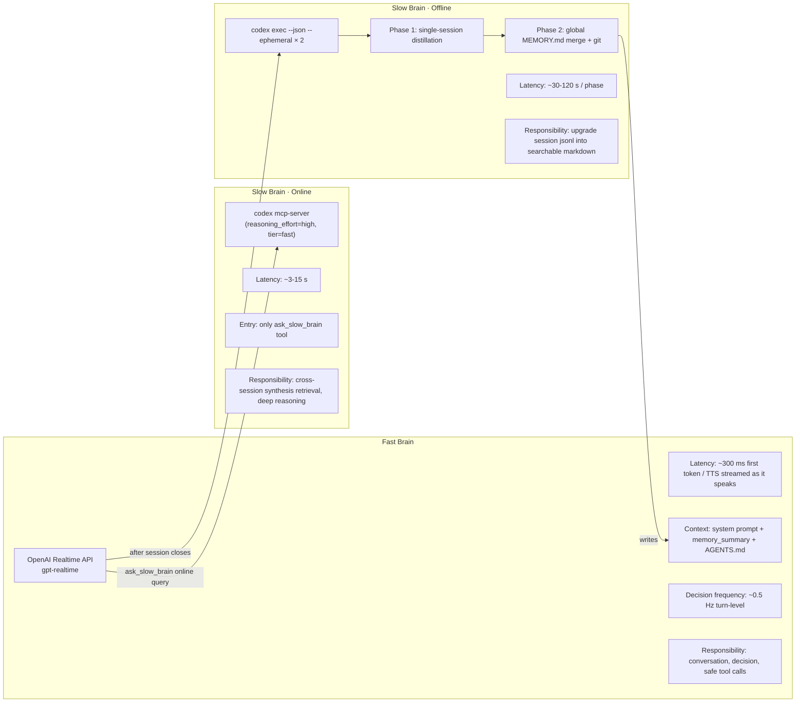
```mermaid
flowchart LR
  subgraph FB["Fast Brain"]
    direction TB
    FB1["OpenAI Realtime API<br/>gpt-realtime"]
    FB2["Latency: ~300 ms first token / TTS streamed as it speaks"]
    FB3["Context: system prompt + memory_summary + AGENTS.md"]
    FB4["Decision frequency: ~0.5 Hz turn-level"]
    FB5["Responsibility: conversation, decision, safe tool calls"]
  end

  subgraph SB1["Slow Brain · Online"]
    direction TB
    SB11["codex mcp-server<br/>(reasoning_effort=high, tier=fast)"]
    SB12["Latency: ~3-15 s"]
    SB13["Entry: only ask_slow_brain tool"]
    SB14["Responsibility: cross-session synthesis retrieval, deep reasoning"]
  end

  subgraph SB2["Slow Brain · Offline"]
    direction TB
    SB21["codex exec --json --ephemeral × 2"]
    SB22["Phase 1: single-session distillation"]
    SB23["Phase 2: global MEMORY.md merge + git"]
    SB24["Latency: ~30-120 s / phase"]
    SB25["Responsibility: upgrade session jsonl into searchable markdown"]
  end

  FB1 -- "ask_slow_brain online query" --> SB11
  FB1 -- "after session closes" --> SB21
  SB21 --> SB22 --> SB23
  SB23 -- writes --> FB3
```

**The core decoupling philosophy of v1.1.0**:
- **The fast brain does "fast response, coarse decisions"** — end-to-end < 1s, and if it's wrong you can just ask again
- **The slow brain does "slow thinking, fine synthesis"** — 10s+ is acceptable, and it must produce a citable answer
- **Both share the `memories/` directory as the single source of truth** — the fast brain reads it directly via grep, the slow brain synthesizes its output via codex

---

## 14. Known Limitations and Next Steps

### 14.1 Parts of v1.1.0 that are empirically working

- ✅ Realtime fast brain + 18 tools
- ✅ SafetySupervisor 11+1 rules + FSM + Watchdog
- ✅ Phase 1 + Phase 2 offline digestion
- ✅ codex daemon `ask_slow_brain` tool
- ✅ `recall_*` pure-function tools
- ✅ Hi-Sparky wake word + barge-in (including interrupting during SPEAKING)
- ✅ ComboProxy subprocess isolation

### 14.2 Known Limitations (consistent with the user's suspicions)

| Limitation | Impact | Mitigation |
|------|------|------|
| **The fast brain has no continuous perception stream** | The LLM's "continuous sense" of the world depends entirely on its own query decisions | 1) Prompt it to call `query_scene_state` more diligently<br/>2) Add a ticker that pushes `inject_perception_event` |
| **Raw detections invisible to the fast brain** | YOLO classes / confidence / box coordinates are all compressed into the 5-6 fields of `summary_for_llm()` | Add a dedicated `query_detections_raw()` tool |
| **The codex daemon never "thinks proactively" on its own** | The fast brain must actively ask | This is correct by design — it avoids idle token spend — but make sure the prompt guides the fast brain on when to ask |
| **Phase 2's rewrite-style merge** | It rewrites the full MEMORY.md every time, producing huge git diffs | Could later be changed to incremental patches |
| **Timing between ConversationLogger and Phase 1** | The jsonl must be fully flushed before it can be digested, so shutdown leaves memory 30s | Already configured at agent_main.py:1234 |

### 14.3 If you want the fast brain to "truly consume perception"

The least invasive change (directions only, not full implementation):
1. After `agent_main.py:1140`, add an asyncio task that every N seconds runs `await brain_agent.inject_perception_event(scene.snapshot().summary_for_llm())`
2. Add a line to the system prompt: `"You will receive periodic perception summaries as system messages; treat them as context, don't always respond."`
3. Add a "dedup" check inside `BrainRealtimeAgent.inject_perception_event` (send only when the scene changes beyond a threshold) to avoid wasting tokens

Or, conversely — keep the on-demand mode but **reinforce "must query before acting" in the system prompt** — this adds no token cost and simply makes the LLM call it of its own accord.

### 14.4 If you want codex to be "more proactive"

Options to consider:
- Automatically call ask_slow_brain for a "mid-session reflection" when jsonl writes reach a threshold (event-driven, not cron)
- Have the codex daemon be automatically pinged on abnormal FSM transitions like FAULT / EMERGENCY_STOP (to provide post-hoc analysis)

But **note**: these all add token cost / latency and conflict with the "the slow brain is an on-demand brain" design philosophy. Confirm the necessity before doing them.

---

## 15. Phone Bridge (Twilio + Realtime, 2026-05-24 Increment)

> This section is an **increment** on top of the v1.1.0 main version, covering the `g1_brain/g1_brain/phone/` subpackage and its cross-process coordination.
> Design draft: `mcp_twilio_design.md` in the repo root (1765 lines) ·
> Spec: `docs/superpowers/specs/2026-05-24-twilio-realtime-phone-bridge-design.md` ·
> Implementation plan: `docs/superpowers/plans/2026-05-24-twilio-phone-bridge.md` ·
> Verified working on: 2026-05-24 (commit `8c8fd5b`).

### 15.1 Design Principles

| Principle | Implementation |
|---|---|
| Zero-copy on the safety side | Phone-side tool calls go directly into the existing `SkillServer.execute()` — no copy of SafetySupervisor, no copy of vision_risk_gate, no copy of SkillServer. |
| In-process bridging | bridge_server shares the same process and asyncio loop as the brain; tool dispatch is an in-process method call. |
| Zero public exposure | The bridge listens only on `127.0.0.1:8787` and never binds `0.0.0.0`; the public entry goes through VPS nginx + an autossh reverse tunnel. |
| Dual-microphone mutual exclusion | `/tmp/g1_brain_voice_lease` (fcntl.flock'd JSON) ensures the local mic and the phone never drive the robot at the same time. |
| Fail-closed | `safety.vision_gate.enabled=false` → the bridge refuses to start; bad Twilio signature → 403; caller not on the whitelist → hang up immediately; start_phone_call target not on the whitelist → refuse to dial. |

### 15.2 Task-Tree Extension

`agent_main --enable-phone` **appends** one asyncio task and a set of on-demand subtasks on top of the original v1.1.0 task tree:

```
agent_main main process (original v1.1.0)
│
├── BrainRealtimeAgent (Fast Brain, local mic) ···· §6
├── CodexDaemon (Slow Brain online) ·············· §7
├── Phase1Worker / Phase2Worker ·················· §8
├── ComboProxy subprocess ························ §3
├── CameraHub / YOLO / Pose / Watchdog ··········· §3
│
└── 🆕 phone/bridge_server.py
       └── aiohttp.web.AppRunner @ 127.0.0.1:8787
              ├── GET /healthz   ── always on
              └── GET /twilio (Upgrade)
                     └── spawn a task group per incoming call (call lifetime):
                            ├── PhoneRealtimeSession.run()
                            │     ├── _uplink(ws)  ── Twilio media → OpenAI
                            │     └── _downlink(ws) ── OpenAI events → _handle_event
                            └── _kick (response.create greeting)
```

When the call ends, the `finally` clause guarantees: (1) a defensive `skill_server.execute("stop", {})`; (2) `VoiceLease.release(PHONE)`; (3) `transport.close()`.

### 15.3 PhoneRealtimeSession Inheritance Diagram

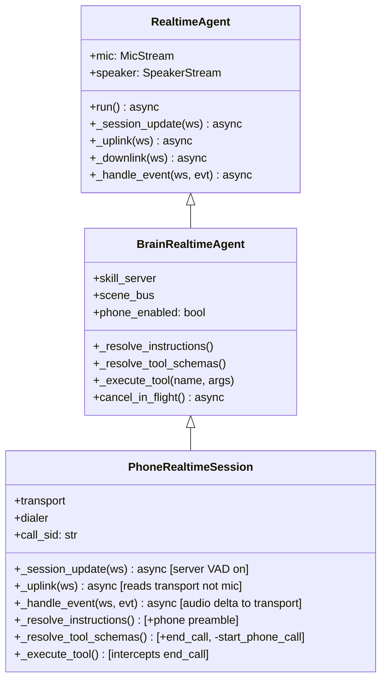
```mermaid
classDiagram
    class RealtimeAgent {
      +mic: MicStream
      +speaker: SpeakerStream
      +run() async
      +_session_update(ws) async
      +_uplink(ws) async
      +_downlink(ws) async
      +_handle_event(ws, evt) async
    }
    class BrainRealtimeAgent {
      +skill_server
      +scene_bus
      +phone_enabled: bool
      +_resolve_instructions()
      +_resolve_tool_schemas()
      +_execute_tool(name, args)
      +cancel_in_flight() async
    }
    class PhoneRealtimeSession {
      +transport
      +dialer
      +call_sid: str
      +_session_update(ws) async [server VAD on]
      +_uplink(ws) async [reads transport not mic]
      +_handle_event(ws, evt) async [audio delta to transport]
      +_resolve_instructions() [+phone preamble]
      +_resolve_tool_schemas() [+end_call, -start_phone_call]
      +_execute_tool() [intercepts end_call]
    }
    RealtimeAgent <|-- BrainRealtimeAgent
    BrainRealtimeAgent <|-- PhoneRealtimeSession
```

**Override principle**: override only 5 methods + add 3 new dataclass fields. `SkillServer.execute`, `SafetySupervisor.validate`, `vision_risk_gate.review`, conversation_logger, the plan tracker, and the barge-in cancel logic — **all inherited untouched**.

### 15.4 End-to-End Timeline of a Phone Call

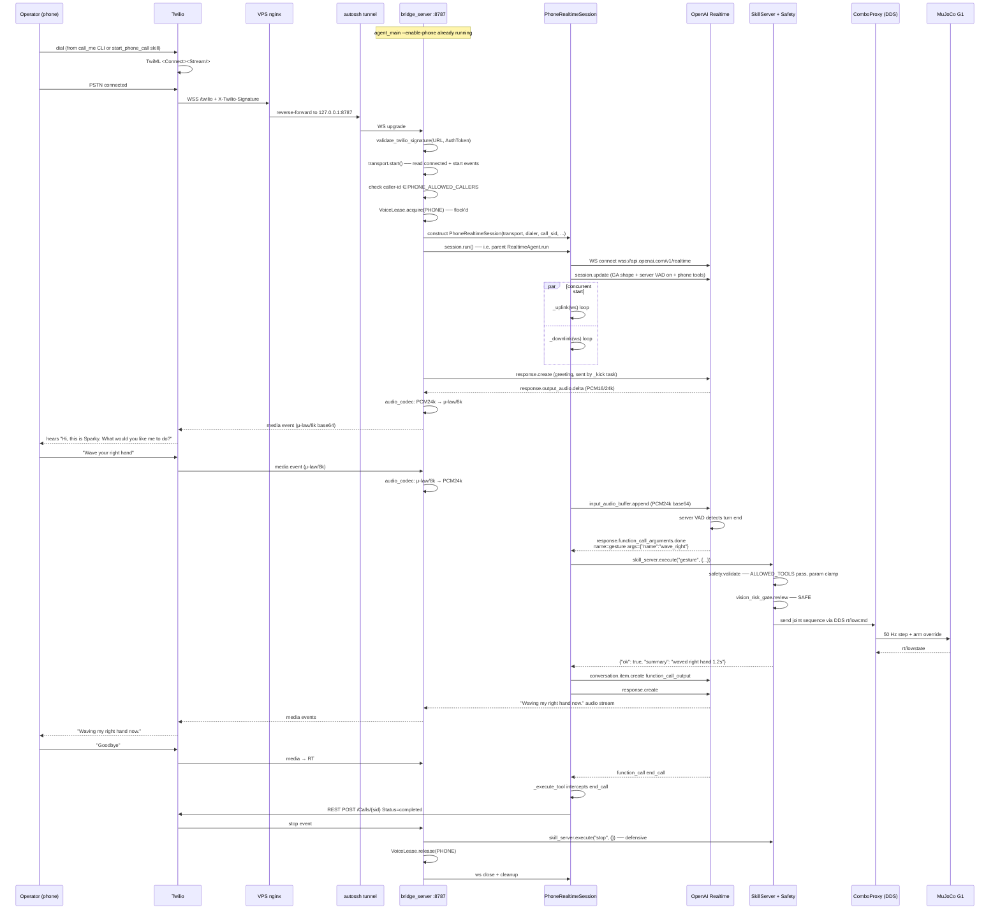
```mermaid
sequenceDiagram
    participant Op as Operator (phone)
    participant Twilio
    participant Nginx as VPS nginx
    participant Autossh as autossh tunnel
    participant Bridge as bridge_server :8787
    participant Session as PhoneRealtimeSession
    participant RT as OpenAI Realtime
    participant SS as SkillServer + Safety
    participant Combo as ComboProxy (DDS)
    participant Robot as MuJoCo G1

    Note over Bridge: agent_main --enable-phone already running
    Op->>Twilio: dial (from call_me CLI or start_phone_call skill)
    Twilio->>Twilio: TwiML <Connect><Stream/>
    Op->>Twilio: PSTN connected
    Twilio->>Nginx: WSS /twilio + X-Twilio-Signature
    Nginx->>Autossh: reverse-forward to 127.0.0.1:8787
    Autossh->>Bridge: WS upgrade
    Bridge->>Bridge: validate_twilio_signature(URL, AuthToken)
    Bridge->>Bridge: transport.start() ── read connected + start events
    Bridge->>Bridge: check caller-id ∈ PHONE_ALLOWED_CALLERS
    Bridge->>Bridge: VoiceLease.acquire(PHONE) ── flock'd
    Bridge->>Session: construct PhoneRealtimeSession(transport, dialer, call_sid, ...)
    Bridge->>Session: session.run()  ── i.e. parent RealtimeAgent.run
    Session->>RT: WS connect wss://api.openai.com/v1/realtime
    Session->>RT: session.update (GA shape + server VAD on + phone tools)
    par concurrent start
        Session->>Session: _uplink(ws) loop
    and
        Session->>Session: _downlink(ws) loop
    end
    Bridge->>RT: response.create (greeting, sent by _kick task)
    RT-->>Bridge: response.output_audio.delta (PCM16/24k)
    Bridge->>Bridge: audio_codec: PCM24k → μ-law/8k
    Bridge-->>Twilio: media event (μ-law/8k base64)
    Twilio-->>Op: hears "Hi, this is Sparky. What would you like me to do?"

    Op->>Twilio: "Wave your right hand"
    Twilio->>Bridge: media event (μ-law/8k)
    Bridge->>Bridge: audio_codec: μ-law/8k → PCM24k
    Session->>RT: input_audio_buffer.append (PCM24k base64)
    RT->>RT: server VAD detects turn end
    RT-->>Session: response.function_call_arguments.done<br/>name=gesture args={"name":"wave_right"}
    Session->>SS: skill_server.execute("gesture", {...})
    SS->>SS: safety.validate ── ALLOWED_TOOLS pass, param clamp
    SS->>SS: vision_risk_gate.review ── SAFE
    SS->>Combo: send joint sequence via DDS rt/lowcmd
    Combo->>Robot: 50 Hz step + arm override
    Robot-->>Combo: rt/lowstate
    SS-->>Session: {"ok": true, "summary": "waved right hand 1.2s"}
    Session->>RT: conversation.item.create function_call_output
    Session->>RT: response.create
    RT-->>Bridge: "Waving my right hand now." audio stream
    Bridge-->>Twilio: media events
    Twilio-->>Op: "Waving my right hand now."

    Op->>Twilio: "Goodbye"
    Twilio->>Bridge: media → RT
    RT-->>Session: function_call end_call
    Session->>Session: _execute_tool intercepts end_call
    Session->>Twilio: REST POST /Calls/{sid} Status=completed
    Twilio->>Bridge: stop event
    Bridge->>SS: skill_server.execute("stop", {}) ── defensive
    Bridge->>Bridge: VoiceLease.release(PHONE)
    Bridge->>Session: ws close + cleanup
```

### 15.5 Submodule Inventory

| File | LOC | Responsibility |
|---|---|---|
| `phone/config.py` | ~95 | Pydantic `TwilioConfig` + `PhoneConfig`; `load_from_env()` raises `PhoneConfigError` immediately on failure. |
| `phone/audio_codec.py` | ~95 | `mulaw8k_to_pcm24k` / `pcm24k_to_mulaw8k` (scipy `resample_poly`, integer ratio 1:3 / 3:1, `np.clip` to prevent int16 wrap) + `StreamingResampler` carries frames across calls. |
| `phone/voice_lease.py` | ~145 | `VoiceLeaseManager{LOCAL_MIC, PHONE}`; `/tmp/g1_brain_voice_lease` + `fcntl.flock(LOCK_EX)`; stale leases auto-reclaimed (default 1 h). |
| `phone/tunnel_health.py` | ~50 | `validate_twilio_signature()` HMAC-SHA1 constant-time; `build_healthz_payload()`. |
| `phone/twilio_dialer.py` | ~135 | REST `dial(to)` / `hangup(sid)` / `dry_run()`; defaults to Account SID + Auth Token auth (see the `_auth()` comment for the API Key path). |
| `phone/twilio_transport.py` | ~115 | aiohttp WS protocol adapter: `start()` reads `connected` + `start` → `StartEvent`; `iter_inbound_pcm24k()` async-iterates; `send_outbound_pcm24k()` goes through `StreamingResampler`; `clear_outbound()` is for barge-in. |
| `phone/realtime_session.py` | ~155 | `PhoneRealtimeSession` (inherits `BrainRealtimeAgent`); overrides `_uplink` / `_handle_event(audio delta + speech_started)` / `_session_update` (server VAD on) / `_resolve_*` / `_execute_tool(end_call)`; `END_CALL_SCHEMA`. |
| `phone/bridge_server.py` | ~240 | `build_app(...)` → aiohttp; `/healthz` + `/twilio` WS routes; `_build_phone_session` injects `safety=skill_server.safety` (not a MagicMock — fixed after a live-fire incident on 2026-05-24). |
| `phone/call_me.py` | ~55 | CLI `python -m g1_brain.phone.call_me [--to ...] [--dry-run]`. |

### 15.6 Cross-File Changes

| File | Change |
|---|---|
| `brain/realtime_agent.py` | Add a `phone_enabled: bool = False` field; `_resolve_tool_schemas()` passes it to `build_tool_schemas(phone_enabled=...)`. |
| `brain/prompts.py` | Add a new constant `PHONE_CALL_PREAMBLE` (pins the language = reply in whatever the caller uses, default English). |
| `skills/tool_schemas.py` | Add `START_PHONE_CALL_SCHEMA` + `END_CALL_SCHEMA`; `build_tool_schemas` gains a `phone_enabled` kwarg; append `start_phone_call` only when true. |
| `skills/skill_server.py` | `__init__` adds `dialer=None`, `default_phone_to=None`; `_skill_start_phone_call(*, to=None)`; `_allowed_phone_callers` whitelist gate (added after the 2026-05-24 live-fire ASR-mishear incident). |
| `safety/supervisor.py` | `ALLOWED_TOOLS_NO_MOTION` gains `start_phone_call` and `end_call`; `_sanitize_no_motion` gains the corresponding branches. |
| `apps/agent_main.py` | Add a `--enable-phone` flag; when enabled: load_phone_env → require `safety.vision_gate.enabled=true` → `TwilioDialer` → late-wire `_dialer` / `_default_phone_to` / `_allowed_phone_callers` onto the already-constructed `skill_server` → `build_app` → `aiohttp.web.TCPSite` binds `phone.bind_host:bind_port` (default `127.0.0.1:8787`). |
| `configs/g1_brain.yaml` | Append a `phone:` block at the end; `enabled: false` by default. |
| `.env.example` | Add 7 Twilio + bridge variable templates. |
| `pyproject.toml` | Add `aiohttp>=3.9`, `pydantic>=2.0`, `scipy>=1.11`, `twilio>=9.0` to dependencies. |

### 15.7 Differences in the Safety Stack for the Phone Scenario

| Rule | Handling in the phone scenario |
|---|---|
| run_mode | **Forced to `active`**; you can't type y/N at a terminal over the phone. |
| Rule 12 (vision_risk_gate) | **Replaces** the y/N prompt. `safety.vision_gate.enabled` must be true, or the bridge fail-closes and refuses to start. |
| Rule 1 (whitelist) | `ALLOWED_TOOLS_NO_MOTION` already includes `start_phone_call` + `end_call`. |
| Caller-ID | Bridge-side whitelist: the `PHONE_ALLOWED_CALLERS` environment variable. |
| Dial-target whitelist | Skill-side: `SkillServer._allowed_phone_callers`. Even if wake-word ASR mishears (a real incident: `+6848` heard as `+6888`), it cannot dial out to strangers. |
| Twilio HMAC | The bridge validates `X-Twilio-Signature` on every WS upgrade (HMAC-SHA1 over the URL, constant-time compare). |
| Voice lease | `/tmp/g1_brain_voice_lease`, fcntl.flock'd JSON. LOCAL_MIC and PHONE hold the brain mutually exclusively; after 1 h stale it can be preempted. |

### 15.8 Known Limitations

- **Concurrent calls**: the bridge accepts only one phone session at a time (VoiceLease has a single PHONE slot); supporting multiple operators requires first extending `VoiceLeaseManager` and the `_twilio_ws` active-call counter.
- **Inbound calls**: currently only outbound dialing is implemented; to support inbound you need to add a `/twiml/inbound` route and point the number's Voice URL at it in the Twilio console. It still goes through the caller-id whitelist.
- **STT robustness on digits**: the `gpt-4o-mini-transcribe` used by the local wake word has limited precision on long digit strings like `+61411706848`; the whitelist is a backstop, but the UX can still be "I told you to dial 8 and you said you'd dial 8888." Prompt engineering / DTMF / short codes may be more reliable.
- **trial-account preroll**: a Twilio Trial account inserts a "by upgrading press any key..." message on every outbound call; upgrading the account removes it.
- **Cross-geo / international dialing**: a Twilio account enables only US/Canada outbound by default; other regions (e.g. Australia) require explicitly enabling them in console → Voice Geo Permissions.

### 15.9 Live Verification Record (2026-05-24)

| Step | Result |
|---|---|
| 1. Tunnel reachable from the public internet | `curl https://twilio.openproduct.cn/healthz` returns 200 + correct JSON from outside ✅ |
| 2. Twilio credentials dry-run | `call_me --dry-run` outputs "My first Twilio account" ✅ |
| 3. Full-stack startup | T1 sim + T3 brain+phone bridge running simultaneously; log shows "phone bridge listening on 127.0.0.1:8787" ✅ |
| 4. Outbound dialing | `python -m g1_brain.phone.call_me` triggers a ring ✅ |
| 5. Audio bridge (bidirectional) | On connect, an English greeting is heard; "Say hello in French" gets a French reply ✅ |
| 6. **Robot acts on phone commands** | "Wave your right hand" → tool: gesture(wave_right) → safety pass → vision_gate SAFE → DDS → **MuJoCo G1 actually waves** ✅ |

### 15.10 Roadmap

- Have the model proactively ask for the operator's name / short-command preferences at the start of a call (to reduce the STT mishear rate).
- Add a DTMF channel: phone keys 0 = immediate E-stop, 1 = confirm, 2 = cancel.
- Integrate with the memory subsystem: a phone session's jsonl goes through the same Phase 1 / Phase 2 pipeline (in theory it already does, since ConversationLogger is shared by the brain; pending an end-to-end test).

---

## Appendix A: Key file:line Index

| Concern | File:line |
|--------|---------|
| Main entry point | `g1_brain/apps/agent_main.py:519-1238` |
| DDS must precede CameraHub | `agent_main.py:595-598` |
| ComboProxy startup | `agent_main.py:680-704` |
| MemorySubsystem.start | `g1_brain/memory/__init__.py:95-109` |
| Codex daemon spawn command | `g1_brain/memory/daemon.py:417-435` |
| `_wrap_recall_prompt` preamble | `daemon.py:348-406` |
| Phase1Worker._loop | `g1_brain/memory/phase1.py:321-487` |
| Phase 2 global lock | `g1_brain/memory/phase2.py:115-129` |
| RecallSearcher | `g1_brain/memory/recall.py:31-180` |
| SkillServer.execute | `g1_brain/skills/skill_server.py:194-298` |
| `scene_after` injection | `skill_server.py:277-281` |
| BrainRealtimeAgent._execute_tool | `g1_brain/brain/realtime_agent.py:163-182` |
| inject_perception_event | `realtime_agent.py:531-559` |
| cancel_in_flight + rid drop | `realtime_agent.py:115-117, 199-210` |
| PerceptionRunner | `g1_brain/perception/runner.py:44-126` |
| ground_loop | `runner.py:170-205` |
| SceneStateBus snapshot | `g1_brain/scene_state/fusion.py` |
| RobotFsm 7 states | `g1_brain/safety/state_machine.py:84-...` |
| EstopClient | `g1_brain/safety/estop_client.py` |
| `_skill_recall_grep` | `skill_server.py:753-774` |
| `_skill_ask_slow_brain` | `skill_server.py:815-844` |
| Config defaults (effort=high, tier=fast) | `g1_brain/memory/schemas.py:131-133` |
| 🆕 **Phone bridge** entry + startup checks | `g1_brain/apps/agent_main.py:1055-1090` |
| 🆕 Bridge aiohttp app builder | `g1_brain/phone/bridge_server.py:30-55` |
| 🆕 Bridge WS handler (signature + whitelist + lease) | `g1_brain/phone/bridge_server.py:65-145` |
| 🆕 PhoneRealtimeSession class | `g1_brain/phone/realtime_session.py:30-155` |
| 🆕 `_session_update` override (server VAD on) | `g1_brain/phone/realtime_session.py:60-100` |
| 🆕 `audio_codec.StreamingResampler` | `g1_brain/phone/audio_codec.py:55-95` |
| 🆕 `VoiceLeaseManager.acquire` | `g1_brain/phone/voice_lease.py:67-95` |
| 🆕 `validate_twilio_signature` | `g1_brain/phone/tunnel_health.py:18-40` |
| 🆕 `TwilioDialer._auth` / `dial` / `dry_run` | `g1_brain/phone/twilio_dialer.py:30-130` |
| 🆕 `_skill_start_phone_call` + whitelist gate | `g1_brain/skills/skill_server.py:709-735` |
| 🆕 `ALLOWED_TOOLS_NO_MOTION` includes `start_phone_call` + `end_call` | `g1_brain/safety/supervisor.py` |
| 🆕 `PHONE_CALL_PREAMBLE` | `g1_brain/brain/prompts.py:175-200` |

## Appendix B: Quick Diff of v1.1.0 vs v1.0

- Added Rule 12 (GPT-Vision risk gate) — after the 11 static rules, before the user's y/N
- Added the `recall_grep` / `recall_read` / `recall_glob` / `ask_slow_brain` tools
- Added the persistent codex mcp-server daemon
- Added the Phase 1 / Phase 2 offline digestion pipeline + memories/.git
- Added ConversationLogger (Claude-harness-compatible jsonl)
- Reworked the wake word: from va-demo's "only-in-IDLE" to "any-state barge-in"
- Reworked audio control: cleaned-RMS gate + AEC delay (commit `74722b3`)

### v1.1.1 Increment (2026-05-24, Phone Bridge)

- Added the `g1_brain/phone/` subpackage (config / audio_codec / voice_lease / tunnel_health / twilio_dialer / twilio_transport / realtime_session / bridge_server / call_me), ~1200 LOC + 46 tests total.
- Added 2 LLM tools: `start_phone_call` (local-mic side, with a number whitelist gate) + `end_call` (phone-session side).
- Added 1 brain dataclass field: `BrainRealtimeAgent.phone_enabled` (injected via agent_main's `--enable-phone`).
- Changed `safety/supervisor.py::ALLOWED_TOOLS_NO_MOTION`: added `start_phone_call` + `end_call`.
- Changed `brain/prompts.py`: added `PHONE_CALL_PREAMBLE` (pins the caller's language, default English).
- Changed `apps/agent_main.py`: `--enable-phone` flag + late-wire dialer + fail-closed on `safety.vision_gate.enabled=false`.
- Changed `configs/g1_brain.yaml`: appended a `phone:` section at the end.
- Changed `pyproject.toml`: added `aiohttp`, `pydantic`, `scipy`, `twilio` dependencies.
- Added a systemd-user unit `sparkytun-tunnel.service` (autossh reverse tunnel to the VPS).
- Public entry `wss://twilio.openproduct.cn/twilio` (nginx + Let's Encrypt).
- Verified working: CLI dial → phone rings → bidirectional call audio → phone voice command → MuJoCo G1 actually waves (CallSid `CAb849c8e4eae9efcd5051f1e08f3e88e8` and several more).

---

*Document version: 1.1.0-runtime (+ 1.1.1-phone-bridge 2026-05-24 increment)*
*Generated: 2026-05-24*
*Maintainer: the author; if anything disagrees with the code, the code wins — please file an issue.*
