# g1_brain v1.1.0 — 完整运行时手册

> 本文件是 **v1.1.0 (May 2026)** 时刻的 g1_brain 端到端运行时快照。
>
> 与早期 `architecture.md` / `structure.md` 的区别：
> - 那两份是 **设计意图** 文档；本份是 **代码实际行为** 的实证审计。
> - 重点回答三个常被误解的问题：
>   1. **本地 perception 到底有没有进入快脑？**
>   2. **Codex 到底在什么时刻被调用？**
>   3. **`recall_*` 是 LLM-in-the-loop 的工具代理吗？还是纯 Python？**
>
> 所有结论都附 `file:line` 引用，可直接 `Ctrl+G` 验证。

---

## 目录

1. [一句话总览](#1-一句话总览)
2. [系统全景图](#2-系统全景图)
3. [进程 / 线程 / asyncio Task 全树](#3-进程--线程--asyncio-task-全树)
4. [启动序列（agent_main 的 7 个阶段）](#4-启动序列agent_main-的-7-个阶段)
5. [SceneStateBus + RobotStateBus：核心数据契约](#5-scenestatebus--robotstatebus核心数据契约)
6. [快脑（Fast Brain）：BrainRealtimeAgent](#6-快脑fast-brainbrainrealtimeagent)
7. [慢脑（Slow Brain）：Codex 的三种调用模式](#7-慢脑slow-braincodex-的三种调用模式)
8. [记忆系统：Phase 1 / Phase 2 / Recall](#8-记忆系统phase-1--phase-2--recall)
9. [工具表（18 个 tool 的完整矩阵）](#9-工具表18-个-tool-的完整矩阵)
10. [安全监督：11+1 规则 + FSM + Watchdog](#10-安全监督111-规则--fsm--watchdog)
11. [音频流与对话状态机](#11-音频流与对话状态机)
12. [一次完整 turn 的端到端时序](#12-一次完整-turn-的端到端时序)
13. [关键问题回答](#13-关键问题回答)
14. [已知局限与下一步](#14-已知局限与下一步)

---

## 1. 一句话总览

**g1_brain v1.1.0 是一个三脑系统**：

| 脑 | 频率 | 实现 | 何时工作 |
|----|------|------|----------|
| **快脑** | 0.2–2 Hz / turn | OpenAI **Realtime API**（WebSocket，gpt-realtime） | 全程在线，监听 mic、对话、决策、调用 tool |
| **慢脑（在线）** | 按需 | `codex mcp-server` 子进程（reasoning_effort=high, service_tier=fast） | 仅当快脑显式调用 `ask_slow_brain(query)` 工具时触发 |
| **慢脑（离线）** | 后台批处理 | `codex exec --json` 一次性子进程（Phase 1 + Phase 2） | session 结束后异步消化 jsonl → MEMORY.md |

**反射层（Fast Reflex）** 是另一回事：50 Hz RL policy + 20 Hz watchdog + 5 Hz perception，全部纯 Python，不含 LLM。

> ⚠️ 用户的两个直觉判断都正确：
> 1. **快脑的本地 perception 几乎没有"持续流"进入 LLM** —— 只在 motion tool 返回值里被注入一帧 `scene_after`，或被快脑主动调用 `query_scene_state()` / `describe_scene()` 时按需查询。`inject_perception_event()` 这条路径在 v1.1.0 **只对 `mock_imitation` 模块生效**，普通用户路径不走。
> 2. **`recall_grep` / `recall_read` / `recall_glob` 是纯 Python**，由快脑在 realtime 里调用，但**不进 codex、不进任何 LLM**。它们只是带 sandbox 的 `rg`/`cat`/`glob`。"harness 的 memory recall 由 tool agent 实时执行"这个观察对的——但那个 tool 不是 LLM agent，是纯函数。

---

## 2. 系统全景图

> 这张图把**所有**进程边界、所有 LLM、所有跨进程 IPC 都画出来。

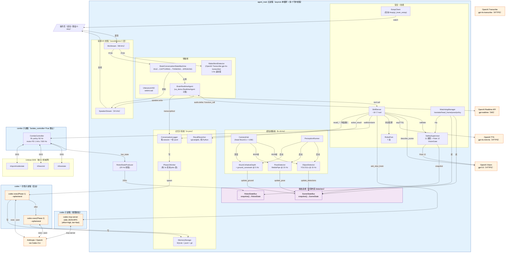

**这张图揭示的事实**：

1. **唯一持续连接 LLM 的通路是 `RTA <-> OAI_RT`**。所有其他 LLM 调用都是一次性的（vision / tts / codex exec）或按需的（codex mcp-server）。
2. **Perception 写入 SceneStateBus**，但从 `SceneBus → RTA` 之间**只有 SkSv 一条间接路径**——即"motion tool 返回 `scene_after`"或"快脑显式调用 `query_scene_state`"。
3. **快脑从不直接读 SceneStateBus**。

---

## 3. 进程 / 线程 / asyncio Task 全树

```mermaid
flowchart TD
  AM["agent_main process (PID N)"]
  AM --> EL["asyncio event loop（主线程）"]
  AM --> SD["signal handlers SIGINT/SIGTERM"]

  EL --> RunT["task: _run() (agent_main.py:519-1238)"]
  EL --> SupT["task: _supervise() (信号→stop_evt)"]

  RunT --> RTRun["await brain_agent.run() — Realtime WS 主循环"]
  RunT --> P1Task["task: Phase1Worker._loop (每 2s 轮询 jobs)"]
  RunT --> DaemonInit["task: codex_daemon.start() (孵化 + 握手)"]
  RunT --> CSMRun["task: state_machine._run() — IDLE/CAPTURE/THINK/SPEAK"]

  AM --> Threads["守护线程组（非 asyncio）"]
  Threads --> T1["MicStream (sounddevice C)"]
  Threads --> T2["SpeakerStream (sounddevice C)"]
  Threads --> T3["g1-brain-robotstate 20 Hz (RobotStateProducer)"]
  Threads --> T4["perception-frame-age 5 Hz"]
  Threads --> T5["ground-constraint 5 Hz"]
  Threads --> T6["g1_yolo 15 Hz (ObjectDetector)"]
  Threads --> T7["pose_detector 15 Hz (PoseDetector)"]
  Threads --> T8["watchdog 10 Hz"]
  Threads --> T9["EstopClient poll 20 Hz"]
  Threads --> T10["BrainConversationStateMachine VAD/WakeWord 子线程"]
  Threads --> T11["DDS 网络线程组 (CycloneDDS, 由 ChannelFactory 启动)"]

  AM --> Children["子进程"]
  Children --> CP["combo subprocess（isolate_controller=True 默认）"]
  CP --> CPL["50 Hz RL policy + 1 kHz motor PD"]
  CP --> CPD["DDS 订阅 rt/lowstate + 发布 rt/lowcmd"]

  Children --> CDX["codex mcp-server subprocess（按需）"]
  CDX --> CDXIO["stdio JSON-RPC + 16 MB readline buffer"]

  Children --> P1P["codex exec subprocess (Phase 1, 一次性)"]
  Children --> P2P["codex exec subprocess (Phase 2, 一次性)"]

  classDef async fill:#e8f5e9,stroke:#1b5e20
  classDef thread fill:#fff9c4,stroke:#f57f17
  classDef proc fill:#ffebee,stroke:#b71c1c
  class RunT,SupT,RTRun,P1Task,DaemonInit,CSMRun async
  class T1,T2,T3,T4,T5,T6,T7,T8,T9,T10,T11 thread
  class CP,CDX,P1P,P2P proc
```

**关键事实**：
- 整个主程序是**单 asyncio event loop**，所有 await 都在主线程
- DDS / 音频 / YOLO / pose 是**普通线程**，通过 GIL+共享 dataclass 与 event loop 通信
- 50 Hz 控制循环**默认隔离到子进程**（`combo_proxy.py`），避免 perception 抢 GIL 拖垮 policy
- Codex 的 **mcp-server 子进程是常驻**（除非 `memory.enabled=false`），exec-mode 子进程是**一次性**

---

## 4. 启动序列（agent_main 的 7 个阶段）

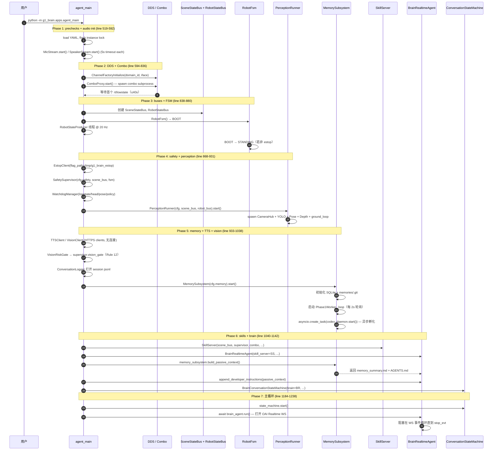

> 关键不变量：**DDS 必须先于 CameraHub** 初始化（agent_main.py:595-598），因为头部相机内部会订阅 `rt/sportmodestate` 来同步根坐标到 MuJoCo 的合成头部相机。

---

## 5. SceneStateBus + RobotStateBus：核心数据契约

**这是整个系统的"真相之源"**。所有感知/状态写到这里，所有消费者（safety / watchdog / brain）从这里读。

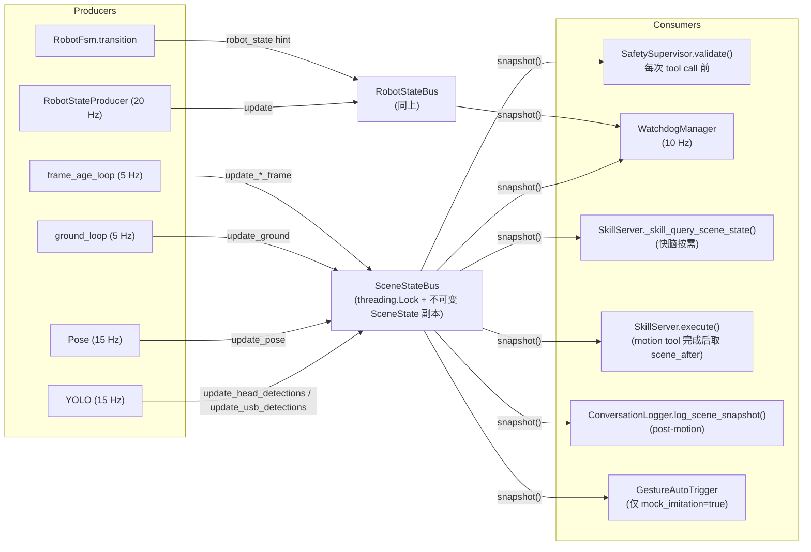

**核心观察**：
- **`snapshot()` 返回的是不可变 dataclass 副本**（`scene_state/fusion.py`）；这是为了让 safety 不会读到半更新状态
- **"快脑读 SceneStateBus" 这条边并不存在**——快脑只能通过 SkSv 的 `query_scene_state` tool 间接拿到 `summary_for_llm()` 的精简 dict
- `summary_for_llm()` 返回的字段：`persons_visible`, `nearest_obstacle_m`, `nearest_person_m`, `clear_path`, `surface_tilt_deg`, `user_gesture`, `warnings`
- **YOLO 原始检测、深度图、姿态骨架——快脑都看不到**

---

## 6. 快脑（Fast Brain）：BrainRealtimeAgent

### 6.1 类继承与生命周期

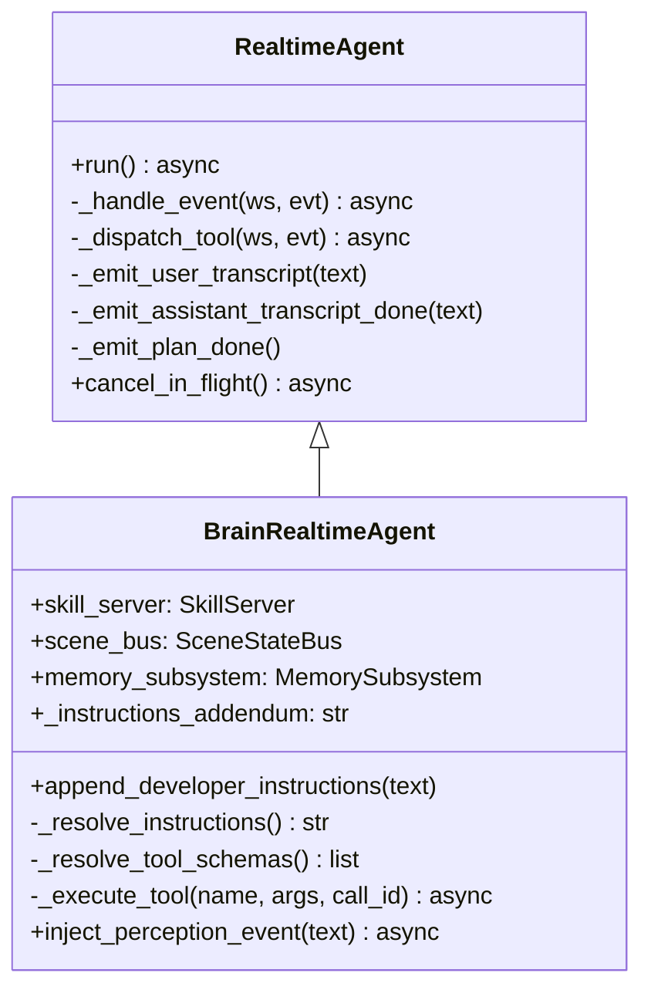

**重要：BrainRealtimeAgent 在 v1.1.0 主要是覆写 3 件事**：
1. `_resolve_instructions()` — 把 memory 的 `memory_summary.md + AGENTS.md` 拼到 system prompt 后面（一次性，开 session 之前）
2. `_resolve_tool_schemas()` — 把 `tool_schemas.build_tool_schemas(...)` 返回的 18 个 schema 注册给 Realtime
3. `_execute_tool()` — 所有 function_call 转发给 `skill_server.execute(name, args, call_id=...)`

### 6.2 快脑 ↔ Perception 实际数据流（**关键真相**）

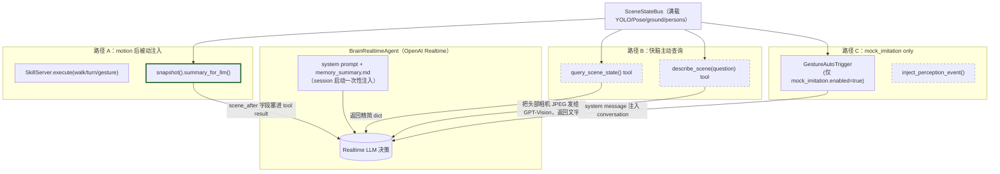

**这就是用户怀疑的核心点。结论**：

| 通道 | 触发 | 频率 | 谁决定？ | 数据形态 |
|------|------|------|----------|----------|
| A — `scene_after` 注入 | motion tool 成功 | 每次 walk/turn/gesture/look_at 之后 | **自动** | `summary_for_llm()` 精简 dict |
| B1 — `query_scene_state` | 快脑判断需要 | 不确定（取决于 LLM 决策） | LLM | 同上 |
| B2 — `describe_scene` | 快脑判断需要 | 同上，开销大（vision API ~1-3s） | LLM | GPT-Vision 文字描述 |
| C — `inject_perception_event` | mock_imitation 触发 | 仅在 `mock_imitation.enabled=true` | GestureAutoTrigger | system message 文本 |

**v1.1.0 没有"持续推送 perception 给快脑"的通路**。快脑对世界的"持续感知"完全是**通过它自己决定调用 query_scene_state 的频率**——也就是说，**LLM 只在它主动想看的时候看一眼**。

> 这正是用户的"perception 没有发挥作用"的直觉来源。**Perception 实际上对 safety 和 watchdog 是连续生效的**（每次 motion validate 都会 snapshot），但**对快脑的"语义意识"是事件驱动+按需的**。

### 6.3 快脑的 system prompt 结构

```
[REALTIME_SYSTEM_PROMPT_BRAIN]              ← brain/prompts.py
  + "\n\n"
  + memory_summary.md（最近 N session 摘要）  ← memory/__init__.py
  + AGENTS.md（recall 操作手册）              ← memory/storage.py
```

**注意**：这个拼接发生在 `await brain_agent.run()` 之前一次（`agent_main.py:1096-1110`）。Session 一旦开启，**prompt 就被烧进 Realtime session，不会再变**。所以"持续给快脑灌 perception"在协议层就不容易做（必须每 N 秒发 `conversation.item.create`）。

### 6.4 事件循环（`_handle_event`）

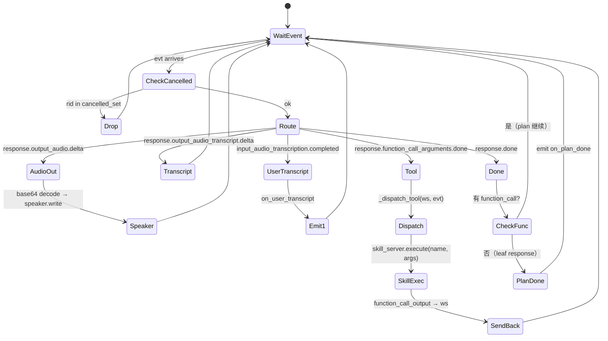

`cancelled_response_ids` 是 barge-in 的关键防护——保留最近 16 个被取消的 response_id，**晚到的事件被静默丢弃**，避免：
- 老的 audio.delta 在 `speaker.clear()` 之后又写进扬声器
- 老的 function_call 在用户已经说"停"之后还触发 walk

---

## 7. 慢脑（Slow Brain）：Codex 的三种调用模式

> **用户的问题：codex 到底什么时候发挥作用？**
>
> 答案：**有三个完全独立的时刻。**

### 7.1 三种 codex 模式总览

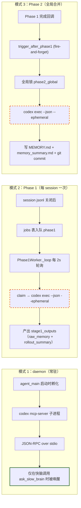

### 7.2 模式 1：`codex mcp-server` daemon

**孵化时机**：`agent_main.py:1033` 调用 `await memory_subsystem.start()`，内部 `asyncio.create_task(daemon.start())`。

**命令行**（`daemon.py:417-435`）：
```bash
codex mcp-server \
  -c approval_policy=never \
  -c sandbox_mode="read-only" \
  -c model_reasoning_effort="high" \
  -c model_reasoning_summary="concise" \
  -c service_tier="fast"
```

**关键事实**：
- `effort=high` + `tier=fast` 是**v1.1.0 的默认值**（`schemas.py:131-133`），来自用户记忆里"每次 codex 都要 high+fast"
- 守护进程**只通过 `ask_slow_brain(query)` 工具被快脑唤醒**——不会因为 session 结束、空闲超时、watchdog 等任何其他事件触发
- 子进程用 16 MB readline 缓冲（`limit=self._stdout_buffer_bytes`），避免 codex 0.128 在长输出时把 readline 撑爆

**协议**：MCP JSON-RPC 2.0 over stdio。每次 `ask_slow_brain` 实际发的是：
```json
{"jsonrpc":"2.0","id":N,"method":"tools/call",
 "params":{"name":"codex","arguments":{"prompt": <wrapped>,"cwd": <memories_dir>}}}
```

`<wrapped>` 是 `_wrap_recall_prompt()` 加的 recall 前导（`daemon.py:348-406`），告诉 codex：
- 用 `rg`/`cat`/`sed` 搜 `MEMORY.md` / `raw_memories.md` / `rollout_summaries/*.md` / 原始 `*.jsonl`
- ≤6 次 shell 调用就要给答案
- CJK 不要用 `\b`
- 答案 ≤120 中文字 / 80 英文词，引用 `session_id 8 字符前缀 + turn_id`

### 7.3 模式 2 / 3：`codex exec --json --ephemeral`

**这是与 daemon 完全不同的子进程**（`codex_client.py:105-126`）：
```bash
codex exec --json \
  --skip-git-repo-check \
  --ignore-user-config \
  -C <workdir> \
  -s read-only \
  -c approval_policy=never \
  -c model_reasoning_effort="high" \
  -c model_reasoning_summary="concise" \
  -c service_tier="fast" \
  --ephemeral
```

- **每次都是一次性子进程**（spawn → 一段 prompt → stdin EOF → stdout 流 JSONL 事件 → 退出）
- **`--ephemeral` 不写 codex 的对话历史**
- Phase 1 和 Phase 2 走同一个 `CodexExecClient.exec()` 入口，差异仅在 prompt + workdir

### 7.4 关键澄清：codex 何时**不**被调用？

| 事件 | 是否触发 codex？ |
|------|-----------------|
| 用户对快脑说一句话 | ❌ |
| 快脑调用 `walk` / `gesture` / `query_scene_state` | ❌ |
| 快脑调用 `recall_grep` / `recall_read` / `recall_glob` | ❌ |
| 快脑调用 `describe_scene` | ❌（用的是 OpenAI Vision，不是 codex） |
| 快脑调用 `ask_slow_brain` | ✅ **模式 1（daemon）** |
| session 结束（jsonl 关闭） | ✅ **模式 2（Phase 1）** 入队 → 2 秒内取走 |
| Phase 1 完成 | ✅ **模式 3（Phase 2）** fire-and-forget |
| Watchdog trip / FSM 转移 / E-stop | ❌ |
| 周期性 cron | ❌ — 没有定时任务，**完全事件驱动** |

> 用户的怀疑"我接入了 harness 但实际上 codex 没发挥作用"——**部分成立**：
> - 在线对话期间，**只有显式 `ask_slow_brain` 才会动 codex**
> - 如果快脑从不主动调用 `ask_slow_brain`（比如 prompt 不提示它去用），那么 daemon 会一直空闲
> - **离线 Phase 1/2 是另一回事**——只要有 session jsonl 关闭，必然触发；这是 harness 的"积累"路径

---

## 8. 记忆系统：Phase 1 / Phase 2 / Recall

### 8.1 三种数据流

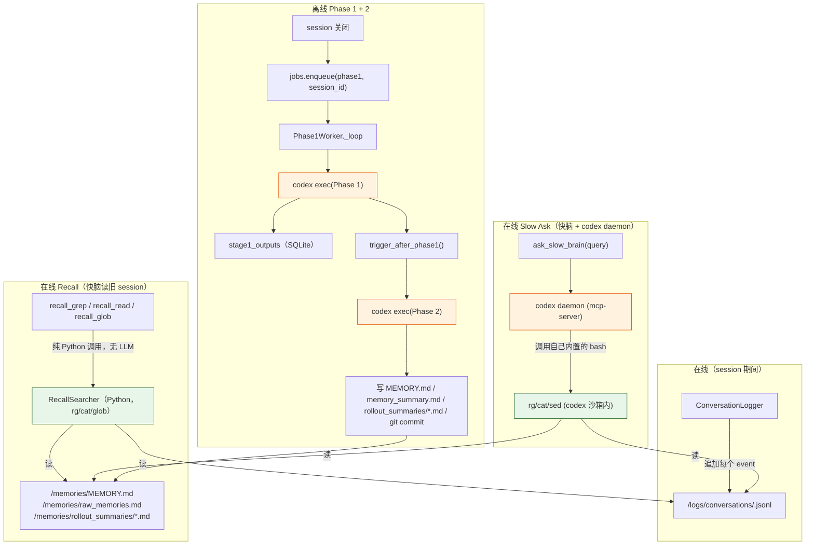

### 8.2 Recall 的两条执行路径（用户的关键疑问）

> **用户原话**："harness 机制的 memory recall 部分，我检查了一下日志好像也是 realtime 调用的 tool agent 执行的？"

**部分对、部分错**。让我们拆开：

**路径 A：快脑直接调用 `recall_grep` / `recall_read` / `recall_glob`**

```python
# tool_schemas.py 把 recall_* 注册到 Realtime
# realtime_agent._execute_tool() -> skill_server.execute("recall_grep", args)
# skill_server._skill_recall_grep() -> memory.recall.grep(...)
# recall.py 直接调 `rg` 子进程（或 grep / Python re）
# 没有 LLM。没有 codex。没有"tool agent"。
```

这条路径是**纯函数调用**：快脑 LLM 决定调用 → SkillServer 同步 dispatch → Python 调 `rg` → 返回 dict。**整条链路没有第二个 LLM**。

**路径 B：快脑调用 `ask_slow_brain(query)`**

```python
# tool_schemas.py 注册 ask_slow_brain
# skill_server._skill_ask_slow_brain(query, timeout_s)
# memory.daemon.ask_slow_brain(query, ...) 
#   -> JSON-RPC tools/call -> codex mcp-server
#   -> codex（这是一个独立的 LLM agent）在自己的 sandbox 里跑 rg/cat/sed
#   -> 返回 codex 综合后的答案（≤120 中文字）
```

这条路径**才是"LLM-in-the-loop"**：快脑把球扔给 codex，codex 用自己的 reasoning + 自己的 shell tools 来检索。

**所以"realtime 调用的 tool agent"这个描述适用于路径 B，不适用于路径 A。** 你看到的"realtime 工具执行 recall"如果具体是 `recall_grep` 这类工具，那就是 Python grep；如果是 `ask_slow_brain`，那才是 codex。

### 8.3 工程上"为什么这样设计"

| 工具 | 延迟 | 何时该用 |
|------|------|----------|
| `recall_grep` / `recall_read` / `recall_glob` | ~10-50 ms | 快脑已经知道关键词，要快速翻 MEMORY.md |
| `ask_slow_brain` | ~3-15 s（含 codex reasoning） | 快脑放弃了/找不到/需要综合多份 jsonl |

`AGENTS.md`（recall 操作手册，存在 `<robot>/memories/AGENTS.md`）是给快脑读的"什么时候用哪个"——v1.1.0 默认快脑应该**先 grep，找不到才升级到 ask_slow_brain**。

### 8.4 Phase 1 / Phase 2 输出契约

**Phase 1 输出**（每 session 一份）：
```json
{
  "raw_memory": "本 session 的关键事实条目（中英文均可）",
  "rollout_summary": "≤200 字的 session 摘要",
  "rollout_slug": "kebab-case-<10 字符>"
}
```

**Phase 2 输出**（全局，每次触发就重写）：
```json
{
  "memory_md": "新的 MEMORY.md 全文（curated）",
  "memory_summary_md": "新的 memory_summary.md 全文（concise digest）"
}
```

Phase 2 额外做：
- 把所有 stage1_outputs 的 raw_memory 拼成 `raw_memories.md`（确定性）
- 给每个 stage1_output 写一份 `rollout_summaries/<slug>.md`
- `git add . && git commit -m "phase2 @ <iso>"`，保留每次合并的快照

### 8.5 SQLite + git 双轨持久化

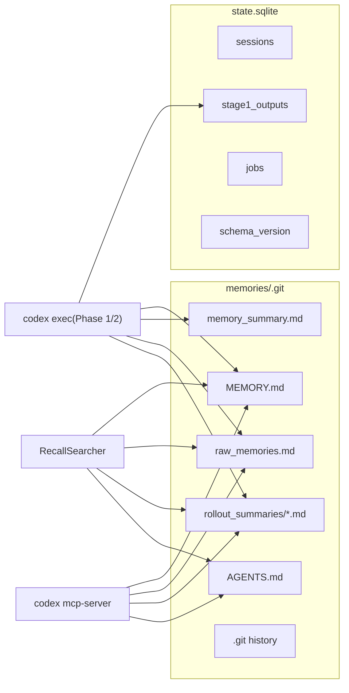

---

## 9. 工具表（18 个 tool 的完整矩阵）

> **快脑实际能调用的所有工具**（`tool_schemas.build_tool_schemas(sim=True, ...)`）。

| # | 工具 | 层级 | 同步/异步 | 后端 | 是否进 safety.validate | 在 vision_only 模式下保留？ |
|---|------|------|----------|------|----------------------|----------------------------|
| 1 | `say(text)` | L1 | 同步 | OpenAI TTS gpt-4o-mini-tts | 否（直接 speaker） | 是 |
| 2 | `describe_scene(question, detail)` | L1 | 异步 | OpenAI Vision gpt-5.5 | 否 | 是 |
| 3 | `query_scene_state()` | L1 | 同步 | SceneStateBus.snapshot() | 否 | 是 |
| 4 | `recall_history(kind, limit)` | L1 | 同步 | 直接读 jsonl | 否 | 是 |
| 5 | `look_at(target)` | L1 复合 | 异步 | 内部 → `turn` | 是 | 是 |
| 6 | `approach(target_distance_m)` | L1 复合 | 异步 | 内部 → 多次 `walk` | 是 | 是 |
| 7 | `mock_imitate(gesture)` | L1 复合 | 异步 | 内部 → `gesture` 列表 | 是 | 仅 `mock_imitation.enabled` |
| 8 | `ask_human(question)` | L1 复合 | 异步 | `say` + 等待 5s | 否 | 是 |
| 9 | `recall_grep(pattern, scope, ...)` | L1 记忆 | 同步 | RecallSearcher（rg / grep / re） | 否 | 是 |
| 10 | `recall_read(path, start, end)` | L1 记忆 | 同步 | RecallSearcher（Path.read_text） | 否 | 是 |
| 11 | `recall_glob(pattern, limit)` | L1 记忆 | 同步 | RecallSearcher（Path.glob） | 否 | 是 |
| 12 | `ask_slow_brain(query, timeout_s)` | L1 记忆 | 异步 | **codex mcp-server**（高 effort，快 tier） | 否 | 是 |
| 13 | `walk(vx, vy, wz, duration_s)` | L2 | 异步 | ComboController（reactive abort 100 ms 间隔） | **是** | 否（vision_only 屏蔽） |
| 14 | `turn(yaw_deg)` | L2 | 异步 | 内部 → `walk(wz, dur)` | 是 | 否 |
| 15 | `gesture(name)` | L2 | 异步 | Combo.push_arm_action（keyframe） | 是 | 否 |
| 16 | `static_pose(name)` | L2 | 异步 | Combo.push_arm_action | 是 | 否 |
| 17 | `stop()` | L2 | 同步 | combo halt + clear arm queue | 是（但走快速路径） | 是 |
| 18 | `release_arms()` | L2 | 同步 | combo arm release | 是 | 否 |

**真机独有（默认拒绝）**：
- `loco_high(action)` — 仅当 `--real` 启用
- `arm_action_high(action_id)` — 仅当 `--real`
- `audio_tts_robot(text)` — 仅当 `--real`

### 9.1 motion tool 的"reactive abort"

`walk` 不是单纯把 vx 写到 combo——`skill_server._skill_walk()`（line 583-633）：

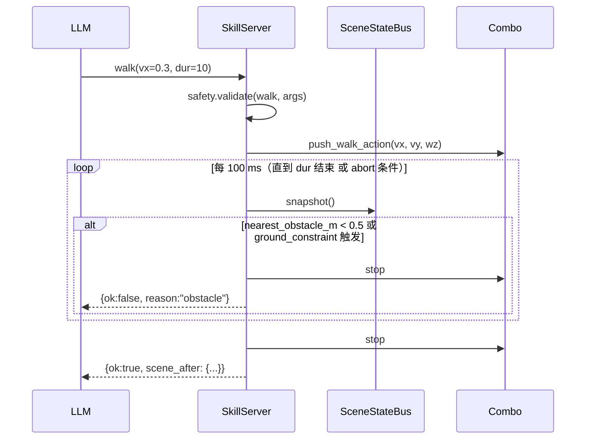

> 这是 **唯一一处在 tool 执行中持续读 perception 的代码**，但消费者是 SkillServer，不是快脑 LLM。

---

## 10. 安全监督：11+1 规则 + FSM + Watchdog

### 10.1 安全栈

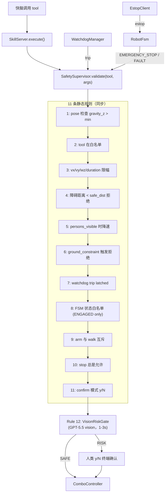

### 10.2 FSM 7 态

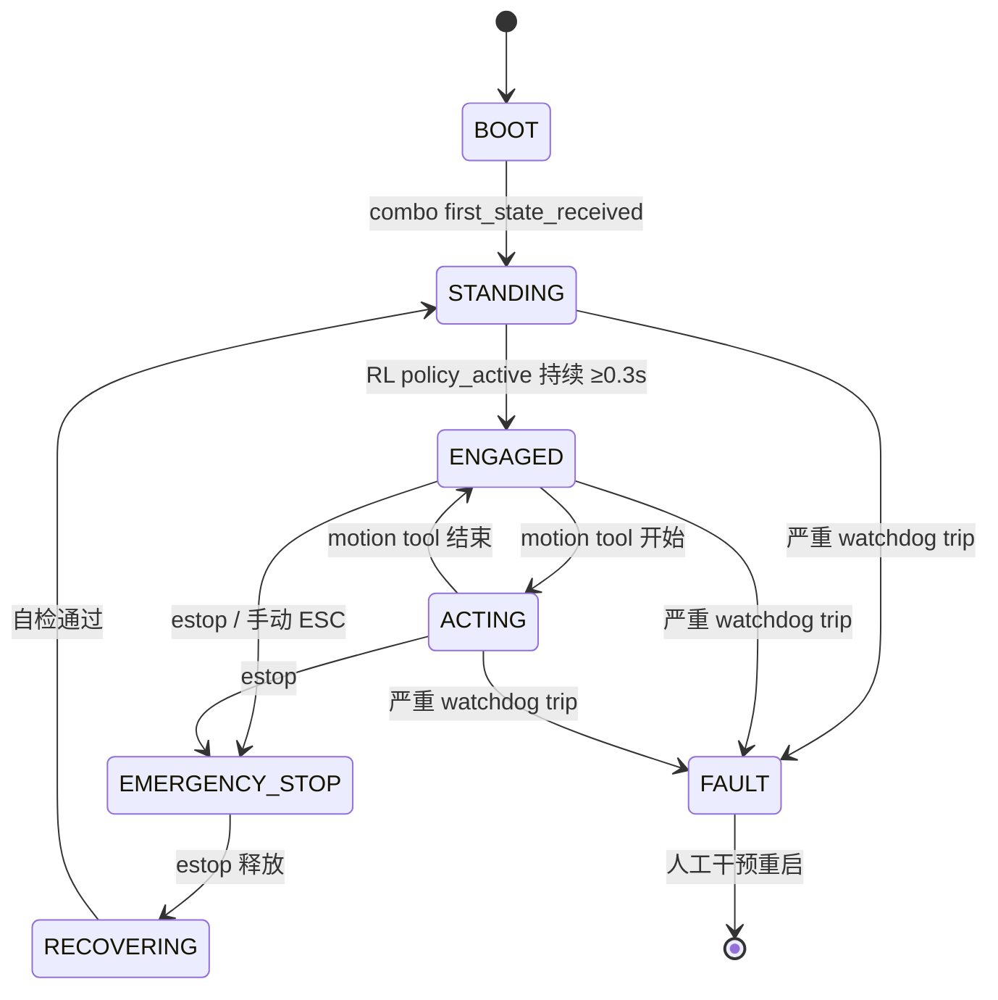

> Safety 不允许任何 motion 在 BOOT / STANDING / EMERGENCY_STOP / FAULT 状态下执行。

### 10.3 E-stop 进程分离

`EstopClient` 在主进程**轮询 `/tmp/g1_brain_estop` flag file**（默认 `safety.estop.flag_path`）。

**关键**：E-stop 的"真正强制零扭矩"在另一个进程 `estop_listener.py`（独立 systemd / 终端启动），它直接 publish `rt/lowcmd` 30 帧零扭矩，**不依赖主进程**。主进程死掉它也照样工作。

---

## 11. 音频流与对话状态机

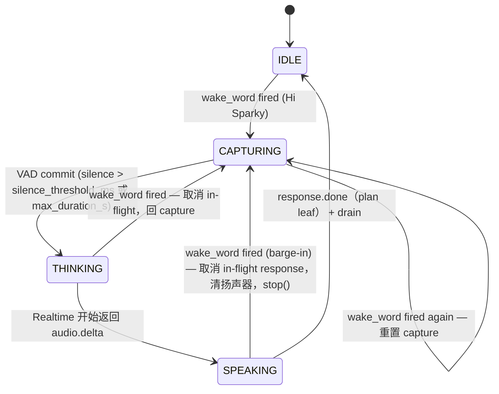

### 11.1 唤醒词后端

- v1.1.0 默认 `wakeword.backend=openai`（OpenAI Transcribe `gpt-4o-transcribe`，1.5s 滚动窗）
- 1300 Hz 入口 RMS 门控 `rms_threshold=300`（避免 TTS 自激发）
- AEC：扬声器最近 `recent_played_rms(window_s)` 减去预测回声

### 11.2 barge-in 路径（"Hi Sparky" 在任意状态下都能打断）

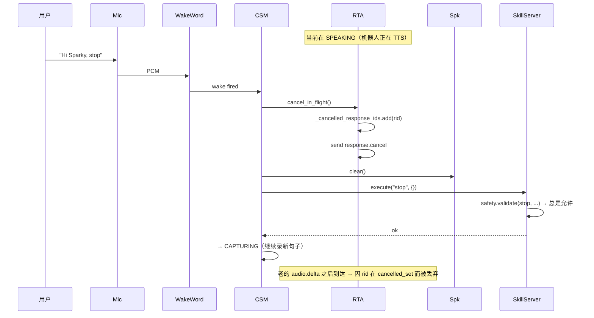

> 用户的最新 patch（`3b7fff6`、`74722b3`、`a5383df`、`cf09042`、`42597de` 这几条 commit）就是修这条路径的 RMS 门控和 AEC 延迟。

---

## 12. 一次完整 turn 的端到端时序

> **用户说"Hi Sparky, 走过去 0.5 米看看那个箱子"** 的端到端拆解。

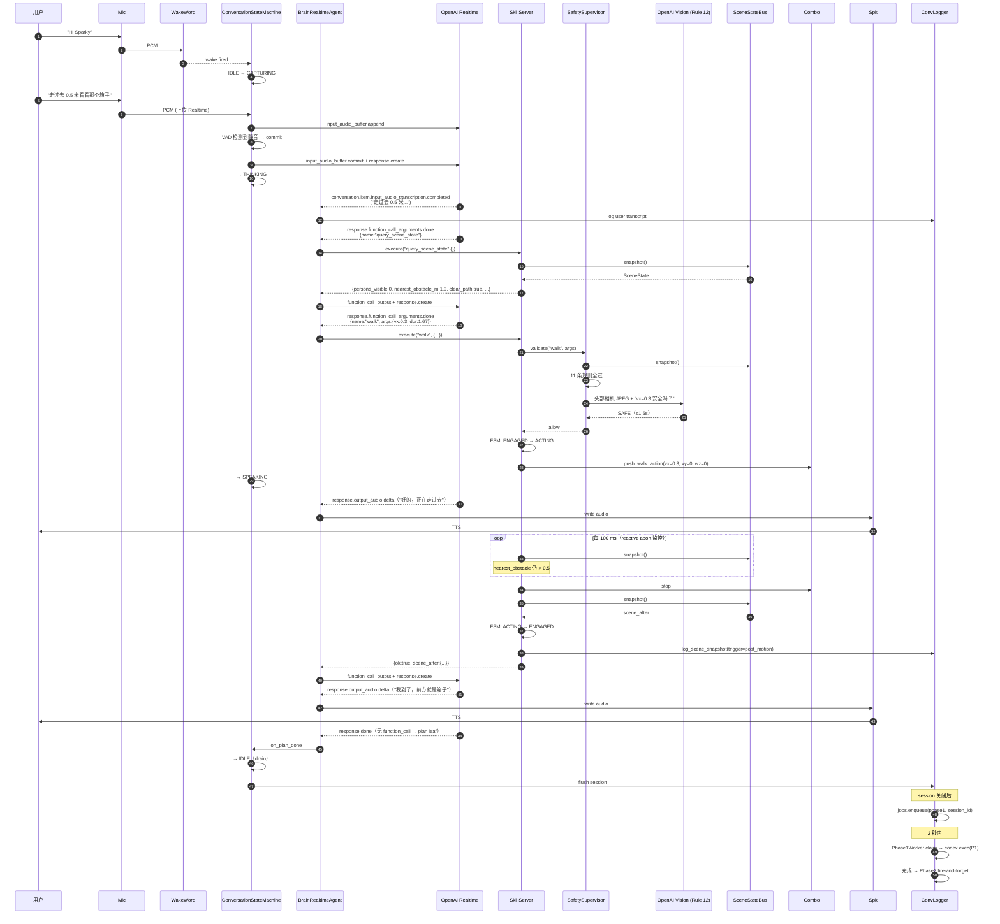

**这一个 turn 触及了**：
- 4 个 LLM 服务（Realtime / Vision / TTS / Codex Phase 1/2）
- 18 个工具中的 3 个（`query_scene_state` / `walk` / 隐含 `say` via TTS delta）
- 2 个进程（main + combo）
- 后台一次 Phase 1/2 异步消化

---

## 13. 关键问题回答

### Q1：快脑的本地 perception 是不是没有发挥作用？

**结论：部分成立，对"快脑的语义意识"是 partial。**

| 维度 | Perception 是否生效 |
|------|---------------------|
| Safety（每次 validate 都 snapshot） | ✅ 持续生效 |
| Watchdog（10 Hz 读 frame_age） | ✅ 持续生效 |
| Reactive abort（walk 期间每 100 ms 检查） | ✅ 持续生效 |
| Motion tool 的 `scene_after` 注入 | ✅ 每次 motion 之后 |
| 快脑主动决策（"我是不是该看一眼"） | ⚠️ **依赖 LLM 自己决定调用 `query_scene_state`** |
| 持续视觉流（YOLO 帧逐帧进 LLM） | ❌ **没有这条路径** |

**也就是说**：
- 你的 YOLO/Pose/depth/ground 全都在 5-15 Hz 运行
- 但**快脑 LLM 收不到它们的实时输出**
- 它只在两个时刻"看一眼世界"：
  1. 自己主动调用 `query_scene_state` / `describe_scene`
  2. 上一个 motion tool 返回的 `scene_after` 字段

**如果你的 system prompt 没有告诉 LLM "动作前先 query_scene_state"，它就真的不会去看**。这是用户感觉"perception 没在用"的根因。

> **如果你想让 perception 持续推送给快脑**，需要做的事情之一：
> - 在主循环开一个 ticker，每 N 秒（比如 5s）调用 `RTA.inject_perception_event(scene.snapshot().summary_for_llm())`
> - 但这会显著拉高 Realtime token 成本，需要权衡

### Q2：harness 的 memory recall 是不是 realtime tool agent 实时调用？

**部分对、部分错——取决于你看的是哪个工具。**

- 如果日志里看到的是 `recall_grep` / `recall_read` / `recall_glob` —— **纯 Python，没 LLM**，是 `RecallSearcher` 直接 `rg`/`cat`/`glob`
- 如果看到的是 `ask_slow_brain` —— **是 codex mcp-server**，那是一个真正的 LLM agent，它在自己的 sandbox 里跑 rg + cat + sed

所以"realtime 调用的 tool agent"这句话本身不准确：v1.1.0 里只有 `ask_slow_brain` 是 agent；其他 recall_* 是裸函数。

### Q3：Codex 到底什么时候发挥作用？

**三个时刻，且只有这三个时刻**：

1. **快脑主动调用 `ask_slow_brain`**（codex mcp-server daemon）—— 在线、按需、最常见的可视化路径
2. **session 关闭后入队 Phase 1**（codex exec --json --ephemeral）—— 离线、必然、每 session 一次
3. **Phase 1 完成回调 trigger Phase 2**（codex exec --json --ephemeral）—— 离线、必然、每次 P1 完成都触发

**Codex 不参与的事**（用户可能误以为参与）：
- 不参与每个对话 turn 的决策（那是 Realtime LLM）
- 不参与 `recall_grep` 等纯函数工具
- 不参与 `describe_scene`（那是 OpenAI Vision，与 codex 完全独立）
- 不参与 safety validate（那是 Python 规则 + 可选 GPT-Vision）
- 不参与 perception（perception 全是本地小模型 + 数值算法）

### Q4：快慢脑目前的设计是什么？

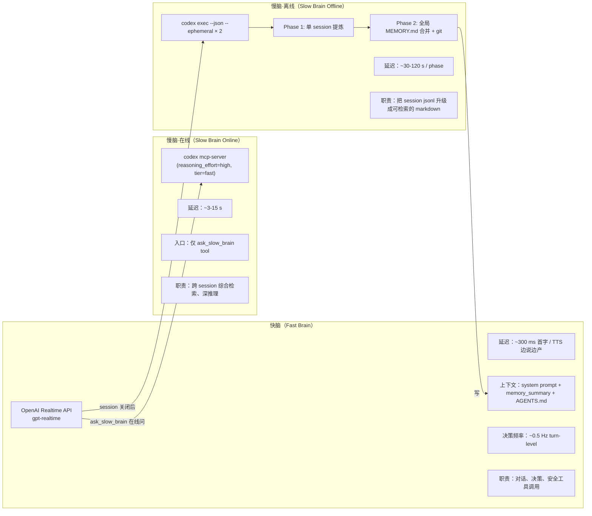

**v1.1.0 的核心解耦哲学**：
- **快脑做"响应快、决策粗"** —— 端到端 < 1s，错了可以再问
- **慢脑做"思考慢、综合细"** —— 容许 10s+，必须给出可引用的答案
- **两者共享 `memories/` 目录作为单一真相源**——快脑通过 grep 直接读，慢脑通过 codex 综合产出

---

## 14. 已知局限与下一步

### 14.1 v1.1.0 已经实证可用的部分

- ✅ Realtime 快脑 + 18 工具
- ✅ SafetySupervisor 11+1 规则 + FSM + Watchdog
- ✅ Phase 1 + Phase 2 离线消化
- ✅ codex daemon `ask_slow_brain` 工具
- ✅ `recall_*` 纯函数工具
- ✅ Hi-Sparky 唤醒词 + barge-in（包括 SPEAKING 中断）
- ✅ ComboProxy 子进程隔离

### 14.2 已知局限（与用户怀疑一致）

| 局限 | 影响 | 缓解 |
|------|------|------|
| **快脑无 perception 持续流** | LLM 对世界的"持续感"全依赖它自己的 query 决策 | 1) Prompt 引导更勤地调用 `query_scene_state`<br/>2) 加 ticker push `inject_perception_event` |
| **perception 对快脑不可见的原始检测** | YOLO 类别 / 置信度 / 框坐标都被压缩成 `summary_for_llm()` 5-6 个字段 | 加专门 tool `query_detections_raw()` |
| **codex daemon 不会自发"主动思考"** | 必须快脑主动 ask | 设计上是对的——避免空转 token，但要确保 prompt 指导快脑何时 ask |
| **Phase 2 重写式合并** | 每次都全文重写 MEMORY.md，git diff 巨大 | 后续可以改成增量 patch |
| **ConversationLogger 与 Phase 1 的时序** | jsonl 必须完整 flush 之后才能消化，所以 shutdown 给 memory 留了 30s | 已在 agent_main.py:1234 配置 |

### 14.3 如果你想让"快脑真正消费 perception"

最小入侵的改法（不展开实现，只列方向）：
1. 在 `agent_main.py:1140` 之后加一个 asyncio task：每 N 秒 `await brain_agent.inject_perception_event(scene.snapshot().summary_for_llm())`
2. 在 system prompt 加一行 `"You will receive periodic perception summaries as system messages; treat them as context, don't always respond."`
3. 在 `BrainRealtimeAgent.inject_perception_event` 里加一个"去重"检查（只在场景变化 > 阈值时发送），避免 token 浪费

或者反过来——保留按需模式，但**在 system prompt 强化"动作前必须 query"** ——这样不增加 token 成本，只是让 LLM 自觉调用。

### 14.4 如果你想让"codex 更主动"

可考虑：
- 在 jsonl 写入达到阈值时自动 ask_slow_brain 做"中期反思"（事件驱动，不是 cron）
- 让 codex daemon 在 FAULT / EMERGENCY_STOP 这种异常 FSM 转移时被自动 ping（提供事后分析）

但**注意**：这些都会增加 token / 延迟，与"慢脑是按需脑"的设计哲学冲突。先确认必要性再做。

---

## 附录 A：关键 file:line 索引

| 关注点 | 文件:行 |
|--------|---------|
| 主入口 | `g1_brain/apps/agent_main.py:519-1238` |
| DDS 必须先于 CameraHub | `agent_main.py:595-598` |
| ComboProxy 启动 | `agent_main.py:680-704` |
| MemorySubsystem.start | `g1_brain/memory/__init__.py:95-109` |
| Codex daemon 孵化命令 | `g1_brain/memory/daemon.py:417-435` |
| `_wrap_recall_prompt` 前导 | `daemon.py:348-406` |
| Phase1Worker._loop | `g1_brain/memory/phase1.py:321-487` |
| Phase 2 全局锁 | `g1_brain/memory/phase2.py:115-129` |
| RecallSearcher | `g1_brain/memory/recall.py:31-180` |
| SkillServer.execute | `g1_brain/skills/skill_server.py:194-298` |
| `scene_after` 注入 | `skill_server.py:277-281` |
| BrainRealtimeAgent._execute_tool | `g1_brain/brain/realtime_agent.py:163-182` |
| inject_perception_event | `realtime_agent.py:531-559` |
| cancel_in_flight + rid drop | `realtime_agent.py:115-117, 199-210` |
| PerceptionRunner | `g1_brain/perception/runner.py:44-126` |
| ground_loop | `runner.py:170-205` |
| SceneStateBus snapshot | `g1_brain/scene_state/fusion.py` |
| RobotFsm 7 态 | `g1_brain/safety/state_machine.py:84-...` |
| EstopClient | `g1_brain/safety/estop_client.py` |
| `_skill_recall_grep` | `skill_server.py:753-774` |
| `_skill_ask_slow_brain` | `skill_server.py:815-844` |
| 配置默认值（effort=high, tier=fast） | `g1_brain/memory/schemas.py:131-133` |

## 附录 B：v1.1.0 与 v1.0 的 diff 速览

- 新增 12 号 Rule（GPT-Vision risk gate）—— 在 11 条静态规则之后、用户 y/N 之前
- 新增 `recall_grep` / `recall_read` / `recall_glob` / `ask_slow_brain` 工具
- 新增 codex mcp-server 常驻 daemon
- 新增 Phase 1 / Phase 2 离线消化管线 + memories/.git
- 新增 ConversationLogger（Claude-harness-compatible jsonl）
- 改造唤醒词：从 va-demo 的"only-in-IDLE"改为"any-state barge-in"
- 改造 audio control：cleaned-RMS gate + AEC delay（commit `74722b3`）

---

*本文件版本：1.1.0-runtime*
*生成时间：2026-05-24*
*维护者：作者本人；如发现与代码不符，以代码为准并提 issue。*
