# Progress & Achievements — `g1_sim_demo`

> 本报告对 `~/unitree/unitree-notes/g1_sim_demo/` 目录下**已经实现并跑通**的全部能力做一次彻底的、公式级别、模块级别、数据流级别的复盘。覆盖五个 demo（从最底层 PD 直发到 RL 闭环步行 + 上半身手势叠加），所有原理都配有 Mermaid 图、关键公式、源码定位（文件:行号）。
>
> 本目录的代码与上游三个仓库（`unitree_sdk2_python`、`unitree_mujoco`、`unitree_rl_mjlab`）的关系是：**我们是这三者的整合层**。三方原版示例（`unitree_sdk2_python/example/g1/low_level/g1_low_level_example.py`、`unitree_rl_mjlab/scripts/play.py` 等）都不能直接在 MuJoCo Python 桥下跑通，本目录把这些坑全部填平了，并且把"开环 keyframe + 闭环 RL + RL/keyframe 混合"三种范式都做出了可演示版本。

---

## 0. 目录概览（5 个脚本 / 11 篇文档）

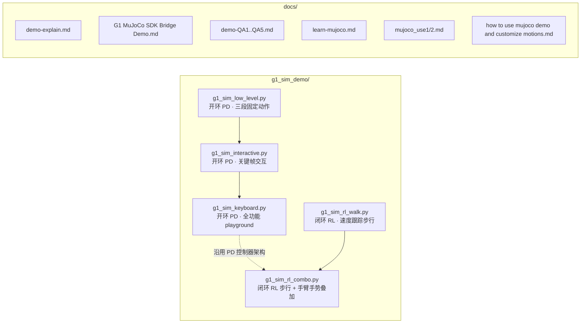

| 脚本 | 控制范式 | 控制频率 | 是否需要悬挂带 | 能做的事 |
|---|---|---|---|---|
| `g1_sim_low_level.py` | 开环 PD（脚本写死的三段时间序列） | 500 Hz | 必须 | 复现上游官方 demo 的"踝关节正弦摆动 + 手腕摆动"，跑通 sim bridge |
| `g1_sim_interactive.py` | 开环 PD + 关键帧队列 | 500 Hz | 必须 | `z/w/b/k/a` 五种基础动作，键盘交互 |
| `g1_sim_keyboard.py` | 开环 PD + 关键帧队列（全功能） | 500 Hz | 必须 | 19 种预设动作（招手、敬礼、拥抱、T-pose、鞠躬、抬腿、深蹲、踢腿、出拳…），含 reset / soften / 慢放 |
| `g1_sim_rl_walk.py` | 闭环 RL（ONNX 策略） | 50 Hz | **不需要**（落地后即可剪绳） | `wsadqe` 控速度命令、原地站立、转身、最高 1.0 m/s 前进（本策略上限） |
| `g1_sim_rl_combo.py` | 闭环 RL（腿腰）+ 关键帧叠加（手臂） | 50 Hz | **不需要** | 边走边挥手 / 敬礼 / 拍手 / T-pose / 出拳；腿腰始终由 RL 平衡 |

---

## 1. 公共基础：DDS 通信 + MuJoCo 桥的 PD 控制律

所有 5 个脚本共享同一条数据通路（终端 1 仿真 ⇄ 终端 2 控制脚本）。这是理解一切的基础。

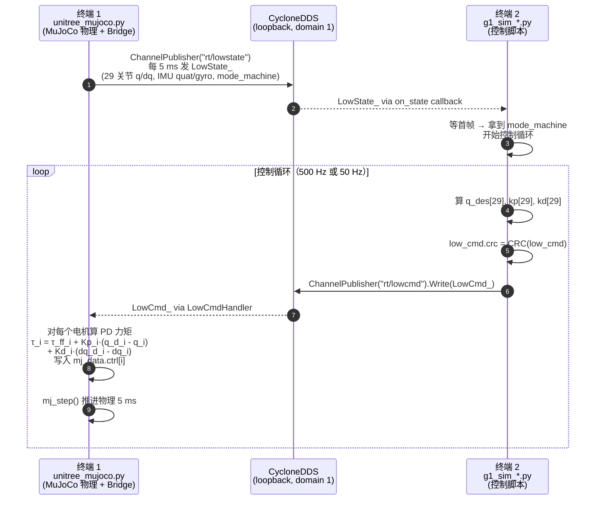

### 1.1 桥端的 PD 公式（一切控制的最终落点）

`unitree_mujoco/simulate_python/unitree_sdk2py_bridge.py` 的 `LowCmdHandler` 对每个电机执行：

$$
\tau_i^{\text{applied}} \;=\; \tau_i^{\text{ff}} \;+\; K_{p,i}\,(q_i^{\text{des}} - q_i^{\text{meas}}) \;+\; K_{d,i}\,(\dot q_i^{\text{des}} - \dot q_i^{\text{meas}})
$$

代码层一行就是：

```python
mj_data.ctrl[i] = msg.motor_cmd[i].tau \
    + msg.motor_cmd[i].kp * (msg.motor_cmd[i].q  - sensordata[i]) \
    + msg.motor_cmd[i].kd * (msg.motor_cmd[i].dq - sensordata[i + nu])
```

**含义**：每帧 `LowCmd_` 等价于下发 29 组 `(q_des, dq_des, τ_ff, Kp, Kd)`；MuJoCo 物理在 `mj_step()` 里拿这个 `ctrl` 当电机扭矩用。

### 1.2 哪些 sim 坑被本 demo 绕过

上游 `unitree_sdk2_python/example/g1/low_level/g1_low_level_example.py` 在 sim 里跑不通有两个原因，本目录所有脚本都已修复：

1. **域 ID 不一致**：上游硬编码 `ChannelFactoryInitialize(0, ...)`，但 `simulate_python/config.py` 默认 `DOMAIN_ID=1`。本目录五个脚本都做了：

   ```python
   if len(sys.argv) > 1 and sys.argv[1] not in ("lo", "sim"):
       ChannelFactoryInitialize(0, sys.argv[1])      # 真机
   else:
       ChannelFactoryInitialize(1, "lo")             # sim
   ```

2. **`MotionSwitcherClient` 在 sim 不存在**：上游会先调 `MotionSwitcherClient.CheckMode()`，sim bridge 只暴露 4 个 topic（`rt/lowcmd / rt/lowstate / rt/sportmodestate / rt/wirelesscontroller`），调用永远不返回 → 卡死。本 demo 全部跳过这一步，等收到第一帧 `lowstate` 拿到 `mode_machine` 直接进控制环。

### 1.3 G1 29-DOF 关节索引（PR 模式）

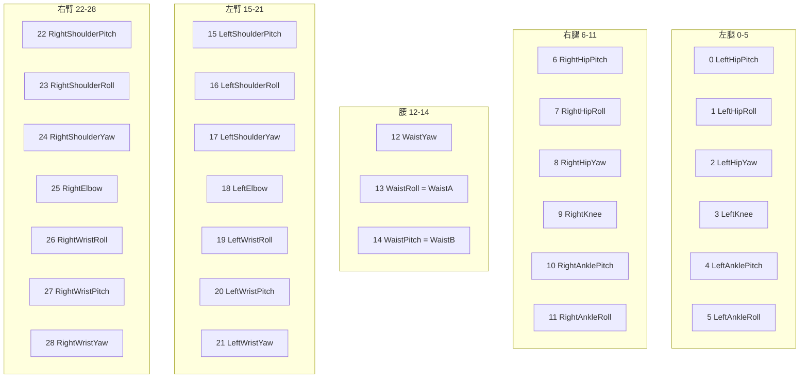

**PR vs AB 模式（G1 特有）**：踝、腰是双连杆并联驱动。`mode_pr=0` (PR) 给关节空间 Pitch/Roll；`mode_pr=1` (AB) 给底层电机 A/B。本 demo 全部使用 PR 模式（`low_cmd.mode_pr = 0`），更直观。

---

## 2. `g1_sim_low_level.py`：三段开环动作（500 Hz · 9 s）

这是最早跑通的 demo，对应文档 `G1 MuJoCo SDK Bridge Demo.md`。它是上游 `g1_low_level_example.py` 的 sim 友好版，把整条 DDS 链路验证一遍。

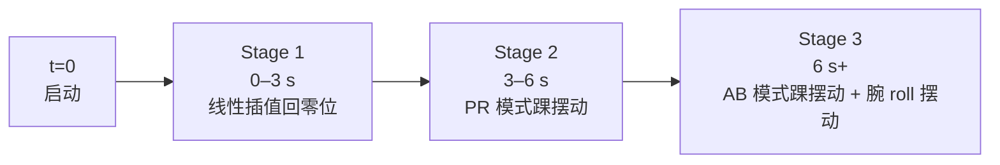

### 2.1 Stage 1：线性插值到 zero pose

对每个关节 $i$，每控制周期：

$$
q_i^{\text{des}}(t) \;=\; \bigl(1 - r(t)\bigr)\cdot q_i^{\text{meas}}(0)
\quad\text{where}\quad r(t)=\operatorname{clip}\!\bigl(t/T,\,0,\,1\bigr),\ T=3\text{ s}
$$

源码 `g1_sim_low_level.py:139-150`。注意起点用的是**首帧实测姿态**而不是写死的零，所以无论机器人启动时姿态多偏都不会瞬移。

### 2.2 Stage 2：PR 模式踝关节正弦摆动

$$
\begin{aligned}
q_{\text{LAnklePitch}} &= A_p \sin(2\pi t) \\
q_{\text{LAnkleRoll}}  &= A_r \sin(2\pi t) \\
q_{\text{RAnklePitch}} &= A_p \sin(2\pi t) \\
q_{\text{RAnkleRoll}}  &= -A_r \sin(2\pi t)
\end{aligned}
\quad
A_p = \tfrac{30\pi}{180},\ A_r = \tfrac{10\pi}{180},\ f=1\text{Hz}
$$

左右 Roll 反相，因为踝外翻方向相反。源码 `g1_sim_low_level.py:152-167`。

### 2.3 Stage 3：AB 模式踝摆动 + 腕 Roll 摆动

切到 `mode_pr = AB(=1)`，直接驱动底层 A/B 电机：

$$
\begin{aligned}
q_{LA} &= +A_a\sin(2\pi t) \\
q_{LB} &= +A_b\sin(2\pi t + \pi) \\
q_{RA} &= -A_a\sin(2\pi t) \\
q_{RB} &= -A_b\sin(2\pi t + \pi) \\
q_{\text{L/RWristRoll}} &= A_w \sin(2\pi t) \\[2pt]
A_a = \tfrac{30\pi}{180},\ A_b = \tfrac{10\pi}{180},\ A_w = \tfrac{30\pi}{180}
\end{aligned}
$$

源码 `g1_sim_low_level.py:169-190`。

### 2.4 PD 增益（这套增益所有开环 demo 都复用）

```python
Kp = [60,60,60,100,40,40,  60,60,60,100,40,40,  60,40,40,
      40,40,40,40,40,40,40,  40,40,40,40,40,40,40]   # 29-D
Kd = [1,1,1,2,1,1,  1,1,1,2,1,1,  1,1,1,
      1,1,1,1,1,1,1,  1,1,1,1,1,1,1]                  # 29-D
```

设计依据：膝盖 Kp=100、Kd=2（承重最大，需要硬伺服）；手臂 Kp=40（柔顺、撞物时不至于打坏自己）。

---

## 3. `g1_sim_interactive.py` & `g1_sim_keyboard.py`：关键帧 + 余弦平滑（500 Hz）

这是开环范式的"工程化"版本：把"动作"抽象为 `(duration, target_pose)` 二元组的列表（trajectory），然后用一个 500 Hz 的 control thread 把列表里的关键帧用余弦插值串起来播放。`g1_sim_keyboard.py` 是 `g1_sim_interactive.py` 的全功能扩展（19 种动作 + reset + soften + 慢放）。

### 3.1 控制器架构

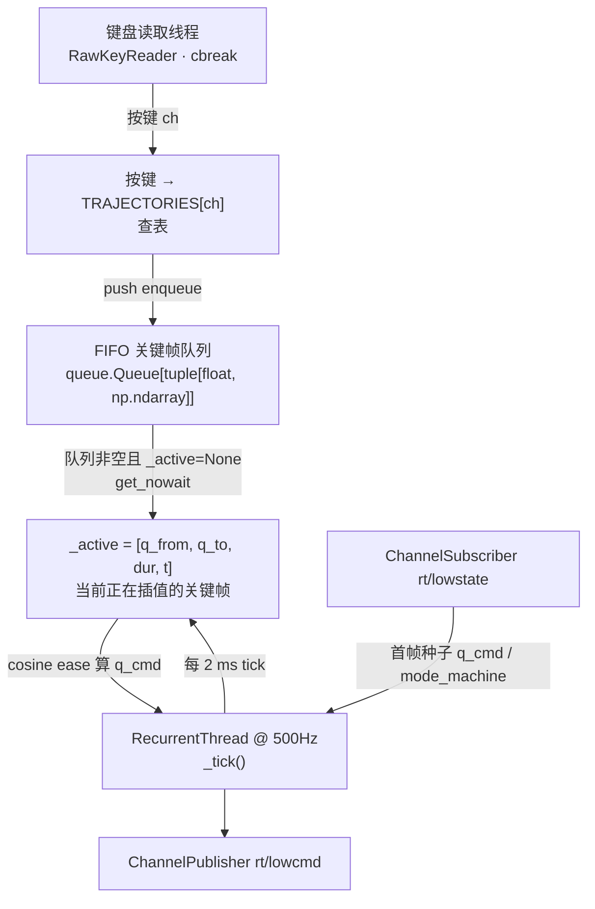

### 3.2 余弦缓入缓出（关键算法）

把"从 $q_{\text{from}}$ 在 $T$ 秒内平滑到 $q_{\text{to}}$"展开：

$$
s(t) \;=\; \frac{1 - \cos(\pi t / T)}{2},\quad t\in[0,T],\quad s\in[0,1]
$$

$$
q_{\text{cmd}}(t) \;=\; (1-s)\,q_{\text{from}} \;+\; s\,q_{\text{to}}
$$

**为什么用余弦而不是线性？**

- 线性插值 $q(t) = q_{\text{from}} + (q_{\text{to}}-q_{\text{from}})\,t/T$ 的导数是常数，**起步瞬间速度有阶跃**；
- 余弦插值的导数 $\dot q(t) = \tfrac{(q_{\text{to}}-q_{\text{from}})\,\pi}{2T}\sin(\pi t/T)$ 在 $t=0,T$ 都为 0，**起步与落点都没有速度跳变**——电机不会被狠抽一下，PD 控制器也不会饱和。

源码 `g1_sim_interactive.py:275-278`、`g1_sim_keyboard.py:520-522`。

### 3.3 关键帧调度状态机（每 2 ms）

```mermaid
stateDiagram-v2
    [*] --> Wait_State: 启动后等首帧 lowstate
    Wait_State --> Idle: first_state_received=True<br/>q_cmd ← measured pose
    Idle --> Active: queue 非空 → pop (dur, q_to)<br/>_active ← [q_cmd.copy(), q_to, dur, 0]
    Active --> Active: t += 2ms<br/>q_cmd = (1-s)q_from + s·q_to
    Active --> Idle: t ≥ dur<br/>q_cmd ← q_to; _active=None
    Active --> Active_with_PD: 每 tick 末尾<br/>publish(q_cmd) → rt/lowcmd
    Active_with_PD --> Active
```

队列空且当前帧结束时，控制器**保持最后一帧 q_cmd 持续输出**——动作不会"消失"，机器人就停在那里。

### 3.4 已实现的动作（`g1_sim_keyboard.py` 全表）

| 键 | 名称 | 涉及关节（PR 索引） | 主要角度 |
|---|---|---|---|
| `z` | zero pose | 全部 29 | 全 0 |
| `w` | wave right | 22, 23, 25 | sP=−0.4, sR=−1.2, elbow=1.4 |
| `e` | wave left | 15, 16, 18 | 镜像 |
| `u` | hands up (cheer) | 15, 22 | 双肩 pitch=−1.6 |
| `t` | T-pose | 16, 23 | 双肩 roll=±1.5 |
| `s` | salute | 22, 23, 25, 27 | sP=−0.6, sR=−0.4, e=1.55, wP=−0.3 |
| `a` | clap (双臂拍两次) | 15, 16, 18, 22, 23, 25 | 节奏序列 |
| `h` | hug | 15, 16, 18, 22, 23, 25 | 双臂内合 |
| `g` | boxer guard | 同 hug，elbow=1.4 | 拳击防守 |
| `p` | punch (jab L+R) | 15-18, 22-25 | 防守 → 右拳 → 防守 → 左拳 → 防守 |
| `b` | bow (waist pitch) | 14 | wP=0.5 |
| `[` `]` | lean L/R | 13 | wR=±0.35 |
| `,` `.` | twist L/R | 12 | wY=±0.5 |
| `k` `l` | lift L/R knee | 0/3/4 或 6/9/10 | hP=−1.0, knee=1.6, aP=−0.5 |
| `c` | squat (双腿) | 0,3,4,6,9,10 | hP=−0.8, knee=1.3, aP=−0.5 |
| `v` | right kick | 6, 9, 10 | hP=−1.4, knee=0.4, aP=−0.3 |
| `r/i` | reset to init pose | 全部 29 | 启动时实测姿态 |
| `x` | soften（Kp/Kd 衰减到 0） | — | 紧急软化，常用于退出前 |
| `+/-/=` | duration scale | — | 慢放/快放/复位 |
| `q` | quit | — | 先回零位再退出 |

#### 安全约束（每个 pose 内部都遵循）

- shoulders / elbows : $|q| \le 1.6$ rad
- hips / knees / ankles : $|q| \le 1.6$ rad
- waist : $|q| \le 0.5$ rad

**关键限制：这套 demo 必须挂着悬挂带跑**——它没有任何平衡反馈（不读 IMU、不算重心）。腿部动作（`k`、`l`、`c`、`v`）只是"在挂着的状态下做出来的姿态"，把绳子剪了立刻摔。

### 3.5 软化 / 慢放等增强功能（`g1_sim_keyboard.py` 独有）

#### 软化（soften）

按 `x` 触发：

```python
steps = duration / control_dt
self._soften_step = (target_scale - self.kp_scale) / steps
```

每个 tick 把 `kp_scale` 线性向 `target_scale=0` 推一步；publish 时 `kp = Kp[i] * kp_scale`。整段在 1.5 s 内把伺服强度推到 0，机器人由弹簧/重力托住缓慢瘫下。

#### 持续帧 hold

```python
def hold(pose, t):
    return (t, pose.copy())
```

把同一个 pose 加入队列两次（一次"过去"、一次"停住"），插值在第二段什么都不变，效果就是"在那个姿态保持 t 秒"。

#### 时间缩放

```python
self._queue.put((float(dur) / max(self.duration_scale, 1e-3), pose))
```

`+` 把 `duration_scale` 乘 0.7 → 时间变长 → 慢放；`-` 乘 1.4 → 加速；`=` 复位。

---

## 4. `g1_sim_rl_walk.py`：闭环 RL 速度跟踪（50 Hz）

这是从"开环 PD 摆 pose"到"闭环全身控制"的范式跃迁。所有走、转、原地站都在这里实现。

### 4.1 为什么走路必须用 RL（而摆 pose 不用）

摆 pose 是一个**纯静态运动学问题**——目标姿态本身就是机械稳定的，给 PD 一个目标角度它就能维持。

走路 / 跑步是一个**混合系统下的高维动态最优控制问题**：

1. **欠驱动 + 浮基**：29 个电机控制不了重心（重心由地面反作用力间接决定），所有人形步行的根本难点；
2. **接触不连续**：脚一会着地一会离地，动力学方程在每次足底切换时都换一组（左单支撑 / 双支撑 / 右单支撑 / 飞行相）；
3. **强非线性**：$M(q)\ddot q + C(q,\dot q)\dot q + G(q) = \tau + J^{T}f_{\text{ext}}$，其中 $M$ 是 29×29 的耦合质量矩阵；
4. **必须实时反馈**：阵风、地面打滑、1 cm 凸起都会让规划好的轨迹失效。

传统方法（ZMP / WBC + QP / MPC）能写但代价巨大，且强烈耦合到具体机型 / 步态 / 地形。RL 只需要写"奖励函数 + 仿真环境 + 域随机化"，PPO 在 4096 个并行 G1 上训出来一个 MLP，跨机型可复用。

### 4.2 整体流水线

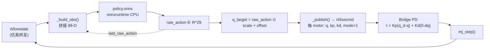

控制周期 $\Delta t = 0.02$ s（50 Hz），由 `cfg.step_dt` 来自 `deploy.yaml`。

### 4.3 98 维观测向量（精确逐位）

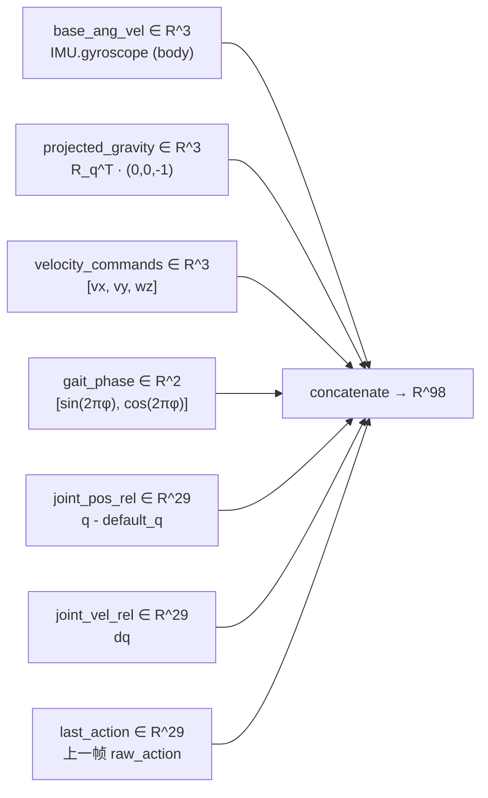

#### 各分量的精确公式

**1) 基座角速度**：直接读 `low_state.imu_state.gyroscope[0:3]`，body frame。

**2) Projected gravity**——把世界系单位重力 $g_w=(0,0,-1)$ 旋到 body 系：

设 IMU 四元数为 $q=(w,x,y,z)$（Unitree LowState 用 wxyz 顺序）。Body 在世界中的姿态满足 $v_w = R(q)\,v_b$，所以 $v_b = R(q)^T v_w$。等价于"用 $q$ 的共轭 $q^* = (w,-x,-y,-z)$ 去旋 $v_w$"。

代码用 Rodrigues 形式，对纯向量 $v$ 实现 $v' = q^*\,v\,q$：

```python
t = 2 * cross(q.xyz, v)
v' = v - w*t + cross(q.xyz, t)         # = R(q)^T · v
```

源码 `g1_sim_rl_walk.py:179-191`、`g1_sim_rl_combo.py:238-247`。

**直觉**：站立时 $g_b \approx (0,0,-1)$；前倾 30° 时 $g_b \approx (0.5, 0, -0.87)$ —— 策略由此感知"我倒向哪个方向"。

**3) Velocity commands**：用户键盘输入的 $[v_x, v_y, \omega_z]$。

**4) Gait phase**——人为注入的"步态相位"：

$$
\varphi(t+\Delta t) = \bigl(\varphi(t) + \Delta t / T_{\text{gait}}\bigr) \bmod 1,\quad T_{\text{gait}} = 0.6\text{ s}
$$

策略看到的不是 $\varphi$ 本身，而是它的正余弦嵌入：

$$
\text{gait\_phase} =
\begin{cases}
(0,0), & \|cmd\|_2 < 0.1 \quad\text{(站立时不要求节拍)}\\
\bigl(\sin 2\pi\varphi,\ \cos 2\pi\varphi\bigr), & \text{otherwise}
\end{cases}
$$

源码 `g1_sim_rl_walk.py:374-384`、`g1_sim_rl_combo.py:835-842`。

**5) Joint pos rel**：$q_i^{\text{rel}} = q_i^{\text{meas}} - q_i^{\text{default}}$，下面 4.4 给出 default 的数值。

**6) Joint vel rel**：直接读 `motor_state[i].dq`（速度本身没有 default，所以 rel 就是 raw）。

**7) Last action**：上一帧的 **raw**（未乘 scale、未加 offset）策略输出。第一拍初始化为 0。

### 4.4 部署参数（`deploy.yaml` 全表）

```yaml
step_dt: 0.02                         # 50 Hz
gait_phase.params.period: 0.60        # 0.6 s/拍
commands.base_velocity.ranges:
  lin_vel_x: [-0.5, 1.0]              # ← "f" 键打到 1.0 m/s 上限
  lin_vel_y: [-0.5,  0.5]
  ang_vel_z: [-1.0,  1.0]

stiffness (Kp): [40.2, 99.1, 40.2, 99.1, 28.5, 28.5,    # 左腿
                 40.2, 99.1, 40.2, 99.1, 28.5, 28.5,    # 右腿
                 40.2, 28.5, 28.5,                      # 腰
                 14.3, 14.3, 14.3, 14.3, 14.3, 16.8, 16.8,   # 左臂
                 14.3, 14.3, 14.3, 14.3, 14.3, 16.8, 16.8]   # 右臂

damping (Kd):   [2.6, 6.3, 2.6, 6.3, 1.8, 1.8,
                 2.6, 6.3, 2.6, 6.3, 1.8, 1.8,
                 2.6, 1.8, 1.8,
                 0.9, 0.9, 0.9, 0.9, 0.9, 1.1, 1.1,
                 0.9, 0.9, 0.9, 0.9, 0.9, 1.1, 1.1]

default_joint_pos: [-0.1, 0,    0,    0.30, -0.20, 0,    # 左腿（轻微屈膝）
                    -0.1, 0,    0,    0.30, -0.20, 0,    # 右腿
                     0,    0,    0,                       # 腰
                     0.35, 0.18, 0,    0.87, 0,    0, 0,  # 左臂（前伸 + 肘弯）
                     0.35,-0.18, 0,    0.87, 0,    0, 0]  # 右臂

action.scale (per-joint):
            [0.55, 0.35, 0.55, 0.35, 0.44, 0.44,         # 左腿
             0.55, 0.35, 0.55, 0.35, 0.44, 0.44,         # 右腿
             0.55, 0.44, 0.44,                           # 腰
             0.44, 0.44, 0.44, 0.44, 0.44, 0.07, 0.07,   # 左臂（wrist_pitch/yaw 极小！）
             0.44, 0.44, 0.44, 0.44, 0.44, 0.07, 0.07]   # 右臂
action.offset == default_joint_pos
```

### 4.5 动作映射

策略输出 raw action $\mathbf a \in \mathbb R^{29}$（训练时大致 $\in[-1,1]$），部署时：

$$
q_i^{\text{target}} \;=\; a_i \cdot s_i \;+\; o_i
$$

其中 $s_i$ = `action.scale[i]`，$o_i$ = `action.offset[i]` = `default_joint_pos[i]`。换句话说：

$$
q_i^{\text{target}} \in \bigl[\,o_i - s_i,\ o_i + s_i\,\bigr]
$$

策略本质是在"默认姿态周围一个小盒子里"探索；策略的 raw action 不是"绝对关节角"而是"相对于 default 的归一化偏移"。

源码 `g1_sim_rl_walk.py:335`、`g1_sim_rl_combo.py:682`。

### 4.6 启动序列（boot ramp）

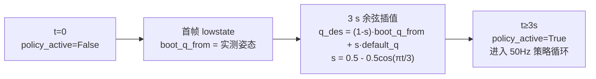

**意义**：策略训练的初始 obs 都假定 $q \approx q_{\text{default}}$。如果上来就跑策略，关节角偏离很大、`joint_pos_rel` 离训练分布远，MLP 输出炸开。boot ramp 强制把姿态先摆到 default 再交给策略。源码 `g1_sim_rl_walk.py:316-328`。

`g1_sim_rl_combo.py` 把 boot 时长加到 5 s 并增加 **kp_scale 同步软化**：

$$
\text{kp\_scale}(t) \;=\; k_{\min} + (1 - k_{\min})\,\frac{1 - \cos(\pi t / T_{\text{boot}})}{2}, \quad k_{\min}=0.3
$$

这样 PD 拉力也是从 30% 平滑爬到 100%，避免初始姿态远离 default 时 PD 把机器人甩出去。源码 `g1_sim_rl_combo.py:670-676`。

### 4.7 安全网

#### 看门狗

```python
if time.monotonic() - last_state_time > 0.2:
    self._publish(default_q)   # 仿真挂了就锁回 default
    return
```

源码 `g1_sim_rl_walk.py:312-315`。

#### 软退出

按 `space` 或 `x`：

```python
self.soften(target_scale=0.0, duration=1.0)
```

每 tick 按 `kp_scale += step` 把 PD 增益线性推到 0，机器人由重力慢慢瘫倒，避免硬掉电的"砸地"。源码 `g1_sim_rl_walk.py:263-267`。

#### 命令裁剪

`set_command()` 把用户输入裁到 `vx_range / vy_range / wz_range`，永远不会让策略看到训练范围外的速度命令。

### 4.8 键位

| 键 | 含义 | 命令变化 |
|---|---|---|
| `w` `s` | 前进 / 后退 | $v_x$ ± 0.2 m/s |
| `a` `d` | 左 / 右平移 | $v_y$ ± 0.1 m/s |
| `q` `e` | 左 / 右转身 | $\omega_z$ ± 0.3 rad/s |
| `r` | 立刻停 | $(v_x, v_y, \omega_z) \leftarrow (0,0,0)$ |
| `f` | 全速前进 | $v_x \leftarrow 1.0$ m/s（训练上限） |
| `space` | 软关 | Kp/Kd 在 1 s 内拉到 0 |
| `x` / Ctrl-C | 退出 | 软关后停止发 lowcmd |

> **"跑"的边界**：本策略训练区间 $v_x \in [-0.5, 1.0]$ m/s，所以按 `f` 是"快走 1 m/s"，**不是真的跑**（>2 m/s）。要真跑需要用 `unitree_rl_mjlab/scripts/train.py` 把上限放宽重训。

---

## 5. `g1_sim_rl_combo.py`：RL 步行 + 上半身手势叠加（最终形态）

这是本目录最复杂、最有价值的成果。它解决了一个看似简单实则非常深刻的问题：**如何让一个由 RL 策略闭环控制的人形机器人，在保持站立 / 行走的同时，听从用户的键盘命令做出预设的上半身手势**？

### 5.1 为什么不能直接把两个 demo 同时跑？

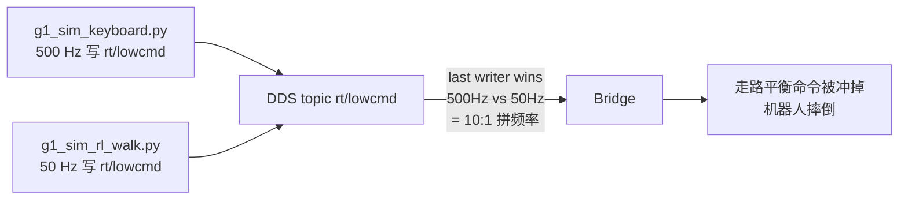

DDS 的 "last writer wins" 语义 + 频率不一致 = 控制不可预测。**根本解法**：单进程合并、单 publisher。

### 5.2 控制权分割

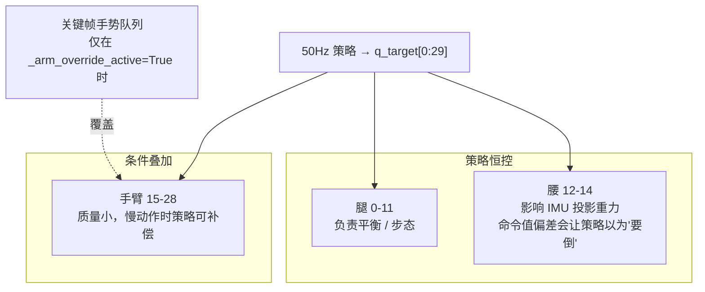

**为什么腿和腰不能覆盖？**
- 腿：负责平衡，覆盖即摔；
- 腰：腰角直接影响 `projected_gravity`（IMU 在躯干上），命令一个腰倾会让策略错认"我快倒了"，输出错误的腿部修正力矩。

**为什么手臂可以覆盖？**
- 手臂占整机质量 < 5%，慢速动作的角动量扰动可以被腿/腰策略实时补偿。

### 5.3 两条致命的 OOD 通路（必须同时堵住）

这是 QA5 文档里反复强调的核心。**naïve 实现会两次让机器人乱飞**：

#### 通路 A：手势姿态超出训练分布

策略训练时 $q_i^{\text{rel}} \approx s_i \cdot a_i$，$a_i \in [-1,1]$，加上 weak pose-deviation reward → 实测 `joint_pos_rel` 集中在 $[-s_i,+s_i]$。如果用绝对角度写一个 hands_up = $-1.6$ rad（default 0.35 rad），那 $q^{\text{rel}}=-1.95$，$|q^{\text{rel}}|/s_i = 1.95/0.44 \approx \mathbf{4.4}$，是训练分布的 4 倍多。

**MLP 不是模块化的**：任何一维输入 OOD，第一层激活就被推到训练时从未到过的方向，后续每一层都是非线性变换，最终 29 维输出全部变垃圾——包括腿。腿乱蹬 → 起飞。

#### 通路 B：`last_action` 与 `joint_pos_rel` 失配（更隐蔽）

训练时的隐含不变量：

$$
q_i^{\text{rel}}(t) \;\approx\; s_i \cdot a_i(t-1)
$$

（PD 闭环 + 一拍延迟。"我说要往哪走"和"实际走到哪"一致。）

如果 override 期间只改 q_target 不改 last_action，策略就看到："我上一拍说要往 +0.05 走，现在 joint_pos_rel 却是 −0.88" —— 这个组合训练时**根本不可能出现**。即使姿态被 clamp 进了边缘分布，这种 (last_action, joint_pos_rel) 失配本身也会让 MLP 失稳。

### 5.4 修复方案：四层防御

#### 修复 1：用 "delta · scale" 表达手势（结构性消除 OOD）

把每个手势写成 14 维 **delta 向量**，每个分量约束在 $[-K, +K]$，$K=2$。最终姿态：

$$
q^{\text{arm}} \;=\; q^{\text{rest}} \;+\; \boldsymbol\delta \odot \mathbf s_{\text{arm}}
$$

其中 $q^{\text{rest}}$ = `default_joint_pos[15:29]`，$\mathbf s_{\text{arm}}$ = `action_scale[15:29]`。

**收益**：
- wrist_pitch / yaw 的 scale 只有 0.07，写 $\delta=\pm 2$ 自动得到 $\pm 0.14$ rad，**自动避开了 wrist 小包络陷阱**；
- 写错系数也飞不出去，结构上保证 $|q^{\text{rel}}|/s = |\delta| \le 2$。

源码 `g1_sim_rl_combo.py:275-376`。

#### 修复 2：双层 envelope clamp

入队时（`push_arm_action`）和每 tick override 时都做：

$$
q^{\text{arm}} \leftarrow \operatorname{clip}\!\bigl(q^{\text{arm}},\ q^{\text{rest}} - K \mathbf s,\ q^{\text{rest}} + K \mathbf s\bigr)
$$

源码 `g1_sim_rl_combo.py:722-730`。

#### 修复 3：**合成等效 `last_action`**（修复的核心）

override 期间，把 `last_raw_action[15:29]` 改写成与实际发布的 q_target 一致的等效 raw action：

$$
a_i^{\text{arm}} \;=\; \operatorname{clip}\!\Bigl(\frac{q_i^{\text{arm}} - o_i}{s_i},\ -K,\ +K\Bigr)
$$

这样下一拍 obs 里的 (joint_pos_rel, last_action) 重新满足训练时的不变量 $q^{\text{rel}} \approx s\cdot a$，策略就当作"我上一拍就说要走到这儿，确实走到了，正常"。

源码 `g1_sim_rl_combo.py:709-715`。

#### 修复 4：速率限幅（防止短 duration 触发 joint_vel 尖峰）

$$
|\Delta q_i^{\text{arm}}| \;\le\; R \cdot s_i \cdot \Delta t,\quad R = 4\,\text{/s}
$$

50 Hz 下 $\Delta t = 0.02$，肩部最大 $|\Delta q| \le 4 \times 0.44 \times 0.02 \approx 0.035$ rad/tick → 1.76 rad/s。这个速度量级在训练数据里偶尔能看到（走路转身时），所以是 in-distribution。

源码 `g1_sim_rl_combo.py:732-747`。

### 5.5 完整状态机

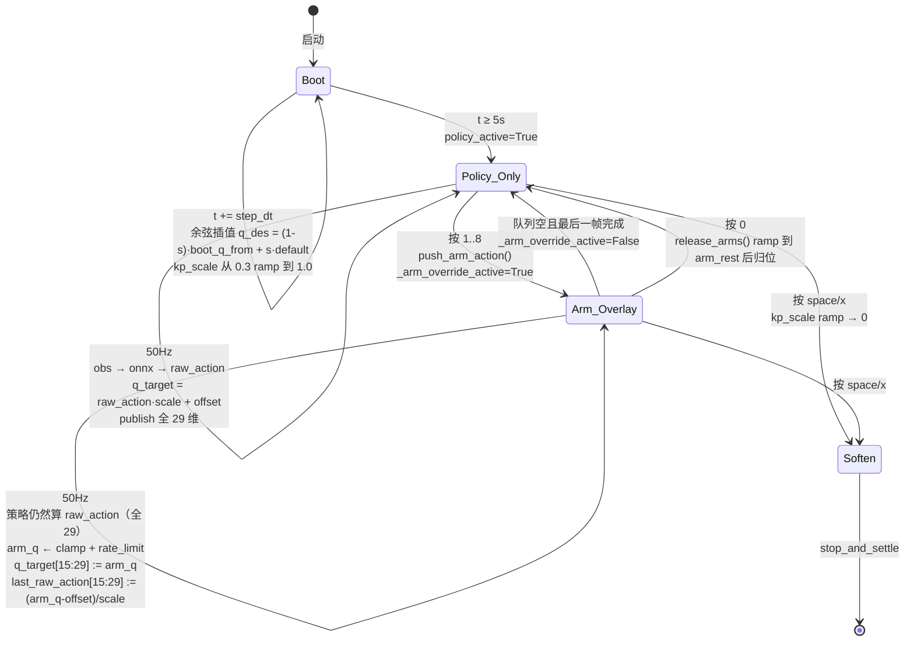

### 5.6 单 tick 数据流（最详细版）

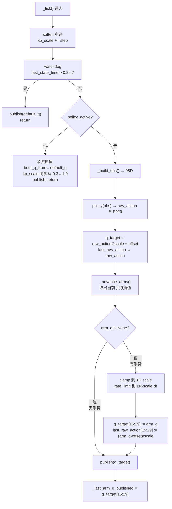

### 5.7 已实现的手势（每一个 max|delta| ≤ 2.0）

| 键 | 名称 | 关键 delta（单位 = scale） | max\|δ\| |
|---|---|---|---|
| `1` | wave right arm | RsP=−2, RsR=−2, Re=+1 | 2.0 |
| `2` | wave left arm | LsP=−2, LsR=+2, Le=+1 | 2.0 |
| `3` | hands up (cheer) | LsP/RsP=−2, Le/Re=−1 | 2.0 |
| `4` | T-pose | LsR=+2, RsR=−2 | 2.0 |
| `5` | salute | RsP=−1.5, RsR=−1, Re=+1.5, RwP=−2 | 2.0 |
| `6` | clap (twice) | 双肩 pitch=−1.5, 肘弯=+1 | 1.5 |
| `7` | boxer guard | 双肩 pitch=−1.2, roll=±1, 肘弯=+1.5 | 1.5 |
| `8` | punch combo (jab L+R) | guard → 右臂 pitch=−2, 肘=−1.5 → guard → 左 → guard | 2.0 |
| `0` | release arms | 平滑 1.5 s 回到 arm_rest | — |

### 5.8 行为预期（QA5 验收表）

| 场景 | 行为 |
|---|---|
| 站立 cmd=0 | 站得住，双臂自然垂在策略默认姿态 |
| `wsadqe` 走 / 转 | 正常步行 / 转向，手臂自然摆 |
| 站立 + 任意手势 1..8 | 手臂动作期间躯干稳如老狗，归位后回到策略 |
| **走路时按 1（边走边挥手）** | 一边走一边挥；手势归位后腿继续走，不丢节奏 |
| **走路时按 4（边走边展 T）** | 边走边展；展开 1 s 内手臂归位 |
| **q + 8 联动**（边转边挥拳） | 转身 + 拳击；动作叠加无失稳 |
| 按 `0` | 立刻取消手势，手臂软回策略默认 |
| 按 `space` | Kp 1 s 软关，机器人慢慢瘫到地上 |

### 5.9 边界 / 不能做的事

| 想做 | 能否 | 原因 |
|---|---|---|
| 边走边挥手 / 敬礼 / 拍手 | ✅ | 手臂动作幅度小、慢，策略能补偿 |
| 边走边深蹲 | ❌ | 深蹲改腿，本 demo 不允许覆盖腿关节 |
| 边走边鞠躬 | ⚠️ | 鞠躬改腰；腰直接影响 IMU 重力投影，会让策略以为"快倒了" |
| 站立时摆 T-pose | ✅ | 手臂展开重心几乎不动 |
| 走路时极速出拳 | ⚠️ | 速度太快会让 obs 突变；建议先停步再出拳 |

---

## 6. 仿真侧打滑修复（`scene_29dof.xml`）

QA5 同步发现：上游 `g1_29dof.xml` 的脚是 4 个 `size=0.005` 小球、`condim=3`（无切向力矩），地面摩擦默认 1.0；训练侧 MJCF 是 7 段 `condim=6 priority=1` 胶囊。两边接触模型不一致 → "脚跟着地内八字打滑"。

修复（只动 scene 文件）：

```xml
<geom name="floor" size="0 0 0.05" type="plane" material="groundplane"
      friction="1.5 0.05 0.005" condim="6" priority="1"/>
```

- `priority=1`：contact 摩擦完全用 floor 设置（脚 priority 默认 0）；
- `condim=6`：启用全部 6 自由度摩擦（含 torsional + rolling），**关键**就在它；
- `friction="1.5 0.05 0.005"`：sliding 1.5（训练随机化中上）、torsional 0.05（默认的 10×）、rolling 0.005（默认的 50×）。

效果：内八字打滑显著减少；高速 yaw（$\omega_z=\pm 0.9$）下不再"脚滑出去几厘米"；站立 cmd=0 微抖更小。

---

## 7. 真机迁移（"sim → real" 的唯一改动）

所有 5 个脚本都做了同一件事：

```python
if len(sys.argv) > 1 and sys.argv[1] not in ("lo", "sim"):
    ChannelFactoryInitialize(0, sys.argv[1])    # 真机：domain 0 + 网卡名
else:
    ChannelFactoryInitialize(1, "lo")           # 仿真：domain 1 + lo
```

```bash
python g1_sim_rl_combo.py            # 跑仿真
python g1_sim_rl_combo.py enp3s0     # 跑真机
```

**真机额外注意**（demo 没替你处理）：
1. 务必先关掉真机的 `MotionSwitcher` 服务，否则会跟你的 `LowCmd_` 打架；
2. 第一帧前必须从 lowstate 读到的 `mode_machine` 原样回填到 `low_cmd.mode_machine`，否则被拒收（demo 已做）；
3. 真机不需要悬挂带，但必须保证 zero / default pose 在站立姿态附近且机器人稳定，否则 PD 一上立刻摔；
4. CRC 必须在每次 `Write` 前算（demo 已做）。

---

## 8. 量化成果汇总

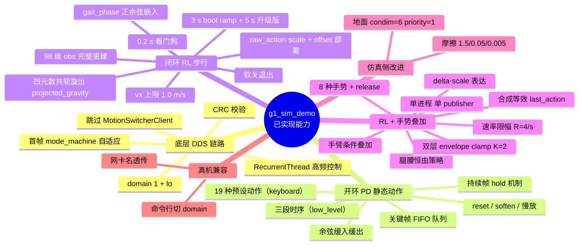

| 维度 | 数值 / 范围 |
|---|---|
| 控制频率（开环） | 500 Hz |
| 控制频率（RL） | 50 Hz |
| 仿真物理步长 | 5 ms |
| Obs 维度 | 98 |
| Action 维度 | 29 |
| 步态周期 | 0.6 s |
| 速度训练范围 | $v_x \in [-0.5, 1.0]$, $v_y \in [-0.5, 0.5]$, $\omega_z \in [-1, 1]$ |
| 手势安全包络 | $\pm 2 \cdot s_i$（per-joint） |
| 手势速率上限 | $4 \cdot s_i$ rad/s |
| Boot ramp（RL combo） | 5 s + Kp 从 30%→100% 同步爬升 |
| 看门狗超时 | 0.2 s |
| 已实现手势 / 动作 | 8 (combo) + 19 (keyboard) = 27 种 |

---

## 9. 一页脚本能力对照

| 能力 | low_level | interactive | keyboard | rl_walk | rl_combo |
|---|:-:|:-:|:-:|:-:|:-:|
| 跑通 sim DDS | ✓ | ✓ | ✓ | ✓ | ✓ |
| 跳过 MotionSwitcher | ✓ | ✓ | ✓ | ✓ | ✓ |
| 余弦插值 | — | ✓ | ✓ | ✓（boot） | ✓（boot + 手势） |
| 键盘交互 | — | ✓ | ✓+ | ✓ | ✓+ |
| RL 闭环平衡 | — | — | — | ✓ | ✓ |
| 站立 / 行走 / 转身 | — | — | — | ✓ | ✓ |
| 上半身预设动作 | — | 5 | 19 | — | 8 |
| 边走边手势 | — | — | — | — | ✓ |
| 关节级 reset / soften | — | — | ✓ | ✓ | ✓ |
| 真机一行切换 | ✓ | ✓ | ✓ | ✓ | ✓ |
| 必须挂悬挂带 | 是 | 是 | 是 | 否 | 否 |

---

## 10. 一页源码定位（按文件:行号）

| 主题 | 位置 |
|---|---|
| Bridge PD 公式 | `unitree_mujoco/simulate_python/unitree_sdk2py_bridge.py:LowCmdHandler` |
| 三段开环时序 | `g1_sim_low_level.py:136-194` |
| 余弦插值 | `g1_sim_interactive.py:275-278`、`g1_sim_keyboard.py:520-522` |
| 键盘动作表 | `g1_sim_keyboard.py:306-385` |
| 软化 / 慢放 | `g1_sim_keyboard.py:467-473`、`441-447` |
| 98 维 obs 构造 | `g1_sim_rl_walk.py:340-394`、`g1_sim_rl_combo.py:803-852` |
| 四元数共轭旋出 gravity | `g1_sim_rl_walk.py:179-191` |
| Action scale + offset | `g1_sim_rl_walk.py:335`、`g1_sim_rl_combo.py:682` |
| Boot ramp | `g1_sim_rl_walk.py:316-328`、`g1_sim_rl_combo.py:662-677` |
| 看门狗 | `g1_sim_rl_walk.py:312-315`、`g1_sim_rl_combo.py:657-660` |
| 软退出 | `g1_sim_rl_walk.py:263-267`、`g1_sim_rl_combo.py:606-610` |
| Combo 手势 delta · scale | `g1_sim_rl_combo.py:275-376` |
| Envelope clamp | `g1_sim_rl_combo.py:722-730` |
| 等效 last_action 合成 | `g1_sim_rl_combo.py:709-715` |
| 速率限幅 | `g1_sim_rl_combo.py:732-747` |
| 手势状态机 | `g1_sim_rl_combo.py:761-801` |
| Floor friction 修复 | `unitree_mujoco/unitree_robots/g1/scene_29dof.xml:floor geom` |

---

## 11. 一句话总结

我们在不修改 `unitree_sdk2_python` / `unitree_mujoco` / `unitree_rl_mjlab` 三个上游仓库（除一个 scene 文件的接触参数）前提下，把 G1 在 MuJoCo 仿真里的全部三种控制范式都做出了**端到端、键盘可交互、能直接换网卡名上真机**的演示版本：

1. **开环 PD 静态动作**（`low_level` / `interactive` / `keyboard`）—— 19 种预设姿态，余弦平滑、关键帧调度、reset / soften / 慢放；
2. **闭环 RL 速度跟踪步行**（`rl_walk`）—— 加载 ONNX 部署策略，完整重建 98 维 obs（含四元数旋出 projected_gravity、人为 gait phase 注入、relative joint pos/vel、last raw action），映射回 29 维 PD 目标；`wsadqe` 全速度命令、3 秒 boot ramp、看门狗、软退出；
3. **闭环 RL + 关键帧手势叠加**（`rl_combo`）—— 单进程单 publisher 避免 DDS 冲突，腿腰恒由策略，手臂条件叠加；用 `default + delta·scale` 表达手势 + envelope clamp + **合成等效 last_action** + 速率限幅四层防御，把"OOD 输入毁掉策略"这条老坑结构性地堵死，实现真正的"边走边挥手"。

附带把仿真侧的脚-地接触模型（`condim=3` → `condim=6`）补齐到训练侧水平，"内八字打滑"显著减轻。

下一阶段（如果需要）：用 `unitree_rl_mjlab/scripts/train.py` 把 $v_x$ 上限放宽 + 加 `commanded_waist_pitch` observation/reward，重训出能"真正跑"且"边走边鞠躬"的策略；或把 `g1_sim_rl_combo.py` 的手势 overlay 接入 VR / 遥操作 / VLM 上层指令，做 AGI 级别的 high-level command → low-level execution 链路。
